# B站首推！建议所有想参加CTF夺旗赛的同学，死磕这条视频，2024年字节大佬花一周时间整理的CTF入门保姆级教程！从入门到入狱（web渗透／PHP基／SQL注） - P20：2、文件上传第一关 - CTF入门教学 - BV1JjeJeYE2p

好，接下来我们就针对于这个upload靶场跟大家进行讲解。那首先我们拿到这个工具包进行给它解压。那解压之后呢，就是这个文件夹。这个文件夹里面还有一个文件夹，那我们把这个文件夹干嘛呢？把它拷贝啊。

把它拷贝拷贝到哪里去呢？我这边就放到桌面上面新建一个文件夹。那文件夹的话呢，一定要注意，不能是什么呢？不能是中文的啊，这个一定要注意的，我给它取个名字twice。然后把这个。

文件夹是吧这个靶唱放到这个ts里面。OK好，这是第一步。那么第二步呢怎么办呢？不是刚才跟大家提过了，有需要我们这个PHP study吗，对不对？好，PHP study在哪里呢？也是在这个靶场里面。好。

我们把它打开打开之后，这边有一个PHP study eX1对吧？好，这个呢是集成了这个靶场的啊这个环境。那么首先看到这个PHP study点EXE就不用不用手抖不用激动。哎。

我们首先第一步还是得打开这个BAT啊，得运行一下这个BAT好，运行一个BAT之后啊，它会提示你哎已经移动的一个文件修改完毕按任意键继续，我们随便按一个啊关掉，关掉之后呢。

然后我们再来启动这个PHP study点EXE啊启动好了之后，就这样一个状态啊。所以说嗯提供给到大家的一个工具里面已经给大家设置好了这个PHP的一个版本是5。2。17啊，所以说大家不需要去改动。好。😊。

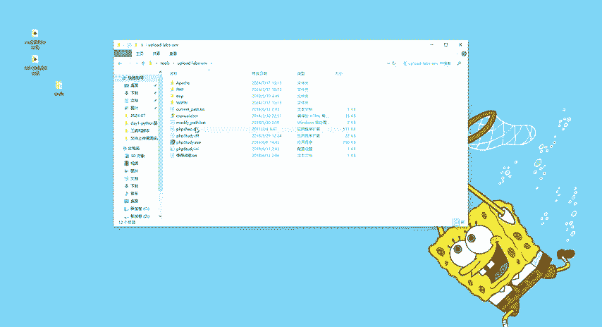

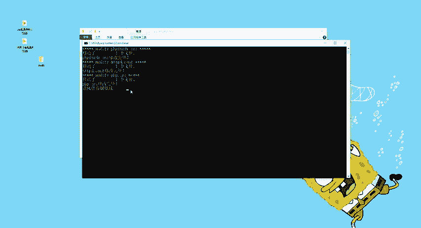

那么到了这个界面之后啊，到了这个界面之后，那接下来怎么办呢？安启动吗？不是我们首先来看一下它的一些路径啊，这个路径怎么去打开的呢？在其他选项菜单，我们看一下这个PHP study的一个设置。好。

那么这个网站的这个目录我们还是得改，否则会导致什么呢？导致我们这个PHP study这个阿帕奇服务啊运行不成功。好，怎么去改，我们就直接点击这个三个点啊。刚才是放在哪里的？放在tos对吧？

里面有一个upload，然后呢选择3W。好了，点击确定啊，是在C盘啊，users amin，然后。😊，什吧des top，你们啊一定要按照你们自己的路径去修改这个网站的目录。好，点击应用好了，保存成功。

启动。啊，保存成功之后，它会自动重启。重启之后呢，我们会发现这个阿帕奇啊，右边有一个绿色的按钮是吧？绿色的一个小灯一样的东西。那么绿灯亮了之后啊，基本上我们这个靶场啊。

我们这个PHP study就执行成功了。那么这个因为是不需要用到my circle的，所以说这个my circle这个服务是没有打开的，就是正常的情况，那如果说你遇到阿帕奇都没有打开。

my circle也没有打开，对吧？my circle可以忽略不计。那阿帕奇没有打开的话，大概率的情况就是PHP study里面这个目录没有设置好好了。😊，那么我们把PHP study给它搞定之后。

那接下来我们干嘛呢？我们还是打开我们这个括弧啊浏览器啊，怎么输呢？我们就输入local host。

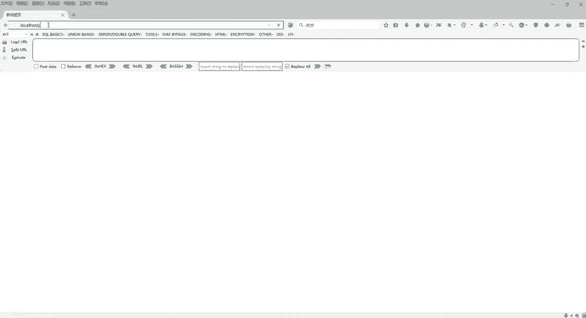

好，看到这个界面之后，我们这个靶场就已经搭建成功了。好，这边总共是1到20关啊，1到20关。那么首先第一个哎，我们就开始从第一关开始。好，那么具体的怎么去。通关啊具体怎么去通关啊，在这边呢我们。

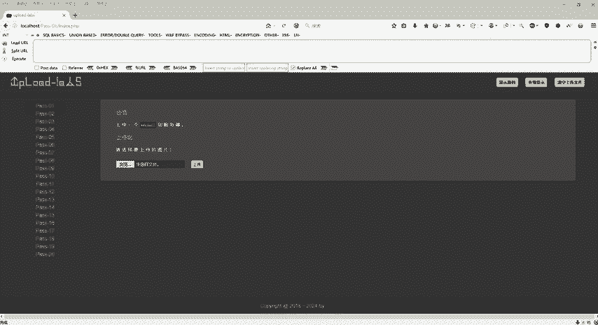

呃笔记啊，我们来看一下我们这个笔记文件上传漏洞的一些介绍啊，刚才都跟大家去介绍了，那么具体怎么样去做第一关是属于什么？第二关是属于什么？第三关是属于什么啊，这边都给大家提供好了啊。

有需要资料的同学可以评论区自取啊。😊，好，那么第一关它是pass01啊，就是我们这个第一关啊，是我们的GS绕过啊，但是呢这一关。有很多很多的绕过方式啊。这个思路也给大家提供好了。

这个思路呢主要是验证这个GS就是我们的前端验证很容易通过。那么具体怎么去通过呢？我们来看一看。

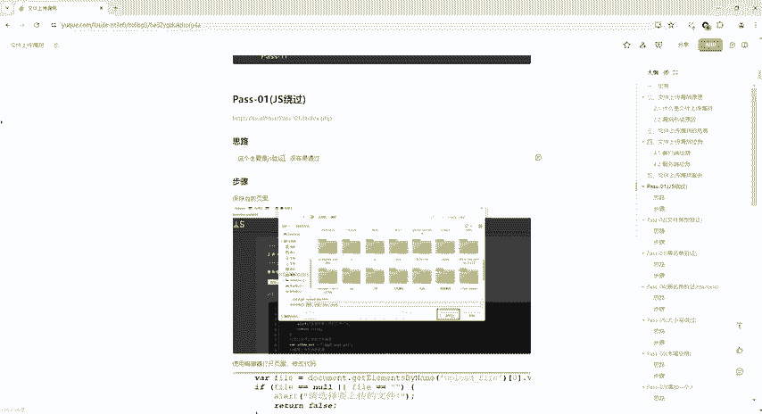

好，这里他说上传一个web share到我们这个服务器，那么请选择要上传的图片，对不对？那么我们浏览一下浏览什么呢？浏览我们刚才这个文件上传给大家提供的一些图片。那比如说我现在先传一个这个嗯。

imagine点PNG对不对？好，点击上传是不是就可以上传成功了。但是呢我们是要干什么？我是要上传一个web shell，并不是说真真正正的要上传图片。

我是要上传web shell或者上传一个木马病毒到服务器里面，然后我可以控制对方的服务器，对不对？好，那具体怎么做呢？我们可以在这里上传一个。in for点PHP这个呢也给到大家的啊，这个也是给大家的。

那么具体它里面写的什么呢？我们来看一下啊。

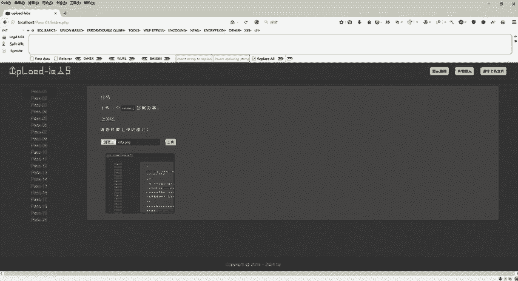

好，那么回到我们这个呃工具里面啊。

PHP啊，这里面主要写了什么呢？写的就是一个PHP in。那么PHP in的话就是默认的对吧？我可以知道你当前PHP的一些版本，然后知道你现在当前的一些目录啊，这个总的来说可以把它当做我们这个木马啊。

一句话木马。😊，啊，这是我们的代码啊，就那么多东西，我么具体怎么去上传啊，在这边都给你们提供好了，我们就直接按照这一步一步去上传就可以了。好。😊。

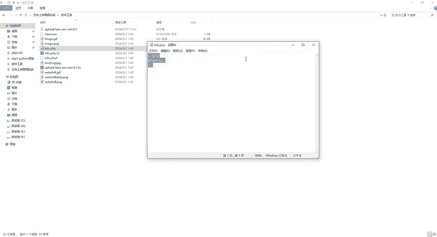

那么回到这个里面来，我们刚才选择了这个infer点PHP对不对？点击上传。哎，他说该文件不允许上传，请上传JPGPNG或者JF类型的有没文件。那么当前文件类型点PHP但它不让我上传，是不是啊？

那不让我上传，我怎么办呢？他刚才说了，它弹窗了，对不对啊？点击之后它弹窗了弹窗它是我们的一个前端验证。那我们是不是只要需要绕过这个前端就可以了，对不对？好，那怎么去绕过，那么我们怎么办呢？我们。

在这个界面上面啊，按住cttrorl S啊，cttrol S那么保存啊保存到我们这个桌面上面就可以了。好，正在下载。

那下载完成之后啊，我看一下桌面上面有没有啊。桌面上是不是有这个啊，我们看一下桌面是不是保存upload跟labels，对不对？啊，这个是什么呢？这个是它对应的CSS，还有我们的GES那怎么办？

我上传完了，对吧？我下载完了。😊。

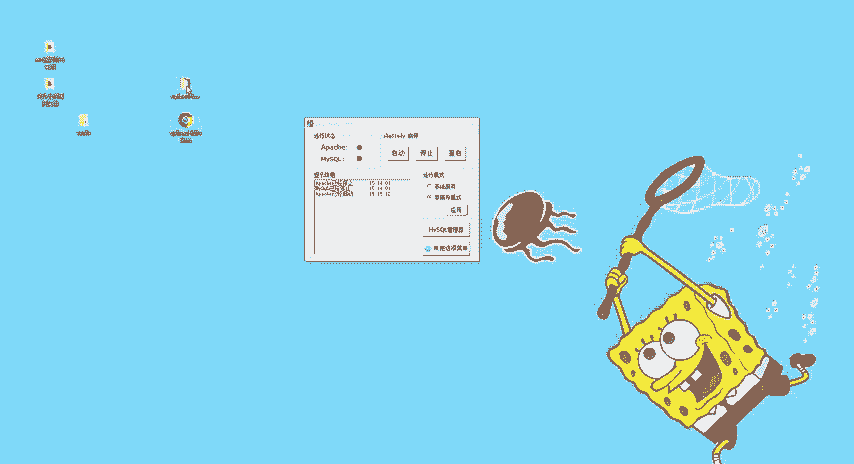

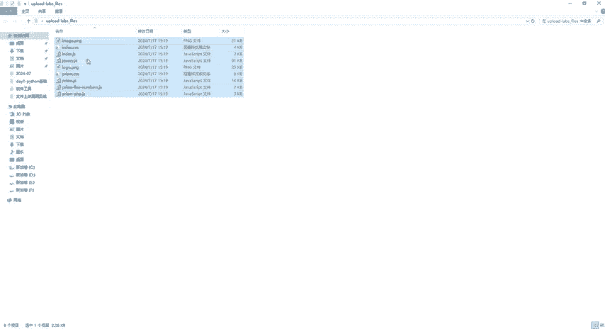

我上传完了之后，他不让我上传，但是我把这个页面给它保存起来，保存到我自己本地。然后呢，我们在这个窗口把这个给它拖到里面来。拖到里面来之后呢，我们仔细看一下啊，它这个界面是不是跟我这个界面是一模一样的。

对不对？好，但是关键一点啊，我们这个路径啊，这个路径不一样，是不是？好，这个是local host，这个是我们自己搭建好了的。这个呢是我们刚才下载下来的啊，这个两个。😊。

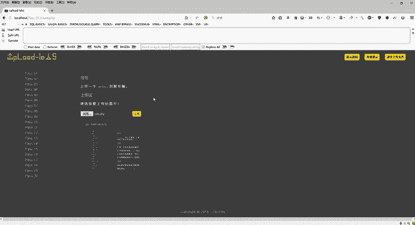

这个UL对吧？UIL这个地址一定要搞清楚。那么具体的怎么去。

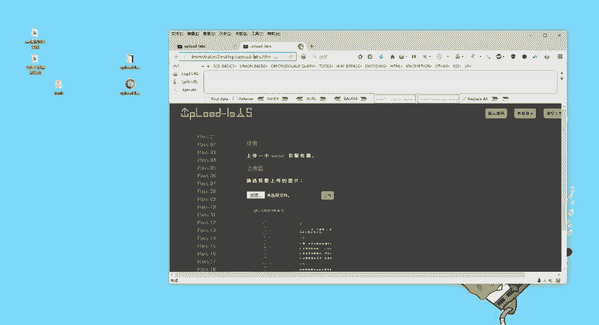

改动它啊，我们在这边也有给大家准备好了的。第一步干嘛，第二步干嘛，那么用编辑器打开我们这个页面进行修改代码。好，那它这个代码呢，我们已经下载到本地的，是不是好，我们右键打开啊，打开之后好。

这么多代码是不是好，同学们伙伴们对不对？都不知道怎么去改了，是不是对代码不熟悉的同学，那只要记到一个地方啊，我们来看一下这个地方啊，这个是我们的1个HTLCSS啊，😊。

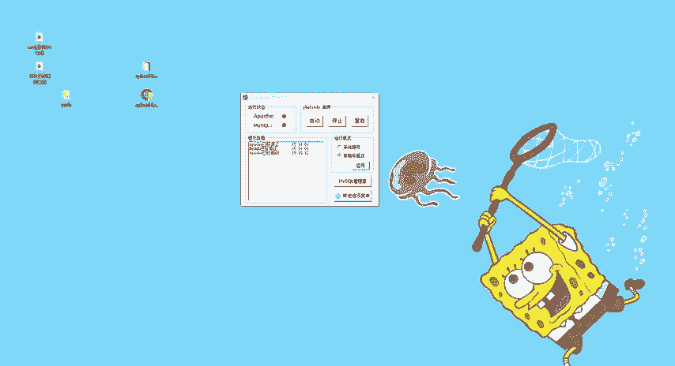

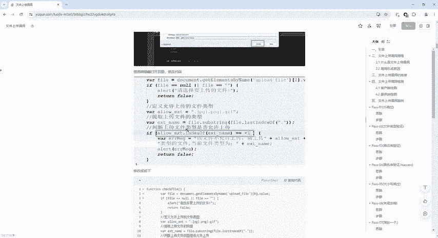

这里是不是有121直到20关，然后它分别连接的是local host啥啥啥，对不对？01021直到20好，具体要改什么呢？我们来看一下它因为它对前端做了个验证嘛，是不是？😊，对前端做了个验证。

那这里是不是请选择要上传的图片啊，请选择要上传图片之后，我们看一下它是有一个什么呢？有一个on sububm这个按钮的，对不对？好，然后看一下这里面一个方法。这个方法。

这个函数是check fill这个就是一个检查我们这个上传文件的一个方法。那么这个方法找到了之后，它是怎么去实现的呢？我们往下翻啊，往下翻，一翻到这个地方啊，是不是写了一个check fill。

然后在这个里面它写了一些代码，它进行了一系列的验证，对吧？比如说你上传是空，哎，请选择上传的文件，那么定义允许上传的一些文件类型，是JPGPNGJF那具体的那么接下来如果说你传的不是三种图片类型。

它是不是就不允许上传。那。具体怎么改呢？具体怎么改？判断上传文件类型是否允上传。他说，如果这个东西等等于负一的时候，就不应许上传，那我是不是可以把它改成什么呢？不满足条件。对不对？

这满足的条件是等于-一，它不让我上传。我让它不满足。那么如果if语句里面啊，if是如果的意思。如果这个条件不满足，是不是就走不到这里了。所以说我们要怎么改呢？改这个括号里面的，我随便给它改啊。

这里也给大家提供了一个思路啊，这边。是不是等于-一，我把它改一下，改什么呢？😊，一等等于-1，就把这个条件。变成真实的条件。还是假的条件？知不知道一等等于负一吗？各位一肯定是不等于负一的，是不是？

所以说这个条件为甲，那么条件为甲的话呢，这一段代码都不会。😊，去执行啊，所以说我们首先第一步把这个if条件给它。变为假的变为假的之后，那我们接下来还得改一个地方啊，还得改什么地方呢？

这地方是有啊要改这个form表单里面的，我要给它提交到哪里去，是不是？好，那这个代码在哪里呢？刚才跟大家看了一下啊，我们就是在这个地方是不是有一个checkfi。它这个里面呢是用一个post。😊。

对吧用一个pose的提交方式，那么它提交到哪去了呢？我不知道是不是啊。啊，如果想解到这个phone表单提交的话，它要有一个action啊，有个actionaction后面是写我们这个上传的地址。

那怎么去写，我们就直接干嘛呢？很简单，就把这一块啊。把这一块直接给它复制一下，复制到哪去呢？复知道这一块把这一整段给它改掉，改掉之后啊会发现。metd一样的啊，这个type是一样的。

on submeter是一样的，多了个什么呢？多了个action，这个action就是一个提交地址，就是我们点击按钮的时候，我们要把它提交到哪里去，是不是？好，刚才。😊，是不是？

上面是不是有一个local host，什么什么什么，也就我提交的时候，我还是提交到本地，是不是让它回到自己的一个页面上面去。那所以说我们要改改什么呢？把这个变成。😊，127。0。0。

1或者是locgo host就可以了。那我这里127。店。0。0。嗯。等一下啊。好啦。😊，127。0。0。是不写错了？看一下点0。0。1啊，127。0。0。1，这是本机的啊。

就是也可以跟look host是一样的啊。look host就它就是127。0。011啊，然后pass杠0101点 indexex点PHP啊，我们ctl S给它保存啊。

这是第二步那么那接下来我们把它关掉啊，关掉之后我们修改成功的，就是这个页面是不是那么还是一样的，把它呢给它拖到这里来。😊。

好，拖到这来之后啊，不要搞混了啊，拖到这来在第一关我要选择上传的文件，我直接干嘛呢？浏览上传我刚才的。软件工具里面有一个infer点PHP点击上传。好啦。😊，他还是不让我上传怎么办？不让我上传怎么办？

搞错了没有？各位。搞错了没？搞错了吗？地址错了吧，哎，所以一定要注意啊，把这个地址给它拖到这里来，拖到这里来之后浏览。😊，选中打开走是不是可以啦啊，所以说刚才呢这边啊。😊。

就是我一定要让大家要注意的地方，就是一定要注意啊，这是lookal host。这个呢是我们自己的就是我们本机地址上面的路径，这两个路径是不一样的。刚才仔细的小伙伴可能就会发现，哎。

你两个地址都是属于lookal host，所以说它上传的时候，它并不是说执行我们修改过后的一些代码。😊，明白吧？好，那么刚才把这个东西给它拖进来了，拖进来之后，我刚才上传了什么，上传了1个PHP是不是？

好，上传成功了吧。好，我们右键。😊。

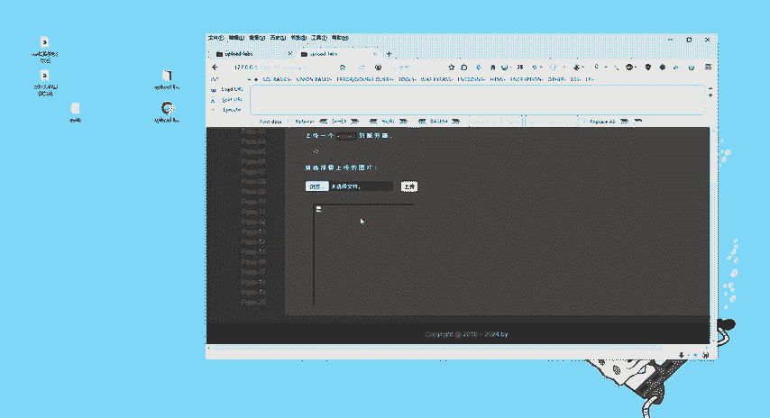

复制图像地址，然后新建标签页，把刚才这个地址呢给它放到这里来，我们直接运行。那么运行之后看到这个结果是什么PHP版本是5。2。17。然后呢，在这个地方是不是看到阿帕奇2。0。

然后我们还可以看到它的具体的一个地址。那也就是说我自己在自己的电脑上上传了一个PHP的一个文件。PHP文件可以获得我当前电脑的这个文件所在的路径。然后还可以去获得一些其他的。😊。

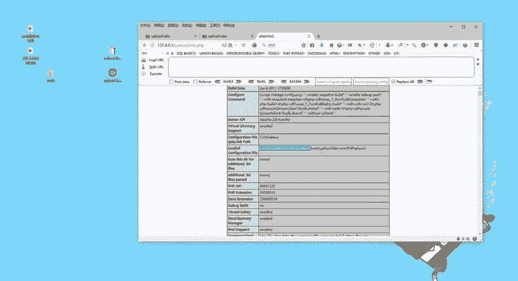

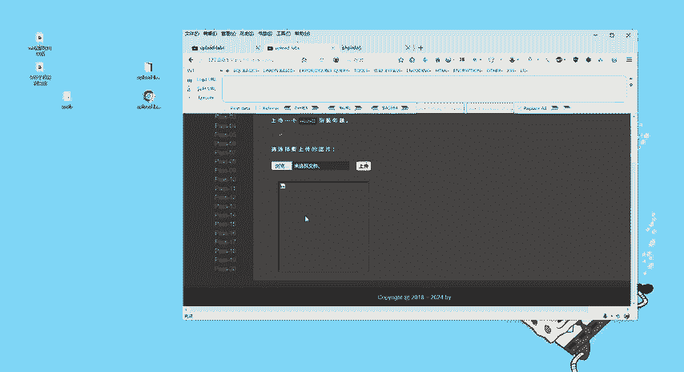

是吧。我想得到的一些东西啊，看到这个界面呢，我们就上传成功了。好，这个是我们的第一关啊。

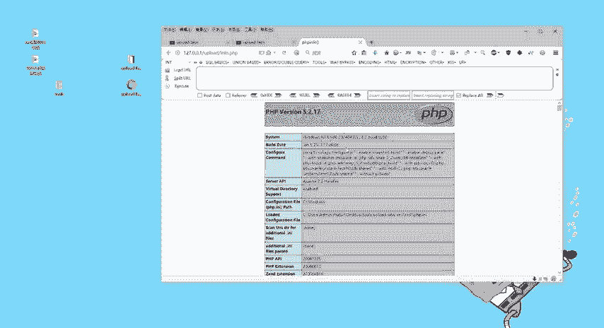