# B站首推！建议所有想参加CTF夺旗赛的同学，死磕这条视频，2024年字节大佬花一周时间整理的CTF入门保姆级教程！从入门到入狱（web渗透／PHP基／SQL注） - P21：3、文件上传第二关至第四关 - CTF入门教学 - BV1JjeJeYE2p

好，接下来我们来看一下第二关啊。第二关呢同样也是让我们上传一个we show，也是让我们上传这个图片。那具体。怎么去知道它的一些限制啊，我们这里有一个显示源码啊，我们来分析一下啊啊。

原这那这个源码里面啊，他说哎如果你点击了个这个sme，点击这个上传按钮的话呢，它对你这个上传的类型啊做了一个验证。那也就是说验证了一个文件的类型啊upload就上传的文件type是我们的类型。

它类型一定要是imag接PEG啊，imag pNG还有我们这个imag点击F，对不对？好，那么总共验证了这个三种，那如果说我还是需要上传这个info点PHP点击上传，它是不是提示我文件类型不正确。

请重新上传。但是我。😊，偏要上传对不对？怎么办？怎么来绕过它这个文件类型检测。那我们用到一个工具啊，那个工具呢因为我们要修改对吧？修改上传之后的一个文件类型，那怎么去玩，那我们还是得用到我们这个BP啊。

就我们这个抓包工具，那么这个具体的抓包工具啊，它怎么做的呢？首先第一步啊，在我们这个浏览器里面有个选项。

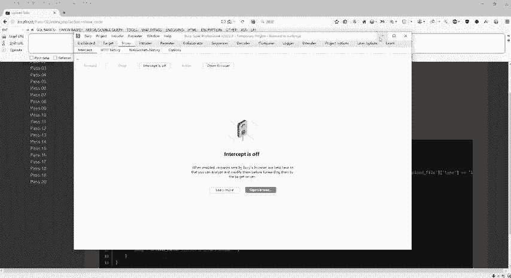

这里一个高级啊，这个也有一个设置。那设置的话，我们必须要手动设置一下我们这个代理。那么代理的话是127。0。0。1。然后这个端口呢，我自己这边电脑是设置9999啊，那么各位啊自己也可以去设置9999。

那么这个把代理打开之后啊，我们点击确定是吧，点击确定，那么确定完了之后呢，我们把这个BP给它打开。那打开之后它只是这样一个界面，在这个地方点击options，那这个里面啊127。0。0。1。

我们一定要保证这个端口跟我这个浏览器的端口9999保持一致。那么具体怎么改呢？我们选中点击edit在这个地方修改成你想要的端口，这个端口必须跟我们这个浏览器端口是一样的。好，那么设置完了之后啊。

我们就可以通过这个抓包哎，修改它的一个文件类型，那具体怎么做，我么选择infer。😊。

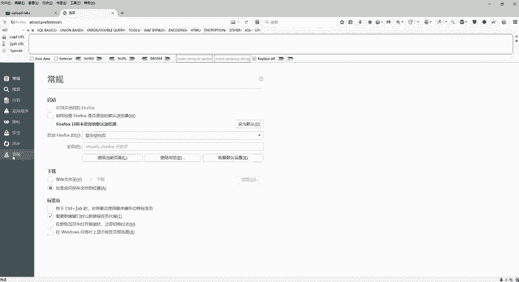

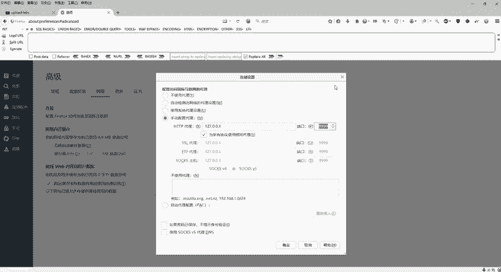

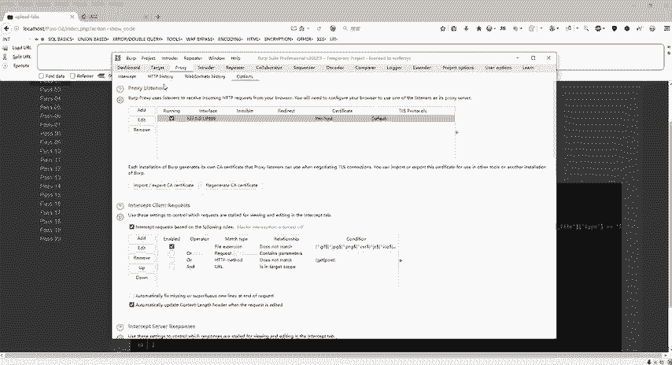

点PHP然后呢。打开啊，这个是拦截拦截之后点击上传。上传之后呢，我们会发现这个bb数啊BP里面是不是抓取到了我们当前页面的个数据。好，我因为上传的这个类型呢是PHP的这个类型，对吧？

然后它在这个地方有一个内容的类型，我只要把这个类型改一下就可以了。那么怎么改呢？它不是要我上传imine吗？对不对？上传imagine。

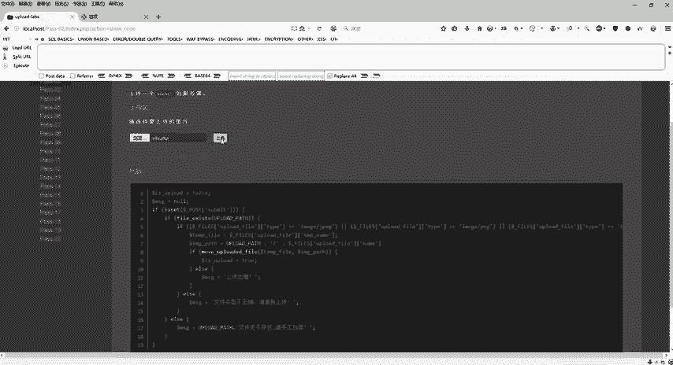

PNGimagine JPEG imagineineGF我就把这个。地方进行一个修改，比如改什么呢？IMAGE然后给它来个斜杠，给它搞成PNG。也就是说我通过修改这个类型，把我们这个PHP。就绕过去的。

嗯。那具体怎么绕的，把它修改完了之后，我们点击关闭，就是关闭我们这个拦截。好，OK好，看一下，已经刷新了一下，刷新了一下之后呢，是不是看到我们刚才这个PHP in付已经上传成功了。那么怎么去检验它呢？

复制图像地址回到我们这个新建选项卡ctrlV，把刚才这个地址给它。

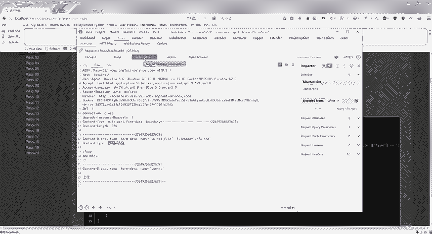

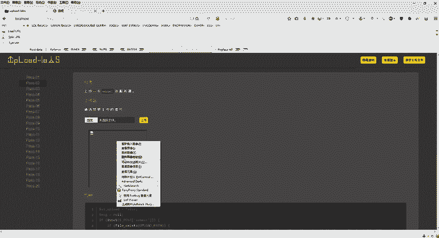

复制进来看到这个界面。好，第二关我们就过了。好，这个是第二关。那么回到第三关啊，第三关同样的也是一样的啊，这个东西我们就不用去看了，反正都是上传图片，但是我们的这个什么就不是要上传图片的。

我们还是要上传那个PHP的，对不对？因为我们要呃控制别人的这个服务器，控制别人的电脑，那肯定要上传一些木马，上传一些web show，对不对？好，那也是一样的啊，显示源码我们来分析。

那么这个源码呢比刚才上一关的一个源码就有点多了啊。那么这个主要是什么呢？这个第三关主要是一个黑名单的一个验证啊。😊。

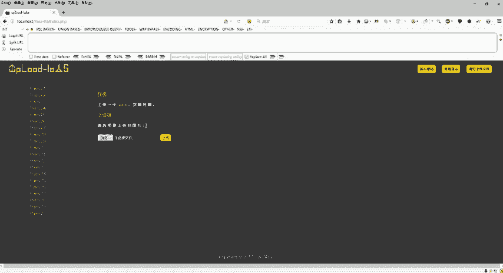

黑名单验证。那我们第一关第二关都上传的PHP对不对？那么第三关呢，它对PHP这个后缀啊，它做了一个限制，它怎么去限制的？那在这个地方看这句话，ASP对吧？APXPHPGSP那也就是他对这个4种后缀。

它做了一个黑名单的一个验证。那么黑名单，那也就是说不允许我上传，但是我如果要上传PHP后缀的，它肯定是不让我上传的，对不对？那我们怎么办还是一样的啊，那么嗯这个题目怎么去解呢？那有一个思路啊。

思路是怎么去做的那同样笔记上面呢也给到大家了啊，也给到大家啊，这个思路啊。😊。

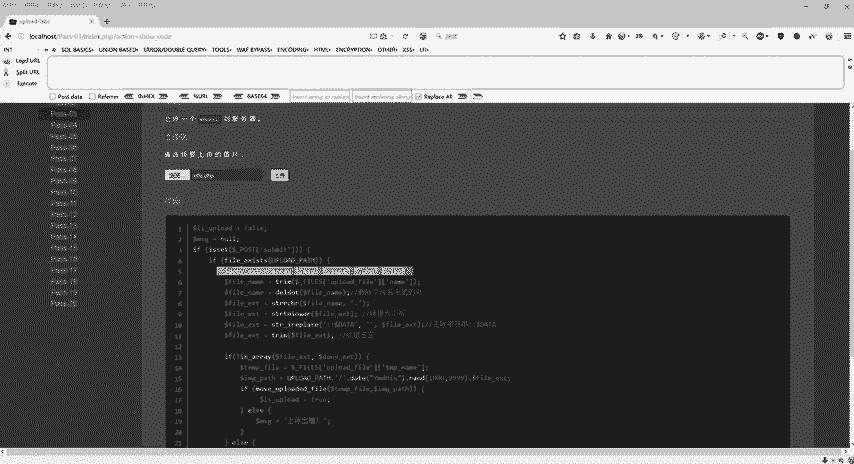

好，阿帕奇服务器呢它是能够使用这个PHP去解析这个点PHTML点PHP3的，是不是？是不阿帕奇的这个服务器能解释这个点PH呃TML，然后点PHP3。

那我们是不是可以把它的这个后缀变成PHTML或者是PHP3，对不对？好，那怎么去做啊，怎么去做？

同样我们上传什么呢？选择这个给到大家的啊，这里是不是有一个infer点PHP3啊，利用了这个阿帕奇的这个漏洞，它可以去解析PHP3的这个文件，还有解析这个PHTML的文件啊。那么我们点击上传。

上传成功了没有？是不是成功了啊，右键复制图像地址。

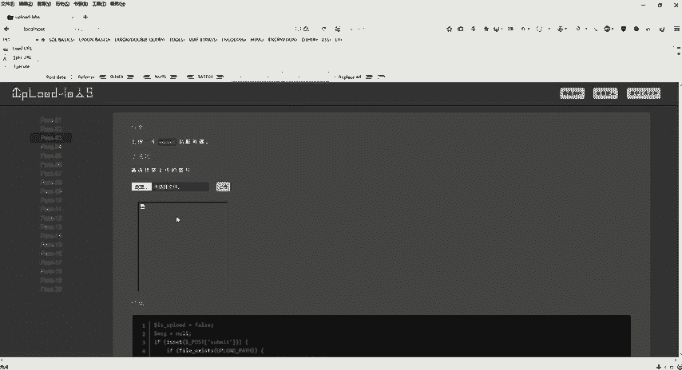

新建选项卡。回车是不是也是可以看到我们这个文件上传已经上传成功了，获得了它的版本啊一系列的。各种各的参数是不是都能获取到。好了，这是我们的第三关啊，那么第三关结束之后，那回到第四关。那这个第四关的话呢。

同样的我们来看一下这个源码，对不对？那么原码的话呢，好了，我们刚才第三关是我们这个黑名单验证，对不对？那么黑名单验证，第三关里面只给我们提供了4个，但是回到第四关里面是不是有这么一大堆。

我们刚才上传的PHP3是不是也被他拉进了黑名单了，对不对？那这个怎么去做呢？这怎么去做。

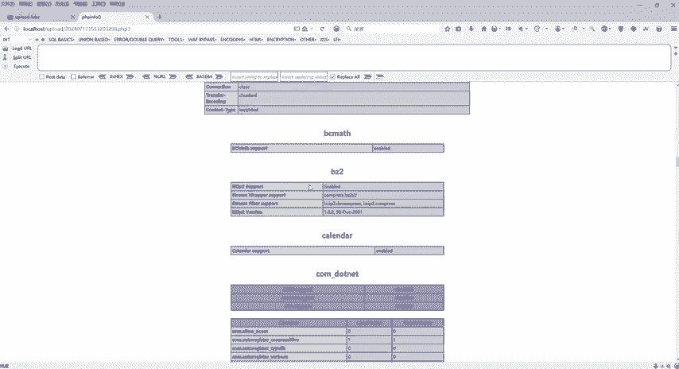

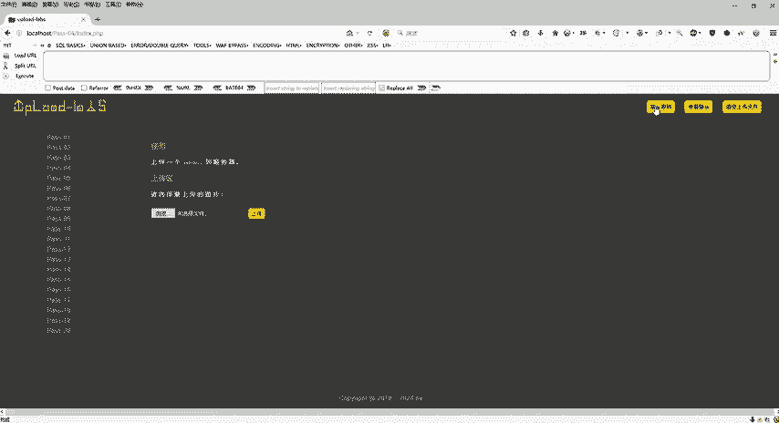

好，来分析一下啊来分析一下。那么这个第四关。我们只要使用我们这个。cess啊点我们这个ces超文本去访问就可以去绕过这一关。那么这个ces超文本访问呢它是什么呢？它是我们这个web服务器啊。

根据目录应用设置的一个有用文件啊。那我们同样的也来看一下这个笔记。那么第四关啊也是黑名单验证，但是我们必须要给它上传一个这么一个东西啊，这个什么这别讲呢它是一个超文本访问的。

那么它是什么许多web服务器根据目录应用设置的一个有用文件，它允许在运行的时候覆盖阿帕奇服务器的一个默认设置使用我们这个点ces我们可以在运行的时候轻松启用或禁用任何功能，你不是给我拉黑名单了吗？对吧？

我使用这个超文本访问，我就可以轻轻松松把你绕过去。那具体的怎么去做啊，怎么去做。那么第一步我们新建这个ces并上传。那么。

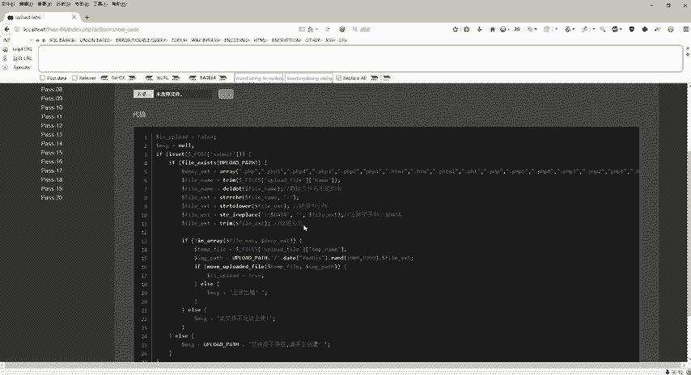

我给到大家的啊提供给大家的软件工具里面呢有一个access。那么我们打开啊，看一下里面是什么。就写了一个fe match去匹配我们这个漏洞点击PT啊，漏洞点击BG同样的这个图片啊。

这个图片也是给到大家的啊，这在哪里呢？在这个地方漏洞点击PT啊，就是这张图片。好，那么也就是这个里面呢包含了这个漏洞点击PG一定要注意的啊，这个漏洞点击PG跟这个ces这个同一个目录啊。

一定要放在同一个目录下面，所以说这个工具呢也给到大家了。所以说有需要的同学还是啊评论区自取就可以了。都给你们提供好了的啊。好，那么这个写好了之后，我们就这么一句，对不对？好，按照笔记上面来。好。

第一步写完了，写完了之后，那我们第二步把PHP文件重新命名，对不对？刚才给大家看的那个漏洞点击PT其实呢我们把它打开啊。😊，右键。我们打开里面是不是写了一个PHP的代码呀，对不对啊？

那么也就是这个并不是一个真真正正的一个图片，而是什么有代码的，写了一个PHP代码，可以获取对方的服务器的PHPin代码在里头，是不是？好，那也就是说它并不是一个真真正正的图片啊。好了。

那么把这个东西都准备好了之后，那接下来怎么办？那第三步上传我们这个漏洞点击PG。😊，就完事了啊。好，那么这个第一步啊上传HTA啊CCESS就是上传我们这个cess。否则说我们这边要上传两步，上传两步。

那么第二步是上传我们这个漏洞点击BG。也就这个漏洞点击BG一定要跟这个cess里面的名字啊，这是名称名字要一模一样。如果不一样的话就会失败。好，那么回到这个里面来。第一步浏览一下。

先上传这个cess打开走上传成功了，对不对？上传成功之后再来浏览上传我们这个漏洞点击BG。😊。

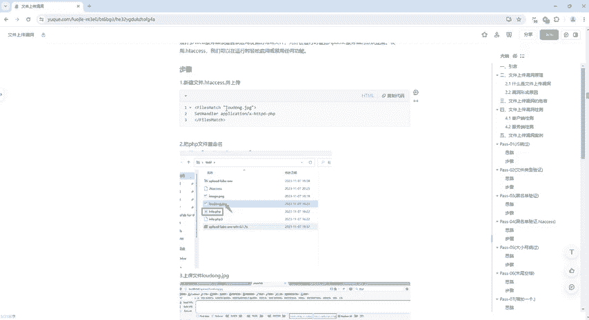

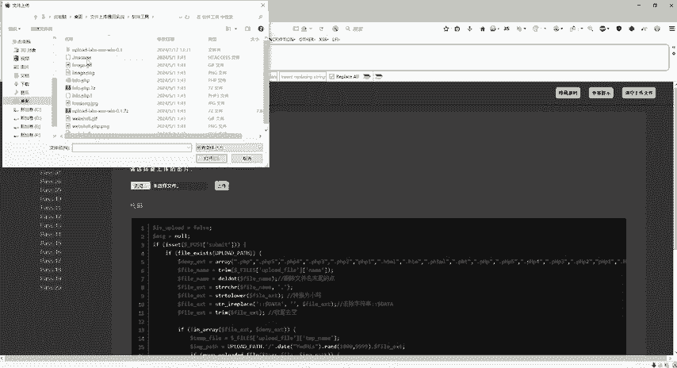

好了，然后呢。😊，回到这个地方，点击上传是不是可以了？右键复制图像地址，然后新建选项卡，回则是不是也可以看到我们这个PHP的一个版本。

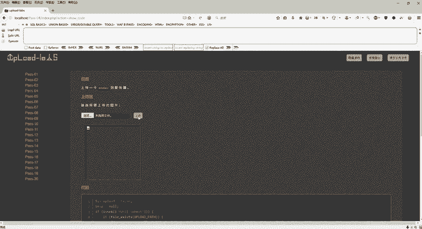

跟一系列的一些。各转关的敏感参数，对不对？好，这个是我们的第四关。

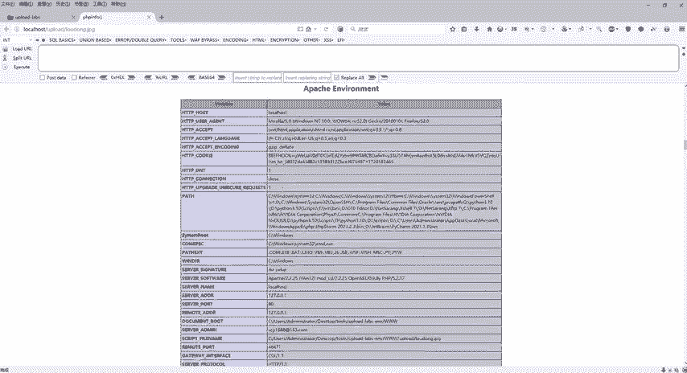