# B站首推！建议所有想参加CTF夺旗赛的同学，死磕这条视频，2024年字节大佬花一周时间整理的CTF入门保姆级教程！从入门到入狱（web渗透／PHP基／SQL注） - P22：4、文件上传第五关至第七关 - CTF入门教学 - BV1JjeJeYE2p

好，接下来呢我们来到了我们这个第五关啊，第五关同样的也是第一步显示我们这个源码。那么显示源码之后，我们看一下这边对我们这些进行了一个验证，什么PHPPHP52432什么HT对不对啊。

这些东西呢巴拉巴拉了一些的东西啊就不看了，是不是？那么但是呢这一关啊，我如果说还是得上传那个PHP的话，那我可以怎么办呢，对吧？但是我们可以看一下啊，这里面有什么小写大写小写大写对不对？

然后往上走一一下子我们往这个下面再拉一点啊，看一下它验证了什么，对不对？好，要么就是验证全部小写，要么就是验证这个大写加小写，但是有没有发现它没有去验证我们这个全部都是大写的后缀，是不是好。

所以说从这个上面我们就可以分析出来。我是不是可以把这个文。😊。

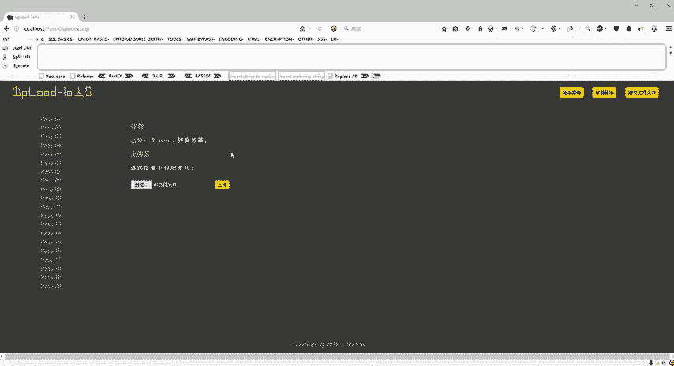

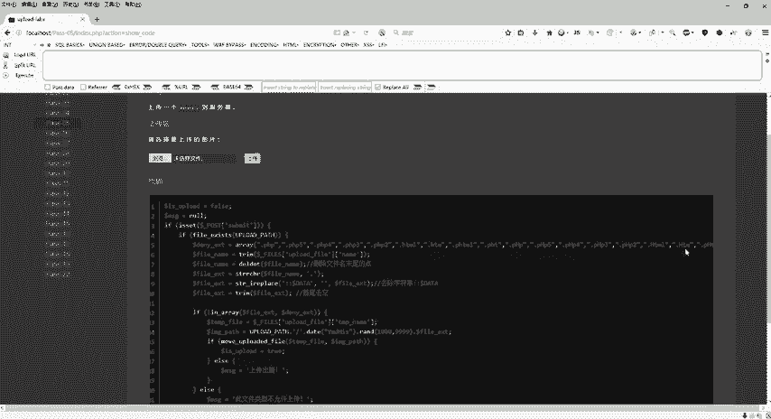

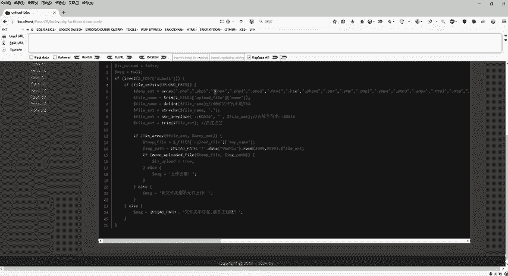

键名给它全部改成大写呢？是不是？好，那么这个具体的怎么去绕过它？好，首先第一步点击浏览，我还是选择infer点PHP。打开我们BP进行接包。点击上传，看到这个BP里面是不是截取了我们这个包。

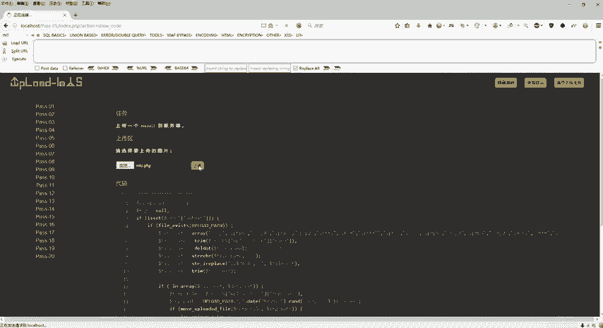

好，我上传的后缀名是PHP是小写的那具体的怎么去把这个PHP给它进行修改？它因为没有验证我们这个后缀名大写，对不对？我可以把PHP全部变成大写的符号。我们。修改完成之后，点击放包。好。

刷新之后会看到已经上传成功了。那具体的同样的复制图像地址来验证一下，看看是不是可以。OK好，这个是第五关。

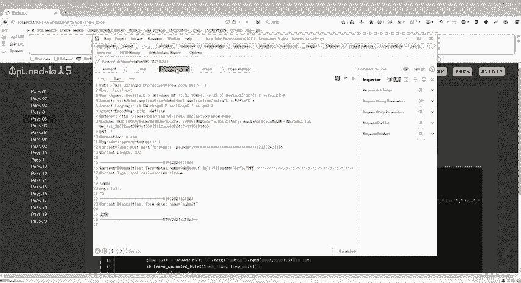

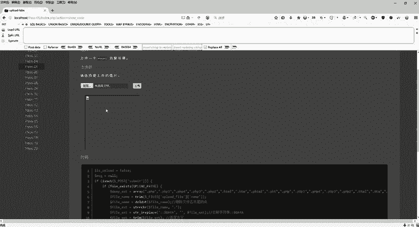

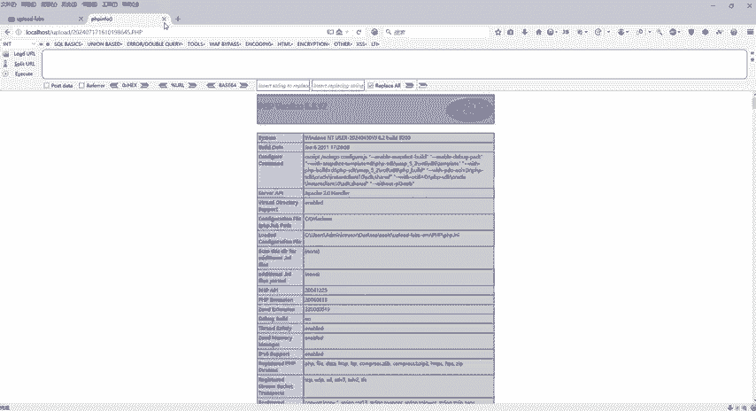

好，第五关结束之后，下一个我们这个第六关啊，第六关同样还是来显示一下源码。好了，显示源码之后呢，好，他有了第五关的经验，对不对？然后呢，这个地方又写了很多很多很多很多很多，对不对啊。

验证了很多很多东西是不是越来越多了啊，越来越多了，那它验证归验证啊，验证归验证，但是我们还是有方法去绕过它的，对不对？好，那么注意啊，我们刚才在第五关的时候，我们把这个第五关的这个代码呢给它拷贝下来。

看rC。😊。

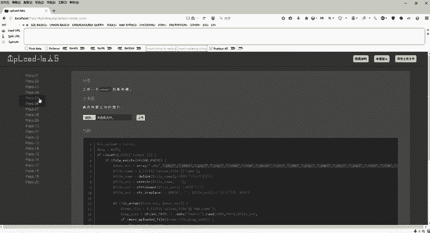

好吧，cC，然后回到这个地方，我们ctrV粘到这个地方来之后啊，我们来分析波删除文件末尾的点，对吧？然后还有这一块，还有这一块去除字符串的时候会去空，然后回到我们的第六关啊，回到我们的第六关。

同样的看一下源码，我把这一块给它拷贝一下，我们来对比一下它的一些源码啊，它的源码，好，这是第五关这个是第六关，我们刚才第五关呢是通过修改后缀名为大写的PHP是通过了，对不对？但是呢这里啊。

第五关这个代码是这边在第六关呢，他说哎转换为小写，对不对？它是不是多了一个转换为小写，我即使把这个PHP改成大写，它还是会给我转换为小写，是不是这样子的。那么具体怎么去做呢？😊。

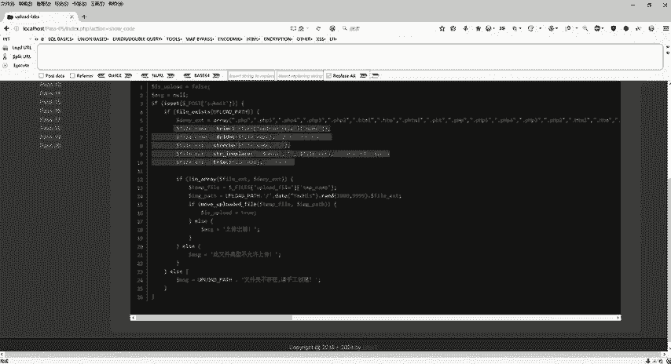

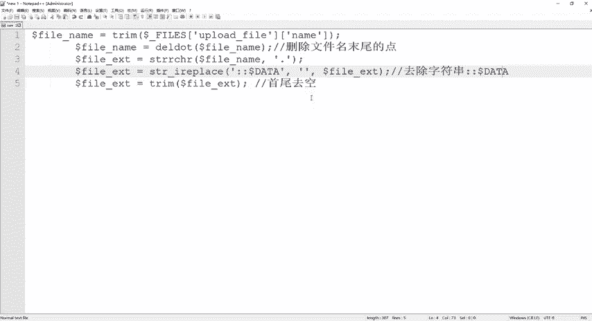

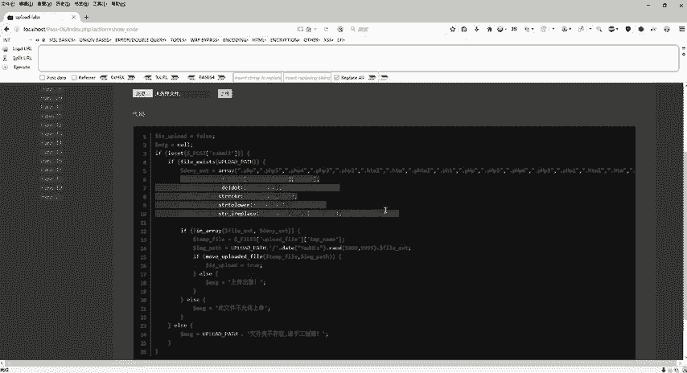

再继续往下分析啊，继续往下分析。那么这个有这个也有这个多了一个，是不是？然后呢，这个也有。😊，我们会发现什么都没有啊，是不是在这个地方第五关是不是有个首尾虚空，第六关是不是没有首尾虚空啊。

那我是不是可以干嘛？是不是第六关是不是比第五关少了这一行的代码，是首尾去空的这样代码？那我是不是可以在。😊，尾巴上面去加一个空格来绕过呢？是不是啊？好，所以我们来对比一下啊。

发现是不是少了一行这个对不对？好，那我们回到第六关，同样的浏览上传我们这个infer点PHP。

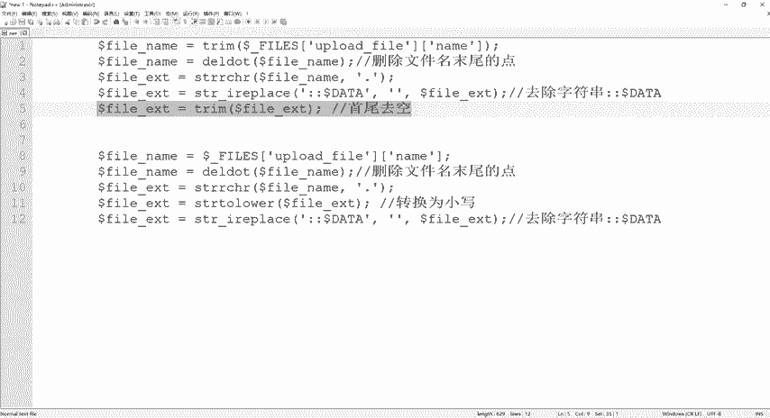

把这个BP给它打开。点击上传上传完了之后。

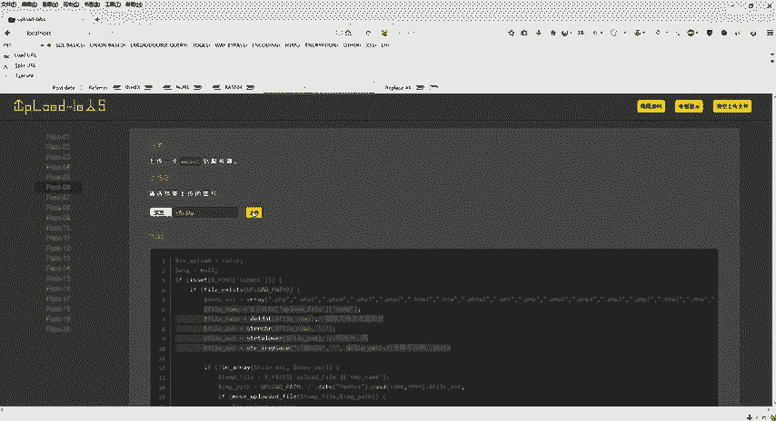

我可以在这个后面加上一个空格。点击放包，看一下是不是也上传成功了，复制图像地址，看一下crV啊，看一下这个验证一波是不是也是可以的。好，这个是我们的第六关。

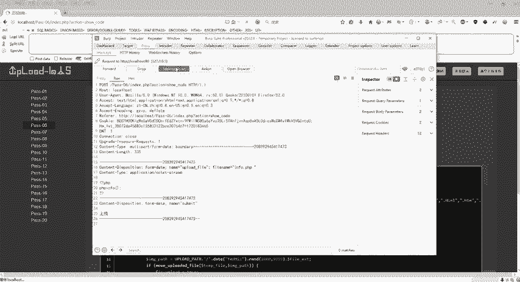

好，第六关结束之后，那我们接下来我们看一下第七关啊，那么第七关同样的还是看一下这个源码，我们来复制一下这一块的源码，我们来跟上一关去做对比。因为我们这一个1到20关，都是上一关，下一关就是联合的。

对不对？上一关我对它进行了一个什么稍微去空或者是干嘛干嘛的。那么它下一关肯定会想到你会使用这个方法，对不对？好，但是这个是第六关，这个是第七关，我们来对比一下。好。😊。

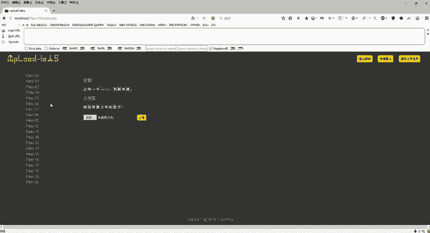

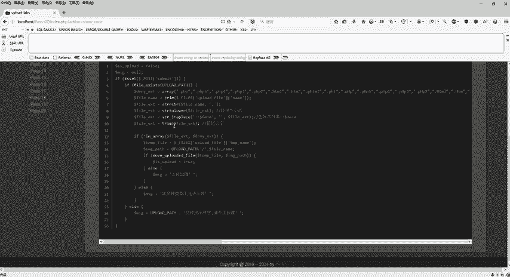

它多了个什么少了个什么首尾去空是不是也加上去了？因为我第六关是不是靠着这个首尾去空来绕过的，所以它这边多了一个哎你既然上一关可以首尾去空，那我下一关的话，我把这个首尾去空给它加上是不是这样子的。

然后转换为小写是不是也有了去除字符是不是也有了，然后呢删除末尾的点有吗？各位是不是没有啊，那删除末尾的点没有的话，那我是不是可以在第七关后面加上一个点呢，是不是这样子的。好。

浏览选择infer点PHP打开我们这个BP进行拦截包上传进行我们这个数据更改PHP后面我们给它加上一个点，加上点之后放包上传成功，右键复制图像地址，打开我们这个地址。😊。

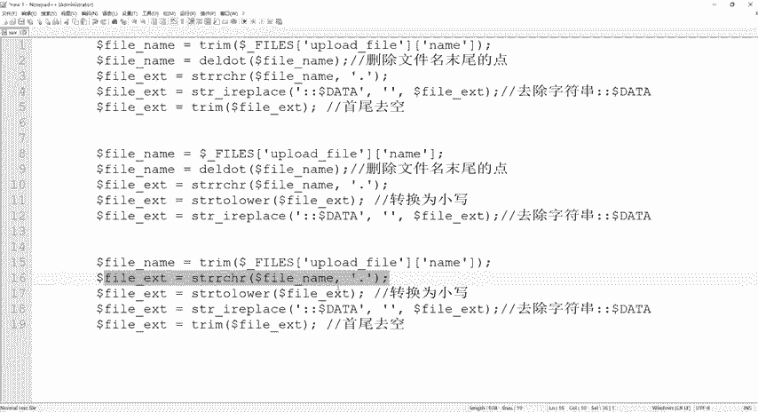

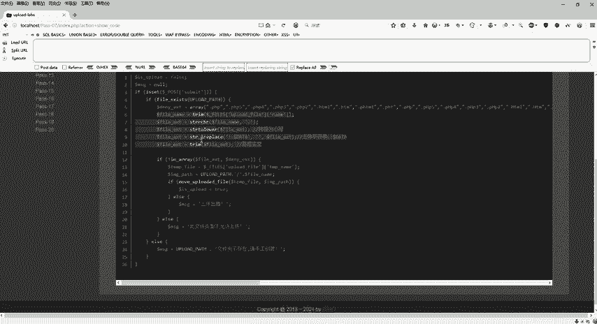

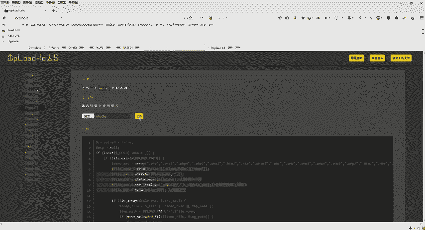

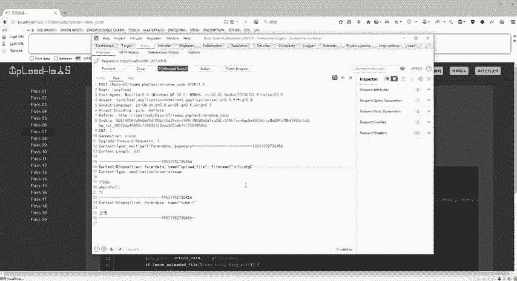

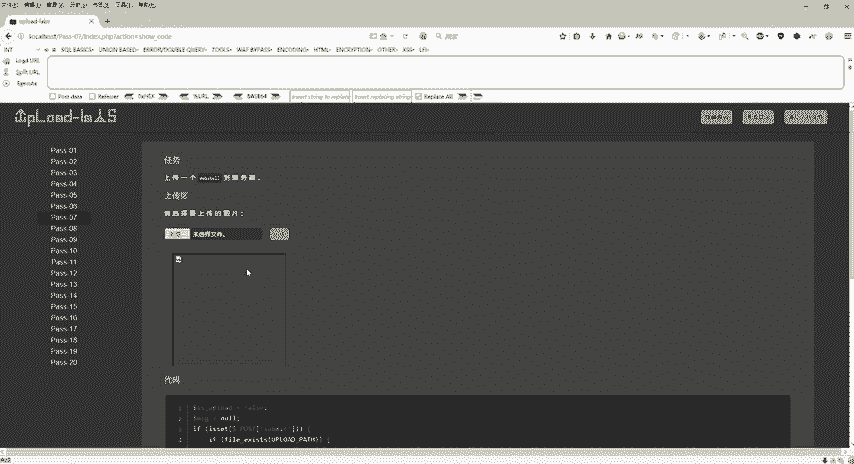

好了吧，啊而且呢会发现它即使在这个后面加上一个点，它也能正确的给我执行，是不是？好了，这个是我们的第七关。

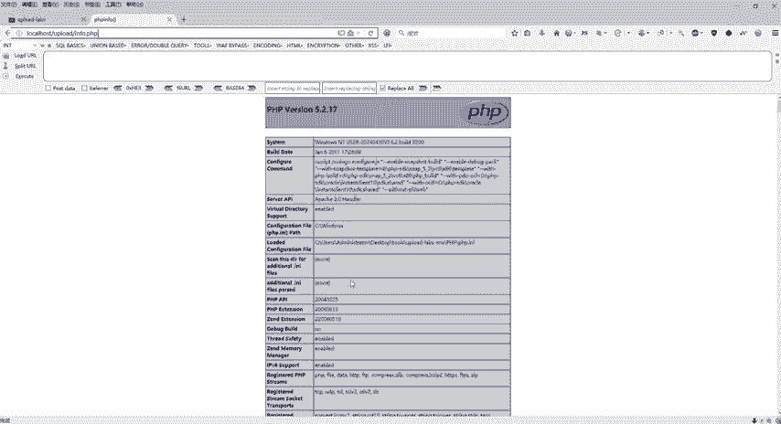

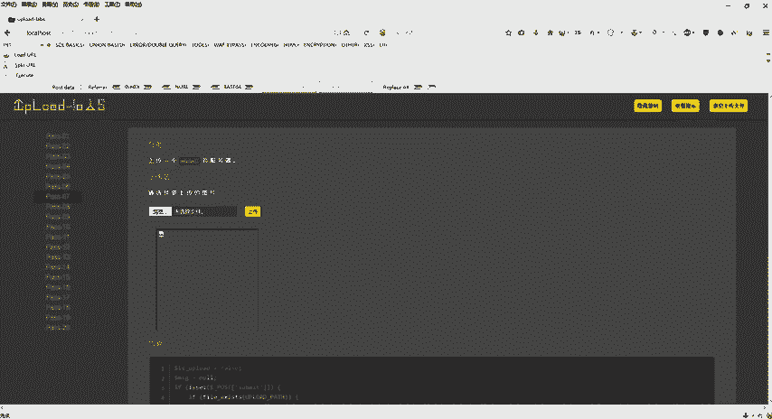