# B站首推！建议所有想参加CTF夺旗赛的同学，死磕这条视频，2024年字节大佬花一周时间整理的CTF入门保姆级教程！从入门到入狱（web渗透／PHP基／SQL注） - P23：5、文件上传第八关至第九关 - CTF入门教学 - BV1JjeJeYE2p

好，接下来呢我们来到了我们的第八关啊，同样的还是一样的，显示源码。我还是给大家把这个源码给它copy一下，放到我们刚才的第七关的下面。我们来对比一下第七关跟第八关重点在哪里？好，首先第一个转换为小写。

有首尾去空。有。

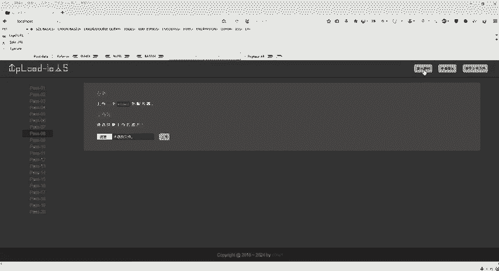

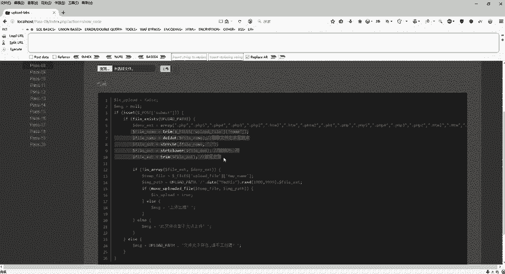

还有呢删除文件末尾的点，有没有呢？是不是也没有，然后还有什么呢？去除我们这个字符串，这有没有？也没有。对不对？好，那关键一点，我们怎么去突破它？对吧怎么去突破他呢？好，这个是第八关啊，这个是第七关。好。

chem是不是查查一下有，然后这个CHR是不是也有，然后什么lower对不对？也有。然后呢，这个chem是不是也有啊？😊，关键一点，我们重点在哪里？重点在这个地方是不是去除了字符串。

冒号冒号do了 data呀？😊，对不对？好，这个是第七关，它是去除了冒号冒号do罗 datata。但是第八关。是不没有去除我们这个字符do对不对？但是我们这个do dollar date的话呢。

它是什么意思啊？那我们同样的来看一下这个笔记，那么在windows的时候啊，如果文件名加上冒冒会把冒冒号之后的数据当成文件流处理，那么它就不会去检测我们这个后缀名，并且保持冒号冒号d之前的一个文件名。

那它的目的呢就是不检查后缀名，那么它既然它不检查后缀名，那岂不就是随便我去上传，我想上传PHP想上传PN想上传GPG都可以，对不对？好，比如说这里有一个案例啊。

PH点PH然后do date那么windows呢会自动去掉末尾的这个。😊，冒号冒号倒d是不是变成PHP infer点PHP那么它变成了PHP那是不是就是我们想要的东西，对不对？好。

那么首先第一步怎么去做啊，怎么去做？😊，好，那么同样的啊按照我们这个笔记上面来的话，还是一样的啊。😊。

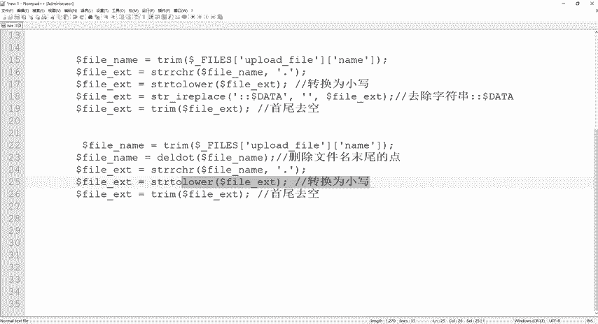

选择文件，那么我们选择什么呢？选择这个漏洞点击笔记，好吧，打开。选择漏洞点击P7之后，点击上传之前，打开我们这个数据包啊，BP数据包拦截上传。

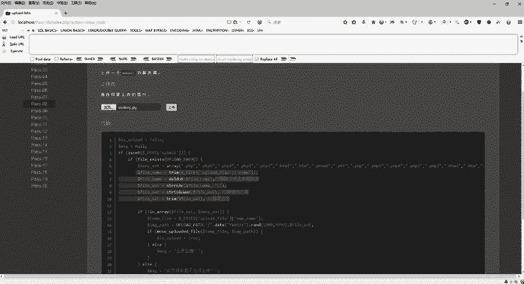

好，上传之后，我们抓到了包了。我们上传这个漏洞点击BD呢，它其实它就是1个PHP是不是？其实这是1个PHP文件啊，里面写的PHP代码。那我直接在这个JPG后面给它变一下，变成什么呢？😊。

把这个JPG给它删掉，变成PHP，然后呢给它冒号冒号哆。date对啊，大写的么好么好，都是data，也就是说不会去验证我们这个后缀名。我就是把这个PNG。😊，对吧或者JPG给它改成了PHP。

然后这里是不是它做了一个验证，哎， imagineagine JPEG那也就代表我上传的是我们这个图片，它是不是就不会去做验证了？我在这个地方把它改成PHP的一个后缀，给它改成冒号冒号doit点击。😊。

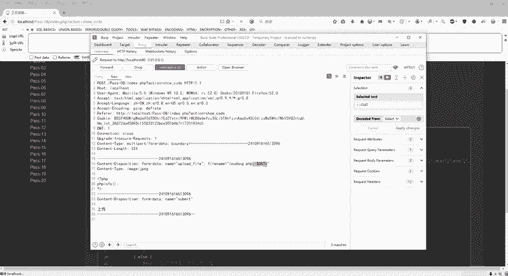

取消拦截刷新对吧？右键复制图像地址。

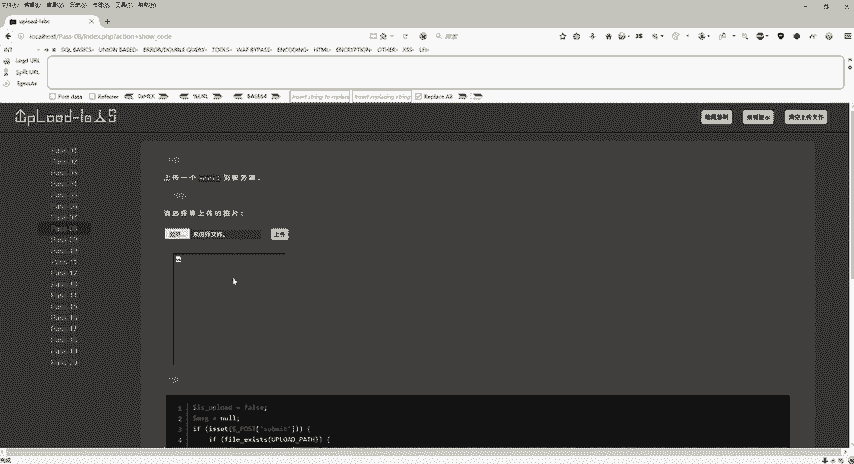

同样的。看一下。O。但是会发现什么样的问题呢？我拷贝下来的地址上面是不是有冒号冒号多or datata呀？是不是，但是我们真正正种运行的。😡，东西是什么？是不是把这个冒号冒号do data给它去掉。

回车是不是来啦？好，这个呢是我们的第八关啊，就是给它加上一个冒号冒号dollar date。

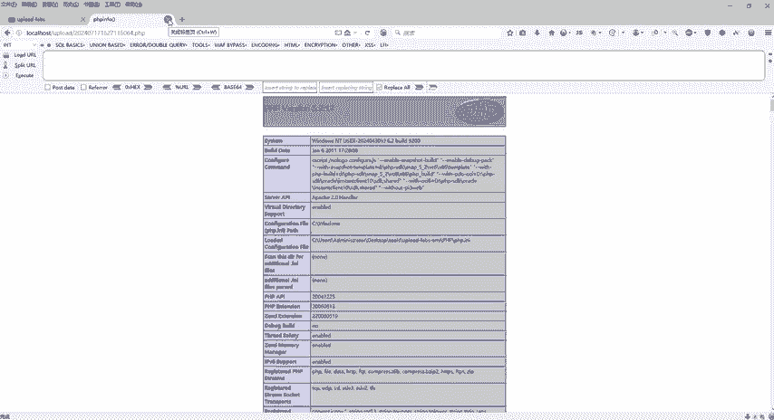

好呃，第八关过关，第九关啊，第九关同样的，我们还是老样子啊，来看一下它的源码，这个东西呢就不用去看了啊，所有的验证它都给你加入黑名单了，对不对？好，还是ctrl C。

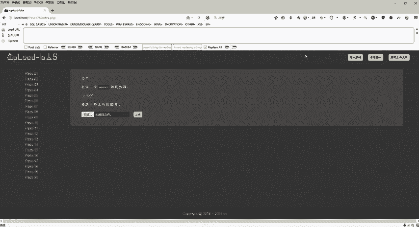

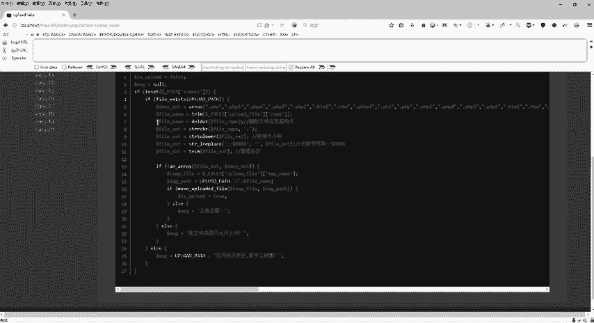

然后呢，回到这个地方。看超V对不对？好啦。😊，跟第八关去做一个对比啊。第九关。删除对吧？然后这个点，然后转换为大小写，去除字符串首尾去空。哎，看上去好像并没有什么毛病，对不对？那么具体的它是由于什么呢？

知不知道呢？好，那具体的啊那怎么去查看它，因为我们后面呢会有代码审计，所以说我们还是得养成会去看代码的一个习惯啊，所以这个就是为什么我们做文件上传漏洞的时候，带着大家来看代码的原因。

那么这个代码在哪里看呢？我们把这个拷贝到我们记事本看不出来，是不是这样子的？好，那么具体的代码怎么找，这个不是我们这个靶场嘛，我们直接来看靶场里面的代码。好，我们选择工具里面靶场，我们刚才是第几关。

是不是第九关啊，那么第九关，我们选择3W末录里面有个pass杠连角，我们看哪个呢？我们是不是看这个index的PHP好，右键我们。😊。

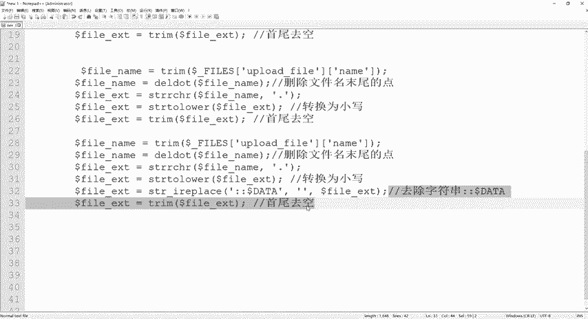

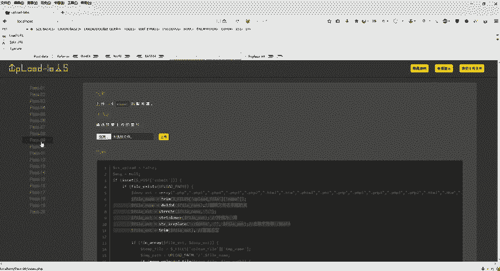

使用note pad加加给它打开。那么打开之后，它这里面代码是不是给我们呈现出来了，是个PHP代码，然后关键字是蓝色的，对不对？好，导入了什么什么什么东西。😊，好，继续往下走往下走。好了。

看到我刚才的这一块吗？看到这一块，刚才是不是给大家。😊，截出来了，是复制出来的，就这一块吧。但是我们真真真正的把它所有代码给它打开，我们会看到所有的关键字它是都变颜色的，对不对？那都变了颜色。

那么仔细去看唯一一点呢？是哪个代码没有变颜色，是不是这个删除文件末尾的点是没有变颜色的，那么这个就是我们一个代码分析啊，代码分析，那么主要错误还是在于我们这个代码写的不严谨啊，因为它没有变色。

没有变色的话呢，这个就是一个普通的这个。😊，什么。英文字母了对不对？啊，就不是说什么方法呀，什么函数了啊，也就是这个函数这一块，它这个方法这一块它就不起作用。那么删除文辑末尾的点，它都不起作用的话。

那我们怎么办？😊，滕完。那我是不是要看这个意思到底是什么呢？这个删除文件名末尾的点，也就是说你就从这个字符串的尾巴部分开始删这个点。那么怎么删的呢？是不是从后面往前面去删，好，打个比方啊。

比如说我现在在这个里面写了个什么呢？写了个IM。AGE点JPG是不是？然后我给它加上一个点点点点点，那么它会从什么呢？也就这个方法，它是会从右边往左边一个一个去删，一直删到没有点为止。

那么你这个地方写再多的点，它被删掉之后。最终的结果是不是imine点GPG那是不是我们想要的东西，对不对？好，但是有一点我如果说我上传的是一个infer点PHP点点点点点的话呢，我把它删掉，我删掉之后。

它运行infer点PHP但是它这里给我加了黑名单，还能不能运行呢？是不不能运行，是不是好，不能运行，那怎么办？那是不是上上一关还是哪一关，我们是不是在后面加上那个点，它是不是也可以直接运行。

那我们怎么去。😊，做我是不是可以他看到点就删嘛，对不对？从右边删左边，我是不是可以空格点。我删点，然后他看到空格，他会不会删呢？不会是不是不会删。也就是说他看到空格之后，他这个删除文件末尾的点。

它就失效了，对吧？就失效了。那么失效之后，它是不是最终留下的是不是info点PHP点空格呀？😊，那么。留下了infer点PHP点空格之后，它是不是有一个首尾去空。

那么我们最终的结果是不是就得到了infer点PHP点这个在前面那关是可以直接运行的，对不对？好，那这一关具体怎么去通过啊，我们来操作一下。好，还是一样的啊，浏览选择什么呢？选择我们这个漏洞点JPG好吧。

它不是要图片吗？我就选择JPG。好了，那么选择完了之后，我们同样的打开我们这个BP点击上传。

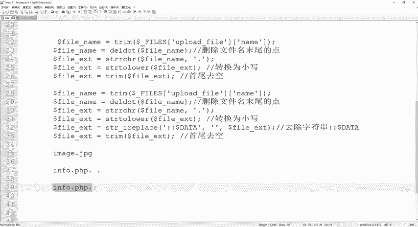

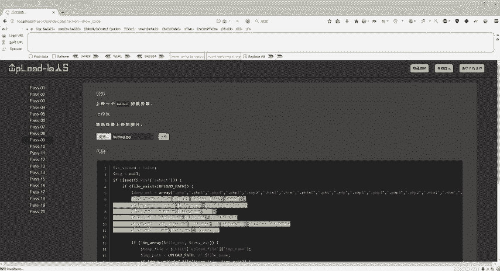

看BP里面把JPG变成我们这个PHP，然后给它点空格点。

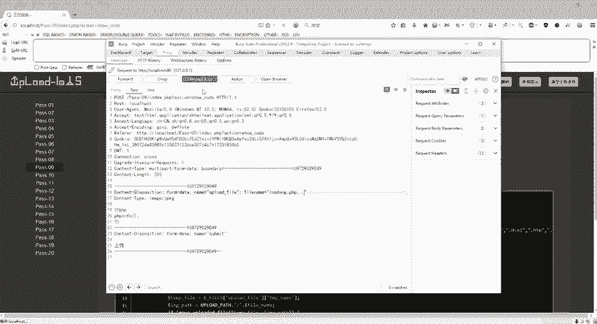

我们放开拦截，上传成功，右键复制图像地址。

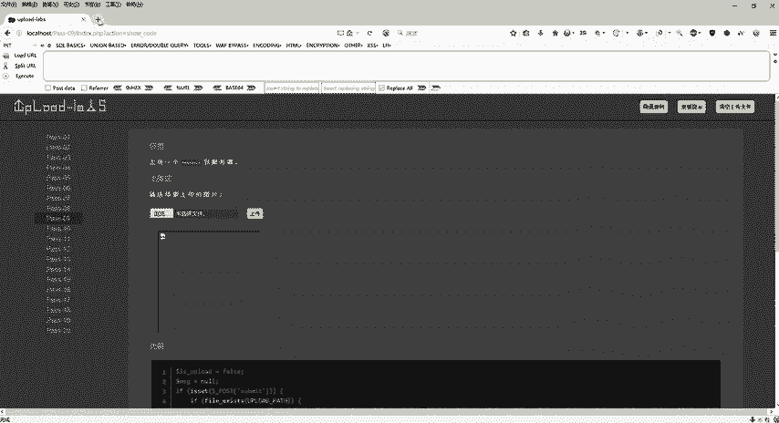

整理是不是运行好了。好，这个是第九关啊，主要是我们的代码不严谨啊导致的一个文件上传漏洞。好，具体的思路啊，笔记上也给大家提供了啊，你这个也呃同学们伙伴们都可以去按照我们这个笔记上面去一个去进行操作啊。

关键一点啊，主要还是要知道我是如何知道它干嘛它的一些操作，是不是你既然要删除末尾的点，我只给你留下一个，但是你看到空格是不会删的，空格是谁删空格是这个代码去删。那么删完之后。😊，程序从上到下去执行。

它结束了。那它这一个点最终还是会留下，留下之后就是这么一个完整的路径，叫infer点PHP点。同样的是可运行的。好，这个呢这是我们的第九关啊。

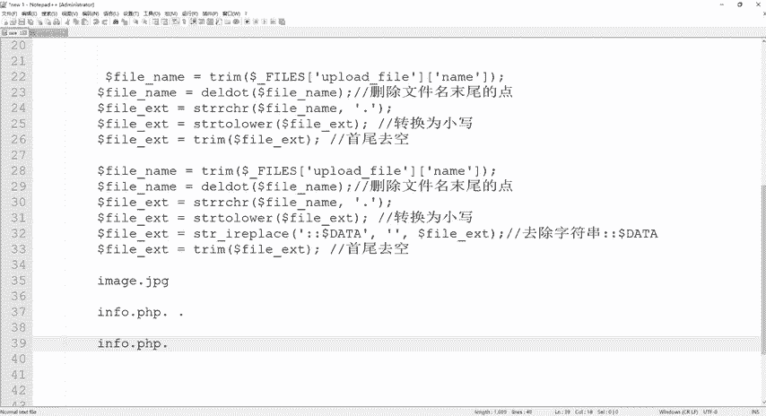