# B站首推！建议所有想参加CTF夺旗赛的同学，死磕这条视频，2024年字节大佬花一周时间整理的CTF入门保姆级教程！从入门到入狱（web渗透／PHP基／SQL注） - P24：6、文件上传第十关至第十一关 - CTF入门教学 - BV1JjeJeYE2p

好，接下来我们来看一下我们的第十关啊，第十关同样显示源码，把这个源码呢给它抠出来啊。

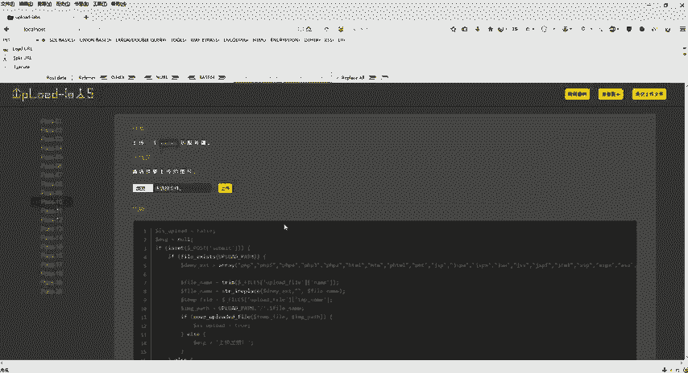

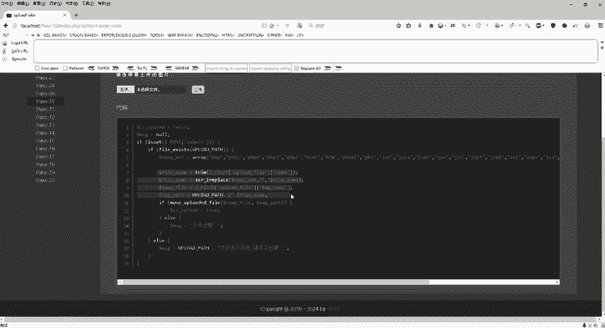

crC，然后回到这个地方，ctlV。这个是上一关，这个是第这一关啊，这个关是第十关。那第十关主要我们要看一个关键字啊，关键的一个函数多了一个什么呢？

STRI什么replace这个replace它是什么呢？它是用于字符串替换的操作，不区分大小写。😊，它这个里面它的一个语法啊，它的语法我们同样的来看一看笔记上面有啊。好，回到第十关。这个语法呢。

这里它标准的语法是这样子的，总共里面有参数。那么这个参数 find它是必须的，规定要查找的这个值，那么replace呢，它是也是必须的，规定是替换 find的中间的值。那么str也是被必须的。

规定被搜索的一个字符串。好，那么这个代码其实就跟这块代码是一样的啊，那么这个东西是我们要规定查找的这个值，对不对？然后。这个里面是替换成什么？是替换成空，对不对？好，那这个东西是什么？

这个东西是不是在这个infer点PHP里面去查找什么呢？查找这里面的名单，只要查找PHPPHP5PHP432什么7788的东西，它就给你替换成空，能不能理解这个意思？

各位也就是说我一个文件里面只要有PHP或者PHP5PHP4，那这个列表里面的所有东西，只要我看到了，我就把你替换为空。那么所以说这个题目怎么去做啊，已经给大家提供了一个思路了。你既然看到PHP替换为空。

那我还需要留1个PHP我是不是可以把这个文件名改成PPHPHP然后你看到PHP把它替换为空。那么最终的结果是不是就是infer点PHP。这是我想要的东西。好，具体怎么去实现的，同样还是一样的啊。

还是靠我们这个BP去抓包。😊。

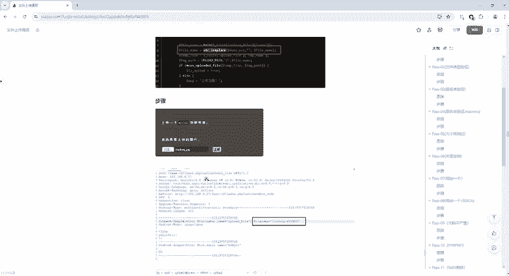

好，浏览上传我们这个漏洞，点击PG点击打开上传之前打开拦截包上传。

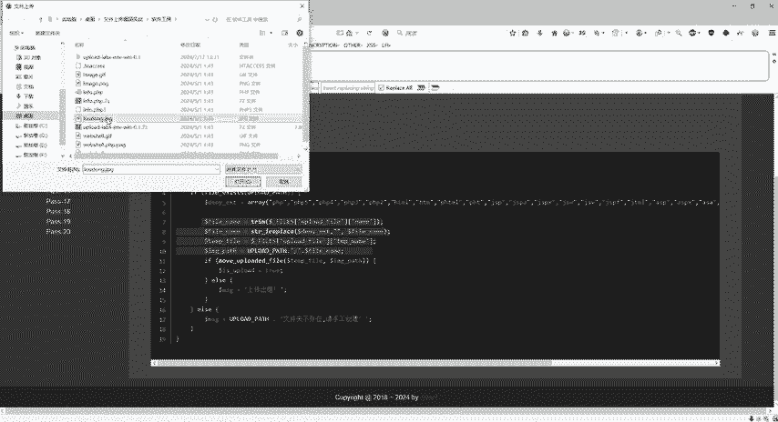

回到这里来，我们直接把它变成什么呢？变成我们这个PH。P对吧啊变成PHP但是呢它不区分大小写啊，不区分大小写，那我就直接写个大小写吧，叫PPHP。😊，HP哎，就完事了。你看到PHP。把它干掉了。

干掉之后是不是还留下了1个PHP好，这个是第十关的绕过啊，同样的放开。

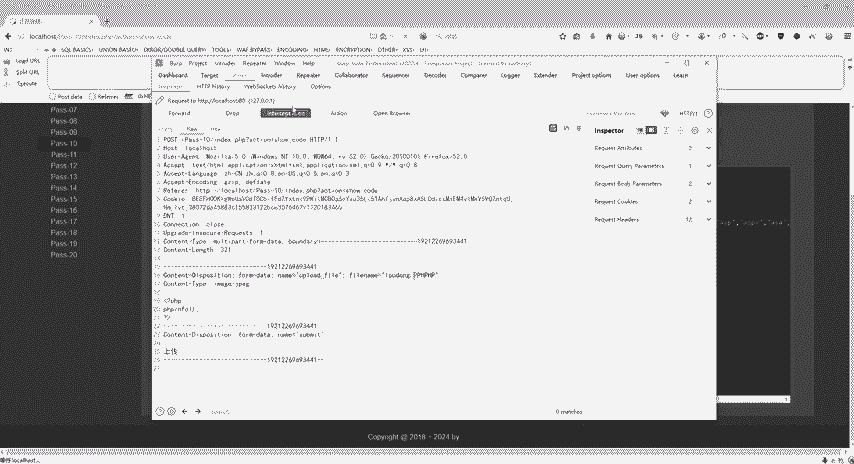

上传成功复制地址。

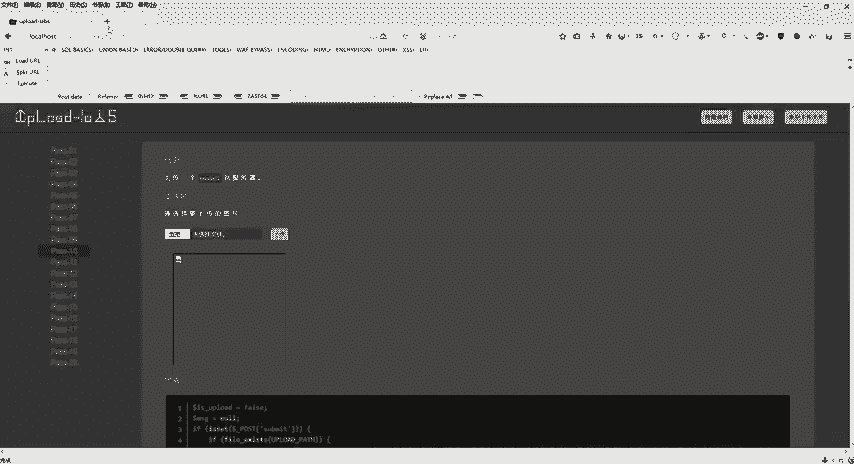

OK成功了啊，看到这个界面就成功了。这个是第十关，主要还是看到这个PHP我就把它替换为空是吧？哎，看到PHP5，我也给它替换为空，关键是这一段代码啊，这句代码这是一个替换的代码。我在哪个里面去找。

在文件名里面去找找到我想要的东西我给你干什么呢？给你替换为空啊，所以这个就是通过。😊。

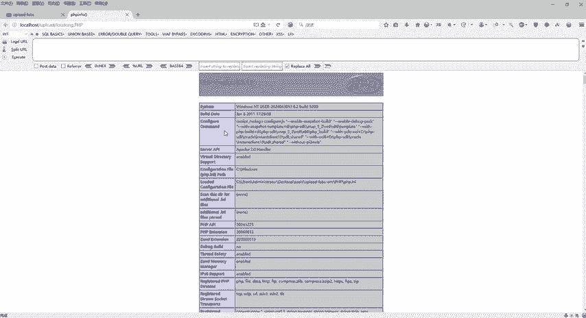

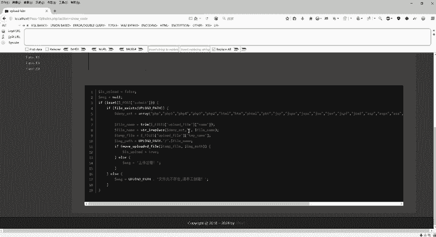

修改文件的后缀明，然后把它替换为PPHPHP啊来进行一个验证绕过。好，这个是第十关啊，接下来第十一关啊，同样还是一样的，看一下大代码里面具体怎么去写的啊，可能呢呃越来越多的一个代码。

对大家啊可能有点就是感觉有点看不懂啊，或者干嘛干嘛的啊，所以说还是跟着老师的步妨一步一步来啊，笔记上面具体也有啊，各种各样的资料都给大家提供的啊，都给大家提供的有需要资料的同学反正还是一样的啊。

我们的评论区自取就可以了。或者跟老师联系也可以啊，老师会把这个所有的资料工具包全部都给你发过去。好，这个是第十一关啊，第十一关呢，我们主要来看一下这个。

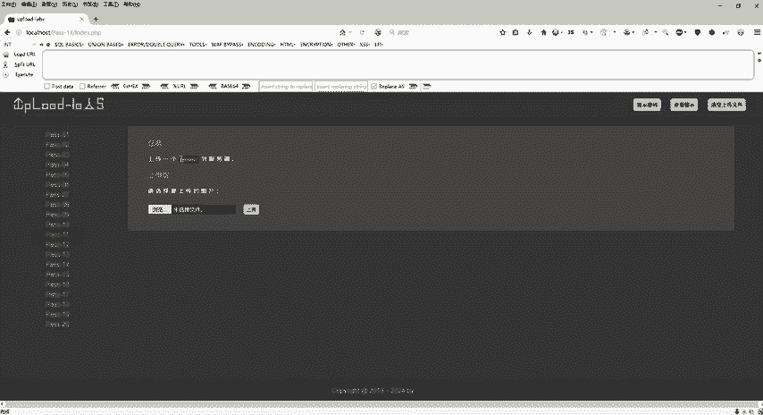

这段代码啊，那么这段代码呢，其实笔记上也给大家写了的啊，也给大家写了的这个。😊，案例要求什么呢？PHP的这个magic这个为of状态，对不对啊？那PHDP的这个magic quote什么GPC啊。

我们来看一下啊PHGP。😊，打开啊 studytuday，然后这个里面有个其他选项菜单，啊，这里面是不是有1个PHP的一些参数啊，对不对？是不是一参数？那我们找到这个my。magicquiJPC这个呢。

😊，是关闭的啊是关闭的，所以它这道题目也要求我们关闭而这个已经设置好了的。各位，如果说做这道题目发现你们自己的PHP study这个开关是前面有个勾勾的，我们把这个勾勾给它取消。如果没有的话。

我们就这样就不用去修改了啊。好为off状态啊，为关闭状态。那么关键的代码呢在这个地方有个s pass是一个可控的一个变量。那么但是呢它后面还拼接了一个后缀名是不是啊拼接了后缀名也需要我们这个绕过。

那具体怎么去绕过呢？看一下这里有个截图啊。😊，这里参数可控可控之后，后面的啊，也就我们已经上传之后的一些名字啊，被完全重命名了啊，关键是在这一块。

就我们上传之后infer点PHAPP我当我上传到我们这个服务器里面之后，它那个名字啊，都会完全重命名了，是吧？就变成其他的一些东西了，那我是不是找不到，对不对？那么这个用什么呢？用这个00。

截段来进行一个绕过。那么00截段是什么东西呢？00截段是操作系统底层的一个漏洞。那由于操作系统是C语言或者汇编语言写的，那么两种语言在定义字符串的时候，都是以这个斜杠零啊，作为字符串的一个结尾。

那么操作系统在识别字符串的时候，当读取到这个斜杠零字符，就认为读到了一个字符串结束的符号啊，那也就是我们用这个00截段，把这个。😊，跟把前面的字符上跟后面的字符上中间给它进行截断啊。

所以说用这个插入斜杠0这个字符的方式修改数值包啊。那么同样的啊，那具体的一个情况，这里也写了。比如说我正常上传的路径是点点杠upload，然后上传的文件名是漏洞点击BG。

那么正常情况下是点点杠upload下面的漏洞点击BG啊，这是正常的一个情况，大家应该都明白吧。好，如果根据这个啊，根据这个这是第十一关的上传文件来说，它是这么传的。😊，upload1点PHP。

然后后面跟上一个百分号00啊，跟上百分号00。然后我上传的文件是漏洞点GPG。那上传之后拼接的路径中间是不是有个百分号00漏洞点击PG是不是好？我已经。

传了1个1点PHP然后我为了要绕过它验证我们这个图片，我是不是又上传了一个图片上去。好，我把图片上传。故意干什么呢？让他放我过去。但是我在这个前面加上1个00阶段。

其实真真正正传过去的是不是我的1点PHP这个文件，所以说呢他把这个00阶段当做结尾。那么保存的文件为upload1点PHP是不是就是我想要的东西。好，具体的步骤怎么去做呢？同样的啊，回到我们这个里头。

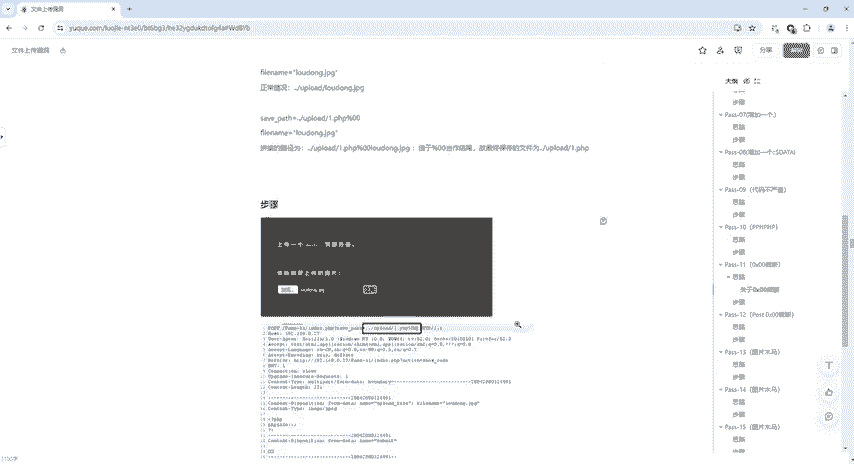

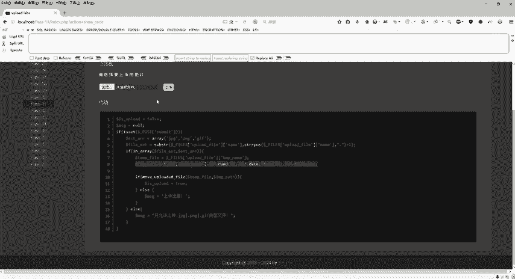

点击浏览啊浏览什么呢？啊，这里都有啊这里都有。😊，漏洞点JPG是不是啊啊？上传漏洞点击BG，然后修改修改我们这个s pass。这个s pass因为是可控的啊，是我们自己可以去设置的。好吧，好。

回到这个地方，浏览点击漏洞，点击PG上传之前打开我们这个BP拦截，点击上传。😊。

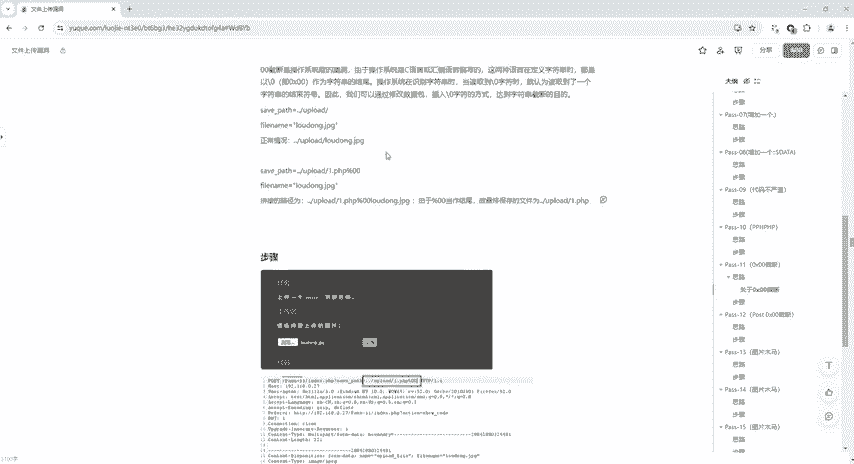

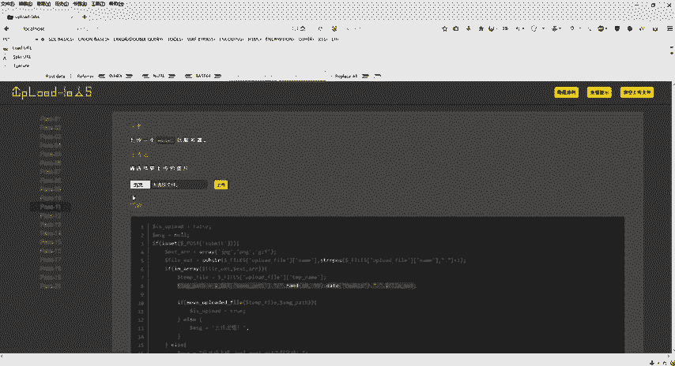

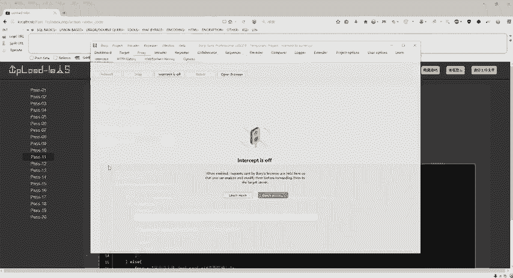

好，那么上传之后，我们改哪里，在这个地方给它写一个名字，写个什么呢？1点PHP2点PHGP3点PHP都可以啊，都可以。好吧，好，我们这边就写一点PHP给它来一个什么呢？啊，注意啊。

这个地方我们给它来个小写啊，给它百分号00啊，也就是说看到百分号00，我就把后面的这个漏洞点GPG给它pass掉了。我真真真正上传到服务器的，是不是这个1点PHP对不对？好，把它改一下，改一下之后。

我就直接把它。😊。

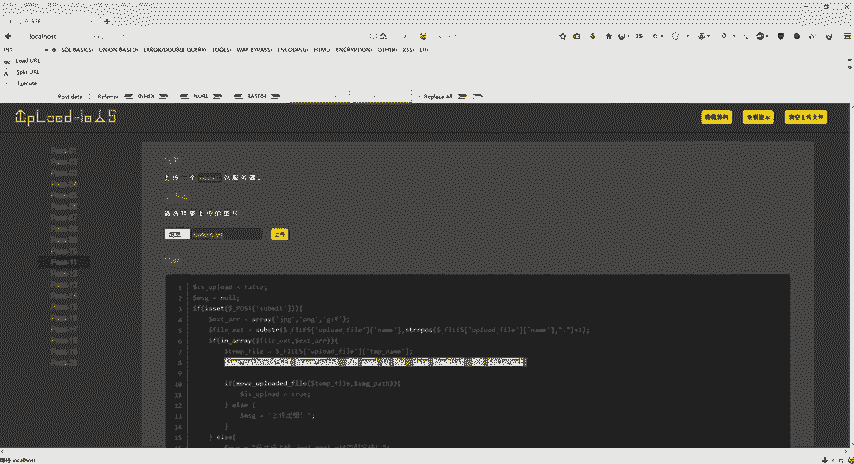

关闭拦截上传了吧，是不是？那么上传成功之后，又键复制专记者，我看看啊，在哪里ctrlV是不是这个玩意儿，是不是这个图片，但是我们一回车报错了，对不对？但是我们真正真正执行的。

是不是绕过了这个GPG是不是前面有个00阶段，把这个删掉，回车是不是可以执行。好了，这个是第11关的00阶段啊，第11关的00阶段？😊。

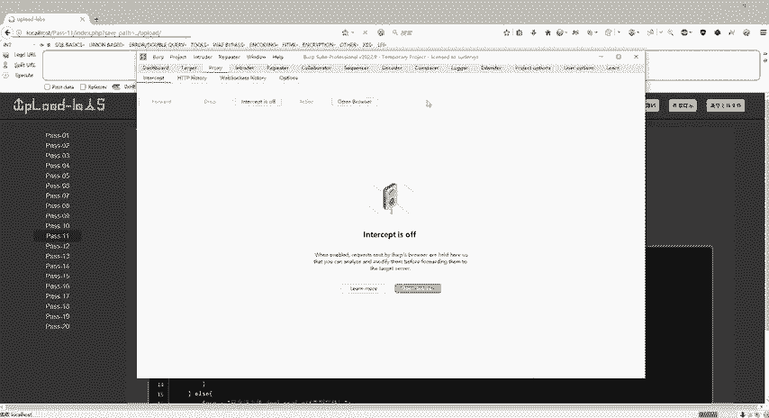

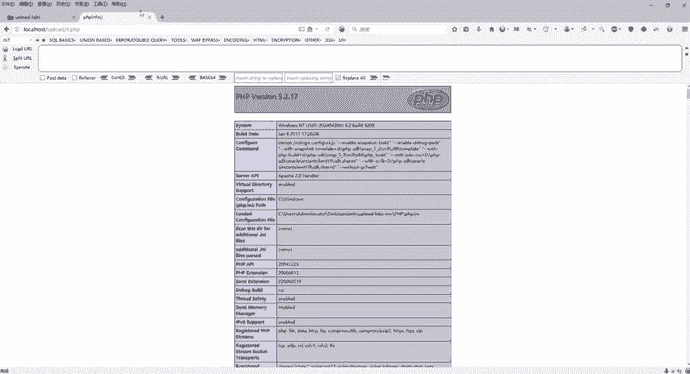