# B站首推！建议所有想参加CTF夺旗赛的同学，死磕这条视频，2024年字节大佬花一周时间整理的CTF入门保姆级教程！从入门到入狱（web渗透／PHP基／SQL注） - P25：7、文件上传第十二关至第十五关 - CTF入门教学 - BV1JjeJeYE2p

好，接下来我们来看一下这个第十二关啊，第十二关同样的看一下源码。这个源码呢其实跟我们第十一关的源码是差不多的。但是啊我们把这个给它ctrl C，然后呢把它粘到这里来。好，这个是第十二关。

那么第十一关的源码也是这句话，我们来对比一下啊，ctrl C。

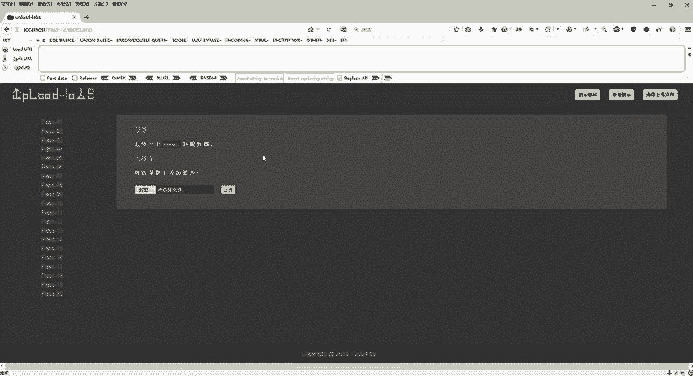

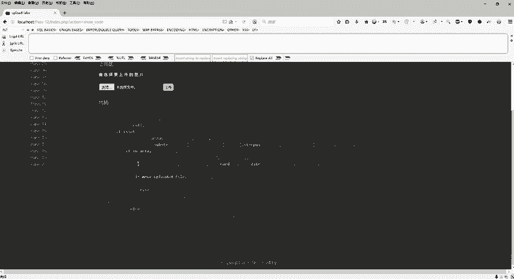

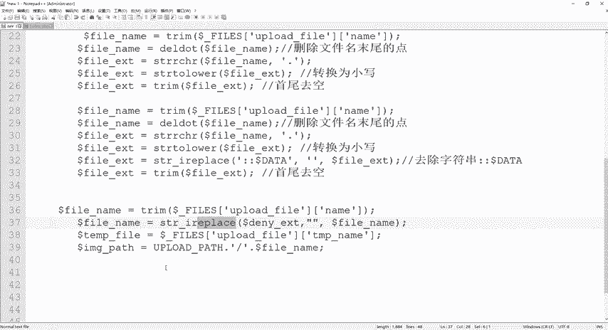

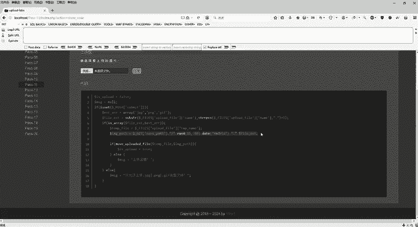

好上面是第十一关，下面是第十二关代码看上去都是一样。关键一点呢，哪里不一样，在这个地方。对吧这个地方是一个get，这个地方是个post。所以说呢同样的第十二关也是用我们这个。00阶段。

那么具体的post的1个00阶段要注意什么？

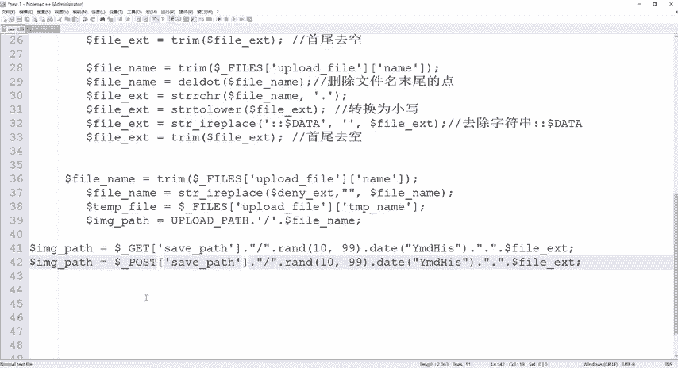

啊，这个po的话啊，po的方式它必须要多做一次这个解码的工作。同样的啊浏览。选择我们这个漏洞点GPG好。

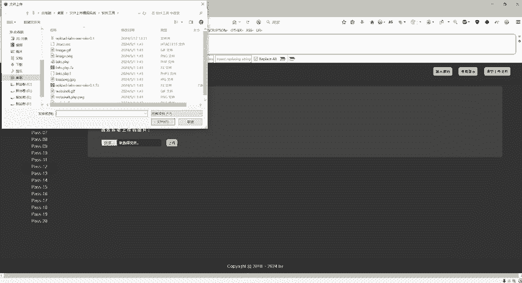

打开。开启是吧。抓包。好，抓完包之后，这里是通过这个pos的提交方式啊。那么。刚才我们第十一关的时候，是不是在这里改的，但是我们这个第十二关pos的提交方式会发现它的地址是变了，跟第十一关完全的路径。

完全的那个地方是不一样的。那怎么去改呢？具体怎么去改呢？我们在这个地方是不是有个上传，对不对？好，然后它保存的这个路径在哪里，是不是在这个地方。😊，那具体的怎么去玩啊，具体怎么去玩。

我们同样的按照第十1关的套路，我给他来1个什么1点PHGP2点PHGP是不是一样的啊，给他来一个什么叉叉点PHP给他来1个百分号00。😊，这样就可以了吗？这样还是不行的啊。

因为它是pose的传参pose的提交方式，所以说我要对它进行解码。那么具体怎么去解码呢？我们把它放在这里来啊，右键send to我们这个repeat重试模式。好。具体怎么解码？第一步00阶段已经写好了。

选中啊选中这个摆放00右键这里有一个什么呢？有个convert。selection这里有个URLUILde这是个解码。那么解码完了之后，这个00是不是看上去就不见了，对不对？

所以说呢这个第十2关跟第十1关就多了这一个步骤。好，解码完成之后点击s的好，看一下这个里面是不是上传成功了。OK搞定。好，这个是我们的第十二关啊，第十二关。😊。

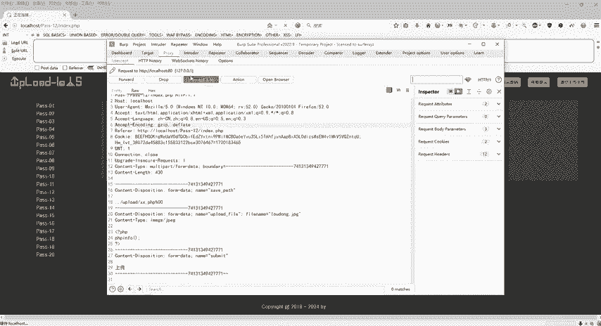

好，但这个里面上传失败，对吧？有的人要问啊，为什么这里上传失败？因为我们刚才在这个BP里面已经成功了，对吧？然后我把这个数据包给它放过去了之后。😊。

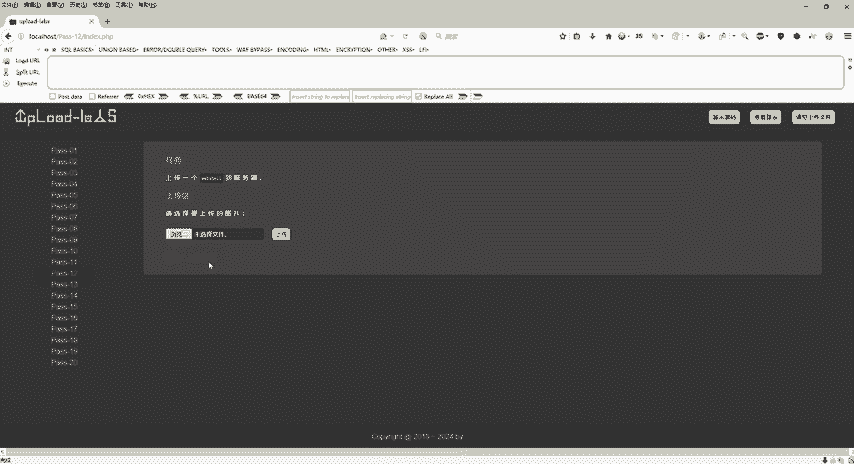

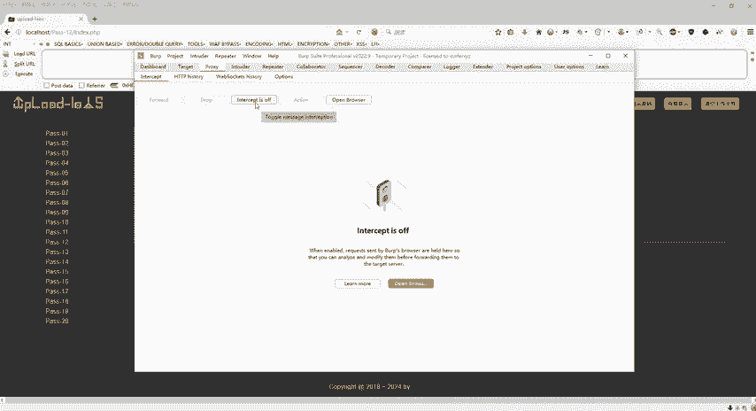

导致的这个上传失败，知道吧？所以这个是没有太大的影响的。好，这个是第十二关。那接下来第十三关啊第十三关、十四关、十5关。哎，这个都是用什么呢？都是用那个什么图片码了，对不对？好，我们来对比一下啊。

这个是1到12关，上面只让我们去上传一个web share。但是从第十三关14关15关开始，它多了一个什么呢？多了一个文件包含漏洞，对不对？😊，好，也就是说我们把这个图片或者文件上传完了之后。

我们还要验证一下文件包含漏洞。也就是说我们不是说用这个ctrl C复制图片路径，直接到这个浏览器上面执行了，必须要用这个文件包含漏洞。用这一块去验证我们这个图片码是否能正常运行。好。

那么这个第十31415其实都是一样的啊，都是一样的。好，那第十三关具体怎么做。上传图片木马对不对啊，上传图片木马，那怎么去上传的，我们来看一下源码啊，那么这个源码呢，它这里有个什么打开，然后呢。

读取它只读两个字节。

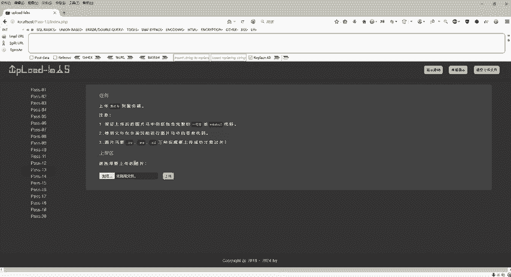

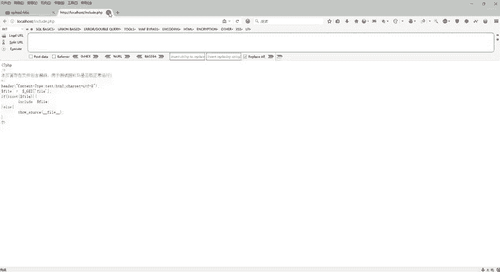

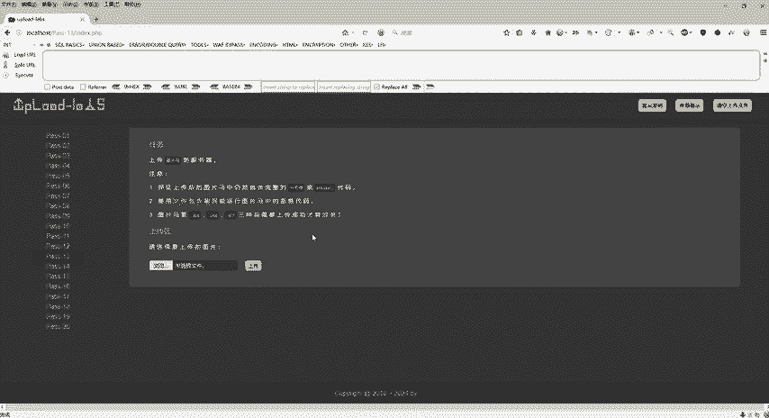

那么这个案例啊，它会验证上传的内容。刚才也跟大家去说了，我们是不是要验证图片里面的格式，图片的内容，还有图片的类型，图片的大小啊，是不是这样的话是不是可以防止文件上传漏洞。那但是呢这个地方。

他读两字节什么意思啊？也就是说我们现在1314、15这三关骗不到他了。我们直接上传那个PHP对吧？直接上传那个漏洞点GPG的话呢。是不是就骗不了他了，他会干嘛？他会把你这个。

图片打开看看一下里面到底是什么东西。好，打个比方啊，我们刚才在1到第12关的时候，基本上都没有去。

验证只验证的一个上传的这个尾巴是PHP是JPG，对不对？但是从第十三关，他会把你这个图片给它打开，怎么打开的呢？我们找到这个地方。工具里头。我们随便打开一个。图片好吧。

那比如说这个地方漏洞点击BG使用我们这个n pad加加给它打开之后是1个PHP。好，但是我如果说啊在第十三关直接上传这个漏洞点击BG很快就能被它识破。

因为它会把这个文件打开进行读取读取好看到你是1个PHP那肯定是不会让你上传的那具体的怎么去判断的啊，这个漏洞点击BG打开是1个PHP是不是好，然后我们简单打开这个PNG好，右键打开一下。

看一下它这个PN机的话，它是以这个开头的，看到吧？这是正常的图片，它是以这个开头的。好，这是PNG，然后再打开GF。😊，走。它是以GIF89A开头的好，这是一个正儿八经的GIF对不对？好。

那么除了偏NGGF还有我们的GPG，对不对？好，刚才GPG这修改了，就是我们打开这是PHP是不是肯定不会让你上传啊？所以说每张图片啊，它都会去把它打开进行读取，看一下到底满足不满足GIFPNG。

还有我们这个GPG的一些特征。如果你是传的这个有这个特征的，哎，我就让你过啊，所以它是变成就是开始变得很精明了啊，所以说照第十3关第十4关第十5关木马只要把一关搞清楚。

那么第十4关第15关都是这么去过的。好，那么具体的怎么去操作呢？😊。

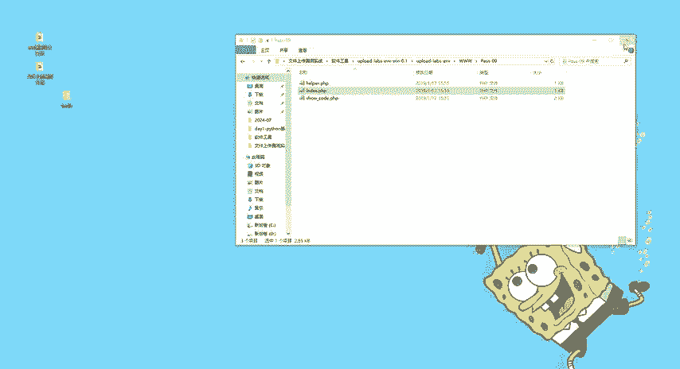

好，我们回到这里来。第十三关啊。我们要在正常的图片里面插入恶意代码啊，我们要在正常的图片当中插入恶意代码。

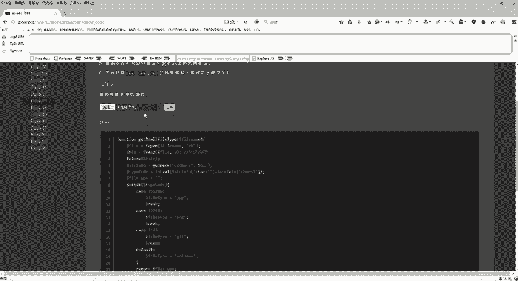

也就是说，我既要保证图片码的一个特征，又要在这个图片里面插入这个PHP infer或者一些木马病毒，对吧？在里面那怎么去插入呢？这里有个命令啊。

copyimPNG杠B加上infer点PHP杠A生成一个web share点PNG。这一句命令就是说把PNG跟这个PHP代码给它重合。放到一起去，那么放到一起去之后，它生成什么呢？

同样的啊也给你们提供了，它生成是一个web share点PNG啊，我们同样的打开看一下，它拥有我们这个PNG的一个特殊特点，对吧？特殊情况，是不是这个玩意，这是我们的PNG它认识吧，打开之后啊。

我看了一下，这个是符合我们这个PNG的一个特点的，是不是？但是它没有去检查里面的一些东西了。我们往下走。😊，刚才通过什么呢？通过一个合成，我们把这个PHP in的这段代码给它插入到了这个图片码当中。

它识别不出来，这是恶意代码跟我们正常的PNG图片给它一合成。那么合成之后。好啦。那我们现在干嘛呢？浏览选择PHP跟这个。

PNG合成的叫web share点PNG点击打开。好，那么点击打开之后，点击上传。😊。

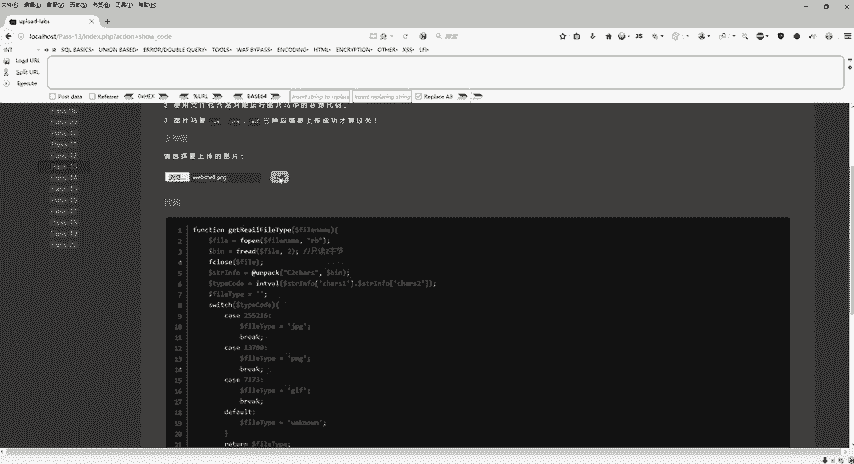

上传成功了吧，对不对？上传成功了之后，并不是说右键复制图像地址了啊，这个必须要我们使用文件包含漏洞来验证一下能运行里面的一些恶意代码，能把PHPin给它正确执行。那怎么去玩呢？我们同样的。点击啊。

这首先还是一样的啊，复制图案地址放出案地址我直接来运行的话，它就是一个图片，对不对？但是我如何运行里面的PHPOD代码呢？必须使用这个文件包含，那么文件包含这里是不是提供了一个什么呢？

那么include后面接上一个参数等于什么呢？等于我们上传的路径。那么上传的路径在哪里呢？在我们本机的up load靶场里面，我们来看一下啊。

3W目录下面有一个up load我们所上传的一些文件都是在这个里面，那我们刚才上传的是什么？上传的是一个图片码，对不对？好，上传图片码呢，我们看一下啊，现在是4点58分59分，就是刚才上传的这个。

这是我们上传的图片，那么上传成功之后，是不是在upload下面啊，那我们回到浏览器。😊。

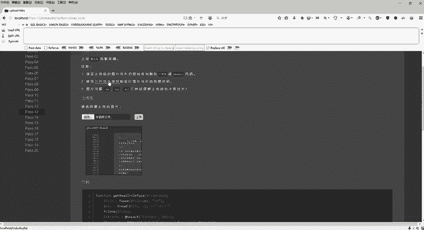

好，直接拼接拼接什么呢？刚才我们复制下来的地址。😊，我们把这一段给它删掉。执行什么？运行我们上传之后的图片，就这个图片吧，对不对？好，利用文件包含漏洞来执行这个PNG。好，看一下是不是看上去是乱码的。

对不对？但是往下拉往下拉哎。看到熟悉的。东西没有，是不是他把这个PHP。这个in付PHP音付给它正确的执行了那也就是代表我这个图片码利用文件包含这个漏洞运行的这个恶意的代码，是不是可以正确执行？好了。

这个是我们的第十三关图片码。

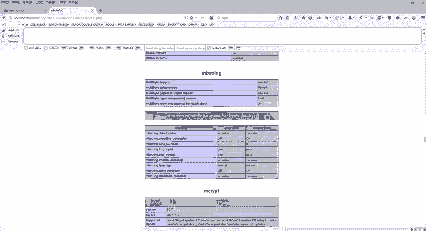

好，第十三关结束之后，那第十四关，第十5关同样的也是采用这个。去做啊，第十四关同样也是。上传什么呢？跟第十三关的图片木码是一样的啊。好。

我们快速的过一下浏览选择web sharePN机上传右键复制图像地址，使用文件包含漏洞，给它加上一个问号fi等于upload，接上我们这个地址。

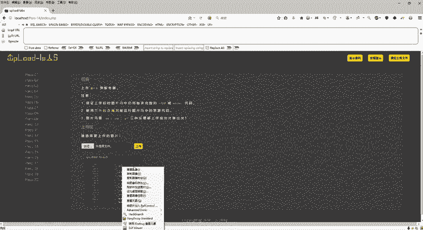

是么要运行这个图片？好，回车看一下PHP infer是不是正确执行了。好了，这个是第十4关。那么第十5关好，同样的啊，浏览web sharePNG。😊。

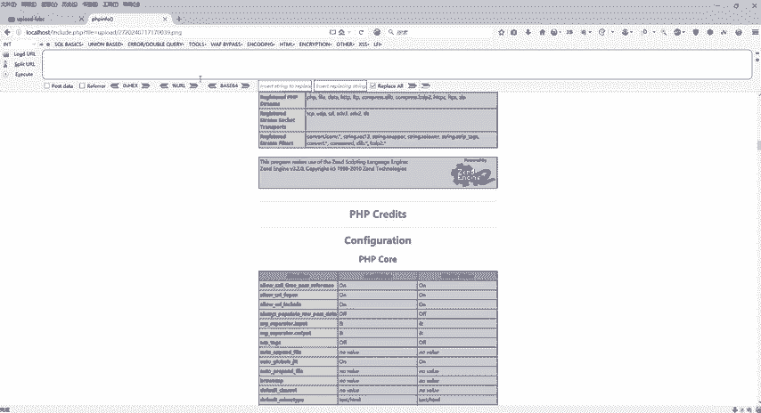

点击上传右键复制图像地址，然后点击文件包含漏洞拼接fe等于upload，对不对？好，把这个玩意删掉。

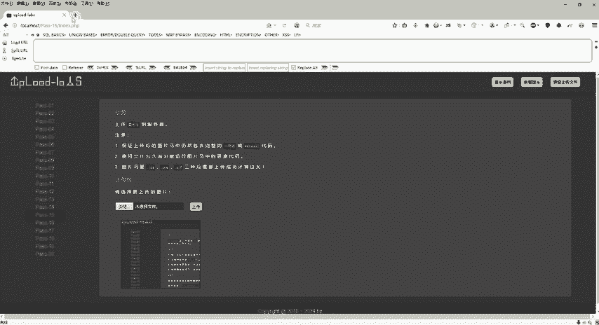

运行772024是不是？好，同样的也是可以执行的。OK好，这个呢就是我们的。

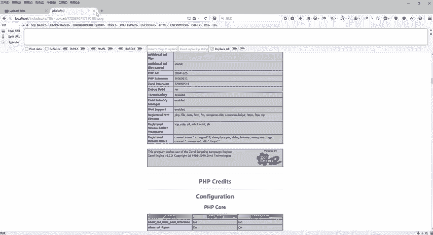

图片木马。

