# B站首推！建议所有想参加CTF夺旗赛的同学，死磕这条视频，2024年字节大佬花一周时间整理的CTF入门保姆级教程！从入门到入狱（web渗透／PHP基／SQL注） - P26：8、文件上传第十六关至第十七关 - CTF入门教学 - BV1JjeJeYE2p

好，接下来呢我们来看一下第十六关啊，第十六关的话同样也是啊上传我们这个图片嘛。那么上传完了之后也是使用这个文件包含漏洞。运行这个图片码中的这个恶意代码，那么图片码也是一样的啊。

JPGPNG还有JIF3种后缀都能上传成功。那我们这个怎么去做啊，我们来看一下笔记。那么这个呢它是属于这个二次渲染绕过。那也就是说你渲染了一次之后，然后把第一次渲染成功的结果。

然后再进行第二次的一个渲染才能去绕过，那么这个地方呢呃贴了个代码啊，这个代码的时候如果使用上传的这个图片之后，对吧？也就是说你第一次上传之后，然后它这边使用上传之后的图片生成新的图片。

所以说呢这个是叫二次渲染，那么这个案例它是使用的image啊JPG然后PNGGF，那么总共有三种的不同的方法。那么绕过的格式不正确的话呢，它就会爆出异常啊，异常是这样子的。

那么也就是说这个题目它是要重新渲染一下图片。那么。

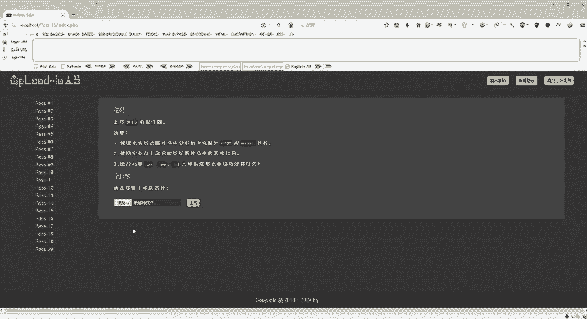

植入的木马图片呢实际已经被删除了。那我们这个案例呢建议使用GIF的一个文件来上传木马。那么GF呢它是支持256种颜色，由于这种特性啊，重新渲染的改动它不会太多。所以说你如果说用PNG。

还有这个GPG的话，它这个对重对这个图片重新渲染的话呢，它改动会很多，那我们就是很就是不容易绕过啊，那么首先它的步骤是这样子的。那步骤的话，笔记上也给大家准备好了的啊。

copy一下这个imagineGF然后in点PHP然后把它生成一个web点GF那么这个东西呢就是上传之后，我和这个服务器里面的文件去进行对比，就是把我们这个恶意脚本呢放到这个没有改变的地方。

那么修改可能会破坏原文件需要多次尝试啊。这边的话呢，老师已经给大家提供了这个。

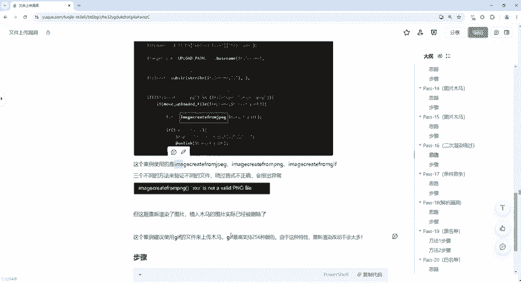

文件啊这个文件我们可以来看一下。好，文件上的漏洞，然后在软件工具里面给你们提供了一个叫web share点JF的这个图。那么同样也是根据这个。这个一句话啊，这个代码。然后把这个GF给它编译好了。

那么编译好了之后呢，我们简单的来打开一下啊，看一下。那我们同样的打开这个记事本。好，那这个是GF89，然后往下走的话呢，我们看一下这个有1个PHP in这个呢就是我们后面啊会执行的一句话目嘛。

但是呢嗯如果说大家想去自己去尝试的话呢，这个PHP in不一定是放在这个位置，可能是放在其他的位置啊，我们再往下走啊，一直往下拉。那这后面还有一个撇就是PHP音付啊，也是也是我们的恶意代码。

那么同样的啊，因为这个恶意代码。就是在上传之后呢，就是比如说我现在上传一个新的文件，那么上传之后，它会把我们做这个改动啊，会做一个改动。我们来试一下吧。

那么浏览然后选中我们刚才的这个we share点F，这个是我已经做好了的啊，全部都会给到大家具体的这个呃软件，然后还有具体的这些图片，还有什么呢？还有各种各样的资料啊，同学们。

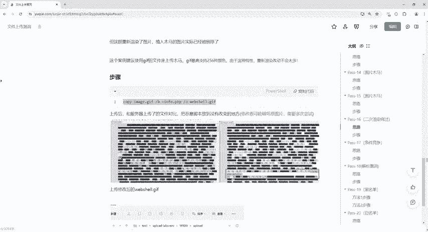

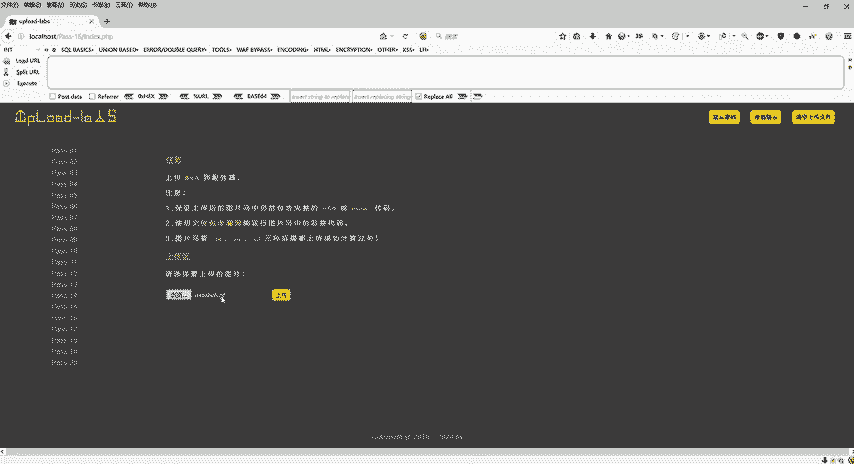

都是在我们这个评论区自取就可以了。好吧，这边有GFPNG是吧？PHP都写好了的啊，这个是我们的这个upload跟las这个靶场，同样的也是可以去部署的。好。

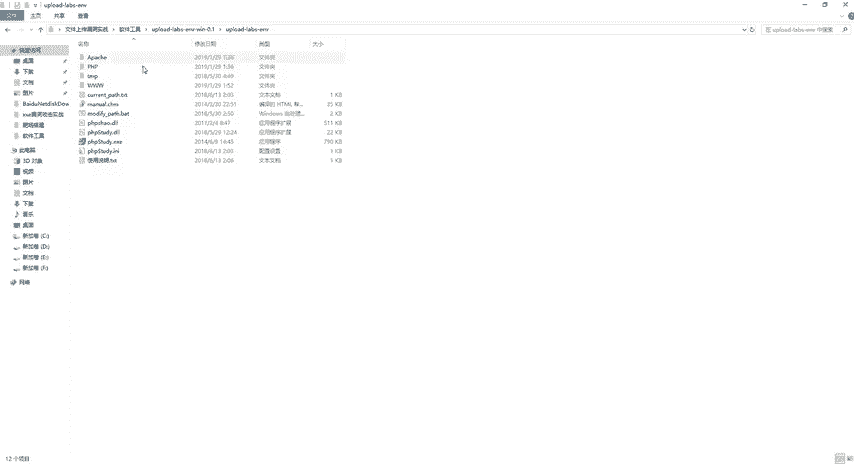

那我们直接点击上传。好，在这边呢已经上传成功了。因为我们这个呢是上传好了这个图片，好吧，那我们怎么去做呢？右键然后复制图像地址，然后点击这个文件包含。

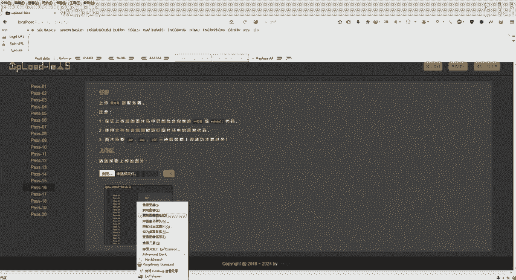

同样的还是使用上一关的方法，后面接上一个upload，然后呢把这个给它粘进去。那么粘进之后会发现啊它这个图片名字已经被改了啊，改成30453点JIF好了，我们直接回撤那回撤之后，同样的GIF89A。

然后看到我们这个PHPinfer它已经执行了。好，这个呢就是第16关。

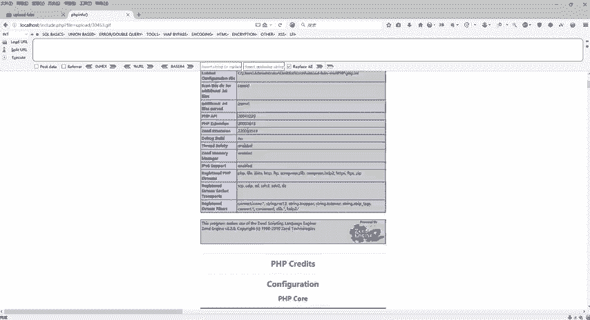

好，那第十七关呢是什么东西啊，第十七关会发现它跟第十六关缺少什么呢？不需要我们用这个文件包含漏洞。那也就是说这一关它不允许我们用这个文件包含漏洞去检测了。那同样的也是上传图片。好。

那回到我们这个笔记上面来第17个，它是我们的一个条件竞争。那么条件竞争它什么意思呢？就是说你先还是我先比如说我先走一步，你再跟着我走，然后走着走着之后呢，可能你会跑到我前面，也有可能呢我会跑到你前面啊。

这个是我们的一个条件竞争啊，它具体是怎么竞争的啊，这个其实它是一个白名单验证啊，具体笔记上面全部都会有它会就是告诉你们就是这个是白名单验证还是黑名单验证啊。那我们第十7关就是一个白名单验证。

那么这里有一个函数叫linklink函数呢是这个删除文件，那么rename函数是进行文件的移动，同样的也会。😊。

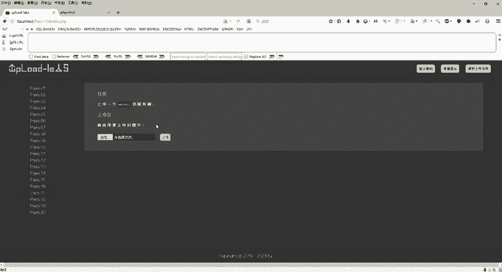

删除原文件。那也就是说这个代码呢，它原来是可以借助我们这个文件包含漏洞的。但是呢我们可以看得到它这里没有给我们提示需要用文件上传漏洞，对吧？哎，那也就是说我们是不允许使用文件上传的这个。

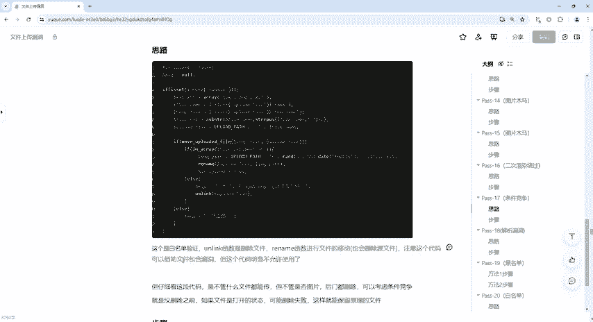

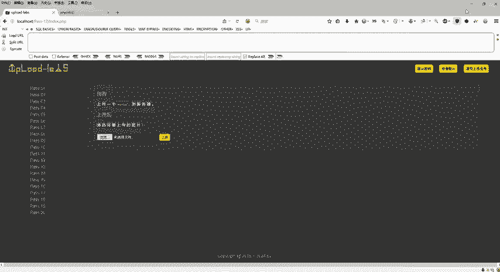

漏洞的文件包含的啊，那我们这个代码呢，它明显不允许使用我们这个文件包含。那仔细看这段代码。那么不管什么文件都能传。但是呢它不管是否图片，那后门啊，它都会被删除。那也就是说你传上去之后，他立马给你干掉。

传上去之后立马给你干掉。那也就是说这个就是一个条件竞争。那我们具体怎么去做。那么我们可以考虑条件竞争的时候，就是在它没有删除之前啊，如果文件是打开的状态，那么可能删除失败。那也就是说我们打个比方啊。

就说呃我如果是这个文件夹和这个文件现在已经打开的。那是如果说我现在在它打开的情况下右键给它删除的话，它是会提示我们删除不了的，它说已经在运行，对吧？无法删除该文件夹或者该文件，那么也就是这个题目啊。

第十七关，也是利用了这个逻辑。😊。

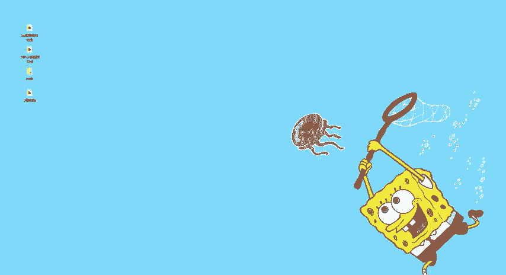

这个在文件打开的时候，我们让它执行，那么让它删除失败的话，它就可以保留原有的文件啊，就是原原来的这个文件。那么我们具体的步骤怎么去做啊，我们还是来放一个in点HP好，那同样的啊，这边也是有步骤的。

笔竟呢具体都会给到大家。同学们自己自己取就可以了。好，那么回到这里来点击浏览，我还是上传这个in点PHP那同样的打开我们这个BP啊，这个BP还是这么去用啊。

9999跟我们自己的这个浏览器9999是一模一样的。如果说你改成8888，那么你这个浏览器也要改成8888好，回到这里来，我们直接点击开启拦截，那么开启拦截之后，点击上传。😊。

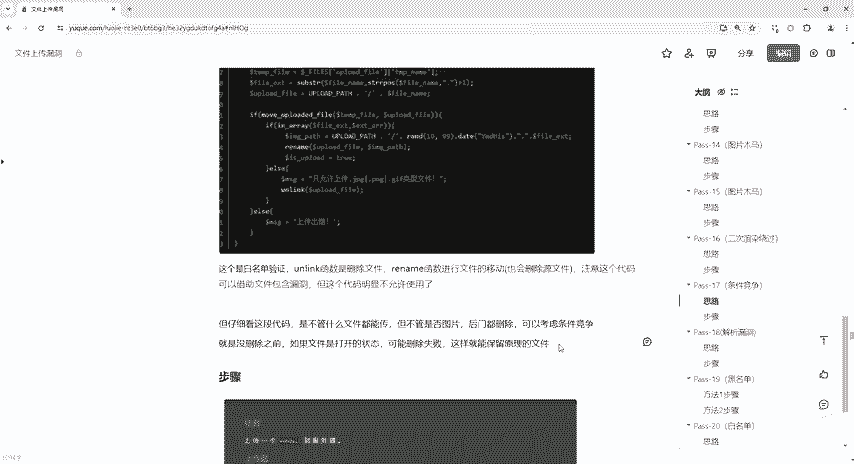

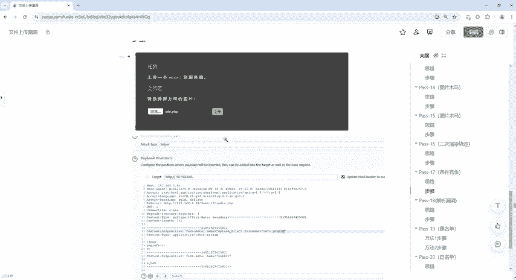

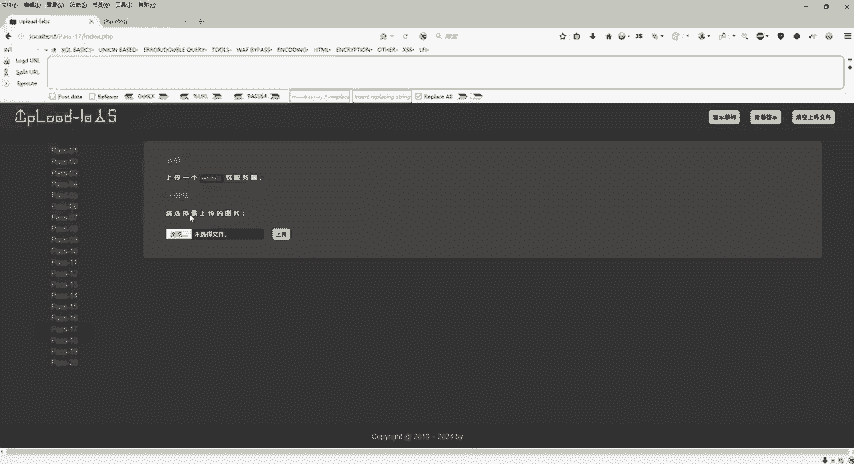

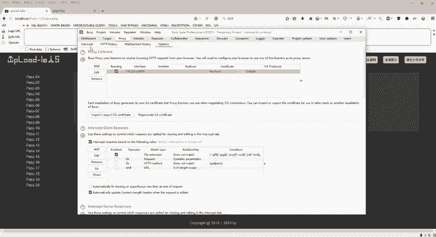

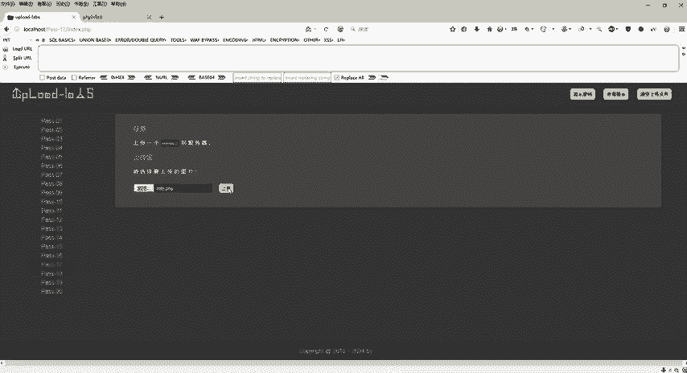

好，那么上传之后呢，我们这个包已经抓到了，抓到之后具体怎么去做呢？

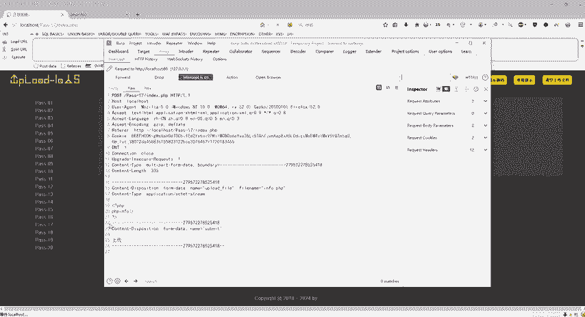

好，我们回到这个笔记啊，那么抓到之后，我们来进行给它去爆破啊，那具体怎么去爆破呢？把它发送到这个爆破模块，然后使用我们这个 payload啊去加载啊，第一步是这样子的。

那么第二步我们就直接把它发送到我们这个爆破模块，那么怎么去爆破呢？就是。😊。

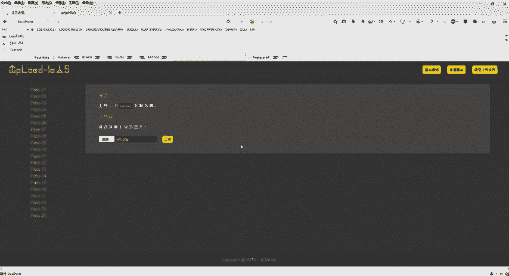

回到这个地方，右键。发送到这个in to啊这个包破模块。那么回到b破模块之后，这个是设置这个simer。然后呢，我们回到这个里面啊，cle一下在哪里去加呢？这个地方也有啊也有，这是。

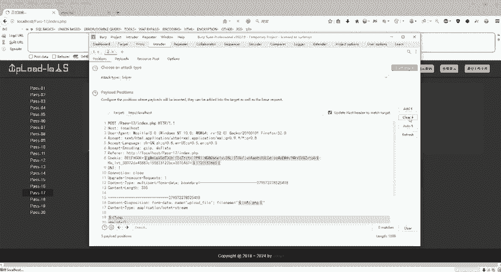

我们在这个地方对吧？infer点PHP后面给它加上一个doller符号，就是给它。也就是我们现在要爆破这个文件名嘛，是不是好，怎么去加啊？我在这个地方。

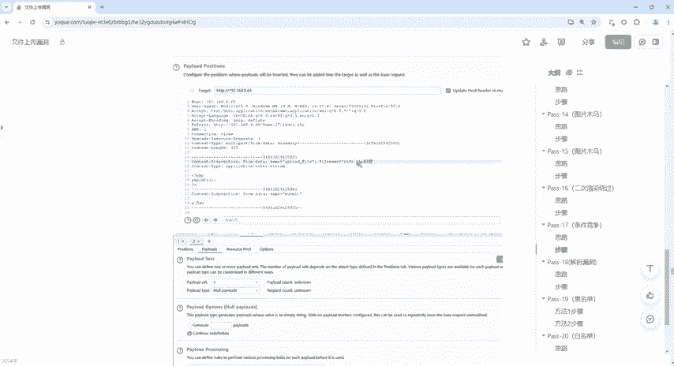

在这个地方空格对吧？空一格啊，一定要空格选中，然后点击艾啊就可以了啊，点击艾就可以了。然后我们在这个地方选择payload，那么payload这个地方呢是让我们去选中我们这个日志对吧？

或者是我们的这个文本文档在文本文档里面就写的什么？就是我们的字典，那么这边呢肯定是没有字典的，这里就选择n payload就可以了。好，那么选完之后啊，我们就直接点击这个啊。

这个里面你既然选择了numb load，那么这里选择一个continue那么continue同样的啊，点击这个continue。😊。

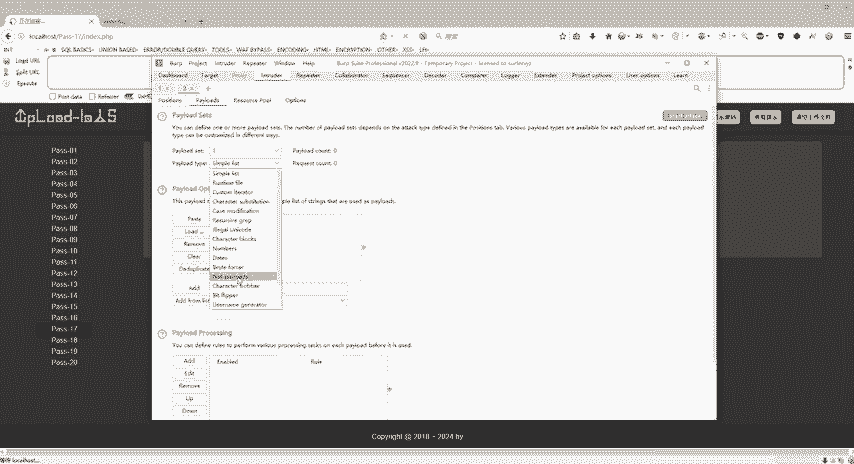

好，接下来就可以了。好，con选中之后，那我们直接点击右上角的这个什么呢？开始攻击啊，开始攻击。那具体的怎么去操作的呢？具体怎么去操作的，我们点击啊点击攻击。那么攻击的话，它是持续持续在攻击的啊。

这个地方它是没有具体的，因为我们没有指定这个字典，所以说它是持续性在攻击在破解的，那么怎么去访问它呢？我们这里有个地址直接贴上这个logo host upload下面。

因为它会传到我们这个upload里面去，对不对？那我们直接频繁去访问这个upload里面的infer点PHP我们点击回车。😊，那没有是吧，我们再来刷新再刷新啊，来了。好，这个呢就是我们的条件竞争。

那也就是说我们的第十七关啊就这么去过的，频繁访问啊，比如说我再来访问一下，是不是又没了，对吧？再来是有了再来再来是吧？哎，这个呢就是条件竞争。

那也就是说在我们它就是我们比如说我们再上传一个这个in点HP啊，上传完了之后呢，它会给我们去删掉。那也就是说我们怎么去利用这个条件竞争呢，就它它删除我们这个in点HP之前，我把这个PHP给它打开。

打开之后是不是就绕过了O那这边又报错了是吧？哎，那再刷新再刷新再刷新啊，多刷新几遍，就是这个就是一个条件竞争好了嗯，这个是第十7关。😊。

