# B站首推！建议所有想参加CTF夺旗赛的同学，死磕这条视频，2024年字节大佬花一周时间整理的CTF入门保姆级教程！从入门到入狱（web渗透／PHP基／SQL注） - P27：9、文件上传第十八关 - CTF入门教学 - BV1JjeJeYE2p

好，接下来呢来到我们的第十八关啊，这第十八关基本上是跟第十七关差不多的。它也是不允许我们使用这个文件包含漏洞的。好，那么回到笔记上面来，第十八关它是我们的一个解析漏洞。

那么它是思路的都给大家贴到这个笔记上面来了啊，这样代码一看就是我们的版名单，那么只允许上传里面的文件，所以呢不能传PHP文件。那么这个具体代码呢，我们也带大家去看一下啊这个地方是吧？

写了什么文件已被上传，那没有被重命名，什么不能上传什么可什么不可写啦，对吧？各种各样的东西，然后这个地方是一个my upload对吧？啊，这个地方有DOC呀，什么XLTX呀。

那么有没有PHP是没有那也就是证明我们这关它也是不允许上PHP的那么具体的怎么去实现啊。😊。

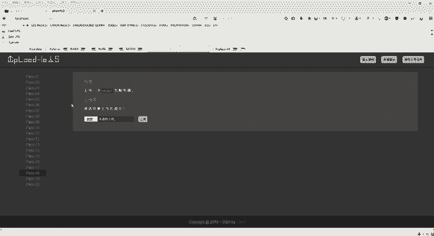

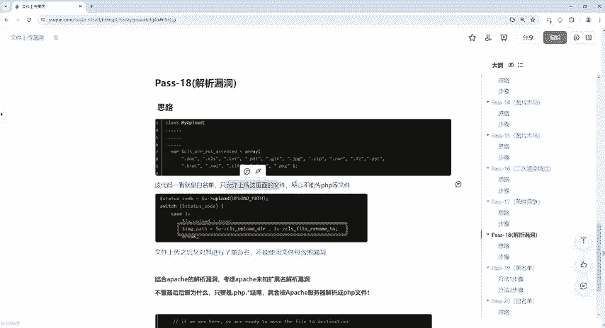

也就只能允许上传我这个括里面的文件啊，所以不能上传PHP文件，对吧？那文件上传之后呢，又对其进行了一个重命名啊，不能使用文件包含的漏洞。那么这个地方同样的。😊。

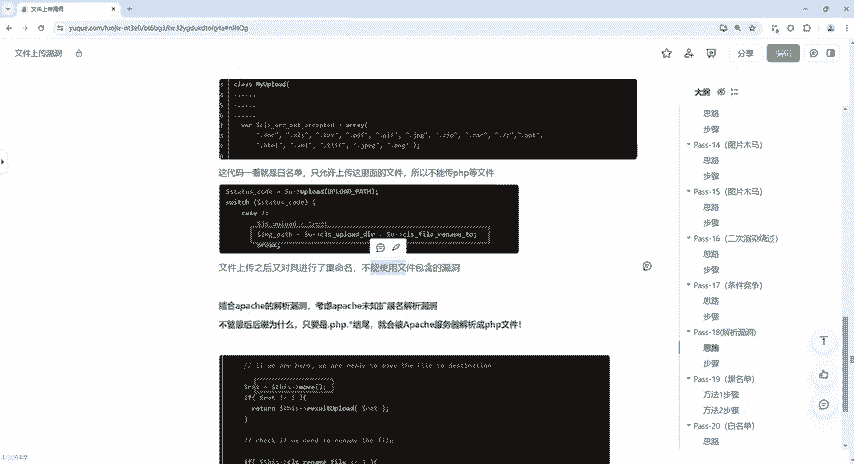

对吧那。但没有重命名。那也就是说。我上传之后，它可能会对我重命名是吧？也可能呢就是你上传的目录不可写。有时候上传失败的话，有很多很多种啊，这个这个这个这个是不是？那文件过大啊，文件类型呃。

就是根据它这个类型文件，它上成不了。那么那么它规定我们上传什么，规定我们上传是这个呃。括里面的东西是不是？PNG啊GPG啊是吧？HTL啊等等等等啊。那我们要上传PHP文件的话啊，那肯定是无法上传的。

而且它还不允许我们使用什么，不允许我们使用文件包含漏洞。好，那机关怎么去做？

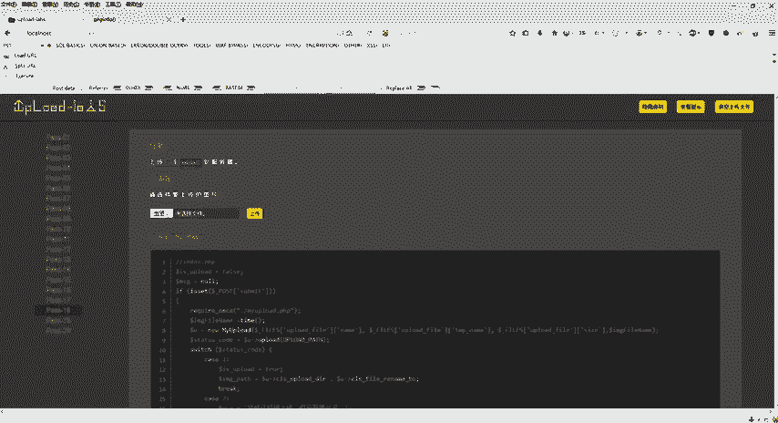

那么综合啊综合案例啊，就在这个地方笔记上也贴了啊，就我们这个有个阿帕奇的一个解析漏洞啊，因为它这个第十八关，它就是我们的解析漏洞。那么解析漏洞，因为我们这个网站对不对？网站的话如果说去访问一些网站。

它这是我们阿帕奇服务。那么阿帕奇服务呢它是有一个解析漏洞的。它有一个什么呢？未知扩展名的一个解析漏洞。那么也就是说它不管最后的后缀是什么，对吧？只要是点PHP点新结尾的。

那么它就会被阿帕奇服务器解析为PHP文件，那么这个就好做了。那么怎怎么做呢？那具体的我们只要把这个末尾给它改成什么点PHP点新就可以了，是不是好，那么这个代码呢，它是什么呢？它是先移动文件移动文件之后。

然后name是重命名啊，修改文件名，所以说它这个地方也是会用到我们第十7关的一个条件竞争。好那笔记上也写了啊，这里是先移动。😊。

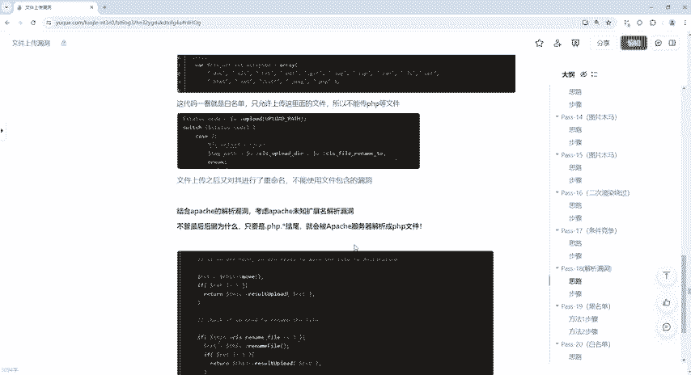

文件在修改文件名，所以呢是存在利用条件竞争的那我们同样的啊这个步骤怎么去做？第一个是复制一个文件，增加一个后缀为7Z的那也就是说点PHP点心。那我这个是点7Z。那么同样的使用它去进行绕过进行爆破啊。

具体怎么去做，还是一样的。跟第17关的思路是一样的啊。好，回到这里栏，我们点击浏览上传这个infer点PHP点7Z啊，上传这个好，点击打开OK好，那么下一步呢是什么？同样的还是发送到这个爆破模块啊。

爆破模块。好。

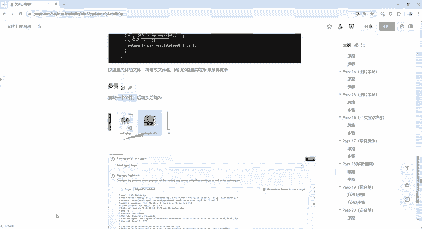

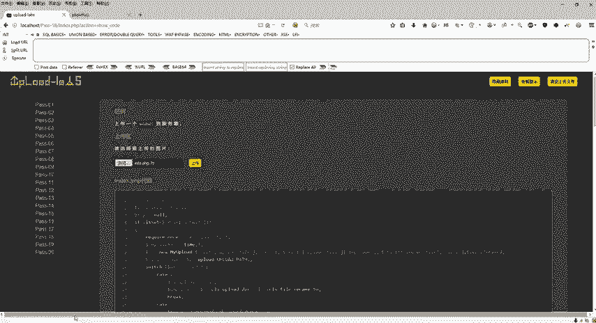

怎么做啊怎么去做？好，那这个地方呢是什么？点GPG对不对？点GPG啊，那么同样呢我们也可以按照这个笔记上面去来去做啊去做好。😊，同样还是选择n payload，好吧。

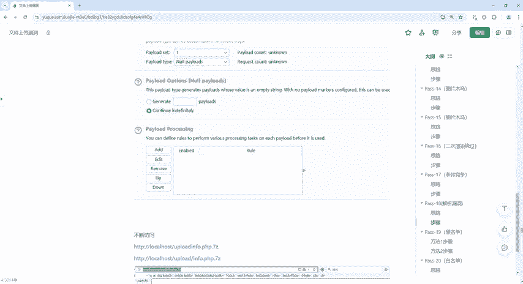

我们具体的怎么去做来。开启啊开启我们这个拦截蓝包，然后点击上传。那么点击上传之后回到这个地方，对不对？它不是只能上传什么呢？只能上传JPG啊，然后PNG啊，什么HTML这些东西嘛。

那我们直接给它改改成什么呢？😊。

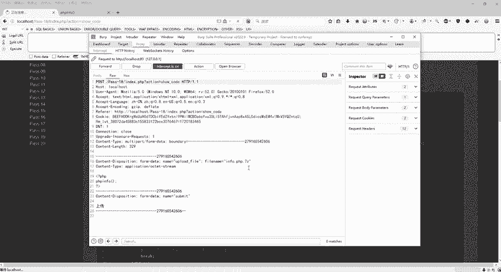

右键对吧？同样的啊，右键发送到这个包破模块，然后选择这个。好，然后呢点击一下这个Cl，好吧，Clear一下好。

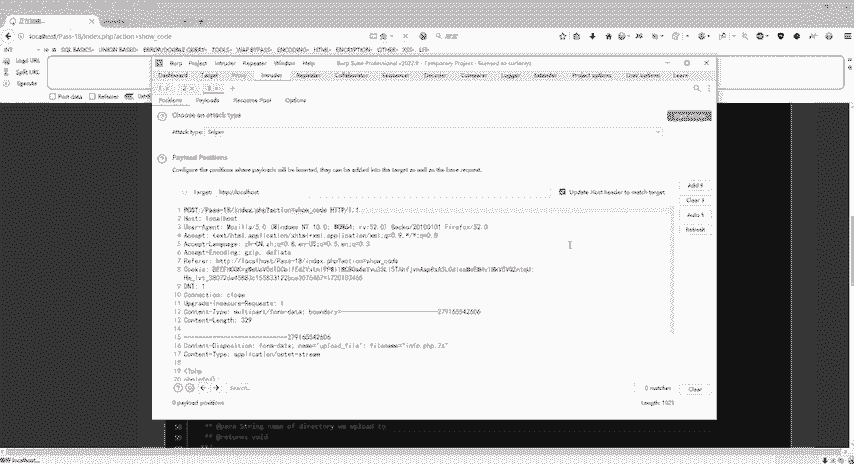

再往下走。允不允许我们传7C也是可以的，对不对？那么允许我们传这个7C的话，那我们就没有必要再去根据这个呃笔记上面来去给它改成这个GPG，是不是？那么这个图片上面是有啊GPG对不对？

那我们直接在这个后面干嘛呢？给它空一格。

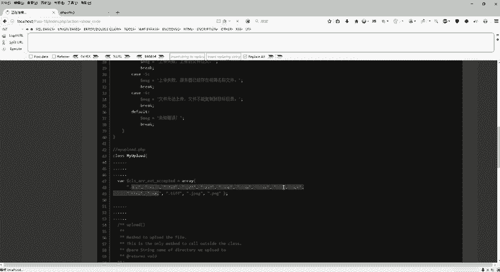

啊，空一个给他艾一下。这里啊一定要注意啊。刻一格，然后选中ad啊两个耳朵看嘛？两个这个符号啊，然后呢payload里面同样的跟第十七关一样的，选择n payload continuetin直接开始上传。

对吧？那么开始上传之前啊，就是我们。

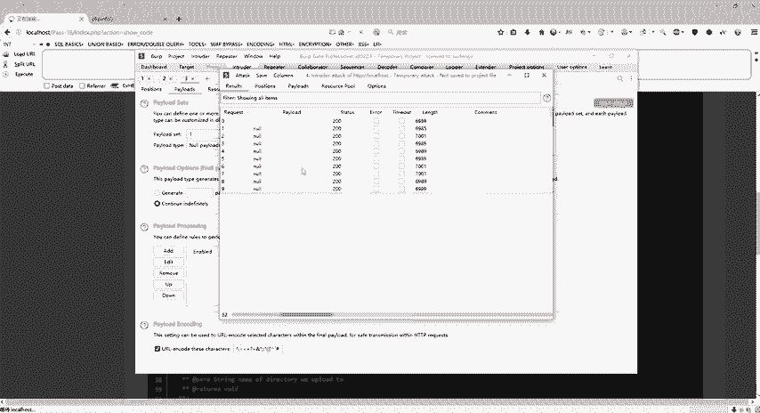

还没有运行啊，对吧？它在爆破，那我们还没有执行。那么我们还没有执行之前，我们来看一下这个里面啊，这个靶场里面它上传到哪去了？是在3W目录下面有一个up load，对不对？好，现在还没有。

是不是那怎么去做？我们同样的啊上传之后第十八关。😊，对吧然后他所有的上传的文件都是在这个upload里面。但是有的时候呢也不一定啊也不一定。那我们怎么去做？啊，怎么去做，它这边在爆破，对吧？这边在爆破。

那么具体的怎么去做呢？我们就直接拷贝一下这个upload下面的什么infer PHP点7Z。好，我们来访问一波啊，访问一下。😊，有没有没有再刷新也没有，对不对？那么这个没有的话呢，我们就访问这个好吧。

好，没有。好，有了，对不对？好。😊，再刷新还是有的再刷新又没了，再刷新有的啊。好了，那么这个呢也就是利用第十7关的条件竞争。然后这个路径为什么有两个呢？一个是在upload里面这个是默认情况啊。

默认情况它会生成在我们自己的靶场里面有一个3W目录里面有个upload里头。那也就是我们所有的上传的文件全部在这个里面，对不对？好。

那么也就是前面的几关所有上传的基本上都是在upload这个目录下面去执行的，但是呢我们有没有看到那个7Z呀没有，对不对啊，7C它上传到哪里的呢？在这个地方，那么所以说我们就执行什么呢？执行执行。😊。

这个叫upload in forPHP点7C那么没有这个斜杠啊。如果说它上传到upload这个文件夹的话，那么这个地方必须要用斜杠。那么我们同样的啊同样的两个。一个一个去尝试啊，这个尝试不了。

那我们就尝试这个。那么刚才呢我们是尝试的上面的，因为它是直接生成在我们这个哪里的，是不是直接生成在这个3W目录下面呢，并没有进upload。😊，这个文件夹好，那我们就直接运行。

upload in连起来的好，同样的再来刷新是吧？哎，没有了，有了是吧？OK好，这个呢是第十八关，是我们的阿帕奇解析漏洞。😊。

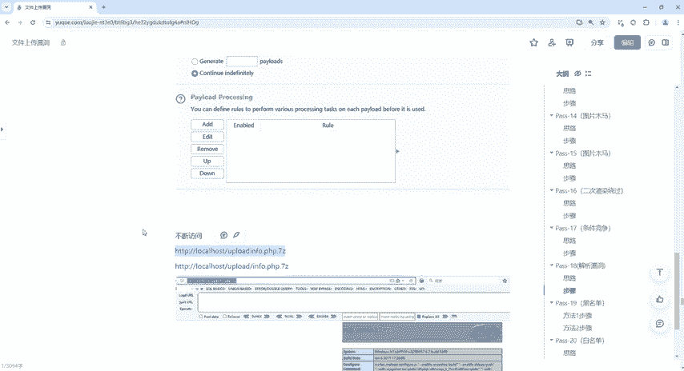