# B站首推！建议所有想参加CTF夺旗赛的同学，死磕这条视频，2024年字节大佬花一周时间整理的CTF入门保姆级教程！从入门到入狱（web渗透／PHP基／SQL注） - P28：10、文件上传第十九关 - CTF入门教学 - BV1JjeJeYE2p

好，接下来呢来到我们的第十九关。那么开启第十九关的话呢，因为我们这边在爆破啊是吧？在爆破的话，那我们要先给它停掉。嗯，点击这个关闭，关闭之后，这边有个discard啊，点它关闭了，关闭之后。

我们把这个拦截给它关掉。关掉之后呢，才能正常进入我们这个第十九关。😊。

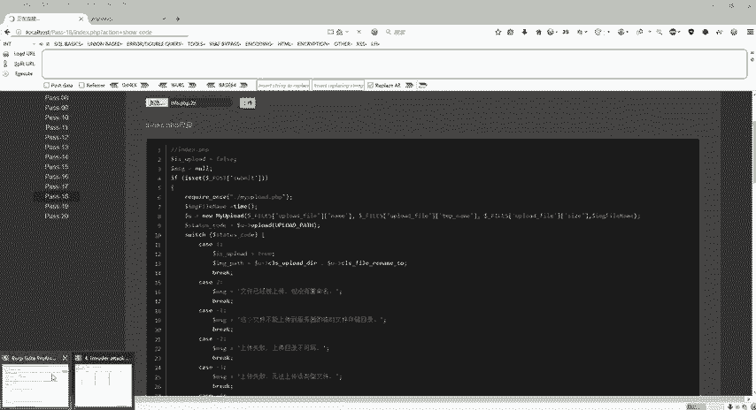

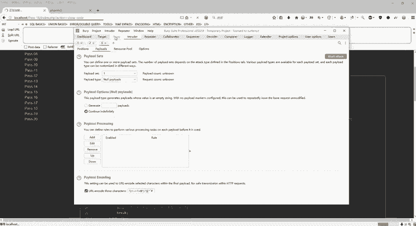

啊，刚才看到了啊第十八关已经上传成功了，对吧？好，第十九关，那么第十九关这个东西呢是什么东西啊？它是上传web上到服务器，然后浏览文件，然后保存的名称是什么？比如说我现在浏览一下。

我上传info点PHP。😊，对吧那么它保存的名字是什么？它保存的名字是upload杠19点JPG是这样子的。那么也就是不管你上传什么，它保存的名称都是这个。那么具体怎么去做啊。

那么第19关它是我们的一个黑名单。那么也就是说我们PHPP5432什么7788的东西还是GSP呀，对吧？全部进了它的黑名单呢，那么这个题目它使用的黑名单，那并且呢它的文件名是可以去控制的。

那么文件名怎么控制的，那么上上一关啊，第几关来着，也也跟大家说了，对吧？那文件名可控，那文件名可控的话，那我们看着这个代码是吧？哎，post。😊。

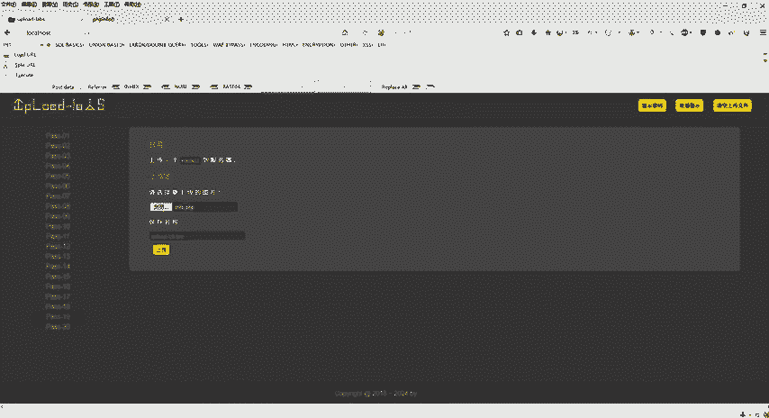

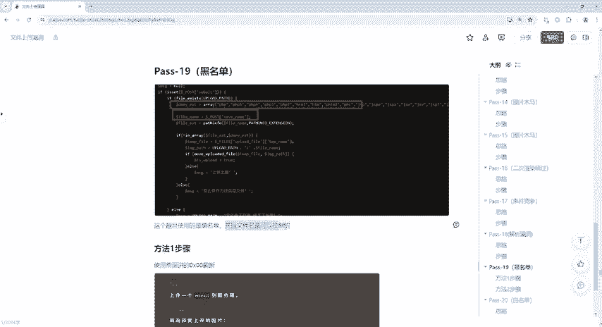

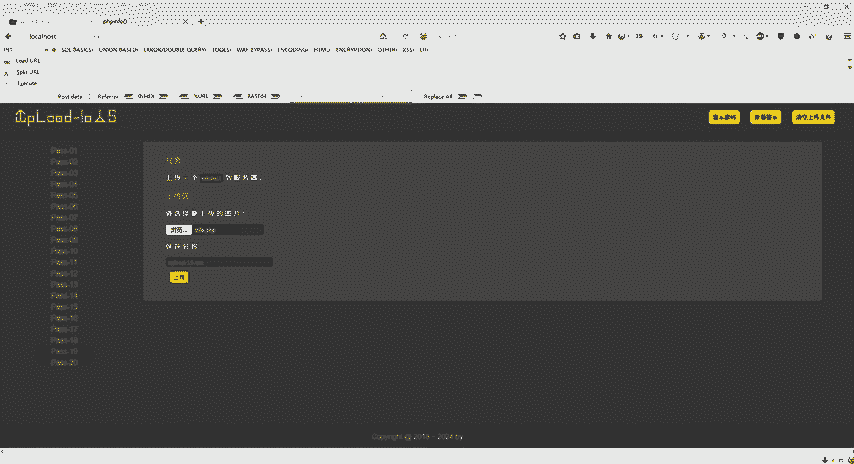

哎，保存的名字。根据pos对吧？用poss的一个方式去拿到这个保存的名字。然后这边。又有了是吧，如果是怎么样，我们就上传出错，或者呢禁止保存为该类型的文件。那也就是说它这个题目。

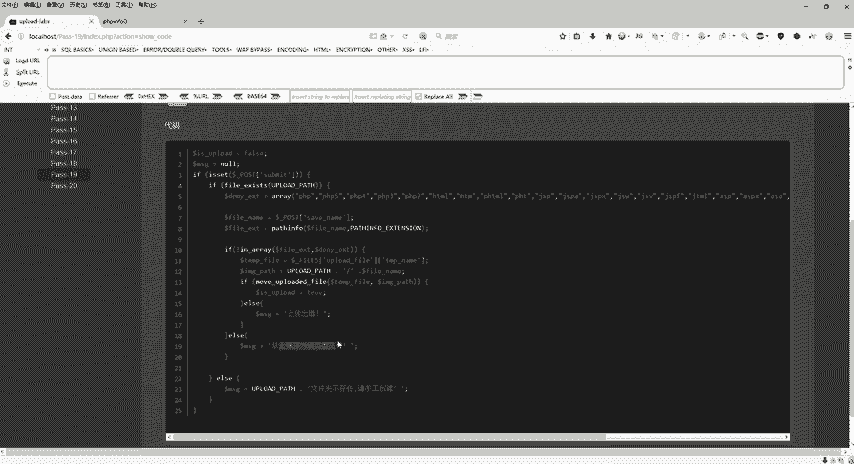

是吧如果说它这个文件名是可控的那第一个方法，我们应该都会想得到用00阶段，对不对？因为它这个类型啊就是它对这个类型进行去限制了，限制之后，那我上传是JPG，它就可以让我上传。但是我上传的是PHP的话。

那我是不是可以把它的尾巴变成GPG然后使用我们这个00阶段对吧？好，那么这一步怎么做啊，同样的浏览，那我们浏览还是选择这个漏洞点GPG啊，因为它要我上传GPG对不对？啊，图片嘛GPG啊GIF都可以啊。

只要不上传这个里面的东西，但是我现在也干嘛要给它上传一句话木马，对不对？上传一个恶意的代码，那怎么去做？好，点击上传之前啊，同样的打开我们这个抓包。

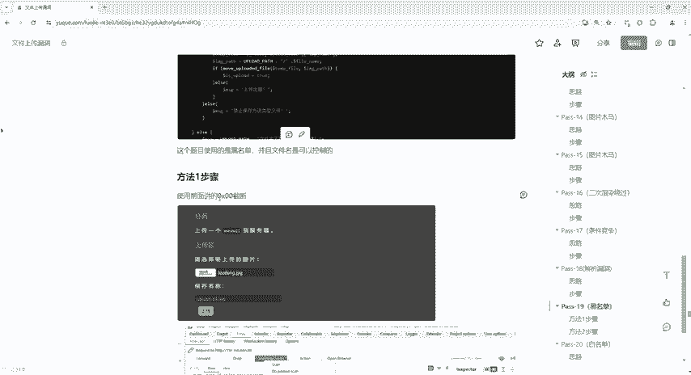

好，那接下来怎么做用之前的00阶段，对不对？好。😊。

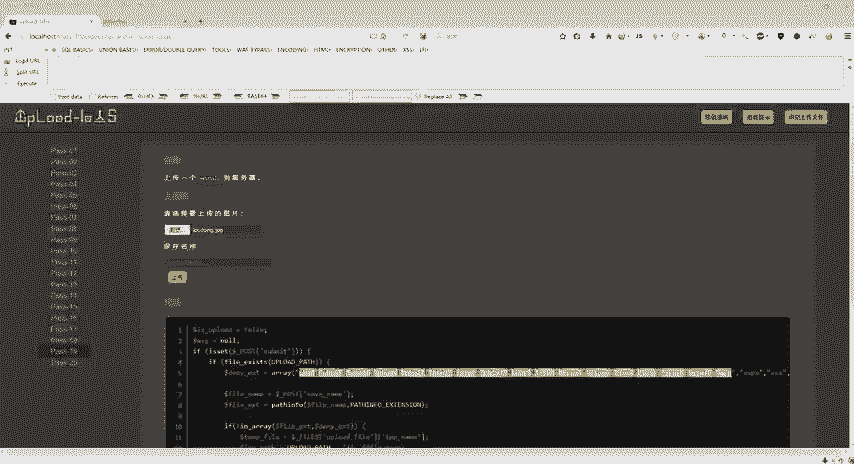

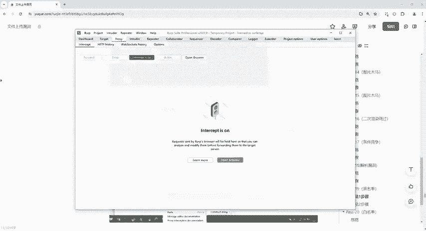

点击上传。好，00阶段怎么去截的呢？我们保存的文件是upload杠19点GPG。但是呢我上传的是漏洞点GPG啊，漏洞点GPG里头呢是我们写的PHP代码是吧？他如果说对我们这个里面的东西给它进行检测。

那肯定也是上传不过去的，好吧，好，那具体的怎么去做啊，那么这个地方是不是把这个upload杠19点PHP是不是？那么具体怎么改？因为我要上传PHP啊。

那么我们直接把它变成点PHP然后后面是不是一个点GPG因为这个呢是它保存的一个文件啊，就是上传之后保存到我们这个服务器后面的GPG是不是才能绕过。那我们刚才看到了这个是使用po一个方式。

那如果说使用这个00阶段的话，在哪个地方截呢？是在这个地方在PHP后面加上一个百分号00，对吧？那么百分号00。😊。

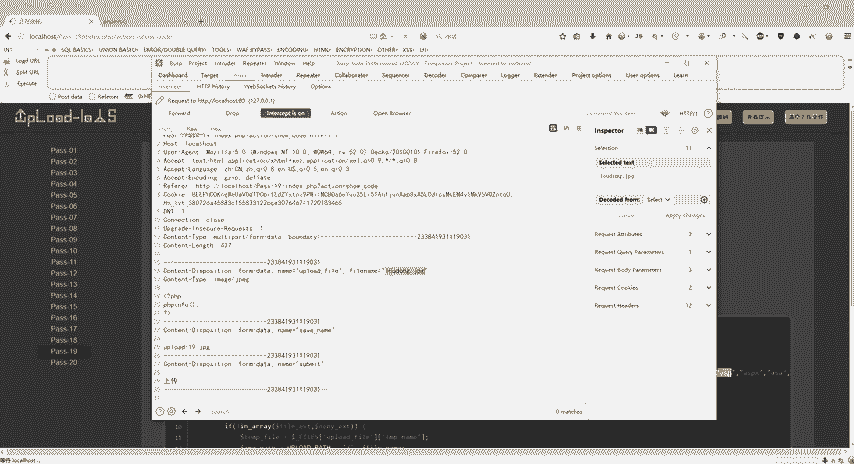

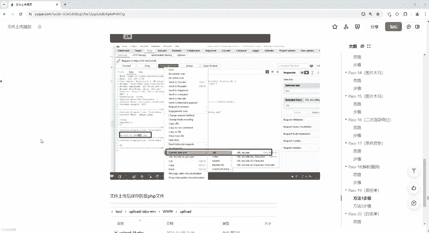

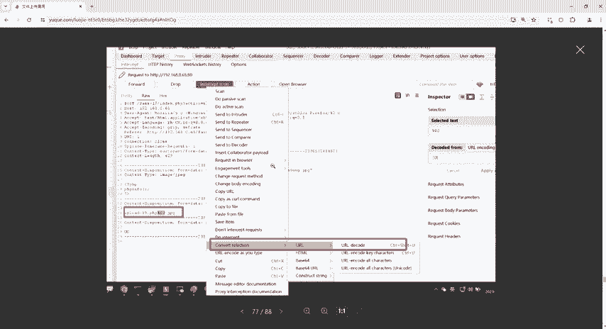

给它加上去之后，那就会把我们这个后缀点GPG给它隔断。那么上传成功的话就是一个upload杠19点PHP好，百分号。00对吧？那么写完本方00，因为它是po的，所以说还是得对对它进行一个什么呢？

格式的一个转换，怎么转？😊，右键，然后选择这个什么呢？UIL对吧？UILde。

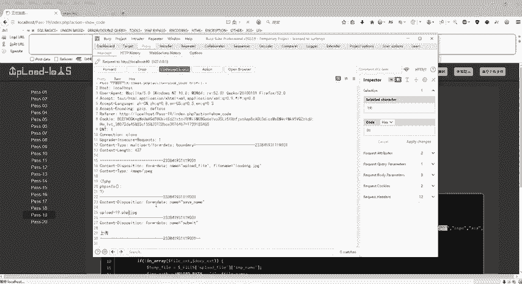

进行一个编码啊，编码完了之后，那我们接下来保存的文件就是什么？就是upload杠19点PHP了。好，具体怎么做，直接放包啊，直接放包就可以了。

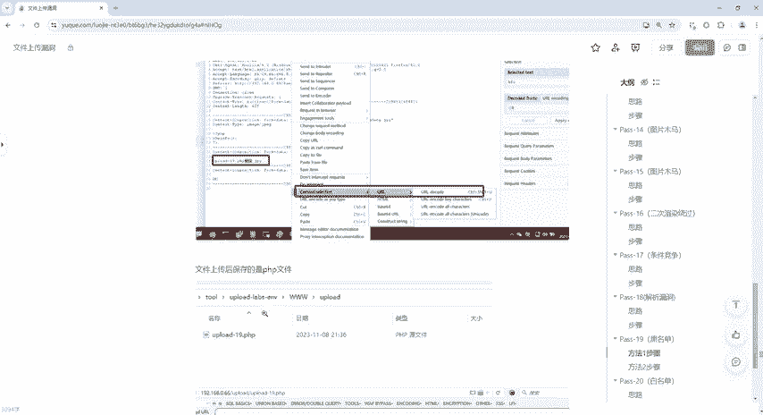

来，放完包之后，右键，然后复制图像地址，然后选择这个地方ctrl V对吧？

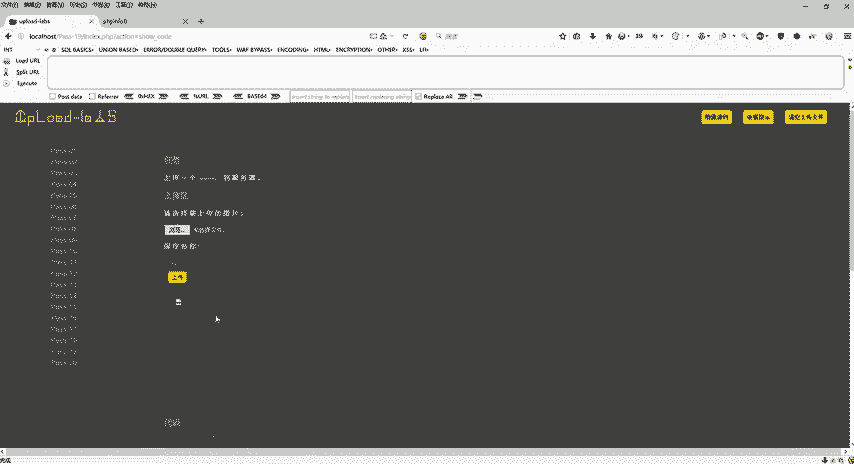

回车哎，为什么报错了嘞？哎，notote found它找不到，那我们要执行是吗？还是一样的啊，前面讲00阶段的时候是有的，对不对？我们把这个接P机给它删掉，运行是不是来了？OK好，这是第一种方式啊。

这第一种方式。那么第二种方式具体怎么去做的？😊。

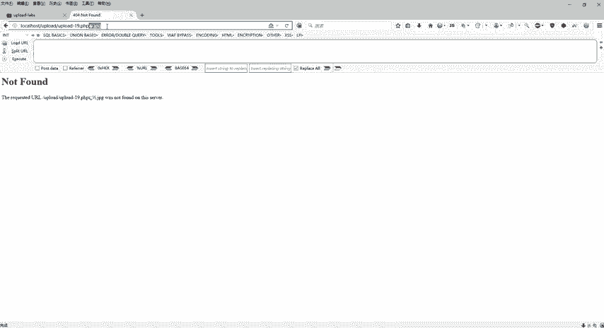

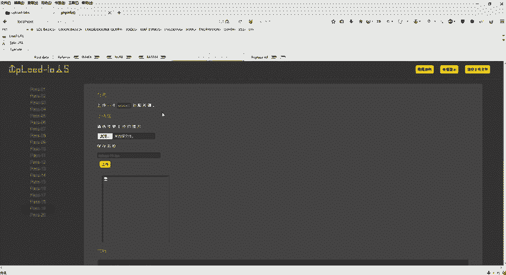

我不想用这个009的009太low了，是不是？太low了。那我们第二种，因为它这个地方呢，它是有个upload点杠什么fi name，对吧？它保存的那个路径。那么它如果说它这个文件名是什么呢？

upload杠。😊。

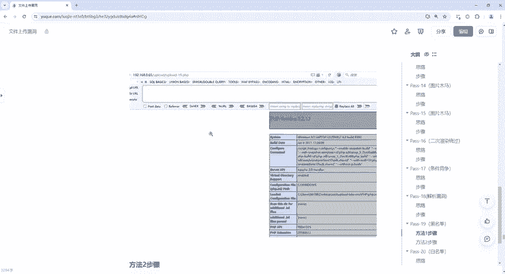

点的话呢，它也是可以验证通过的，对不对？好，那因为它这里面写了个代码啊，upload pass点斜杠，然后后面还有个点是不是好，那也就是说你这个文件名如果是PHP斜杠点的话呢。

也是可以验证通过的那具体怎么做呢？同样的还是回到这里来。😊。

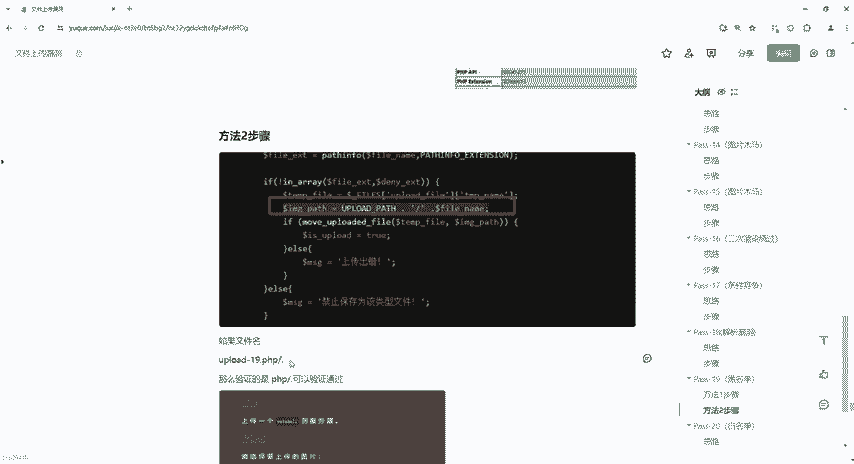

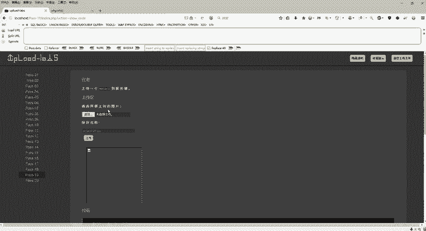

浏览。漏洞点击BG好了，点击上传之前开启我们这个BP拦截上传。OK好，抓到包之后，我们直接干嘛呢？😊。

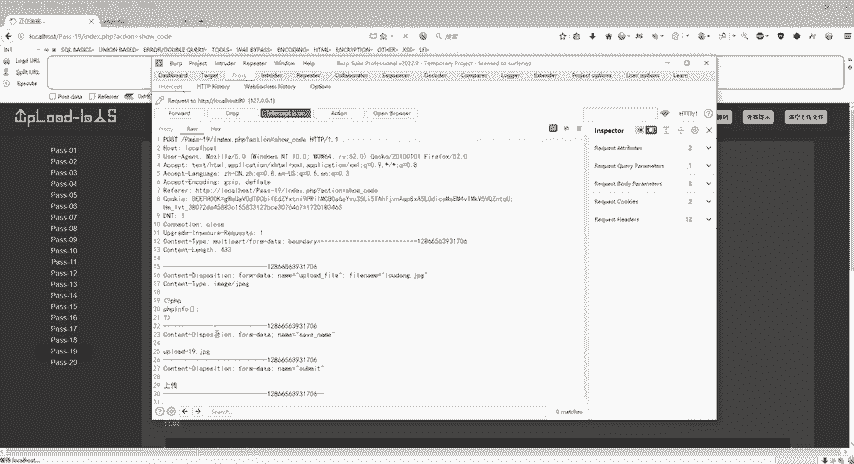

直接这样子把它改了啊，改成什么？😊，就直接给他改成点PHP斜杠点就行。好。具体怎么改，把它删掉。好，点。PHP斜杠点OK。好，注意啊，这我们在写的时候一定要是英文状态啊，如果写中文状态就不对了。好了。

回到这个地方。😊。

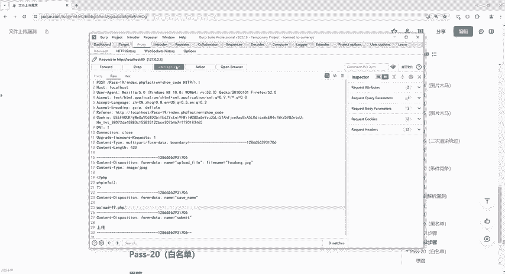

关闭。是不是哎，上传成功右键复制图像地址，还是回到这来关了啊，重新开一个。😊。

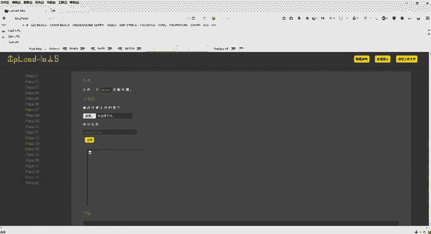

是不是好，回车是不可以了。OK那么也就是说我们会发现哦，即使给他写了个斜杠点，那我们在运行的时候，它这个点是没有的。所以说呢我们运行的结果是什么呢？upload杠19点PHP就是我们所要的结果。好了。

这个是第19关。😊。

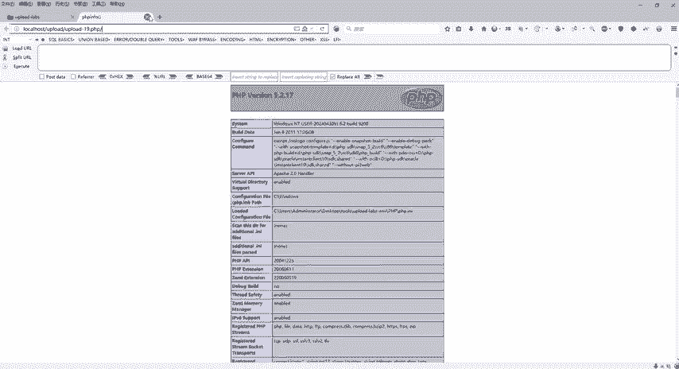