# B站首推！建议所有想参加CTF夺旗赛的同学，死磕这条视频，2024年字节大佬花一周时间整理的CTF入门保姆级教程！从入门到入狱（web渗透／PHP基／SQL注） - P29：11、文件上传第二十关 - CTF入门教学 - BV1JjeJeYE2p

好，那我们现在呢是来到了第二十关，那也就是我们的最后一关的啊。比如说第一关到第二十关也就那么多东西啊，看上去也是蛮简单的，对吧？好，具体的啊还是嗯所资料啊或者是笔记啊，对不对？

我都会给大家放到评论区好吧，然后大家按照我们的这个笔记，然后还有这个工具具体怎么去使用的，也不不来啊，是可以通过的。好，那第二十关它是什么东西啊，看上去跟第19关没有什么太大的区别，对不对？好。

那第二十关我们来看一下这个源码啊，那么源码的话，它同样的哈检查什么，对吧？然后imGJPGPNGGF好，那也就是说跟之前是差不多的。也就允许我们上传JPGPNG还有GF对不对？好，如果说你上传别的。

它就禁止上传该类型文件。那么还会去检查一个文件名啊。

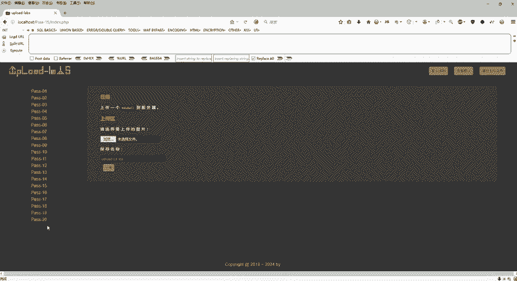

还会检查文件名，然后呢，文件名的后缀必须要是JPGPNG还有JIF。如果说你后缀不是这三个，那也是禁止的对吧？那么否则呢呃就干嘛干嘛的，同样的啊还是使用了第十9关的一个upload对吧？pass。

然后斜杠点啊干嘛干嘛的。好，文件上传成功，对吧？否则呢对文件上传失败。那么这个具体的怎么做啊？😊。

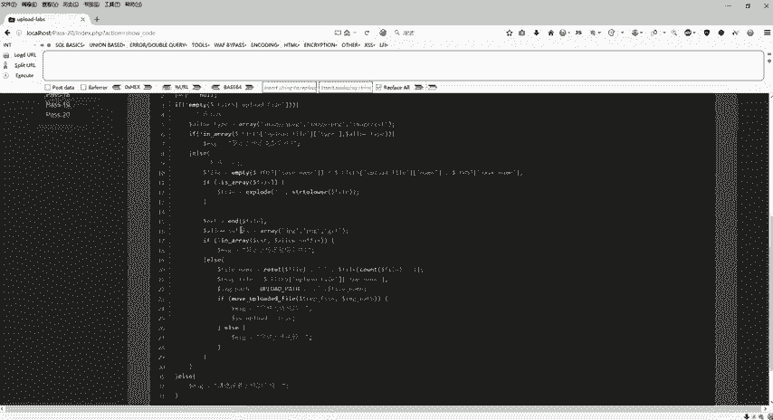

好，来回到这个笔记啊，这个笔记里面呢也给大家写好了。那么第二十关是我们的白名单啊，白名单啊，这个地方呢我们首先来复制一下代码啊，复制一下代码。😊，啊，所以说这关呢还是比较嗯有一点点难度的啊。

它具体的一个思路是怎么样子的。比如说我现在干嘛呢？我现在把这个代码给它copy一下是吧？给它copy一下，copy一下之后啊，具体的代码我们来看一下好，我给它来一个fe name对不对？

我是仿照着这个里面的代码，好吧，仿照里面的代码来给大家重新写了一扩代码，在这里面那么具体的代码是什么意思，对不对？好，我们一步一步来，我给它新建了一个数组。

然后upload点GPG如果我们正常情况下的and我们这个是不是就取到这个GPG了，对不对？那么re呢就可以取到这个upload杠20是这样子吧？好，那我们复制一下代码啊，复制下代码，然后我们写一下吧。

怎么写呢？我们还是把它放到这个3W目录下面吧，好吧？好，那么这个已经上传了那么多。😊，东西了对不对？上传那么多东西，我就把它删掉了啊，把它删掉了。😊，因为一直在爆破，对吧？一直在爆破。

所以说我们就把它先删掉，删到这个地方。从这里。好，选中啊。你直到这个地方删掉。OK好，右键我们就直接给它新建啊，新建一个文本文档，然后呢，把刚才这个代码给它粘进来。😊，刚才是我们的PHP代码，对吧？好。

看tS。😊，那取个名字啊取个名字，那我们这里就一吧，1点PHP。好了，那么同样的啊回到这个地方，我们直接来访问一下local host1点PHP回像。那我们对着这个代码来啊，对着这个代码来。

那么这串代码我们怎么怎么做呢？我先把这个代码给它打开吧。😊，右键，然后打开。好了，我们来对比一下啊。那我们正常情况下啊，fi name我们取个名字瑞说左里面有两个，一个是upload杠20。

一个是JPG。然后这个end呢会取到这个JPG的尾巴。这个呢是取到upload杠20，这是第一个对吧？所以说呢我们打印出来的是什么？一个是JPG一个是upload杠20啊，这个是正常情况啊？

但是我们这个第二0关的话，它什么情况呢？😊，我们比如说啊我新建一个ee数组，对吧？新建一个数组，然后我们第二0关主要是干嘛？主要是要拿到这个upload杠20点PHP这个文件是吧？然后呢。

他要求我们是JPG结尾的，才能放我过，那我们可以不可以按照这个思路来做一个怎么呢？做一个这个数组，对吧？我给它定义一个空数组，我给它零下标复制一个upload杠20点PHP然后给它二下标呢。

给它来一个JPG。他不是要截取吗？第一个截取是JBG，第二个截取是upload杠20点PHP是不是？好，然后这个地方。不是空的吗？如果说我在这个地方2下标点给它解JPG。

然后一0下标是给他PHP那我们是不是还有一个一下标呀，对不对？那么一下标的话，我要让它为空，那么把它两个拼接起来，是不是才能通关，对吧？好，同样的啊取到and是不是取到这个GPG的，然后呢。

这个reet呢是不是取到upload杠20点PHP的，是这个意思吧。啊，那我们取到之后啊，取到之后，那接下来怎么办？我们真真正正的名字是什么？

真真正正的名字其实就是upload杠20点PHP然后再跟上点JPG是不是？😊，你能能明白不？我们如果说把这个给它拼接起来的话。这个是0，如果这个是一的话，是不是upload杠20点PHP点GPG。

什么意思啊？我们来写一下吧，好吧。😊，UBLOAD。upload杠20点PHP然后呢。点空是吧，再去点这个JPG是这样子的吧。明不明白？那也就是说我要上传的是这一串，我才能通过这一关。但是呢我这里是空。

是不是这里是空的。那么这里是空的话呢，在数组里面，这个是零下标，这个是一下标，这个是二下标。那我在这个代码里面，我给它2下标直接复值GPG这个一下标是不是没有啊，那么没有的话。

那我upload杠20点PHP跟这个空去拼接的话，那我们最终的结果是不是upload跟20点PHP那是不是就是我们所想要的东西。那么具体它怎么拼的呢？那么真实的名字我拿到了这个对吧？

拿到了这个就是我们upload杠20点PHP然后用点给它去连接，点给它连接之后呢，我们数组里面是总共是几个123。对吧总共是123，总共是三个数据在里头，我给他来一个countt file name。

是什么？看到fe name是几个，因为我在这个地方可以默认是3个，但是我这个已经注释掉了，对不对？那我在这个空的数组里面，我放了几个。😊，是不是一个数据，两个数据对吧？好，总共是放了两个数据。

countt2减1。那么也就是说我们会得到for your name的一下标。能不能听明白呢？也就是说这个地方本来是。意向表对不对？但是我在这个数组里面放了两个，所以说呢是countt2。

那么countt2减1的话呢，它就会变成fe name的一下标。那么fe name点一下标在这里有没有呢？是没有？这边只有fi name零下标跟2下标。那么我们直接拼接这个count的一下标。

就是fe name的一下标是没有的。所以说呢它拼接出来的名字是upload杠20点PHP点后面就没有了。好，所以说呢这一关啊把这个逻辑理解清楚了之后，那我们这一关具体的怎么去过啊。

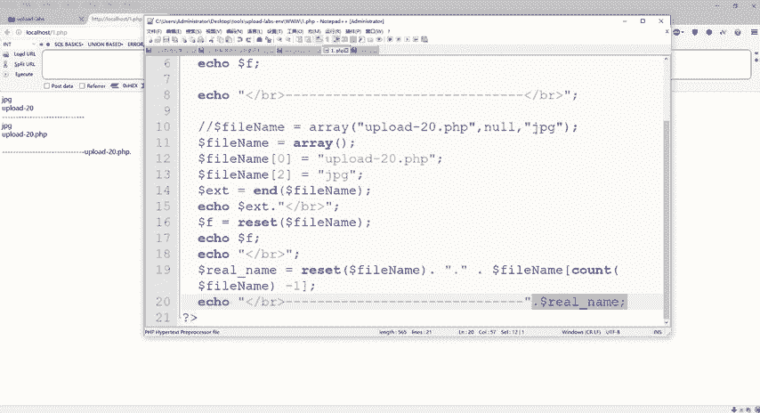

同样的选择我们这个文件啊，和这里都有讲啊，and呢是指向最后一个元素reit呢是第一个元素count是统计数组有多少个元素。那么我刚才统计的count里面是两个。

那么2减1的话得到的是2fi name的一下标。但是我们fere name的一下标在这个里面保存的名字是吧？一下标是空的，所以说我们最终的结果拿到的是upload杠20点PHP啊。

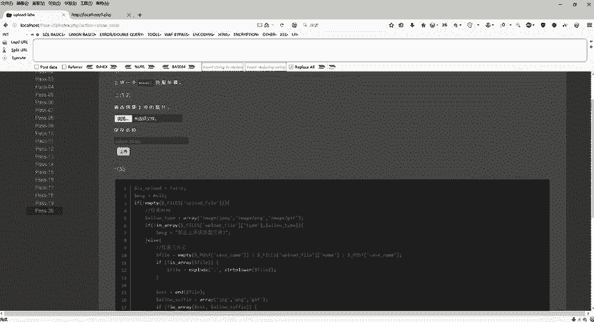

啊，由于C name一下边没有，所以说结果呢是upload的。PHP点，那么具体步骤怎么显示啊？同样的还是我们选择漏洞点GPG好。

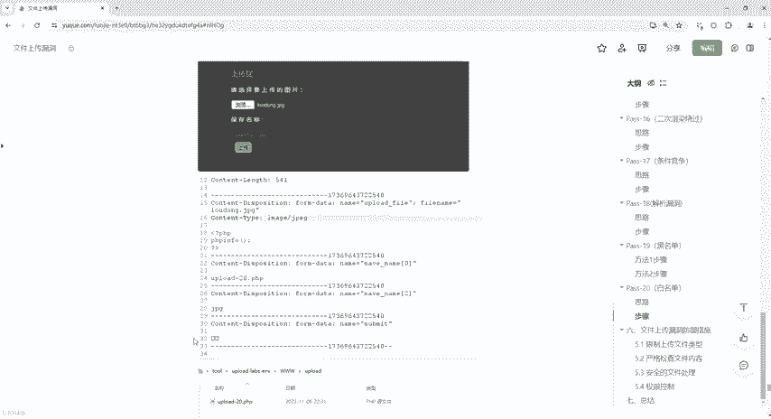

选择。漏洞点GPG，然后。上传之前打开我们这个BP点击啊，它保存的是upload杠20啊，上传。

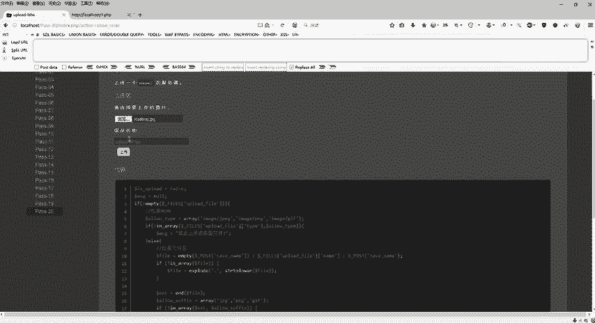

好，上传完了之后，我们来看数据包。

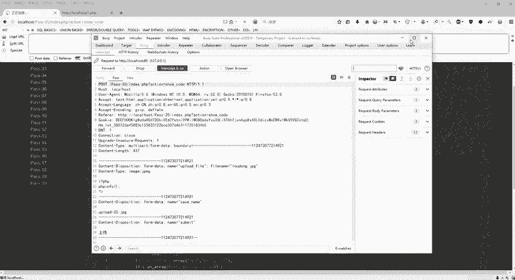

那么这个数据包第一个是upload杠20点击PG，对不对？但是我现在干嘛？我现在要上传PHP那所以说要改怎么改呢？好，第一步把这个sve name零下标变成upload点PHP好。把它加一个数组。

林菜标。把这个呢变成。PHP。就可以了。然后接下来啊接下来干嘛呢？接下来再给这个二下标给它来1个GPG，因为GPG的话才能通过啊，才能绕过这一关，那么怎么去复制啊，ctrl C啊，复制这一块。

然后换个行ctlV，把这个一呢变成把就是原来是一的啊，把它直接变成2，变成二之后给它给它写个名字。😊，GPG啊就可以了。好，一下标是没有的。那么我们最终结果是为了拿到upload杠20点PHP是吧？好。

那么改完之后，下一步我们就直接可以放包了啊，直接可以放包了。好，改完了点击。😊，关闭拦截是吧？关闭连截之后回来对文件上传成功，对不对？文件上传成功啊，虽然说这个提示它是一个红色的，但是成功了。

有的同学就说哎也不是红色的嘛，红色不是失败嘛，它提示我了啊，文件上传成功，那文件上传成功之后，右键同样的啊，还是一模一样的操作，还是老配方contrl，然后直接回调是不是就来了。好了，这个是第二十关啊。

第二十关主要是讲的是白名单，然后中间呢要加上一个数组啊，去绕过。好。😊。

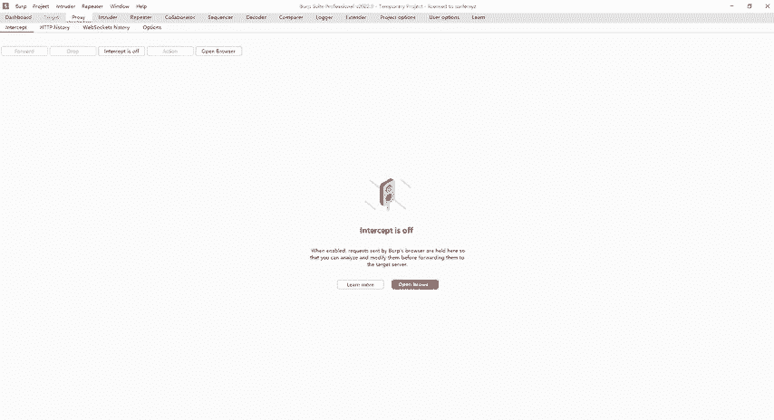

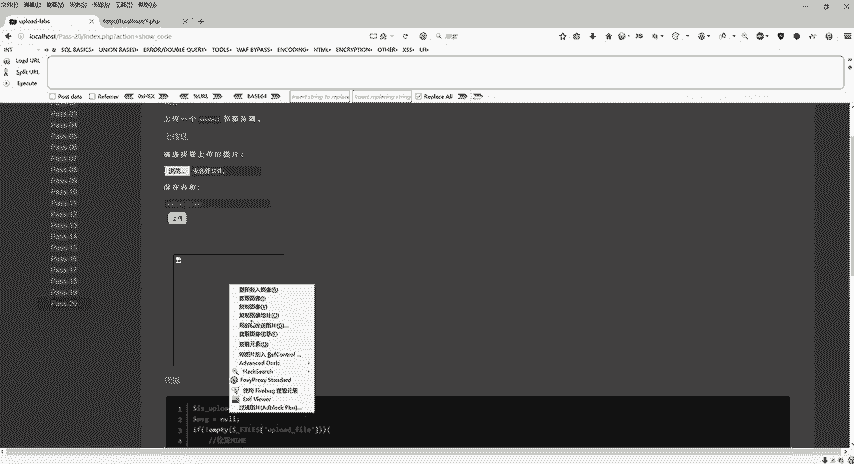

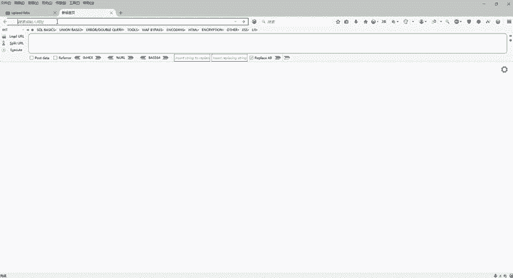

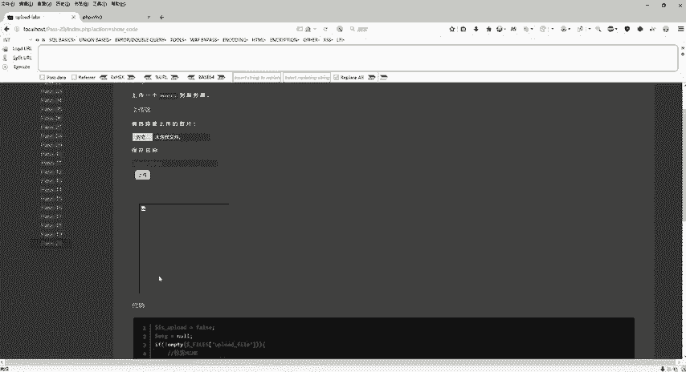

这个就是20关啊，那么也就是到这个地方呢，基本上我们1到20关就全部通关了，好吧。

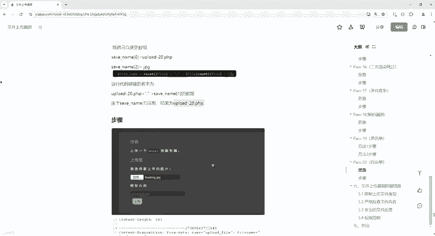