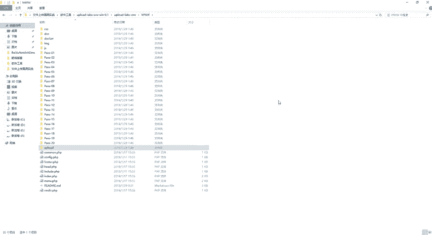
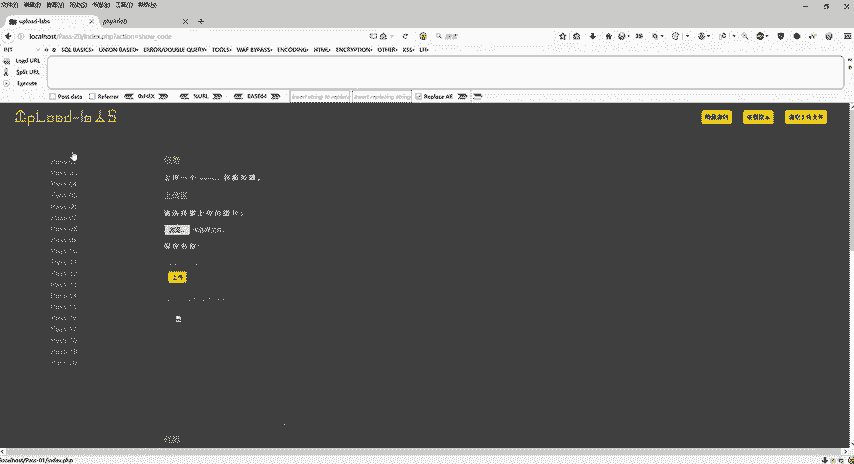
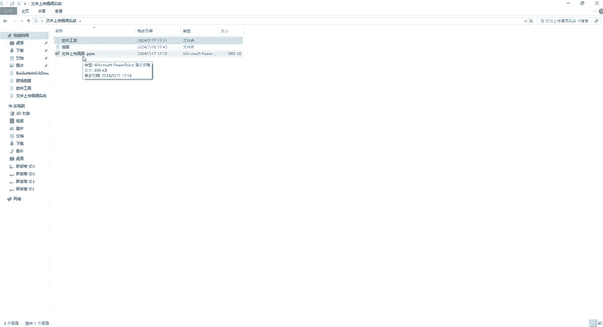

# B站首推！建议所有想参加CTF夺旗赛的同学，死磕这条视频，2024年字节大佬花一周时间整理的CTF入门保姆级教程！从入门到入狱（web渗透／PHP基／SQL注） - P30：12、文件上传总结 - CTF入门教学 - BV1JjeJeYE2p

好，那到这边1到20关基本上都通关了。然后具体的操作步骤，然后我们这些靶场，还有一些文件啊，各位都可以从评论区咨取。那接下来呢给大家做一个总结，然后以及跟大家去说一下，我们在文件上传的时候。

它的一个防御措施，怎么去防御我们这个文件上传漏洞。第一个啊，因为我们做了20关的一个闯关，我们也知道上传的一个文件类型啊，必须去给它限制。还有我们这个白名单，黑名单一个策略啊。

只允许上传白名单里面特定的文件类型，或者呢禁止上传黑名单里面的东西。好，那么第二个就是严格检查文件的一个内容。那么文件内容就是文件头啊，文件内容去进行扫描啊，那么第三个呢就是安全的文件处理。

我们可以什么随机文件名。那么上传之后从命名文件。刚才我们在20关里。都有啊，就是比如说我现在是一个info点PHP但是你上传之后呢，到服务器里面，它的名字就会被变了啊，变了之后干嘛呢？

我也不知道你变了什么名字，是不是啊？那么这样是不是可以避免我们这个直接文件上传漏洞啊。那么第二个就是一个存储隔离啊，就是上上传这个文件存储在web跟目录不同的位置。那么呃我们刚才也说了啊，就是。😊。

这里面我们当时在第几关还记得吧？第第十七关还是第十八关，我们在上传的时候，条件竞争，对不对？我们一般的默认的文件夹是这个upload，是不是？但是呢我可以把它上传到这个根目录里面。

也可以给它去上传到什么呢？你可以在这个里面去新建一个文件夹。这个文件夹名字，只有你知道我可以把它上传到各个文件夹里面，是不是好，那么当然这个文件夹里面去之后，那我。不知道你取的什么名字。

那我是不是以这个upload为例，哎，那我就直接。😊，去访问你这个upload，但是你这个upload里面文件夹是空的，对不对？哎，upload文件夹是空的，那么证明里面没有什么东西。那也就是说。

即使我上传成功了的话，我是不是也利用不到你这个漏洞是吧？也利用不到你这个啊木马是吧？好，那么第四个呢就是我们的一个权限控制。那么我们这个1到20关呢，基本上啊。😊。

他的权限。基本上每个人都可以去上传，对吧？不管是谁都可以去往这里上传。那么如果说你不想对吧？不想让别人去上传一些东西的话呢，你可以对这个靶场或者是对你这个后面的一些服务器里面的一些权限啊，进行给它控制。

那么确保上传目录不可执行。那么即使你可以往我这个upload里面去传。但是呢我传上去之后，我只能传我不能运行，也是也就是不能执行。那么可读可写可执行，这是最高权限，那我直接可以让你可读可写，对吧？

但是呢我不让执行，那是不是也可以控制这个文件上传漏洞。好，这个呢就是文件上传漏洞的一个防御措施啊，好，那这个笔记上面呢，也给大家写了啊，也给大家写了。那么我们最后来给它进行一个总结。

那么什么是文件上传漏洞。那也就是说我们在上传文件的时候产生的一种。😊。

web安全漏洞。那么通过严格的上传策略和有效的安全措施，可以大大降低被攻击的风险。那么我如我们如果说嗯是自己做开发的对吧？那么作为开发者的话，我们在写代码的时候，一定要注重这个文件上传功能的一个安全性。

那么确保我们这个web应用安全稳定运行。好，这个就是我们的一个总结，那接下来我们再来看一下。好，那我们嗯今天呢总共就讲了这个文件上传的1到20关啊，介绍了一下什么是文件上传漏洞。

然后还有准备了一些环境啊。其次我们这个1到20关的这个案例啊，这个靶场具体是怎么去通关的对？好，这个就是我们今天的这个课程啊。那么如果说啊再说一遍啊。

如果说有要资料的同学伙伴全部都可以在我们这个评论区自取啊，同样的这边软件工具，然后还有我们这个视频，还有我们这个PPT啊都给大家准备好了，各位自取就可以了。好，那我们今天的课程就结束了。😊。

