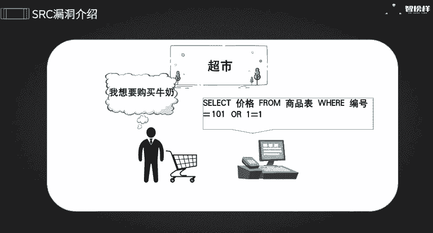
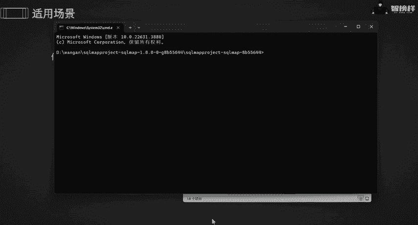
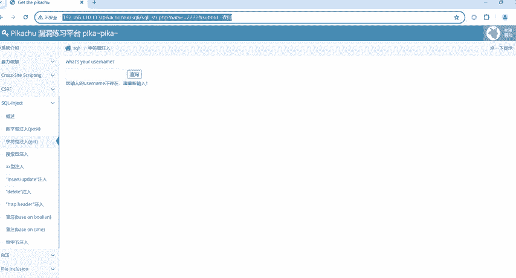
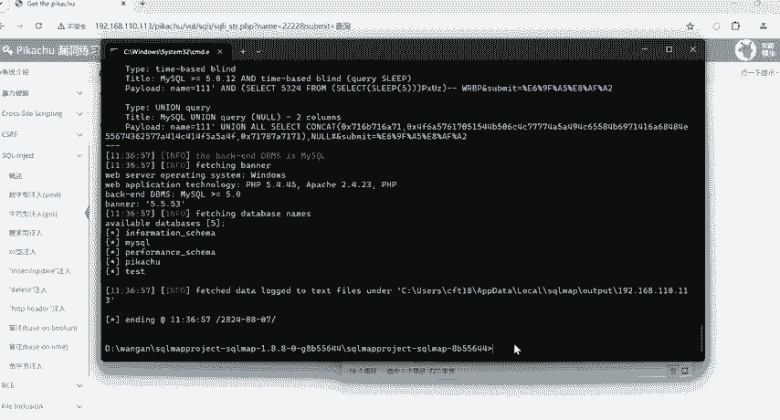
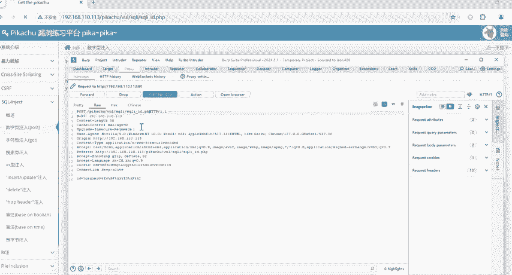
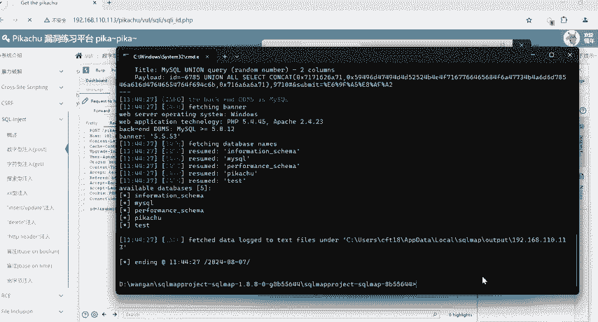
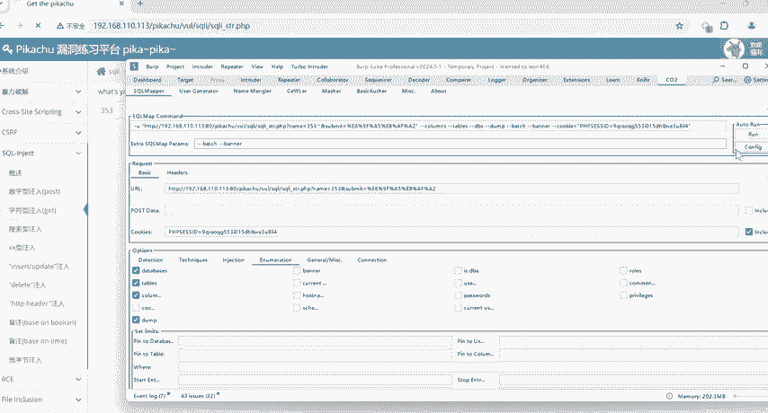
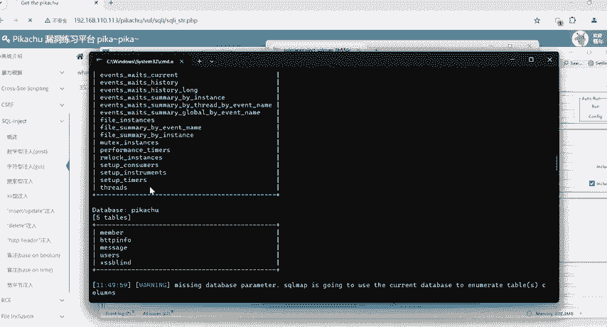
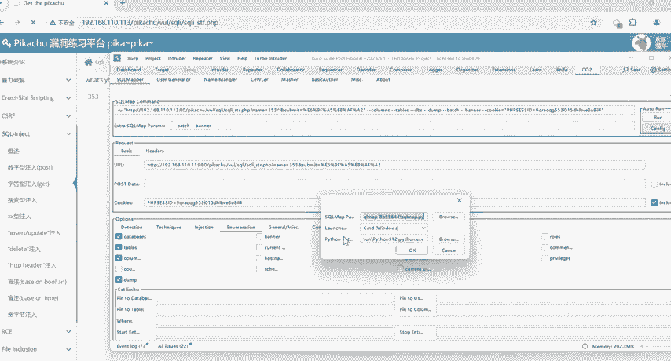

# B站首推！建议所有想参加CTF夺旗赛的同学，死磕这条视频，2024年字节大佬花一周时间整理的CTF入门保姆级教程！从入门到入狱（web渗透／PHP基／SQL注） - P31：1.漏洞挖掘实战3之sql注入 - CTF入门教学 - BV1JjeJeYE2p

hello，大家好呀，欢迎来到制品安全实验室，我是你们的芳芳老师。本次由我给你们讲解一下SRC挖掘专项课程之搜烤注入。😊，那什么叫fcal注入呢？soccle注入的一个基本介绍原理，我全部都放在这里了。

接下来我用个简单的例子给大家讲解一下scal注入到底是什么。假设你开了一家超市。这家超市是有自己的一个库存的。那么你为了方便起舰，设置一个非常简单的系统。方便顾客去结账的时候，使用商品的编号来查询价格。

那这个系统的后台就相当于一个数据库，储存了商品编号以及它所对应的价格。好，那么有一天呢一位顾客想要去购买一个牛奶，这个牛奶的编号是101。那顾客呢在结账的时候。

我是不是要去系统里面去输入一下101这个东西，那系统就会执行一个scle查询语句。比如说啊slack价格from商品表where编号等于101。然后才能够去返回咱们这个牛奶的价格。

那现在如果说有个不法分子，他知道这个系统里面有存在一些漏洞，他可能会在输入咱们这个商品编码时输入一些特殊字符。比如说。哦一等于一什么意思呢？嗯，一等于永远是一个成立的一个数字，是不是？

那么哦是不是或者就相当于他执行这个指令的话，会返回出咱们这个库存里面所有的商品价格，这就相当于我把我便利店的库存钥匙都给到人家了。信息全部都先露出去了，这就是所谓的soc注入漏洞。

不法分子通过输一些数据插入一些恶意的scle代码，欺骗系统执行一些非预期的操作，从而获取到一些敏感的数据。那今天呢我带着大家去玩原咱们这个s注入。哎，要实现什么样的一个效果呢？我要去访问数据库里面的库。

比如说数据库里面会存放什么样的数据库呢？那接下来的话，我带着大家去了解一下soc注入的具体流程以及要使用一些什么样的环境工具。那我们主要的环境的话，是用windows系统。

以及我们的抓包工具BP以及咱们这个插件工具CO2嗯CO2插件呢，它是可以任意找一个网站进行测试的待会呢我带着大家一起去演示一下咱们这个插件怎么去使用。那简单给你们讲一下咱们这个soc map。

使用一些什么样的场。

任意对数据库进行操作的请求都可以存在socer注入。比如说我们的登录注册啊，再比如说一些嗯查询啊，一些修改，只要牵扯到数据库的增山改查。

都是可能存在于收er注入的那么咱们这个知道socer注入到底是什么东西，我们是不是要通过一些工具进行测试呢？那什么工具是比较适可以soccle呢？这个工具就叫soccle map啊。

这个工具呢我已经放在我的一个呃文件夹里了，就是这个工具啊。这个工具soc map怎么去使用呢？哎，点击进入它的一个路径，然后点击CMD回车，这个就是我所在的一个路径，所在的一个执行框。

那如果说你要去测试别人东西。那接下来我是通过我所给你们搭建的这个靶场去给你们实战的啊。那比如说我随便随随便便去输入一些符号。比如说2222，然后去查询发现，它的账号不存在。

请重新输入是不是我把这个路径先复制一下啊，利用我的工具s map进行测试，输入python啊，输入python，因为这个工具它都是用python去写的。那么输入python之后啊。

输入我的soc map啊，点PY啊，一定要注意是点PY，将我的路径放在这上面，然后干什么呢？我偷个懒，就是默认它自己去启动，就不用我管啦。

哎，回车可以看到没有？okK他说了subsubit不是内部的环境，是不是不是内部的一个文件。那么是不是哪一步出了错呢？啊，我发现哦原来呀原来是我这个这个符号的错误啊，那我现在的话能够怎么去解决呢？

我把它括起来就OK了。用双引号去扩起来，不影响我后面的一个操作。好，我是不是已经成功了，能够去访问我的一个基本的情况，可以看到它name是不是get请求，它的一些namename里面的一些类别呀。

它的一个标题呀，以及payload全部都出来了。可以看到没有？那这一步是不是成功之后，我还可以干什么？我还可以访问我数据库下的有多少个库呢？那怎么去操作呢？啊，输入杠杠DBS点击回车？哎，可以看到没有？

我数据库下的一些库存，它有5个库，一个information，一个mycyclical，这些都是一个数据库，是不是？那就证明我现在是已经能够成功访问咱们这个数据库了，再给你们解释一下啊。

咱们这个get请post请求，好吧。

我现在随随便便去查询一个数字啊，可以看到没有？是一就成功之后，然后我通过呃咱们的BP去拦截一个数据，我BP已经拦截到这个数据，我将这个将这个复制下来，在我这个scle map里面啊。

新增一个文件叫什么呢？叫222吧。好吧，然后点击它啊，将它copy下来。因为post请求有很多很多参数，是需要我们先复制到我的文本文档下面，然后点击保存继续进入我的小黑窗还是一样的操作杠R。

再把我刚刚所新建的那个打上去。因为这个是之前的，所以我们要重新进入下载。好了，我们已经新入了一个新窗口，那么还是一样的操作。首先输入python是不是然后再输入什么？我们主要的工作工具。

 map点PY哦，一定要记住哦，然后输入杠R对不对？因为我新建了一个22，弄好之后，我照样要top个懒，是不是这个是什么意思呢？就是说我默认啊，默认它是默认一个情况，我就不需要一直去点Y。

一直去点Y方便我的形式。好，都ok的话，我就开始启动啊，可以看到没有？我现在是不是画面已经启动出来了，我的这个请求方式是不是post以及它的一个ID一些类型啊，一些标题呀，以及load全部都出来了。

就证明我现在已经打成功啊，我还可以干什么，我还可以去访问一下咱们这个数据库。哎，可以看到没有？是不是和我刚刚是不是一模一样的？这就是两种不同的请求方式，一个是数字类的一个post。

一个和字符类的一些一个g，各位是不是觉得非常非常麻烦呢？所以啊朋友们，我给你们推荐BP里面有个插件是非常非常好用的，是什么插件呢？是一个CORCOR给带着大家去了解一下COR的话。

如果说你们想去下载的话啊，下载这个插件的话，你可以去BP这个在线商城里面去搜索一下COR，或者我还可以去。

将咱们这个文件插件的一个炸包，然后导入到咱们这个文档里面。O一些什么s入s map工具以及咱们这个插件，我全部都打包在了我的文件夹里面啊。需要同学的话，可以评论区留言或者自己私信我一下。

接下来带着大家怎么去玩一下咱们这个插件。好吧，这个插件是有步骤的，我把这个步骤已经放在了咱们这里啊，步骤一是不是要通过BP去抓取一些关键的数据包，步骤二是要将抓取的数据包发送到我的插件里面。

步骤三的话就要设置好相对应的s map指令呢？步骤四的话全部都设置好之后，我是不是正式开始测试，开始攻击了？好，首先呢打开我的BP好，在这里随便输入一些数字，然后点击查询，哎，可以看到没有？我现在咱们。

这个BP已经抓到抓到关键数据包了，然后啊右键点击咱们这个扩展，点击COR，然后点击发送到我们的srcle map里面。哎，可以看到没有？它这里都已经给你配置好了，你可以设置一些参数，比如说啊beach。

比如说。班恼。都OK的啊。然后啊可以看到这里的话，我们都是可以自己去设置的。比如说咱们这个等级是一级二级三级呢，你可以用默认的一级。比如说咱们这个风险是一级还是二级是三级呢，都是OK的。

你可以自己去选择选择一级，选择二级，选择三级，好吧，包括咱们这个扩展，你都可以自己去选择。比如说我想展示我的嗯数据库到底有几个库，我就把它勾选上，你可以看到这里就已经加上了。

再比如说我想看一下数据库下有多少个表，是不是我就可以把也它把它也加上啊，包括是一些字段呀啊一些数据的话都是可以自己去加上的啊。好，都配置好的话，那么我还要做一步。最后一步，也就是咱们这个配置。

把咱们这个soc map一定要配置好啊，一定要配置好，点击咱们这个东西啊，点击打开soc map点payY点击打开就可以了啊，包括我的一个python的一个路径，可以看到没有？我设置的是一个33。

12的啊。好，全部挪动好的话，那么点击okK我们就可以正式运行啊，run一下，在这里啊。

可以看到没有？我基本的数据全部都出来了，包括你的字段啊，包括你的类型啊，全部都是在这里，是不是每个数据库下的话，一些工具，一些数据我全部都展示出来了。

所以它的这个功能是不是相当于说比我们用s web这个工具要好用很多呢？哎，这样子就不用区分是get请求还是pose请求。像pose请求的话。

在那个soc map插件里面还需要自己去新建一个文本文档是不太方便的。那么你用这个插件的话，基本上是不需要去区分的，但是一定要注意将我的配置一定要设置好我的soc map环境。

以及咱们这个python的环境一定要配置好哦，不然的话你可能会出错。那么最后一个环节，也就是我所给到你们的一个课后思考题呀？soccle注入还可以利用哪些具体的功能点呢？这个的话你们要踊跃发言哦。

好，最后做一个小总结，本次课程讲了soccle注到底是干什么的，对不对？以及他的一些介绍。还有一些soc map一些工具啊，以及我给你们推荐的啊PY这个插件C12这个安装具体安装以及使用。

包括我的soc map是使用于哪些场景。它怎么去攻击别人的，对不对？最后给你们一个思考问题。我已经将咱们这个工具以及放在这里了，以及soc map的安装包全部都放在我的软件工具里面了。

需要同学的话可以在评论区留言或者是私信我。好，本次的课程就到此为止了。

