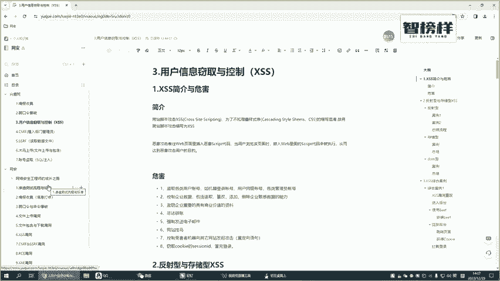
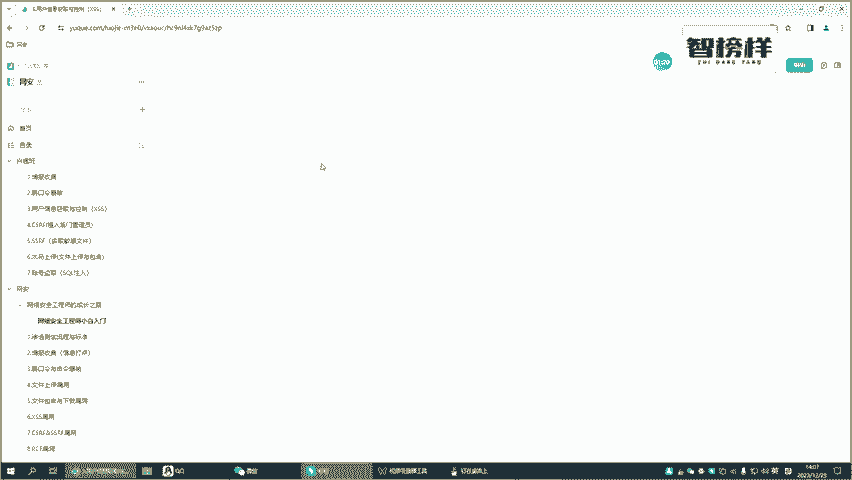
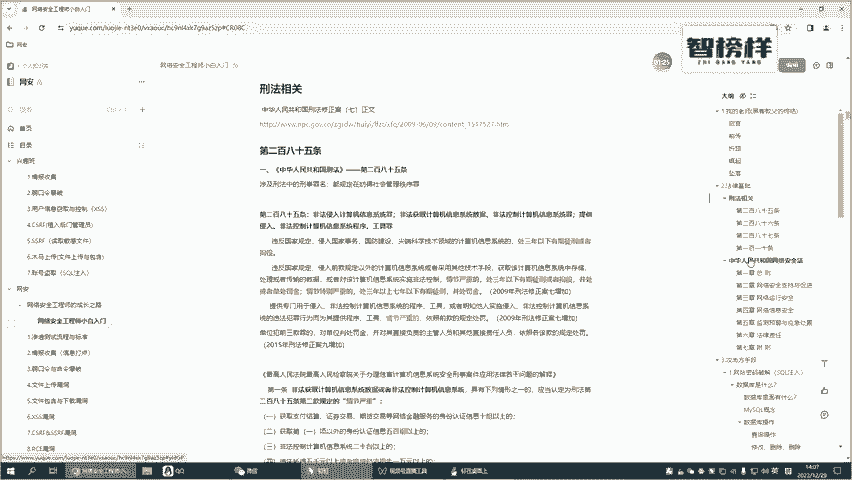
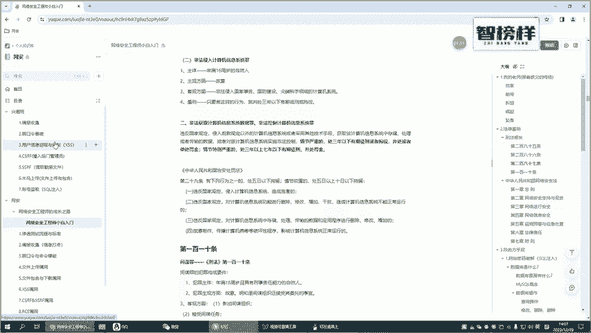
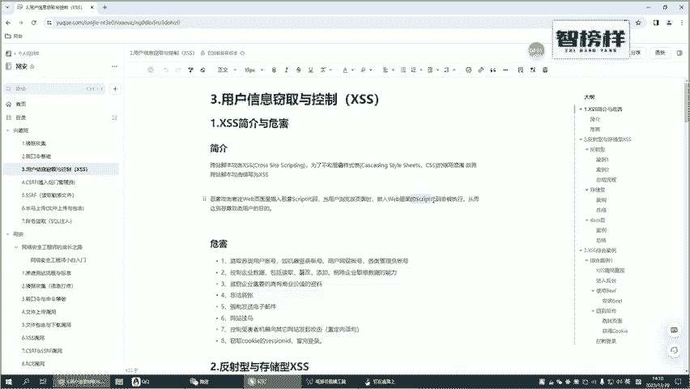
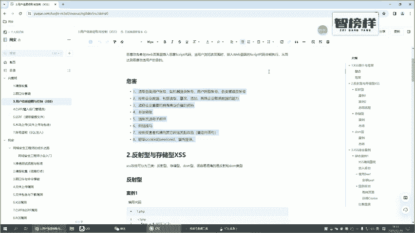
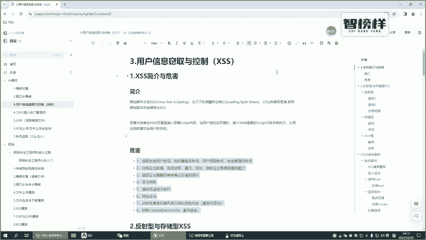

# B站首推！建议所有想参加CTF夺旗赛的同学，死磕这条视频，2024年字节大佬花一周时间整理的CTF入门保姆级教程！从入门到入狱（web渗透／PHP基／SQL注） - P32：1.XSS简介与危害 - CTF入门教学 - BV1JjeJeYE2p

好，那咱们接下来继续来讲后面一个内容啊。其实前面我们已经把这种情报收集跟落口令这相关的一个漏洞已经给各位来讲的比较清楚了啊，包括相应的一些工具和相应的一些笔记也交给了各位各位你们还是要多练习好不好？

多练习。好了咱们接下来看下第三个内容啊，就是用户信息的一个与控制。其实这一块讲的是一个叉SS漏洞啊，那什么叫叉SS漏洞呢，各位你们可能听说过啊，在国内叉SS漏洞，它其实是并不特别值钱的。

也就是说你在一些网站你做一些SSC的一个挖掘。你挖到了一些企业的一些叉SS那可能他并不会收也就是说他可能不会给你相应的一个佣金。但叉SS的个漏洞在一些国外的一些漏洞平台啊，你们可以去挖一下。

还是比较值钱的啊，那这个就是开始跟各位讲的一些点好了，那在正式开始我们后面内容。之前那些各位来强调一下啊，咱们所讲的一个内容，仅仅是为了我们学习而讲授的。请各位遵循咱们中华人民共和国相关的法律法规。

不要做任何违法违纪的事啊，这些嗯开始这一块的一个内容还是给各位大概的强调一下啊，比如说这一块的一个。

相关的刑法这相关的啊，包括呃中华人民共和国安全法这些内容，各位你们都要看一下啊，千万学的这一块的一个内容，不要做一些违法违纪的一个事情。好吧，那这一块强调好了呢，我们接下直接来看我们的一个叉SS漏洞啊。

叉SS漏洞。我们首先需要聊的一个点，就是什么是叉SS叉SS漏洞它又会带来哪些危害叉SS漏洞是什么呢？叉SS漏洞，我们看一下它的一个简介啊，它是一个脚本攻击跨站的脚本攻击，也就是说它么这里面有些名字啊。

首先是跨站跨站就是说它不在当前的站点来攻击你对吗？那第二个名词脚本脚本我们前面也学到了一些比如说java的那这个呢我们今天所涉及到个内容就会用到大量的一个java。

所以说跨站就是不在当前的一个站点脚本就是我用脚本的一个方式来攻击啊，这个就是叉S。

S的一个意思。那如果说把这个叉SS把它翻译成英文，应该是最大part大的那为什么它不叫CSS，它要把它改成X。SS呢啊它其实是为了不和沉叠样式啊，就是我们在学前端的时候，可能会学过CSS对吧？

那既然说有了个CSS啊，为了防止和前面我们学的沉叠样式来进行混淆。他把这个前面本来应该写C的，把它改成了X啊，所以说我们现在聊的这个叉S其实就是跨站脚本攻击啊，那当然了。

我们现在呃大概明白了跨站脚本攻击。首先它是跨站的，也就是说不在当前网站的本地来攻击它，我们现在也了解它主要是用脚本就是我们以前学过的加va的来进行攻击的那除此之外呢，我们好像还没有了解任何的一个东西。

对吧？好，那我们等会会案例来讲啊，这个咱们不用着急慢慢的聊嘞那结合我们前面聊的这些内容啊，那往往呢我们可以看到啊他的个攻击者，他是在一些的一个界面里面，就是在一些网站里面。啊，来嵌入一些恶意的scr的。

因为我们讲过了，它是一个脚本攻击，对吧？那现在的一个scr呢更多的是javascript的。当用户浏览该页面的时候。当前的这个页面，他会执行这些恶意的的这些恶意的一个脚本。

从而达到攻击这个页面的一个目的。当然啊现在我们这样聊感觉也不是特别清晰，对吧？那只知道哎他是账的啊，只是说他攻击的方式是通过一些加的一些攻击方式来进行一个攻击，那它会带来哪些危害呢？

它的危害有下面这个啊那比如说他能盗取各种各样的用户的一个信息，比如说用户的一个账号，对吧？那包括一些其他的一些等等等等这些这些账号，它可以冒充登录，他甚至可以来在你这个网站上挂一个小木马这些东西。

比如说实行一些非法的一个转账啊这里面的这些文字啊，里面个危害，我就不一个个的读了啊，你们可以去看一下。那这块呢也不需要各位来记硬啊就是一旦去涉及到一些面试啊你们简单的去看一下就行了啊。如果说你们记不住。

也不要死记硬背。咱们后面会有一些案例，好不？有些案例会。

详细的给大家来讲讲哎。会带哪哪些危害，又具体是怎么去一步步的做到的。好，他要分成哪些不同的一些类型。我们等会讲到后面的之后再说。好吧，那这个就是我们第一个小的一个视频给各位呃简单的来介绍一下啊。

什么是叉SS叉SS你最主要的就是记住两个，一个是跨站。第二个呢它是通过脚本的一个方式啊，我们这一块是使用的一个加式复的那另外呢我们大概需要理解一下啊，这个叉SS可能会带来哪一些危害。好不好？

那这块咱们就这个视频就先简单的放在这里面啊，各位心里有一个谱就行了啊。

