# B站首推！建议所有想参加CTF夺旗赛的同学，死磕这条视频，2024年字节大佬花一周时间整理的CTF入门保姆级教程！从入门到入狱（web渗透／PHP基／SQL注） - P33：2.反射型XSS与fofa案例讲解 - CTF入门教学 - BV1JjeJeYE2p

好，那咱们接下来呃对于这个叉SS有个基础的一个了解的时候，我们接下来聊一下这个叉SS它的不同的类型啊，它总体来说呢又分成反射型和存储型，其实不只是反射型和存储型啊。

那有些地方呢又可以把它分成三个类型类别，那分别是反射型、存储型、盗型啊，可以分成这三种。那为什么我的一个标题上是写的两个人，其实盗型跟反射型。可以说差不多的。当然了啊，如果说你详细的进行一个区分的话。

还是有一定的一个差别的，好不好？很容还是有一定的一个差别的那其中比较容易混淆的是什么呢？容易混淆的是反射型和型啊，这两个是比较容易混淆的那为了让各位理解他们之间能个区别呢，我给各位来呃讲一些案例。

通过这些案例，然后我们再画了一些导图啊，画了一些流程图，咱们一结合案例2结合流程图，咱们慢慢的聊大概就能了解一下它的一个区别啊，那首先我们来看一下这样的一个页面啊，这个页面是一个音点PHP对吗？

那这个页面它怎么样去做呢？首先我们要准备相关的环境啊，相关的一个环境，我们前面已经说过了，你首先需要做的是把这个HP把这个集中起来啊。

那如果说各位你们没有这个HP的同学呢你们就自己去听一下我们前面的一个内容啊。诶。怎么还没启动？PHP study。咋回事？哎，启动好了啊，只是说有点慢而已。好，咱们点一下启动，那目前为止启动的时候。

你可以发现服务器启动好了，对吗？my启动好了啊。如果说对于这个工具不了解的，可以听下我大概昨天昨天我详细的讲这个工具到底怎么去一步步的使用好吧，那启动好了之后呢。

接下来我就要做创建1个1点HP怎么去创建。唉，其实在这一块啊我们昨昨天已经讲过了啊，你安装之后呢，它有一个默认的一个3W对吧？这个是我们个安装目录啊。

那我的一个页面放哪呢放到这个3W里面么放到这个3W里面啊，目录不要搞错了，好不？这个PHP是你的个安装目录。那下面的这两个目录不要搞错了啊，安装文件其实昨天给各位了，对吧？好。

在这里面我们新建一个一点什么P啊HP。

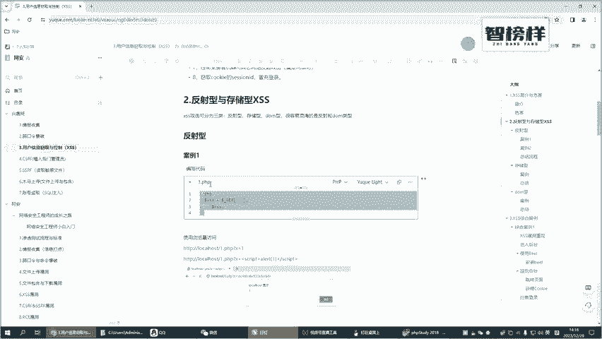

那新建1个1点PHP了之后呢，咱们右键点N pass打开啊，打开的时候是个空白的，把我们前面啊在笔记里面所设计的一个代码把这给放过来。那放过来了之后，你看啊这个代码其实是很简单的。

是一个非常简单的一个PHP的一个代码。它接收一个X的这个参数，对吧？好，然后。

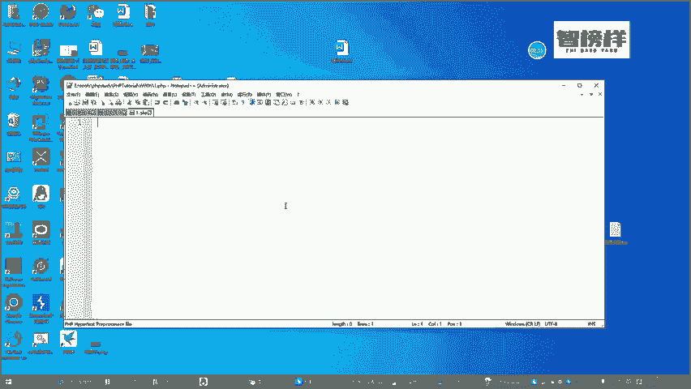

呃把这个参数把它给获得了给他给了一个变量，这个变量叫叉SS啊，那剩下的一个事情啥都没做，你传过来什么东西，我就把这个东西进行个输出，就是做这么回事啊，好，那我们来访问一下啊。

我现在有一个那我怎么去访问呢？那所以说我们现在是个loc house的对不对？那刚才的一个页面是不是一点那敲个回车当前那个页面就已经出来了。当然了有些东西说啊为什么啥都没有是一个空白的一个页面。

为什么呢？因为我现在没有输入任何的一个东西，对不对？它不是说要接受一个X的一个参数？那你就传一个X参数呢？咱们怎么去传参，是不是加一个问号对吧？一个X然后等于多少，比如说我等于一是不是一就出来了好。

那比如说我传授一个hel是不是hel就出来了那这个是一个正常的作用啊，没有做任何的其他的过分的一个操作，那什么叫叉SS攻击呢？它是使用java的一个方式，对吧？前面看他的一个定义已经明白了啊。

他是同使用一些恶意的一个脚本来进行个工益攻击的。我现在没有传任何一个脚本，所以说它并没有嗯并没有什么问题啊，那我现在传一个什么脚本呢，其实笔记有各位有给各位来写啊。

当然如果说你不想完全抄笔记也没什么问题。那如果说你对这一块的一个内容完全陌生的你直接可以复制笔记啊，比如说我直接复制笔记，你直接来运行下，也能看到这个效果好吧，也能看到这个效果啊。

那为了简单呢为了让各位印象更深刻一点呢，我把这个也大概来敲一下啊，它是嵌入一个scr的。比如说我现在搭一个s的对吧？好，比如说我要cr干什么事情呢，个一好，记得要结尾那敲个回收，你看是不是一就出来了。

那比如说打一个其他的，比如说。好，更可以。哦，对，这个就有问题了啊。现在还不能随呃，如果说是这个的话，还要还还得要大加上一个引号。加上一个引号吧。I哎MSC。HK看到吗？

现在打出一个啊这个就是有些同学可能可能会觉得哎他无非就是呃莫名其妙的谈一个页面，或者莫名其妙谈一个广告，对？好像他的一个危害也并不是特别大。对啊。

他的一个危害呢说很大的也不是很大就是咱们很多同学啊在访问一些页面的时候，果说被了莫名其妙会谈这些广告，对吧？或者说一些恶意的一些烧扰的一个页面啊，所以说在咱们国内啊关于这个叉SS它的一个重视不是特别高。

但是国外啊他比较关注的是用户的一个体验。所以说国外如果说你发现这个叉SS的一个漏洞的话，他给的一个佣金还是比较可观的啊，这是我们通过一个简单的案例来了解了什么是叉SS那无非就是我通过这种脚本的方式。

对吧？我们现在说的是不是说的是一个脚本，通过这种脚本的一个。😊，当事人能达到咱们攻击的一个目的啊，这是咱们攻击的一个目的啊，那这个呢其实是一个反射型。那什么是反射型？我们再讲一个案例好不好？

我们讲了这些案例的时候，然后咱们再统一来总结，你们会对于这些东西会有更深刻的一个案例，更深刻的一个理解。那呃咱接下来继续去。那讲一个案例，当然啊这个案例我们会使用一个靶场来做。

但为什么有些同学说你可不可以重新来给我搭建一个皮卡丘这样的一个靶场呢，我当然可以去搭，我当然可以去搭。但为什么我不给各位来重新去搭，而是让你自己去找呢？其实很简单，我们前面讲情报收集的时候。

是不是也讲过一些什么佛法这些黑暗的一个搜索引擎，对吗？黑暗引擎，那使用这些黑暗引擎，各位一定要用的很熟。如果说我只讲但我后面又不给不带各位来重新操作一遍，我觉得各位你们可能学了就忘学了就忘啊。

所以说我一边。讲我还是尽量带各位来操作一下啊，所以说我现在我就不搭靶场了，我们干嘛，我直接在里面使用佛法来收好不好？这样的一个引擎。这个是我们第呃在情报收集这一块的一个内容的时候，也给各位讲过的啊。

情报收集这一块的一个点。那这个佛法我们到底是怎么去玩呢？各位我们现在是搜皮卡丘这样一个靶。那有些同学说皮卡丘是什么东西，你们先自己百度一下啊。皮卡丘，他是不不是皮卡丘。对他直接翻译过来，也是皮卡丘啊。

就是那个动画片里面的那个皮卡丘啊，但是咱们直接加靶场这两个字。

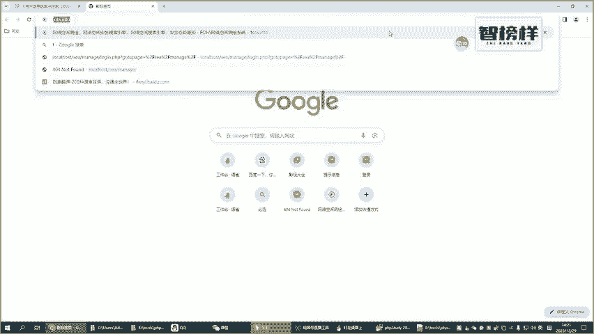

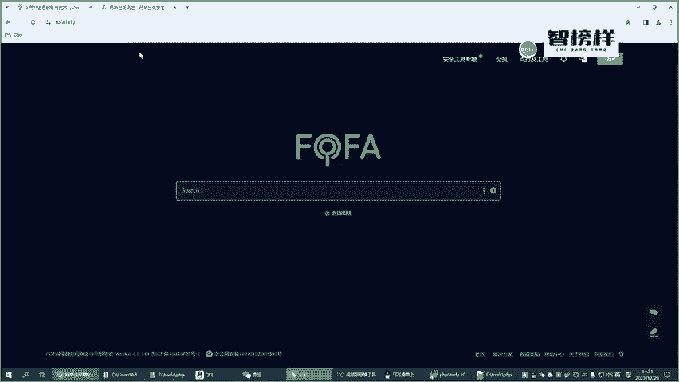

麻烦。它是一个里面有很多不同漏洞的一个通关的一个靶场啊，一个靶机。那呃里面有很多一些啊当然了我们等下搜一下，你们就知道啊，搜一下就知道了。好吧，那你现在这如果说你们完全对皮卡丘不是特别了解的。

你们就知道它是个靶场好吧，靶场里面有很多很多一些任务，很多很多的一些管关卡，你们需要去攻克的啊，当然了我们今天只关只玩一些简单的一些插SS的好吧，那怎么样在这个里面去搜呢？好，这个语法。各位啊。

如果说你们不知道语法的呢，你们可以看下面其实有个查询那个语法，看到吗？你们要去查询那个语法，比如说hor的如果说你要操操作什么操作系统的，你可以选择OS啊，比如说你要选择什么样的一个中间键的。

可以选择serv对吗？还有其他的一些端口啊等等这些东西其实都是可以指定的啊。好，那我们直接复制这个是什么意思呢？我要收集皮卡丘，收集哪些国家的人，我们现在收集。

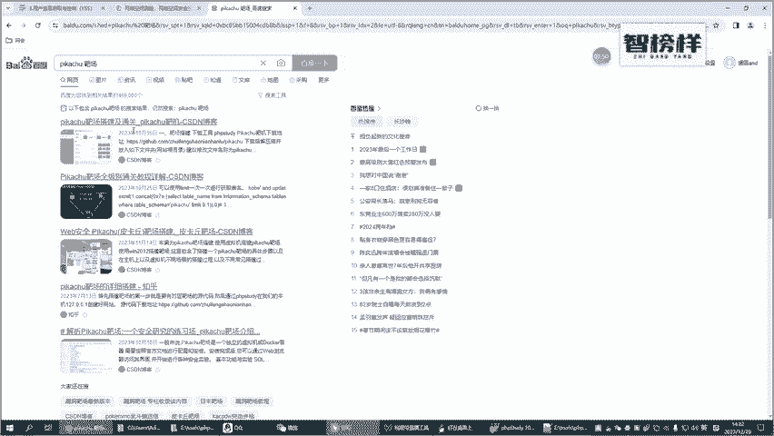

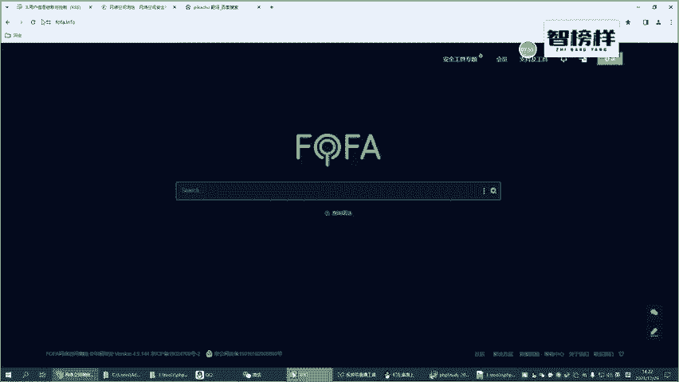

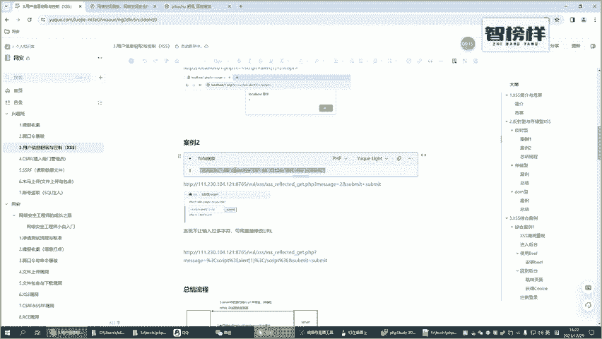

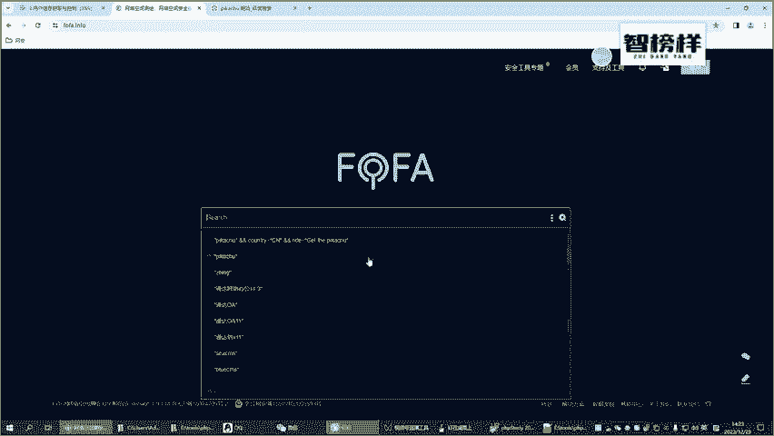

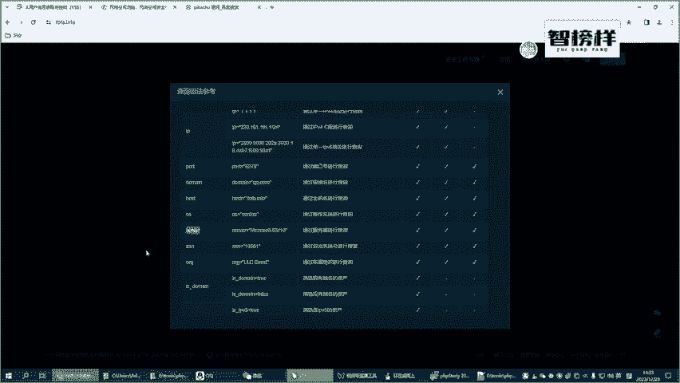

先是中国的，并且来说它的一个标题里面要写一个get the皮卡丘，看到吗？这个字我们去搜啊，那有些东西呢我们就不自己去搭了，直接去搜。那收集显案的之呢，这里面有很多啊，咱们来打开一个，你看一打开了之后。

是不是。

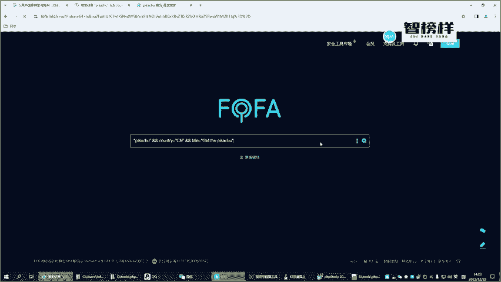

哎，这些东西里面都有的对吧？你看啊这里面是有各种各样一的漏洞啊，比如说CSIF住的一个漏洞RC远程执行的一个漏洞，文件包含的一个漏洞啊，文件下载的一个漏洞，文件上传的一个漏洞等等啊。PHP反去的话。

叉叉一的一个漏洞啊，很多很多一些漏洞。那各位如果说你们呃有兴趣的话，可以好好的去玩一下。好吧。好了，那我们现在用它里面的什么东西呢？我用它里面的啊这个地址的话，你各位你们不用去抄啊，这个地址的话是。

我把这个地址直接复制过来吧，因为我每一次复制过来，可能过段时间啊，你们拿到这个笔记的时候呢，可能这个地址要变了，好不好？可能要变了啊。好，那我把这个地址再把这个复制下来吧。

我担心有些同学呃不知道怎么去收啊，那这个是。

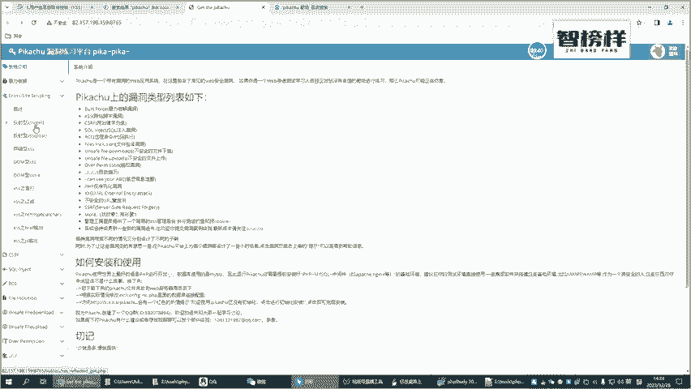

哎，这个地址对吧？好了，那接下来的话要把这块把它给。😊，改了。接回来。好，那那我们接下来就直接来操作好不好？好，他现在是要做一个叉SS攻击，是一个反射型的一个叉SS攻击。那我们根据我们前面聊到这些东西。

对吧？比如说输一个一他接下会把一这个给输出出来，那比如说现在打一个什么这里面有些提示啊，比如说输一个科比啊，咱们输一个科比他接下来就把这个科比的一个图把这个输出出来了，这是一个正常的一个效果啊。

所以说这个时候是并没有攻击的好了那这个时候咱们是不是可以输入一些攻击的一个脚本是不是比如说攻击的一个脚本，这个里面写一个比说？这是我们前面已经聊过的啊，后一好，那走斜线也可以发现他不让输了，对不？

是不是不让输了，那为什么不让输呢？因为他这个里面有长度的一个限制啊，他只让输这么多一些东西。你看在在场他就不让输了对吧？那这个时候怎么办呢？其实很简单啊，咱们在这个里面message里面。

比如说我现在输入一个一啊，你看这里面是不是变成了一，我输入了二上面是不是变成了2。那所以说我们可以在上面来直接来写，比如说sscribe的哎，这个sscribe的。然后在这里面做什么呢？

比如说我要一啊等那走这个一是不是出来了。那这种类型呢，我把它叫做一种反射型。这种反射型给各位讲了两个案例啊，第一个案例呢就是我们自己搭建一个简单的一个P的一个页面对吧？啊输入一个叉输一个X的一个参数。

然后把里面的一个数据直接打出啊，另外的一个方式呢，就是我们借助我们以前学过的这些说法这样的一个搜索引擎啊，自己搜了一个皮卡丘的一个靶场，然后找里面关于叉SS这一块漏洞这相关的一个任务，咱们来做一做。

也其实是比较成功的啊，也成功的。好的，那聊了这么多的一些东西的时候，我们觉得有必要来总结一下什么是反射型的叉SS啊，反射型的一个叉SS唉，你可以看到这样的一个流程。我把这个图稍微说放大一点啊。

首先我们在客户端做什么事情。我们客户端打开了之后，黑客会让你。诱导执行个恶意的1个UR是不是？而我们现在是不是执行了个恶意的1个UR那当执行这个URR的时候。

你可以发现第二个是不是我们我们再来一边操作一边来演示一下啊。首先我们会是不是有个恶意的1个UR这个UR是这样的，对不对？这个URR它能不能执行呢？他能执行，他是怎么样去执行的？当我敲一。

比如说有一个这样的一个地址，有一个这的一个地址，哎，哥们，我直接敲个回车，这个地址是不是发送了服务器，是不是？这是第二个步骤啊，他点击了这个地址的时候，是这个地址是不是发送给了服务器。

那服务器返回的时候，他返回的一个信息是不是放到这一块了？各位啊你们我再来操作一下，比如说我现在不输这种攻击的啊，我输入一个一这种是没有攻击的，他是不是返回到这里面了。

比如说我输入一个hel你可以发现hello他也返回过过去了。那如果说各位啊，我现在输入的是一个恶意的一个脚本。比如说我现在是恶意的一个脚本，我敲个回车，他的这个的是不是也会放到这个位置。

所以说第三步是做什么？第三步就是这个服务器啊，他会把这个恶意的一个脚本，这个恶意的一个代码从U取出来，并且拼接到这个地方，这个地方是不是就是我们前面讲的一个HTML的一个里面。好了。

当有一个这样的一个效果了之后，那第四步就是客户呃呃客户端就是我们现在看的这个浏览器啊，它会解析这个玩意儿，对吧？它解析什么东西呢？如果说你是12345。

它肯定是不会解析的那如果说你现在解析的是一个这个玩意，那这个是不是一个正常的一的一个脚本。所以说解析的效果之后啊解析的一个效果就是变成了我如果说是一个正常的一面，它可以正常的一个形式。

如果说我这个再来运行下，它是不是就跟我弹出一个这样一个框框啊。所以说你理解这四个步骤，你大概就理解了什么是反射型的一个叉总结一下反射型的一个叉SS是谁来发送的是这个黑客或者说谁一些不法分子来发送的那发送了之后。

谁来解析的呢是服务器来解析的服务器解析之后，然后把相应的一个代码放到这个HTML中，那你放到这个。HML中界面是不是会解析这个HM那界面会解析这个HML是不是哎就变成了本来如果说我输了一个正常的是没什么问题的对吧？

比如说输入一个么hel，这个里面是当然有我嗦了啊，只是说为了让你更好理解hel是不是解析到了这个里面那同样道我是一个恶意的一个脚，是不是也会解析那解析就达到了一些扰的一个作用，比。

那走你看这是不是这样啊，那这样的一个脚本，如果说服务器解析解析是HTML会替换成hello的这个位置，对吧？好，我敲过回车，你看是不是点它啊，当然了，你们如果说看一下这个源代码啊，看一下这个源代码。

等一下F3吧，来，你看一下这一块。各位，你们再来看。这个里面是不是呼以只示这一块，对吗？然后这个恶意的一个脚本是不是嵌套这个HTMM里面去了，然后逗逗好，为什么在这个界面里面看不出来呢？

因为这个是一个恶意的一个脚本。因为它是一个恶意的一个脚本，所以说你直接看你是看不出来的。但是你看这个页面的一个源代码，你却能看得到。好吧，那这个就是一个叉SS的第一种类型反射型的叉SS。

我希望各位我反反复复的讲，我希望嗯各位你们关于什么是反射型的1个叉SS呃，各位你们还是要听懂了啊。好了，那咱们接下来就先暂停一下吧。

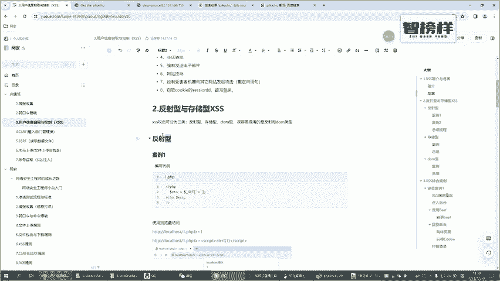