# B站首推！建议所有想参加CTF夺旗赛的同学，死磕这条视频，2024年字节大佬花一周时间整理的CTF入门保姆级教程！从入门到入狱（web渗透／PHP基／SQL注） - P34：3.存储型XSS以及案例简介 - CTF入门教学 - BV1JjeJeYE2p

好那我们现在已经对于这种反射型的一个叉SS有一定的个了解的时候，那我们接下来看啊叉SS除开这个反射型以外，还有存储型，还有盗梦型啊。我们接下来看一下这个存储型存储型是什么意思呢？存储存储。

其实顾名思义存储就会把我当前的攻击脚本存到某个地方，那我们现在理解哪些东西是可以存的。比如说我们以前学过的数据库，对不对？那就是我会把这些攻击的一个脚本存到某一个数据库里面去。那也就是说反射型的。

它是不经过数据库的存储的存储型它会经过数据库的一个存储。那肯定存储型它的一个危害会比反射型的叉SS的一个危害它要更大。当然了。这个只是结论，这个结论你能不能去验证一下。那我们接下来就有同样的道点啊。

来找一下一个案例，好不好？这个案例的话呢，我们同样的使用皮皮卡丘啊从呃呃。啊，有点嘴瓢的啊，同样的使用皮卡丘。那这个地址呢呃可能经常会变的啊，所以说我们现在用的是一个存储型的，在这里面看到吗？

一个存储型的啊。那这个地址的话，我也复制下啊，各位你们在听这个视频的时候，可能这个地址也也访问不了了，也可能会变好？因为我们现在是直接使用佛法的一个搜索引擎搜出来的。

们更多的是尝试使用这些佛法的一个搜搜索引擎自己多去玩一下好不好多去玩一下那把这个看到这一个页面的时候呢，我们接下要做一个什么事情呢？这里面是一个留言版，对吧？

那一个留言我们同样的啊就可以做一个cr的啊好，比如说我们这个一对吧？这个是我们前面已经讲过了啊，一个的，走一个回收啊，提交一下。

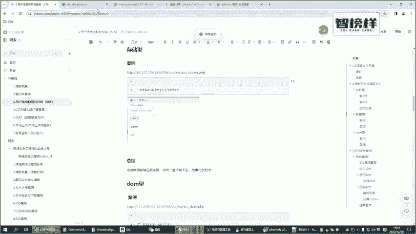

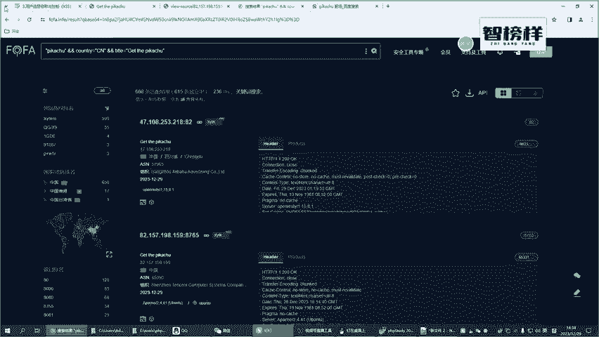

感觉什么事情都没有，对吧？但我们调个回车啊，然后再来看一下存志新的。哎，现在这个。7。各位你可以发现吗？这是一个留言板，但是留言板里面我输入任何的一个东西，它并不能访问啊。所以说说明什么问题呢？

说明这个靶场我们搜的是有问题的啊，看到吗？我输入任何东西他没有保存下来。所以说这个网站是有问题的。那且有问题怎么办呢？有问题我们重新去搜啊，这恰恰相反，有些同学说你这是不是翻车了呢？这是翻车了。

但对于你的一个学习来说，我发现我找的地方不对，那我是不是就可以重新去找也就是说你在挖掘漏洞，或者说你在学习这种网络安全这一块的一个点的时候也会碰到各种各样的一个错折。

这种错折在某些方面来说它是一个比较正常的一个现象啊，所以说希望同学们你们碰到这些问题的时候觉得这是一个挑战，这是一个机会好不好啊，那我们前面访问的这个页面不行了。那我们再找一个呗，这个不好办嘛。

当打开不了，我再打开一个呗，是不是这个这个就是。

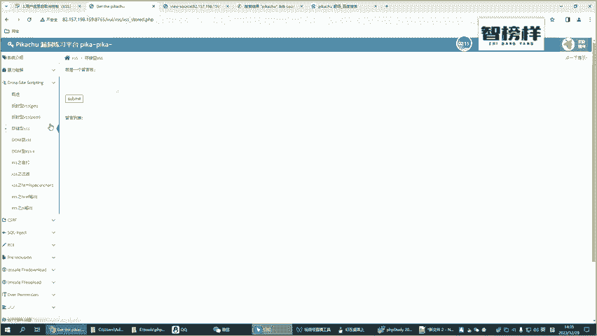

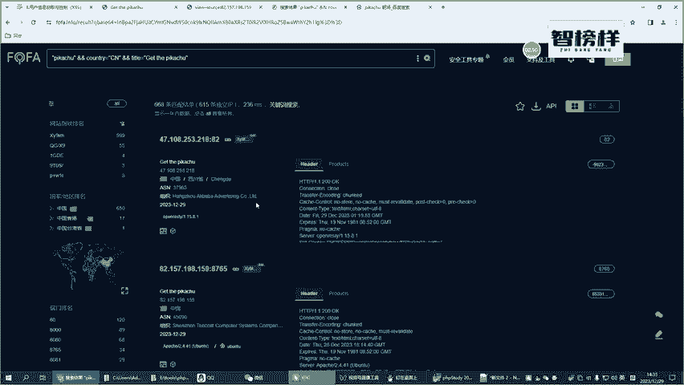

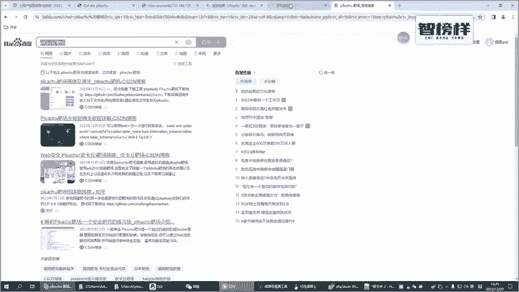

自己搭建靶场跟你自己通过这种网上找的这种实战的一个方式啊，它还是有区别的还是有区别的。咱们找一个可用的吧，好不好？咱们就给自己增加一些难度啊。

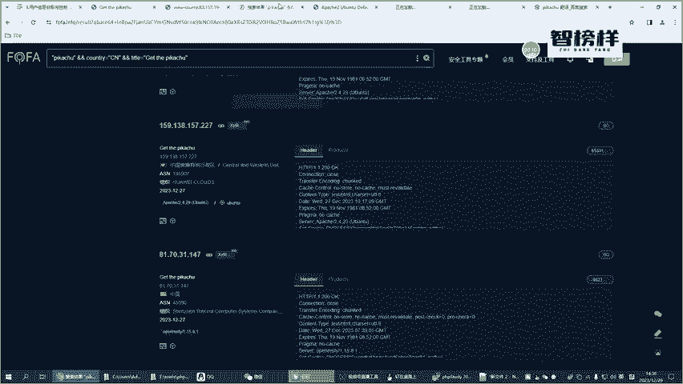

这个是打不开这个打不开啊，这个可以打开啊，这个打开的一个地址。我我先试一下，好吧，我先试一下。如果说试成功了，我再给各位来修改笔记啊，免得我好不容易把这个笔记修改好了啊，各位你们啊对。哎，他不让我存呢。

那我换一个浏览器啊，我看一下是浏览器这方面的一个问题还是什么问题啊？所以说碰到问题很正常。好，换一个浏览器吧，这浏览器咱们。把这个代理先关了啊，完全啊。把代理给关了，在这个选项里面。

这个代理是我们呃昨天讲这个绕口令的时候，不使用代理啊。好了，现在不使用代理的话呢，咱们直接看一下。好，再存一下啊一。看能不能存下去啊，存不下去，那说明什么问题呢？说明了当前的这个我还是玩不了，对吧？呃。

我就不信了啊，我一定要找一个能正常访问的啊。

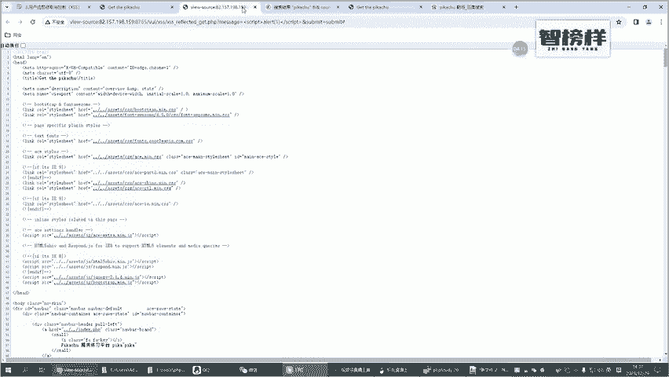

好，这样去搜把这块全部给关了啊，关闭右侧其他，然后继续来找。

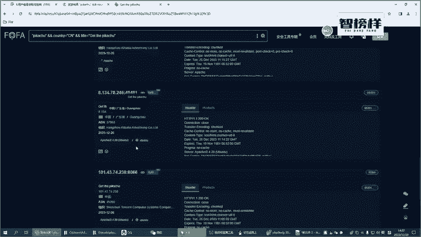

哎，这个好像打开了啊，然后再们再来看一下一个叉SS的啊，然后再来一个存储性。不是筛骨猪儒啊，找一个C叉SS叉SS是吧？在这里面啊叉SS找一个存储型，那走一哎，这个是可以的。好。

那我接下来把这个地址把这个复制过来。所以说各位啊，你们不要有时候你们在演示的时候，你们在嗯复述的时候，不要觉得有时候。重新铺不出来啊，可能有时候重新不出来。所以说你要多去试一下。假设你看到这两个页面。

什么叫能重现出来呢？比如说我现在输入个一，它也能正常的一个呃存进去。那这个页面是可以去用的，这个是靶场是可以去用的啊，所以说各位你们如果说去搜靶场，也可能会碰到各种各样的问题，好不好？

我我我并没有说我直接找一个可用的，然后再跟你们去各位来演示啊，我是带着各位一步一步的来找的，我也把这一块的一个内容，我也不准备把它给删除掉，为什么呢？因为碰到问题很正常，碰到问题咱们解决问题不就行了吗？

是不是啊，这样的话，我相信更真实一点啊。

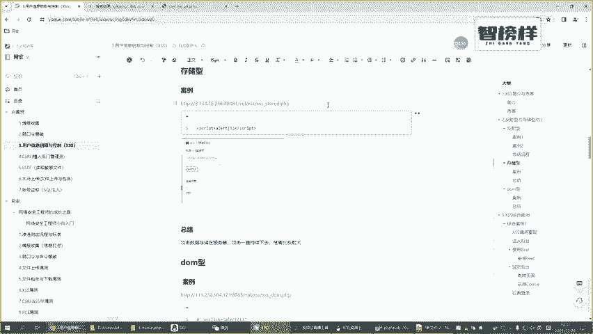

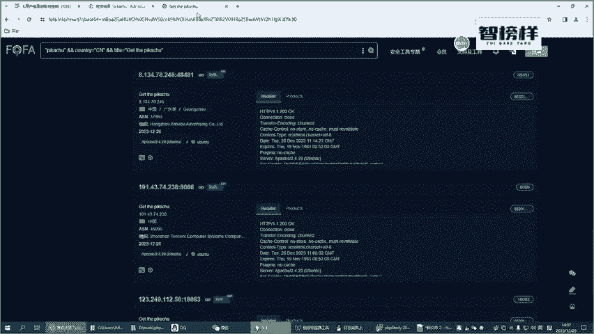

好嘞，那这里面是一个留言板，这个留言板是干什么用的呢？留言板留言板就是用来用来留言的吧。比如说现在一个正常一个情况哎啊。呃，论坛的朋友们大家好，对吧？论坛的朋友。大家好。

是不是咱们平时说呃经常会做的一些留言那个功能。比如说你好，你看我们当我们离开这个页面的时候啊，我们再回到这样的一个页面，是不是相应的一个信息都在。所以说他这块信息是存储起来的。

准确的来说它是存储到数据库里面的啊，最起码到目前为止，你们已经理解什么是存储吗？就是这个案例，你可以发现我不管说离开这样的一个页面啊，我进了任何的一个页面，我只要回到这个页面来啊。

比如说这个是存储型的叉SS，我这个信息还在对吗？所以说它会存到数据库里面，这个好理解那这个理解了之后呢，咱们机器来再来玩完成么。比如说我们前面讲这个工的脚本。比如说啊。scribe的SCRAAPT对吧？

啊，然后。一好，然后再来个是规b的。唉，这个是我们这个工击脚本单了，斜线不要忘记了啊，那咱们点一个。唉，你可以发现是不是弹出一个框，那为什么会弹出一个框呢？

因为我把这个数据最终存到了数据库里面在返回我界面的时候，你看这里面实际上是没有数据的那真的没有数据吗？我们看一下F2啊，我们把这个鼠标放到这个位置啊，你可以发现哎它看上去没有位置，它真的没有位没有吗？

真的没有东西吗？你看一下这个啊，你看是不是有这个是我们刚才输入的这个东西，这个就是一个比较简单也比较好理解的这个存储型的一个的那这个存储型的一个的，它和我们前面讲的反射型的。这种叉SS啊这两种类型。

一种是存储型的叉SS一种是反射型的叉SS你认为哪种漏洞哪种漏洞它这个危害性要更大呢？毫无疑问就是存储型的叉SS漏洞要更大。为什么呢？各位啊，我们再来看一下这个反射型的叉SS。😡，我如果说这个地址。

比如说我现在输一个一啊，然后这里面这个是我们一个反射型的，是不是啊，比如说我现在一个alant啊。是gra的entSRAAPT。好。ICRAPP我我我后我后面复制就行了啊，免得每次都这样去打。

我觉得挺无聊的啊啊，走敲个回车，是不是OK了？哎，敲个回车，他又执行了。但我去了另外的一个页面，然后再回到这个页面啊，不好意思。他就不攻击了，对吗？我想要攻击，我重新得写这些攻击的一个恶意的一个脚本。

是不是这么一个道理。好，我再来看一下我们刚才做的一个存储型的。哎，我点进去来一次，它跟我攻击一次，我点进去一次，他攻击一次，或点进去攻击一次。所以说我都不需要重新去编写这些恶意的一个脚本呢。

你可以发现到底哪个危害要更大，是不是存储型的一个危害，它比我们前面讲的一个反射型的一个危害，它要更大。好了，那我们来大概来看一下啊，它的一个存储型，它跟我们前面的一个反射型，它有什么那个区别呢？

其实它的一个区别很简单啊，同样的也是客户会发生一个这样的一个恶意的一个脚本。啊，服务器他会做什么事情啊？服务器他会把当前的这个脚本。除开返回给我们的客户端以外，他还会把这块也就是说。

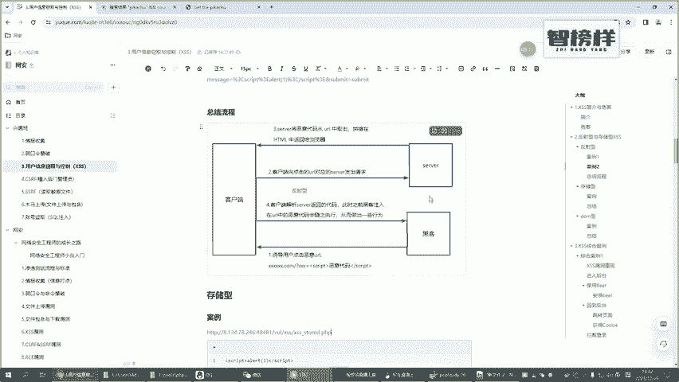

主要呃我们还是呃在这里面再补充一下啊，比如说这里面有个数据库。

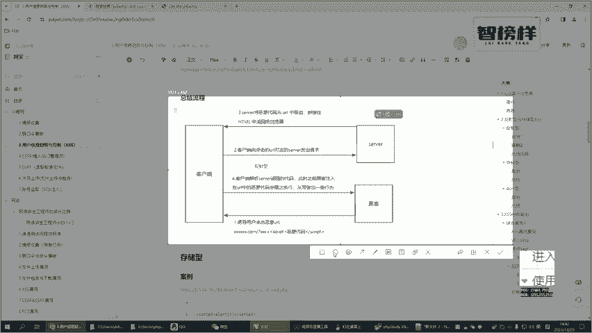

这是一个数据库，哎呦哎呦。

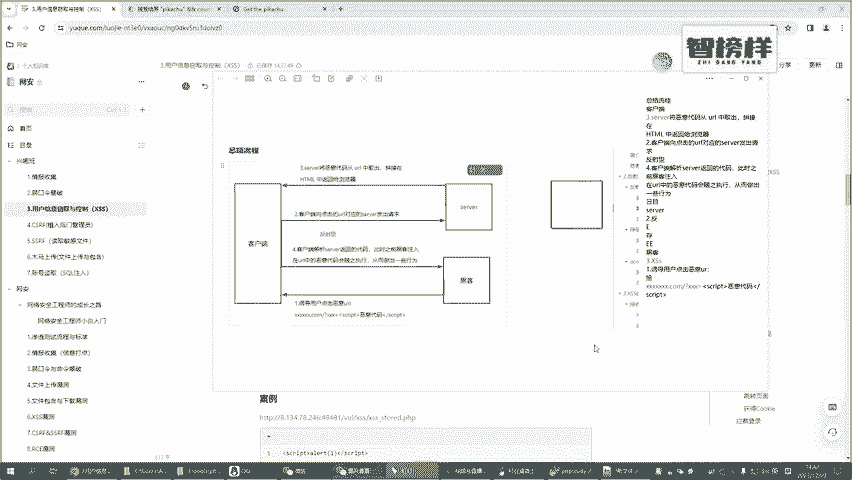

我先画一下吧。好，这是我们原先这个图，对不对？好，我们在这里面再画一个，然后再跟大家写一个文字吧，文字文字再。文身在里面啊，这是一个数据库。好，那实际上我们把这个图再来给各位来讲一下。

第一个步骤是不是黑客给了我一个恶意的一个链接，就是恶意的一个地址。他恶意的一个地址，这是第一步。好，当把这个恶意的一个地址填好了之后，恶意的一个工击脚本写好了之后呢，好。

接下来客户端会把当前的一个请求发送给服务器。发送给服务器了之后，那按照我们传统的叉SS是不是把数据直接返回了，但这个时候不会啊，接下来他要做的一个事情是直接把当前的一个数据也存到数据库里面一份啊。

这是这样的一个流程。好，那接下来他再从数据库里面把我相应的一个数据，把这个返回回来。反馈回来了之后，那接下来反馈给前端，前端执行，对吧？前端会把它的1个HTML的执行。

那这个呢就跟我们的一个流程是一样的啊。我们接下来再来标个序号吧，把序号稍稍改一下。对，这是第一个步骤，对吧？是黑客写了一些恶意的一个脚本。好，第二个步骤。好，接下来服务器会把相应的一个数据存到数据库。

这是第三个步骤。那接下来在返回之前，会从数据库里面把这些东西给取出来，这是第四个步骤。好，接下来这是第五个步骤啊。好，那接下来的话，第六个步骤。看什么是稍微来说有所呃有所变化啊。那其实总体来说啊。

存储型。

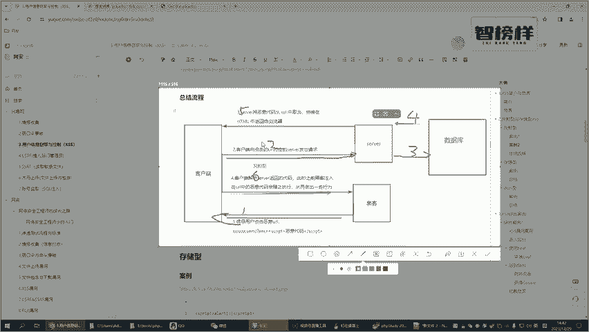

和反射型还是比较好区分的。存储型，它无非就是把这些恶意的一个脚本，它会存到这个数据库里面，对不对？那这个是存储型和反射型，他们之间的一个区别啊，通过一个呃案例给各位大概来讲一下啊。当然这个案例。

各位你们还是要去试一下，重点不是说我我不给各位搭建一个这的一个靶草啊，重点是让各位你们来熟悉一下这个佛法这样的一个搜索引擎。这个黑暗引擎，它到底是怎么样去一步一步的玩的，好不好？希望各位来理解一下啊。

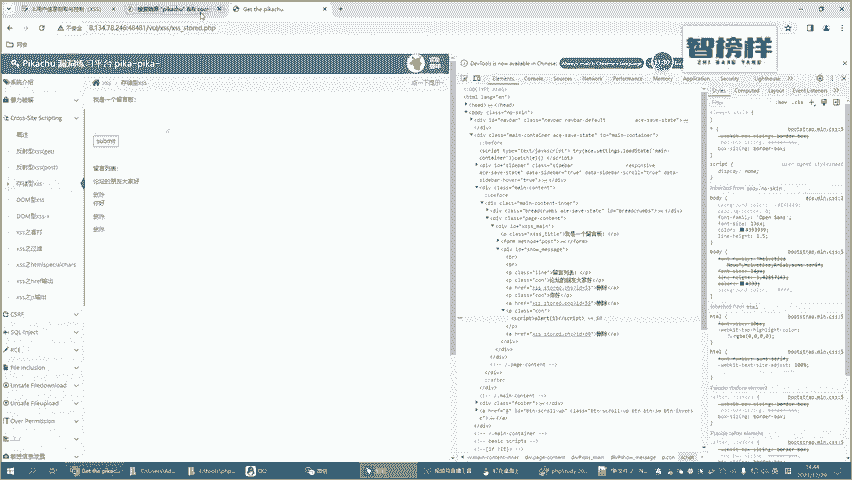

