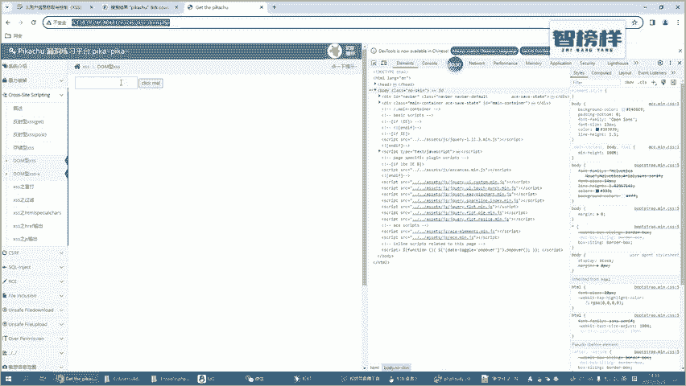
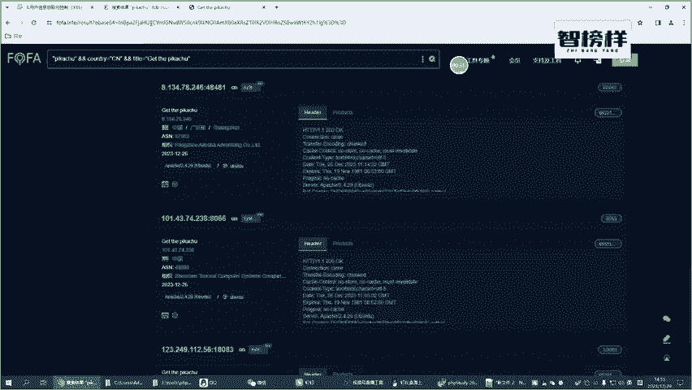
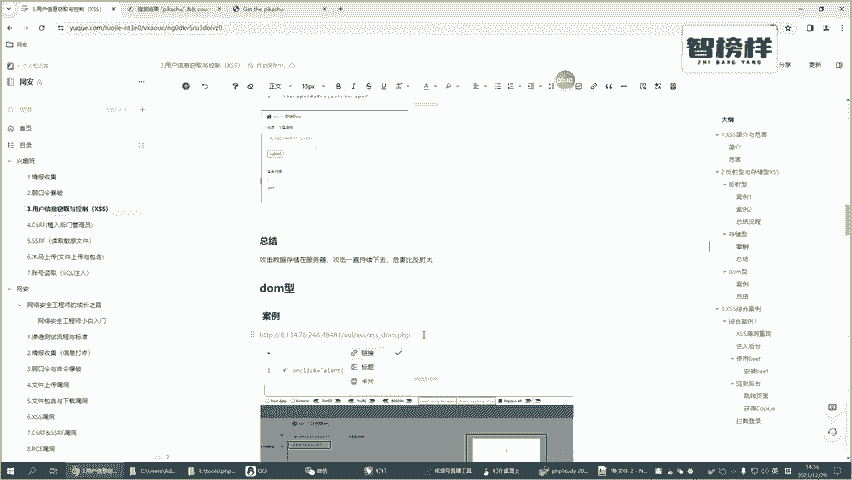
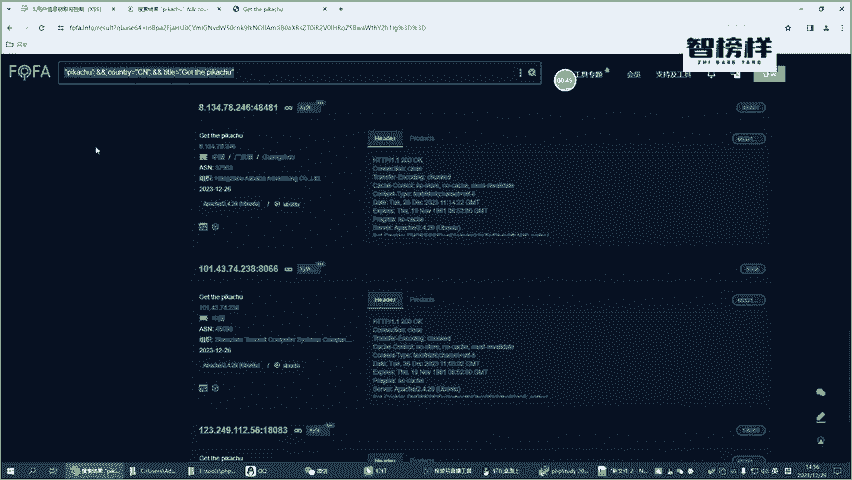
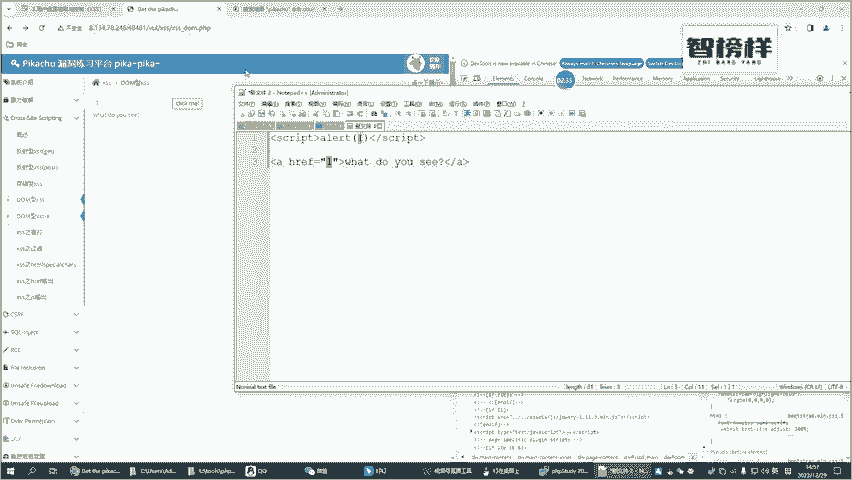
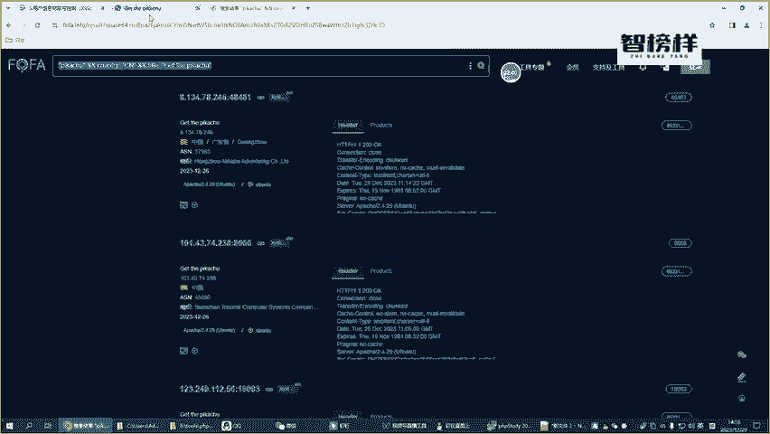
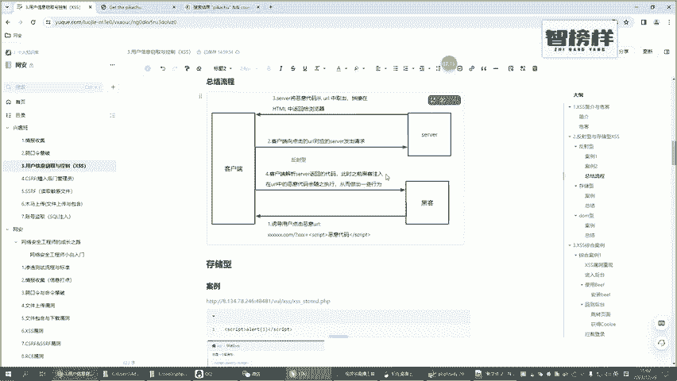

# B站首推！建议所有想参加CTF夺旗赛的同学，死磕这条视频，2024年字节大佬花一周时间整理的CTF入门保姆级教程！从入门到入狱（web渗透／PHP基／SQL注） - P35：4.dom型XSS以及和反射、存储XSS的区别 - CTF入门教学 - BV1JjeJeYE2p

好的，那咱们前面讲到了这种存储型，也讲了这种反射型的一个叉SS。那咱们接下来讲一下容易让人困惑的，也是容易让人迷惑的一种类型，叫是动型动型啊，各位其实你不需要严格的来区分这种动型。

因为动型用的其实并不是特别多。当然啊为了咱们课程的一个完整性呢，我们还是要来讲一下这个动型啊，这个动型的话，首先我们也是用这个地址啊，我不知道这个地址能不能用啊，咱们还是以它为例。

我们先输一个1开的有结果啊，有结果就OK那我们把这个地址也复复制过来。各位我再强调一下啊，你们下次访问的时候，这个地址也不一定可以用。所以说你们如果说用不了的，直接使用这个佛法引擎来搜一下好不好。

直接去搜一下啊。

好嘞，那接下来的话呢咱直接来看啊，在这里的页面里面，我们来看一下它的一个正常一个流程。比如说我们输入一个一看到了吗？比如说我们连个click me啊，你也可以发现它。返回在哪呢？

它返回是这样的一个页面啊，我们按个F12来看一下这个。哎，他在这里面会把这个一把它给变到这个位置，对吧？好，当我们点点击进去的时候，它会跳到一个新的一个页面啊。也就是说我们点我们随意的输一个数数字。

对吧？比如说hel啊，它会把它变成一个地址，它最终也会取出来啊，也会取出来，然后放在这个hel里面啊看到吗？把这个hel变成hel如果说我们这个呢把它变成3W点百度点com啊，然后click一下啊，好。

他看就是一个这样一个地址，对吧？然后点点进去，就是访问3W点百度点当然然也就等于说为什么它没有真实的去访问呢？因为我们要加上一个协议，对吧？比如说HP啊，然后咱们ick一下，咱们点。

你看是不是就就到了这个百度的一个页面啊，那这一种呢是一种比较正常的一个情况。好的，那呃我们接下来尝试的输一些恶意的一个脚本。那这个恶意的一个脚本啊，其实各位你们现在已经明白了，对么我们输一个一了之后。

它的一个脚本，它一个位置，就是我们输的这个一，它会放到什么位置啊，是不是放到这个haf的一个位置，是不是那既然说放到这个haf的一个位置的话，那我们把这个命令把这个复制一下啊。

把这个就是把整个的这句话把这个复制一下。复制复制copy是吧，copy copypy elephant啊。啊，它是这样它是一个正常的那这个一是我们现在呃输入的这个内容，对吧？好。

那如果说我们现在把这个攻击的一个脚本把它变成这样啊，你看会变成怎么样啊，它这个把这给放到这个位置来，这个是我们的一个攻击的一个脚本，对吧？那这个一是我们自己手动输入的啊，如果说我把它变成这个样。

比如说各位啊你把它变成这个样啊，比如说这个前面是一个引号，对不对？好，它又变成uncl一是不是真正的一个语句就变成这样了，前面的一个ha呢，它就变成一个井号了啊，好，那我们接下来来尝试一下啊，走等一下。

😊。

OK好，让我们再来点一下这个按钮啊，你看一下这个按钮，它现在变成什么，是不是你看一下它个命令是不是变成have，然后变这个变成井号了，然后点一个on click，它就变成了an一，对不对？

所以说我的一个攻击的一个脚本，然后把它变成了一个输出了之后，它会变成这样啊，然后点一下这个。点一下这个你看是不是ent，所以说我们通过这种方式也注入成功了啊，这是一种盗型。

那我们再来看一下盗型跟我们前面讲的这种反射型，它又有什么样的一个区别，又什么样的一个联系呢？好，那咱们来看一下下面的一个流程图啊，就是这样的一个案例图。这个案例图的话，这个讲的是我们的一种盗型。

盗型呢其实相对来说是比较简单的啊，它并没有经过服务器，看到吗？并没有经过服务器。而我们前面讲的这种存储型也好，或者说反射也型也好，它都是会经过服务器的。也就是说我们使用的这种盗型，它完全是只跟客户端和。

黑客之间，也就是说他的一个攻击者之间，他们之间有互动啊，你看下面有个总结，动型跟服务器其实是没有太大关系的啊，它不需要和服务器进行任何的一个交互。攻击纯粹发生在客户端和黑客之间，看到吗？这就是。

我们动型跟我们前面讲到的啊两种不同的叉SS它们之间最大的一个区别。那为了验证一下，比如说我点点点下click对吧？那你我们可以看一下它里面是不是有一些网络的一个请求，你看点一下它有请求吗？没有。

是不是点一下没有啊，我点一下这个看到吗？它也没有这相关的一个请求，这个就是我们并没有跟服务器有任何的一个操作啊，但我们再来回到我们前面的一个存储型，那就更不用说了啊，我们把这个请求把这个令一下吧。

把这个全部给另一下啊。好，那我们比如说我们现在认可的输入一个，比如说我们先前面打了一个sc的对吧？啊，我们再打一个qui的啊，比如说ent我们再打一个R好，然后再走一个啊scra的。哎。

这是一个攻击的一个命令，对吧？我们底一下s密啊，你看是不是有请求，你看一下这一块是不是是不是有请求。这个就是呃。一个就是我们do型，它是不会跟服务器进行一个呃交互的。而我们存储型。

包括我们前面那个反射型啊，比如说我们反射型的啊，比如说我们。走个一对不对？他也会跟服务器有交互，看到吗？比如说我们清楚一下啊，我们走个一是不是跟服务器有交互，对吧？好，我们在这里面直接来写一个啊。

比如说script的啊SCRAPP然后啊，比如说一好，然后结尾SCRAPP结尾啊敲过回车，你看是不是跟服务器是有交互的，这个就是三种不同类型的叉SS，他们之间有什么样的一个区别。我们再来回顾一下啊。

再来总结一下那。普通的反射型就是我们用的比较多的一种类型，它是跟服务器是有交互的对吗？它总体的一个交互的一个流程呢，就是我们现在这个啊这个是一个比较正儿八经的一种叉SS。那存储型呢。

它是在反射型进行了一个加深，或者说加强唯一的一个不同，就是在这个serv端，它会把相的一个数据存到这个数据库里面。这样说它会存到数据库里面，所以说它带来的危害，一定是会怎么样。

一定是会比存储型一定是会比我们平时讲的这种反射型，它的一个危害，它要更大一点啊。所以说危害最大的这三种，就是。存储型是最大的。然后其次是我们平时讲的反射型。最后呢，由于我们的do型。

它完全不会跟服务端有任何的一个交互。所以说动型它的一个危害是最少的啊，最小的这是这不同的三种类型的叉SS他们自己能个区别，以及它的一个联系，希望各位啊结合我画的这两个图啊。

然后呃好好的理解一下他们三级者之间到底有什么一个区别，好不好？

