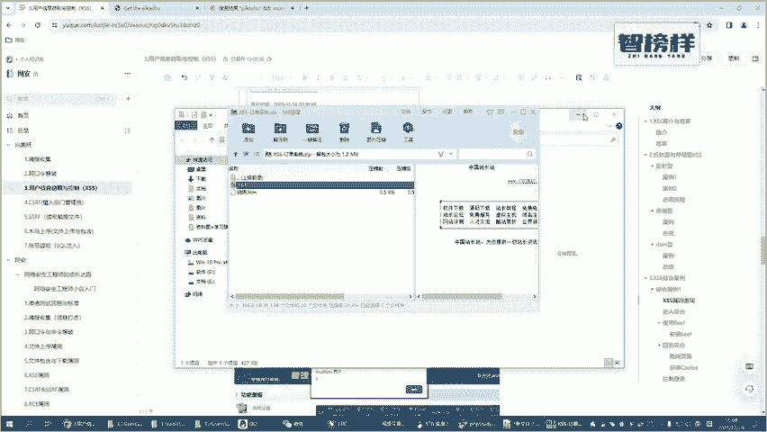
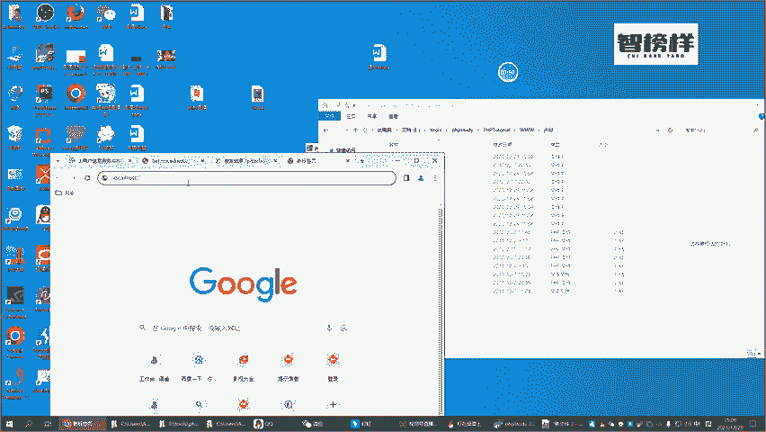
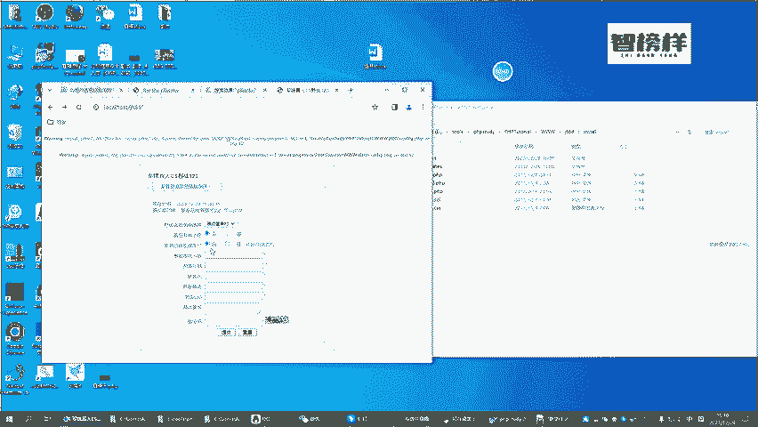
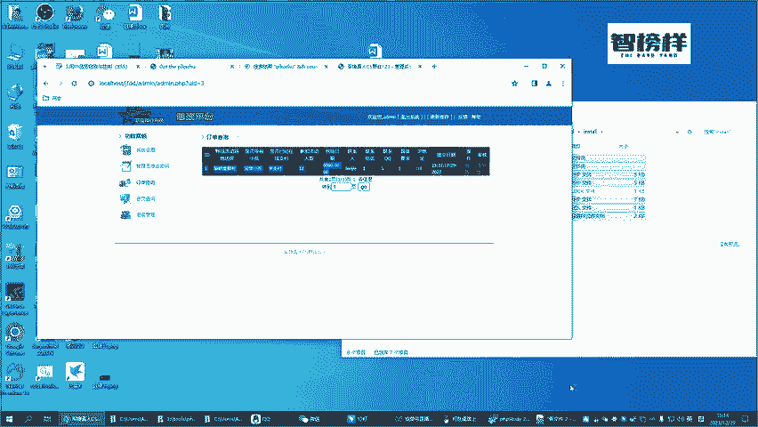

# B站首推！建议所有想参加CTF夺旗赛的同学，死磕这条视频，2024年字节大佬花一周时间整理的CTF入门保姆级教程！从入门到入狱（web渗透／PHP基／SQL注） - P36：5.正式靶场环境搭建 - CTF入门教学 - BV1JjeJeYE2p

那我们前面啊对于这种叉SS它的一个概念有了一个基础的一个了解，也了解了什么是反射型，什么是存储型，什么是动型的一个叉SS通过这些案例以及详细的一个讲解，了解了他们不之间的一个联系。

以及他们之间有什么的一个区别。那聊到这些东西的时候呢，我们接下来玩一个实战的一个案例啊，一个综合的一个案例。这个综合的一个案例呢，呃会让各位对于我们叉SS它这个危害有更深刻的一个了解好不好？

会有更深刻的一个了解。那首先第一件事情呢，我们先把这个环境把这个搭建起来啊。如果说我们呃环境没有搭建起来，那直接来讲的话，我觉得效果可能不太好啊，可能我讲了各位也听懂了，但你们做不出来，这是个假把式啊。

这是个假把式。好了，那咱们在我们前面的这个3W的这个目录里面啊，我首先我给各位的一个这一个这样的一个系统干嘛这个系统的话是你们直接可以解压用的啊，可以直接解约用。

那到底怎么去用呢？我先把这个环境给各位来装好，好不好？好回到我们呃PHP4大底的这个页面，然后进入到里面的1个3W这个目录里面啊，然后你直接解压，就是把我们发给各位的这个靶场啊。

把这个靶场直接解压到这个目录里面去。那解压完成了之后呢，直接可以关了啊，这个压缩文件我就用不着了啊，压缩文件我也会打包给各位啊，也会打包给各位。各位，你们也可以跟着我一起来实操一下。好吧。

那解压完成了之后怎么办呢？解压完成了之后，你接下来就需要去装啊，去安装它，那怎么安装呢？这个时候你们直接访问就行了。比如说对吧？好，这个解压的目录它叫什么名字啊，解压的目录叫叫叫这个JFDD啊。

接FDD好，我们接FDD走敲个回测那这个网站。

啊，直接访问的话，他是为没有成功的啊，我们还需要访问这个啊，看一下。看一下这里面有个ind点PHP看到吗？好，然后再加上这个来访问啊。敲个回色。已经安装过了，请重新安装前请装呃。

请先删除instoreinstore lock啊。好嘞，他其实已经告诉你了，如果说你报出了一个这样的一个异异常，报出来一个这样的一个页面，他告诉你你要把这个indes看到么？这个inice啊呃。

就是这个instore啊in store。然后里面有个落的这个文件把这个删除，看到吗？你把这个删除的之后，我们再访问这样的一个页面啊，看到吗？他接下来就可以去重新装了啊。

就是我们刚才是不是套报了一个这样的一个错。如果说报了一个这样的一个错，你可以根据他的一个错误，我们刚才是不是在这个页面里面删除一个文件啊啊，这是一个小的一个插曲啊，你们装的时候可能也会有这样的一个问题。

好吧，如果说碰到这些问题，你们就跟着我们视频讲的一个内容自己去解决一下啊。好了那第一步我们。

直接点继续点了继续了之后呢，如果说没有任何的一个呃问题的话，如果说没有呃，其实也没有什么太大问题啊，直接点继续。那接下来话就要输输入你my的一个环境了啊那我们直接用默认的一个啊比说我my就是在我本地对？

因为我们把 study启动好了之后数据库它也会自动启动起来啊，这个是my。那呃数据库的一个用户名是root密码呢如果说你使用的是我前面给各位的一个 study它个密码也是root。

如果说你自己单独的装的是my啊，单独在你的一个电脑上装了其他版本的一个my那各位你们得根据你的一个真实情况，把这个密码改成你自己my的真实密码好不好？好，那这个是数据库的一个名称。

我们就不去改了啊然后剩下这东西我们不去改了哈，直接点下一步导入数据。哎，这个时候。好，你看到这个它就已经执行成功了，对吧？已经这上面的这些提示，我们先不管啊。好，那我们接下来下一步啊，设置管理员。

那管理员的话，比如说我们使用admail，对吧？然后密码是123456简单旗键啊。好，任意数值的话，比如说我们现在也输入一个一，好吧，简单起见啊，然后直接下一步安装成功啊。好。

进入后台的一个页面进入后台一个页面，我们前面是admail，然后输入的是123456，然后验证码3。48。5啊，点一下提交。哎，如果说我们看到这样的一个页面了时后。

说明我们的这个相关的一个东西已经安装好了，对吧？那这个是干嘛用的呢？这个呃网站这个网站是咱们平时啊咱们可能要参加一些什么社团或者一些活动的时候，会有一个在线订单的一个提交的一个页面。

看到这个就是一个订单提交的。比如说我们经常会要参加一些什么真人CS的一些活动啊，那你是去哪里参加啊，是不是带了小孩啊，然后参加这个人数，咱们随便来写。比如说到场的一个时间。

2023年比如说呃12月比如说2十35号我们随便点随便填好不好？这个其实无所谓啊，然后联系人罗杰，然后联系电话号码，我们就直接一啊一，然后要求咱们一然后下面输一个验证码，4304啊，然后点击提交。

那相当于什么？相当于我已经跟这个网站的一个管理员说哎我要去参加你们。当地举办的一些CS活动，请跟我预留场地预留时间，对吧？就是提交一个这样的一个订单。那提交这样的一个订单之后呢。

我接下来要进入我的一个管理后台啊看。好，这个是我的一个管理后台，管理后台我们前面是不是已经设置过密码了，比如说admail，然后123456。好，接下来的话就是验证码，这个验证码看不清啊5。啊。

45ZS52，验证码不正确啊。然后是换一个吧。4676啊，我的眼神不太好，4676，然后密码呢，我们再输下456啊，提交。哎，这个时候你看我们接下来订单查询。

是不是我们刚才提交的一个数据就已经在这个里面了，对吧？啊，那到目前为止呢，我们把这个平台做了一个简单的一个介绍啊，也带各位从头到尾来把这个环境把这给装好了。各位，你们在真实操作，我们后面案例之前。

先把这个环境一步步的给它搭建起来，好不好？那这个是这个视频，咱们就先放这里吧。

各位你们尝试的去搭一下啊。