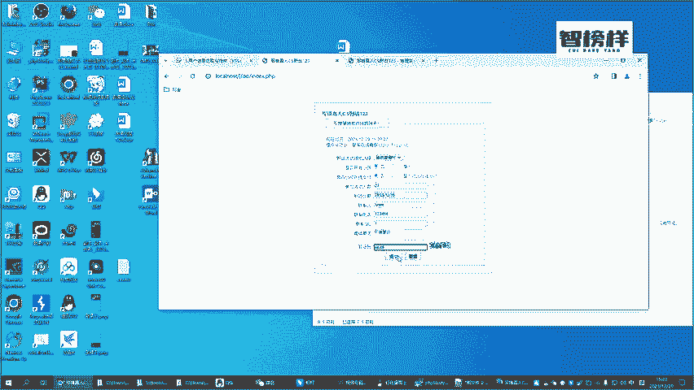
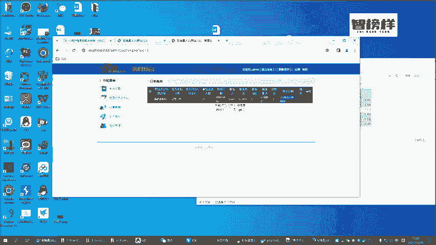
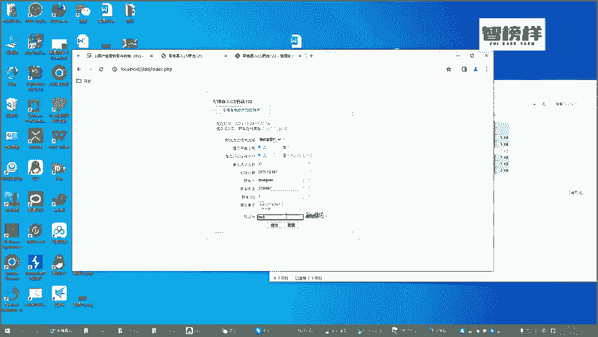
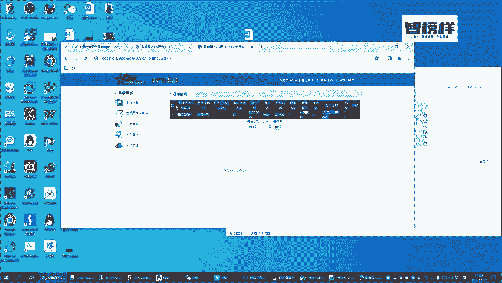
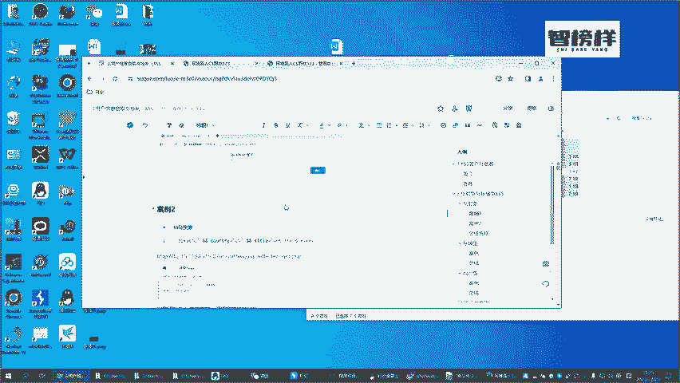

# B站首推！建议所有想参加CTF夺旗赛的同学，死磕这条视频，2024年字节大佬花一周时间整理的CTF入门保姆级教程！从入门到入狱（web渗透／PHP基／SQL注） - P37：6.靶场XSS漏洞重现 - CTF入门教学 - BV1JjeJeYE2p

而通过我们前面的一个呃步骤的一个讲解，我们已经把这个靶场的一个环境已经真实的给装好了啊。我们接下来再来看一下它的一个正常一个流程。一个正常的一个流程是我们在这里面输入一个人数，对吧？

比如说我23谁什么样的一个时间，真实一个人，比如说罗杰联系号码，比如说123456，然后QQ号码一，然后具体一个要求，比如说无要求无要求，比如说环境好吧，环境要好好，验证码6这是66649啊，49。

然后点下提交哎，这是一个正常的一个情况，当我们提交这样一个订单之，我们可以看到后面的这些东西啊，比如说没有带小孩对吧？啊，还没有支付支付这块先不我们不用关心啊，然后到场的一个时间，这东西的话。

比如说提交的一个时间，这东西其实都已经到了这个后台的一个数据了，对吧？好，那这个时候正常的一个情况的话，就是管理员会给你安排这相关的一个场地，然后给你打电。

电话进行一个确认啊，这是一个正常一流程。那我们接下来看一下，我们今天既然说学的是叉SS是通过这种java的一个方式来进行一个攻击。那他又是怎么去攻击的呢？好，我们同样的啊，在这个地方来形成一个订单。

比如说我现在人数12日好不？到场那个时间，我们随便写一个，比如说12月37号，这个谁随意的填啊，随意的去填。比如说联系人联系人比如说是张三啊然后呃联系的电话号码1234567QQ号码我们简单的说啊。好。

其中具体要求就有意思，具体的要求我们输入的是一个攻击的一个脚本，就是我们前面所说的一个s的啊。加va是贵不得。好，这个时。注意啊，这个东西不要填错SCRATSCRAAPT好。

接下来我们打做一个事情是ant1。那下面哪个验证码我又看不清啊。9601吗？点一下提交哎，提交成功了，对吧？那这个时候我们再回到这个后面，我们再来做一个订单查询，你可以发现弹出来一个这样一个框框。

弹出来这样的一个框框的之后就证明什么东西呢？

证明了我们使用我们前面讲的一些案例，已经发现了当前的这个靶场，或者说当前这个网站，它是具备叉SS漏洞的。并且来说我们也把这个漏洞进行了重现。但各位啊，你们如果说觉得通过这样的一个讲解。

通过这样的一个案例的一个展示就能体现出我们叉SS的一个魅力就错了啊。叉SS它能带来的危险，它能带来的一些威胁。比我们现在展示仅仅弹一个框框出来，或者说给你弹一个广告，它所带来的危害，它要大得多。

那怎么样大他又具体可以做些什么样的一个事情呢？我们接下来通过后面的一个案例啊，来详细的给各位来说。好吧，那我们接下来做的一个事情呢，就是要搭建一些呃闭F啊这相关的一个环境了啊，那我们等会聊到后面的之候。

然后咱们再说好吧，这个视频的话。

