# B站首推！建议所有想参加CTF夺旗赛的同学，死磕这条视频，2024年字节大佬花一周时间整理的CTF入门保姆级教程！从入门到入狱（web渗透／PHP基／SQL注） - P3：3、php注释、变量、局部变量、全局变量、static关键字 - CTF入门教学 - BV1JjeJeYE2p

好，那接下来呢我们来看一下PHP里面的一些注释啊。注释的话呢，我们给它来两个斜杠，这个是单行注释。那如果说你要注释多行，就斜杠新新斜杠，我们稍微来写一下啊。比如说我现在这一行不要了，对不对？

我给它来两个斜杠注释掉了。

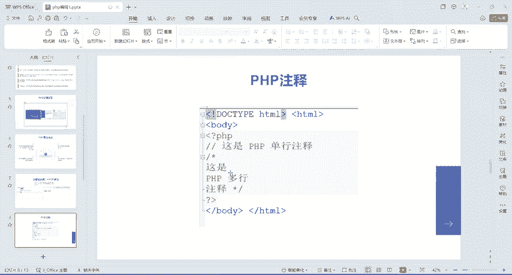

注射了之后呢，它就不会有显示啊。那如果说你想要一个多行注释，因为你写很多很多对吧？哎，写很多很多。那如果是你要把这个东西给它注释掉，那我们可以给它选中，选中之后呢。ctrl加斜杠哎，这是单行注释。

对不对？明白吧？哎，也可以啊，就是如果说你不想写这个两个斜杠打两字，那你就ctrl加斜杠就行啊，它也是单就是单行注释。那如果说你要多行注释的话呢，那你就这么玩。😊，controrl shift加斜杠。

哎，这是多行注式，这是斜杠星星斜杠。😊，好吧，那么这个只要是被注射掉了的话呢，在我们运行的时候，它是不会显示的。好吧，哎注释是给自己看的啊，注是是给自己看，然后以及给这个呃测试人员去看的。

比如说你写了个代码啊，你啪啪啪写了很多很多代码，那人家看不懂，那怎样让人家看得懂呢，你就在这个上面写着注射。比如说哎这个是打印输出一句话，对吧？这个呢是多行注射，这个呢是单行注射啊。

就这个直接去写一下就行了。😊。

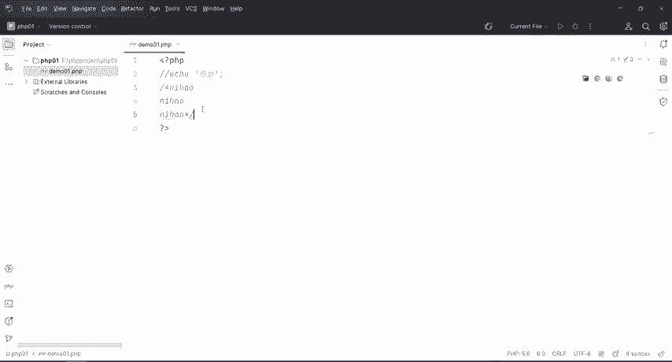

啊，这是注射，然后再往下走PHPE的一个变量。那么变量的话呢，它是用来存储信息的一个容器啊。

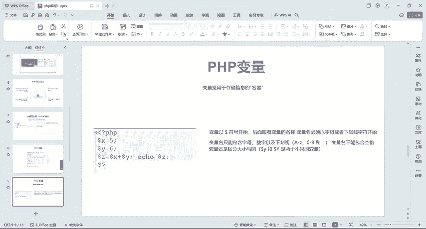

什么意思？打个比方啊打个比方，我们来画个图。😊。

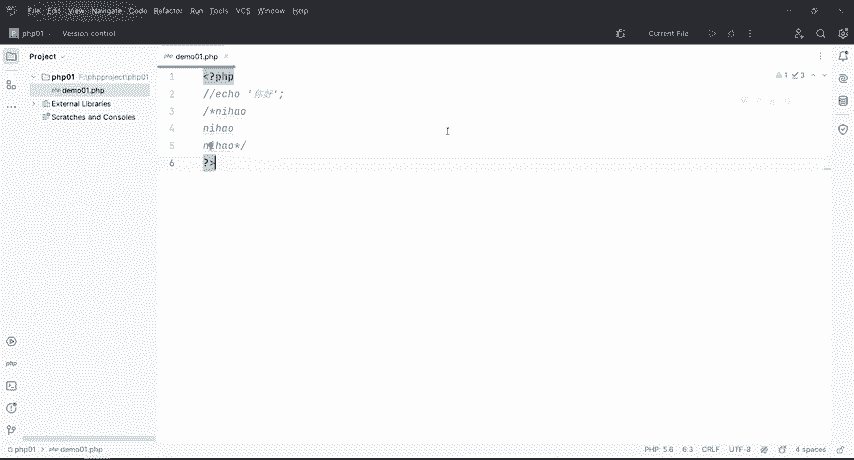

嗯。好。比如说我现在有个房间对吧？哎，我在哪个哪个酒店，比如说在666号房，哎，有个酒店，酒店里面有个66266号房，我住在这个里头，对吧？那我们这个容器呢就相当于我们这个666号房啊，然后我进来了。

对吧？那我进来之后，那我是不是住到这个房间里面来了，那么牵扯到什么呢？给变量的一个负值，那也就是说我们在变量声明的时候，这个变量里面这个容器它是个空的，好吧，那么具体怎么去给他这个声明变量啊。

我们用多了符号，比如说来个多了X然后这个五呢就相当于是我哎，我来了之后，我住到了这个X这个房间里头，那这个就是PHP变量的一个声明，那么变量呢以我们这个多了符号开始，然后后面跟着变量的名称，好。

这里有一个对变量名的一个要求，必须以字母或者下划线。😊，字符开始，那变量名只能包含字母、数字以及下划线，变量名不能包含空格，然后它是区分大小写的。比如说大写的Y和小写的Y，它两个是不同的一个变量。好。

那如果说你直接干嘛呢？直接来一个多勒符号。😊，然后一那肯定是不行的。好吧，必须是以字母或者下划线字符去开始，不能以数字开头。所以这个是错的啊，那具体怎么去做呢？

我们还是回到这个地方BHPstone这个文件里面来。😊。

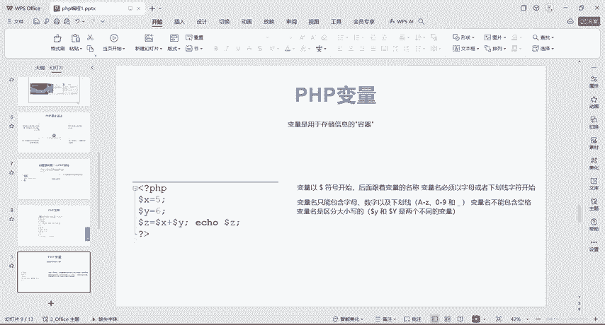

好，我把它删了。删完之后，那我现在来声明一个变量，首先以doer法开头X就等于5。然后呢再来dollar y等于6啊，或者等于8是不是？好，那这个地方啊我也写个注释，那么这个dollar X。😊。

多了X是变量名。然后5呢。是指。好吧，那这个等于号呢是负值的意思。等于号是负值的意思。那负值它是干嘛的呢？它是从右边哎，负值给左边。那也就是说把这个五复值给这个X啊，这个这是一个变量啊，然后呢给它复制。

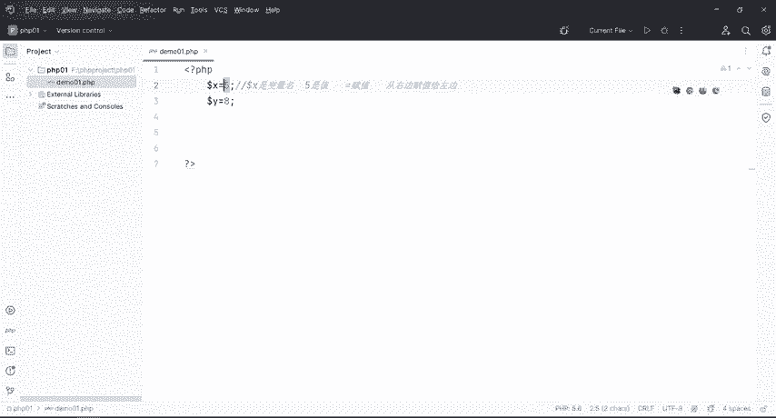

好，那接下来往下走。😊，编量复制完了之后，我们就可以去。这儿正常的啊，比如说我来一个X加Y，对不对？或者X减Y都行啊。那直接通过我们这个e echo什么呢？do。😊。

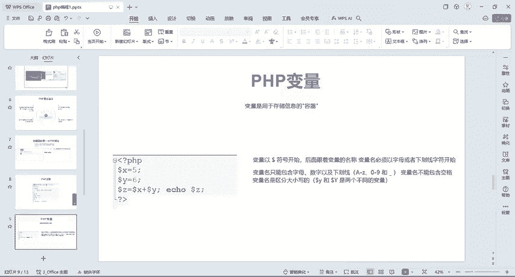

X加上哎多了Y就可以了。好，我们同样的运行到我们这个浏览器里面，是不是等于13？😊。

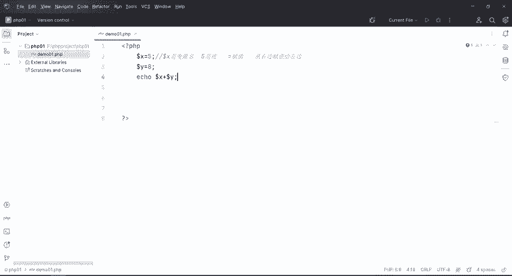

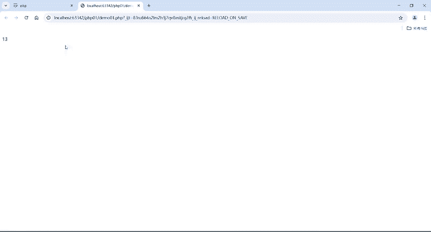

搞定啊好，这个是变量的赋值与使用。好，那再往下走，我们接下来再跟大家去讲一下这个PHP局部的一个作用语跟全局的一个作用语。那么在所有这个函数外部定义的变量啊，就用于就是全局的一个作用语。除了函数外。

那么全局变量呢可以被脚本中的任何部分去访问，什么意思呢？比如说我现在在这个地方给它来了一个X等于0，然后在PHP的里面啊。然后我在函数的一个外面去定义了这个变量，它就是属于全局。

但是如果说我在函数内部定义的变量，就是局部。好吧。好，那怎么去做啊？PHP函数内部声明变量是局部变量，那么它仅能在函数内部访问。那么在函数中访问全局变量的话呢，我们要使用这个关键字啊。

这里给大家贴了一串代码。那么具体代码的话呢，我们这里也有啊。好，我们回到这个笔记上面来。

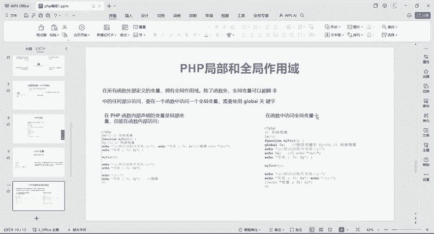

这是一个变量对吧？变量的原则都都会有啊，那么创建PH变量那我直接来个do什么什么什么就给它复制。那么变量呢在你第一次复制给它的时候就被创建的好吧，P它是一个弱类型语，所说直接就是然后等于就可以了。

就是不需要向PHP声明该编量的一个数字类型我们如果说学习C语言或者是加语言或者是什么C加加语言对吧？哎，它都要我们去定义哎这个是数字类型，哎，这个是字符串类型啊，那个是什么呃差类型啊，各种各样的东西。

那么这个地方是不需要去设置它的一个数类型的。如果说你给他这个阿拉伯数字，那你就直接不加双引号。那如果说你要给汉字的话呢。

你就给它加双引号或者单号就可以了也可以同样的去给它复制这个小数啊带小数点的5啊1033都行啊。😊，好，那么局部跟全局的话，那这里也有一个呃代码啊，那为了快速一点呢，我就直接把这个代码呢给它拷贝一下。

拷贝到哪去呢？拷贝到这个里头。

好，那我们来看一下啊。好，什么是全局变量？什么是局部变量啊，那么这个是我们的全局变量。那么在PHP里头啊，这个方块形开头呢，它是一个函数。那么函数它总共是包围的那么多。

我们在函数外面声明的这个变量是我们的全局变量，那接下来呢我们就直接可以在函数外部是不是这里是我没有报错啊，对不对？那么也就是说呃我们只要是全局变量，不管你是在哪个地方都可以去访问到我们这个全局变量。

那如果说你要在函数内部去访问我们这个全局变量呢，它就会报错啊，它就会报错。好，那么在函数内部去调用这个Y呢，是我们的局部变量，局部变量呢只适用于它这个函数内部。那如果说你在函数外部去使用了这个Y啊。

它就会报错。因为它访问不到啊，这个就是一个全局变量跟局部变量的一个区别。那么局部变量只申明在。😊，函数内部只适用于函数内部调用，那么全局变量可以在任何的地方去调用。但是呢函数里面如果说要调用的话呢。

不能直接写啊。那接下来就跟大家去讲一下。

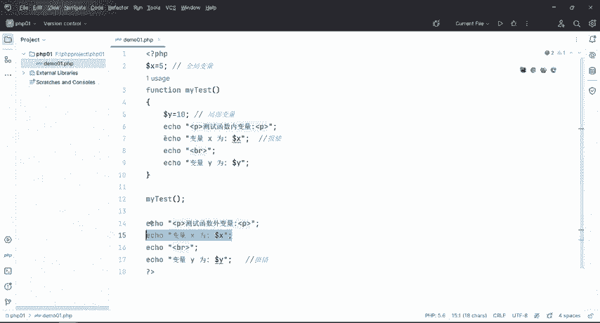

在函数中访问全局变量，那怎么去访问我们这在我们这个全局变量前面啊加上一个gbal啊就可以了。

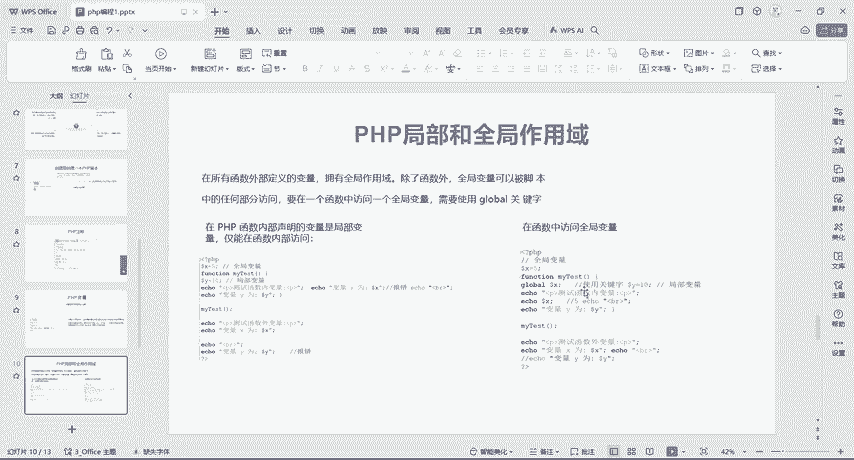

好，那么笔记上面呢也写了一下啊，那么同样的把它ctl C复制一下，然后回到这个地方啊，来对比一下，又1个PHP富阳给它取个名字，demo02。😊。

好，把它粘到这个里。好。这个地方。全局变量是不是这个？然后呢，我如果说要在函数内部使用这个X的话呢，我们在前面加上一个gb关键字。那么在这个地方加上关键字之后，在函数内部去访问这个全局变量。

它就没有报错了。好，然后这个地方是调用了啊，调用之后。这个是不是就是5啦啊，本来X等于5对吧？然后在函数的内部使用了一个gible关键字，那这个地方就可以去访问了。所以说这个呢就得到了是个5。好。

那我们运行一下，看一下结果。😊。

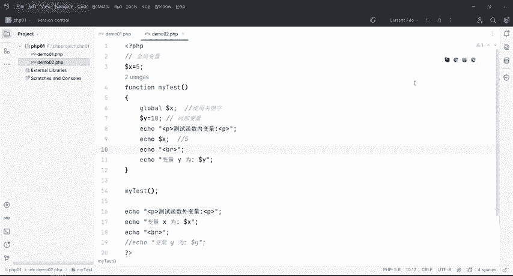

测试函数内变量是不是我？然后变量的Y呢是10啊，变量Y是在我们这个函数内部的Y等于10，所以说它打印出来是个10。好吧，然后接下来呢，这个呢是在函数外部的。那么刚才也说了，全局变量在函数外。

也是可以访问的对吧？在函数内如果要访问，加上一个gber，在函数外，不管是哪个地方都可以去访问。所以说这个X访问出来呢，还是我们这个5好，这个是全局跟局部变量的一个区别啊，这个gber关键字啊。

怎么去用的，也给大家去讲了一下O。😊。

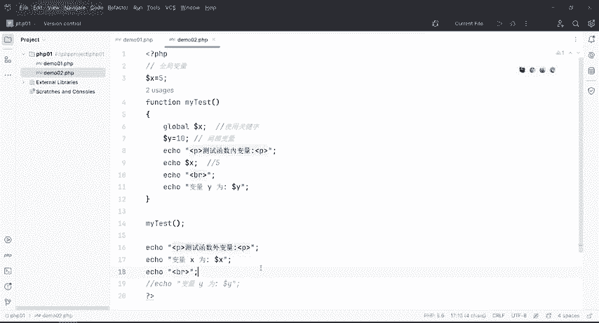

那接下来我们就讲一下这个stistic啊作用域。那么stistic作用域呢，它是当一个函数完成的时候，它所有的变量通常都会被删除。比如说我现在在这个呃代码里面，我默认给它设置为一，对吧？设置为一之后。

那我如果说要给它去再加一或者再加一，就是嗯给它调用一次，加个一，调用一次加一个一，对不对？但是如果说你不加这个tatic的话呢，它通常会变成0啊。那我们首先来看一下这个。

这个来跟大家去介绍一下tistic啊。如果说我不加上stistic跟加上stistic的一个区别是什么？de03。

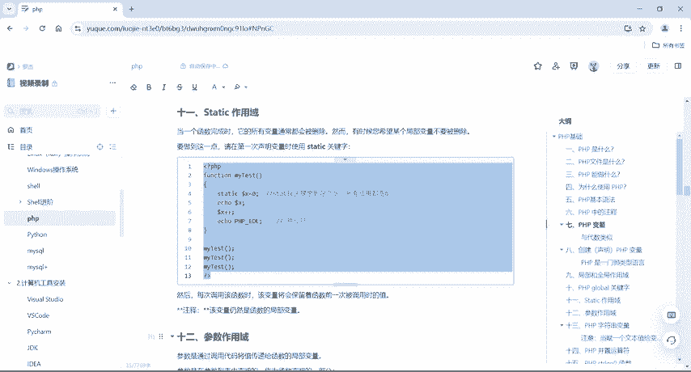

好，把它搞到这里来。我如果说在这个地方不加上s，对吧？那么不加上s之后啊，这个地方写了个函数。那也就是说我初始化的时候是0，然后在这个地方来一个X加加。那么X加加的话，它是每次调用之后，它就会加一啊。

我这边是调用了3次啊，调用了三次这个函数。😊。

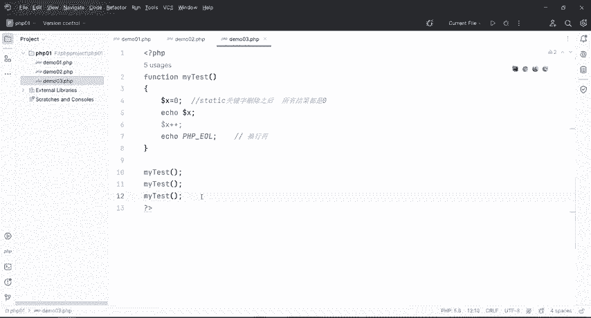

好，那么那我们接下来我们来看一下啊，调用三次的函数它是不是都是零啊，对不对啊？也就是说我在调用这个函数的时候，它这个加加它是没有给我生效的。也就是说我们把t关键字给它删除之后，那所有的结果都是0。

那如果说我要干什么呢？我要它调用一次，它加一调用一次加一，调用一次加一，那么也就是说我们是123，那我要它以123的一个形式给它显示出来。那我在这个地方给它加上一个t关键字。那么可以看得到啊。

这个工具还是蛮那个的。😊。

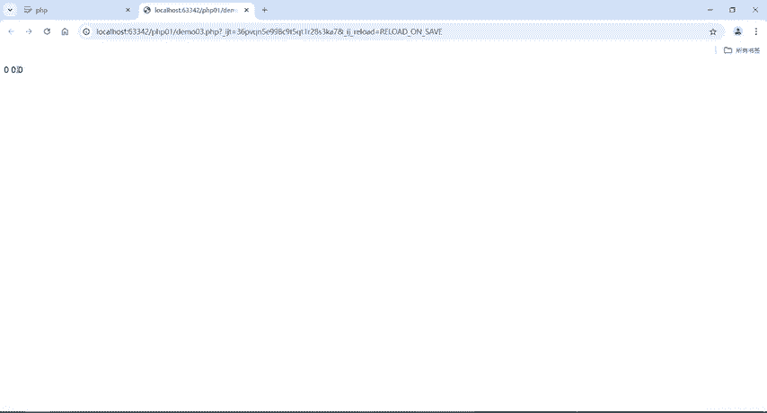

这X加加是不是变色了，对不对？好，变色之后，那我接下来再来运行，它是不是012，对不对？好，那么也就是说我们同样的通过这个tic关键字，它是什么样子的，默认情况下是零。

那如果说我要在里面循环一次加一个循环一次加一个或者是调用一次加一调用一次加一调用词加一，那我们就给它加上一个关键字，这个就是笔记上说的，如果说你希望某个局部变量不要删除。那么就直接加上我们这个t关键字。

这个就是tic作用域的一个用法。😊。

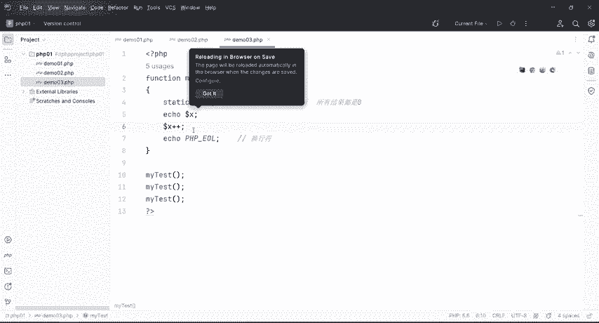

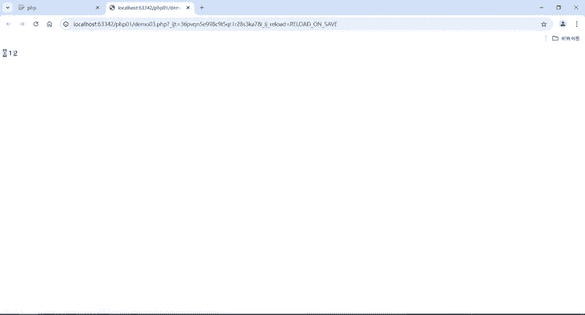

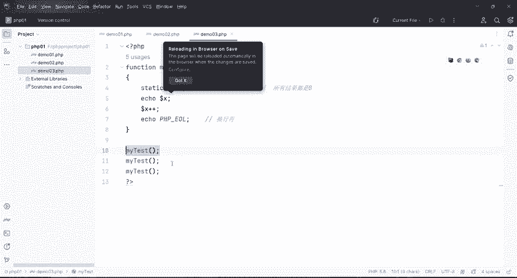

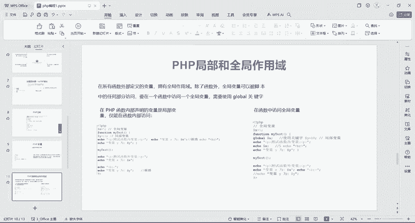

好，那每次调用函数时道，该变量呢都会保留着函数前一次被调用的值，那么默认的值是0，对吧？然后呢，我们再来调用一次，它加上了一个一，再来调用一次，再加上一个一，那是不是012啊，对吧？

那么我们这个函数就有作用的啊，好，这个注释该变量呢仍然是函数的一个局部边量啊，这个是一定要注意的。好，这个就是tistic关键字。😊。

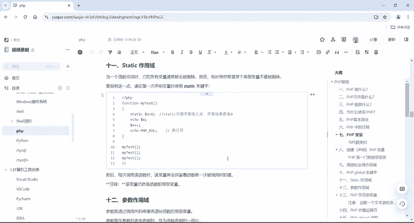