# B站首推！建议所有想参加CTF夺旗赛的同学，死磕这条视频，2024年字节大佬花一周时间整理的CTF入门保姆级教程！从入门到入狱（web渗透／PHP基／SQL注） - P4：4、php运算符 - CTF入门教学 - BV1JjeJeYE2p

好，那我们再来看一下它的一个参数的一个作用域啊，参数呢它是通过代码将值传递给函数的局部变量。那么参数怎么在这个列表中声明作为函数声明的一个部分，比如说我在这个地方声明了一个myt。

然后这里给它加上了一个参数，我们把它给它输出出来。当我们在调用这个myt的时候，就必须要给它传一个参数。好，那么具体的怎么去做啊，然后回到这个地方我们把它搞定搞搞完之后呢，那我们接下来myt。

然后在这个地方给它来一个参数。我们这个地方就是把这个X给它输出来。那么我们当调用这个myt的时候，我在这个参数后面啊在这个括号里面写什么参数，它就会打印什么参数。这个是呃有参跟无参。刚在前面的话呢。

括号里面是没有参数的，这个呢是有参的，所以这个是一个有参的一个函数。😊。

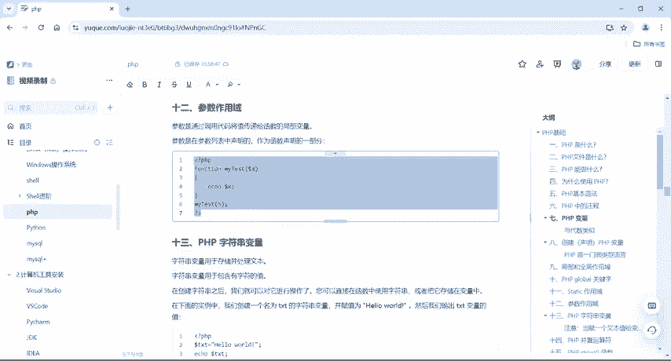

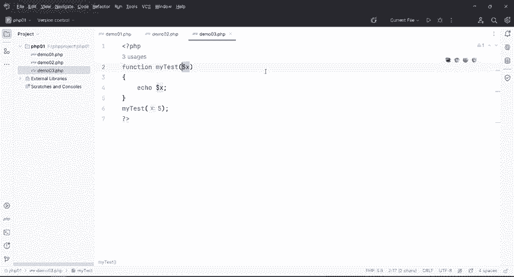

那么具体的我们来运行一下是不是我好，那也就是说我们在这个函数括号里面，不管你是写什么，写五也好，写你好也好，对吧？嗯，写哈哈哈也好都行啊，取决于你这个括号里面给的值是什么。

所以说它打印出来这个值就是什么。好，这个就是我们的这个好，来看一下啊。😊。

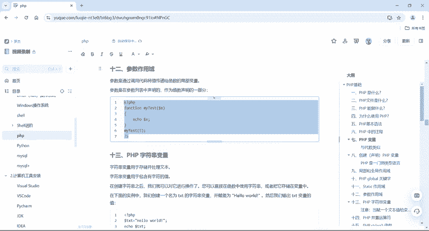

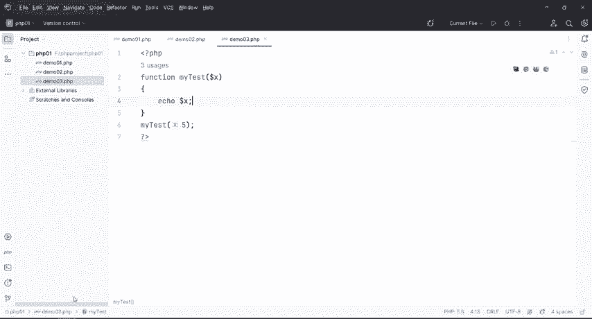

参数的一个作用域啊参数的作用域。好，那么接下来还有我们这个PHP的字符串常量。那么字符串呢，它是用来存储并处理文本的。那么也就是说刚才我们在第一个这个PHP程序的时候，我们就给它来了一个hello。

对吧？或者是嗯来了个你好，那么这个你好或者hello都是加上引号的。那么也就是说我们只要是加上引号的。不管你是单引号还是双引号，它都是属于我们的一个字符串的一个变量。好，那么这里也给大家来了一个例子啊。

来了个例子。好好，这边声明了一个text等于hello word这个hello word呢加上了一个双引号，然后ecle一下这个TXT。好，那我们运运行一下hello word出来的啊。

这个就是我们的一个字符串的一个变量。😊。

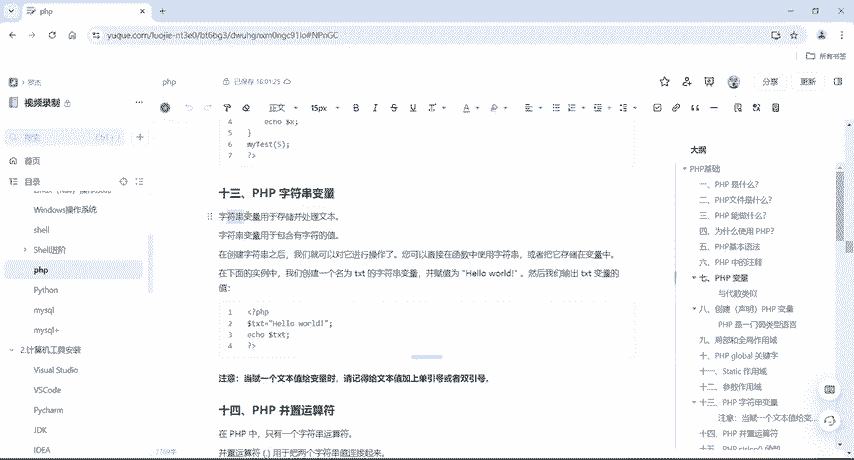

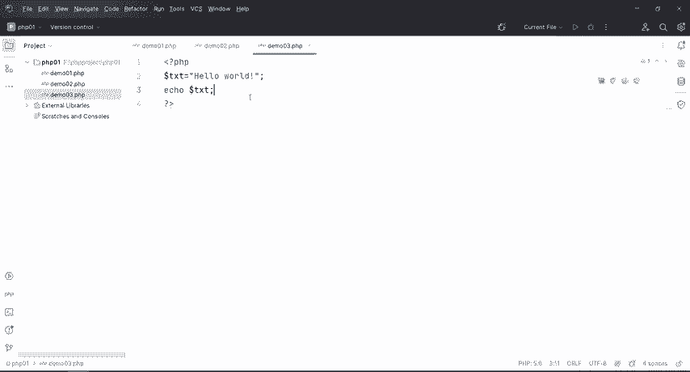

好。

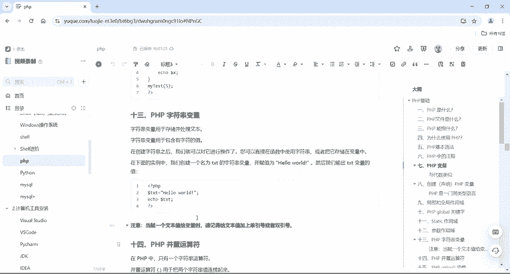

好，下一个呢就是我们PHP的一个并制运算符啊。并制运算符它是什么意思呢？我们如果说啊要把这个字符串与字符串之间连接起来的话，就需要使用到这个并制运算符。那么这个在其他语言当中呢。

如果说我要把前面一个值跟后面一个值给它连接起来，我们用加号键啊，就是字符串跟字符串怎么去拼接，我们用加号键。但是在PHP里面的话呢就不一样啊，它是用什么呢？用这个点啊。

PHP里面的点用来把这个两个字符串的值给它连起来啊，那么这个案例就是给大家演示了一下啊，那么具体的我们笔记上也有啊。好，我们把这个给然后回到我们这个HP然好。

那么取个名字tex一等于hel然后tex2等于word啊n day对不对？好，然后呢我们一下TXT1，然后给它来个点再加上。😊。

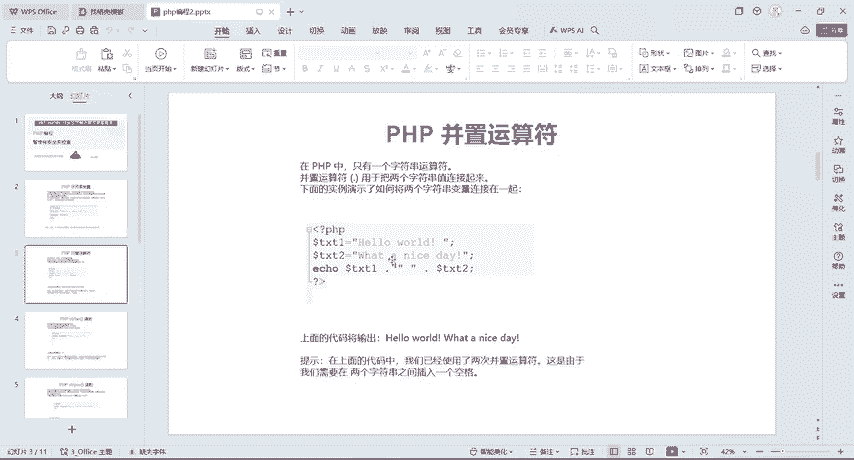

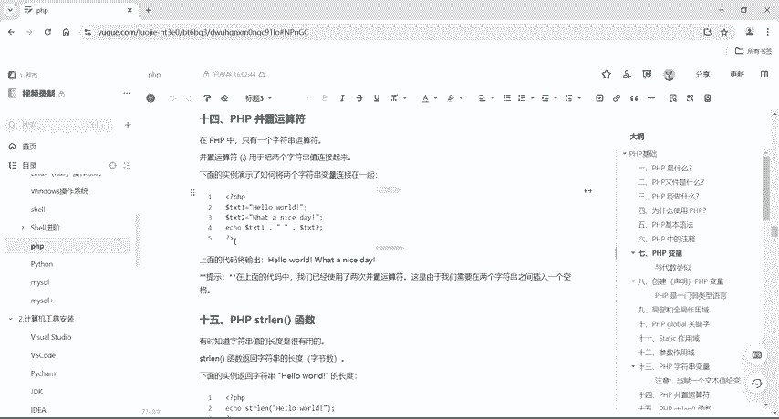

个空格，对不对？再点那么这个点呢就是我们的那个并制运算符，它会把我们第一句话跟第二句话给它连到一起啊，那我们ctlS保存一下，我们来运行啊是吧？hello哎，连接what a next day。

也就是说我们如果说要来连接两个字符串的话呢，我们就使用这个并制运算符。好。😊。

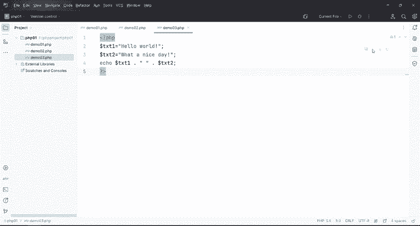

那下一个呢就是我们这个PHP的str lens这个函数。那么这个函数是用来干嘛呢？比如说有的时候啊要知道字符串的长度啊是很有用的那怎么来获得字符串的长度，我们就用到这个函数。好。

那我们来看一下这个PPT啊，PPT上面也有啊，都准备好了的。😊。

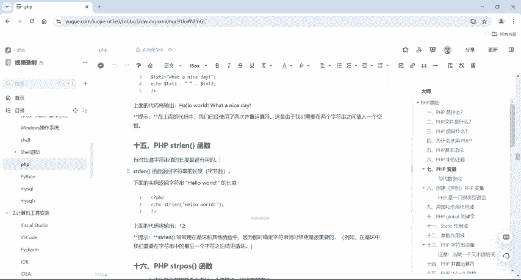

好，那么这个案例啊就给大家呈现出来。我们这个hello word啊具体有多长。那么这个代码呢是输出了12啊，那这个1二是怎么来的？我们同样的把这一串。

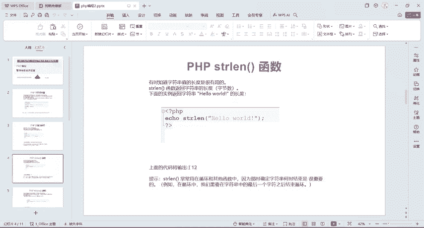

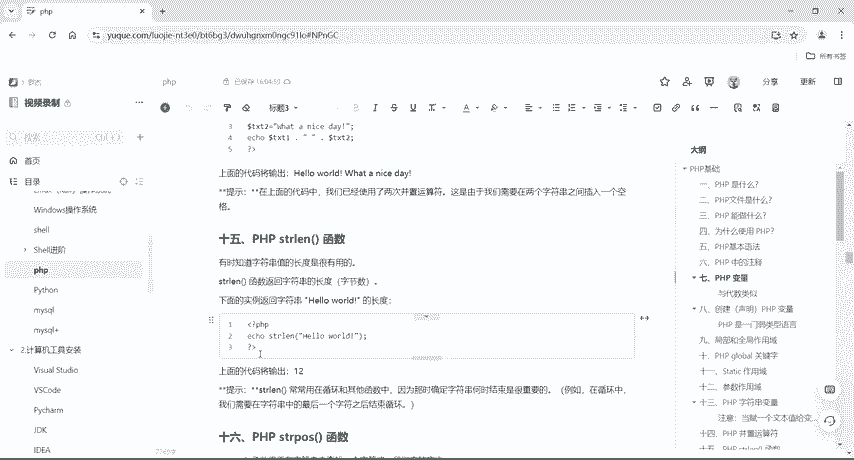

给他卡出S。感成C对吧？哎，卡兆币。保存。保存一下啊，它出来是12，那么这个12是怎么来的啊？我们怎么数123456789101以12。对吧这个中间的空格啊，它也算一个，所以说它出来的值是12。好。

这个就是靠这个t函数，直到我们这个字符上的一个值啊长度。

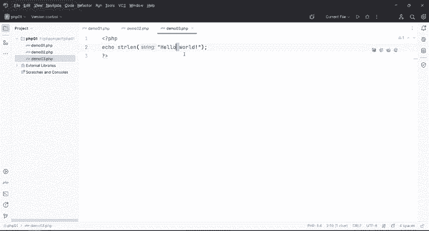

好的，这个提示它常常用在循环和其他函数当中。那么因为那是确定字符串何时结束是很重要的。比如说在循环当中，我们要在字符串中最后一个字符之后结束循环。好，这个循环呢我们还没有讲啊。

所以说这个还是提前跟大家去说一下，我怎么去获得字符串的函数的。好，那下面一个呢就是这个函数啊，叫sreport。那这个是用来查找一个字符或者一段指定的文本。如果在字符串当中找到匹配。

该函数会返回第一个匹配的字符位置。如果没有找到匹配的话，你就返回fors。那么这个啊我们来看一下这串代码呢。

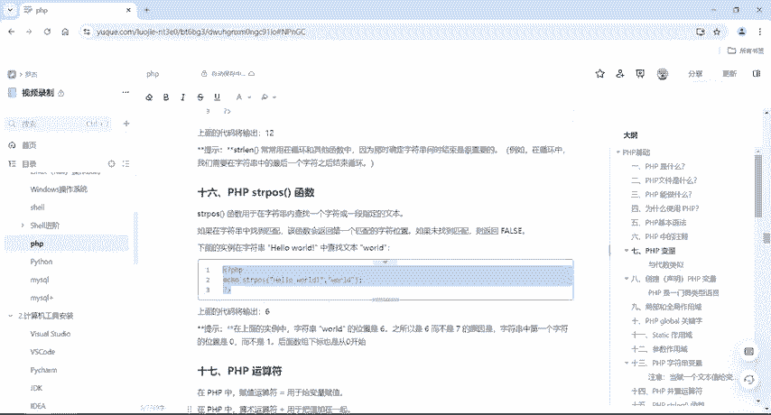

就是在hello word里面找到我们这个word，它返回给我们的值是它的一个位置啊，它的位置在哪里啊？1234567对吧？1236567，那我们运行一下，看一下它是返回一个6，对不对？返回一个6。

但是呢刚才也说了，我们在哪个里头啊。

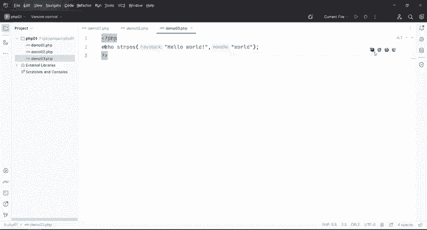

拿去了啊。它返回了是我们这个7，对不对？啊，我们回到这个地方啊，这里面有笔记啊。它它返回是个6，对不对？好，但是呢我们刚才在代码里面去数123456，对不对？然后呢，这应该是第七个好。

那笔记上呢也给它做了个解释啊，这字符串word的位置是6。那之所以是6，而不是7的原因是因为我们字符串当中第一个字符的位置是0而不是一啊。

那么后面数组下标呢也是从零开始那也就是说我们在这个str函数里面去查找的话，它怎么去找的呢？它是把第一个H的一个下标设置为0，所以说它返回的是6啊0123456，所以说它这个结果是6啊。

这个有一点不一样啊，就跟我们正常去数数的话呢，它是一个是从零开始，一个是从一开始。那我数个数的时候是从一开始，但是。😊。

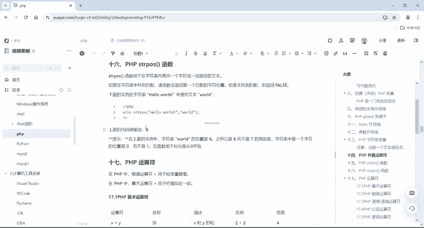

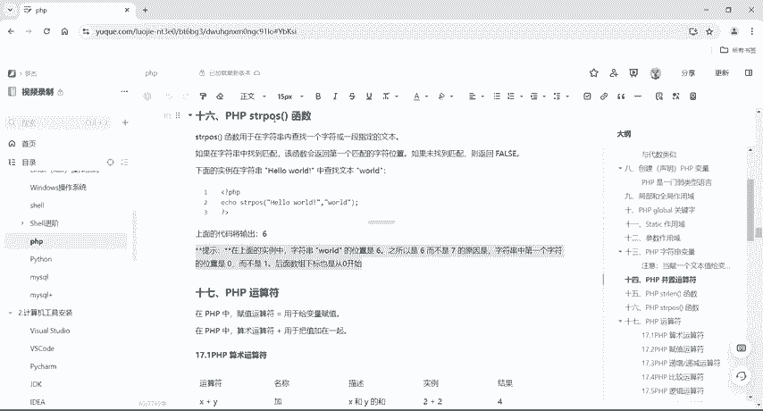

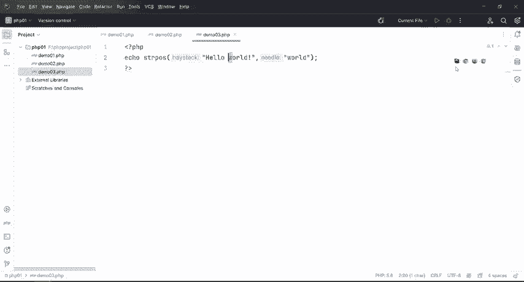

如果说我要去查找字符串中匹配的字符位置的话呢，它是从零开始去数的，所以它结果是6啊，这个是stream po函数。好，那下一个就来跟大家去说一下PHP的一个运算符啊。

运算符其实呢刚才在前面啊跟大家也说了一下我们这个复值运算符，它其实就是一个等于啊。那么等于就是用来给变量负值的，比如说我申明那个变量，然后等于5，那么就把5负值给这个变量。那P9P当中呢。

算术运算符加号是用于把值加在一起的，这个加号跟前面刚才那个点啊，用法不一样，这个加呢就一加一等于2啊，是这个是起这个作用的，所以它叫算术运算符。那么这个地方给大家有一个表啊，一个表X加Y啊。

就加X减Y就加减乘除对吧？加减乘除，那么关键一点比我们正常的情况下多了一个模啊，多了一个模多了个百分号，那么这个百分号呢就是除法的一个余数，好，写个写个案例啊，比如说我现在在十除以二的时候是不是5啊。

然后呢这个地方余数是0，对不对？但是我如果说我再来一个我给大写一个1除以3啊，我上一个39对不对？那么余数是一，所以说呢我们用1百分号3。😊，那么它的结果就是余数余到这个一啊，这个是模啊。

这是X除以Y的余数，这边也一个比方啊，5摩以2，它的余数是一十摩以8为2，对吧？然后再玩啊，然后十摩以21摩以2的话是不是上一个5，然后它余数是零呢？好，然后加上一个减号，对吧？就是负数。然后呢。

一个波浪线就是我们取返A点B呢就是我们的并制啊，就用到前面的并制运算符就是用来连接两个字符上然后点那么它打印出来就是好，这个是它的算术运算符啊，这个地方也有很多很多案例啊，具体的呢笔记上都会有啊。

具体的资料呢，我们可以联系一下我啊或者是我们直接在评论区啊一键三连啊，就可以去领取资料了啊，到时候我们会把这个所有的PPT所有的这个语雀这个笔记，还有我们这个各转告的工具啊都会去给到大家好。

那么这个地方一个注意点啊，PHP7以上的版本呢，它新增的个运算符好。那么这个运算符大家也。😊，可以去用一下，这是VR当啊invald。或者inin的DIV啊13，那么这个是向下取证啊，向下取证。

这个你们也可以去看一看，查一瞧都行。好，那接下来算术运算符结束之后，那我们就来搞一下这个复值运算符啊。虽然说刚才都说过了啊，都说过了，对吧？好，那么复制运算符它其实就是一个等于号。

那X等于Y等同于X等于Y。😊，啊，左操作数被设置为右侧表达式的值。那么也就是说我们把右侧的值给它复值给左边一模一样的啊。好，然后X加等于Y以后可以看到很多很多的啊，X加等于Y呢。

它其实就是X等于X加Y最后得到的值是X的，比如说X等于一Y等于2，对吧？然后X加等于Y，那么X最终的值就是一加二等于3啊，然后X减Y同理啊，X乘Y除Y摩一Y都行。然后A点等于B啊。

那就相当于A等于A点B也是用来连接两个字符这个表格里面啊都给大家说明了啊，这个值我们的个复值于算同样的也给大家提供了很多很多案例啊，这个地方我就不去演示了。好吧？很简单的东西啊，好。

这个地方也有啊A点word，那么输出hello word对不对？A是hello，然后呢B。😊，是A点word。那么我们ecle一下B，输出hello word。好。

然后这个地方X啊X点word一模一样的啊，同样的道理。好，那么下一个就是PHP的一个递增递减运算符啊。这个我要跟大家去好好的讲一下，比如说加加XX加加减减XX减减啊，一个是预递增，一个是后递增。

一个是预递减一个是后递减，那么具体的情况，我们把这个案例给它扣下来住C回到这个地方V好，默认情况下，我X等于10对吧？ echo一下加加X，那么它输出的是11。为什么好，记好了一个呃一个这个口令啊。

就是加加在减是先进行加减乘除，然后再输出。那如果说是加加在后或者减减在后的话呢，是先输出原来的值，然后再加上一啊，加加减减但是每次加一或者每次减一啊，那么同样的同理啊，5，然后减减Z那是先减一。

然后输出值之后，对吧？然后再。😊。

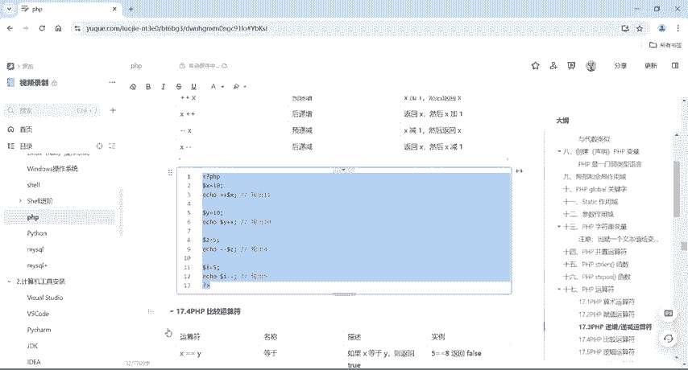

再去。后面的一些输出，那么A等于我输出一个I减减的话，它输出它就是我保留原来的值。然后如果说啊我在这个地方。这个加加在前啊是先加一，然后再输出，对吧？然后这个呢为什么是1，那么先输出十0，然后再去加一。

那么直到什么呢？直到这个地方，我再来一个do了Y的话。😊，那么它这个值它就是11了啊，这个同样的啊，然后在这个地方e一下do了。😊，I那么这个I呢。这变成几了，变成四了。好。

这个是加加跟减减的一个区别啊。佳加减减在后。是先取它原来的值再进行加减。那么加加减减在前。就是先加一或者减一，然后再输出它的值。好，这个具体的比记上都有啊。好，那下一个就是我们PHP的一个比较运算符。

那么比较的话，那也就是说相当于比较我是不是等于你你是不是小于我，对吧？你是不是大于我，或者小于等于大于等于啊，这个地方也给大家提供了一个表格啊，好PHP当中呢多了一个东西啊。

比如说X等等于Y就是等于那么如果是三个等于的话，是绝对等于加上一个感叹号等于它是不等于啊，不等于也可以是这么去写啊，但是基本上呢我们一般都是这么去写的X非等于Y啊。

就是感叹号等于Y就是不等于然后还有就是不等等于对吧？这个是不绝对等于啊，所以说一般用的最多的呢，就是X等于YX等等于Y对吧？X不等于Y这么去用的啊，然后还有大于小于大于等于小于等于啊这些东西呢？😊。

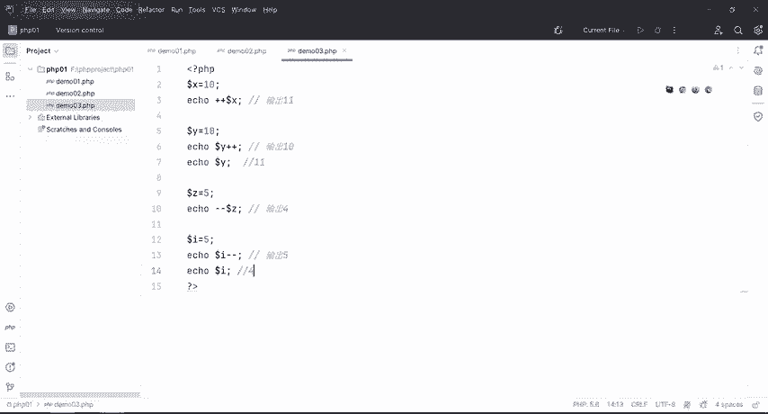

其实我们在嗯数学当中啊都见过，对不对啊，同样的这里也很多很多案例啊，大家自己去看一下就行了。好吧啊，问题不大啊，问题不大。好，还有下一个就是我们的逻辑un算符啊，逻辑算符呢就是涉及到我们这个英文的啊。

一个是and，一个是o啊and是与。😊，好，如果X和Y都为Q，它则返回结果是Q，看一个实例，X等于6Y等于3X小于10吗？是不是小于的andY大于一吗？是不是那它是Q，它也是Q。

所以说它的结果是Q好XOY则或者如果X和Y至少有一个为 two的话，那么结果就返回Q好，X等于6Y等于3好，X等于6，那Y等于5吗？不是好，X等于六是正常的，对不对？是正确的，所以说它的结果也是Q啊。

好X。😊，异或对吧？异火的话，如果X和Y有，且仅有一个维穷。再反过球啊，只要有一个位住。对反未出。但是如果说异惑，那X6。然后呢，外头3。啊，只要有仅有一个，但这个两个都是。wo吧，对不对？

所以它结果返回是forse啊，这个还是有点难以理解的啊。😊，好，那么这个两个这个语号呢是X和Y都为错则返回错，对吧？然后然后这个也是或啊，and和这个是一样的，或呢这个or和这个是一样的。

然后这个非是感叹号。那么如果说它不为错则返回to。那也就是说真就是假假就是真啊，X等于6Y等于3。😊，是吧。X等等于Y。不相等吧，对不对？6肯定不等于3。但是我如果说给它加上一个感叹号的话呢。

它返回结果就是出了。好，这个是我们的逻辑运算符好，运算符牵扯到很多啊，一个是算数，一个是负值，还有递增递点，还有我们比较，还有我们这个逻辑啊，当然下面还有我们这个数组运算符啊。那么数组运算符。

一会儿跟大家再去讲。😊。

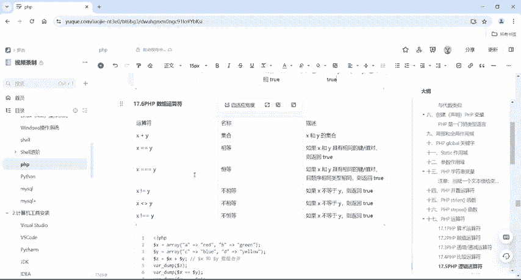