# B站首推！建议所有想参加CTF夺旗赛的同学，死磕这条视频，2024年字节大佬花一周时间整理的CTF入门保姆级教程！从入门到入狱（web渗透／PHP基／SQL注） - P5：5、运算符的优先级 - CTF入门教学 - BV1JjeJeYE2p

好，接下来我跟大家讲一下这个数组运算符。那么数组运算符呢，我们也来看一下啊，这上面写了一个X加Y那X加Y在数组里面，它是简称为集合啊。这个数组我们后面还会跟大家去详细的去讲一下。😊，那X和Y的一个集合。

那X等等于Y就是代表他们两个相等啊，就是具有相同的嗯，就是间值对啊，就相同的一个间值对则返回Q。那么如果是三个等于话呢，这是一个恒等就是如果X和Y具有相同的间值对且顺序相同，类型相同。

则返回Q这个数组里面啊，它嗯如果要判断的话，满足的条件啊，还是比较重要的。那么不就是不相等的话，就是一个非等于。然后还可以写一个小于大于啊，这也是不等于。那么还有感叹号两个等于号的话，它是不恒等啊。

这是数组里面的一算符这个呢在PHP当中呢，用到的地方，而在我们晚安这个地方呢。😊。

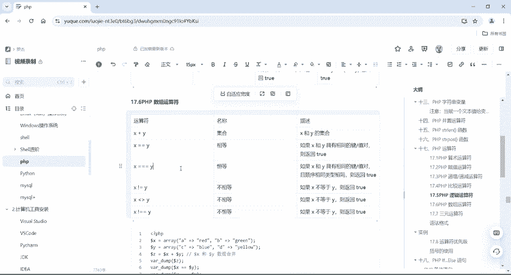

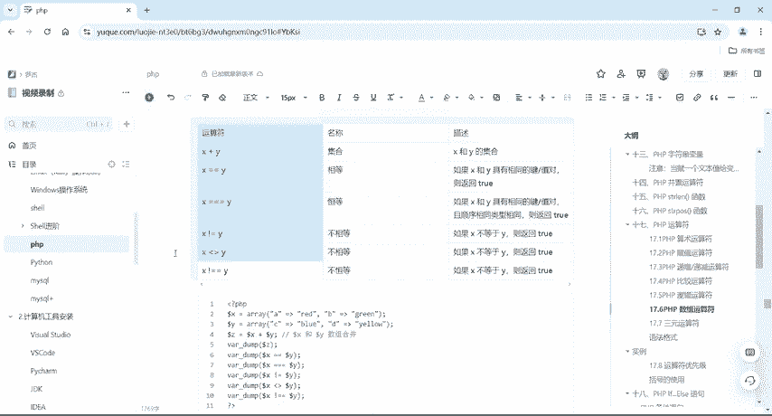

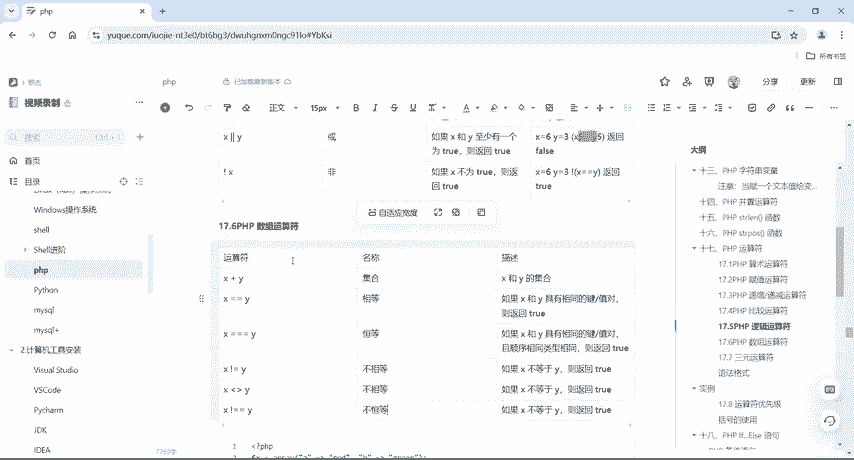

嗯，用到的这个数组云算符的呃机会啊很小啊，所以说我们了解一下就可以了啊。具体的这样这个地方也给大家。

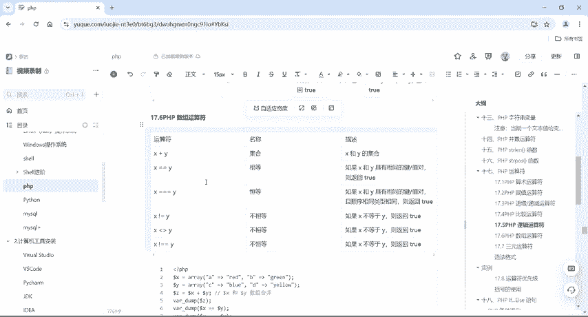

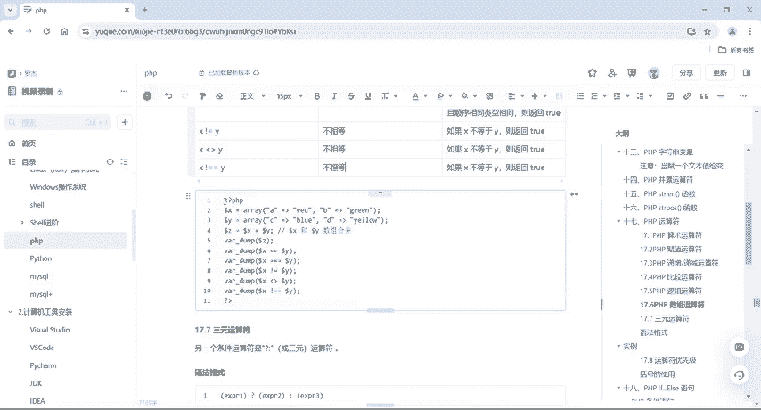

写了一些代码啊，大家到时候拿到我们这个笔记之后啊，自己去运行一下就知道了。好，那接下来还有一个3元运算符。那么3元运算符呢，我们在每个程序啊，每个语言里面都有。那么这个条它也是我们的一个条件运算符啊。

😊。

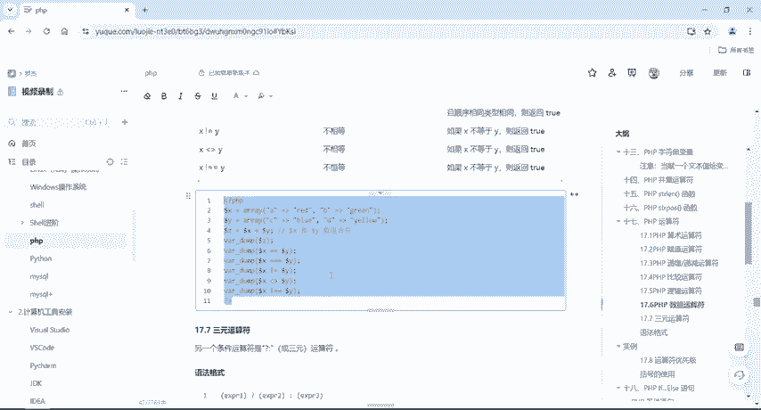

那么它的一个语法格式，哎，这个第一个然后中间一个问号，然后第二个然后冒号第三个。那么对于这个第一个括号里面求的值，它如果是Q的话呢，它的值是第二个值。如果是for的时候呢，就取值是第三个。

那我们看一下这个案例啊，呃，打个比方，这里有个PHP dollarus name11大于10吗？对吧？他问你1一大于10吗？这是一个。

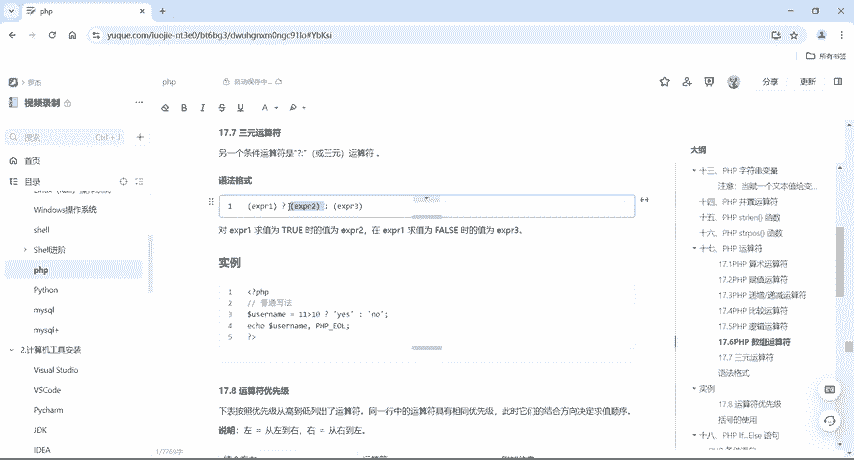

判断语句对吧？那如果说这个判断语句，它返回的结果是Q的话呢，它的结果，它就yes，否则就是no。那么十1是大于1的，所以说我们这个username打印输出出来是yes。好，这个是我们的3元运算符。好。

那运算符讲完了之后呢，那我们来看一下这个运算符的一个优先级。那么这个优先级啊，我们在数学数学的时候，那么如果说有括号呢是先算括号里面的对吧？然后呢再算加减乘除，然后再去算这个嗯其他的一些东西啊。

括号里面先算算完之后对吧？乘法除法，然后再算算完之后，后面再去搞这个加加减乘除，对吧？加加法减法，对不对？好，那么说明啊左边是从左到右右边呢是从右到左啊，它的一个结合方向啊，这边有具体一个表格。

其实就跟我们。

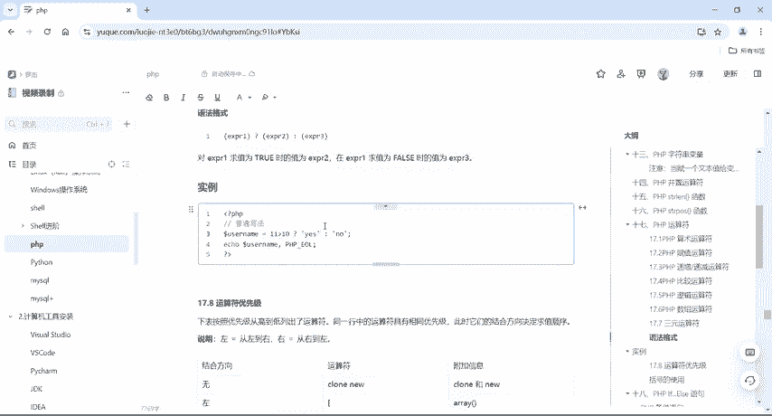

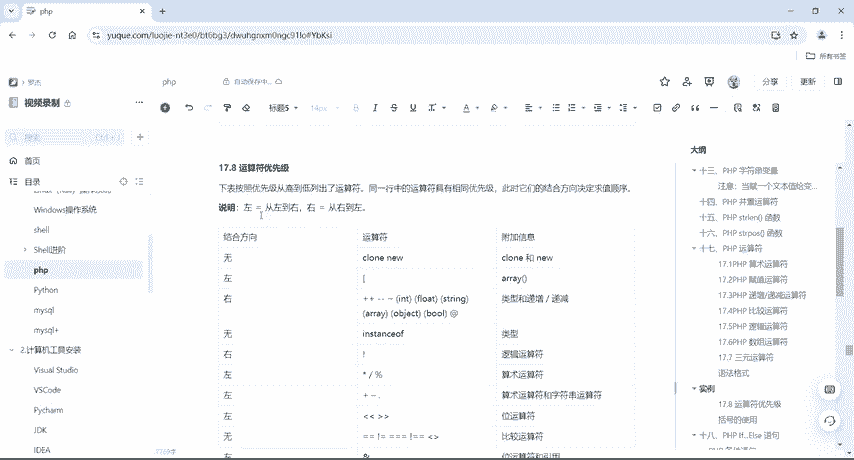

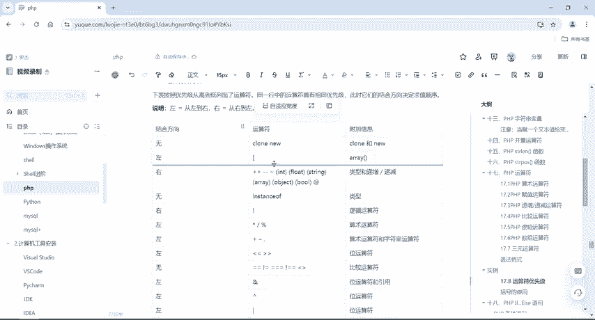

在数学当中的这个计算方式是一样的啊，有乘除就像先算乘除对吧？再去算加减啊，如果是有小括号或者是干嘛干嘛，先算括号里面的，然后再乘除，然后再加减啊，然后还有什么与或非呀，对吧啊？

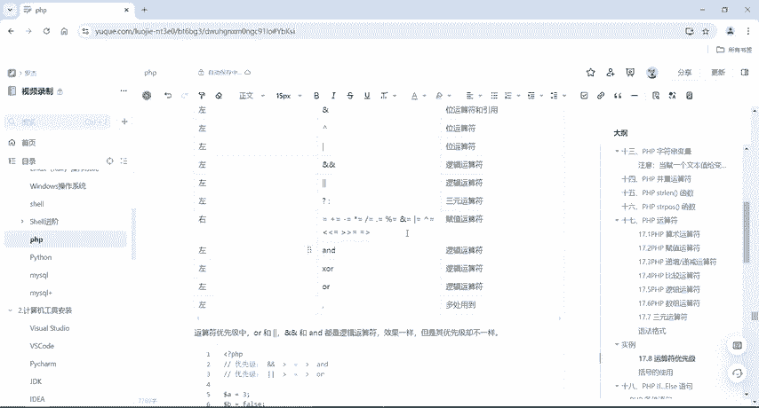

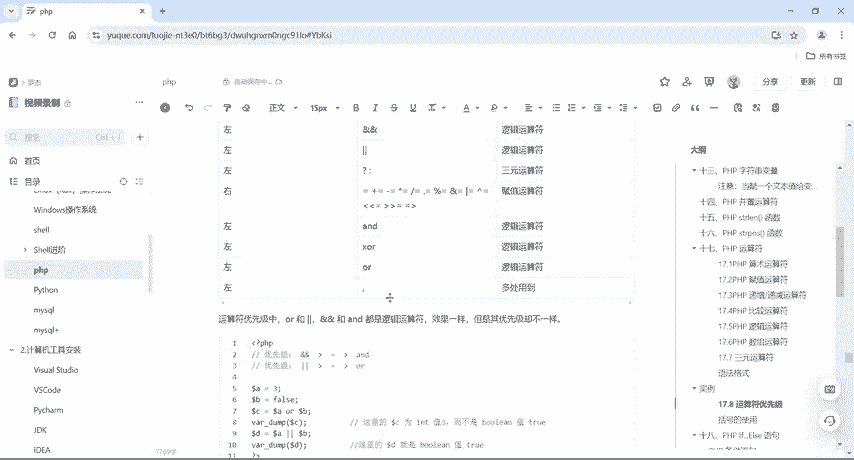

它的各种各样的优先级啊，它的效果是不一样的。那么这个or和或者对吧？and和and它的都是属于我们的逻辑运算符，它的效果一样。但是呢优先级不一样啊。比如这个地方A等于3啊B等于负AB吧？

那么打印出出个C，那么这个C呢是int值的一个3而不是布尔类型的，所以说int类型跟布尔类型类型的优先级比较高对吧？那如果说这个A或者B的话呢，这边的D啊，它的布尔值为 true啊。

所以它的这个运算符优先级啊，它哪个比哪个优先级高，哪个优先级低啊，大家都要知道的好，然后刚才还提到这个括号对不对？有括号的是先算括号里面的，然后再去算乘除啊，这个就是跟我们数学运算里面是一模一样的啊。

好嗯这个就是我们的PHP运算符，然后以及它里面的一些算术运算符啦。😊。

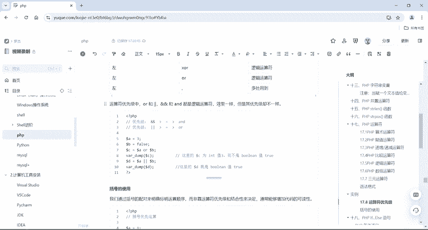

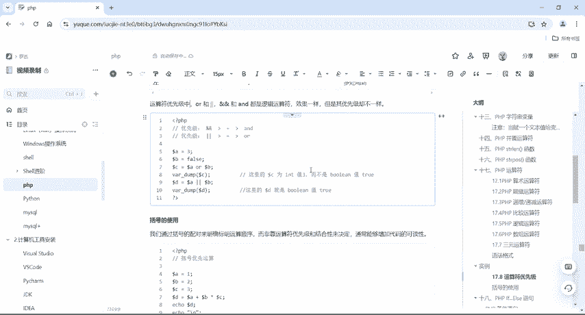

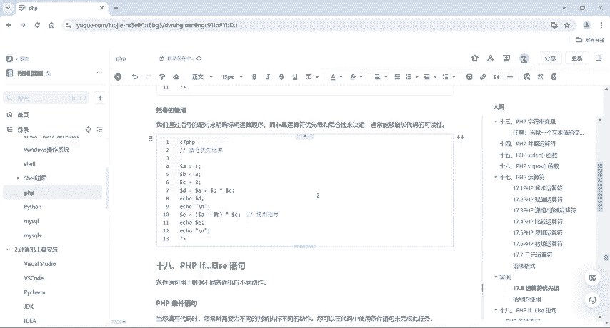

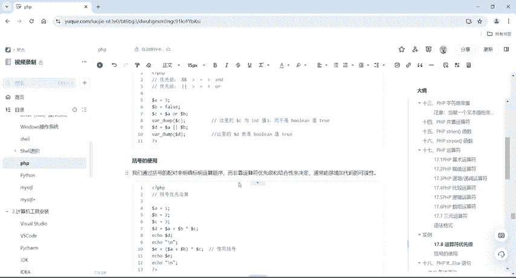

对吧复制运算符啊比较啊逻辑啦，还有数组，还有我们这个三元啊，还有其次就是我们的一个呃运算符的优先级，知道哪个高哪个低就可以了。😊。

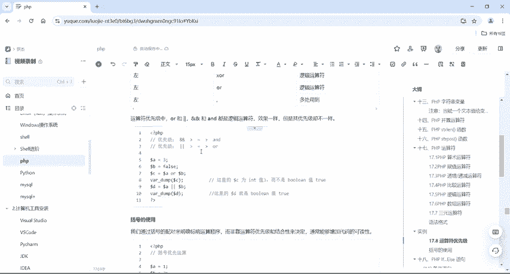

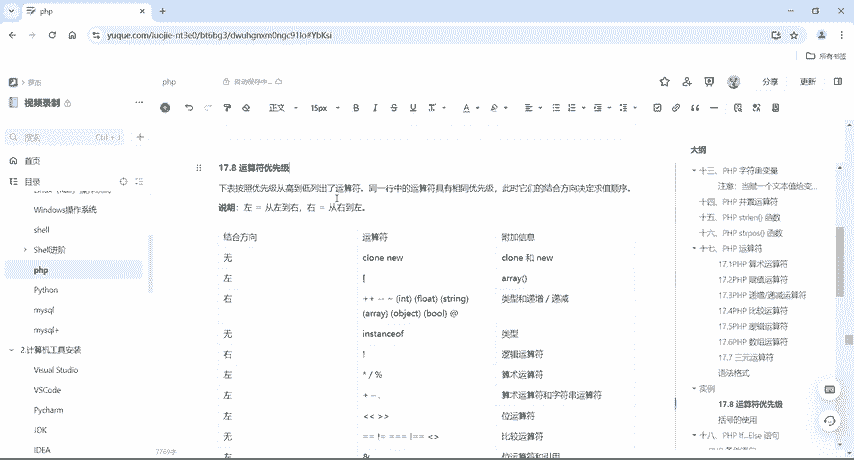