# B站首推！建议所有想参加CTF夺旗赛的同学，死磕这条视频，2024年字节大佬花一周时间整理的CTF入门保姆级教程！从入门到入狱（web渗透／PHP基／SQL注） - P6：6、php条件语句子 - CTF入门教学 - BV1JjeJeYE2p

好，嗯下一个呢就是我们这个PHP里面的条件语句了啊。那条件语句它是用来根据不同的条件执行不同的动作。那我们PHP这个呃条件语句啊里面分if，还有 else啊，这些语句PHP条件语句总共有单独的if。

然后呢，if else，然后还有if else if else，最后一个就是我们的一个switch啊，那么具体的这个条件语句是怎么去使用的那首先还是根据第一个if语句来跟大家去讲解一下。

那么我们PHP里面的if语句呢，用于仅当指定条件成立的时候执行这个代码。那么它具体的语法。就是这样子的if，然后小括号小括号里面是写条件，然后大括号里面呢就是写条件成立时要执行的一个代码。😊，好。

同样的在这个地方也给大家提供了一个代码。如果当前的时间小于20，那么下面的这个实例呢就会输出哎，have a good day啊。这个是我们如果满足条件的情况下，就会输出这句话，那么怎么办呢？

首先先定义一个。变量对吧？我们拿到现在的这个时间。好，现在呢是我们这个。如果是小于20对吧？20是晚上的8点，对不对？现在是下午，是不是？好，那如果说小于晚上8点的话，我就打印输出这句话。好。

那么还再拿到这个分啊，如果这个分小于多少多少的，对不对啊，我再来根据这个案例判断。是否说出这句话好。那这个里面啊是拿到它的小时，这个里面是拿到它的分钟啊，小时是大写的H分钟是小写的I。那也就是说。

如果说我这个if后面小括号里面的条件满足的情况下就打印输出这句话。好，OK。那么同样的啊，我们稍微来写一下这个案例吧。

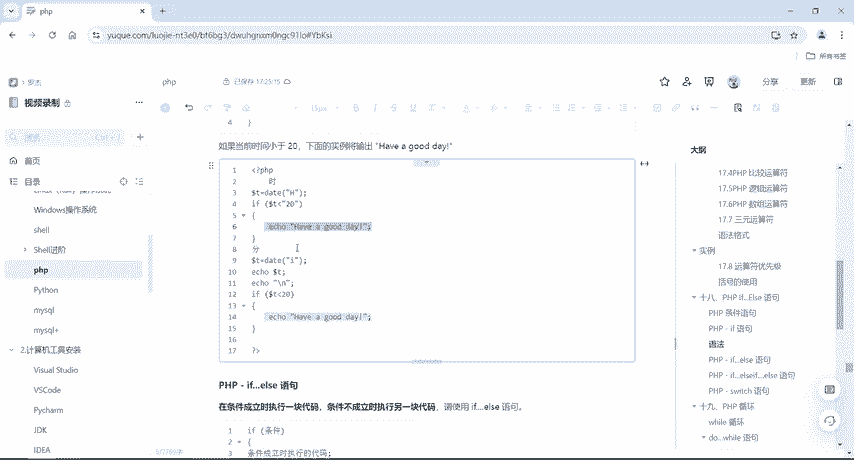

好，右键你有1个PHPfi，我们取个名字啊。达04吧好，在PHP里面啊，那我们也不去写这个。😊，嗯，这个小时啊或者分钟呢那我们首先就先定一个吧，多了A好吧，多了A等于20。

然后我们在这个里面写个if符条件，然后大括号给它括起来。如果说我这个A大于多少多少，哎，我就输出好，多了A，然后大于嗯1吧。好，然后在这个里面ac一下。好，该。数字。是大于。是的啊就可以了啊。

这个是满足他的条件，我就说出这句话好，运行一下。

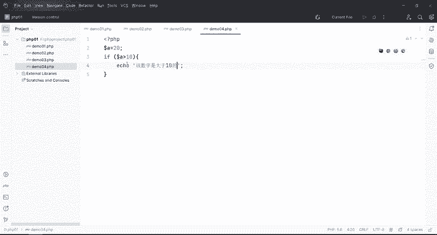

是不是有啊，该数字是大于十的啊，这个就是if语句啊if否语句。好，那接下来就是一个if else语句。那当条件成立的时候执行一块代码，条件不成立的时候执行另一块代码。所以说用if else语句。好。

那也就是说在上面if语句，后面加上了一个 else加在这个后面啊，具体怎么加？好，那么刚才是不是写了个if条件满足的情况下，我就打印这个。如果说条件不满足的情况下，我们就打印输出 else里面的对吧？

好，该数字。😊。

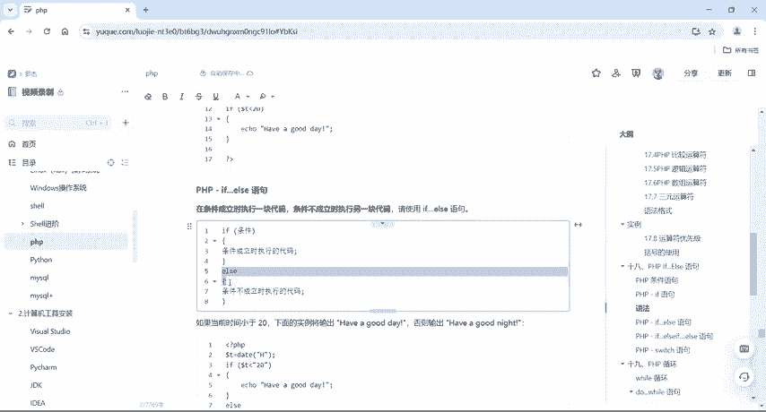

不。不是对吧，大于1的。对不对？好，那么同样的啊封号结尾。好，那我现在干嘛呢？我现在。😊，改一下啊改一下。我在这个地方改成十，好吧，好，他判断这个十是否大于10呢，十肯定是不大于十0的对吧？

所以说呢它会回到这个else语句里面来。好，同样的运行一下，该数字不是大于十0的对吧？好，这个就是if else语句，当条件成立的时候执行if里面的语句，如果说条件不成立，执行else里面的语句。

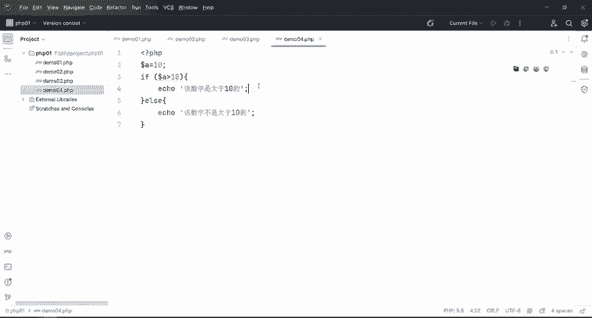

好，那这里面也给大家提供了一些案例啊，同样的啊跟我讲的是差不多的，是一样的啊。好，那么除了if if else之外，我们还可以有啊，就是在若干条件之一乘立时的执行一个大模块什么意思啊？

如果说你第一个简直不成立，它进入到第二个判断语句。那么第二个判断语句如果说不满条件还会进入L。好，那么它这个语法啊，if然后 else if，然后 else。😊，也就是说有很多很多条件。

我如果第一个条件不满足好，回到第二个Lif条件。好，第二个不满足，再回到A里面去。这个L if呢可以写很多很多，好吧，好，那我们这个地方呢，我们就嗯还是一样的啊，回到这里来。好，嗯。

我判断if a大于10吗？不大于是不是？好，在这个地方L if我给他写个条件，if多了A嗯，大于20吗？对不对。😊。

然后再来L。艾考一下。好，该数字。是十对不对？好，那也就是说我有多种条件啊，如果看一下A大于10。不大于10对吧？这肯定不满足，然后L if大于20吗，哎，也不大于20，对不对？哎，不是大于20的。好。

然后呢，它最终结果是会回到这个L的。但如果说啊我在这个L if这边，我给它来一个什么呢？给它写一个大于2。好，那么大于二之后啊，他首先第一步先判断if语句，这个大于10吗？

不大于然后再来判断这个大于2吗？嗯。😊，大于二的对吧？哎，把这个东西随便啊随便写一下。那也就是说我看这个条件不满足，我就会回到第二个条件里面。第二个条件满足的话，我就会打印第二个条件里面语句。

如果说这两个条件或者多个条件都不满足的情况下，我就是会直接执行L里面语句。好，OK该数字是大于二的那就证明我们是第二个L。😊。

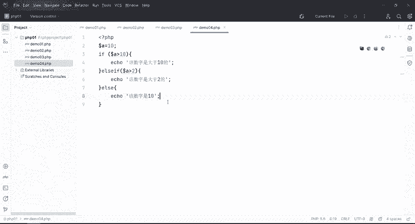

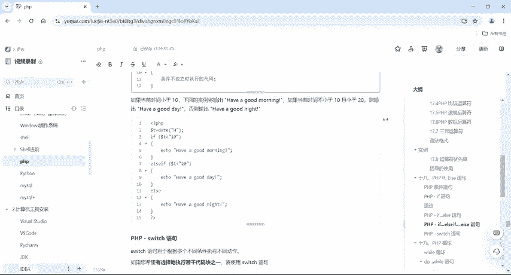

对吧if里面这个条件是满足的，所以只会打印这个啊。好，如果两个都不满足好。😊。

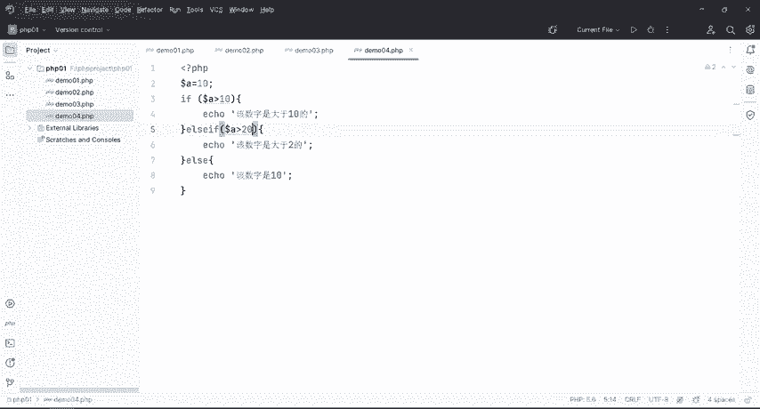

打钥匙对吧？两个都不满足的话，那直接进入else里面去。那该数字是1。好，这个就是if else if，还有else语句。😊，好，那么除了这个之外呢，还有一个switch啊。

那么switch语句呢是用于根据多个不同条件执行不同动作。好，那么如果说你希望有选择的执行若干代码之一啊，请使用我们这个switch语句。那么具体的它的一个语法，我们来看一下这里面switch啊。

这个N呢它是一个条件。那么。条件上面有case1case2case3case4啊，有很多很多的case。那也就是说我们如果这个N满足case一，它就打印case一里面的东西。如果说呢N满足case2。

它就打印case2里面的东西。好，如果说其他的所有的case都不满足，它就会打印de里面的语句。好，嗯，那我们直接把这个东西给它复制一下吧，啊，复制一下，把这个玩意给它粘贴。😊。

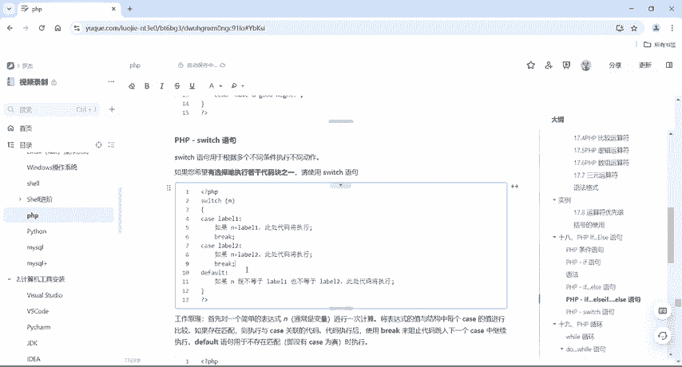

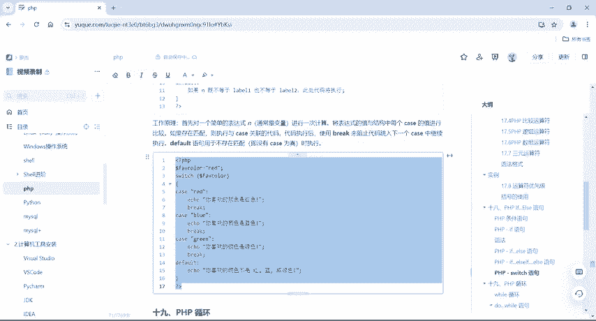

这里呢设置了一个color，等于red，对吧？然后我把这个变量放到switch这个选择框里面判断框里面去。好，我要判断你这个东西是不是满足re，对吧？如果说你满足read，你喜欢的颜色是红色。

如果说你满足绿蓝色绿色，对吧？它就会根据你所选择的条件打印输出你喜欢的颜色，好，我们运行一下，是不是你刚才选择的颜色是red，那么它就会打印输出你喜欢的颜色是红色。好，那如果说我现在改成一个什么呢？

改成一个BLACKbl，对吧。

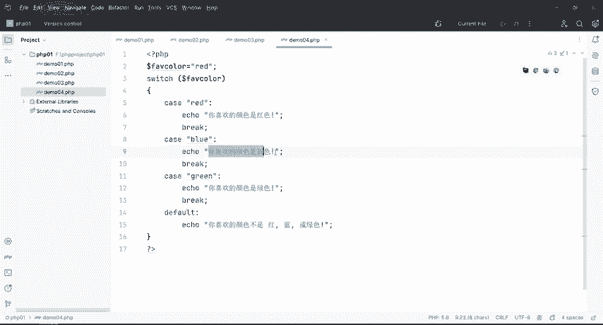

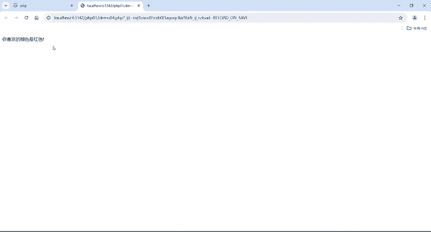

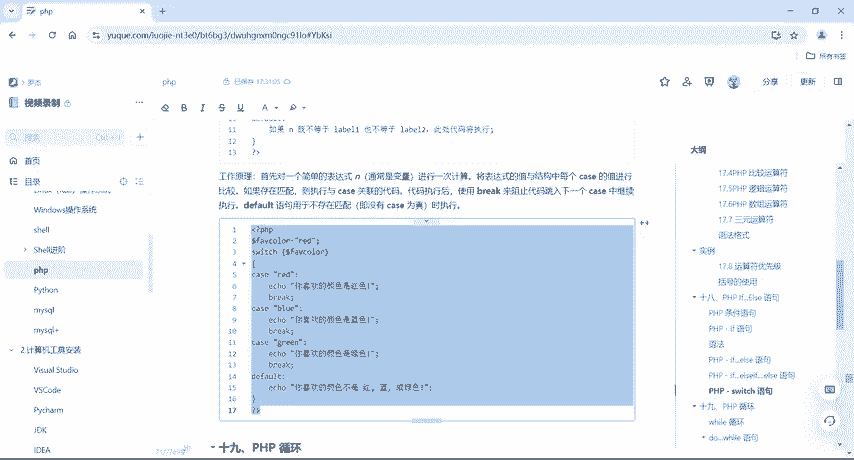

好，black呢红色、蓝色、绿色，就是没有黑色，对不对？那么不满足红。

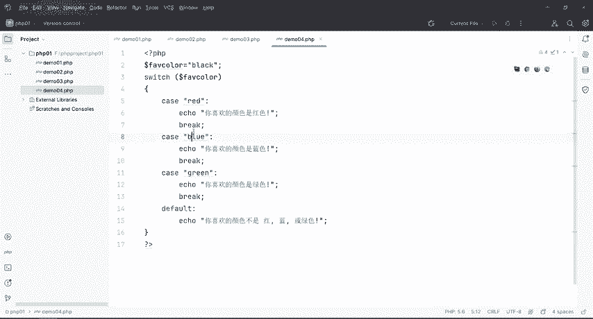

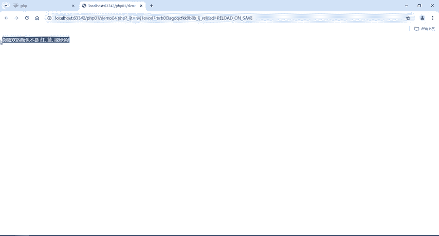

绿蓝你喜欢的颜色哎，不是红不是蓝不是绿，那这就会执行什么呢？就会执行我们这个defa里面的语句。好吧，好，但是还有一个啊一个注意的地方，如果说我这个地方没有break的情况下啊。

即使说你这个不满足case red case blue kiss green，对，它这样来说应该是会执行这个，但是我如果说我没有这个break这个语句啊，我们来看一下情它会打印这个对不对？但是好。

我现在来做一个改变啊，我把这个black给它改成red，那么改成re之后是不是满足这个条件呢？好，那么行他会唉你喜欢的颜色红色蓝色绿色，然后不是红蓝或者绿。好，那么现在就知道了。

如果说没有这个break语句的话，它就会从上到下全部都把我们这个程序给它执行。所以说在case里头啊。😊。

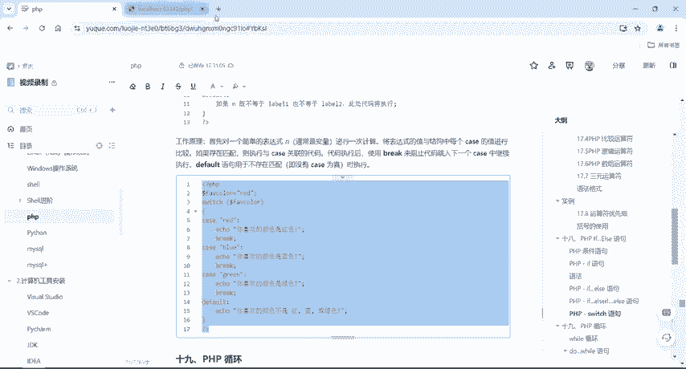

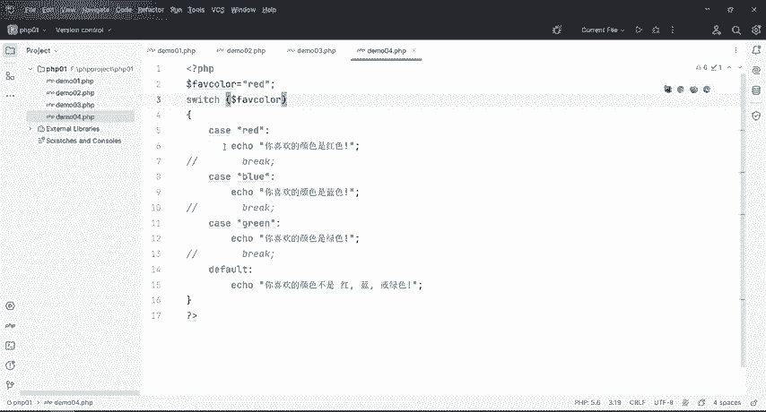

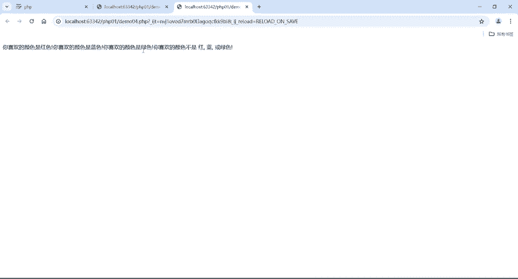

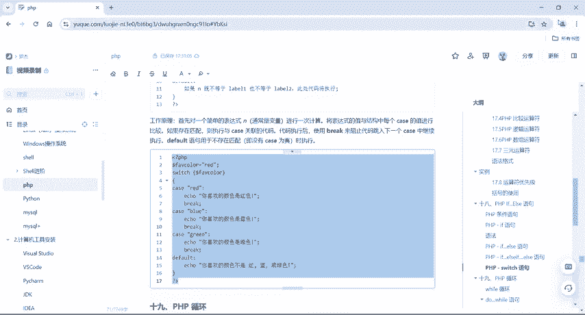

定要加上这个break。好，这个呢就是我们的switch语句。

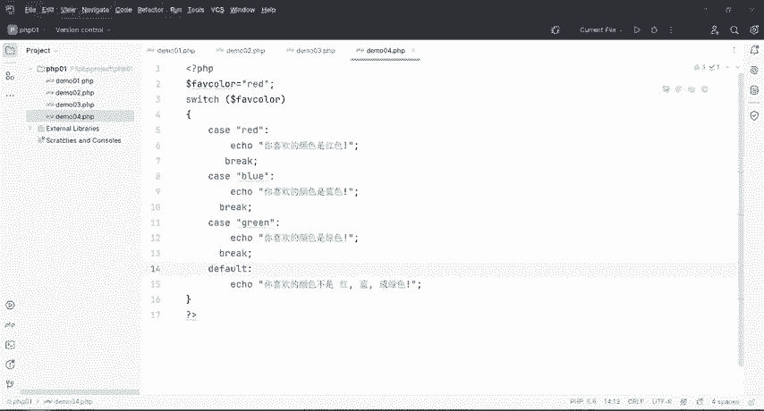

好，那么到这边呢，我们这个PHP里面的条件语句啊就讲完了。

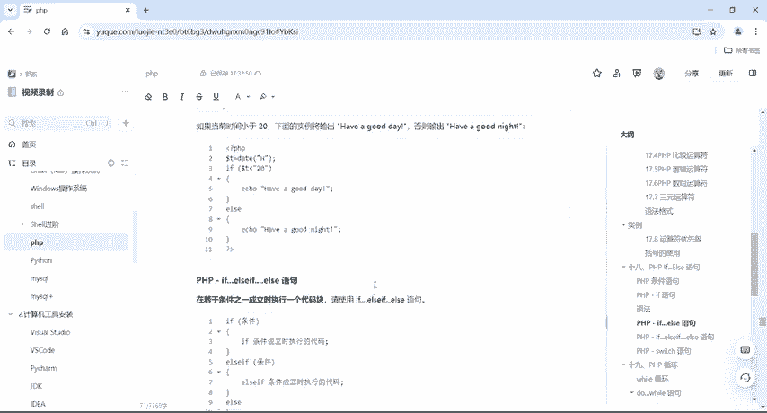