# B站首推！建议所有想参加CTF夺旗赛的同学，死磕这条视频，2024年字节大佬花一周时间整理的CTF入门保姆级教程！从入门到入狱（web渗透／PHP基／SQL注） - P7：7、while循环语句 - CTF入门教学 - BV1JjeJeYE2p

好，下面跟大家讲一下我们PHP的循环语句。那在编写代码的时候，我们需要让相同的代码一次又一次的重复运行啊，那我们就可以使用循环语句来完成这个任务。在PHP当中提供的下列循环语句，第一个是where循环。

第二个呢do要，第三个是for循环，第四个呢是for is循环。好呃，因为呢我们这个数组啊在后面会跟大家提及到，所以说在这边for each。😊，再在数组里面去讲呢。

我们首先先来看一下我们这个where循环。那外循环它将重复执行代码块，直到指定的条件不成立。呃，这什么东西啊，什么意思？

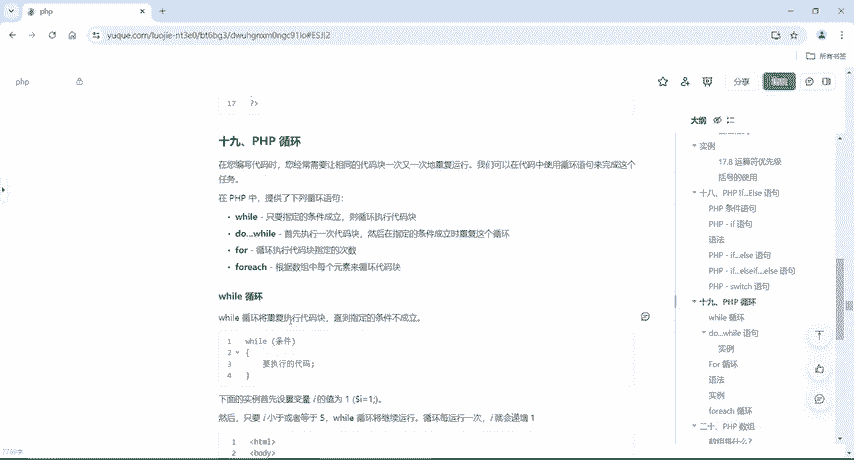

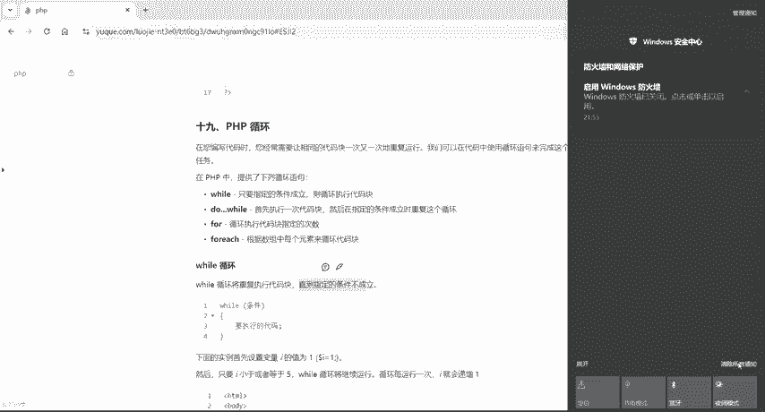

跟if else是一样的。其实我们在if else语句里面，只要if语句里面的条件不成立，它就会执行al语句。但当在我们这个where循环里面呢，where这个括号里面也是放这个条件。

那当它这个where里面的条件不。😊，执行就是不成立的时候啊，那它可能会从一到10。然后它如果是大于10的情况下，它就不执行where里面的一些代码了。那所以说这个条件该怎么去写呢？

首先第一步我们要用where循环的话呢，第一步要设置一个变量的值。那我们通常是把这个变量设置为I。好，给这个I呢负值为一啊，也就是让它从一开始。我们现在要做一个案例啊，做什么东西？

这是我要让这个I小于或者等于5的时候，Y要循环继续运行，循环一侧。😊，I就会递增一。那如果说当A大于5的时候，这个循环就结束了啊，具体的怎么去操作啊，这边也同样的给大家。写了一些代码啊，这些。😊。

资料呢都会给到大家具体的如果说想要呃资料的各位小伙伴都可以评论区联系我，或者呢直接在评论区的地址栏咨取啊。好，那这个我们就来写一下这个代码吧。好，首先还是用到我们这个PHP1动啊。

右键我们另1个PHPfi。

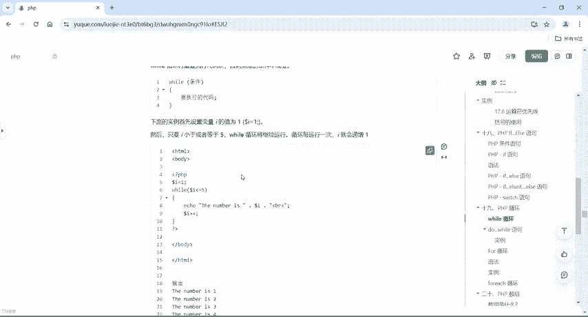

写一个demo05，那我们这个是写循环的啊。好，循环怎么写呢？第一步给它来一个doll，I等于一。我现在要做1到5，当A小于等于5的时候，我这个循环继续执行。好，那我们will语句的这个。😊。

代码啊怎么去写？这个是where，先写一个where，然后给它来个括号。😊，然后嘞，具体的后面怎么去写呢？我们在这个里面写个条件啊，写个条件。😊，然后用大括号给它括起来，跟if是一模一样的操作。

只不过呢if它只能执行一次，但是will可以执行很多次啊，但是取决于你这个条件。如果啊就假设如果这个I对吧？😊，好，多了符号A，如果是小于等于5的时候。我这干嘛呢？我就ecle一下我这个哎。😊，好了。

这个程序搞定了啊。😊，就相当于啊我把这个where当成if对吧？ifI小于等于5，我就把它打印输出。那if呢只会执行一次，它会打印输出一。😊，但我如果说我把它改成威尔呢。啊，它就会持续循环。

但是循环的时候啊，我们来看上去呢，我这个代码已经写完了，对不对？好，那我直接干嘛？我把这个啊这个应用写错了，给它改成多了I啊，哆了I。因为我们需要的是这个PHP里面的变量声明，一定要是多了开头的。好。

我们直接点击运行，运行了之后呢，会发现啊它有个这个错误了，对不对？好，这个错呢，除除了那个呃我们这个解释器啊，没有配置好之外。😊。

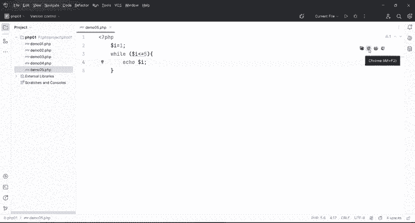

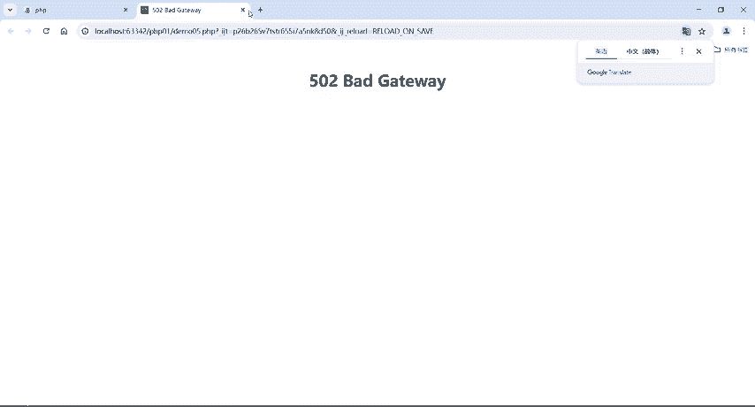

啊。其他的行问。就是因为我这个where循环没有正确的给它退出啊，我们这个解析器已经配置好了啊，对吧？哎，如果说嗯想看解析器没有有没有配置好了，我们可以把上一个代码给它打开看一下。😊。

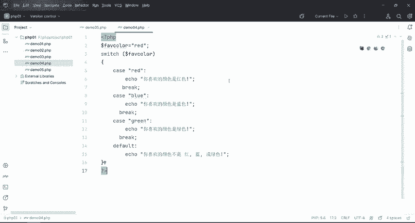

是不是可以啊，能正常运行，那就代表我们这个解释器啊PHP的解析器没有问题，那就证明我们这个well有句有问题，是不是？刚才在我们这个笔记上面呢，就是每循环一次I要递增一，对吧？那具体怎么递增呢？

我们给它来一个这个。😊。

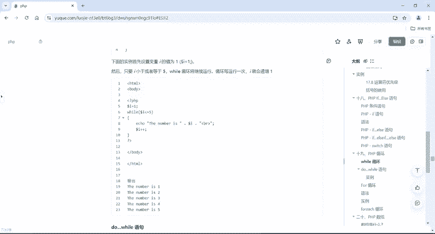

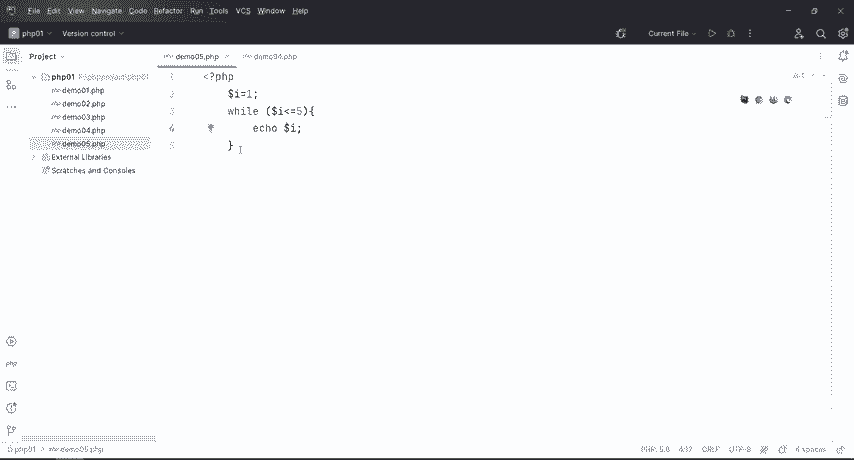

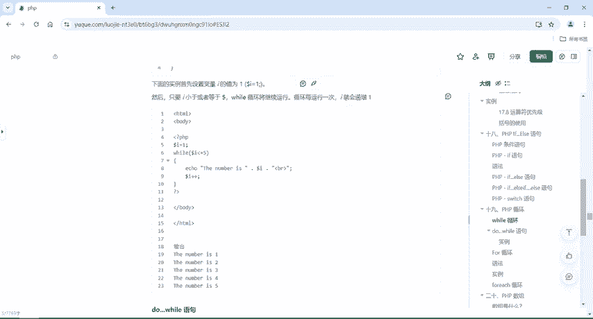

A啊到了A加加。这样的话就是循环一次，我I首先是一。😊，啊，然后再挨加加之后呢，再去运行。一加一变成了22小于5，所又输出2，再循环加一等于33小于等于5，输出3，再加一输出4。再加一输出5。

那如果说直到5输出来之后。我们再加一的话呢，5加一变成6，它变成6，它回到这个will语句里面来判断6它是不是小于等于5的。所以说到A加到6之后，我们这个where循环就能正常的退出了。

那具体情况我们来执行一下。

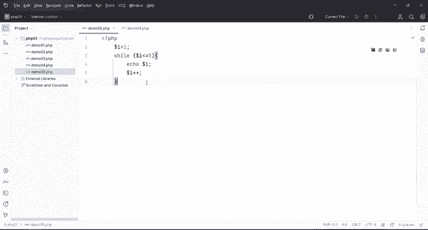

啊12345是不是可以啊？但如果说你要给它执行10次100次啊，你们只要把它改一下，改成100就可以了。也就从一打印到100啊就行。😊。

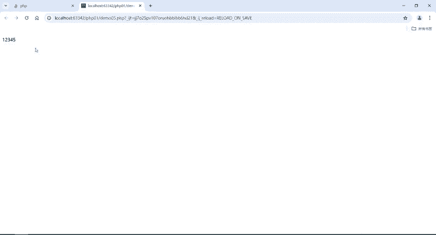

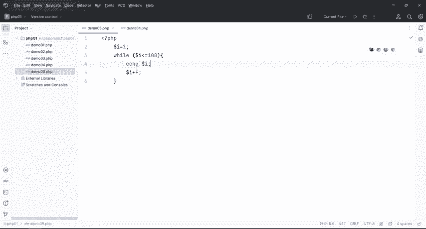

对，一一直达到100啊，这个速度还挺快的啊。好，这个就是我们的where循环。注意啊，一定要呃注意什么呢？注意这个地方啊，这个地方一定要每次循环要给它加一，要改变它的这个参数啊。

如果说你没有跟上这个I加加的话呢，它就会一直是一，那一呢永远是小于等于100是吧？所以说呢它会导致我们这个运行报错啊，甚至呢就是给你提示啊502啊或者505啊，干嘛干嘛的啊，包括各种各样的东西。

其实它就是说你这个where它是一个死循环。好，这个呢就是where语句的。😊。

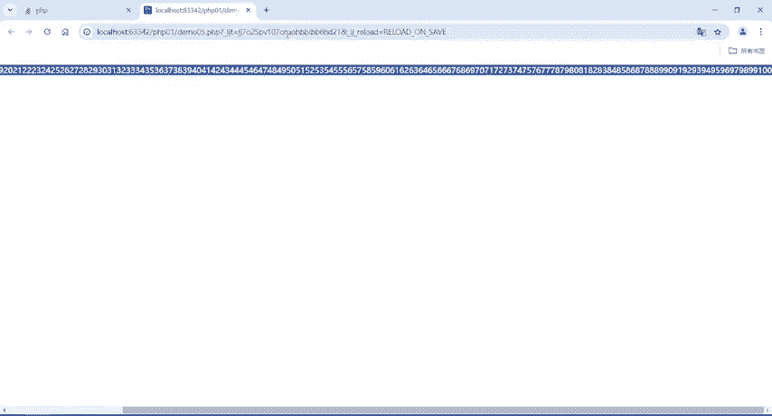

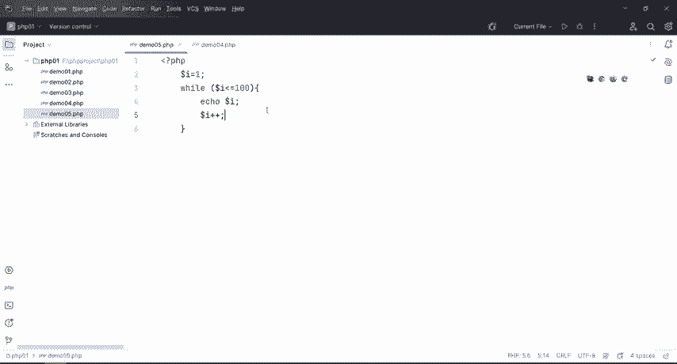

操作。