# B站首推！建议所有想参加CTF夺旗赛的同学，死磕这条视频，2024年字节大佬花一周时间整理的CTF入门保姆级教程！从入门到入狱（web渗透／PHP基／SQL注） - P8：8、dowhile(for循环语句) - CTF入门教学 - BV1JjeJeYE2p

刚才把will循环已经讲完了。那我们接下来看一下这个do well语句。那么do well语句呢，它跟will语句不一样的情况在哪里啊？do well语句呢至少会执行一次代码，然后检查我们这个条件。

只要条件成立，就会重复进行循环。好，我们来对比一下。那么我们当时在这个will语句的时候，它直接会去判断你这个条件是否满足。如果满足的话，我就直接给你输出。

但是我们回到笔记上面来do well它这个语句啊，它这个语法是这么写的。好，它不管你怎么样都要去执行一次我们这个要执行的代码。啊，不管条件成立不成立，最少是执行一次。它具体的怎么去做啊。

我们现在拿这个do来写这个will。😊。

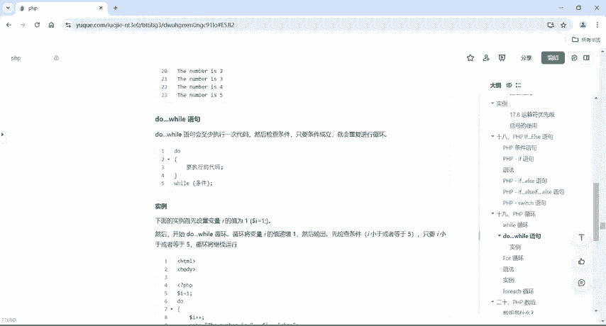

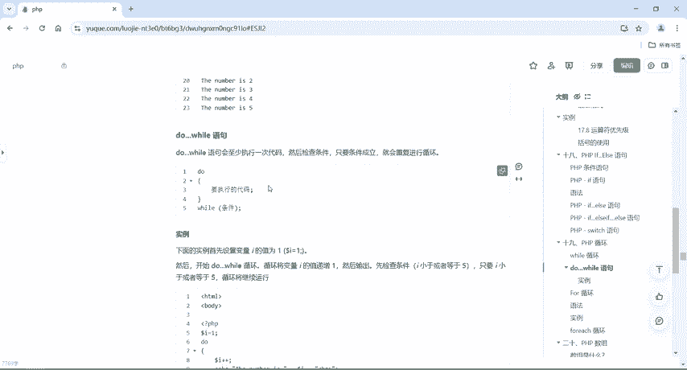

的案例啊，我们把这先给它注释掉。好啊，注射掉之后，我们写一个do。然后呢，大括扣起来。我们把这个will写在这个地方。注意这个语法。跟这个语法是不一样的，一个是先判断，一个呢是先执行。好。

我们把这个里面的语句。把它放到这个Y里面来。就可以了。好，我们这里为了节省时间啊，把它改成5。好吧。呃，把它如果当A小于等于5的时候啊，我就打印输出A啊，同样的啊同样的。😊，我们这个地方也要执行A加加。

如果不执行A加加，它就会变成一个死循环。好了，同样的来运行一下。😊。

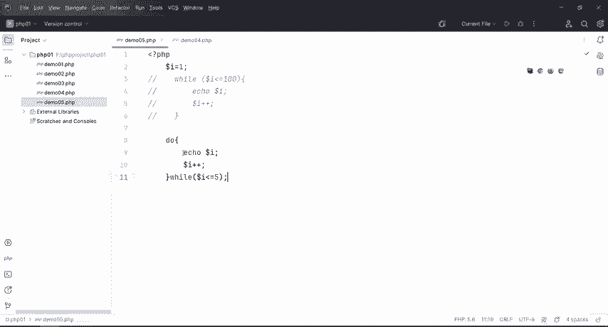

整12345对不对？好，那么如果说啊刚才说了。这个条件不满足的情况下都会执行一次。好，那我现在干嘛呢？我现在把这个I呢改成I大于等于我这个条件是不是不满足啊，那么不满足的情况下，它都会去执行一句啊。

那怎么样子的啊，同样的运行，它是不是把这个一打印出来了。好，这个就是do威尔语句会至少执行一次代码，然后再去检查条件。所以说跟威尔呢是一正一反，威尔是先检查对吧？do威尔呢是不管你这个条件满足不满足。

我不检查你我不管你怎么样啊，你条件满足也好，不满足也好，我首先哎先来执行一遍就行了。所以说呢嗯这个呢就是do维尔跟威尔之间的一个区别。😊。

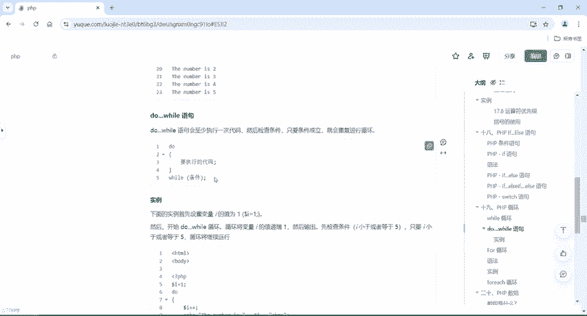

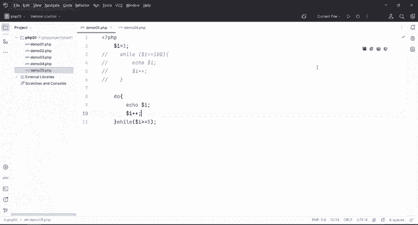

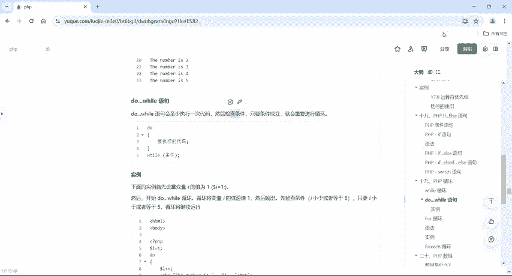

好，这个就是will跟do well。他之间具体怎么去写的啊，具体的代码呢也给大家提供了，在这里个地方啊嗯，各位拿到我们这个笔记之后啊，可以自己去写一下啊，看一下这个效果是怎样子。😊。

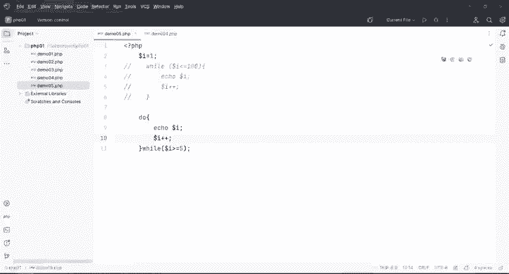

好嗯，那do威尔结束了之后呢，我们来看一下for循环。那for循环跟威尔跟do威尔，其其实它的功能是一样的，都是用来写循环语句。但是for循环的话，如果要用啊，它是用在哪里的呢？

就比如说你预先知道脚本需要运行的次数的情况。😊，是吧那嗯为什么说for循环需要运行次数？刚才有同学叫问呢，那你will跟do where不也是要知道次数跟不不次数嘛，对不对？但是不要忘了啊。

我们这个do well跟will可以这么去写。😊。

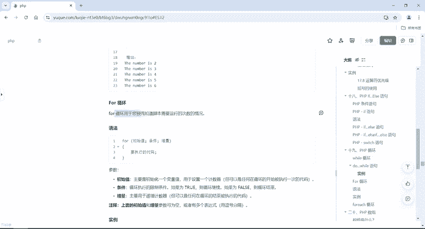

我们先把这个给他出示掉。好，我可以给他写一个will。😊，2e。打印123。也就是说我这个where跟do where这里面的一个括号里面，除了写这个表达式之外，我还可以写这个to。啊。

也就是说当这个条件呢一直是成立的，我就一直打印113。好，这个就是where do where和for的一些区别啊。好，那么回到我们这个for循环。for循环。

我要通过这个for循环来把这个where do where能做的事情它都能做啊，具体怎么做呢？这个就不要了。我们在写for循环的时候，把这一句话，这一句话，还有这句话全部都放在for循环的括号里面。好。

具体的写法语法它这样子的，for循环，然后初始值条件正是我们的自增量要执行的代码。好，那初始值呢主要是初始化一个变量值就跟刚才我们多了I等于一一样的。😊。

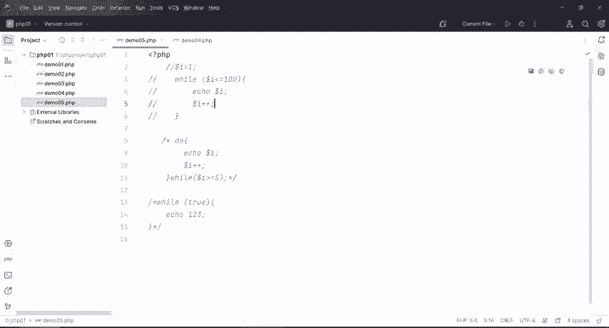

首先要给他一个默认初始画值，用于设置一个计数器。😊，啊，条件就是用来循环执行的限制条件。如果条件为真，循环继续，如果为假循环结束。那增量就是我们刚才的I加加。如果说没有I加加的话呢。

就会导致我们这个磁循环。😊，那我们这个上述的这个初始值和增量参数，它是可以为空的，或者有多个表达式用逗号去分割。所说for循环比 where和do where循环的这个用途啊，就比较广泛。

所以说呢在后面的一些嗯开发当中也好，包括一些代码里面啊，后面一些晚安的学习里面for循环的情况会很多很多啊。好，那这个地方实例我们也来写一下啊，我们还是一样的。我们刚才where循环是1到51到100。

那么do where的日1到5。那我们用for循环来写一下啊。首先给它来一个for给它括号括起来。好，怎么写呢？到了I等于一好分号。

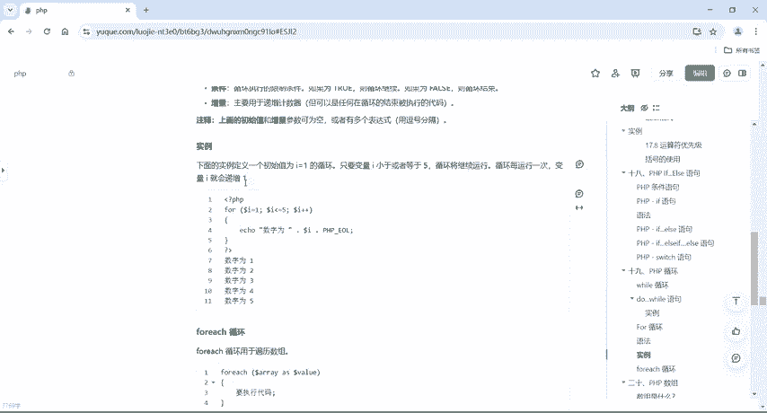

到了。I。小于等于5分号多了A加加。好，把三个。表达式都给它写在一个括号里面，我就直接echo一下。哎，同样的啊，我们do where是几行语句呢？where尔是1234啊。😊，那 do亚呢1234。

他们总共有4行，但是我们到这个for里面来的话呢，就能看得到我们for循环两行代码就可以搞定will跟 do亚的用法了。好，这里报错了，是不是哎报错报什么错啊，有的时候一定要注意啊。

一定要注意我在这个地方PHP里面变量名啊变量名，所以说这个地方已经不能犯错啊，但是犯了错误呢也没关系。虽然说我这个工具啊没有给我们提示，但是我一运行的话，它就会报错啊，报错，我们就要来找好。

那报错错误怎么找的呢？我怎么知道这个是这个I这边有错误呢，是不是？他给我报了啊，运行一下，它报了什么？报了这个I是不是？然后在第十八行啊，就这么去看的。

那么第十八行我们就找一下我们这个第十八行就这一块啊，这里行数，那I呢？是这个地方对不对？好，那么找到了这个I，那我直。😊。

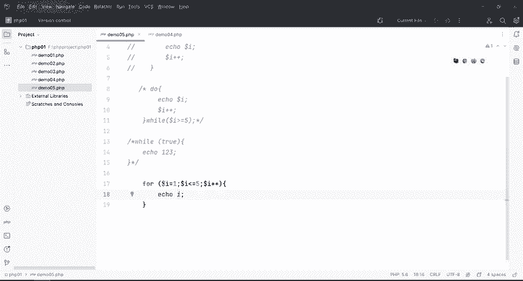

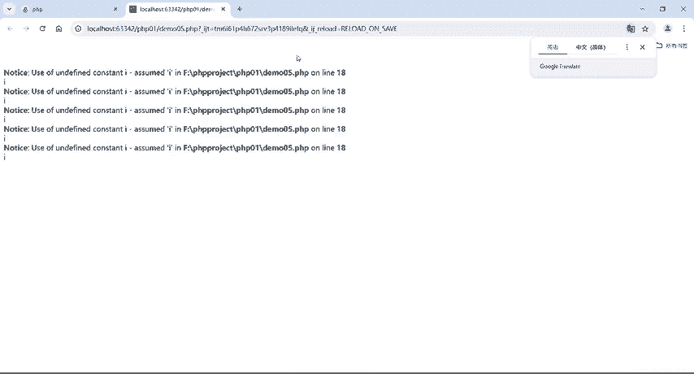

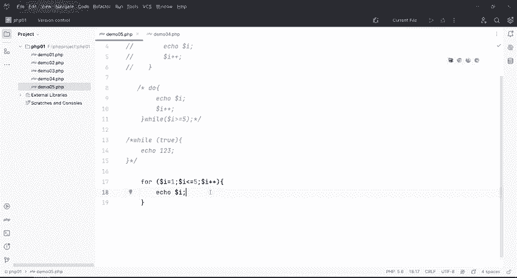

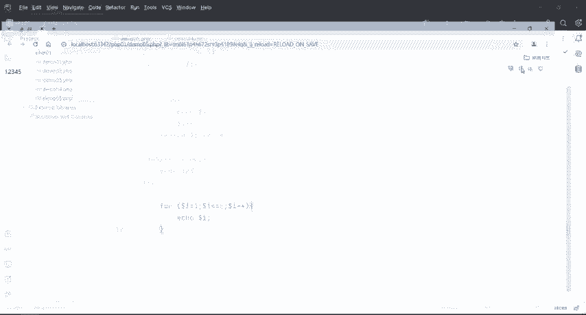

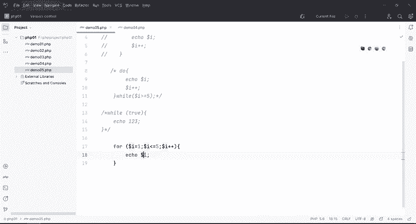

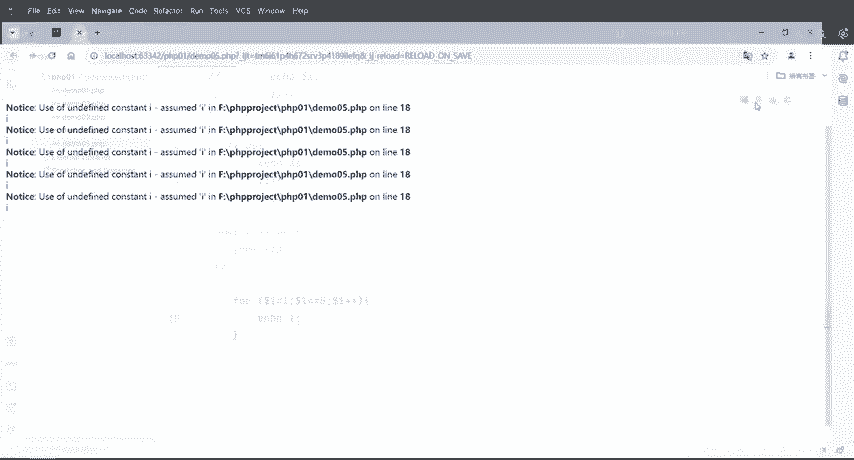

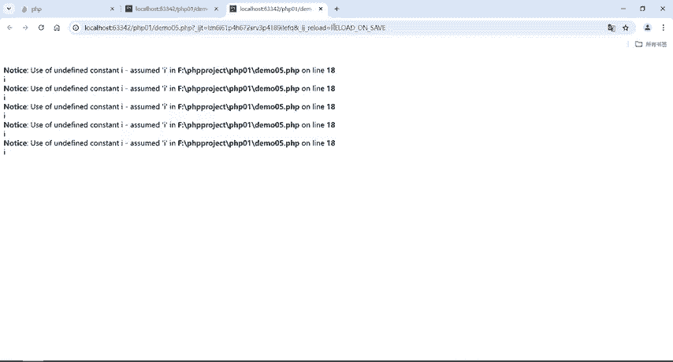

接就知道哎是这个I写错了。好，那么这个就是for循环打印12345。

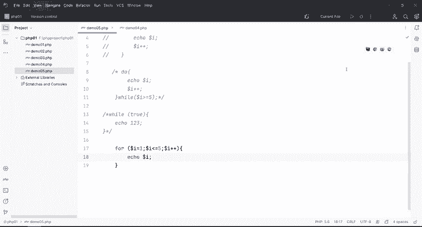

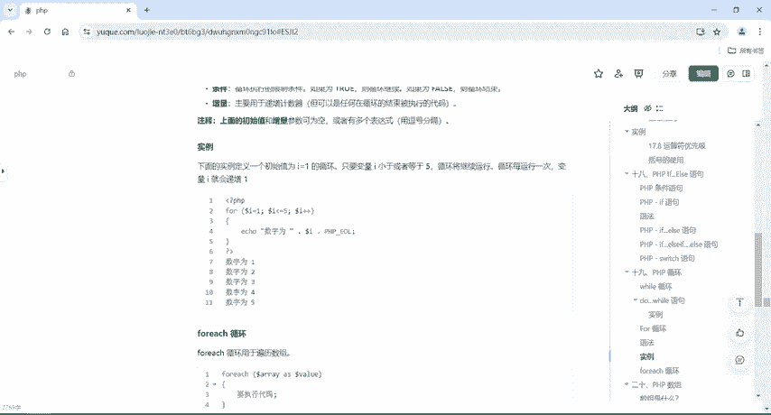