# B站首推！建议所有想参加CTF夺旗赛的同学，死磕这条视频，2024年字节大佬花一周时间整理的CTF入门保姆级教程！从入门到入狱（web渗透／PHP基／SQL注） - P9：9、php数组遍历 - CTF入门教学 - BV1JjeJeYE2p

好，接下来呢嗯我们先把这个for一次循环先放在一边啊，我们先来看一下我们这个PHP数组。那数组它在PHP当中啊，它能够在单个变量中存储多个值。那么像我们一般的写代码，我如果说要在存值的话。

是不是就把一个值负值给一个变量啊？但是数组的话呢，它是你取一个变量，我可以在这个变量里面去存多个值，那具体怎么去存的呢？

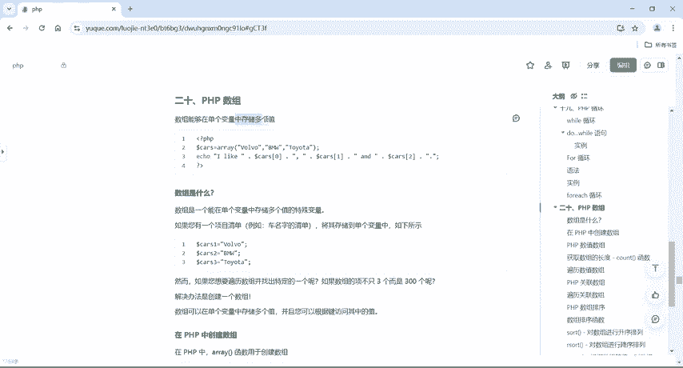

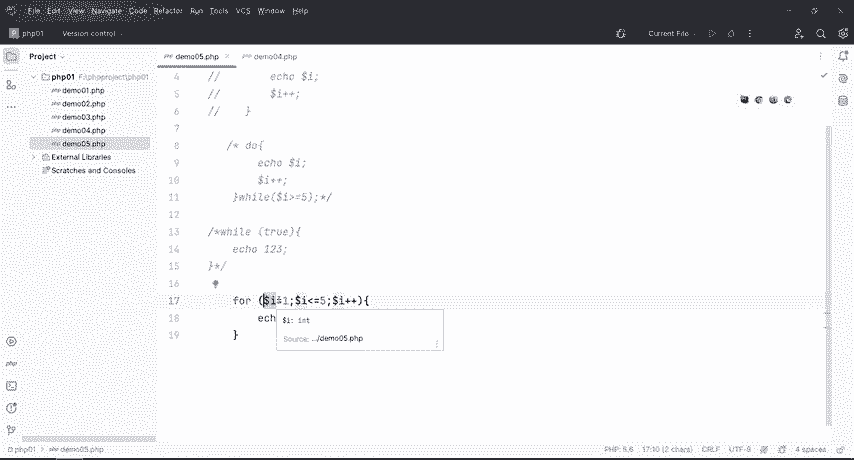

在这个里面声明了一个变量等于every用括号给它括起来。在这个括号里面呢，可以写很多很多的值。好，这个是数组的定义。好，那我们同样的。

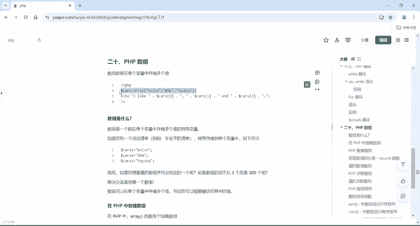

把它来看一下啊，那我这里嘛我就把它删掉了。😊。

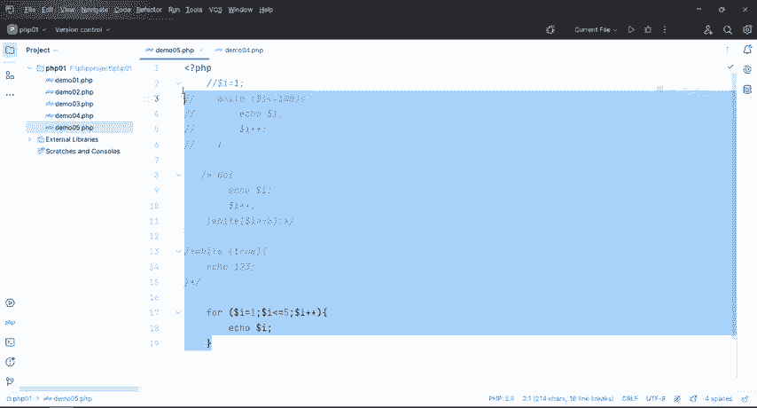

好。给它定义一个变量叫cast，等于ar瑞。这个ar瑞呢是代表我们PHP里面的一个数组。那么括号里面是可以写很多很多的值。在这个地方呢，给它三个值啊，这个值与值之间用逗号给它隔开，用双引号给它引起来。

如果说你想给它写那个阿拉伯数字的话呢，就不需要写引号了，因为这个是属于我们的字符串，字符串呢，必须用引号给它引起来。好，那声明的一个带有三个值的数组。那数组怎么去访问的呢，访问我们就直接echo一下啊。

echo一下。那我们具体看一下它输出来是什么，那为什么要这么做，对不对？好，它输出i like cast的零下标，加上cast的一下标，加上casts二下标好运行我喜欢数。😊。

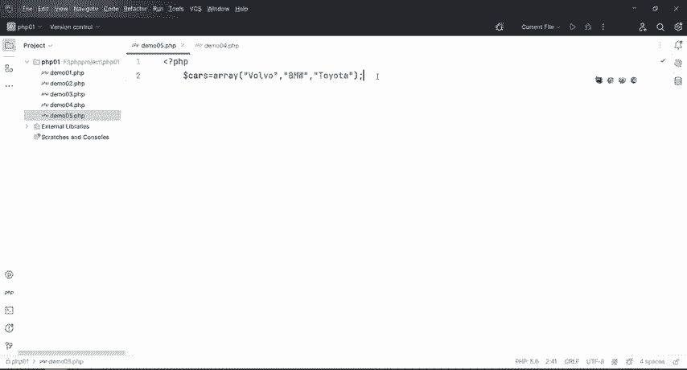

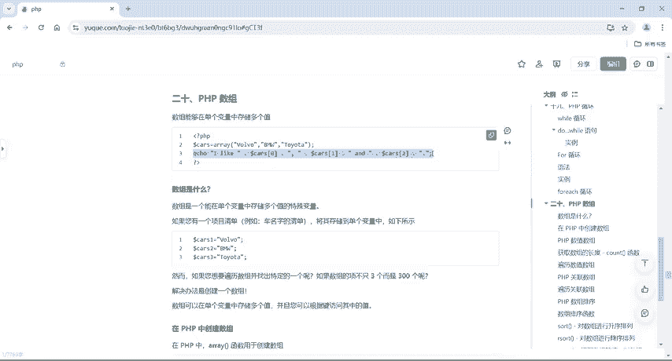

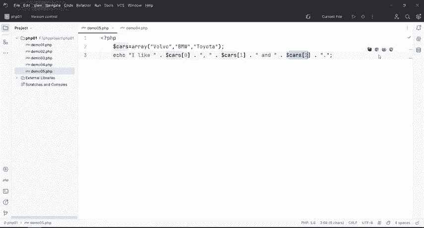

组里面的三个对吧？沃尔沃、宝马或者是丰田是不是？那这个为什么要这么写呢？那么数组里面怎么去访问的那就这么访问的啊，数组里面跟一般情况，我们在这里面去数肯定是一个两个3个，对吧？总共有三个数组。

就是数组里面有三个值了。嗯，但是呢我们通过数组访问的话呢，是根据他们的零下标一下标跟二下标来访问的，正好是三个值。😊。

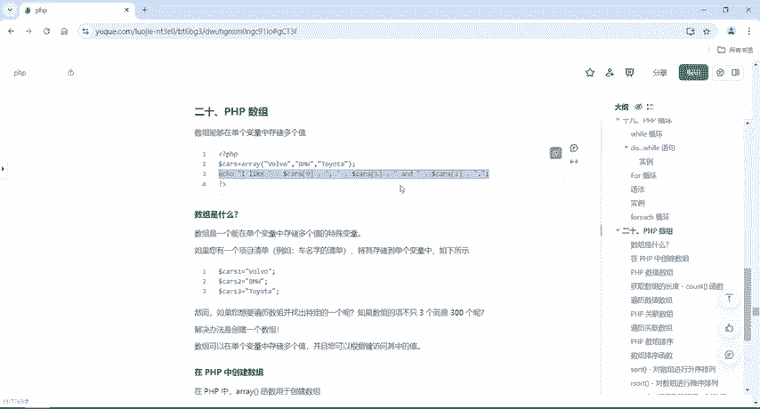

这个数组访问啊是通过下标来访问的，是通过我们这个变量的下标下标用括号给它括起来，从零开始就是012总共三个值。好，中间呢是用这个点啊给它去连接符务，是我们的这个前面讲的啊，并制运算符，对吧？好。

这个就是数组怎么声明，怎么去访问。

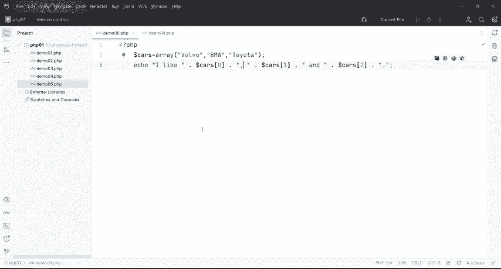

啊，那收阻它到底是什么啊？收阻它是一个能在单个变量中存储多个值的一个特殊变量啊，刚才也看到了。

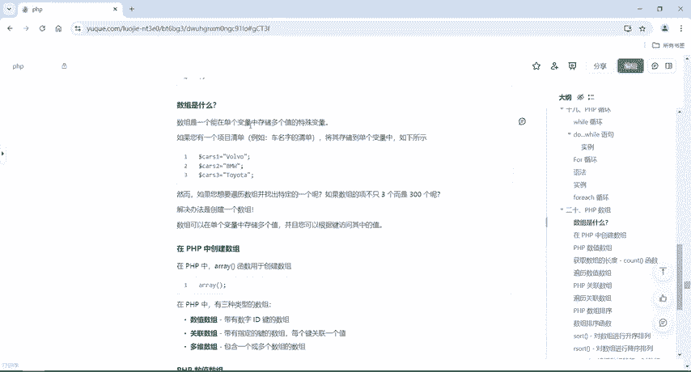

在一个变量里面存储了多个值是吧？好，那么如果说你有一个项目清单，比如说车名字啊，比如说要。

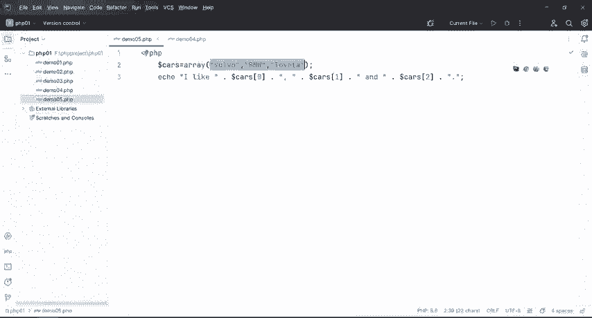

嗯，咱们打个比方啊，有三个车，有4个车，有5个车。那如果根据之前啊没有学数组的之前情况，我是不是每辆车呢都给它存储到单个变量里面？我三个还好，10个还好。那如果我要干嘛呢？我要存300个，甚至。

500个甚至1000个的话，那我是不是要定义300个变量，500个变量，甚至1000个变量了。好，那这个解决方法就是创建一个数组，我们可以把所有的值给它放到这个数里面，给很多很多的值都可以存。

然后你可以根据它的键去访问它的值，也可以根据它的下标去访问啊，因为数组呢它是一个键值对的啊，键值对可能有的小伙伴也听不懂呢，对不对？好，那具体怎么去创的啊，怎么去串，这里也有啊，都给大家写好了的。

在PHP当中，我给它来一个瑞函数用于创建数组，在PHP当中总共有三种类型。第一个是数值，第二个是关联。第三个呢是多维数组。好，那PHP的数值数组，就刚才我们见过的自动分配IDID键呢。

就是我们的一个下标。哎，下标它是从零开始的，这个是我们的一个数值数组的一个创建。那如果你不想给它在这里面去分配，你也可以干嘛呢？同样的，你可以给它取个名字啊，我们来写一下。

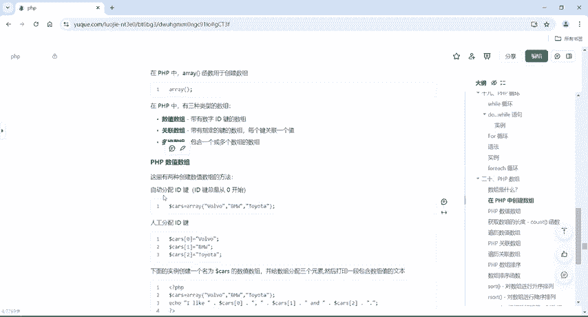

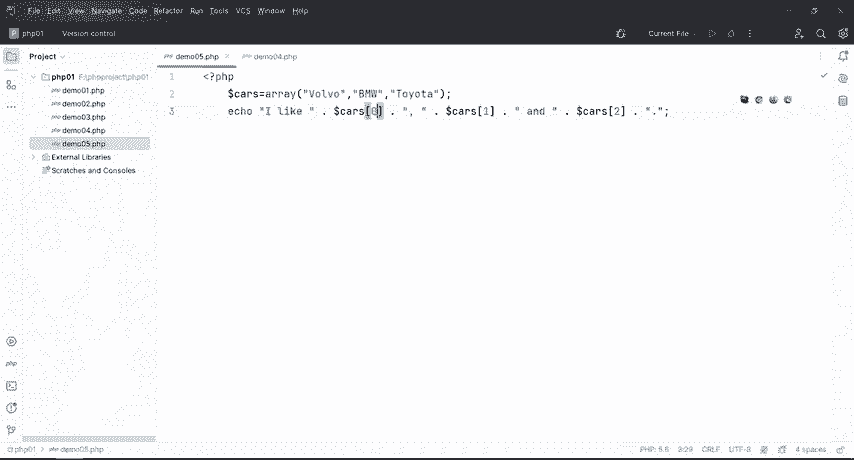

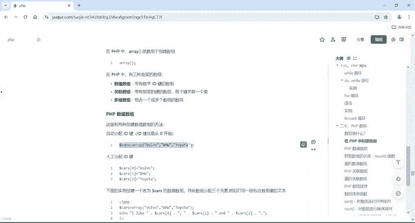

就这样写，你可以给它一个空的数组，不负值。我在不知道里面要附多少值的情况下，我给它来一个空的数组，好，具体怎么去赋值呢？我这样去赋值，根据它的下标cas的零下标我就等于什么呢？等于我们这个word是吧？

哎这么去复啊，就是一个一个去复值。当然你也可以去跳着赋值，你可以不去赋值cas的一下标，你可以直接赋值cas的二下标就等于我们这个呃宝马啊都行啊，这个是可以跳着来的。这个是你自己想去赋值到哪个位置。

你就用这个方法。那如果说你直接在这个里面写上你所想要的数组的值，你就写它呢会根据你的下标排列。一个一个的给你们输出出来啊，一个是直接复制。一个呢是定义空的数组，然后再去单独的这个叫什么呢？

这个叫人工复制。好，这里写了啊，人工分配ID键零下标等于什么？一下标等于什么？二下标等于什么？

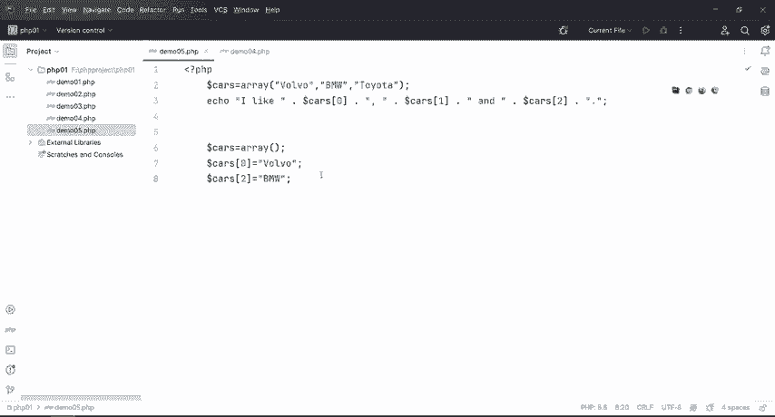

好，那这个实例刚才也看到了啊，这个就不说了，就是。😊，创建一个名为casts的数值，然后分配三个元素打印输出好。那接下来再跟大家去讲一下我们这个数组的长度。那数组的长度为什么像要有这个长度呢？

我如果说在这个数组里面写了很多很多很多。但是我要知道你这个数组里面有多少个值，那是不是用手动去数呢？对吧？哎，如果是成千上百个成千上万个，那是不是要数数的手好疼，数的眼睛好痛。

那我们在数组里面给大家提供了一个数组的长度叫countt，那具体这个countt怎么用啊，我们就直接这么玩，好，这个地方我们就先把这个给它注释掉，给它注意下之后，我这里是不是复制了两个1个01个2。

是不是啊？好，我就直接e一下，e一下doll cars。😊。

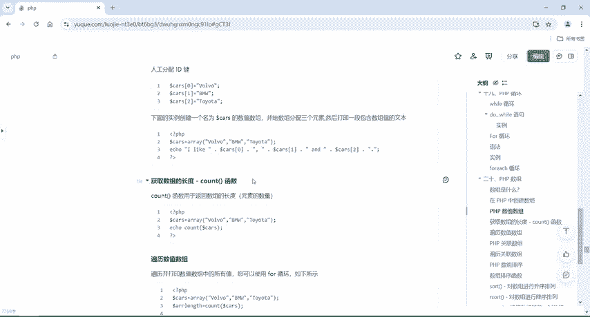

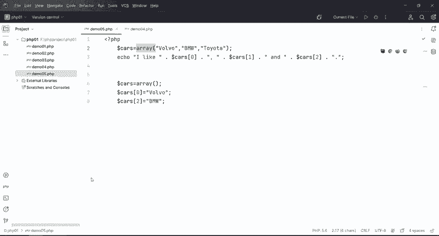

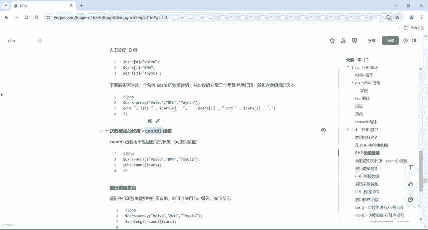

然后我们把这个countt给它放进来，把这个casts呢给它放到这个框里面来就可以了。这样的话就可以知道我这个cas这个数组总共有多少个了啊，运行一下，是不是两个好，这个是获得数组的长度。

那么获得数组的长度除了是除了这种方案，它还可以干嘛呢？刚才在前面是不提到了一个for each循环呢，它可以用来放到for each循环里面去使用。那具体怎么去循环，循环是干嘛的？循环是便利的。

那么我们要变历什么呢？我们要便历数组。好，我把数组给它定义好了之后，我想把这些东西把这个值全部给打印输出。那我们就要通过这个for意循环了。好，那么for意循环，那具体怎么做呢？

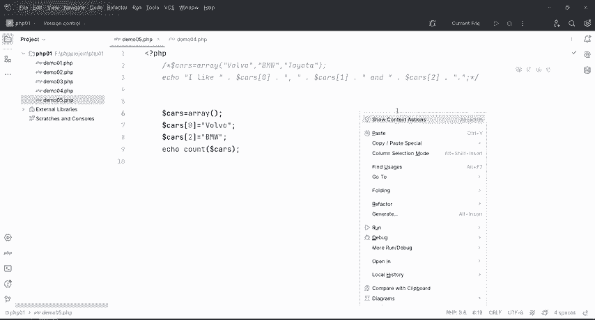

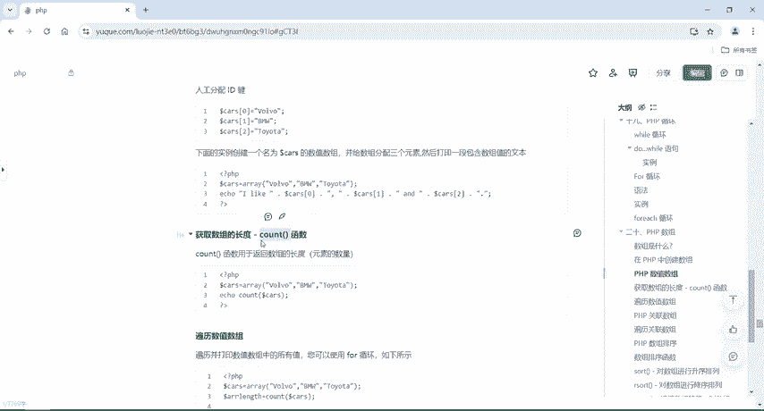

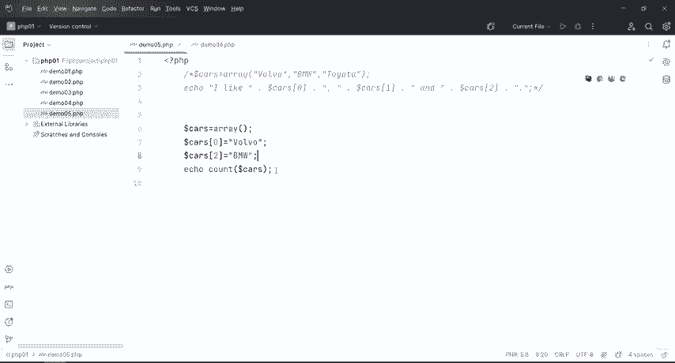

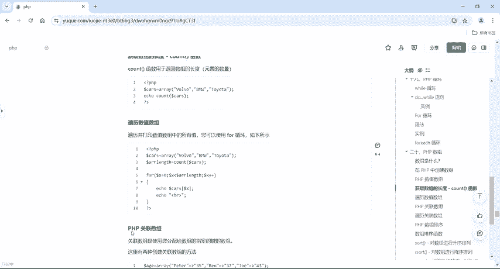

我们刚才已经知道了，这样的话是定义并赋值。好，那我们就用这个方法定义并赋值。然后我把这个嗯cas的长度给它拿到。啊，怎么拿到呢？看 thecast，然后呢我用一个变量去接收它dollar LENGTH。

或者是什么n好吧，取个名字啊，取个名字，我把这个cas的总长度也是总数给它拿到之后存到这个LEN这个变量里面来。那具体怎么去用for is循环去做呢？当然除了fores，我们还可以用for啊。

这个里面是用那个for啊for years我们也可以用啊，具体怎么用，我们先把这个for给它搞定啊。

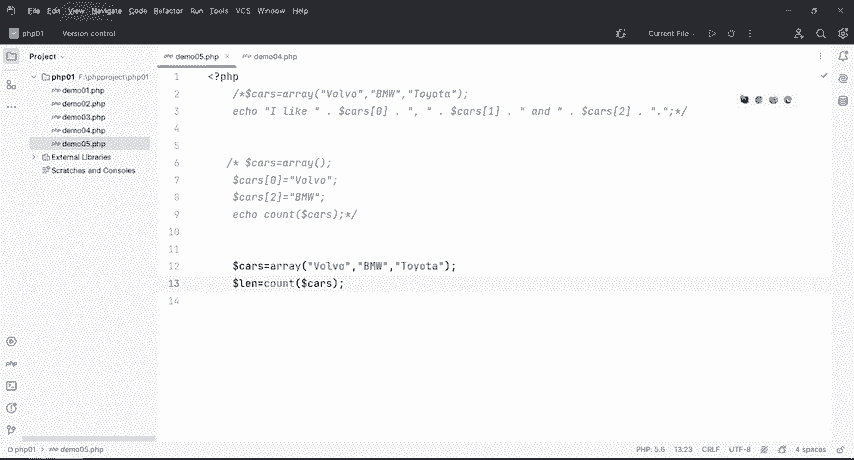

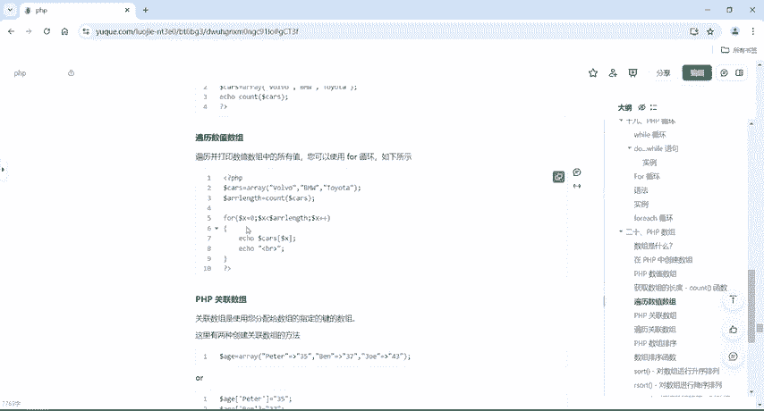

好，一般我们就直接写个for循环。好嗯，到了。哎。等于。一啊，然后呢，在这个。到了A小于等于我们这个do了 lens。然后再来一个。到了哎，佳佳。好了。😊，这个刚才熟悉吧，是用for循环，从一到加。

我们指定的一个长度，然后打印输出好，具体的怎么打呢？

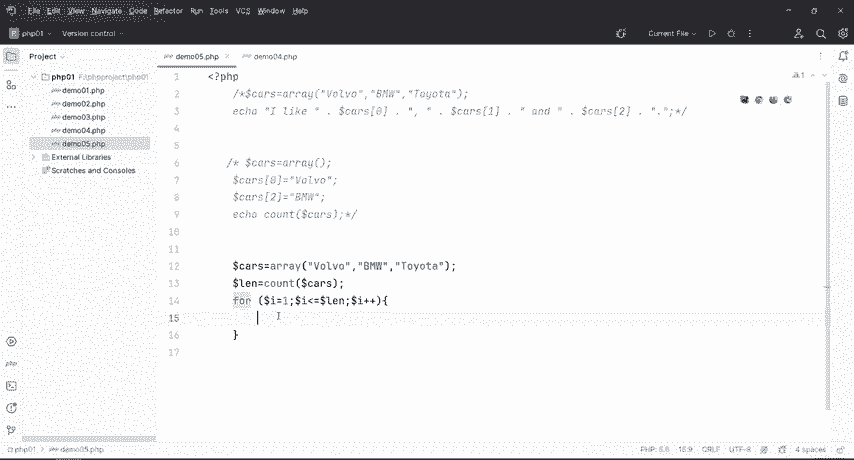

我们在这个里面啊一定要ecle echo什么呢？我们如果说在这个地方直接e echo一下我们这个cas啊，它的结果我们来看一下，但结果是这样子的，是个艾瑞，它只告诉你哎，它是一个数组。

但是有没有把值告诉我们是没有的。那具体怎么去取值呢？我们要给它cas给它加上一个I下标才可以。注意do了不要忘do了的I下标，那么do了的I下标。

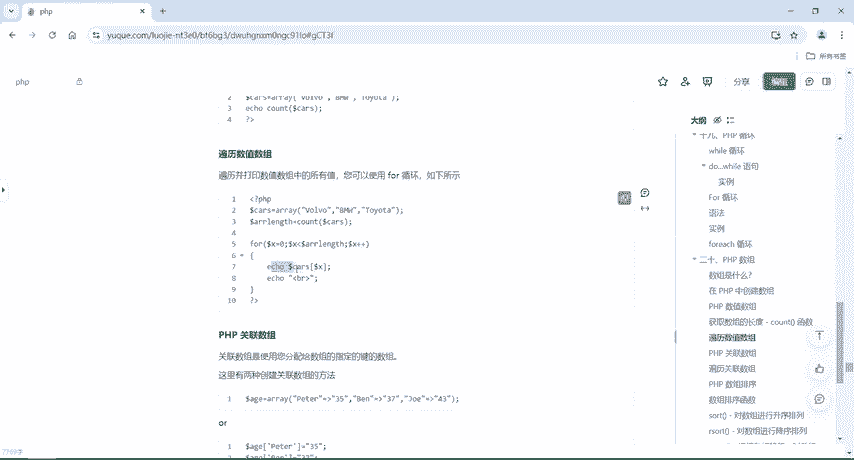

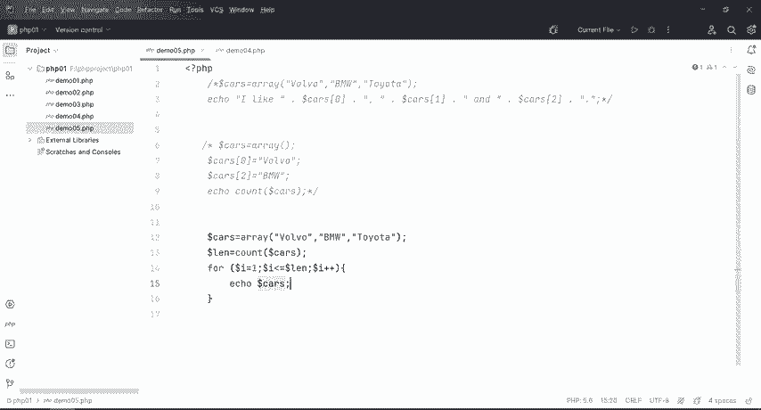

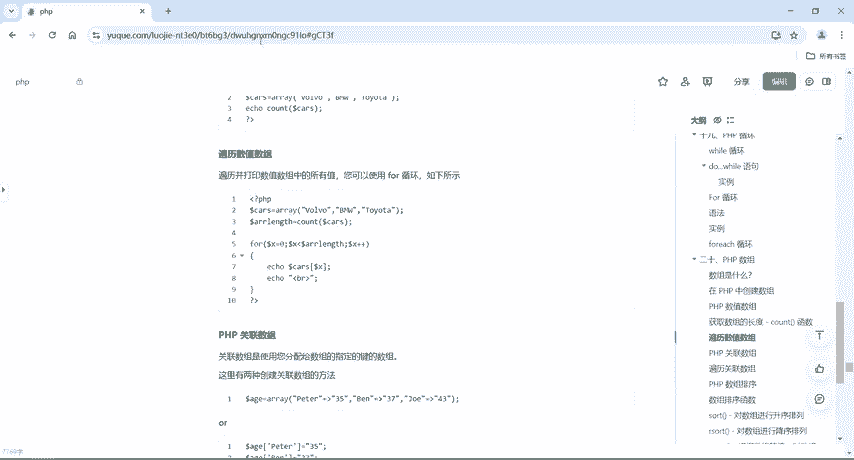

是吧多了A下标就是cas的多了II如果等于1。那吧AA如果等于2，A如果等于0是吧？那我是不是就可以获取到castt的零下标，cost的一下标cot2下标了。好，那具体的我们来运行一下。好了。

它为什么报错呢？😊。

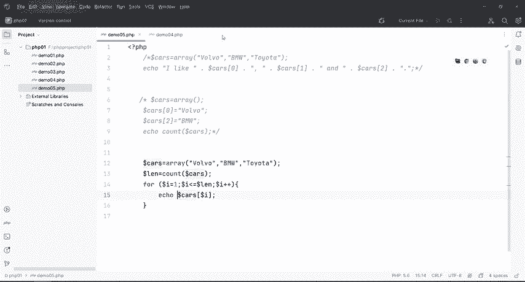

我什么报错呢？它只输出一个。😡，一下标跟二下标，那零下标哪去呢？因为我们零下标没有输出出来，对不对？那零下标没有输出来，因为我是从一开始的那也就是说我从这个BMW开始的，所以说我这个零下标在不在不在。

那怎么怎么让它出现呢？我们把这个零变成零嗯，把这个一变成零啊，变成零之后哎，我们继续打应输出。好，为什么又报错了呢？😊。

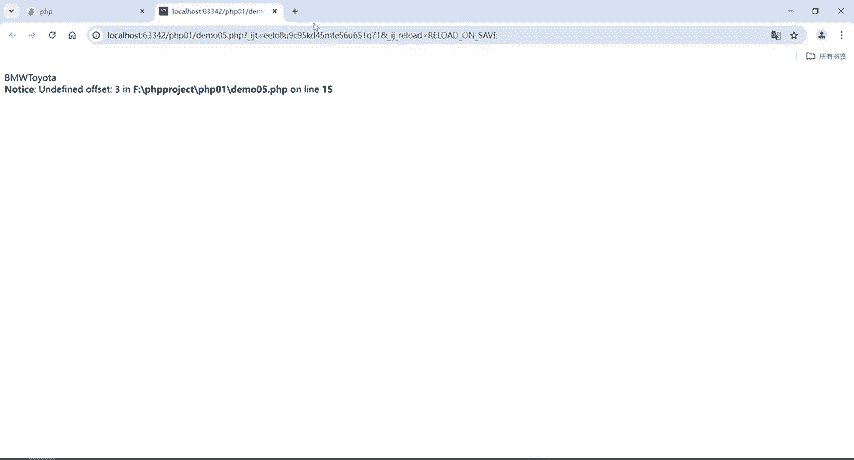

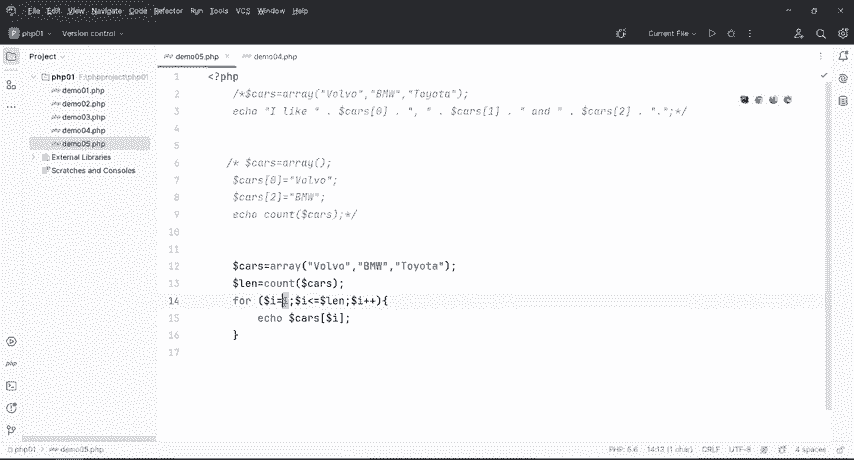

报什么错？他说on the fun of that3，哎，他找不到这个3。😊，他三在哪里呀？

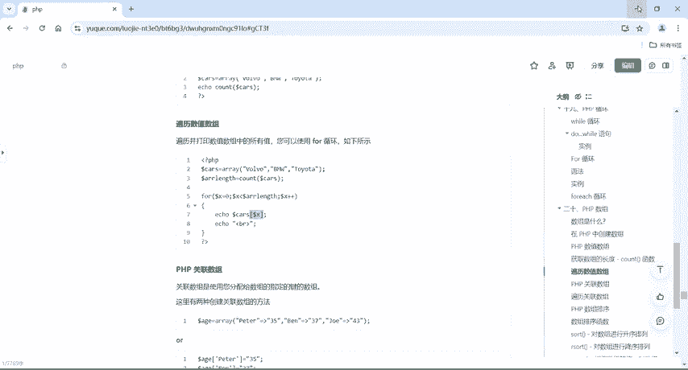

深圳哪里啊？我从零开始。然后小于等于几啊，这是不是三？那么小于等于3，那么0啊写一下啊0123，那这个里面是不是就四个值了。但是我真真正正存在这里面是不是三个值。所以说我们在写for循环的时候。

不能给它加等号，加了等号的话就变成四个了啊，这个就是for循环啊，运行一下，一定要注意的，是不是有了，有之后，那我们接下来给它ecle一下我们这个换行就可以看得清楚一下，换行写在这里echo一下BR。

😊。

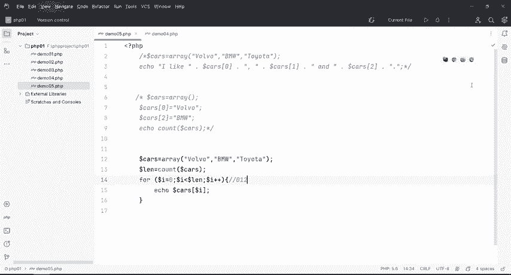

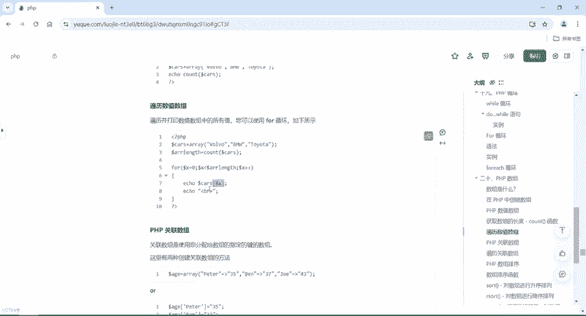

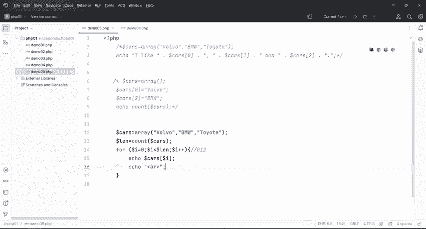

运行。可以了沃尔沃BMW。太太。好，这个就是我们的便利数组。

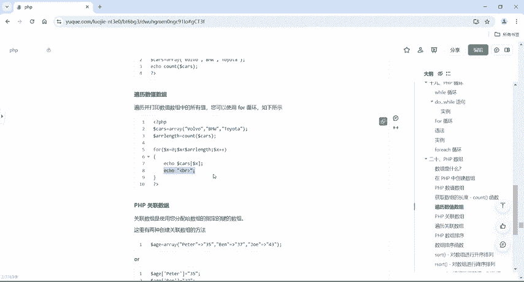