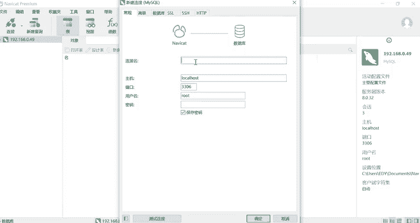
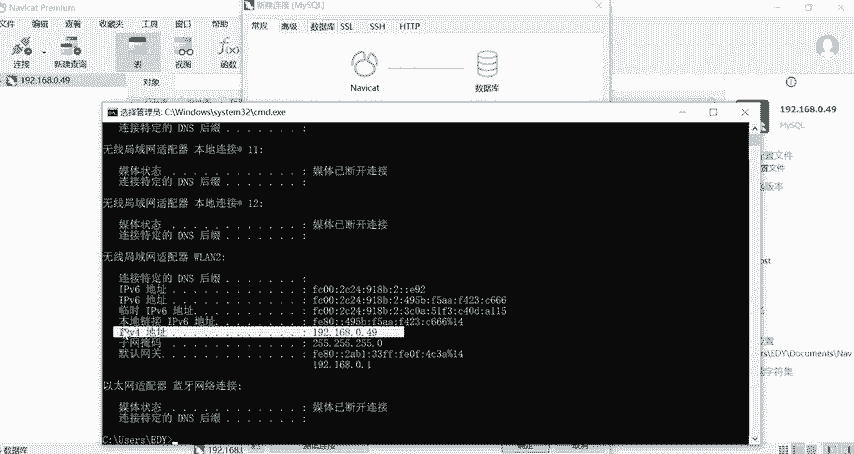
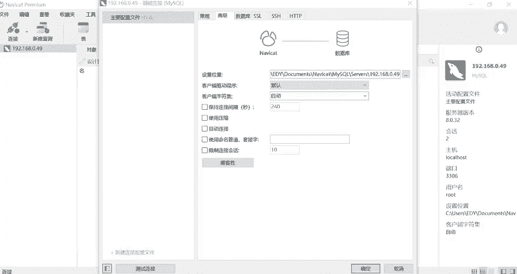

# B站高质量CTF比赛工具使用教程合集，100个入门到进阶CTF工具使用讲解，保姆式教程，附工具安装包，拿不到名次算我的！ - P10：6、navicat下载安装教程 - CTF入门教学 - BV1tdejeuEVz

大家好，我是阿青。那今天的话呢咱们来讲解数据库管理工具它的一个简单的使用。首先的话我们是打开这个工具，然后的话呢点击链接选择my。在这里的话呢我们就可以进入到这个界面。那这里连接名的话。

我们可以随意的去书写一般情况下可以使用自己姓名的简写，也可以使用本机的IP。那在这里的话我们直接使用本机的IP，我们同时按住我们的电脑的windows键加上R键输入CMD打开这个命令窗口行。

然后的话呢输入对应的指令去查询本机的IP的地址。所以呢我们输入IP然后的话大这里我们可以看到我们的IP地址的话是192点168。0。49。所以呢你可以把这样的一个地址写在咱们的连接名这里。

所以我们直接把它输入进去。O然后我们来看一下这个界面它有什么其他的一些。

动向我们来看一个这个单词，主机 house它是什么意思呢？本地的意思，对不对？就表示说我们当前连接的是本地的数据库。那如果这个时候我们想要去连接其他的数据库怎么办？当然是可以允许的。

输入对应的IP地址就可以了。如果你想要去连接其他人的服务器，其他人的数据库，我们把对应的IP地址改成指定的IP地址就可以了。那当然前提条件是你们两个一定是能够互相访问的，就是要么你们现在的话呢。

在一个局域网里面，要么你把它放到服务器上面就可以了，对不对？我们一定要能够访问它，如果你不能访问它的话，你只是单纯的去输入IP地址，那是没有用的好吗？

前提条件你可以访问它在局域网里面或者它把它的数据库放到服务器上面去了。那这种前提条件的话呢都是可以的。O然后的话呢端口号我们是不需要跟。改的用户名不需要改密码的话呢，你也可以不用改。

当然你也可以去设置随意的。比如说root密码呀，postsword密码都可以。然后点击确定就可以。我们点击完确定之后，大家可以看到这里的话呢就有咱们刚刚建立的数据库。然后我们双击给它点开双击完之后的话。

我们可以看到这个图标的话呢，就已经明显的变掉了，对不对？那就变成了这个样子表示你的数据库连接已经打开了，所以其实我们刚刚的这个双击操作它等于哪一步呢？

其实就相当于我们在命令行里面去输入了my circle杠U杠P这一步O他们是等价的。也就是说我们现在双击打开的话呢，就不需要咱们在命令行里面去输入命令的。这个大家可以理解嘛。

也就是等于咱们在命令行里面输入my circle杠U加上输入用户名杠P。哎密码这是相等的。OK那我们打开之后的话，我们可以看到这里有一个叫做ASYS这样的一个数据库。

那其实你在命令行里面去创建数据库的话呢，这边也是一样的，可以看到了。在这边接收以后，我们在命令行那边查询也是一样的，可以查询出来的那这个两个东西有什么区别呢？那首先的话，命令行的话呢。

它是通过命令窗口去通过命令来控制数据库的增商改查。但是我们现在这个工具的话呢，它叫做可视化图形界面，或者说可视化图形工具都是可以的。OK那它可以直接的让我们去看到咱们建好的数据库。

我们可以看到这边的话左边就是我们刚刚新建的192。168。0。49这样的一个数据库。那很明显我们通过图形化界面去创建的数据库的话呢，会更加的方便，以及直观，对不对？所以我们现在的话双击打开咱们的数据库。

打开我们的SYSY。然后的话呢点击一下查询。然后点击一下新建。我们其实新建完之后的话呢，我们就可以正常的去输入我们数据库表里面的命令了。然后大家可以记一下，因为有的同学我们的数据库版本的话呢。

它可能默认的会打开一个新的窗口。那我们如何去进行更改呢，那这里的话阿强老师也带大家去操作一下。首先的话我们可以选择工具选择选项。然后在我们的选项卡里面的话呢，可以去进行对应的操作。

比如说我们把它设置成第三个，最后打开选项卡的窗口，或者说设置为新窗口给大家演示一下。那这里我们再点击查询，点击新建查询的话呢，它就会出现一个独立的窗口。那这里就是两个的区别。

那一般情况下其实出现独立的窗口，它也不是很好的操作。所以我们其实一般情况下就让这个窗口停靠在咱们的。主窗口里面就可以了。所以也同样的可以点击工具，点击选项，点击选项卡去进行给应的更改就可以好吗？

然后这里的话我们就以咱们的SYS这个数据库为例。我们刚刚新建查询的话，其实大家可以看到它这里的话呢也显示了我们就是这样的一个库，对不对？所以说表示了什么？

表示我在这里面去书写的所有命令都是对于SYS这个数据库去进行操作的。所以在这里的话，我们就可以省略掉usSYS这个数据库这一条指令，明白没有？我们是可以直接去书写的。好。

那现在的话我们还是把它工具选项改一下，改成停靠在主窗口。然后带大家的话去创建一些命令。比如说现在我们查询新建查询，那所有的命令的话呢，它都是对SYS去生效的。

所以我们就可以在里面直接去使用创建对应的数据。我们的表。所以呢我们创建一个table。那这个table的名字的话呢，就叫做student好，然后student里面的话有哪一些属性呢？

比如说我们创建一个IDin note那。好，那除了ID之外的话呢，我们还可以创建一个姓名，对不对？嗯，多少呢就给它设置成1吧。好。Note。那那除了ID之外的话呢，咱们还可以去设置。

比如说嗯我们的性别以及年龄。所以同样的我们去设置一下。那性别的话两个就可以了。OK最后的话呢设计一下咱们的年龄in特的数据类型。好，然后就括号。In。OK然后就。括号回来一个分号结束就可以了。

那我们结束完之后的话，咱们这个命令是不是就已经写完了。其实这一个书写我们会发现它跟我们命令行里面的书写是一模一样的，我们下一步的话呢，就可以直接点击运行当前语句，我们运行完之后的话，可以看到已经运行了。

对不对？然后咱们把它打开去查看表里面，哎，其实现在我们就可以看到它已经受影响了，我们已经新建了一个叫做student的表。那如果有的同学可能它的数据库不能进行及时的刷新，那如果是没有新建成功的话呢。

你可以点击一下右键选择表，然后去刷新一下，我们手动的给它刷新一下。那现在的话我们student的表就已经存在了，其实跟命令行的操作是一模一样的。但是它的一个好处是什么呢？这个它是可以返悔的。比如说我。

我们现在再举个例子啊。那现在的话呢，我需要新建一个学生信息表。所以我们把student改成student in four。好，然后这里的话呢，比如说我现在去打单词，我打错了，我in的话呢少了一个I。

对不对？那我们这里右键同样的去运行当前的语句，我们去看一下信息。其实它这里的话呢就给了你对应的一个查询，你看它有一个错误提示，那这个错误提示的话呢，它也提示你了，对不对？I这一块。

唉它是错误的那我们知道第二行这一块位置，它错误了，我们怎么办？我们可以直接把它改回来。那改回来之后的话呢，我们再重新去运行一下当前语句，我们现在的话在这这里刷新一下，我们就可以看到。

那我们这里的话是不是同样的也创建了一个student的 in这样的一个表，也就是说我们这里它是有一个回头的空间的，对我们来说就非常非常的方便。好，那除了这里的话，比如说现在我们同样的是呃写完了。

写完了之后的话呢，我再去进行查询，去进行一个新建查询。然后呢，我在里面的话去输入对应的内容。比如说我输入一段一段的文字。那现在我输入完内容之后，我想把它保存，保存这么保存呢。

你当然可以按一下保存的按键也可以按住同时按住contrl加S。然后姓名的话呢，查询名，你可以直接写我们的数据库SYS这样的一个名字。好，那这个内容它是不是就已经保存了。那我们再来想保存好的文件。

它现在在哪里呢？那这里的话呢，阿青也带大家一起去找一下我们文件默认的位置。首先的话我们把文件夹给它打开，然后选择C盘，选择文档选择文档之后的话呢，你可以看到有我们的never这样的一个文件，点击进去。

然后点击到。NowMy circle。OK点击进去，那是不是就我们刚刚新建的192。168。0。49这样的一个数据库，点击进去，然后点击进去，哎，它这里的话。

我们双击打开它是不是就是咱们刚刚新建的这样的一个内容。所以说这个文档的话呢，它就保存到这里了。那同样的，我们也可以把刚刚新建的内容给它删除掉，因为它是没有用的。而。

然后的话其实它的默认的地址是可以进行修改的。因为我们会发现这样的一步一步去找到它的文件是非常非常的麻烦的，对不对？所以说非常繁琐，我们有没有什么改默认的办法呢，也是一样的，可以更改。那怎么更改呢？

首先的话呢，我们还是一样的，可以先把这个数据库点击一下右键选择点击一下关闭链接内容的话不保存了。好，关闭链接之后的话呢，我们在右键选择选。编辑一下我们的链接，然后选择到高级这一个属性里面。

那高级里面的话呢，你可以看到它是不是有一个设置位置。那我们就可以把这个写的查询语句的话呢，可以称呼为脚本。所以这个脚本的话呢，我们就可以设置改我们的保存脚本的位置。那同样的我们就把路径的话。

改成你们想要改的路径就可以了。那当然其他的盘都是可以改的。你想放到哪个盘就设置哪一个盘。好吧，这就是我们的数据库的一些基本操作。那今天的课程的话呢，我们就分享到这里。嗯，如果对阿青的视频。

觉得还不错的同学也记得给我一键三连，谢谢大家。

