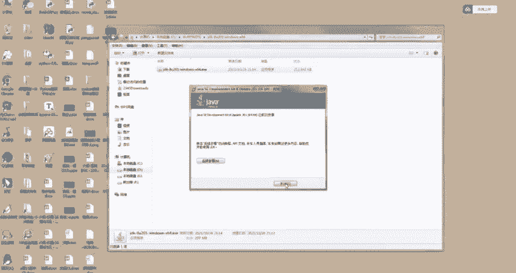
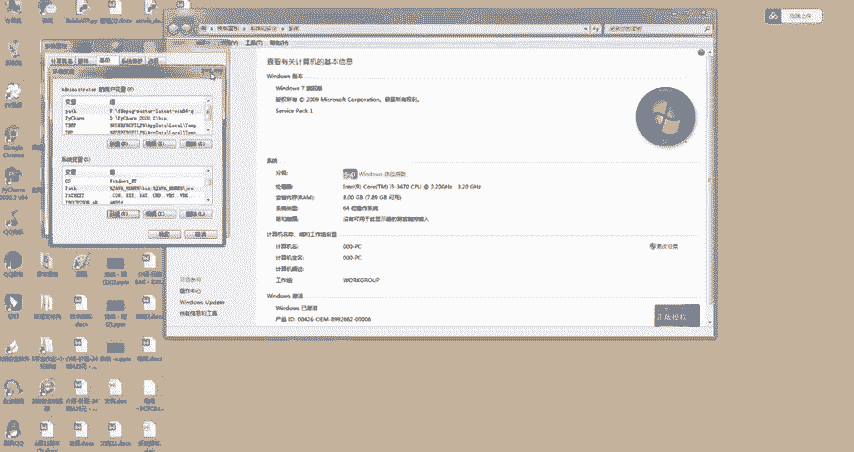
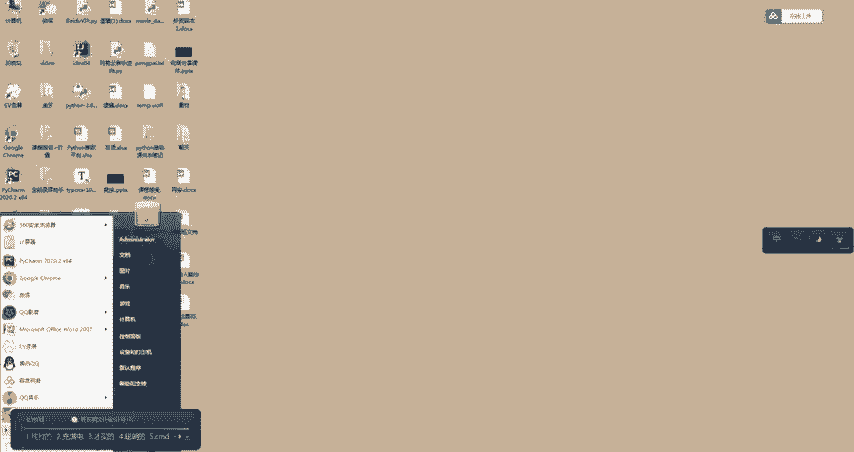
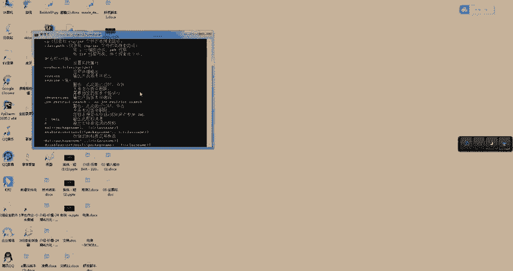
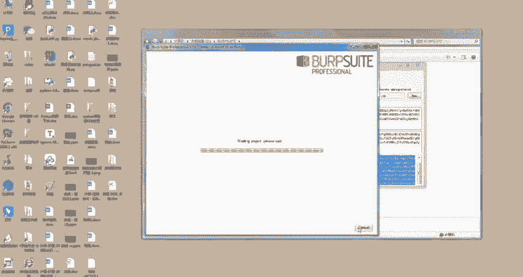
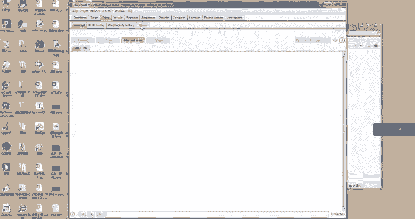
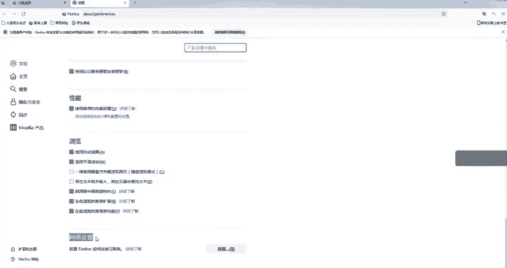
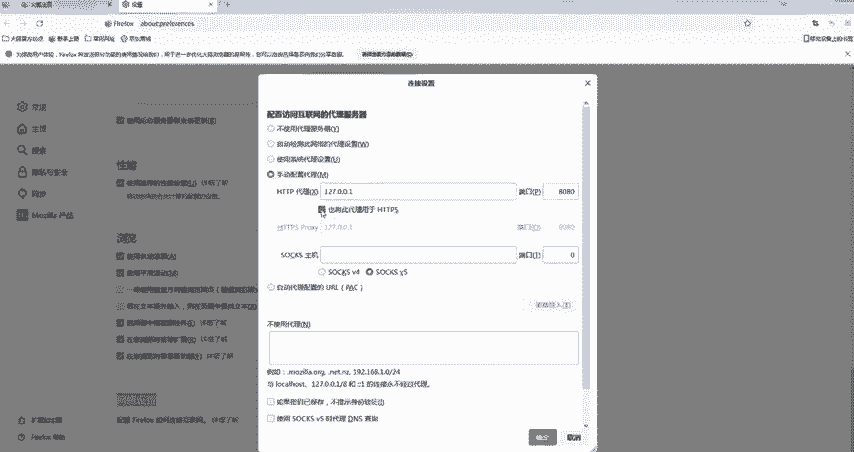
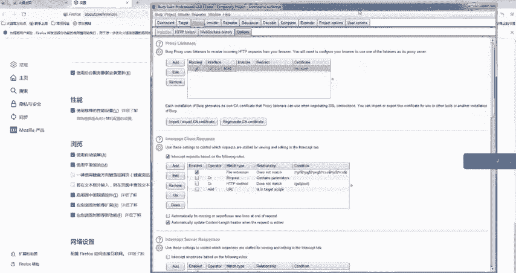

# B站高质量CTF比赛工具使用教程合集，100个入门到进阶CTF工具使用讲解，保姆式教程，附工具安装包，拿不到名次算我的！ - P11：7、burpsuite安装使用教程 - CTF入门教学 - BV1tdejeuEVz

大家好，我是阿青老师。今天的话我跟大家去分享一下bap free它的安装教程。首先我们得了解它是用于攻击we部应用程序的集成平台。所以当中包含了许多bap工具。这些不同的工具。

通过协同工作有效的分享信息，支持以某种工具当中信息为基础提供给另外一种工具使用的方式去发起工具。所以呢它主要作用于安全性渗透测试，可以实现拦截请求爬虫漏洞扫描等强大的功能。那我们现在的话开始安装教程。

我们得知道，那bap free呢它是由java语言编写而成的。所以我们在安装b之前的话，首先先得安装一个GDK1。8的版本，我们把整个程序安装包双击打开一下。好，打开完之后的话，选择下一步就可以了。

那在这里的话，我们需要记住一下自己的安装路径，然后再次点击下一步。OK那等待安装安装完之后的话，点击完成即可。好的，那这个安装完成之后的话，咱们点击关闭，并且呢打开环境变量，跟着阿庆老师操作。

选中我们的计算机右键，点击选择属性。

好，选完属性之后的话，我们需要选择高级系统设置。好，那然后的话呢咱们选择高级系统设置下面的环境变量即可。学完之后的话，我们这里是需要添加三个环境变量的那首先第一个需要添加的环境变量在这里咱们进行新建。

也就是java home这一个环境变量，并且呢这里的话咱们需要新建它的变量值。所以我们想把对应的变量名以及变量值复制一下。也就是刚刚咱们下载它的一个地址。好，那这里第一个咱们就完成了。那第二个的话呢。

咱们需要去新建一个class patch这样的一个变量。所以呢同样的把对应的信息复制进来。变量名以及变量值去进行一个。好，刚刚两个变量，咱们添加完成之后的话，咱们需要选择环境变量当中的p变量。

可以双击去进行点击。那首先的话呢，咱们需要添加两行java的路径。路径的话也就是刚刚咱们保存的GDK它的对应的路径就可以。最后的话呢咱们再新建一个变量。那新建的变量同样的变量名为pach。

并且呢它的变量值的话，也同样的为这样的一串代码。好，然后咱们点击确定点击确定提交就可以了。那这一个实现之后的话，咱们再去看一下刚刚的安装操作是否成功。所以呢咱们需要打开我们的CMD命令窗口去运行一下。

打开之后的话，输入java去进行查看，按一下回车。如果出现像这样的界面，就表示我们GDK已经安装成功。好的，同学们，那我们接下来的话呢将baQ给下载好。首先我们双击打开该软件。然后它会弹出以下的窗口。

我们点击右边的run这一个按键。

点击完之后，它会弹出对应的小窗口，我们需要稍等一下，等它的窗口全部加载下来。OK然后我们把破解码复制进去，点击last点击完之后的话，点击第三个软按键即可。OK点击完之后。

其实我们会发现它分为了左右两个窗口。我们需要把左边窗口这里的代码复制进台，然后粘贴到右边。然后右边的窗口的话呢，它也会出现新的代码。好。

那接下来我们的步骤其实也是将右边最下面的代码哎复制进来粘贴到最左边的窗口，并且点击n。那其实到这一步的话，咱们整个程序就已经安装完成了。我们已经成功了，就点击finish。

然后我们就可以正常的使用这一个软件了。好，那我们现在的话这个软件安装成功之后，我们其实选择默认的软件即可。那默认的软件也就是第一个这样的选项，它是默认的那我们。点击next。直接可以进入。好。

点击完之后的话，点击直接开始start开始它。

然后打开软件之后的话，我们也需要做一件事情。第一件事情其实就是需要去调试软件和浏览器的代理，让它能够正常的进行工作以及抓包。所以在这里的话呢，我们这里点击第三个选项，然后唉点击最后这一个选项。

大家可以看到在这里的话我设置的是8080这样的一个端口。那其实点击到这个位置的话，大家就可以根据自己的个人设置来决定。嗯，并且我也有一个小建议，我更加建议大家选择8080窗口。

因为这里的话它是没有很大的影响的那接下来的话其实我们就可以随意的打开一个浏览器。嗯，阿青老师也是更加建议大家使用火狐浏览器。因为火狐浏览器的话呢，它的设置比较的全面。好的，那接下来的话呢。

我们随意的去点开一个浏览器。

这里我以火狐为例，打开浏览器之后，我们需要选择左上角的设置按键，然后在常规这一个选项框里面，我们往下拉拉到最底下的话，可以看到一个叫做网络设置的。同样点击设置即可。好，点击完设置之后。

在这里我们需要选择手动去配置代理，并且呢需要和阿星老师一样，我们将这一个配置去配置好。那在这里的话必须记住端口必须和8yq上面是一致的。所以我们也把它设置为8080。而且这里还有一个需要提醒的点。

就是如果手动设置了代理，但是没有打开8yq的话，可能浏览器它会访问不了其他的网站。所以建议在使用bq的时候，我们配置代理。那如果不使用的话呢，bq就可以不用设置配置代理。好，那然后我们需要把这一个选项。

也给他选择上去，点击确认几个。好，那这个设置的话，其实我们就已经设置好了。然后其实现在我们就算随便去呃浏览一个网站，也会被芭皮树给抓。

