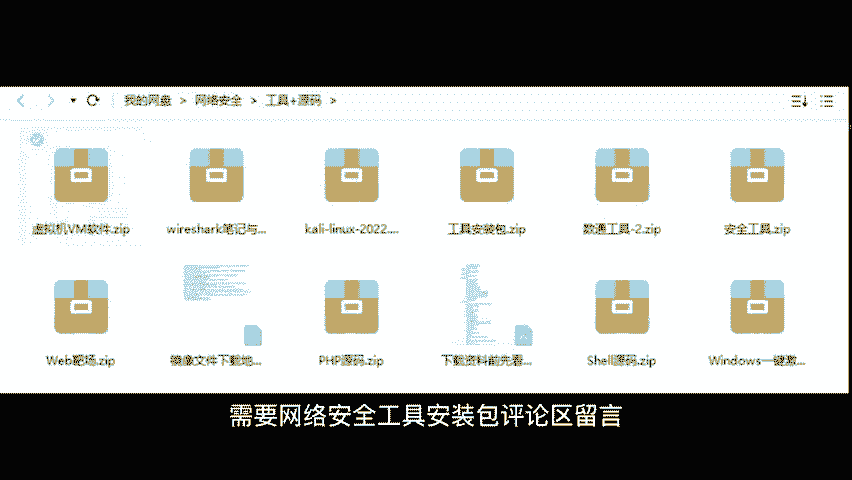

# B站高质量CTF比赛工具使用教程合集，100个入门到进阶CTF工具使用讲解，保姆式教程，附工具安装包，拿不到名次算我的！ - P12：8、sql map 安装教程 - CTF入门教学 - BV1tdejeuEVz

。

中点。曾经有人问过我这样的一个问题，真正的黑客都是用什么工具去挖掘漏洞的那肯定不是铲子。大家好，我是阿星。在黑客圈当中的话，有一个非常强大的漏洞挖掘工具但是这个工具使用起来有一定的门槛需要系统的学习。

不适合刚入行的学习者。那过程的话就好像给你一本武功秘籍，然后让你去跟泰森打一场，那么有没有一种简单无脑，有手就行的漏洞挖掘工具呢？即使通常一些入门的白帽子更多情况下会使用来发现网站的漏洞。

那这里也提醒大家一句，注意任何未授权的渗透都是违法行为。那Q map呢它是一个可以让普通人也能发现网站的漏洞工具，简单到你同时左手右手一个慢动作。

只需要将目标网站的网址附到制造工具里面按一下回撤就可以了。那这里的话阿老师也给大家去演示一下。首先的话我们输入杠。🎼后面的话呢加上我们目标网站的网址，然后杠杠加上delete，哎进行延迟一旧可以。

那在这种情况下，我们按一下回车，整个程序的话就会帮我们运行。如果出现这样的一张图片，这个界面，就意味着我们这一个目标网站，它是有诸如漏洞的OK非常感谢大家的关注。那如果觉得阿青老师视频不错的同学。

也记得给阿青老师一键三连，谢谢大家。