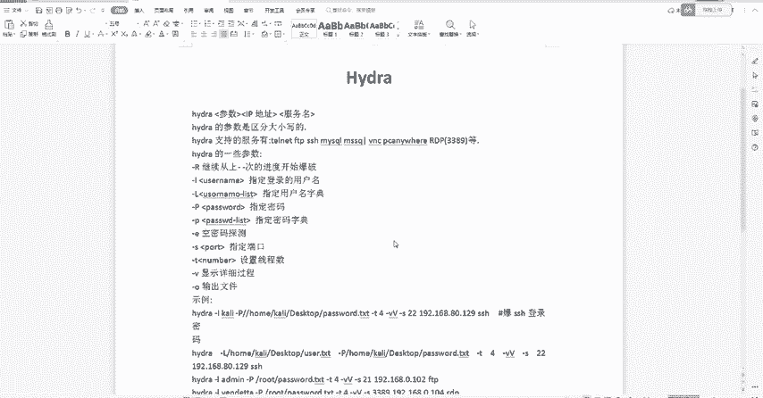
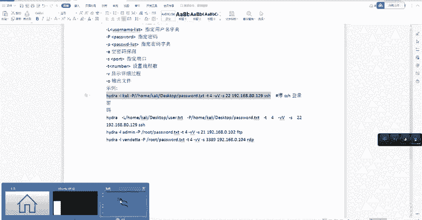
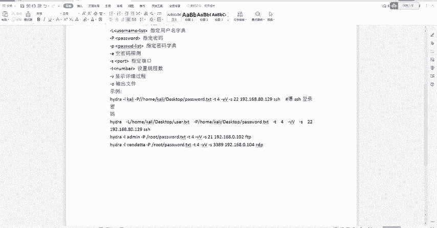

# B站高质量CTF比赛工具使用教程合集，100个入门到进阶CTF工具使用讲解，保姆式教程，附工具安装包，拿不到名次算我的！ - P13：9、Hydra下载安装密码爆破指令使用教程 - CTF入门教学 - BV1tdejeuEVz

大家知道黑客是怎样去爆破目标密码的吗？那这里的话呢，我们回到凯迪当中给大家去演示一下。嗯，我在下课之后会给大家一个使用说明表，大家可以对这个表去操作命令就可以了。那这里的话我们先来延进一遍效果。

我们可以输入对应的1个IP地址，然后的话呢选择好字点，开始爆破。我们按一下回车，我们就可以把它放到一边不用管了。哎，数据跑的差不多之后，我们就可以获取到登录的目标信息以及密码。可以看到这里。

这里就是我们一次爆破出来的信息。这样傻瓜式的操作，学会的扣一，没有学会的扣2，如果还要想要听其他的内容的话呢，也可以在评论区告诉我。好，那接下来我们进入到正题，今天这一节课的话呢。

我们学习hand相关的内容。它是一个暴力破解的工具。安装方式的话，大家可以自己去百度上面自己去寻找一下，当然也可以像阿青老师一样。我们使用这个凯丽系统。因为凯莉系统的话呢非常方便。我们点击一下。上角。

然后选择第五个，我们把它打开看一下，我们会发现唉它上面的话h这个工具已经是支撑好了，就不需要我们自己再去下载以及安装了。那当然它也是支持windows上面的一个安装。

也可以在windows上面去执行命令。这里的话我们就不扩展来讲了。好，我们现在回到笔记当中我们来看一下的一些基本的信息。那首先的话我们得知道它的一个格式。那首先它的格式是哎参数加上IP地址。

紧接着后面跟上服务名。然后它目前支持的暴力破解服务的话呢，也非常多。比如说我们的FTPSSHmy，我们的RDP哎等等等等，它都是可以去支持的。而且这里的话我们需要注意的是它的参数是严格区分大小写的。哎。

不同大小写的参数有不同的含义。那具体的参数的话呢。在这一个地方，这里的话有一些基本的参数信息。比如说小写的L，它代表的作用是指定登录的用户名。那大写的L的话呢，它是指定用户名的质点。小写的P，哎。

它的作用是指定密码。大写的P呢是指定密码的质点。那接下来的话呢，杠S是指定端口数杠T是设置线程数，那包括杠V的话呢，它是显示一个详细的回显信息，回显参数的一个过程。OK那接下来的话我们可以看到嗯。

这里的指令我已经提前写好了，大家只需要去复制粘贴，然后进行一个对应的更改就可以了。这个软件里去操作的时候，其实也非常的简单。我们把这些参数的话呢，打上去就可以执行了。我们来看一下。

那第一个的话呢是爆破SSH的登录密码。那其实这个整个的指令的话，我们一起分析一下。首先的话我们得知道这个爆破的话呢是我们云端的一个服务器。然后这里的话它是一些基本的参数过程。哎。

首先我们通过小写的杠L指定的一个用户名叫做凯丽。然后的话呢通过一个大写的杠P指定了我们的一个密码字点。那后面的话呢就是密码字典它文件所在的一个位置。OK然后加上杠T指定设置线程数为4。

通过杠V的话呢显示详细的过程。哎，然后通过杠S指定端口数。那一般端口数的话呢，我们都会设置成22。接下来的话跟着我们需要爆破的一个目标IT地址。最后的话我们跟上它的一个服务名。

OK这就是一个指令它的一个详细的解析。好，那接下来我们就把这条指令给他复制下来，回到凯利当中去进行演示，这也是阿庆老师刚上课的时候给大家去演示的一个内容。那接着我们已经把。

对应的参数了解清楚之后，对这条指令的话，也应该印象更加的深刻。我们再按一下回车。我们可以看到执行起来的话呢，目前界面就有对应的回显信息，对不对？那它包含什么呢？包含你的登录的用户名包含你登录的密码。

那如果你破解成功的话，是不是这里就有一个对应的提示，包括我们hos哎这个主机的IP等等等等用户名密码等等，都会在这个界面上给你这样的一个展示。那当然如果我们想要去使它速度更快的话呢，我们有额位的方法。

那我们就可以去改一下它的线程数。比如说我们把这个线程数4改成8按一下回车。那这里的话呢，它其实速度也会更快一点。但是它的线程数是有对应的限制的。不是说唉我们想要设置多大，它就可以设置多大的好吗？

这里我们需要注意一下。O那这个了解完之后的话，我们再回到笔记当中，其实除了SHH的话呢。还有FTP和RDP的一个演示。那其实效果是一样的。这里的话我就不额外给大家去做一个演示效果了。

那首先我们来看一下指示就可以了。FTP的话呢，同样的是有它对应的用户名。用户名的话呢是叫做min。那同样的我们也是需要通过杠P加上它的密码文件，对不对？和之前的格式是密模一样的。

加上它的一个线程数加上一个显示内容，加上它的端口是21，最后的话呢，加上目标IP地址以及我们的FTP这个服务名就可以了。有一个小小的变更。然后泡破成功之后，当然也会有账户有密码，有回显信息。

我们正常布之后的话，就可以看到能够登录它的账户密码是什么？好，那除了这个之外的话呢，还会有我们的RDP这个远程桌面。那同样的也是修改对应的一个端口数以及对应的1个IP地址就可以了。

如果远程桌面爆出来之后的话呢，我们可以直接去测试一下它爆破的账户和密码去进行连接。如果可以正常直接登录上的话呢，就说明我们的爆破是没有问题的。OK那这两个演示的话，我们也已经讲完了。

