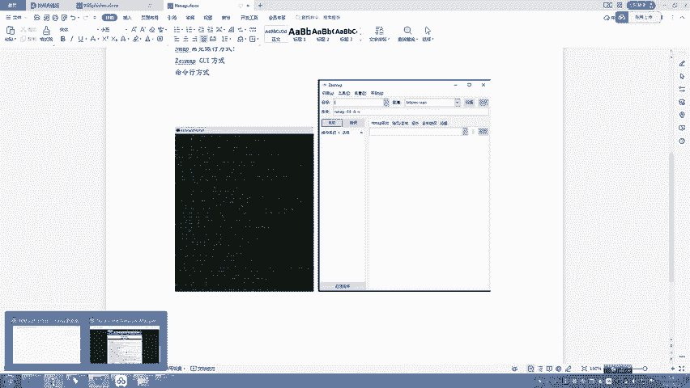
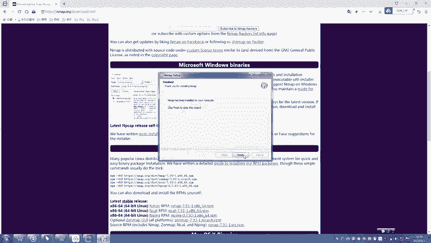
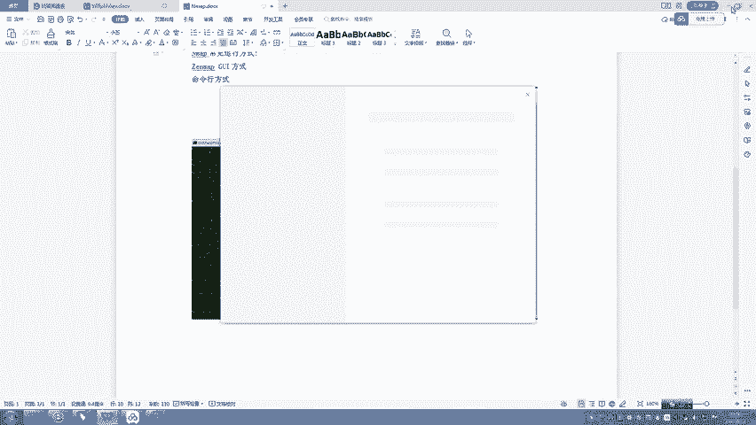
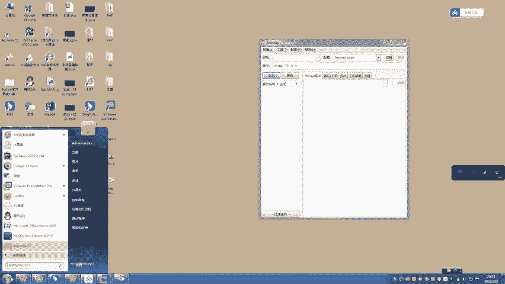
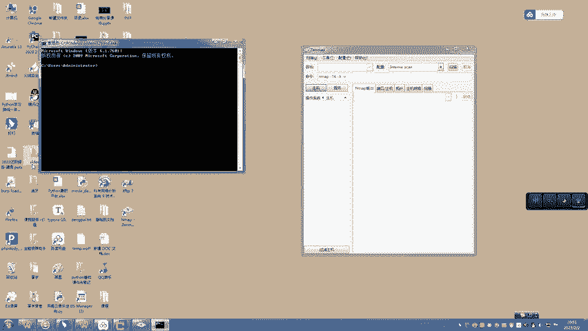
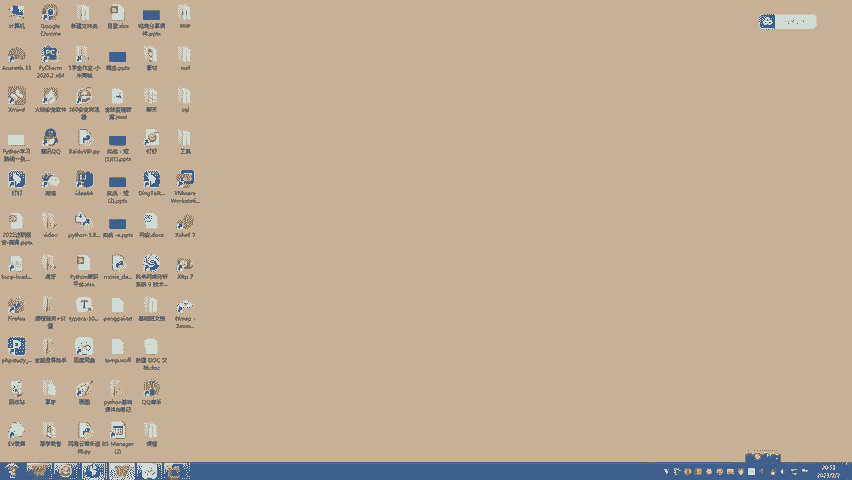
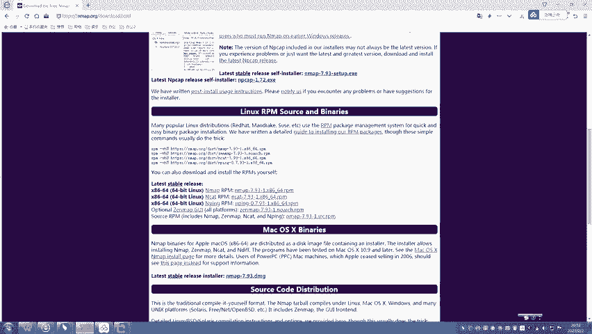

# B站高质量CTF比赛工具使用教程合集，100个入门到进阶CTF工具使用讲解，保姆式教程，附工具安装包，拿不到名次算我的！ - P14：10、nmap安装下载使用教程 - CTF入门教学 - BV1tdejeuEVz

好，大家好，我是阿青老师。那今天的话跟大家介绍一下N map它的下载以及安装。那先跟大家简单介绍一下n map的话呢，它也称为network map。它是一款多平台的网络连接扫描软件。

它可以用来检测计算机上面的主机以及服务。在我们在进行渗透数式的一个初期，为了绘制目标网站它的一个拓扑图，所以呢去测目标网站上面主机的一个运行的操作系统啊，它的一个打开情况，安全过滤机制的情况。

以及我们运行服务情况等等。那这个时候的话我们就需要用到n map对于目标网络去发送它特定的一些数据包，并且呢对返回的数据包的话，去进行详细分析。那这个就是n map一个扫描网络的一个工具。

那n map的话呢，它是用的平台也非常的多。我们的windows max。我们的lin它都是可以的那Nm它主要常见的运行方式的话有两种。第一种的话呢是我们图形界面这样的一个方式。

那第二种的话也是我们更加常见的一些命令行方式。那其实在我的笔记上面，我们也可以看到左边的话呢就是咱们比较常见的这个命令行方式。右边的话呢就是图形化界面的方式。好。

接下来的话跟大家讲一下我们n map它的安装方式。咱们的话呢现在进入浏览器里面。然后在地址栏当中输入到N map点OR机这样的一个官方地址。然后的话呢我们就点击一下dolan下载的页面就可以了。

我们也可以看到对不对？它在这里的话呢提供了各种服务的一个下载方式，windows啊max啊等等都有。那其实的话它也提供对应的一些压缩包。那比如说我们往下翻，我们要在windows下面去下载的话。

那他在这里的话已经提供了ESE这样的一个安装包，我们直接点击。那其实选择对应的下载路径，点击下载就可以了。那这里的话我们也会发现它最新的版本就是7。93这样的一个版本。呃，因为我上课之前的话。

就已经提前把安装包给它下载好了。因为等待的话会比较漫长，所以这里的话直接就带大家去一起来把它安装一下。我们同样把它双击点击一下。OK然后的话呢选择运行程序，然后选择哎我同意。

其实这里的话就是一路点击同一的过程。那到这一步的话，它其实是一些安装的组件。嗯，我们可以看到这里的话其实都已经勾选了。嗯，很多组件的话呢，我们也默认建议的话全部选上就可以。然后点击下一步。

然后选择需要安装的路径。那同样也就下载了C盘里面吧，然后点击下载，那同样的这里的话就是等待它的一个安装的过程，稍等一下下。好，那这里的话我们点击同一哎点击完成。

好，那这里的话我们就已经安装成功了。安装成功之后的话呢，我们回到桌面上面，它会建立起对应的一个快捷键。那我们可以看到这里的话同样的双击打开。我们可以看到哎这样的一个图形化界面的话，我们就已经操作成功。

那同样的我们也可以使用命令行这样的功能。那命令行的话呢是需要我们打开CMD。

OK点击进入，然后输入N map去进行启动就可以。

嗯。好，那这里完成之后的话，接下来我们同样的可以往嗯官网。

好，那这里完成之后的话呢，接下来我们打开官网。官网上面的话呢，我们可以看到还有其他的一些安装方式。那我们可以选择linux系统上面的安装方式。那它这里的话呢提供了PM这样的一个安装包。好。

那同样我们也可以选择苹果操纵系统。它选择了DMG这样的一个格式去进行安装。苹果操纵系统上面的话呢，其实也不需要过多的演示和我们之前的步骤是一模一样的。OK那接着我们最后一步的话，我跟大家去演示一下。

咱们在凯利当中去执行N map这样的一个安装方式。所以我们现在的话回到凯利当中去进行演示。那我们需要打开root终端。然后的话呢非常简单，我们输入N mapap这样的一条指令就可以了。

好，那这里的话我们可以看到n map的话呢，我们就已经成功的运行了。并且呢它其实在下面的话也有介绍n map它里面的一些参数。那大家如果感兴趣的话呢，也可以自己下课之后，把这些参数一个一个的去进行尝试。

那这个的话就是我们凯利当中的一个演示。因为凯利当中的话，它已经是直接预知了nm这样的一个安全工具。所以呢只需要一条命令，我们就可以把它运行了。好，所以说非常的方便。

并且它的功能参数以我们windows其他版本这样的一个工具是没有什么不同的参数都是可以通用的。最后建议一个小点，就是咱们需要注意在命令执行的时候，因为我们minux操作系统它是区分大小写的。

但是呢在windows里面它命令行对大小写的话是没有那么严格的。所以偶尔会有一些特例的情况命令，对不对？在我们windows操作系统当大小。也是不分的。但是呢在我们妞是操作系统当中的话就比较严格。

所以以后我们去运行参数去运行命令的时候，我们需要稍微注意一下。好，那对于它的下载以及安装这一节课的话，我们就讲到这里。如果对阿青老师视频感兴趣的话呢，也记得给阿青老师一键三连，谢谢大家。

