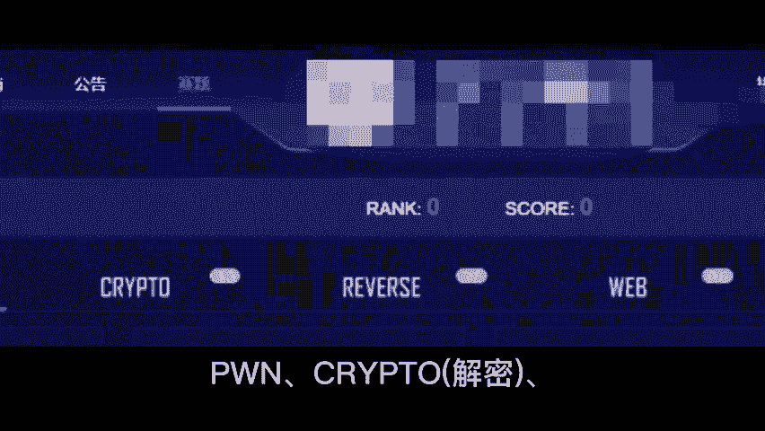
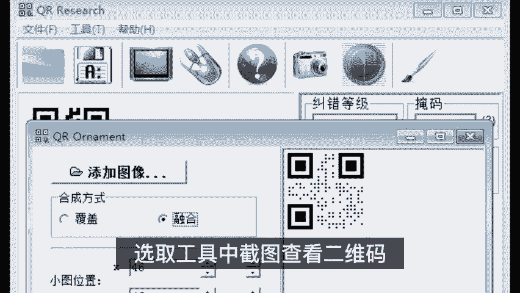
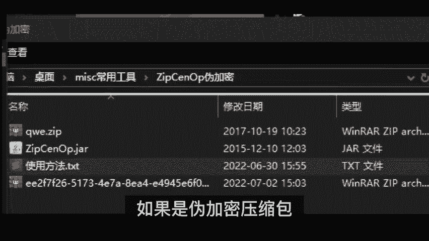
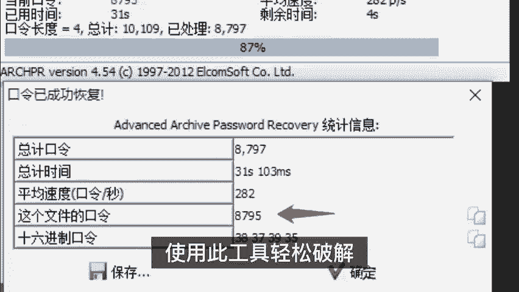
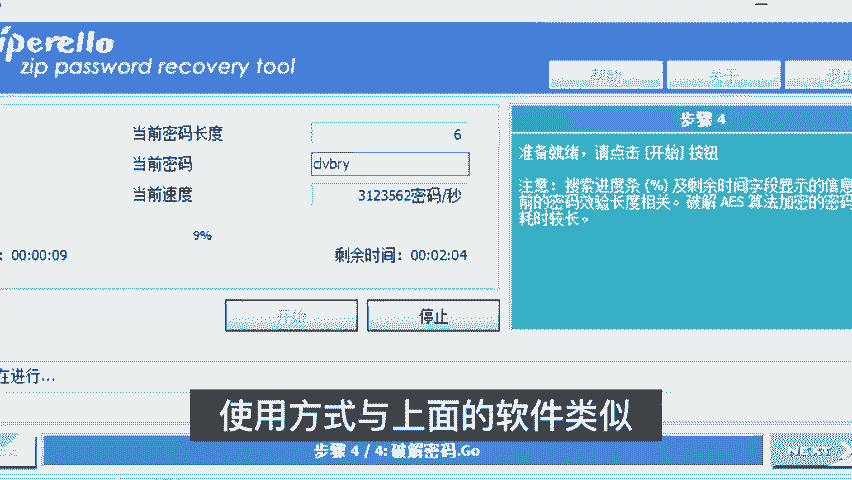
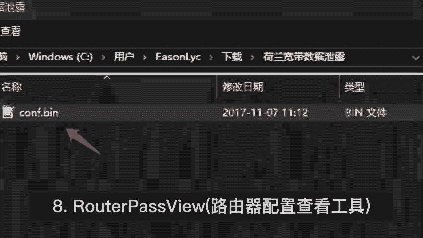
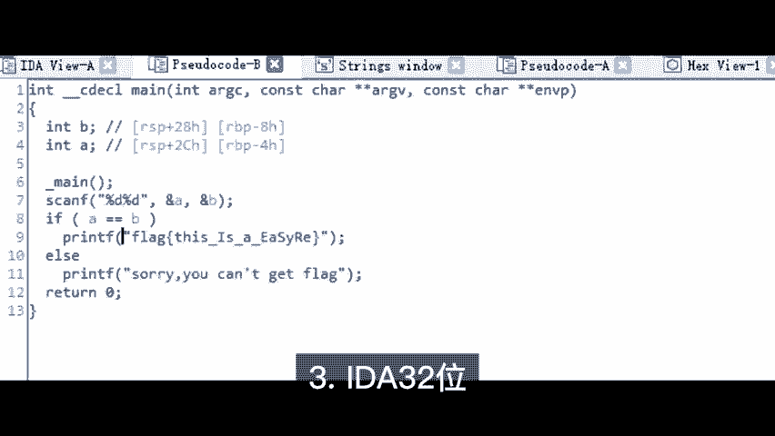
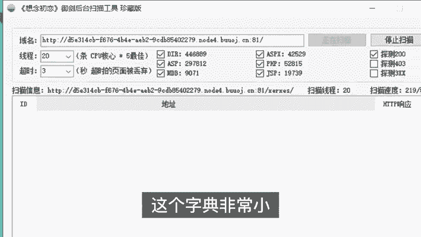

# B站高质量CTF比赛工具使用教程合集，100个入门到进阶CTF工具使用讲解，保姆式教程，附工具安装包，拿不到名次算我的！ - P1：CTF比赛工具分享 - CTF入门教学 - BV1tdejeuEVz

🎼给大家分享13款CTF比赛常用的必备工具，主要包括六大类工具。

🎼解密miss杂一常用miss杂项类工具包含提取莫斯密码辅助工具，把音频文件拖进这个软件摩斯密码就出来了图片音分析工具选中可疑图片打开。

利用4个功能查看图片中隐藏的各种信息二维码具选取工具中截图查看二维码验证是否为伪加密工具，如果设为加密压缩包，只要修改X文件中某位为偶数即可无密码打开密码破解工具L压缩包是加密的打不开。

使用此工具轻松破解密码破解工具使用方式与上面的软件类似不过这个速度更快接近准工业级的破解度序查看调试工具使用很简单，将伪加密压缩包拖进这个文件修改X改为偶数即可破解加密防护路由器配置查看工具。

🎼专门查看某些品牌路由器配置文件的工具。2、常用威博尔斯逆向类工具包含一例判的软件版本和是否有个2ad64位，如文件是64位，那就要用64位打开332位操作与上述相同。

无论是32位还是64位的软件都集成了为代码功能，可放心使用。3CTF常用扫描字典，这个字典非常小，关键是比赛中没有大量时间用在扫描上，所以力求短小精悍，准确率稿。

目前只收录了247个路径或文件全是历似比赛题目中出现过的路径，供参考。可根据自己的实际情况往里面不断添加，需要CTF比赛工具安装包的，可以看评论区。

