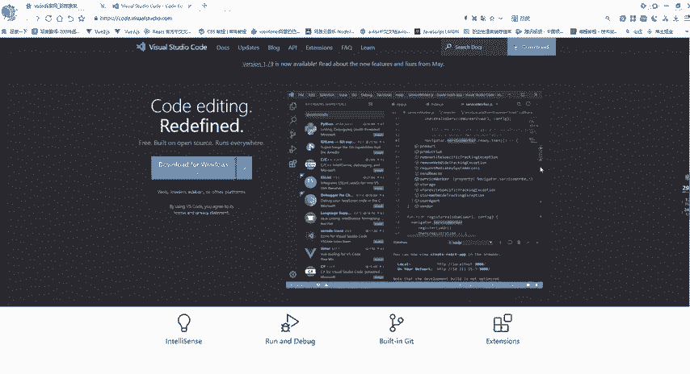
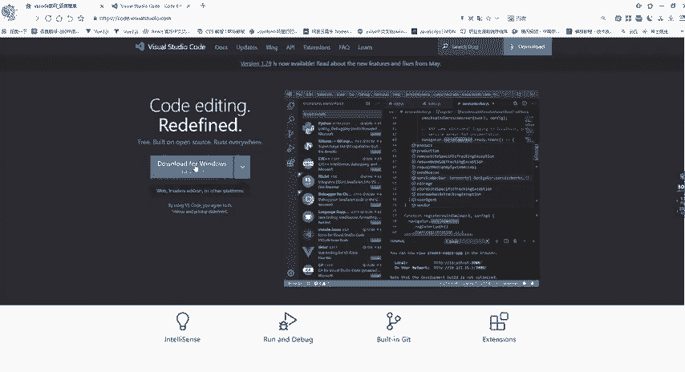
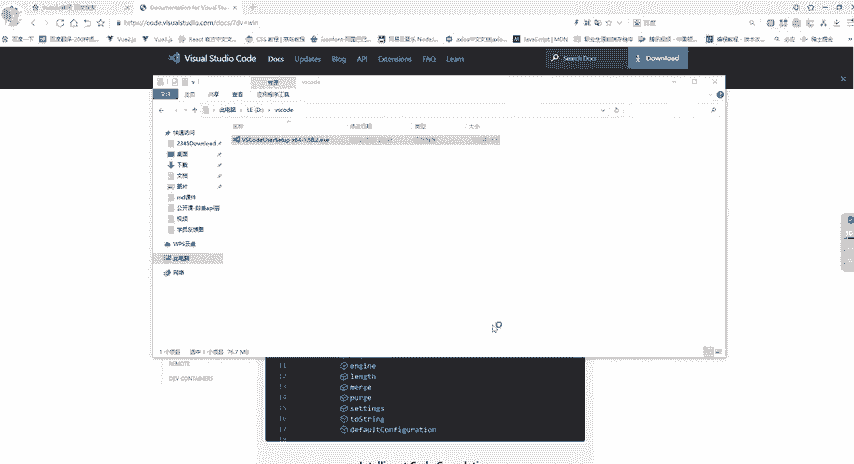
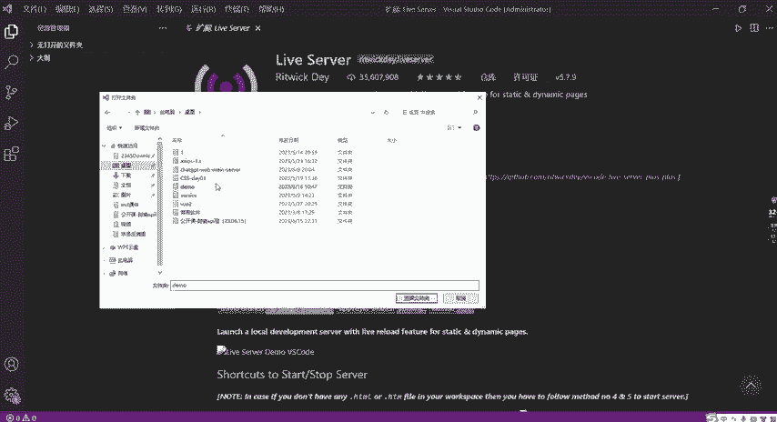
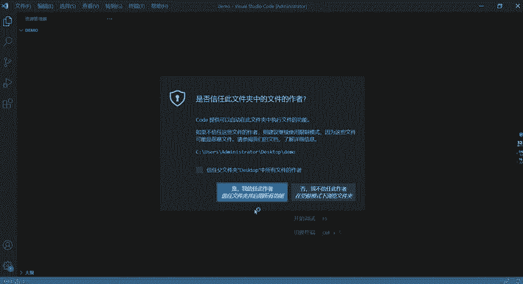
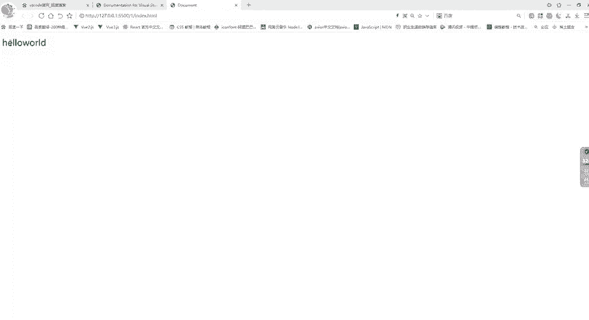
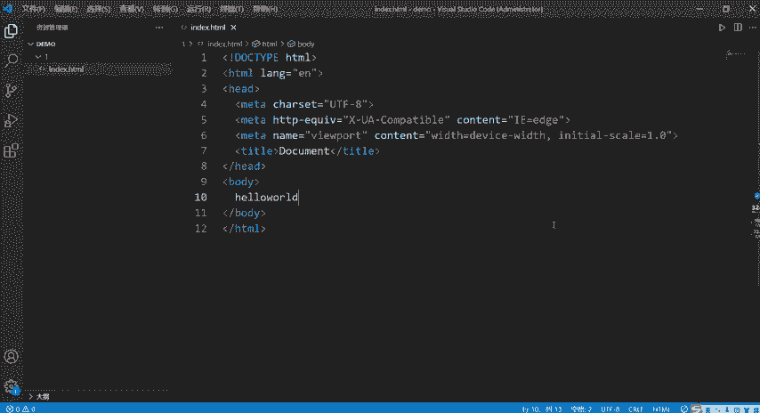

# B站高质量CTF比赛工具使用教程合集，100个入门到进阶CTF工具使用讲解，保姆式教程，附工具安装包，拿不到名次算我的！ - P2：1、vscode的安装使用教程 - CTF入门教学 - BV1tdejeuEVz

今天我来和大家呢分享一下vissco这一个软件，它的安装过程。我们从下载到安装，再到呢创建项目，我们来完整的呢带着大家走一遍。

那么首先的话呢，我们先来看一看如何下载，进入到百度搜索呢visscor的这一个啊官网。这的话呢应该是搜索啊vissco啊。进来之后，那么我们进入到啊这一个呢网站，这个的话就是呢mi cold呢官方网站。

进来之后，那么会看到呢这样的一个页面。现在呢我们要进行下载，那就直接呢点击这个下载按钮，你可以去选择啊你自己对应的这个呢电脑自己对应的这个系统呢去进行下载就可以了。那么我的是呢windows。

所以说我们直接呢下载windows，稍微等待一会儿，那么它会呢弹出一个呢小窗口出来。这个的话呢就是我们要去进行呢下载的。

这个位置下载到那里，对应自己的这一个磁盘下面的目录，自己呢可以去进行呢选择去进行修改。然后这一个的话呢，不用去管，我们直接点击下载就可以了。那我在这个地方的话呢，是已经呢下载好了一个。

所以我就呢没有再去呢下载了。当家呢可以按照我刚才跟大家说的这个步骤去下载一下就可以了。下载好了之后，那么在我们的这个呢文件夹里面，我们会有呢这样的一个viss的这个应用程序。当然我这个版本的话不太一样。

因为呢我们这里下载的话是一个呢最新的。当然如果说你想跟我下载呢一模一样的版本啊，也是可以的，可以在这个地方呢去选择就可以了。这有一个呢版本去选择，那么就OK了。🎼那么这一个的话都是一样的啊，打开之后。

我们现在这个地方呢双击双击，然后呢点击啊安装这个位置呢会有一个啊我同意此协议点击勾选，那我们就可以呢选择下一步。这个位置呢就是我们想把这个vissco这个软件安装在我们的哪一个目录下面。

那你就可以自己呢去选择就可以了。比如说我想安装在呢D盘，那么你就选择到了对应自己的这一个呢目录就OK了。选择好了之后，这个时候呢我们再选择了下一步，这个不用改。然后下一步，下一步之后把这个啊勾选一下。

创建呢桌面快捷快捷方式。这个的话呢我们就不需要自己呢再去额外的创建这个呢快捷方式了。勾选住了之后，点击呢下一步，然后直接呢安装就可以了。那我们就稍微等待它呢安装完成。好，安装完成之后呢。

在这个地方它有一个默认默认啊勾选的这一个呢。内容就是说呢运行vissco，也就是我们在这个地方点击完成之后，它会默认的帮我们自动呢去打开这个viss code。所以点击完成，我们稍微等一会儿。

它会自动帮我们去呢打开。

打开之后的话，注意一下同学们，你们所看到的这个界面和我现在所看到的这个界面是不一样的啊。因为在我这个地方的话呢，我是将我之前我自己已经安装好了的这个vis code把它卸载掉。重装之后。

那这个时候的话呢，它能够啊记录着呢我之前的这一些插件。你看我们在这个地方的话呢，我是之前我有安装一些插件，它一样的呢给我们缓存下来了。那么我们在第一次下载的时候呢，它会是一个呢英文的一些内容。

它会是一些啊英文的这一些呢内容。然后上面这一个的话呢，就是我们的一些呢菜单栏左边的这一些内容。就比如说啊我们的这一些呢自源管理器啊，或者说我们的一些呢扩展呢这一些呢符号。

这一些我们只需要呢暂时注意两个就可以了。第一个就这个。第二个就是我们的这一部分。我们先暂时啊，先看这两个这一个的话呢就是。我们的一些呢自源管理器，比如说我们的一些文件夹，我们打开的一些项目啊。

那就是放在这个位置，这个用来干什么呢？这个就是我们去安装一些扩展，安装一些插件。比如说如果说大家想把我们的这个变成像我一样的这种中文的形式。

那么我们是需要先去安装一个呢插件的怎么走来到我们的这个扩展里面点击这个呢扩展，在这个位置呢去搜索一下，搜索了我们的这个。然后你就选择了这个就可以了。如果说你要选择繁体，也可以选择繁体。

那么一般的话呢我们是选择这个呢简体的。然后我们在这个地方去进行了一个instore。它这个英文的名字的话叫做呢instore。大家就按住这个因速安装，安装好了之后，然后把我们的这一个呢擦掉。

把这个软件关掉，关掉之后重新打开，那么它就会变成这个呢中文的方式。这个就是呢怎么去变成和我一模一样的这种方式，我就没有跟大家去演示了。大家按照我刚才跟大家去讲的去做一遍就可以了。安装一下我们的这个插件。

好，这一个安装好了之后，我们还需要再去呢安装一个插件，叫做呢leave server。这个的话呢就是我们能够呢想要去在我们的浏览器里面去打开我们呢自己编写的这一些页面。比如说我们的呢HTM页面。

那这个时候的话呢，我们就要借助这个插件帮我们在浏览器里面呢去打开。所以说我们同样的也在这个地方去搜索一下leave server进行一个安装，安装好了之后。

这两个我们就可以呢来开始去编写一下呢我们的这个代码。那么现在的话呢，我们来到上面这个文件，选择我们来取认哪一个啊。这个是打开文件，我们现在去打开一个文件夹。找到我们的这个啊桌面。

我在桌面的话有新建一个呢，这个啊叫做demo，然后来点击呢选择文件夹。

选择了这一个啊是我信任了okK了。打开之后，你看在我们的这个自用管理器下面呢，就会有一个demo这样的一个文件夹。那现在我们要去新建一个Hm文件。所以说在这个位置，第一个是我们新建文件。

第二个呢是我们新建文件夹。我们暂时呢也只需要看这两个就可以了。那现在呢如果说我们想新建文件夹。那么就在这个地方呢去新建一个文件夹。你看在这个地方就是新建的文件夹。如果说我们想去新建一个文件。

那我们就在这个地方呢去新建一个文件，我就d点H这个的话呢就是新建一个Hm页面吧。好回车在这个里面的话呢，它不会帮我们自动去生成起什么东西，需要我们先手动的呢，敲一个英文的一个感叹号，注意是英文的感叹号。

然后它会给我们这样的一个提示，这个是vis呢，它自动呢给我们的提示，那我们就选中第一个它会帮我们自动去生成这一些呢模板。那这个的话呢就是我们去编写了1个HTMR页面的一个呢基本的模板。

我们就不需要呢自己去手动呢编写。那我们写内容呢，一般就是写在这个呢bodyy里面。假设我们先来写一个呢hello word。好，现在的话呢我们想要去把它给打开，打开的话，我们来右击。先保存一下啊。

我们先按住我们的这个呢ctrol加上S保存。然后我们来到这个地方，右击右击之后，这个地方呢看到没有？它有一个呢叫做open with server leave server。只要你安装好了这个插件。

那么它就会在右机里面有这样的一个呢操作。我们就直接点击这个open with lover server。打开，那么它就会在你默认，也就是你自己电脑默认选中的这个浏览器里面呢。

去打开我们的这个index点HI页面，那就会显示我们对应的呢hello word这些内容。那么这个的话就是我们的这个呢vis。我们要去进行了首次安装的话，我们先需要去做一些什么操作。

先需要注意一些什么内容，先去安装一些什么东西。以及我们是如何去创建我们的这些文件，创建我们的这些项目。那我们就跟大家啊做了一下呢简单的一个讲解。

