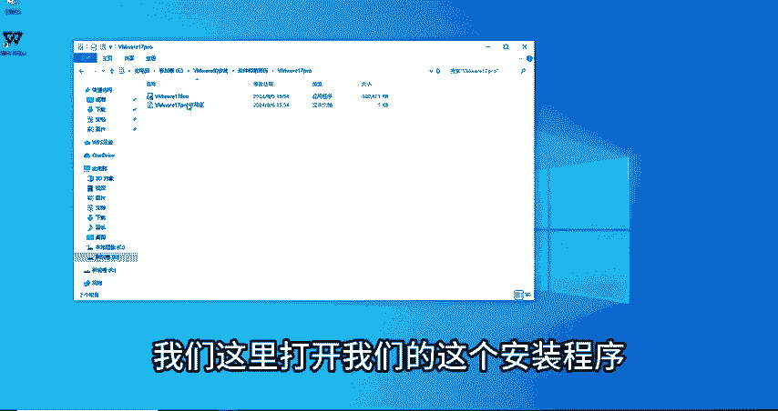
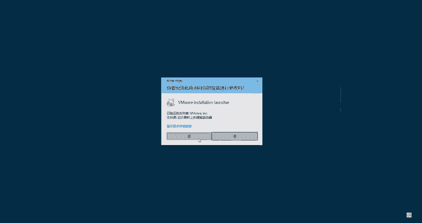
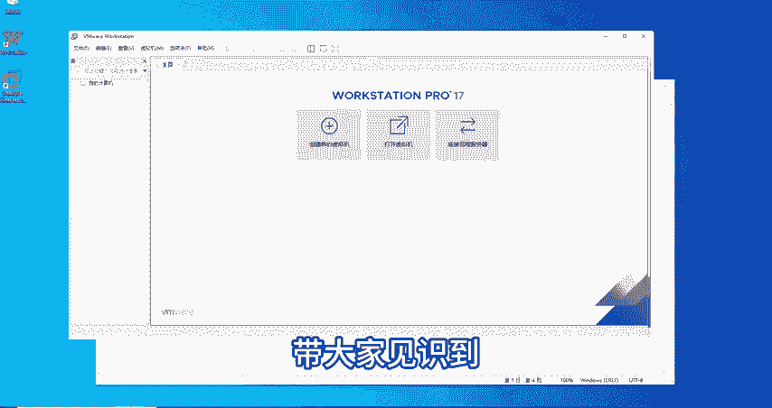

# B站高质量CTF比赛工具使用教程合集，100个入门到进阶CTF工具使用讲解，保姆式教程，附工具安装包，拿不到名次算我的！ - P3：2.VMware的安装与激活教程 - CTF入门教学 - BV1tdejeuEVz

哎，我到凯y里面来了哦，我想到凯y里面输入一个指令哦，打开哎，我又到windows来了哦，我到windows里面刷新刷新，哎，我又可以回到凯里里面。OK各位同学大家好，我是海绵老师。

今天带大家装vemenwarework stationation pro这一款软件。好，我们先了解一下这款软件是什么。这款软件呢是由专业的技术人员、开发人员和企业用户设计的一个桌面虚拟化的应用程序。

也就是我们平常所说到的虚拟机。好，它呢包括我们的lininux发行版windows版本以及其他操作系统的版本。那我们用的最多的呢就是windows版本。我们会在windows版本下装这样一款软件去。

玩我们的linux也好，我们的mcro OS也好。好，那我们话不多说，直接进入到我们的安装教程。首先我们今天准备的一个环境是一个win10的系统，然后老师这里已经准备好了viware17pro。

也是我们最新版的一个安装程序和我们的激活码。好，这些环境工具和软件我可以分享给大家，一起进步，一起学习。您放在评论区，有需要的小伙伴评论私信我就可以了。好。我们这里打开我们的这个安装程序双击。

好。

点击式老师这里也准备了。非常详细的图文安装的一个。笔记有需要的同学也是一样的，可以在评论区评论。好，先说起来。我们这里双击打开之后会看到有一个这样的一个安装向导。我们点击下一步。出现用户许可协议。

感兴趣可以看一下，我们点击接受，然后进行下一步。到这个自定义安装的界面，这里我们可以将安装位置更改到。我们的E盘或者D盘，因放C盘，它会慢慢的增加我们C盘的空间。有时候不太好清理。我们这里。

输入一下他的名字，有啊。创建一个新的文件夹啊，确定。好，安装位置这里已经变化了，看到没有？进行下一步。好，这里再下一步。这个更新哦，有的同学如果说就一直用这个版本的话，其实可以把它关掉。

然后这个用户体验的话可以加入没关系。然后这里创建文文。创建这个文明尔的一个快捷方式，桌面以及程序文件夹都勾上，下一步默认就好了。好，这样我们就可以安装了，点击安装等待一下。好，在等待的同时呢。

这里这节课我们也有几个新的专业术语，带同学们了解一下。首先第一个就是嗯点IFO。文件是什么？点ISO文件呢是我们电脑上光盘镜像的一个存储格式之一。也就是说它是一一个镜像文件，那镜像文件又是什么呢？嗯。

来举一个比喻吧，这项文件可以类比成我们图书馆中间的一本书的一个副本。就想象一下，如果你有一本珍贵的书，那我们为了不保不让原书去损坏的情况下，我们可以做一个完美的一个复制品出来。

那么镜像文件呢大概就是这个样子。在我们计算机的领域，镜像文件就是一个复制品，它是存储设备，就比如硬盘CDDVD等等一个精确的副本。好，大家就这样大概。理解一下就可以了啊。好。

我们继续进入到我们刚刚的这里等待的界面。好，等待过后呢，它会到这样一个界面。这样一个界面，这里有一个许可证，看到没有？这款软件是需要激活的，因为是pro版本。那我们点击这个许可证。好。

老师已经为大家提前准备好这个许可证了，我们双击打开，然后ctrl C复制。😊，把它粘贴上来。输入。OK这已经完成了，点击完成按钮就可以退出了。好，完成之后，我们的桌面就出现了。😊。

moware这一款软件好，双击打开。有点慢啊。好，打开之后进入到主页是这样一个界面。同学们可以看到这里有创建新的虚拟机，打开虚拟机以及连接远程服务器这三个选项。😊，好，这节课我们就讲到这里。

下节课老师将带大家。创建新的虚拟机，以及打开虚拟机，带大家坚识到怎么运用我们的这样一款软件。好，那我们来回顾一下这节课我们讲到一些哪些内容。

首先我们就是打开了我们备好的程序，输入了许可证激活，然后进入到主界面。好，这节课总结一下啊，有我们的介绍环境准备以及专业术语和我们的安装流程。好，这里所用到的所有环境工具以及软件。

同学们有需要的可以到评论区私信我。