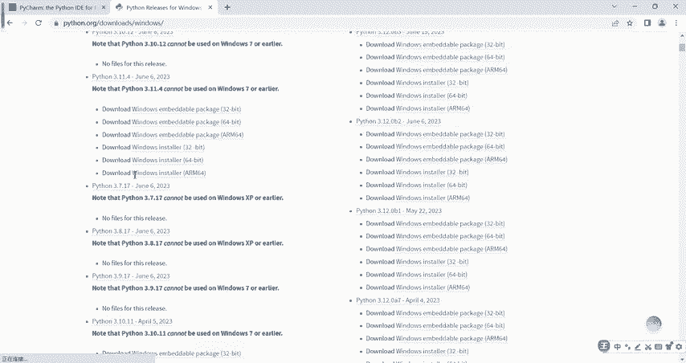
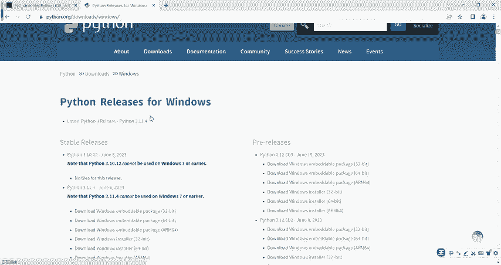
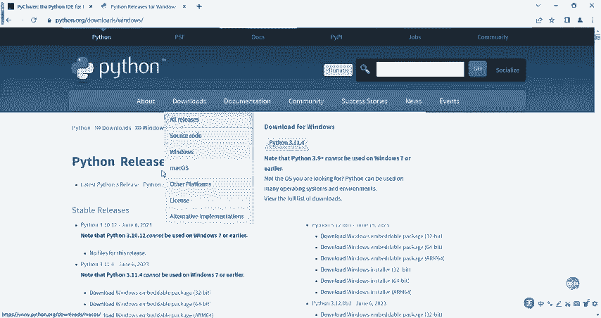
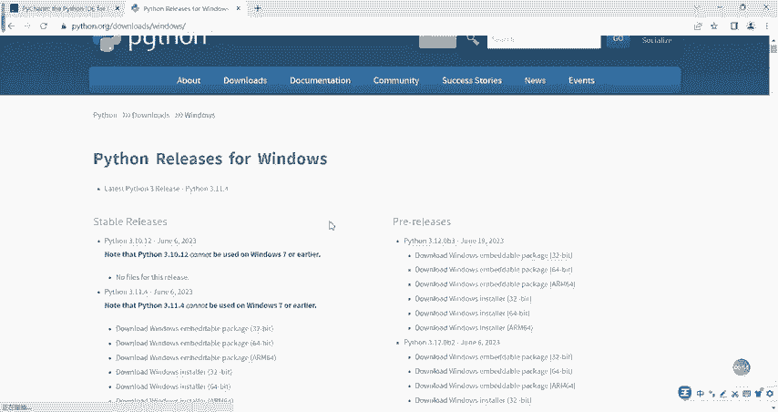
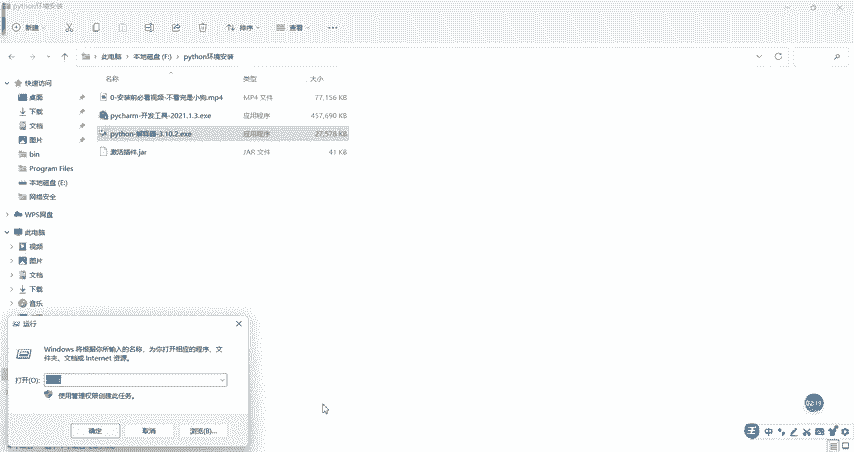
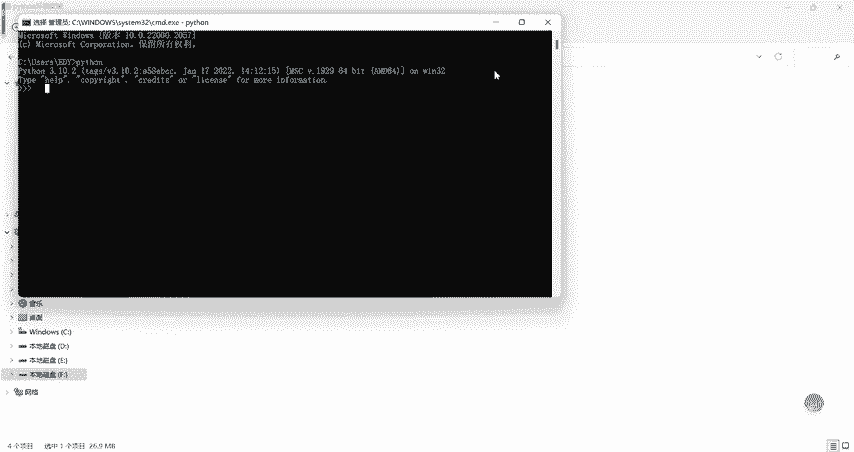

# B站高质量CTF比赛工具使用教程合集，100个入门到进阶CTF工具使用讲解，保姆式教程，附工具安装包，拿不到名次算我的！ - P4：3.1python环境之解释器安装 - CTF入门教学 - BV1tdejeuEVz

OK那我们看一下python学习环境要装哪些软件呢？嗯，有两个软件需要大家体前装，第一个叫python解释器软件，第二个叫P charmM开发开发工具。呃，解释器软件怎么安装呢？非常简单。

在我们的大家可以打开这个网页啊，这个网址。点进来之后，然后的话我们可以找到我们要安装的版本。这个版本的话呃，温馨提示下，你如果说你是windows的话，这个地方点windows就可以了啊，把它下下来。

如果你是其他操作系统的话，你看这里头你是mic克点mic克对吧？进来有很多mic克的版本。但是呢如果说你的电脑是win7操作系统以下，那你这个地方找那个版本的时候，要找什么呢？找这个python3。3。

7以下的啊，因为其他版本高版本，它是不支持winI7以及以下的这种这种低版本的操作系统版本。好吧，然后的话为了节约时间呢，我也把这个版本给它下载到我们本地电脑，大家看到没有？

这就是我们的解释器的下下来的软件，怎么安装非常简单，双击。😊。

双击打开打开之后的话，怎么安装呢？我们直接的点击自定义安装呢？这个地方点击A啊勾上，为什么？因为我们如果说要用一些终端什么CMD啊，这种终端指令打开pyython运营程序的时候。

你要把它把这个加到我们的环境变动来，你没加的话，它用不了了。点击自定义安装，对吧？然后的话这个点next。安装的目录的话呃，怎么说呢？安装目录的话，你自己定啊，尽量尽量定义这个目录的时候。

不要有不要有那个中文的文字。比方说我这里取了个名字啊，叫pyon。😡，我安装的C盘好吧。文件夹不要安装到中文目录下面去啊，方便我们以后万一出现一些乱七八糟的问题，对吧？点inststore。

这个时候正在安装我们的pyython解释器，我们的第一个软件啊，非常快，对吧，马上就安装完了。安装完之后，我们怎么样来验证它是安装成功还是失败。很简单。

点击close在我们的电脑的这个左下角有一个开始键，右键点击运行，输入CMD回车。我们敲一个python，看它有没有反应。

哎，如果说提示这样的一个界面，就表示我们的第一个软件已经安装完了。啊，已撞完了。

