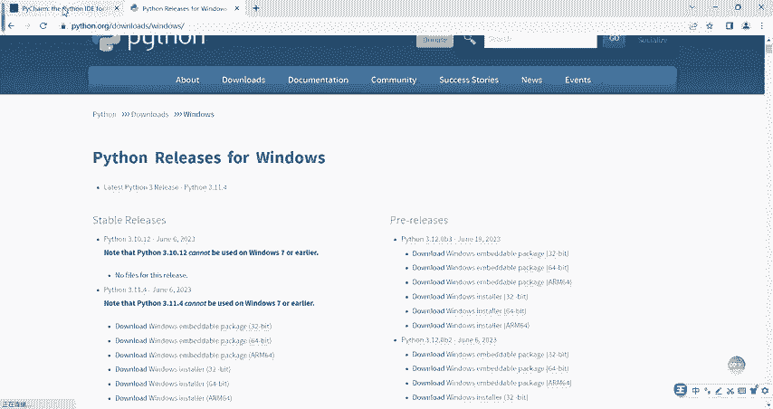
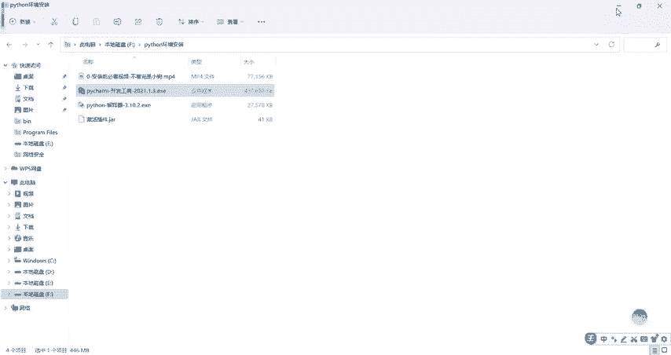
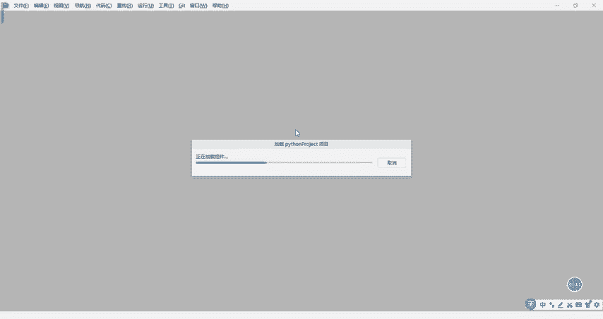
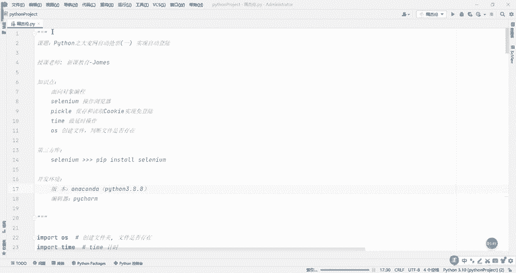
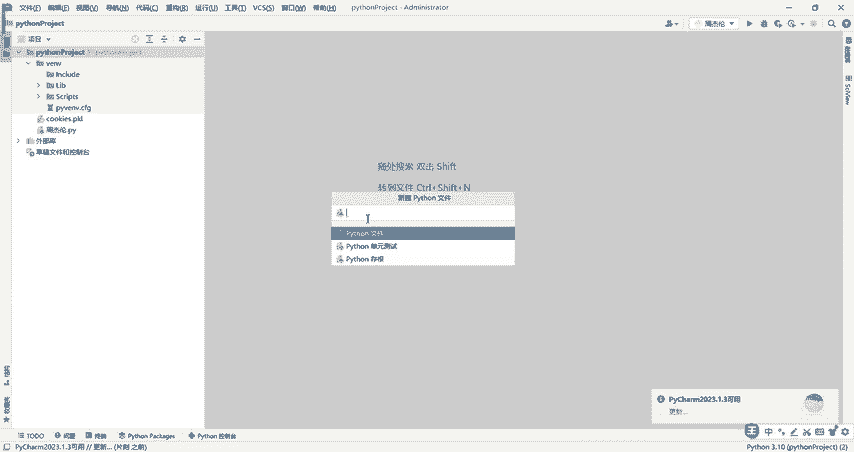
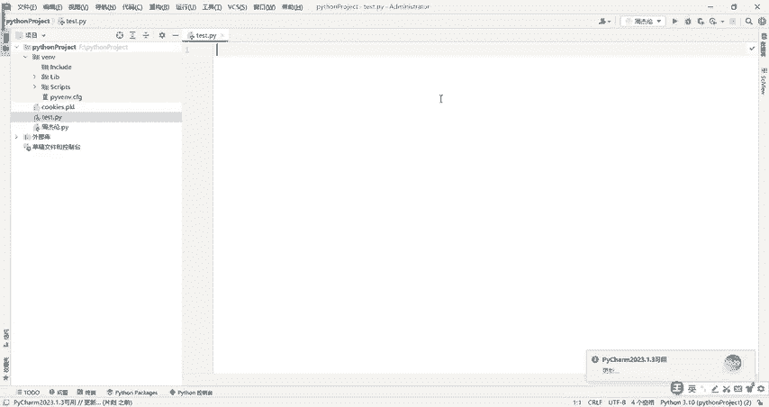

# B站高质量CTF比赛工具使用教程合集，100个入门到进阶CTF工具使用讲解，保姆式教程，附工具安装包，拿不到名次算我的！ - P5：3.2python环境之Pycharm软件安装 - CTF入门教学 - BV1tdejeuEVz

当我们把解释器安装完之后，第二步要干嘛呢？第二步，安装我们的代码编辑器软件叫P charm，建议大家用这个P项码。那打开我们这个网址，这里头呢有一个叫download的，看到没有？点download的。

啊，然后的话点到note之后的话，把它下到本地电脑上来。当然所有用到的这个软件啊，我已经帮你们放到评论区了啊，自己到评论区去看。好吧，有需要的话，然后的话下载来之后怎么安装呢？安装的话，直接点双击。

这里头重点要关注的是怎么样激活。

然后的话你把它装到哪个地方去，它会有提示。点击下一步安装到哪里呢？这个目录的话，我就直接用默认的目录了啊。next这个四个给它全勾上。点nex。安装这个地方安装的话，需要个。啊。

十来秒钟电脑如果配置好的话，配置不好的话，可能需要三四十秒钟、四五十秒钟，我们稍等一下。OK马上要安装好了。这个进度条的话到顶我们就安装好了。安装好之后，接下来的话我们稍等一下，点击这个。

这个next就可以了。他问我们要不要重启，我就不用重启了，不然我电脑会重启点。Finish。当我们点击finish安装完之后啊，在我们的桌面它会有一个。

那这就是我们刚刚安装好好的软件，启动的快捷键怎么启动啊，双击打开就可以了啊。😊。

稍等一下，第一次加载的话，它会稍微有点点慢啊，这是它默认的关联到我的工作目录去了啊，默认已经关联到了。

这表示什么呢？表示我们的开发工具已经安装成功了。比方说我可以干嘛呢？可以新建一些paon文件，什么的paon文件，我们写代码的地方对吧右键。啊，新建一个python文件。对吧我们随便写一个叫test。

回车那在这个地方就可以写代码了啊，至于这个呃P7M它怎么样激活，我待会会讲到啊，如果说相关的软件呃，大家有需要的话，评论区自取。

