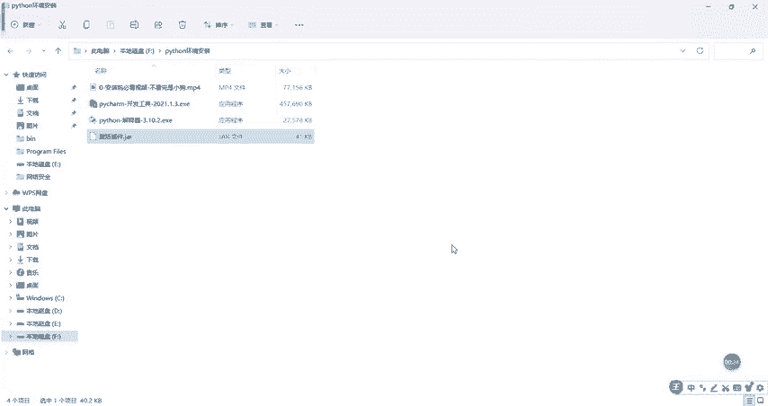
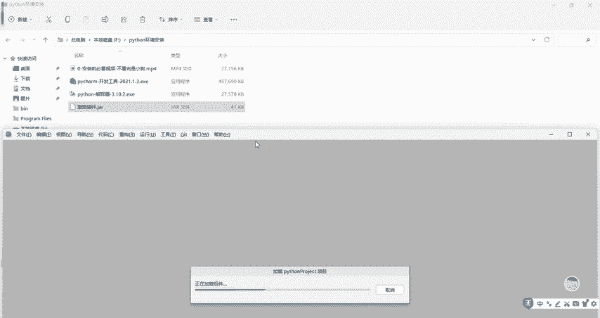
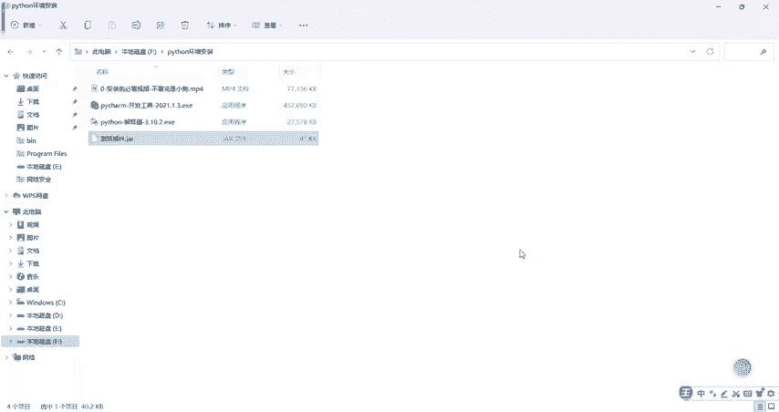

# B站高质量CTF比赛工具使用教程合集，100个入门到进阶CTF工具使用讲解，保姆式教程，附工具安装包，拿不到名次算我的！ - P6：3.3python环境之Pycharm激活及汉化 - CTF入门教学 - BV1tdejeuEVz

然后这个P7M怎么样激活，我们可以永久的使用呢？非常简单，这里头有一个激活包啊，在这个地方我们呢只要把这个激活包给它拖进来就可以了。拖到哪里来呢？拖到这个工具里头来啊来。拖进来。这个地方呢点击重新启动。

它会把我们这个工具啊重新打开啊。这个激活的插件呃，在评论区啊已经放到评论区了啊。好吧，自有需要去去拿。

打包好了。然后的话当我们丢进来之后，大家看到没有？这个叫什么已插件已经更新，基本上它就已经激活了以后任何时间阶段你都可以用啊，任何时间阶段你都可以用。当然有的小伙伴说老师对吧你这个为什么是一个中文的。

你看那我的是英文的。嗯，我告诉你一个方法，非常简单，怎么样把它汉化？😡，点击这个文件，然后找到这个小扳手设置啊，你们默认是英文的话叫setting啊，setting点一下。它会弹用这个窗口。

这个窗口找到一个叫插件，插件它的英文的话好像是叫intercept吧。intercept找到这个字母I开头点一下点一下之后，这个地方输入什么呢？在插件点到这个marketplace这个地方输入。

输入一个chinese。啊，找到我们这个叫chese simple language，找到这个插件，点一下安装就可以了。你安装，然后重启一下，它会自动的提示，已经安装成功。安装成功。你在打开的时候。

整个工具它就是一个中文版的啊，是一个中文版的，而且的话它是可以永久的呃使用啊。所以这里头用到的所有的激活的插件啊，包括所有的软件啊，都已经帮大家放到打包好，放到评论区了啊，有需要到评论区自取。

