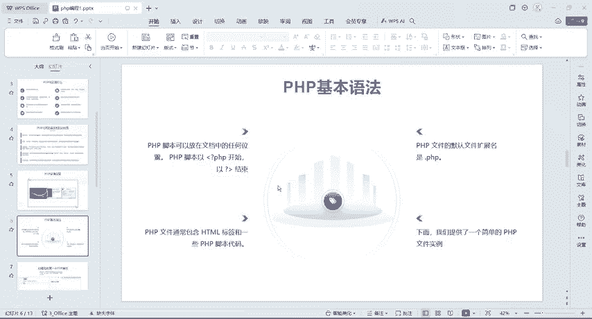
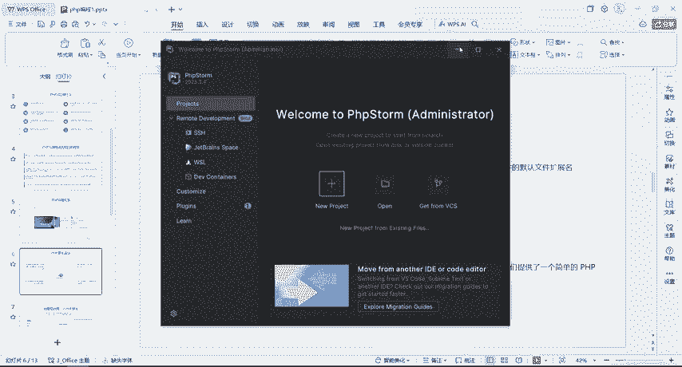
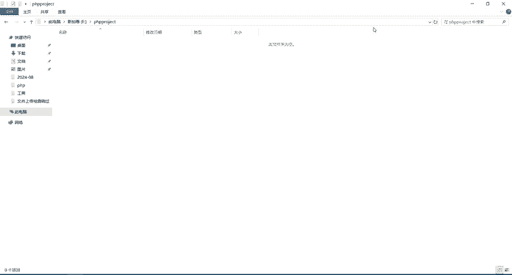
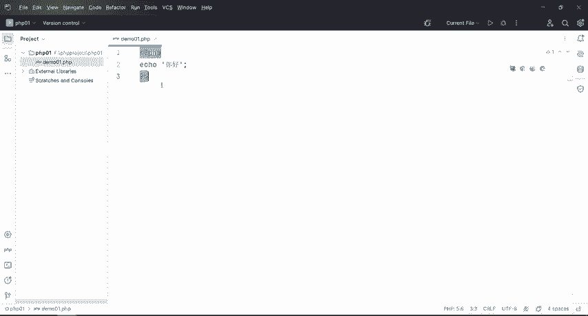

# B站高质量CTF比赛工具使用教程合集，100个入门到进阶CTF工具使用讲解，保姆式教程，附工具安装包，拿不到名次算我的！ - P9：5.2、php第一个程序及工具使用 - CTF入门教学 - BV1tdejeuEVz

好，刚才呢把我们这个PH啊给它安装成功呢，安装成功之后，那我们来看一下PHP的一个基础语法。那么它的这个语法呢PHP脚本可以放在文档中的任何位置。

那本是以监控号问号开始以问号监控号结束它默认的文件扩展名是点文件呢通还包含一些我们这个H标签和一些HP脚本代码。那么下面我们提供了一个简单的文件例我们来看一下创建的第一个脚本。

那么通过PHP有两种在浏览器输出文本的一个基础一个一个是print那print呢不推荐使用，一般呢我们都是使用这个那具体怎么做，我们刚才把这个已经装起来对？已经装起来了，那么装起来之后那具体的怎么玩？

我们点击这个new。😊。

就project之后，它这里有1个PHPempproject，我们就创建一个空的。然后呢，这个地方是让你放这个路径的啊，这个默认它会显示在C盘啊，这个地方那你如果展放在C盘，那你就放在C盘。

但是我一般不建议大家放在C盘啊。那么这个地方我们就直接选中我选择F盘OK然后给它取一个名字。😊，放在F盘里面，然后呢有个文件夹，对吧？那如果说你们不会去取文件夹的话呢，那我推荐你这么做啊。

在F盘里面右键新建一个文件夹。那我们这个地方要写一个什么呢？PHPproject PROJECT。😊，PHPproject这个是专门放我们PHP文件的这个文件夹。好吧。好。

那我们重新的选中F盘里面有1个PHP project。好，那么选完之后还不还不行啊，还不行。接下来我们要在这个后面加上一个斜杠，斜杠后面写什么呢？写你的项目名称。好，那我们写一个PHP01就可以了。

OK好，那点击我们这个creect创建。😊。

好，创建完了啊，创建完了之后，就是这个界面。那我们这个地方不要把它关掉。好，然后这个黑不溜丢的地方啊，那具体怎么去改呢？点击这个地方。😊，它就会有这个菜单栏，对吧？但是我如果说把鼠标放到外面来之后。

这菜单栏就隐藏了，对不对？但是我不想让它那么麻烦，我怎么办呢？点击它，然后选择这个view啊，我有这个地方选择第二个把这个菜单栏给它也显示出来啊，我们。

我们把它给勾上勾上之后哎鼠标在这个地方点击之后菜单栏还是存在的对吧？这样的话就方便一些啊，好，那接下来教大家怎么去把这个黑色窗口，就是虽然说啊黑色窗口看起来比较比较厉害，对不对？

但是为了给大家去讲解的话，我还是把这个背景呢给它改成白色的好，具体怎么改呢？这边有一个s。😊，好，然后这个地方默认呢它就是让你去改背景色，我们给它改成light。好吧，哎改成let或者改成默认的啊。

integerlet都行。我把它改成这个。好，点击OK好，改完了啊，改完之后，那接下来有同学要问了，哎，老师能不能去把这个呃工具啊。😊。

变成这个中文版的。但是啊为什么啊有的同学说哎英文我不认识，对不对？啊，不认识没关系啊，大家可以去下载一个有道翻译都可以去翻译一下。所以说不建议大家去把它这个工具呢搞成这个中文版的。

因为它中文版它翻译的话，有的时候翻译不太准确，所以说还是啊跟着我的步法叫英文就是英文。其实我们在这个工具里面呢，记住的英文啊，单词不是说特别的多。我只要知道哎新建文件，新建文件夹啊，打开文件。

打开文件夹就行了。好吧，好了，那么我们创建完了之后啊，那接下来我们这个就是我们刚才所建的这个PHP01这个文件，对？好，那么接下来怎么办？我们右键在这个地方新建一个fi啊。

那么我们由于啊由于是我们是新建这个PHP的一个文件，所以说在这个地方它给我们提示了一个PHP，那我选它就可以了。好吧。😊，OK好，点击它之后，那我们接下来我们还是取个名字啊，M01。

然后它的后缀名呢是点PHP我们点击OK就行了。😊，好吧，好，那么创建完了之后呢，它给我们自动的啊补全了一个监控号问号PHP开头是吧？所以说相对来说呢，这个工具还是比较好用的。好吧，好。

刚才回到这个PPT上面，我们第一个我们就来创建第一个PHP脚本，我们直接echo一下e是打印输出的意思。好，我们在这个地方ECHO啊，它有自动补全e引号啊，因为我们如果说要打印这个嗯。😊。

汉字的话那打印我们的汉字它是属于我们的字符上，所以我们还是得加双引号或者是单引号都可以啊。然后我们给它一个封号结尾哦，打印一个哎，你好，对吧？😊，搞定了，那么这个呢就是第1个PHP文件。

那接下来我们就把这个以问号监控号给它结尾啊。当然你如果说这里没有结尾的话，也是可以运行的，好吧。好，搞定，然后ctrlS给它保存。好，那接下来呢我们这个文字啊有点小，对吧？哎，文字有点小呢。

同样的也是在这个sences里面去设置文字，在这个地方有个edit。😊，adit这里有个front好，这个是设置文字的大小，这个是我们这个行间距啊，我们给它设置为18啊，然后文字就会变大了。

然后呢这个呢是我们的字体啊，所以。就是你们如果说想要嗯去调整各种各样的字体的话，你们自己去调，好吧，默认也就是它登记。😊，应用，然后OK然后会看现这个文字是大了，对不对？好，大了之后。

那接下来呢怎么去运行啊，我们可以点击它。😊，也可以去点击它这个地方是我提供了给我们有三个浏览器啊，因为我电脑上有三个浏览器。那如果说你们没有浏览器的话呢，你们最好是装一个谷歌浏览器，装一个火狐浏览器啊。

那我这边我就直接运行在这个嗯火狐浏览器或者谷歌浏览器都行啊，我就点击谷歌吧。好，然后呢点击之后，他说哎找不到这个谷歌，对不对？为什么。😊，知道吧他找不到这个谷歌量。

因为它这个地方默认的是没有配置好了的那怎么配置呢？我点击确定，它给我弹窗，对吧？好，点击它fix好，这个是我们的谷歌，然后pass呢是我们的路径，对不对？那我的谷歌浏览器，它是在哪个地方呢？

是在这个地方，对不对？好，我们看一下它的路径在哪里。😊，是不是在这个地方在C盘user amin，然后什么什么什么各种各样的下面是不是有一个谷歌量览器。好，那我们怎么配啊？点击它弹窗错了啊，点击fix。

好，那么我们选一下啊，选一下在C盘，对吧？然后在哪里呢？😊，不知道对吧？不知道的情况下，那怎么办？134。然后admin to，然后呢，我们再找一下啊找一下。如果说你们找不到。

那你们就回到这个地方来看一下，对吧？C盘useradminory，然后APPd然后找一下啊。😊，APPd在哪里，在这个地方啊。有没有？有没有呢？开始下单。没有吧，public。也没有吧，问的是。

有没看到？看不到是不是？好，那么在这个地方。再找一下。有没有？没有是不是？那怎么办呢？怎么办？你们如果找不到的情况下，会怎么办啊？我就直接干嘛？直接把它复制一下粘贴。找到了没有？是不是啊哎。

所以说这个啊一定要注意的。😊，如果说你们在这个地方选择路径的时候没有找到，我们就直接把这个路径给它复制粘贴到这个里面。这里面是不是有个谷歌application，这里是不是有个谷歌EXE呀。

我们就选它就可以了啊，点击OK。OK好了。😊，搞定。好，那也就是说我们刚才把这个谷歌浏览器给它配置成功了，它也能运行，是不是啊？那么运行之后呢，他给我报了个错，报了个这个502。

对吧如果说报502这个错误的话呢，那就是我们这个解释器啊，解释器没有去配置。那这是给我提示了，对吧？PHP解释器已没有配置，然后请去配置这个PHP的这个东西，对不对？那么具体怎么去做啊？看到这个502。

那我们直接点击fe，这里有一个stting，然后呢选择什么呢？选择这个PHP啊，那么PHP这个地方它没有一个脚手架，看到没有？它默认的是5。6的版本，但是这个地方是没有的。

因为我们运行的时候也需要这个5。6的版本，甚至是更高的版本，对不对？那么这个解析器在哪里呢？😊，在我们那个PHP4 study里面啊，有1个PHPEXE那么具体的PHP study怎么去装啊？

在前面的这个课程里面也跟他去讲了，对吧？这是个PHP study好吧，PHP study就双击下一步下一步就可以了啊。那具体怎么去找那fi，然后sing。😊，点击它选择这个地方有个加号，加号之后。

local pass to啊，是不是有个PHP然后具体的什么目录呢？在这个地方啊给它选一下，选择我们这个PHP study的目录。哎，然后这个地方有一个。😊，PHP对吧？哎，打开之后呢。

再往下走有个PHP这里面是不是有很多很多版本啊，对不对？😊，好，这边默认有1个PHP5。6。因为我这个PHP呃动的话，它是5。6，对吧？那我们就选择跟这个5。6是一致的就可以了。好，把这个5。

6的给它展开往下拖啊，往下拉。这里有1个PHP点EX点击OK。😊，就行了。好吧，好，然后呢，这个地方是不是还说没有这个版本呢？那么这个版本呢在这个地方选择选一下，还是选择这个5。6OK好，没报错了。

对不对？好，那么为了这个后面的啊就是一般来说我们如果配置了这两条路径的话呢，我们在运行的时候在控制台啊，它会报一个小小的错误。但是那个错误没有关系。但是你如果说你不想看到那个错误的话呢。

这个地方就不需要配了。😊，明白吧？哎，只要配置这个地方就行啊，这个地方就不用配了。好，配置完了之后点击应用。OK好，这边是不是5。6？😊，再来应用再来OK好，点击。谷歌浏览器是吧，你好，出来啦。😊，好。

这个呢就是我们的PHP的第一个程序，以及我们这个PHP自动怎么去使用。

