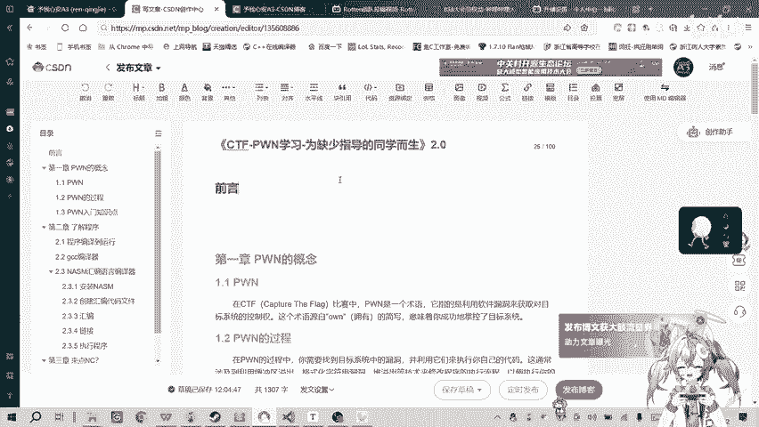
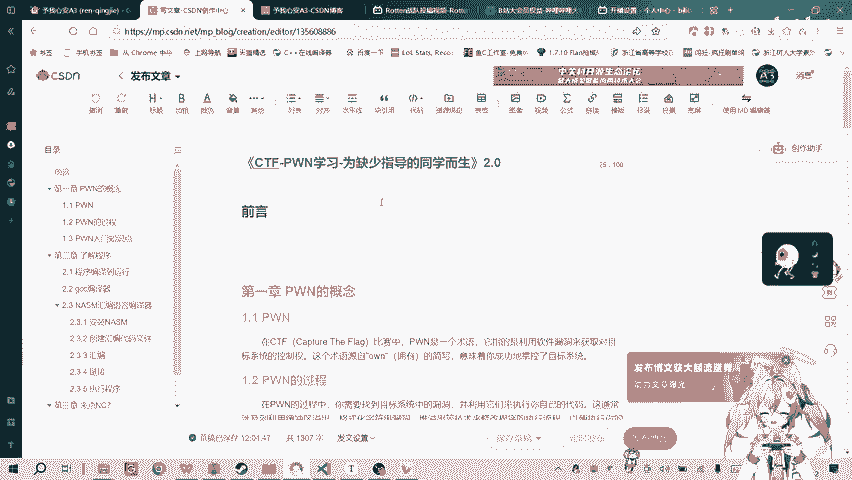
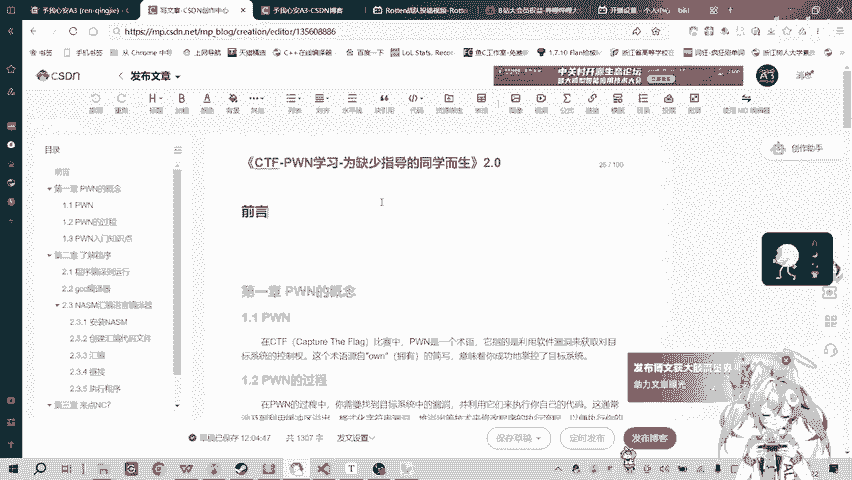
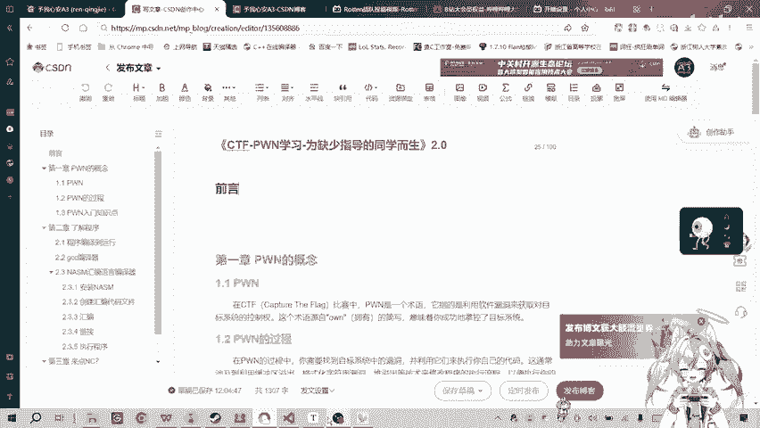

# CTF-PWN入门 2代视频要开播啦 - P1 - Rotten科技 - BV1uQ4y1A7E6

哎呀。想了咱备开始吧。看想要是东么西。还得理一下思路。嗯嗯ん。嗯哼ふふ。哎呦。怎么就这么难开口呢？我靠，哎呦，我服了。😊，嗯，好的，各位B站的小伙伴们，大家下午好。今天是2024年的1月22号。

我今天带来一个消息啊，就是我们。对不对。我应该先说什么的。嗯。算了，先把消息说了吧，就是。😊，大家不是一直关注着碰入门这个视频这个系列视频的一个那个更新情况吗？

我上次上次不是发视频说是一代的视频要停止更新了嘛？现在的话现在的话嗯。就没就没有写过稿子，就是就是就是有点难难说。现在看的话，哎呀，直接死，那我就直接极兴发挥，还是极兴发挥就。😔，没有被稿子。

就只能这样极兴发挥了，想到什么说什么吧。嗯，这期视频呃。我们碰入门二代的那个视频了，现在已经开始准备更新了。现在在博客啊什么已经在写了。

然后的话然后这这一期这一代视频的话会主要是以PPT加题目题目做题的形式来讲解。比第一代的区别的话，就是把就升级了PPT还有还有的话是这这一次教学的话会加入一些理论上的知识。嗯。就是嗯。

之前之前一代的时候，一代的时候就那个一直一直是做题，纯靠做题。有些理论知识的话细节都没有处理好。现在段的话呢可以相当于说是补一下，把这些知识点的什么的重新都补一下。嗯。

原本想的原原本一代那个那个视频结尾的时候，想想想的是二代的时候能做一下做一下视频动画什么的。但但但但但最近也知道的就是实习嘛，我刚刚实习。刚也不能说实际结束了，我现在只是刚拿到三方，三方也拿到。

就拿到一个转账的名额。嗯。然后的话闭设这边的话，我现在是完成了大概70%的开发工作。那现在的话我其实就可以放一些把一些精历啊什么的，放在胖子学习上面了。And。其实把这。半年前那个视频拍的。

他的东西我都忘了，我什么都不记得了，是等于说我一切都要重新开始学了。😊，铂酱铂酱也好，那这样的话我们。我我这边的话也可以重新重重重新理一下，也相相当于重新再入一次，再入一次门吧。虽然我到现在还没入过门。

哎，我不知道我在胡扯是吗？啊，我在胡扯。😊，完全在乎测。嗯。好了不不不错不错不错。是，然后呢这半年来关感谢大家的关注。现在罗en干德也是一个有1012个粉丝的小up了。呃。

然后还有感谢群里面的那群兄弟们。我们的罗腾罗腾跟在学习群里面的一对兄弟们的关不断的支持和鼓励啊。哎，怎么说呢嗯。

那大家就期待碰入门这个第二第二代的视频的出这个更新吧。

好，就这样。哎，我说不下去了。😊。

