# CTF-Web历年考题精讲教程 从入门到精通 - P1：CTF考题序列化__toString - 黑客入门101 - BV14YtkebEbY

我是妞啊，今天的话呢给大家讲讲这种CTF啊比较常见的这些题目啊比较常见的这题目。那么我们先来看第一个题目吧，第一个题目。那么这种的话，序列化的序列化方面的，我们首先打开这个文档。

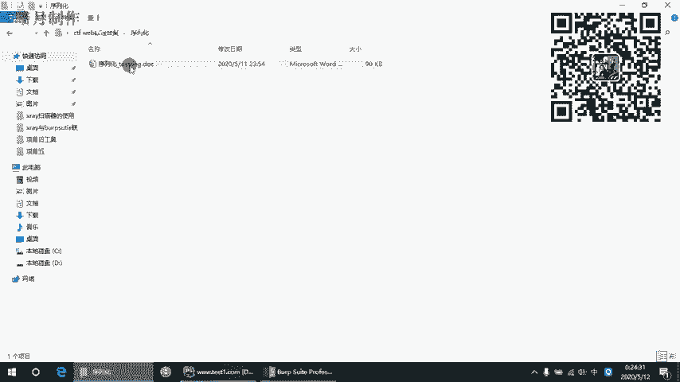

打开文档之后啊，这边的话呢我们也可以看到啊，这里的话系列块简介啊，给大家说一下啊，等一下ss还有这个反系列块啊，在P内部呃，实验上是没有漏洞的。漏段产生只要啊主要产生是由于应用程序在处理兑现的时候啊。

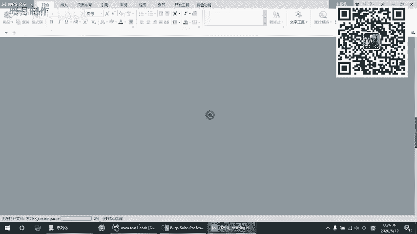

的一些模式函数以及7列块的相关问题所导致的。那么当大写传给这个反系列化的参数可控时，那么用户可以就可以逐户进行构造的这个纰露。当进行反系列化的时候啊，就会触发。啊。

对线中的一些描术方法造成意想不到这个危害啊。那么这主要是大家看到啊这主要是这个。反射列化的时候，弹出它是可控的可控的。那么。会突发一些模式方法。那像在我们KTP里面插对象里面，它有个初期性啊，初期性。

这个的话也是一个模式模式的呃这个方法啊。那么假如我们这些方法里面呢有一些。原来常所可供的话呢，我们就会。第我们就会产生一些漏洞啊。那么首先呢给大家讲一讲这个出期印的啊出进啊，出期印的话。

它是魔术方法的一种啊。这些用词当一个对象被当做字符算对待的时候，就会触发这个模术方法。那这里的话是从我们PDP官方手册里面拿到的。那么首先呢我们来看一下这个呃。来看一下这个例子。好。

我们先来把它复制过来啊，复制过来。这边的话呢我们用这个PS啊PS的话，这里呢我先来给大家新建1个PGP文件啊。这里的话我们给大家编模一。

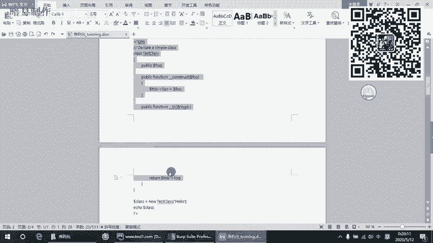

打电话仪吧，好。好，大家看到这里的话它是一个类啊，切实类啊，这里的话有个公共的这个变量啊，这里的话啊等这个的话是在我们这个16块的时候啊，它会它会可以它是可以获取到这个值，然后并把这个值啊。

然后带到我们这个变量里面来。然后这边呢它有个方法，这个方法的话，它叫做促进啊，这个方法的话，大家看到这个方法的话呢，我们这边是没有被调用的，没有被调用的。可看啊，这里当当当什么呀？当。

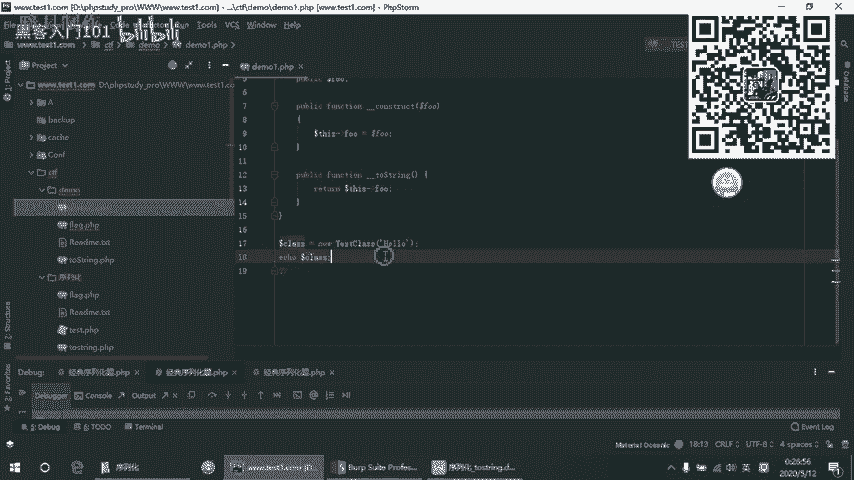

当它作为一个字上对待的时候啊，就会触发这个模式方法，对吧？那么大家看到这里的话呢，我们它只要有I口输出啊，I口输出的话，它会自动调用我们这个数据啊，这个数据大家看啊，这里我们实6化这个方法啊。

水6化的水6化这个类啊，水化这个，并且并且它这里面啊有个自动获取的这个变量，大家可以在这里面传入参数啊，这边的话。

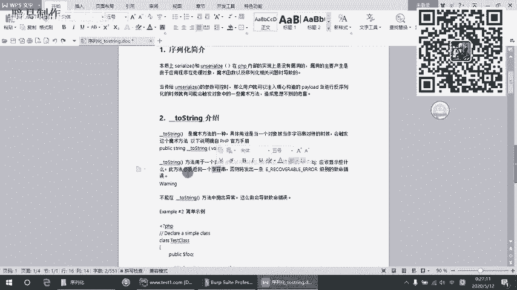

就可以在在系列块的时候呢，输入参数过来，然后呢它会把这个值带到里面来。然后这里面返围的话就是我们这个值。那这里的话假如它成功的话呢，它会打印到打印出hello，大家看一下啊。

那这边呢我们先在这里下一个端点就可以了。先在这先在这里下个端点。然后这边呢我们来执行看一下。啊，这边我们。

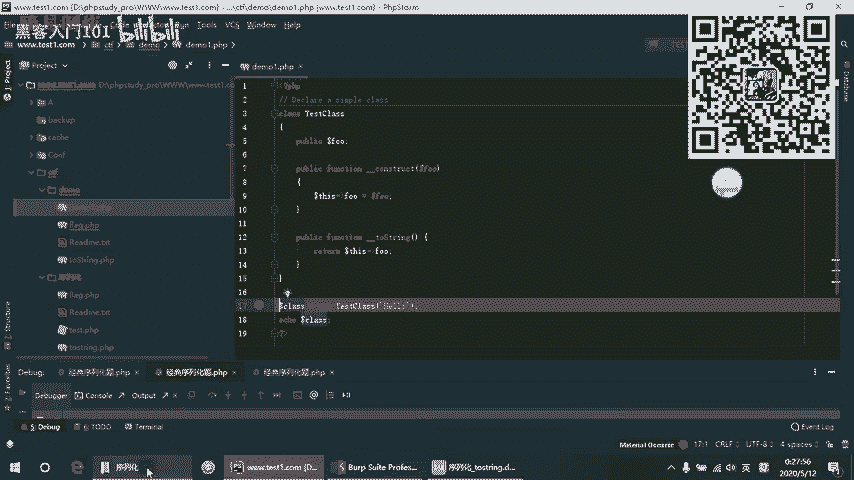

打开这个。扩无浏览器啊。这边的话他应该是。哦测试仪。这也话是点。CDF。这边的话是啊。de某一吧，对吧？啊，这边的话应该是可以接到了。

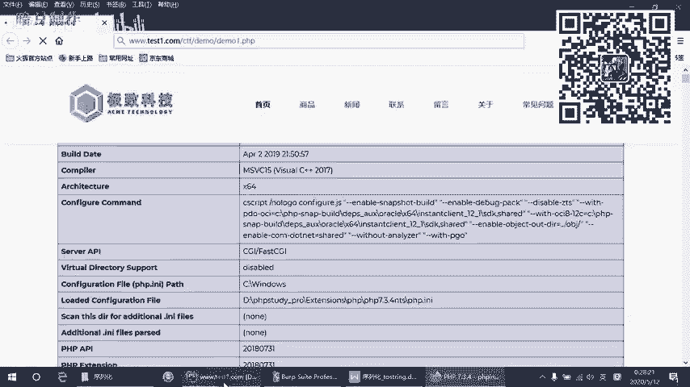

我们先把这些去掉啊，这都不用了啊，这里已经断断下来了。这个断点啊啊，这边的话是点的话就就是个桥时啊，这里点击单步走。点击单步走走一下。那后这边大家看到这里的它实列化的时候，它会做什么？

它会做这个变量的获取啊。这边的话它会传过来，大家看一下。这边的话把这个直引传过来了，然后这边呢大家看一下啊，这边我们继续走，继走之后呢，插位来到我们下面来。

下面的话呢我们看查要勘查这里会不会调用这个函数啊，会不会调用这个函数。好，这里的话就调用了。然后这边的话返回出来的话就是一个hello他看一下页面。对吧。假如我们没有这个的话呢，我们看一下啊。

这里的话我们先把它关掉啊，这里的话我们不加直接这样来啊。好，我们来试一下啊，这边的话呢我们点击这边的话呢，我们也断下来了，继续走走走。

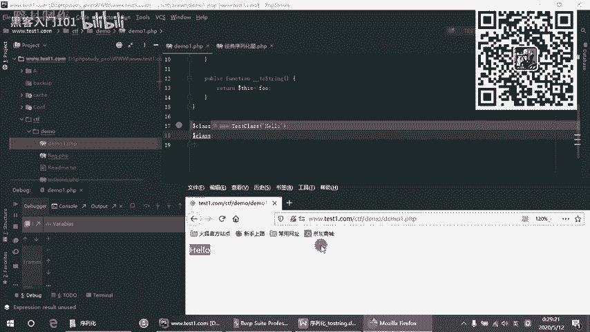

来到hello，大家看到来到这里之后啊，它不会调用，不会再去调用我们这个出蓄性的。那所以的话呢，我们在这个手机键的话，就是我们在艾的时候，它可以。调用的还可以调用的这种的话就是粗新的这个魔术方法的使用。

好，我们再来试一下啊。加上一下大家的这个音响啊。好。好，让他走走走对吧？然后走到这里之后呢，大16号完成之后呢，他把这个类数出出来，我们看一下。这里当做字符上输出，然后呢这边的话呢就会。

打印出我们的的这个面料。好走好了，这这里就没了。这边的个滑楼就出来了啊。那这种的话就是我们这个模术方法的这个使用。吓。那么我们来看一下啊，这里有个。

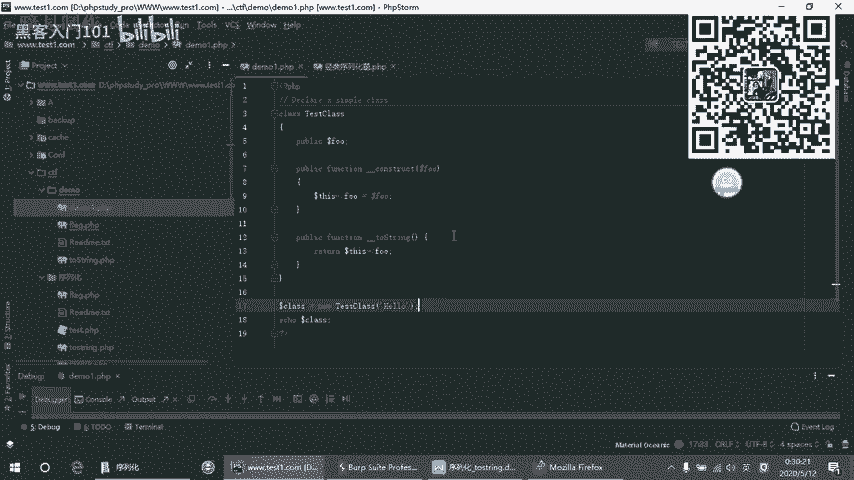

有一个比较经典的这个实例啊，这个实例给大家来分析一下。好，大家看这里的话，它是它是有这个出镜的。大家看啊这里有个类啊，很到这边的话，hifi的 highfi的话就把。把这个。把这个什么呢？把这个啊。

原件啊把它。格式化审计出来对吧？这里的话是全全入这个啊。边量啊，大家看一下这边的话呢，我们这里啊大家看到这里的话呢，我们是有个类，这里你可以当做类类就可以了。那这边的话它有个。假如它这个变量。

它这里有个变量啊，它这里有个变量，这边这边呢它16块之后啊，差16块，这里是16块了。16块之后呢，它这里是获取到。获取到什么？获取到我们本页面的这个。啊。文件啊文件名按弄呢？

这里的话大家看到这里有个ic。这里有个输出啊，有个一有个I口，这里的话它会输出什么呢？它输出这个类啊，输出之后呢，它会调用这个方法看看。他会调用这个方法哈。对吧。那这边呢我们。

来把这段复这段单码复制过来，或者是我们这边已经新建好了，我们给大家看一下。

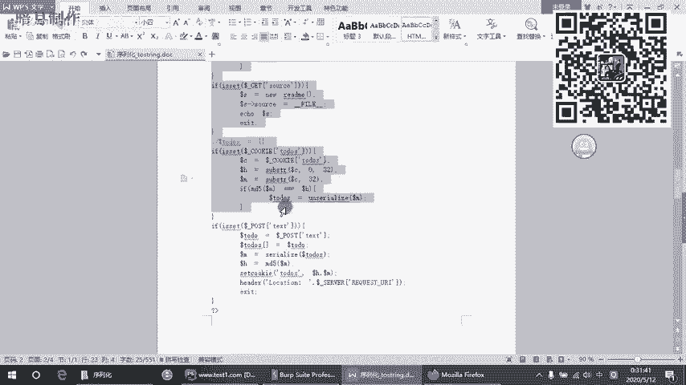

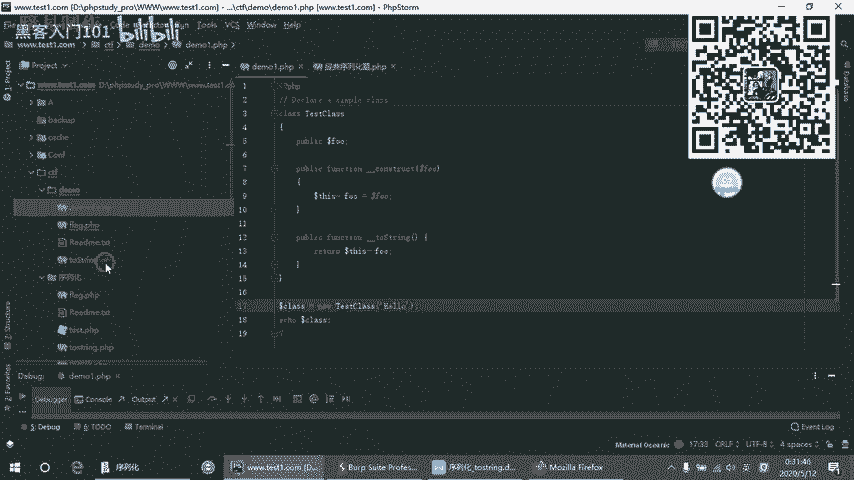

好。😊，首先呢我们来访问看一下啊，我们来先来访问看一下。这里的话呢我们。来出。好，反面看一下啊。

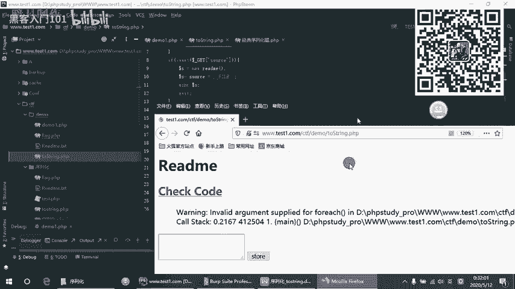

好，大家看到这里的话呢。啊，这里有一个输出啊。这里有一个错误信息啊，这误信错误信息就不用管了，你点击查看了，点击查的时候啊，大家看到这里的话它是什么呀？这里的话就是。

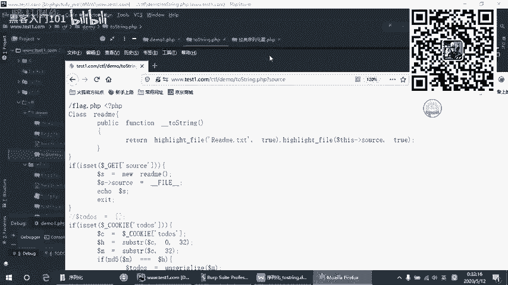

啊，我们这里的内容大家看到点击之后呢，才可以看到这里面的内容。定咩内容。好，那么我们来看啊，这里的话有个fge，这里的话有个fge啊，大家看一下它会他要我们读到它这边的话，他会会把这里面的值。

把这里面的值啊。还有我们这个脚本啊，它把它想示出来。那这边呢我们看到这里有个flash，这里有个flash啊，我们看一下这个flash是否存在啊。呃，这里有个flash，我们看到叉。

好像是有点问题啊。这里应该是个分头啊。

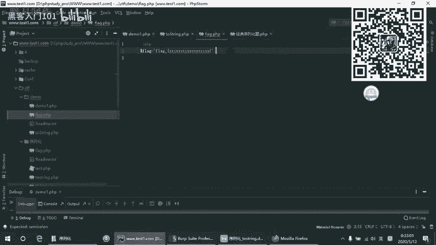

好，这就可以不用管了。这边的话我们应该看不到内容啊，对吧？这边就看不到内容了。那现在的话呢就是我们。我们要做什么呢？我们看一下这里有个frelash，我们要读到里面的内容啊，里面的内容我们通过这里面读。

我们看一下看这份代码，通过这份代码里面呢，我们来读取这个文件，读取这个文件啊。大家看啊。啊，大家看一下这边的话呢，我们看到这里呢它是什么呀？来看一下这里是什么啊。这里的话我们看到这里的它这个类啊。

它这个类，这里显示我们本地的。显示我们这个limit，还有这个本页面的这个页面啊的源代码。大家看到，假如我们把把这个。大家你好。高亮啊文件啊，把这个改成我们的flash就可以了。就是把这一段内容的di。

啊，第四。这个源代码很到改成我们的fge。fge的话就是我们这个文件名就可以了。对吧那这里通过哪里改的，他通过哪里改的，他通过我们。通过我们这里啊，这里的话是实力化这个。实力话这个类啊类之后呢。

它这里获取到这个当前的文件夹。然后呢，当前的这个文件名，当前文件名，然后呢，我们把这个文件名写成我们的写成我们的fge的话，这边的话就会读取到里面的内容啊里面的内容。那么。那这边的话呢，他还有。呃。

那这边它还有什么呀？这边的话呢，我们看到啊这边下面的话还有一些条件，还有一些条件啊。待下啊。😊，这里才有一些条件，这条件的话就是什么呢？这里的话有个cookie检查这里有没有cookie过来。

有cookie的话呢，对吧？价位截取也从零开始，然后截到32位啊，32位这边的话也是一样的，它是从。这里传过来这个值，它是。啊，差是从32位之后呢。把全部的字符然后拿过来，然到这边的话。

它要做1个ND5的这个对比。大家看到这里的N的话呢就是一个。这里32位的ND5大家看一下N的话。啊，H的话是32个。05这里的。这里的人呢他也是。啊，他还是把这段内容，把这这一段内容把它N5掉。

然后这边的话就会相等。这里有个条件，这里必须ND5相等相等之后呢，它。他做什么呢？他做一个反序列化，反序列化啊，反序列化，这里有块反序列化啊，大家看到这里有块序列化了。哦，这里不是46块。

这里的话它是个类的一个呃。超市内的这个。创建啊能够输出这里的内容，对吧？那这里面呢它有个反序列化，反序列化，对吧？反序列化。那么插这里传过来的话，肯定是序列化的内容肯定是序列化的内容啊。那传过来之后呢。

我们看一下叉有什么操作没有。传过来之后呢，我们看一下。传过来之后呢，插在哪里啊，我们开找找。传过来之后，这边的话大家看啊传过来之后，它这里有个什么呢？才有个。有个什么呢？才有个。来看一下这里的内容。

这里的内容啊我们找这里面它是pos过来的。那这边的话呢我们是。我们是什么呢？这边的话呢。还是什么呀，是吧？大家看这里的话，它检查是否有这个po直过来，对吧？这里它这它是一个列表，大家看到它这里啊。

它是一个空的这个。诶。换照这个列表大家看一下。这里可能叫做速度比较好，因为好像HP里面没有这个列表的这个啊概念啊，它是有速度。那这边的话，它传过来的话啊，这里的话它是肯定是空数组啊，肯定空数组。

那这个这里面啊它这个数字它并不是唯空的，它并不是唯空的啊。它这边的话呢，我们看到它是。获取刀的他是获取刀的。这里它只是获取第二第二个的第二个的。假如没有的话呢，它就等于这一个。A等于这一个吧。好。

那这边的话呢插这里面啊插这里面。茶位把茶。把它的局进行这个。诶。生日快啊。大家看一下这里面啊，这里面的话是。这里是反序列化。这里是仿序列化，这里是系列款。这也是列块。那这里的这里的话，它N等于NT5。

那这个这里面我们可以不用管了，这里面啊这我们是可以不用管的。我们这就要看下面还有一个输出。它有个输出啊，那这里面的输出的话呢，它就是我们这里面反系列块过来的文件。反系列过来的这个内容啊。

大家看看它在这里进行这个。进行这个什么呢？进行这个便利啊，便利之后呢，它。变成一个输出。那这个这种呢它是HP里面的一个输出的这个简写啊，它相当于什么呢？它相当于我们的。啊，PHB挨个。啊。

这里面也是个I口，对吧？在这个个。好。相当于这样。那这里面它也是个输出的那所以呢那这边的话呢，我们可以不用管这个地方它也不用管啊，我们不经过啊，我们不经过。那么我们只要符合这里的值，然后呢。

把它的内容反序列化过来之后呢，它这里进行。进行输出的时候呢，它就会去什么呢？它会去雕我们这个。才会去调用呢，他会是会调用我们的。啊，这个出进抽进。好，那这里面怎么来操作啊，怎么来操作？

那首先呢我们先把这一段拿过来。先把这段拿过来啊。先把这段拿过来。

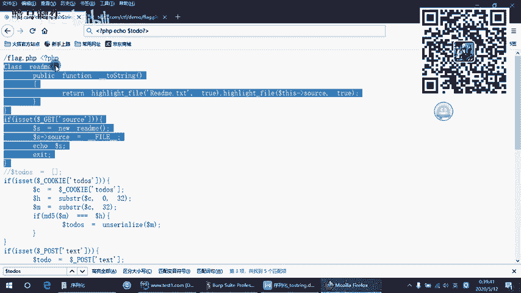

好，先在这里建一个。点目。点M2点HHP吧。好，大家看一下这里面啊。这里面是读取我们本。本页的内容啊，我们看一下。

呃。DN2。这里是没有内容没有内容的话，因为呢这里我们还有个条件。再看看这里看看有没有这个值。这里肯定有这个值的嘛，对吧？好，大家看到就会读出。这段内容对吧？那现在的话呢，我们把这里改成什么呢？改成。

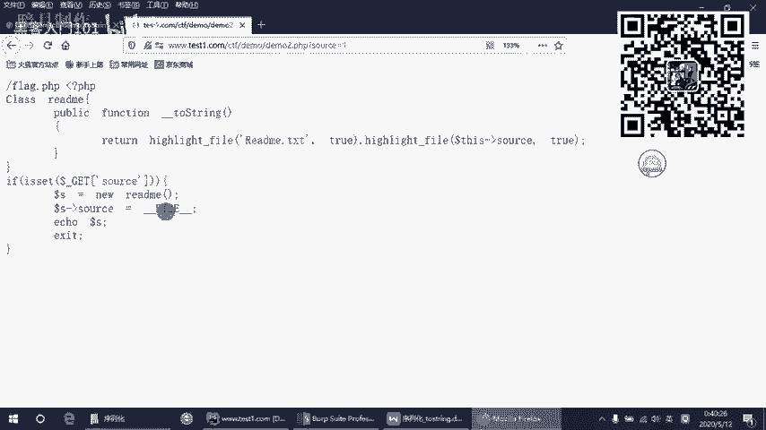

改成flash点PP。大家看一下，那这里面的话就会读到哪里，才会读到这里的内容了，对吧？好，我们来试一下。

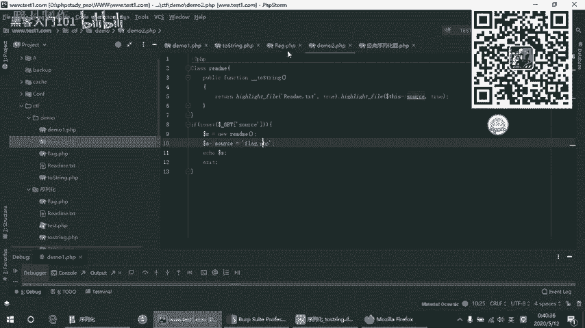

对吧它就会读出来的那这个时候呢，我们就会得到。我们就会得到什么呢？我们就会会得到我们的fged的。HP里面的这个内容对吧？这个水电取的话，我们就拿可以拿到了。啊。

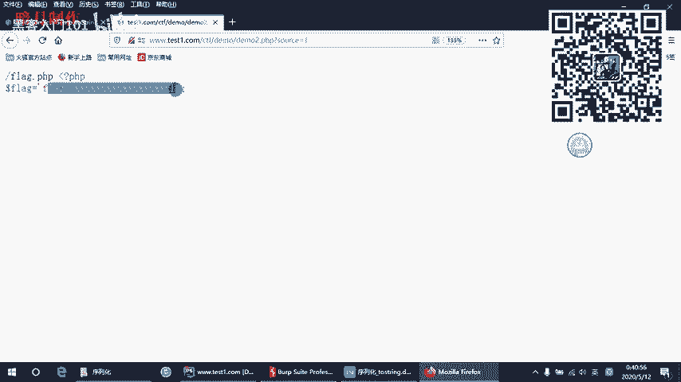

那么我们现在的话呢。我们看到啊这边的话呢，它是一个。它是一个什么呀？这边的话呢它是一个反序列化啊，还有这里的条件要什么呢？这里的条件要通过的。因为这边的话是ND5进行对比的这里。

这里还有coookki的提交，对吧？那所以呢我们来看一下啊。所以那这边的话呢，我们。先把这个。啊，先把这个序列化啊。这里啊大家看到这里面啊，我们先把先把什么呢？先把。大家看到这里的话。

是fl点PP对不对呀？那这里面呢我们。让他先来做一个序列化，对吧？因为呢这边呢我们要返序列化的，所以的话我们在这边做一个序列化。然后呢，我们先把这块的字符串把它打印出来。所以的话这边的话是。

把他的这个整个。里面的内容把它打印出来。

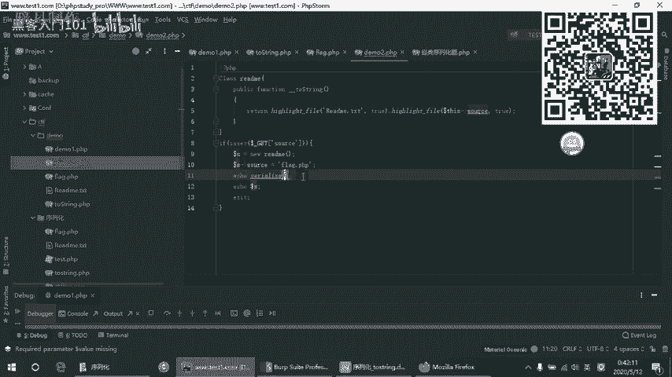

那这边的话呢，我们就会拿到。拿到这里面的内容对吧？好，那这边的话呢，它是一个反序列块的。大家看到。

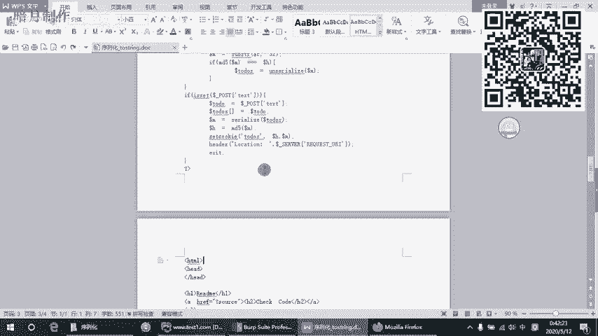

这里面啊它是一个反序列化的。所以的话这里的直角如我们来到这里之后呢，它这边的话就会做什么呢？它会把它。把它变成我们这里的内容，把它变成我们哪里啊，它会把它变成我们这里的内容，这里的内容啊这里的内容。

那所以的话呢差就会执行。读取这个flash文件的这个操作啊。好，这边它还有个条件说什么？这边的话我们看到这里的话它是。cookie。还家哭给读取哭给读取。那这边的话是大家看到这里的话是取32位的。

那这边它是从32位之后啊，32位之后呢，再读取全部内容。那这个地方大家看一下，这里是HH的话，这里的话32位的话就有ND5，就ND5。这边的话也是ND5。那所以差。

所以所以这里的意思是什么呢？LTP。

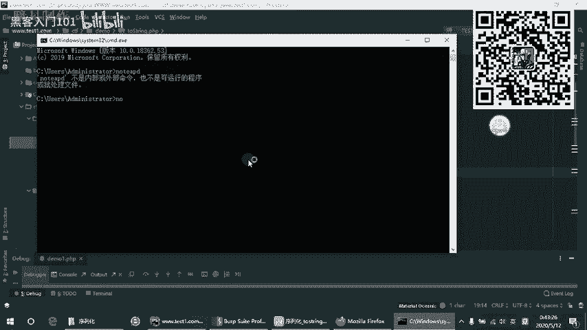

那这里的意思是说，他会把这一段内容进行这个ND。

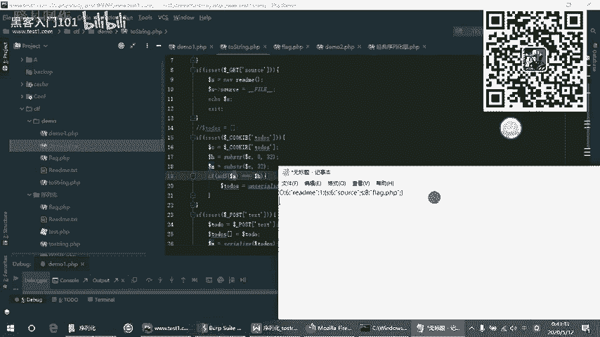

好，所以的话这边的话我们要把叉。这段内容也是ND5的。就可以了。好，我们来看一下。

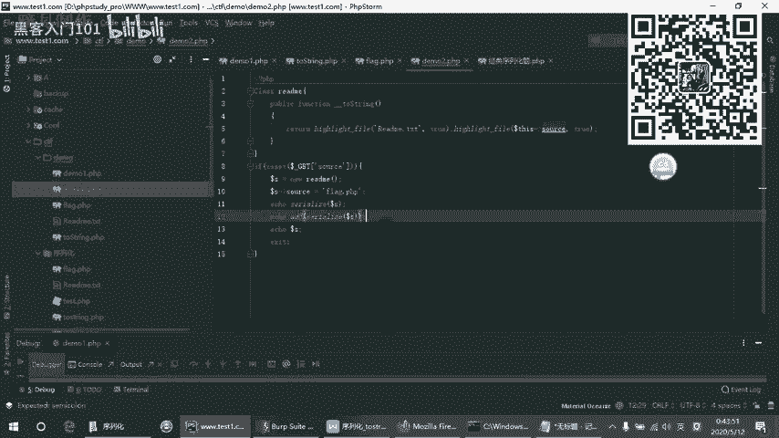

好，这里的内容也是NT5。好，大家看到啊。这里我们看一下啊。这里是32位的ND，我们可以用这个在线字符串来查一下啊。嗯，这里的话是长度这是长度啊。这里也快了32个，对吧？那所以这里边的话。

它从零开始取32位的话，就是这里面的内容。这里面全部的内容。那么它取32位后面的内容的话，后面的内容的话就是这一段内容，这段内容它跟这一段内容进行相等。对吧所以的话就可以把这一段字符段拿过来。好。

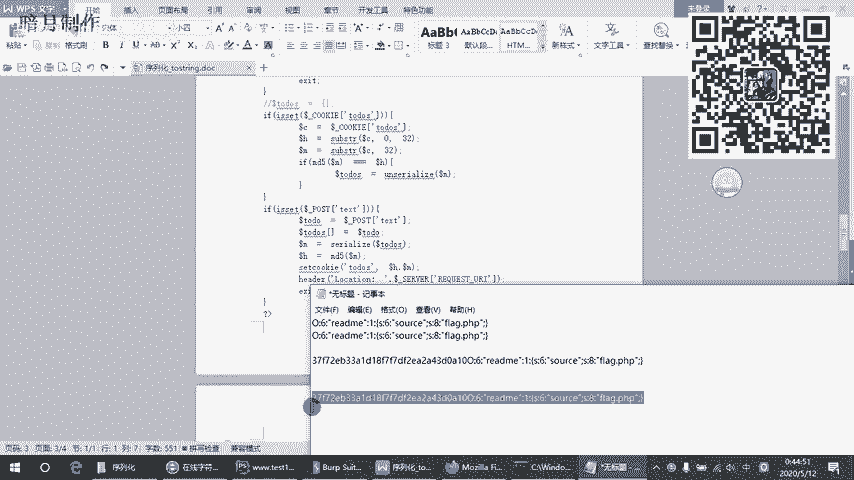

好啦，对吧。那现在的话呢，我们来看一下。

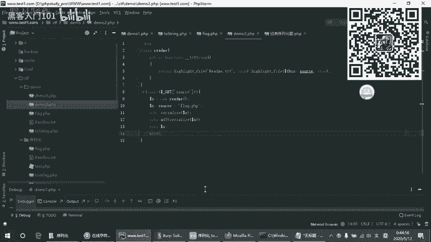

这里除进啊，这里的话大家看啊，这里是32位的这里也32位的那这里也是32位的。并且这个M呢这个M的话就是我们这一段内容，这段内容它就会进行ND5。那这边的话肯定是相等的。相等之后呢，它位把。

N呢找这个N的这个内容啊，进行这个反序列化啊，反序列化之后呢，它就会做什么呢？

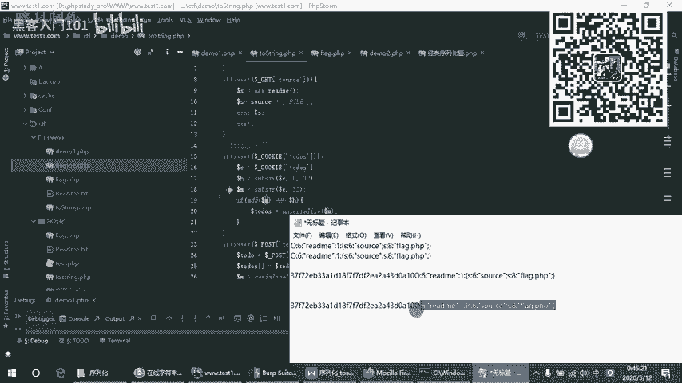

它还会有个它它它还会有一个输出啊，还会有这个输出，就会读到我们这个flash的文件。那这边的话呢我们来试一下啊。好，我们先来点击捷豹。

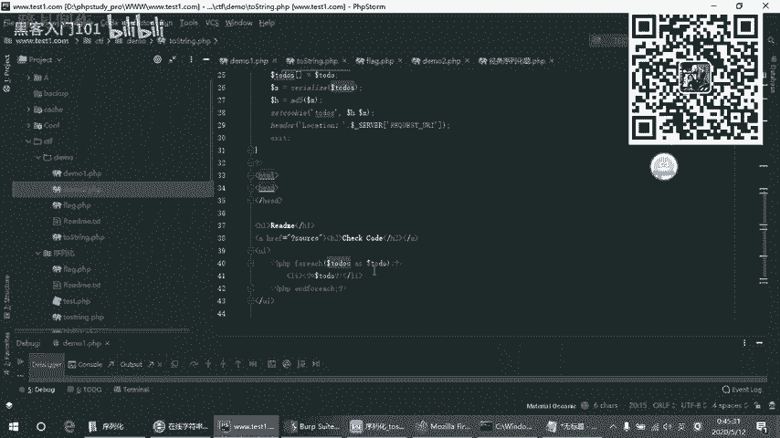

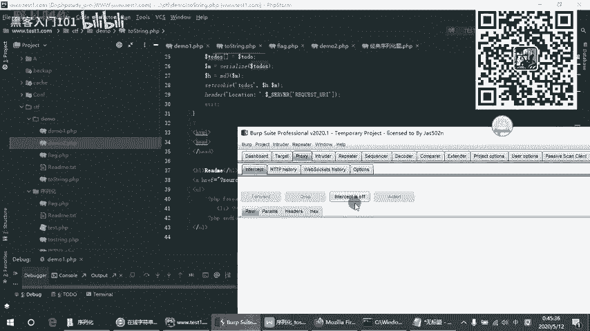

那这边的话呢，我们来。点击这个数据。吓。这边的话呢我们点击就好了，点击让它来抓到这个包。好，爸包。好，抓这边的话呢，我们把它放到D片。因为这里的话，它这边的话呢，我们应该它是一个cookie。好。

对吧我们看一下这里是不是有空gle了，这这里有了。把这段内容，这里的cook值我们看一下啊，这里的cook值是。TOTO啊。好，这里的话我们看一下。所以大家看到 ok。这里小了一个一。好。Right。

呃，这边我们这样吧。这边的话我加一个。我们来看一下。哦，这边应该可以了啊。我们看一下这里的cookie有没有值。

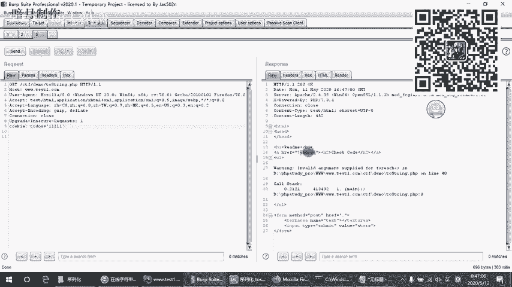

好了。假油他。大家看一下啊，我们把这段拿过来啊，把这段拿过来。这一段内容我们拿过来之后呢，我们来在这里。做个断点啊，假如在估的话呢，在这里的话它会执行的。我们看一下。

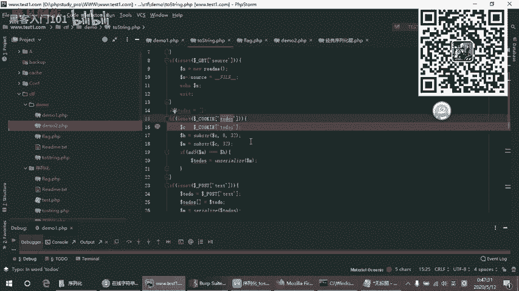

好，你们看一下这这里有没有值啊，这里可给我们看一下。

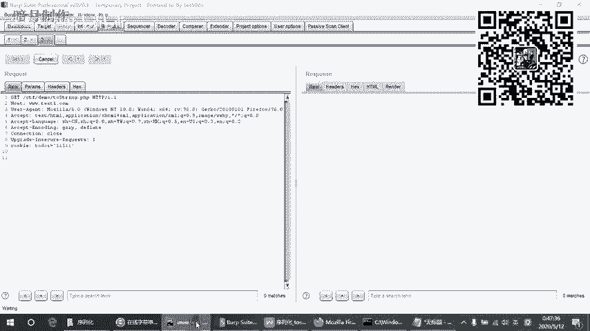

让要走一下走一下。他再家看下c的话是有值的啊。

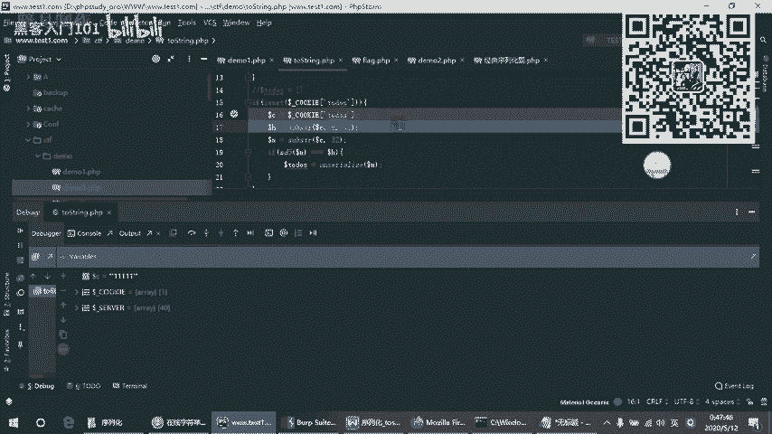

好，接下来的话呢我们。把这一段啊把这一段内容。把我们刚刚的这段内容把它拿过来。我们来看一下它是怎么操作的。吓。这里的话呢我们。好，这边我们让他来提交看一下。

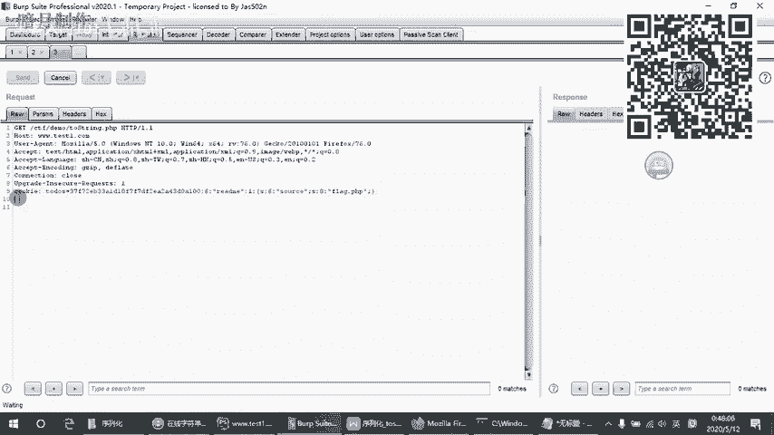

好，这边的话就会来到这里来。我们走。这里走的话呢，我们看到它这边的话，它是会到这个值了，但是它获取到这个值，我们看一下啊，这里获取到好像有点不全。所以的话这边呢我们要把它进行这个编码。

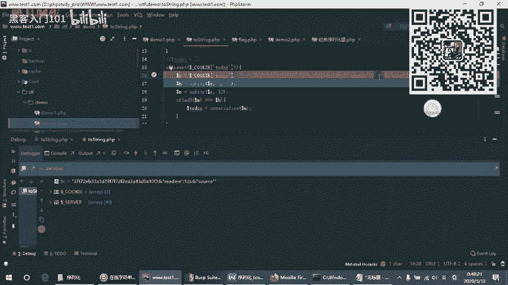

ctrl加入渐变嘛。

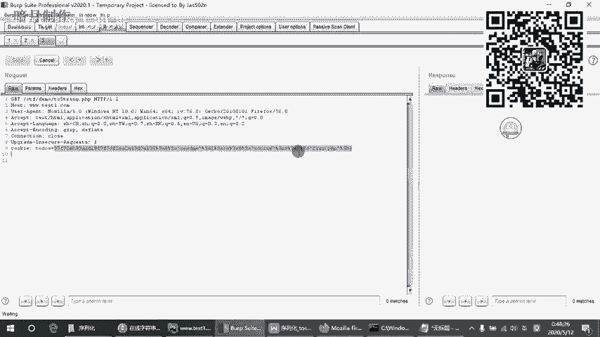

好，让他再来看一下这里面的是。大家看到这里的话，就可以获取全部的内容了。刚刚是获取不到的啊。好，那么我们走大家看一下这里走的话走的话是什么呢？它这里的话取得线D5值ND5的值啊，那这边它是什么呢？

它是取。啊。取32位以后的全部内容。32位以后的全部内容的话就是哪里的内容呢？就是我们。这一段内容。好，我们让他走一下，走的话，这边就看到了啊。C的话就等于什么？四的话式等于这里的全部内容。

然后N的话呢，我们看一下取的话是。年。no。啊，分号啊0，然后这个冒号冒号的话，6这里后面的内容，这里面的内容就是ND5。这个ND5的话就是我们这里的值。吓。好，这里所以这边的话它会进来的，它会进来。

对吧？这因为他这两个区的话，插都就等于我们这边底。所以的话再来看一下这里面啊，这里面的话已经。你是什么啊？这里里面是一个序列化，按照反序列化，这里有用了一个反序列化。反射反射列化的群呢就获取到了。

再看一下，再走一走。走的话呢，他这里会判断有没有这个什么呢？有没有。😔，这个切梯这里的话肯定是没有的，所以的话他会来到哪里，才会来到下面来。还未来到下面。这里循环输出。好，们看一下。好。

这里大家看到全担保等于flash好。这边呢我们看到会不会输出。Flash。好，这里就结束掉了，我们看有没有获取到这个值。好，这里没有获取到啊，没有获取到。那这里没有获取到的原因是什么呢？

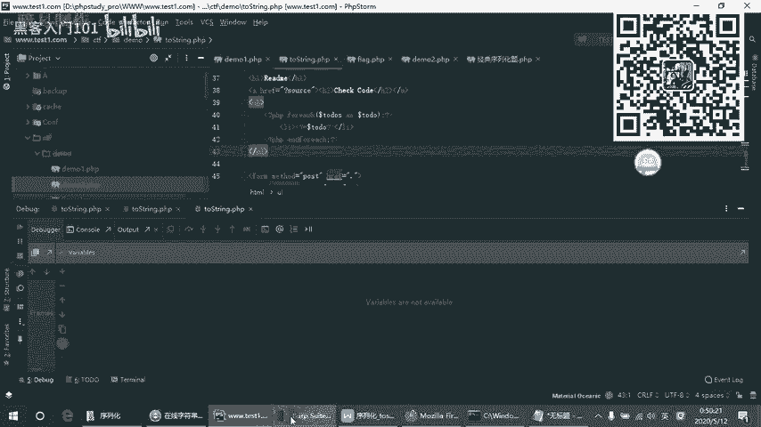

好，那么我们。

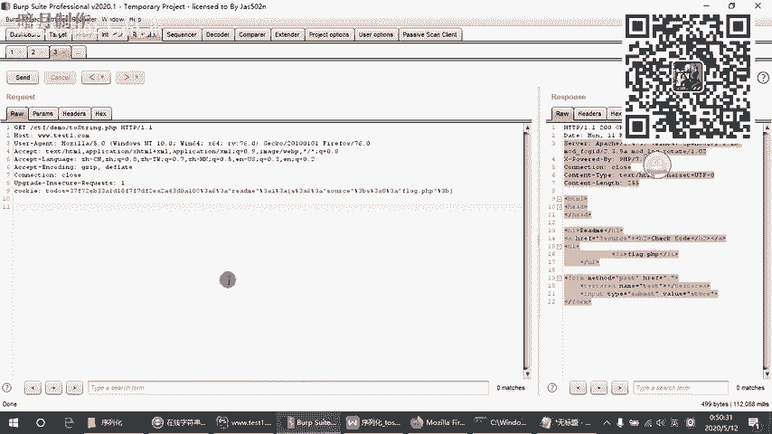

在做数据化的时候呢，我们。我们还漏了一个东西啊，这边的话呢我们最好是。把这个。这里面有个什么呢？有个。S然后让它等于。让他把它载入到一个数组里面。把它写把它写到一个c表里面啊，所以的话呢我们再来看一下。

这边的话呢，我们。

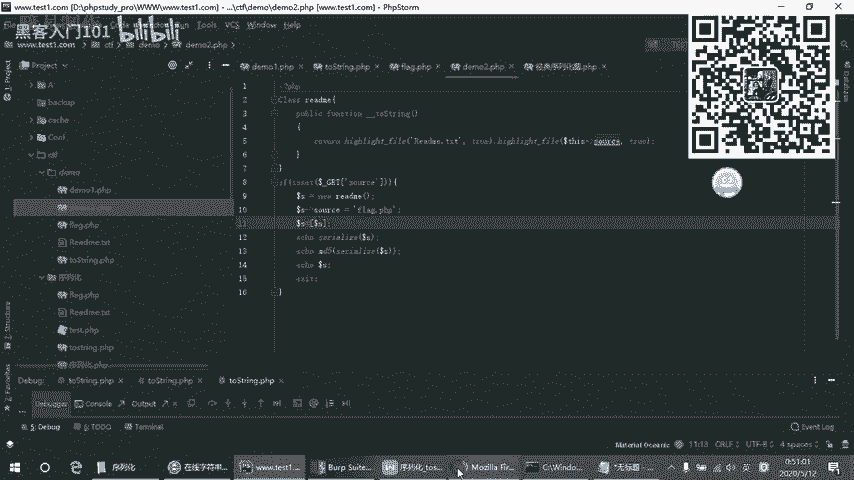

我们先把这里断掉去掉。啊，这里的话呢我们把将进去掉吧。

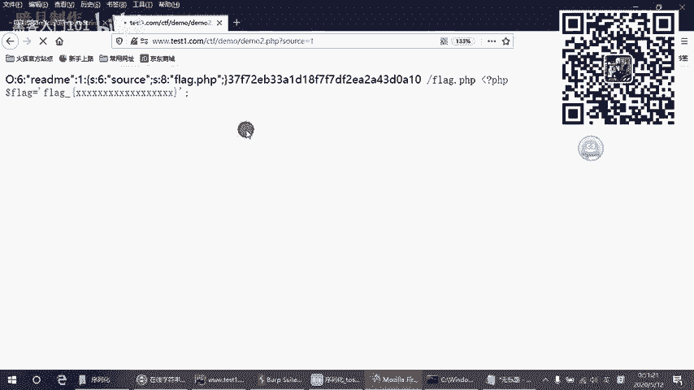

我们看一下这个。这个应该是没有的。大家看到这里的话呢，我们把它放到这个下表。

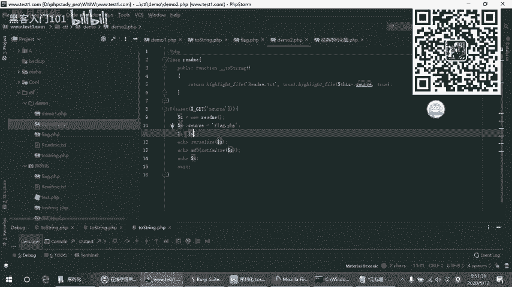

这应该是brswe在拦截啊。好，大家看一下啊，大家看到这里就变成一个数组了。好，变成个数图了。那这种的话也是一样的啊。大家看到这里的话是这里的ND5的值的话呢，就是我们后面的内容。

所以的话呢我把这面后面的内容啊把它拿过来。把这一段去掉切换掉啊。把这一段切换掉。好，这样的话就可以了。那么我们。这里面啊我们把这里面的值同央的把它进行这个格式化。接下来的话呢，我们在这边啊。

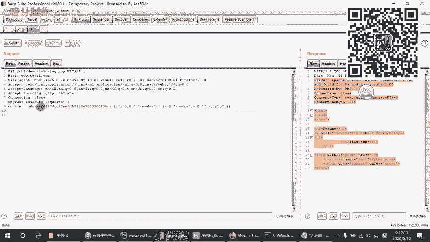

在这边进行这个剪击。好，那么我们再过来看一下。好，那这边呢我们看一下已经过来了。过来之后呢，我们。判断这个这里有没有值，有没有。对吧这里的话大家看一下，这里面的话也是刚跟我们这里的内容一样啊。

跟我们这里内容一样。这边的话呢我们下走。这里就相等的，相等的话呢，它就它会载入过来啊，它会载入过来好了，对吧？载过来之后呢，它同样的，这里的话它是唯空的对吧？它是唯空。然后呢，他就往下走往下走啊。

这里可以试一个往下走走。这里它会进行这个便利啊。这里可看到这只有一个好像只有一个。哈弗来。好，大家看到这里的话，这里它就会做什么呢？它就会做这个标我们这个函数啊，大家看一下。吓。好，这里的话就会输出。

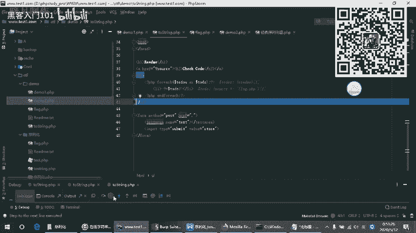

好了，大家看一下，这里的话就会获取到这个值。好，这种的话就是我们的抽心啊，这个魔术方法在。反序列化里面用到的这个。

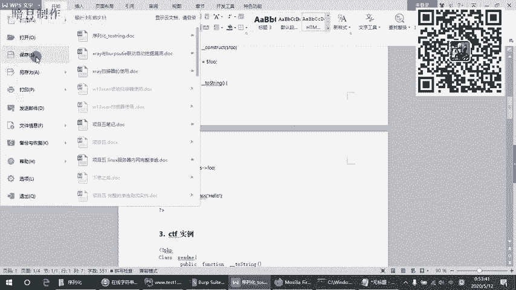

用到的这个技巧。好了，我们再给大家跟过来看一下啊。可过来看一下。再给大家试一下啊，这里边我们获取到这个估体值，这里呢它会获取到32位的ND5。好，3位ND5走对吧？这边的话呢，它会从32位后面。

32位后面取取这里面所有内容后面所有内容。后面要走。再家看一下这里面的值，N的话就是等于对吧？再等于这里面的值了。然后这边等于ND5叉ND5的话，跟上面这个ND5它是一样的。所以的话所以我们。

才会进来才会进来进来这里这边呢才会进行这个反碎列化。好。反射裂化之后，大家看到这个。是等于什么呀？对吧？现在的话是等于flash等于PHP。那这边我们让他这边的话拆，因为啊这边的话我们没有需要求的。

所以这边的话它不会启动的。他不会起的，可能我们。走一下走过来了，走过来这里进行这个输出。那输出的话呢，它就会调我们这个途进这个模式方法。还要走走。走对吧？这边的话就会读到这里的内容了。

这里的内容的话就是fge好，对吧？这里的内容就是一个fge。嗯。就。好，再看一下这里内容这些flash。那所以这边的话呢。那这边我们。我们只要。把这个拿过来就可以了。这边的话断点把它去掉。

断炼可以拔它去掉了。这边我们看下有没有申请啊。啊，没有前金。

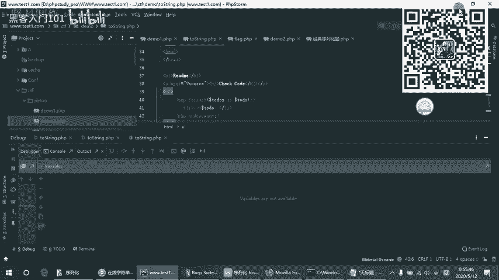

好了，我们访问访问一下。好，对吧？这里的这里呢就会获取到我们的flash。好了，那这种呢就是哎。金前要剪的内容啊。好。这个人给我这段人给我啊。再报告给大家啊。好。啊。

这种的话就是CTF里面比较常见的这个。谁列话啊。现在话的这些漏洞啊，还有这些烤漆。那么今天的话呢是我们这个第节课啊，后面的话呢啊我们我们尽量除一些CDF的。这个we本方问的起啊。

因为我们也要参加一些比赛啊。好的，我们这节课就到这里了，有什么不懂的话呢，可以。啊，是聊安女，拜拜。

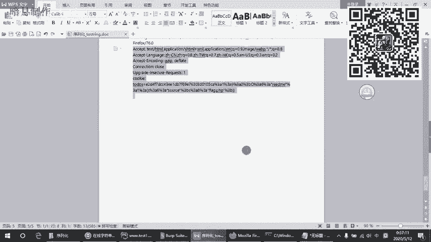