# CTF-Web历年考题精讲教程 从入门到精通 - P3：CTF题解_PHP反序列化与Session - 黑客入门101 - BV14YtkebEbY

Yeah。大家好，我是阿玉啊。今天的话呢我们给大家讲讲这个BB反序列化有这个C层啊，这个C层。那么前前面呢我们给大家讲了这个三个两个序列块啊，两个序列块。都是反式列块，然后执行一些差度的对吧？

那么今天呢给大家讲讲这个呃HB反噬列块与这个session的一些关系啊一些关系。啊，这节课非常的简难，我希望大家大家能够认真听啊，那尽量把这个呃手这个电脑或者是手机的这个。音量把它调大啊。

因为金钱真的很难这个。没有一点基础的话，你就听不懂了。好了。那么。我们先来访问一下这个网站啊，访问一下这个网站这个网站啊访问一下。啊。好，这是我的一个V8安全培训啊，大家可以过来看一下。那么这边有吃有。

还有19张有19张这边的话。有内容很多有内容很多，这里还有实例的那这5个实力项目啊给大家说一下，那么假如你把这5个项目实战做完了，你就基本上可以到公司，任何一家公司里面上班都是没问题的，没问题的啊。

没问题的。那么这里还有一些。因为我们每个每个模块都讲的比较长，那基本上没保安全的话就这些东西啊这东西。好了，这里有我的这个微信啊，大家想学习的话可以过来增加一下啊，了了解一下啊。然后有什么不懂的。

可以加我们这个微信。好的，这里我们先到这里吧，我们先打到这里了。那后呢我们继续我们今天的内容。那今天的内容的话，它是今天内容啊。呃。它是反数列话与筛ession啊，对吧？

那么我们先了解一下PGP存取筛ession的话，它的三种模式三种模式啊。那么这里三种模式啊。我们先了解第一种。第一种的话是PHB序列化的这种这种的话差。叉是HB大于5。54的，或者等于5。54的时候。

它才会有这种。类型它才会有这种类型的，这种类型的话，你需要在PHBINI或者是在PHP里面进行设置才才会有的。那么看一下它的类型类型的话是经过这个函数是6卡的一个数组。好。

这里的话KHB类型KHB类型的话就键明数值竖线经过这个这个序列化函数啊处理的值。那么还有一种的话就是我们的啊KHBBIARY这种这种的话，键名的长度对应，而是可以把字符。

然后加上键名加上我们的序列化和的值是这个样子的。那么这种这里的话我们最好是配合代码来观看啊，来了解，然后加上我们的这个。

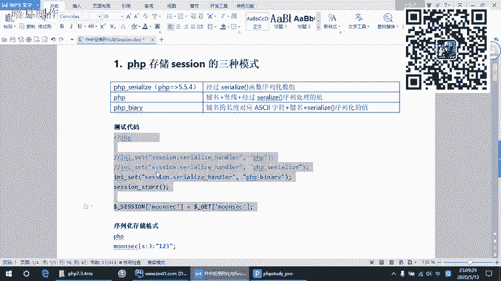

它加上的加上我们这个印象啊。好，我们先把这份代码拿过来，在这里新建一下。好，对吧。我们点击。好，我们首先来看第一种。首先来看第一种啊。第一种的话是PHB类型，大家看啊这种的话是PHP类型的。

这里就是说把我们的筛选的这个hand，把它修改成PGB类型的那这边的话有个PGP啊，有个s star虽然你大的话，就是说我们在访问这个页面的时候啊，在访问这个页面的时候会给出一个啊筛选给我们。

他弄的我们通过这个筛呢，这里假如有只过来的话呢，我们会在服务器那里。的sson名字里面写入我们的。变量跟直变量跟直啊。这里可能大家听不懂，那大家看操作应该是没问题的。好，我们先来看一下。

这里打开谷歌浏览器。这边的话呢，我们点我们先来打开啊。

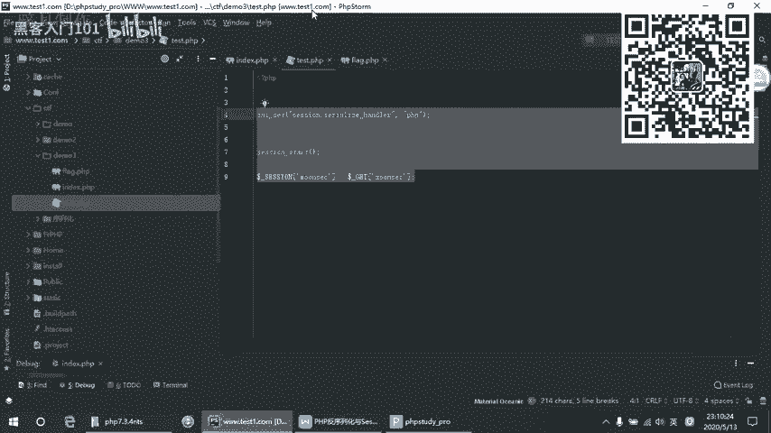

这里的he。好，现在的话呢我们先给它复个值，这里我们先把大力关掉。先给他一个字好。这里是NOS1器等于123。

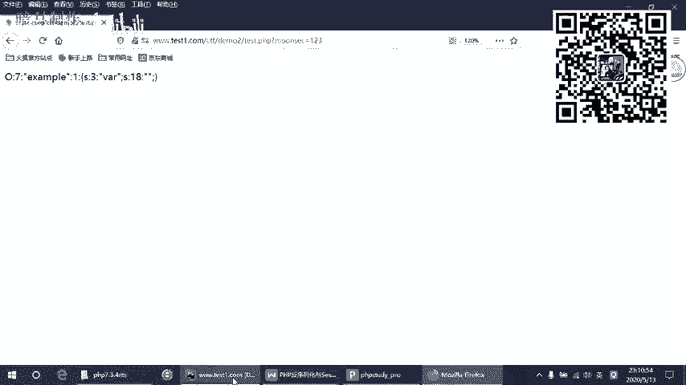

嗯。

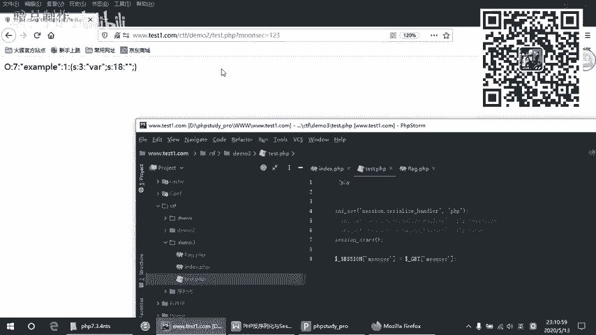

这里是DM某3啊，DM3。好了，那现在的话呢我们来看一下啊。这里面有个cookie。它就可以。好，那么找到了啊，我们再对应在这个网站里面找一找这个对应的这个文件啊，我们打开看一下。大家看一下啊。

这里的话它是PHB类型的。我们看一下对应的是什么键键，然后这里是类型类型的话，这不串大家看啊这里有三个长度，三个长度啊。

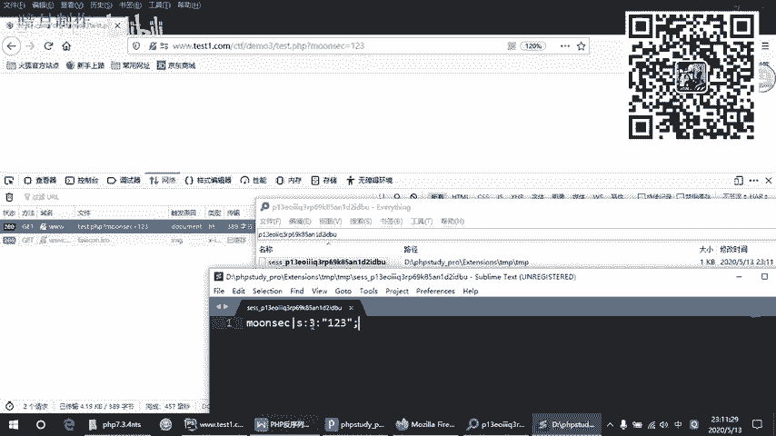

那这里的C乘级那个C等级的C神级，它是什么呢？它就是我们在这里生的一个cookie给我们啊，根据这个cookie呢。

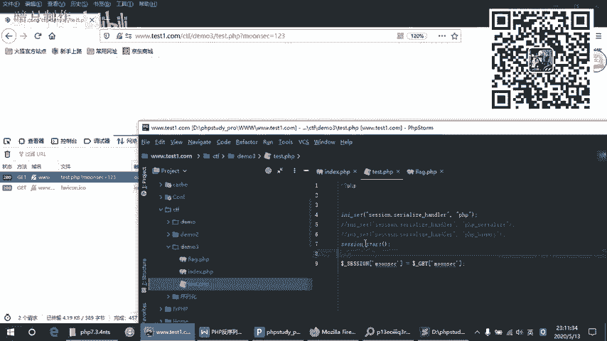

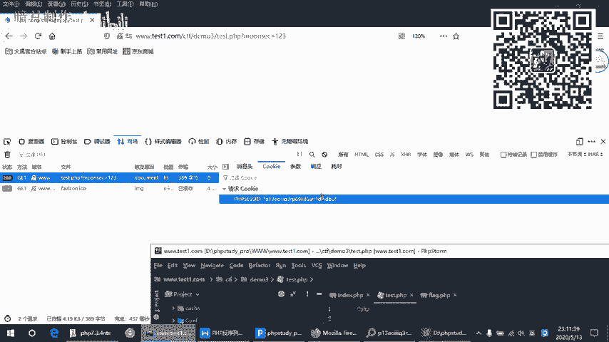

我们去找到服务器里面的这个文件，很能让给它里面写入我们的值，给写入我们的值好。

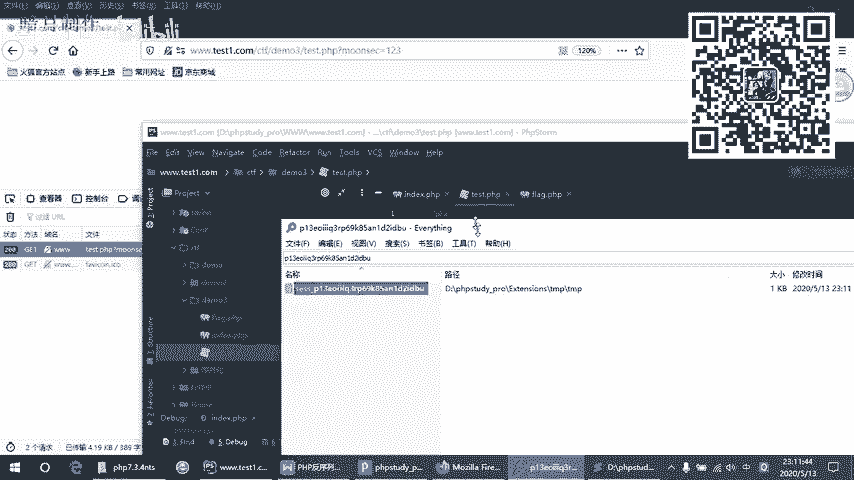

那么看第二个。第二个的话，它是呃HP。

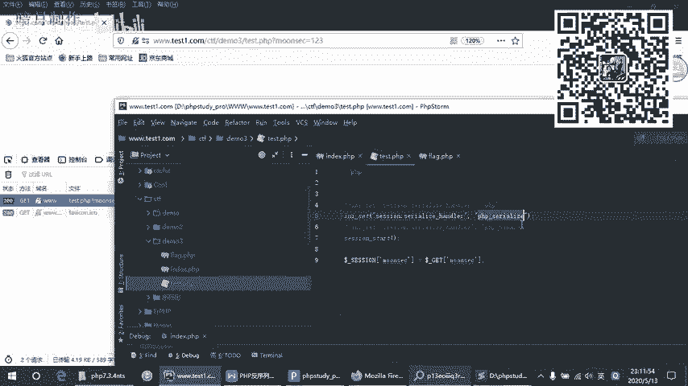

协化类型的对吧？好，我们先来看一下这里的话我们刷新，刷新之后，我们看一下这个文件，这个文件就改了。大家看啊改成这个样子了。这里有快递数组，这里有数组，这里也是数组一。那么这个里这里的话，字幅长度为7。

这个长度为7，这里的话长度为7，这里的话也是一个字符上长度为3啊，等于123。那这种的话也是啊这种的话比较好看一点啊。

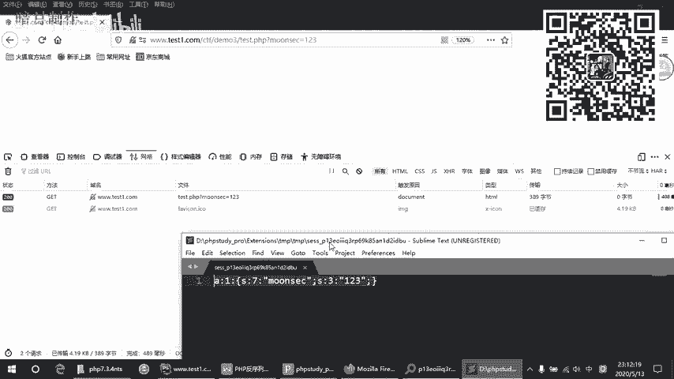

那么我们看第三种。第三种呢。

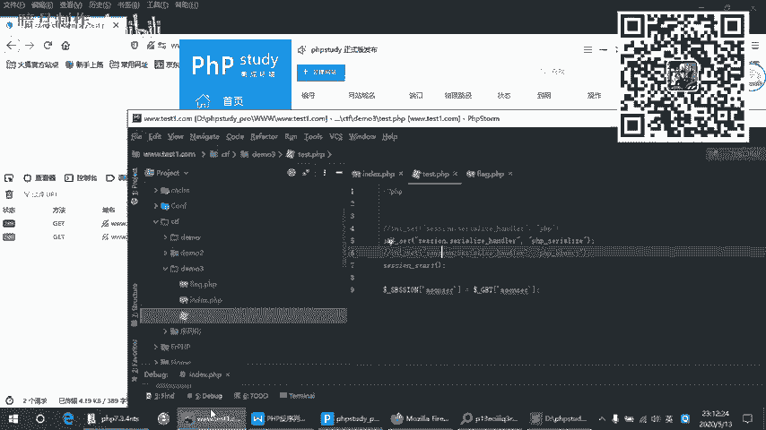

我们看一下第三种。那第三种我们来看一下啊，这里它会报错的，因为这里它有值，它有值啊，它写不进去了。

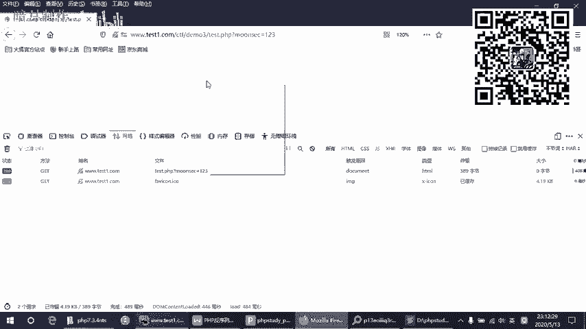

他删除不了。好了。这边的我们看到这里啊，它是2K码的。20K码长度的。字符啊，咱们字符加上加名对吧？加上加名，这里有个SS的话表示字不转，这里的话这16块之后的，这里是16块之后的。啊，有这么三种啊。

大家记住就可以了。

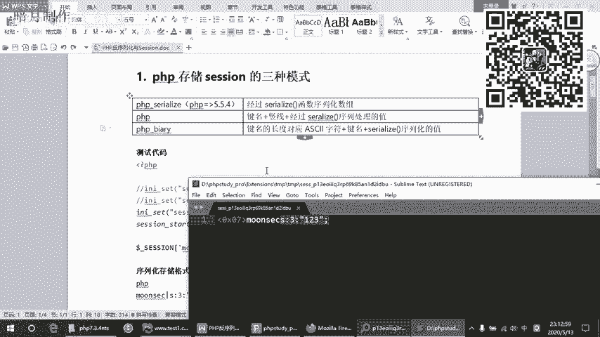

那么大家最好去做一下这个测试啊，然够加深一下自己的这个音象。那么接下来啊给大家讲讲这个CDF企CF企业这个棋很难这个题很难的。系很难。你需要点一些基础啊，然后你不懂的话，你就先啊。啊，只认证清啊。

认证清很重要啊这个。好。这个代码的话呢，我们已经写好了啊，在这里面啊。

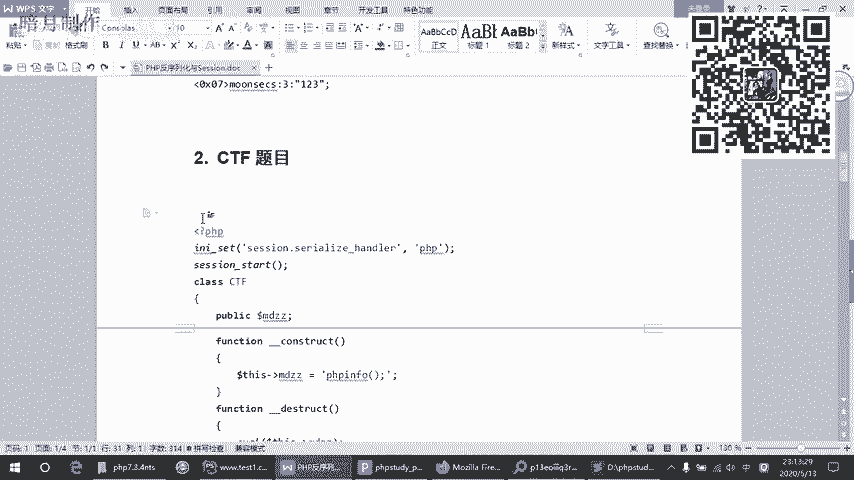

好，大家看啊，这里面有两个文件，这一个叉CHP文件啊，inestPB还有这个fge这个f。就是现在的话呢，我们通过这个代码来读取这里面的flash文件啊。这个flash的话呢我们是。

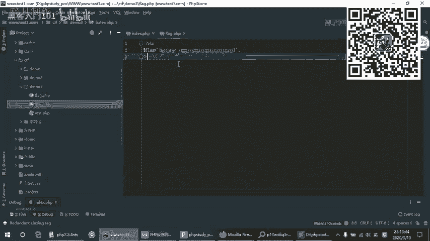

我们是什么呀？我们是 have来谢。这读不到的里面内容我们是读不到的啊。但是我们在这里的话就可以看看啊。那一般情况下我们就会把这两个文件啊上传到服务器里面。然弄到我们客户端的话。

就是我们这个RCDF选手，然后去。

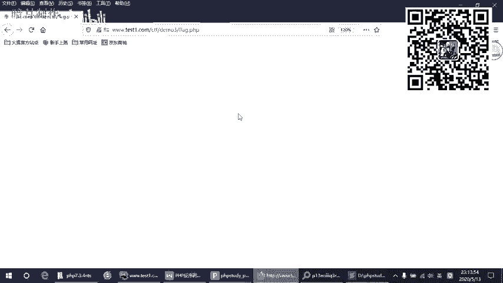

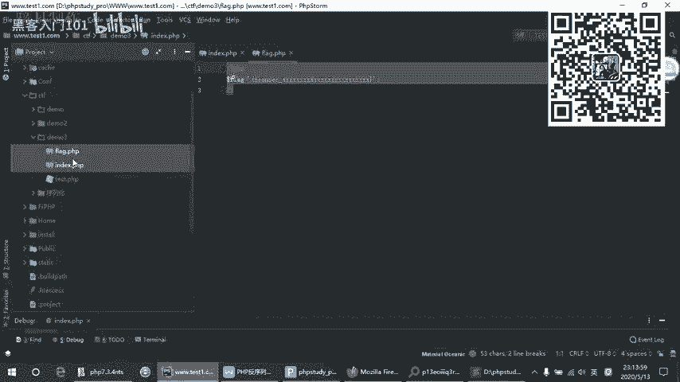

去访问我们的服务器啊。啊，因为这边的话它是。他是在本地演示啊，所以的话在代码都是可以进超市的。那0在实际的情况下，差不是这个样子的，到底你要记住。

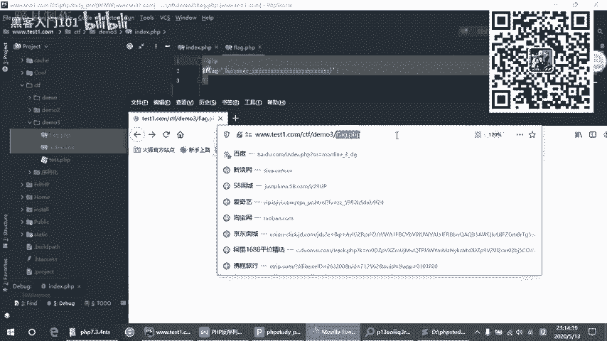

好了，那么我们来看一下indiaS点HP好，这里给大家分析一下啊，那么我们在这里吧。

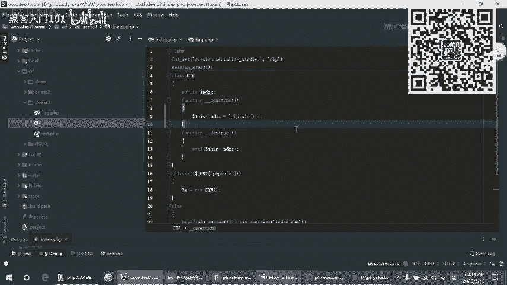

在这里我可以更好一点啊。

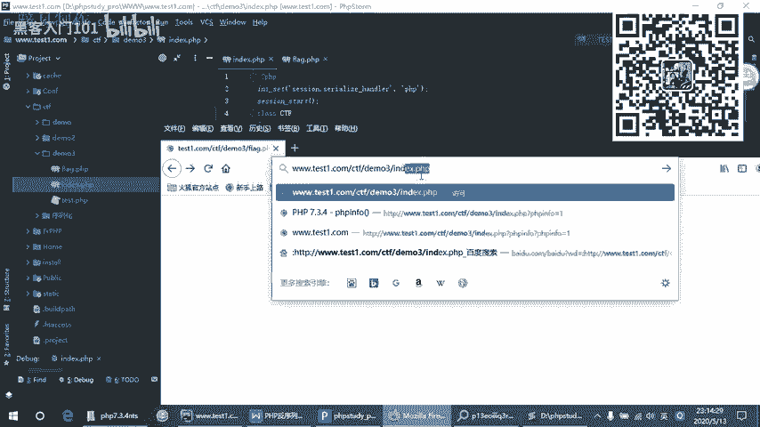

好了，再家看一下这边代码，这边代码跟这里面一一模一样的啊。😊。

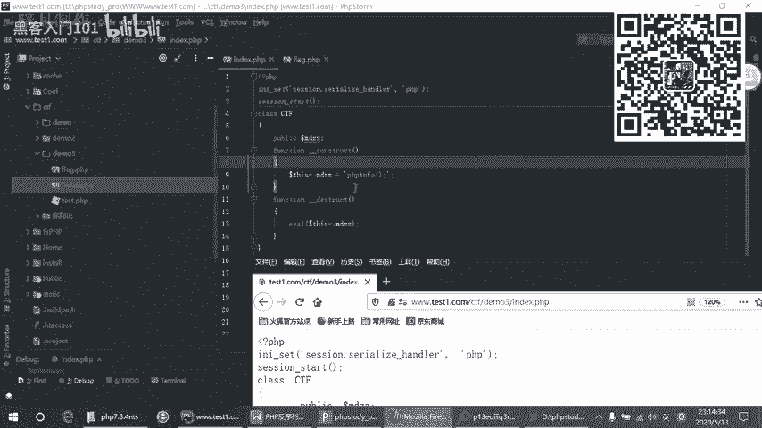

一模一样啊，那首先这里有1个IINIT这里设置它的这个类型为什么VPHBPHB类型的话，我们在上面给讲过，就是这种类型。啊，那么这里有个筛选star，筛选star的话就是在我们这里生腾。啊，生成什么呢？

生成这个cookie。生成这个口体啊，生成这个口体。好，那这里面呢它有个类，这个类的话叫做CF类啊，CCF类这里呢。😊，这里我们先不看啊先先不看这里的话它是什么？它是假如get里面啊有这个PP音。

就是说这里这里面假如有PTP音。这里音for差有值的情况下，差有值差差有值的情况下，它会在这里实力化这个类这个类里面啊，我们看一下这个类里面有这个变量啊，有这个公共变量，还有这里面有个构造函数。

这个构造函数就是我们内在水绿化的时候，它会做这个操作，它会做这个操作。啊，他现在的话是把这个KGP音符这个字符串把它给到这个变量啊，那这里还有个四个函数，四个函数的话就是我们类。我们类在。

使用完的时候啊，它会调用这个四个函数，然后大家看到调用这个四个函数的时候，它就会调用我们PTB音PDP音。因为这里的内容这这里的内容就是等等于上面的内容，所以的话它这里会调用调用这个字符串啊。

那么假如这里啊这里查P一会没有值的话，就是说现在的话我没有值，现在的话是没有值的啊。他就会做什么？他就会读取我们index点PHP，然后把把它什么。把它高亮显示出来，这里我会高亮显示好。好。

那么现在的话我们给它值给它值啊，大家看这里的话肯定会显示别级荧光信息给我们。😊，好，那么们看一下这里有什么可以利用的点。好，那么大家看一下，这里有个PP sessionession啊，对吧？😊。

那么这里面有个类型保存类型为为文件啊为文件。那这里有个s part。C8的话就是我们的这里面的路径。那这里面我们看一下这里面的这个handerhander，大家看啊。

这里有这里是PHP那这里但是这个地方的话，它是什么呀？它是个。它这个这边的话，它是这里也给大家说一下，这里的它是一个局部变量。这里的话它是全局变量。这个全局变量的话，它在哪里设置啊？在PHP。在哪里呢？

在我们的PHP还哪里面设置的，就是说。我们先打开这个目录啊。先打开这个目录，然后呢，我们打开HP3。43。4啊。打开一下。好，大家看一下。这里PHP默认的话都是注释掉的那注册掉的话，它都是注视掉啊。

假如它注射掉之后啊，这里的话就不管用了。不管用之后它默认的话，它是它都是PHP它都PP那这里的话因为它是更改了。他说什么？他是更改了这里面的值，所以的话，这里的全局变量的话，它就是。

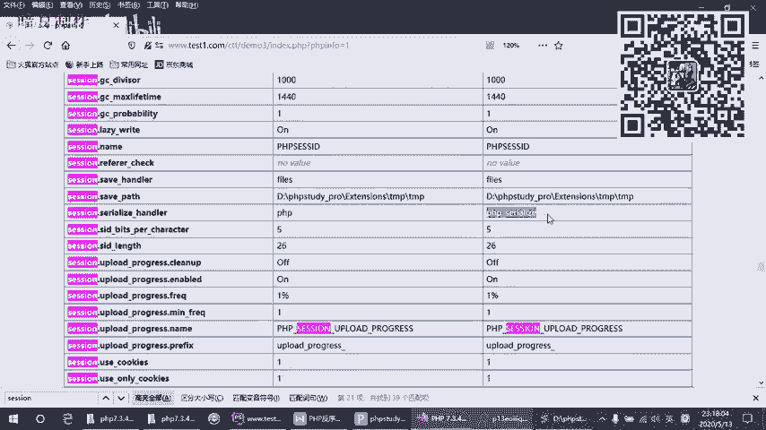

这个类型啊，那这里PP从哪里来的？PHP的话就是从。这里面来的这个页面来的啊，这个页面来的嗯。这个页面来的。

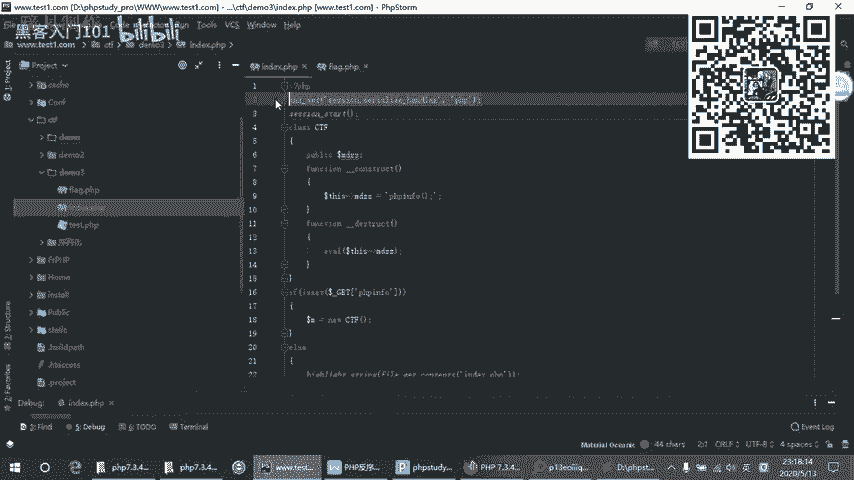

大家一定要知道啊一定要知道。好。

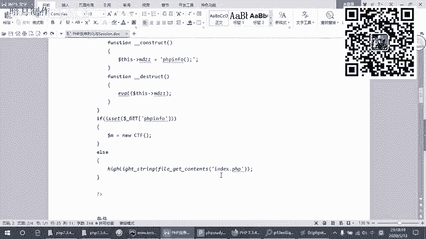

那么。我们大家看啊我们看一看。那现在的话呢，我们解这道题怎么来解啊？我们假如可以控制这里的变量啊，控制这里的值，我们就会我们就可以可以做任何操作。那怎么控制法怎么控制法？

怎么控制法？好，那么我们先把这一段代码先复制一份，然后在这边点打开一个点码。demo啊好。

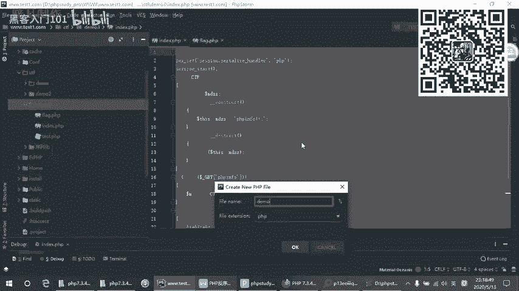

我们把不需要的把它去掉啊。这里面呢我们这里也去掉，把留给这个session star啊。这里面的话我们更改更改成其他的。

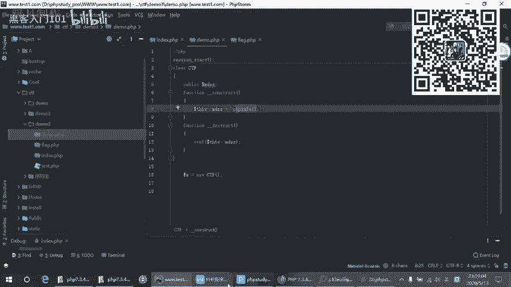

这里面的话我们更改成。

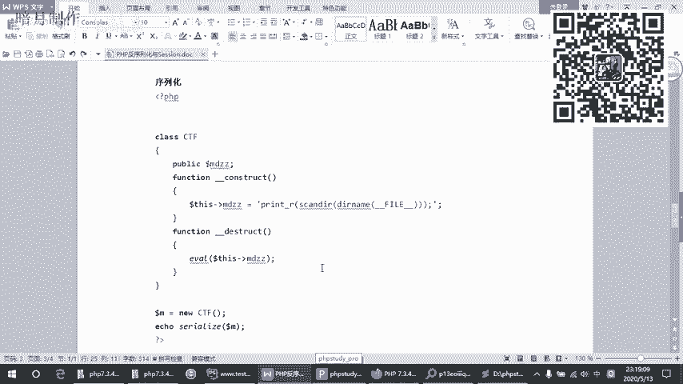

这个吧。哦，这里。跟这加V好了，这里就可以了啊。这里的话我们看到这里的话它是车间师大，这里现在话是没有用的啊，这里这没有用的。那么这里的话它是一个类类在16块的时候，才会做什么？

才会把这个变量给给到我们，把这个字符算给到变量变量。变量呢再会来到哪里？它会来到这个地方。因为我们有个s购方法，这个ci购方的话就是说累。叫。在退出的时候啊，才会调用这个函数的那这里的话有个EV1。

所以的话它这里的话会执行EV1操作啊，我们找关系一下。

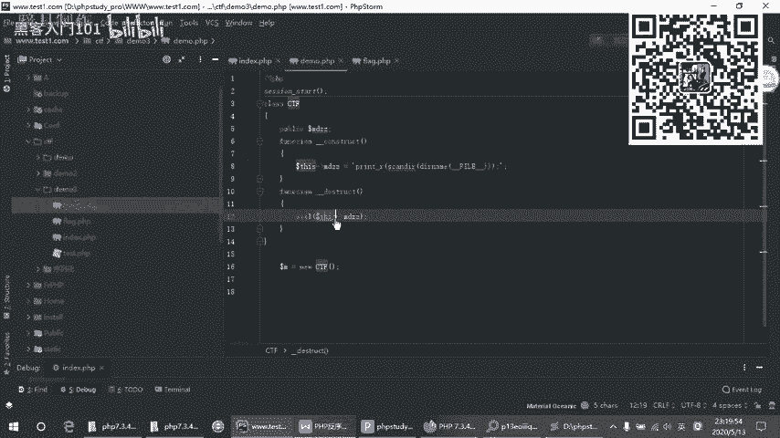

这里有个电幕。好，我们来看啊这里的话就是做什么呀？就会把这个函数就会说把当前的。

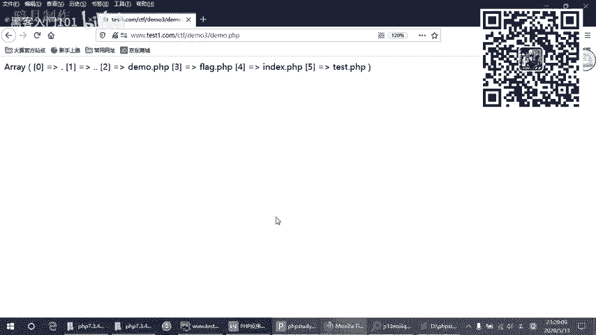

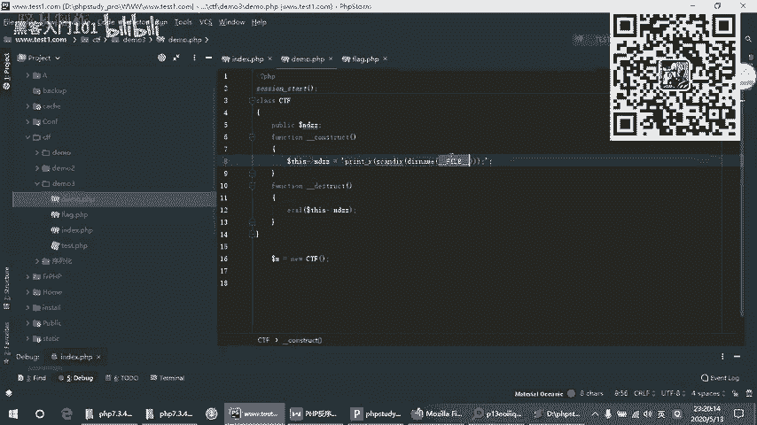

文件目录啊。用这个函数进行这个。用这个函数，这个函数的话是扫描文件的对吧？然后把它的结果打印出来。

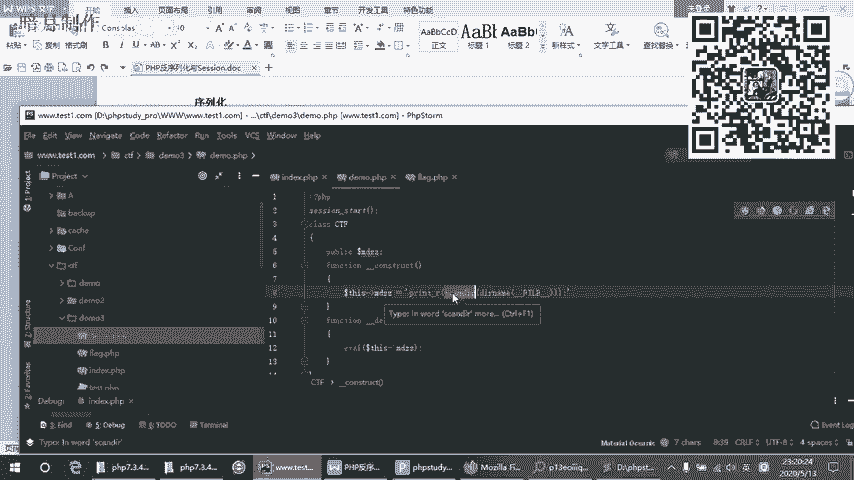

那所以现在的话我们可以看到这里面的结果就出来了，并且这里它是一个数组，它是个数组。好，那么。

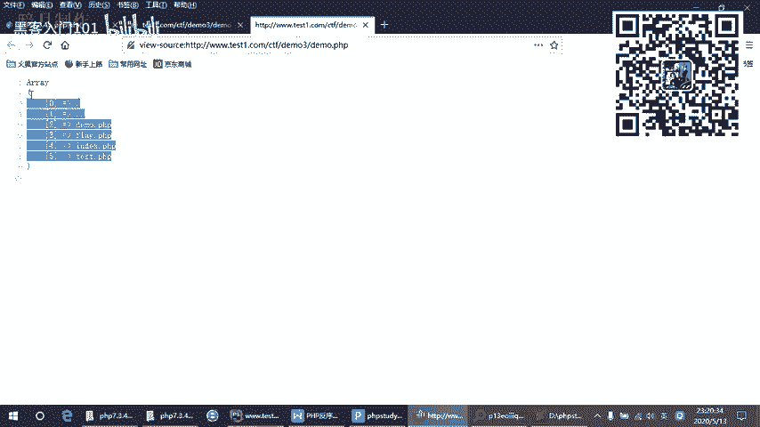

假如啊我们把因为呢这这边呢这边的话我们需要返序列化的，所以的话我们先把现在这边搞一个序列化。好，序列化的话可以这样来做。CRY。好，对吧？那么这里的话我们序列化把它传到学身里面。

这里给他一个名字叫做披露。好。好了。对吧大家看啊这里我们序列化之后把它传到这里，这里面啊，传到这里面我们来看一下啊。

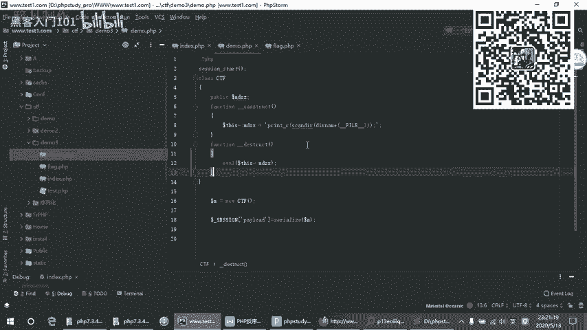

好。这里我们已经执行成功了，你们看一下这里的。sson。好，这里的ction呢已经。在这里找到了，找到之后呢，我们看一下。好大家。我先把它去掉啊，再来执行一下。

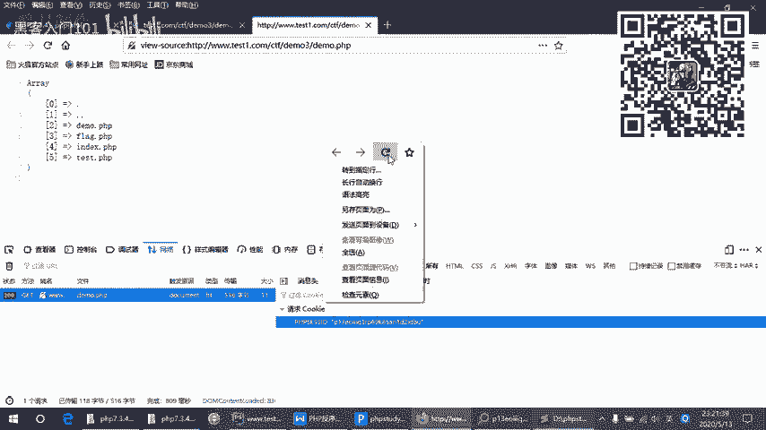

好，大家看这里的话就会变成什么，对吧？就会变成什么？就会变成我们的。

我们的这个序列化序列化，大家看看这里的话是哪种序列化，它是。

它是哪种是6块，它是我们。我们拿走啊，他就这种。因为呢我们PGP。还哪里面啊插全局的话，它就这个啊，因为呢我们这边的话也没有指定，没有像我们的inddias一样，指定我们这个PHB。

所以的话它默认的话就是这种这种形式，它这种形式啊。

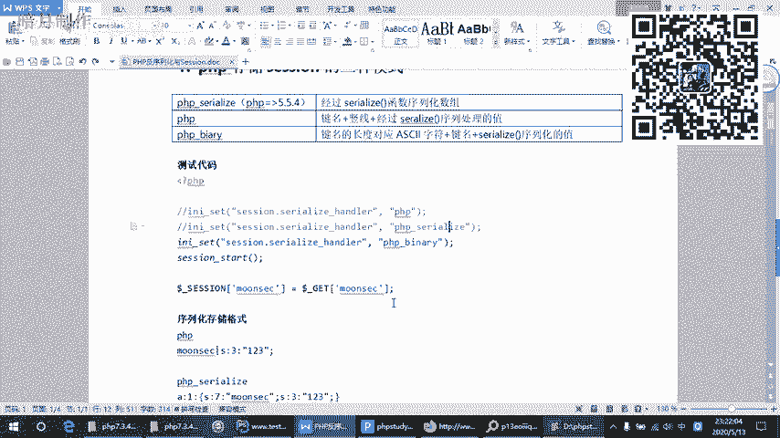

好了，那么。那么现在啊现在的话呢，我们来看。我们这里有个大家看啊inDS里面有个这里的话设以它的类型为PHB这里有个时间时大啊，它这个时间时大的话呢，它会去查找我们的这个文件，然后里面的内容。

假如它符合它的话呢，它就会把它进行这个反序列化的啊。假如它不是的话，他就把它清空。好，所以的话现在呢我们来做操作啊，我们来访问他。

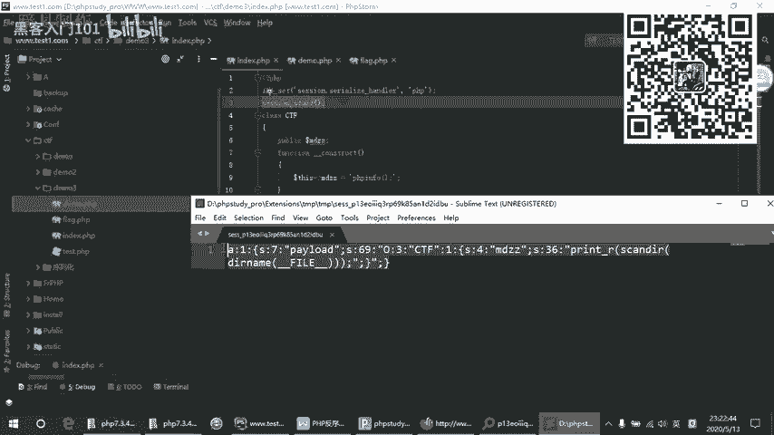

访问它啊反问它大家看啊，访问它的话是我们看一下这里的值是变成空了。因为呢这里它是BHP跟它类型不匹配，所以的话它这里面啊它测置为空啊，它是为空，对吧？一定要记住啊，这里的一个。

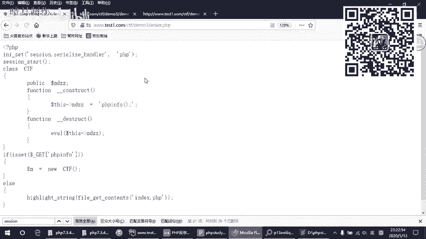

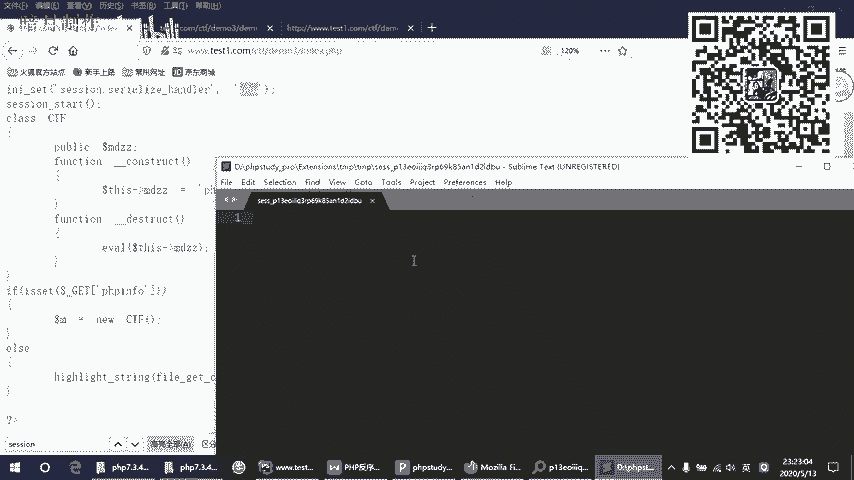

啊，那么现在的话呢。

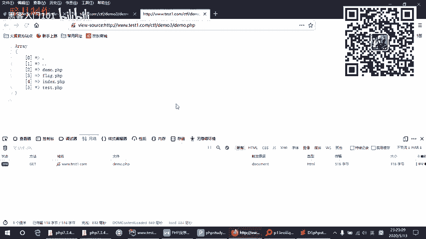

假如我们在这里。加个数啊加个数的话就变成什么就会变成这种类型。

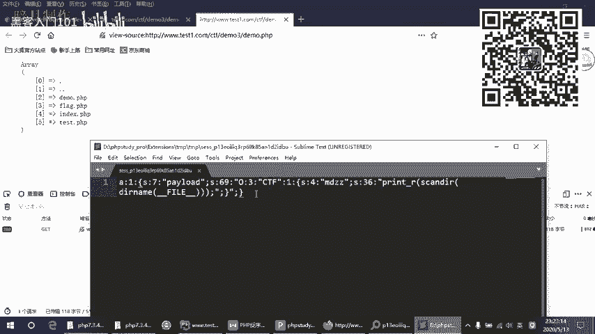

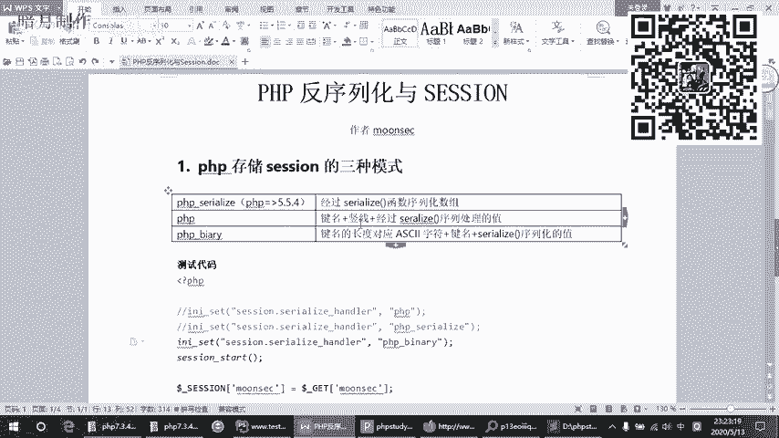

这种类型啊这种PHP类型。那么这个类型这里的类型，这前这一段部分的话，它会变成一个兼职，后面的话变成序列化，变成序列化啊。那么我们的页面啊它也是个PHP，那么这里有个HP star。

那所以它这里的类型呢。

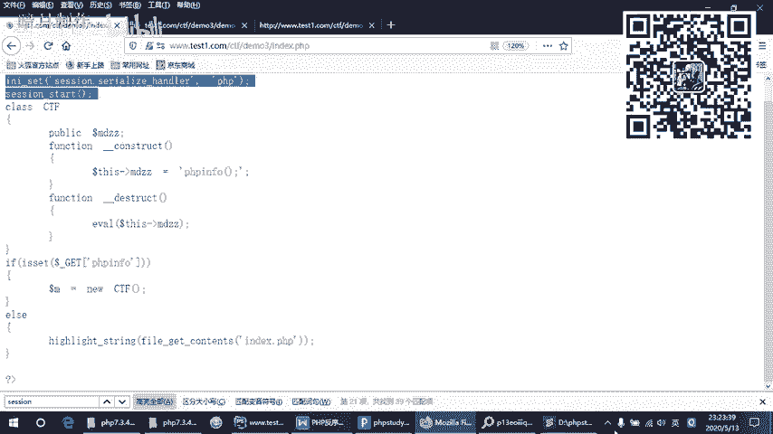

插这里的话，它类型跟它类型一样的那所以插这里它就可以进行这个反碎列化了。反碎列化。

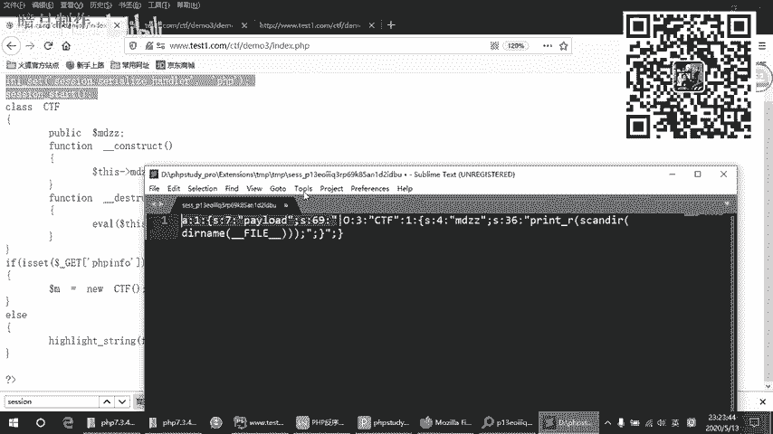

好了，我们看一下反射6块之后呢，它会把这里的直径更改，更改之后呢，它这里的话就是EVL。那么我们的。这份代码就可以正策的运行，这是我们的。

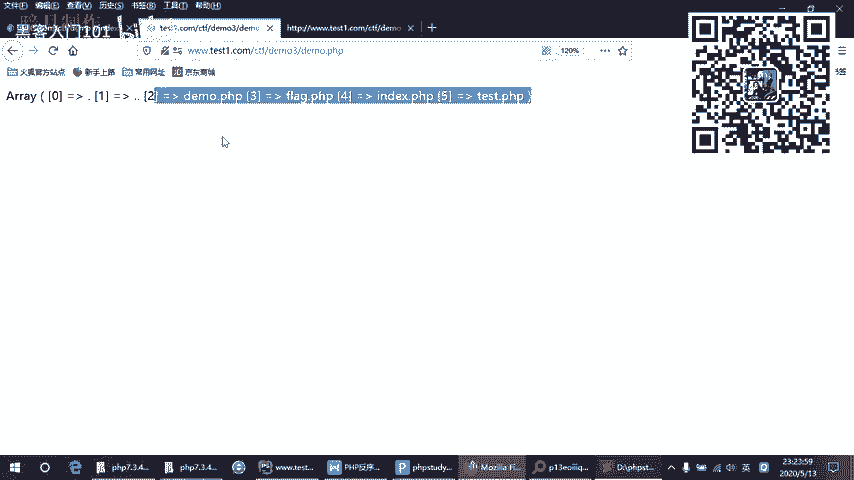

这一段代码它是可以正常运行的这这一段啊。

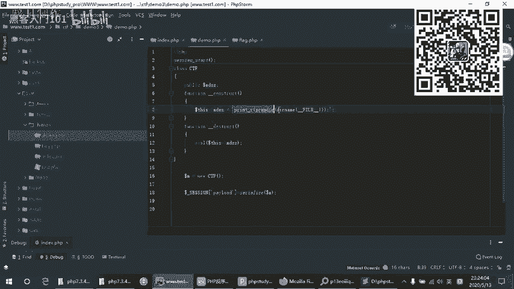

好，我们来看一下。好，这里还是没有操作啊，我们看一下这里有什么有哪里错了。

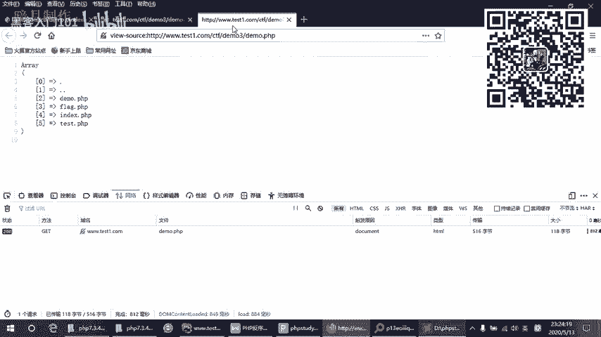

你在这里加进行测试。我们再来设试一下。好，这里我们没有保存了，刚刚是没有保存的。那么现在的话我们来设置一下。

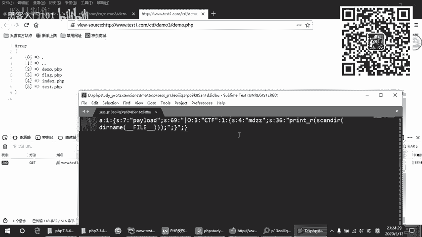

好，对吧？这里的话就会执行了啊，我们在这边复值，然后在这边来读取值之后呢，它会进行这个反序列化。反序列化之后呢，它会新建，他会把这个类啊，它会把这个类啊实6化实6化。因为这里的话来看啊。

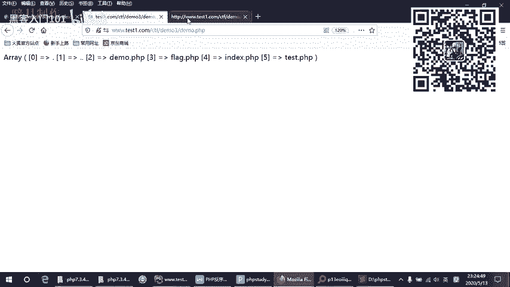

这里面我们。我们是怎么给他的，我们是给这样给他的。我们在这边的话，16块之后再给他一个16块的，在这里给的。所以话他这边反16块的话，他还是会执行16块操作的。16块操作的话，它就等于这为值。

所以的话这边这边它是才会执行。

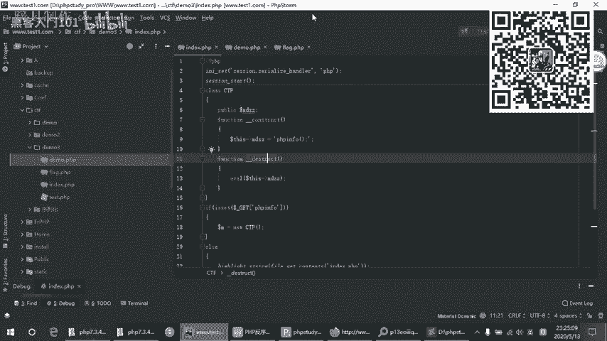

这个操作。进进行这个扫描操入啊。好，那么这里你这样的话听不懂啊，没关系啊，你可以调试嘛。

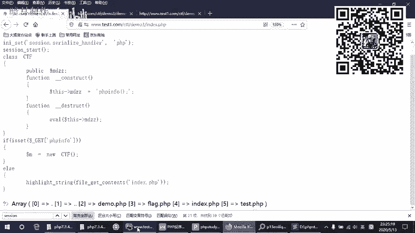

对吧也可以调试，对不对？

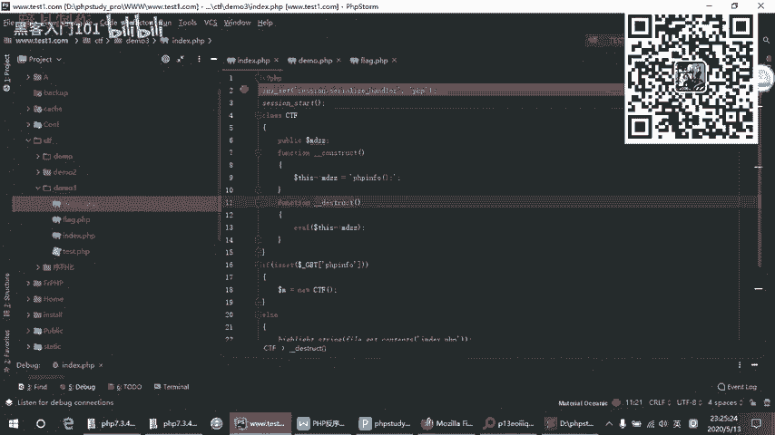

这里有块 star好，十大就可以了。这边的话下个端点，然后在这里进行这个运行。

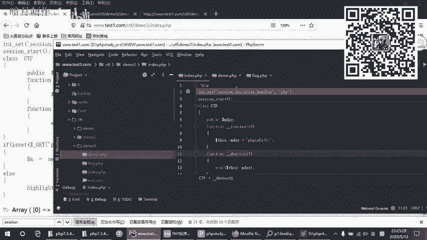

验证之后呢，我们抓到这个调试啊。我再加这个调试，这里面我们是没有知道。这面有cookie和搜狗，我们让他走走看看啊，走来到C城时代的时候，它就会获取到C省了，对吧？随选你们的知导来看啊。

这里它是虚列化的对吧？那么我们看到这里是6块。它的变量啊，这个变量啊就变成什么NDGG等于什么？等于这个对吧？好，我们让他走走一下，看一下。好，这里检查是否有这个PDP音播来，它没有嘛？

没有的话就会显示这段内容。但是啊我们再让他走一走。走的话抽的时候，我们再看一下这里di的CTF这个类啊已经被16化了。大家看16化之后啊，它这边的话，它这里面呢它这个值也过来了啊，也过来了。

很弄呢它过来之后，这里的值也会变的也会变的。吓。好，他是这里的纸已经变了啊，要要走。好。要走了。啊，这里有块执行的是什么这段代码。

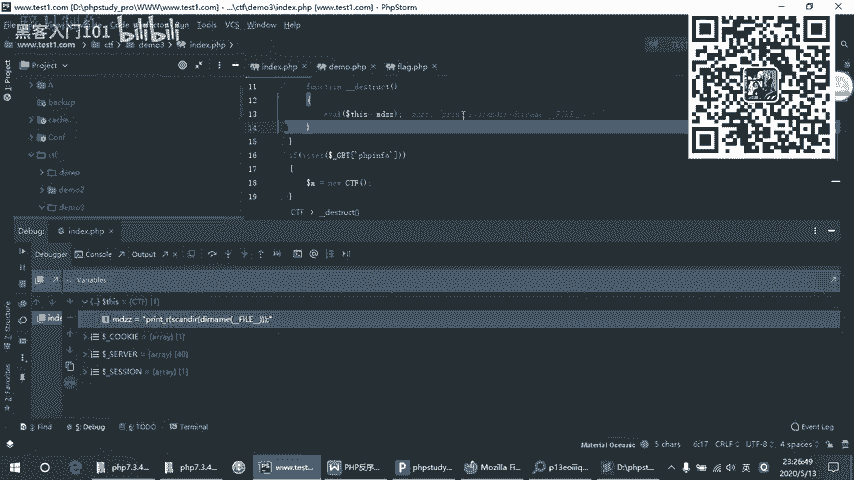

好，对吧？实示完之后呢，它就会在这里显示出来。

我们再来调试试一下啊。好，我们再来调试，来刷新。好，首先。好，走。就。So。走。好了，大家看这里的水变了啊变了。那么这里的值也变了啊，它值也变了。所以的话它这边的话。他会做什么操作啊？

他就会执行我们这里面的代码，这里面代码。好了。好了，那这是啊这一叉的一个基本的这个思路啊，基本这个思路就是我们这里的。

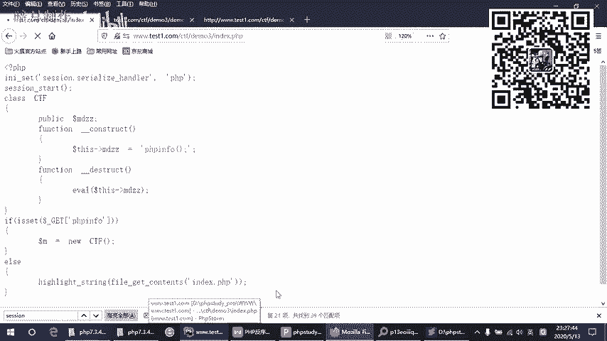

我们这里的。

嗯，这里的话让它执行吧。

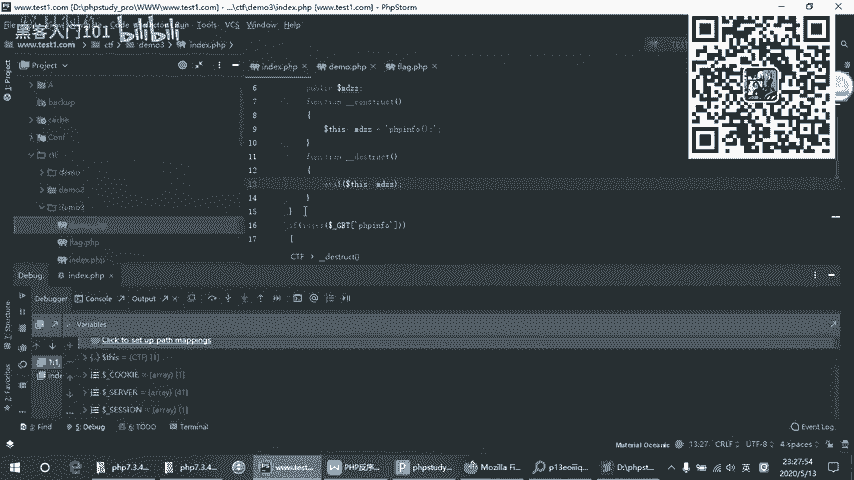

那先把它断掉啊。好。大家看一下这里的类型跟它类型一样，它会读取，很多，并且把它16化啊。

16块钱后，它会改变这个值改变这个值啊，完到。他这里面。第士。第四，这个这个类本身的值。在这里的值的话就会变成。扫描了目录的值这段字幅套，把它改成这字段字符套。所以的话这边的话才会进行操作的对吧？嗯。

好了，那么现在啊我们。😊。

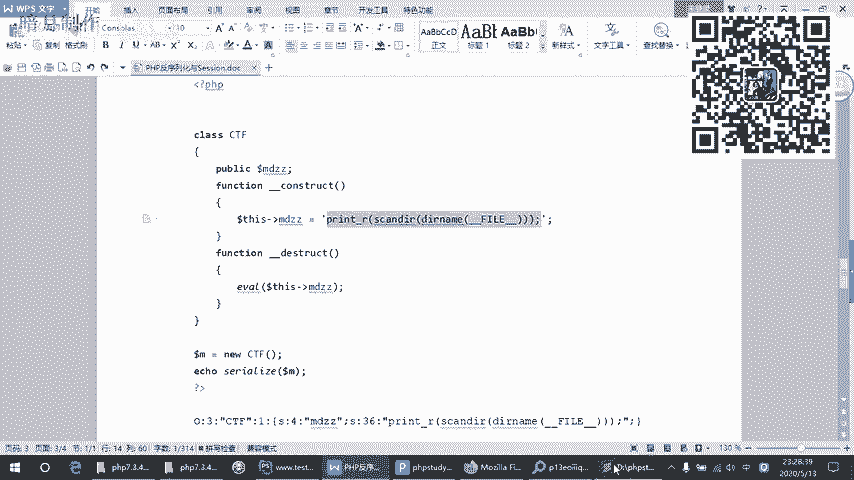

我们知道现在的话，我们假如我们的。库我们的session里面的内容啊，但是列话内容符合它的条件啊，符于它的。

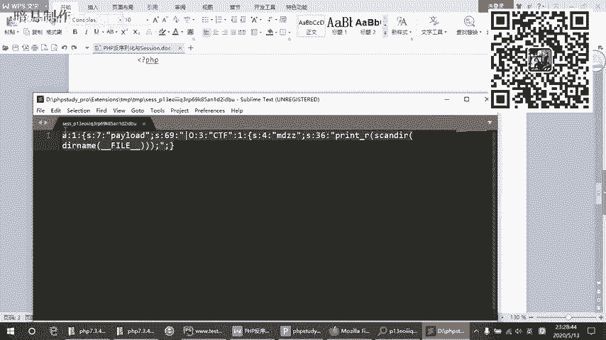

PGP。类型的话呢。他会把它反系列化啊，反系列化。好了。那么在实在实际的情况下，我们我们不可能我们不可能在这里进行控制吧，对吧？那我们还有什么办法进行控制啊？

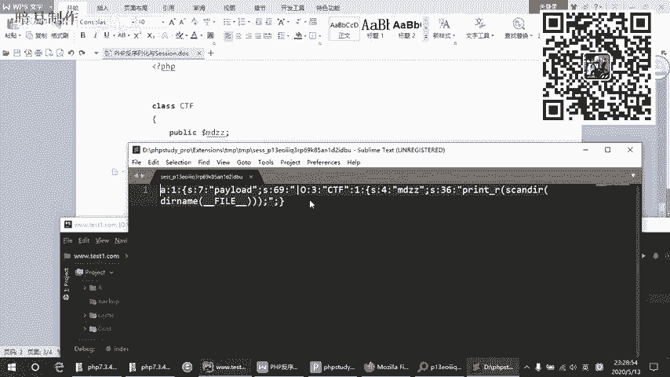

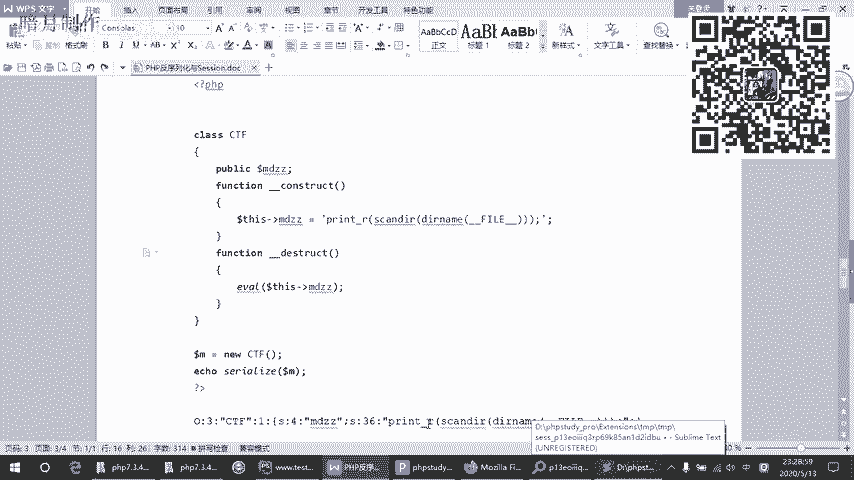

那么现在的话我们看到这里的话。

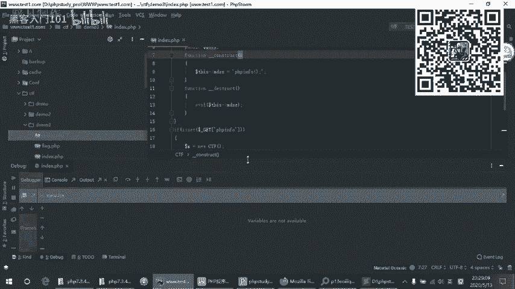

我们来看一看啊我们来看看。这里的PTB音过。好，唔啦大家啫。😊，嗯，打开一下，我么再来看一下。Sason啦。所以在我们可看一下啊，我们刚才看到这里有个。这里这个这个有啥用啊，这个等于F。华弗的话就是。

诶。off默认的话，它是开启的默认它开启的。现在的话它是关闭的，关闭的。off of开启的话就是我们写入这里的内容啊，写入这里的内容超位。

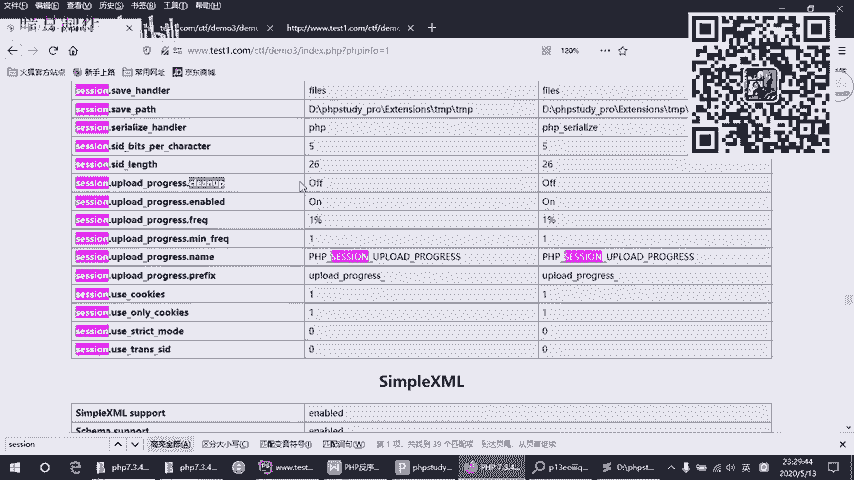

我们上传的时候，他会把这些内容写入到这里来，然后呢，假如他这里上传完之后啊，他就会把这里内容把它把它清掉，把它停掉啊，把它停掉。

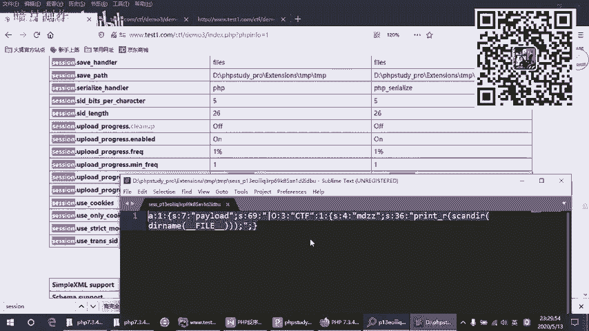

那么还有这里的话插有个。这里 on什么意思啊？这里嗯什么意思？还有这里的。对吧这里啥意思啊？这里都是啥意思啊，给大家分析一下啊。那么我们这里有一个说明，我们这里有个说明啊。这里有一个大家看一下我们。

我们的局部变量，它是PHP然后这里主变量啊。在这里主变量它是1个PDB啊，这个那么假如它这个默认啊，默认的话，它是开启的。这个的话它是开启的。但是现在的话它是关闭的。然后呢，这个开启的话。

这个默认它是开启的开启的。然后呢我们看一下这里的把HP它里面有个把。大家可以过来看一下这里的。啊，这里有它的前置说明啊，前置说明。那就这里就是说什么呢？就是说当这个值为N的时候，它这个值为N的时候。

它是用来检查检查一个文件上传进度的。当文件当一个文件上传时，同时pos一个与PHBINI中在线二内聪明的变量时，就是说我们上传的。上谈时，假如有个直叫做。有个值叫做啊这个值啊。

这个局跟这这个局我们上端的值跟这个值相同时。他就会。在携层里面增加一条数据啊来设置这个C层，那对吧？那这个C层的话，它是你序列化的，它是你序列化之后的。那你一定要数据化之后的，不然的话，它不成功。

谁入不进去。嗯。好了，那这里的话呢我们准备了一个准备了一个上传表达，大家看一下。

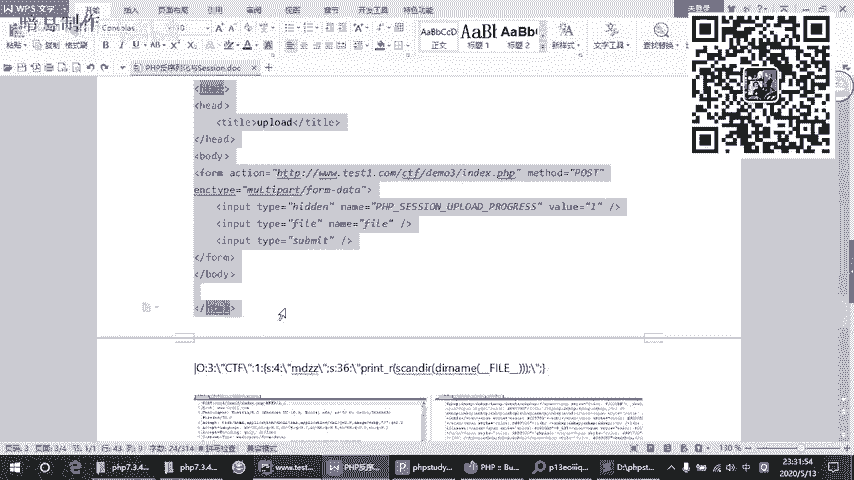

好啦。上的表达alload。

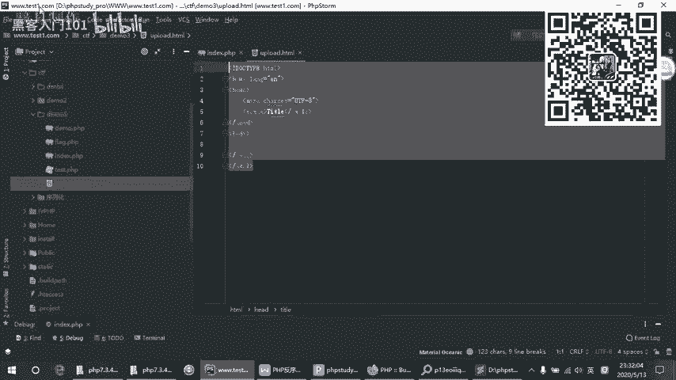

好，大家看一下这里的值跟哪里的值一样啊，刚。跟哪里的值一样，跟这里的值一样，大家看。跟哪里的值一样，跟这里的值一样。这个表单的值跟这个值一样啊，这里它并且不能为空，随便这里的话给大一个一就可以了。

那提交的地方的话是我们的index啊。对吧这里的话是文件类型，对吧？文件类型，而且我们这个它是开启的。这个它这个它是开启的，我们就可以。你即系。这个文件下追加sson追加谁ction。

然后呢这里的话tout的话就off，就是文件上的时候。假如插这里有off的时候啊，它这个里面上同的文件啊内容它是不会被删除的。如果on的话，它就会被删除的。知道吧？所以的话这里可以保存的。好了。

那现在的话呢，我们可以通过这个上等表达。来在我们的C里面写入纸好了。我们来访问他，这里的话我们截一个包，用这个啊。嗯打开不随。这里应该打一下。嗯。嗯。好了，这里打开了啊，打开之后呢，我们来接包。

先把这个关掉。让他访问一下阿loan天亮。好，对吧在这里上传。在这里上团啊，随便上了个文件就可以了。然后在这边截包。接包之后，我们把它发送到这里了，inpe好，那这里的话呢。这个名字啊。

这个名字我们首先发送过去看一下啊。翻过去看一下，我们看到这里有没有写入进来啊，这里是没有写入进来的。大家看啊。他是没有写进来的，因为呢这里的类型跟它不匹配啊，所以的话它写不进来的。

那里这里的序列块我们怎么拿到啊？这里的话我们要写一个序列化。这个序列块的话，呢从从哪里拿到，对吧？

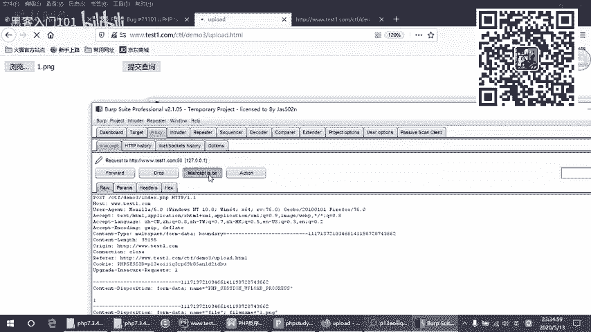

我们来到。我们来到这个这个页面啊，这里的话我们之前之前给大家建了一个demo。demo这里的话我们把这写到这个Cession里面了。现在的话呢我们不需要把它写到筛ession里面，我们把这个存拿出来。

要挨一个把它拿出来。好，这样就可以了。这里的话只还是要46块的。好。

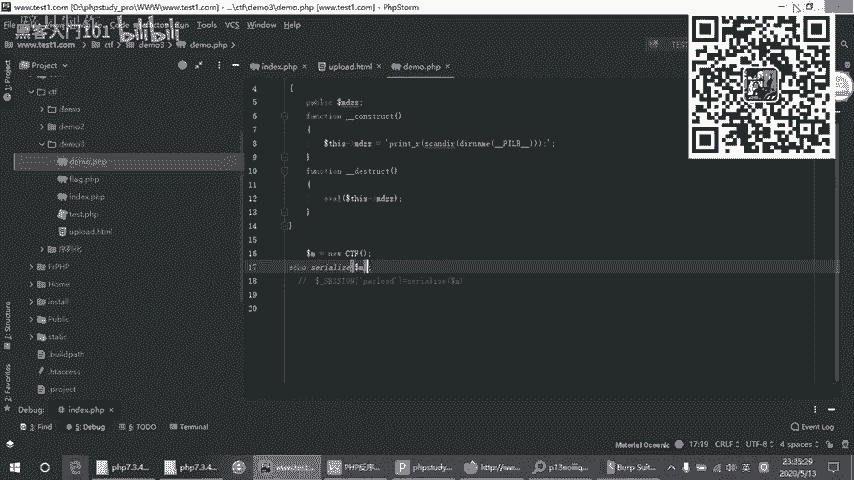

现在呢我们来访问它。啊，这边就有了。好，这里的话就是46号之后的。好，我们把它。复责过来安娜呢。

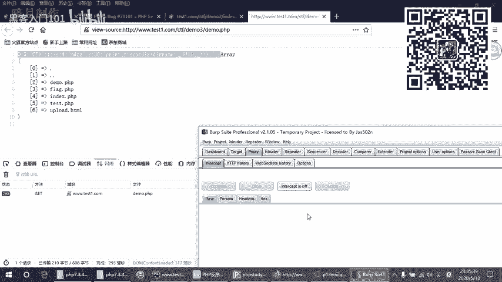

在这边啊。在这边粘贴过来粘贴啊。好，我们这个值。我们这个值啊默认的情况下，它就跟这个值一样的。所以的话它可以。可以在可以。该做什么？可以在这里加值，可以在这里加值。

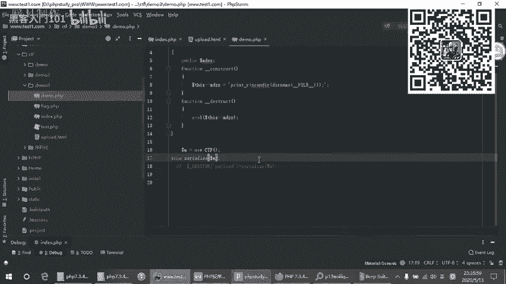

还在这加值。好，我们在这里啊，大家看到这里有点问题的。这里有没有什么问题啊？这里大家看到我们上传的话，它这里是什么呀？它这里是双引套，这边这边也是双引号，所以的话它获取不到的。这里我们上传看一下。

这里我们上头我们看一下这个文件啊，这个文件啊。

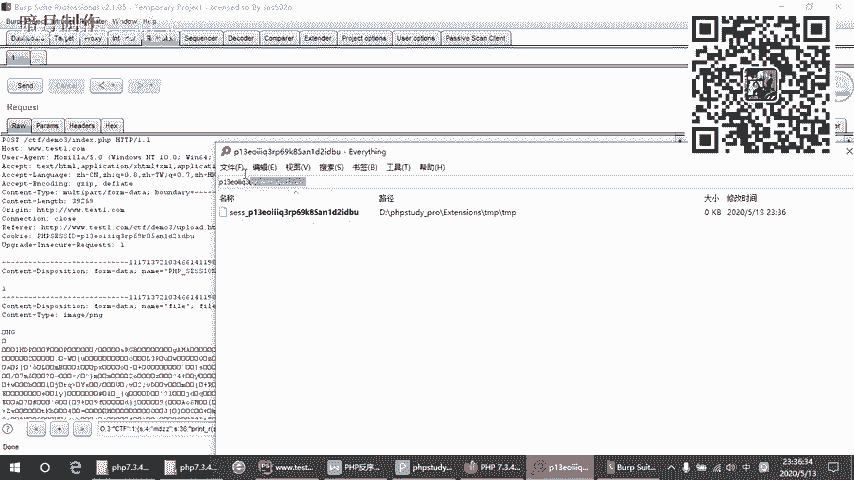

对吧这个文件的话它也写不进去的，为什么？因为它这里有双引号，我们需要把它进行这个转页。我建议把它转移。那所以的话。它的文件类型，它现在的话就是一个序列化了啊，序列化了，文再样让他试一下。

看一下这里有没有谁统工。好，大家看这里还是没有写进来，为什么对吧？因为它的类型。

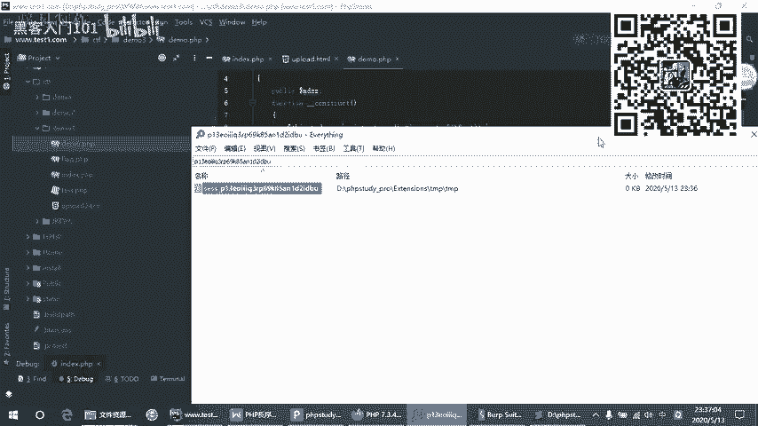

它类型有问题啊，对吧？那么我们在这里加一个数，加一个数的话就是表示什么类型表示表示我们的这个。HHP的这个类型呢，我们让它进行。好啦。现在我们来试一下，现在的话这动代码就可以执行了。我们也写进来了啊。

我们也写进来了。对吧。大家看一下。这里面的。啊。啊，在这里啊。对吧只要把前面的单位这个键池。单概就这样子，然后呢。

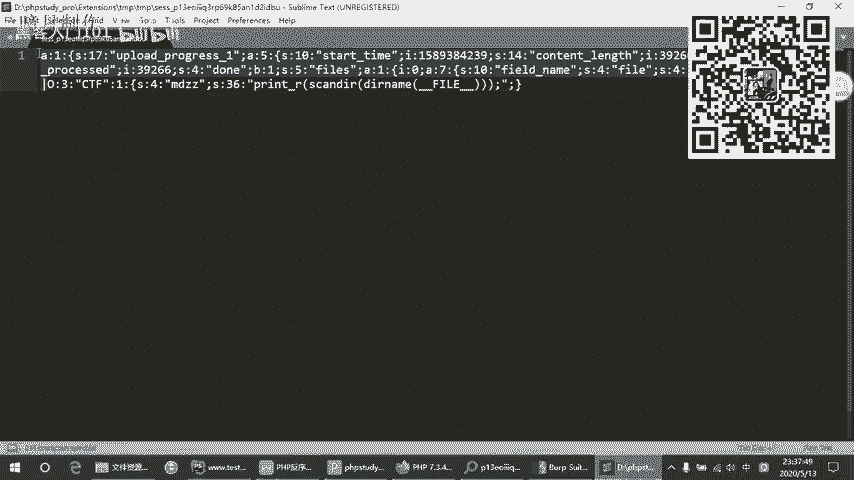

他在访问这个页面的时候，它会读到里面的内容，然后进行反序列化好，进行反序列化。这边的话我们可以再调试一下。

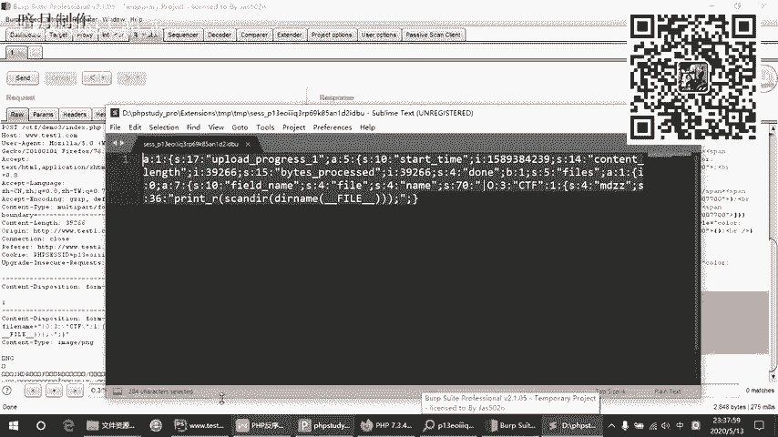

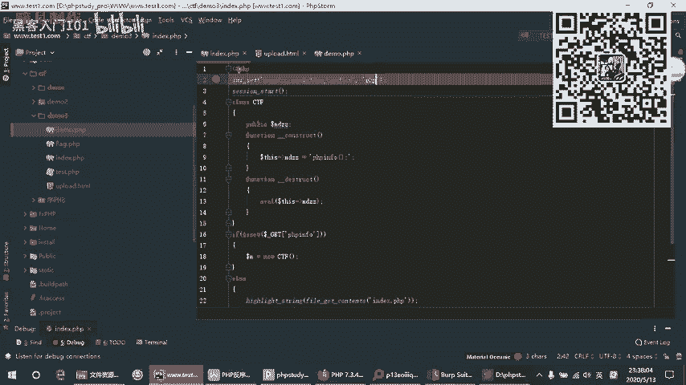

好，再调试一下啊。那么我们点击。

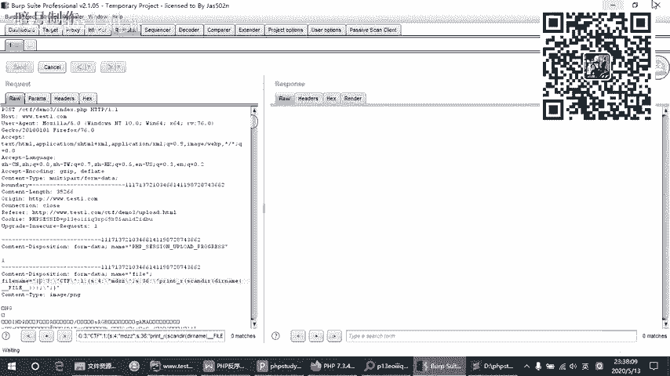

再抓到了，我们让他走。好，这里的话，这里有了啊，谁选值。好。这里有这里大家看啊。继走。好。再看这个局变成什么，变成fll，对吧？这f，然后这边让他执行了。

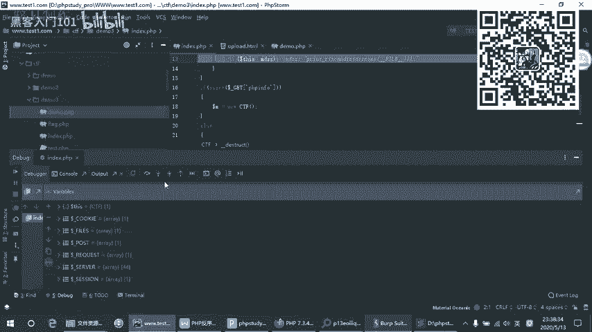

那所以的话它这里面啊。在这里的话就会。嗯。这里面差没走完啊，让他走完吧。好，走完了走完之后，这边的话也会显示。

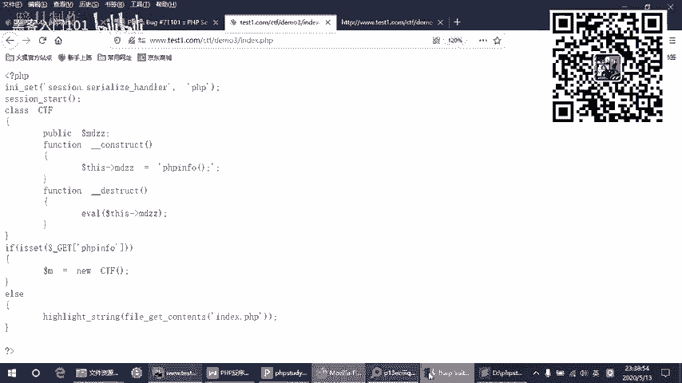

插当前目录线的内容，对吧？现在的话呢，我们要读取这个文件啊，我们读取这个文件怎么来读取啊，怎么来读取。那读取的话，同样的我们在这里啊做一个读取操作就可以了。即然有埋其他。这里给他读取操作啊。

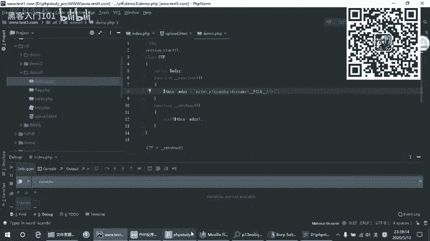

呃，这里面我是有的。呃。这里面读取的操作是用fll get。用什么呀？用fget读余道查这个路径的路径的话不能写错啊，一定要这样这种路径啊。

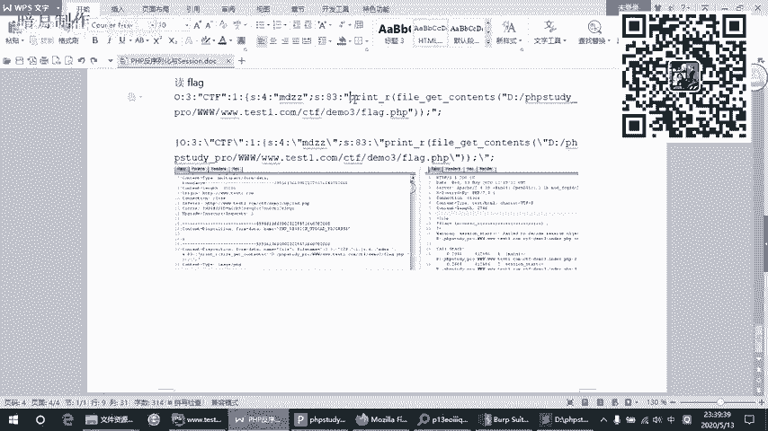

啊，把这个拿过来就可以了，然后把它改一下。他这里改一下啊他这里改一下。好。因为这个路径的话，从你哪里来从PHP过来的，HHP音过来的。然后这里的话读取的话，它是这个文件啊。那现在的话呢我们来。

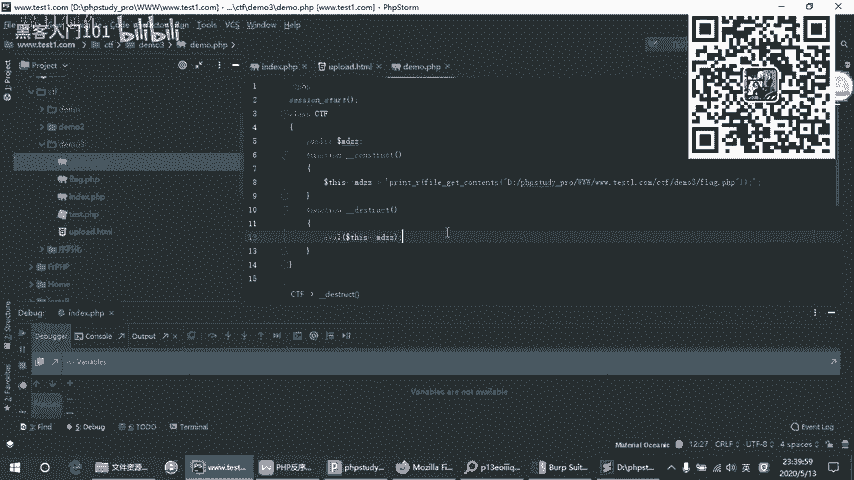

访问一下这个。就可以了，访问一下demo。这里的话获取到它的反序列化，还会到它的数序列化。好，大家看到这里的话是可以读刀的那这段大码是正策的啊。

那么我们再拿到这里来。这里来了，我们还需要。在这里啊对吧？这里的话一定要有数，这里面插的一些。它的一些引号我们都需要我们它的一些刷引号我们都需要进行转移。好，都要转移的。好了。

那现在的话我们再来读取一下。好，这里的话要抓到了啊，我们这样调试一下。好，这里16块之后。这里的话。他会读到这里面的内容，进行16块。好，对吧。

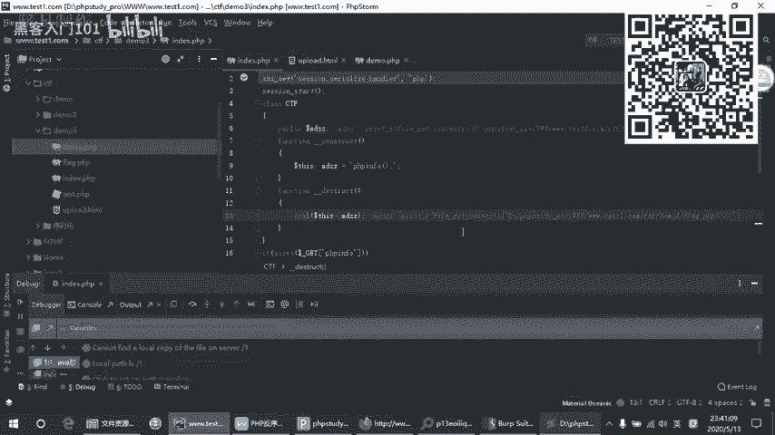

好了，有了，对吧？这里的话就会读出来了。好。

这个包给大家啊。后面的我们不需要了，我们需要这这里面的。这里的。这报给大家。好啦。那么。这个转序列块的话呢，就这个样子啊。大家去操作一下啊，操作一下，你们就能理解了。好了。那么我们先把这个关了啊。

先把这个关了。好咧。那么这边的话呢，我们把这一段。把它拿过来啊，我在这里进，我们在这边进行这个。测试啊，大家看啊。大开也会也会在显示在这里了。我也显示在这里了啊，嗯查看原代码就有了，它就会读取。

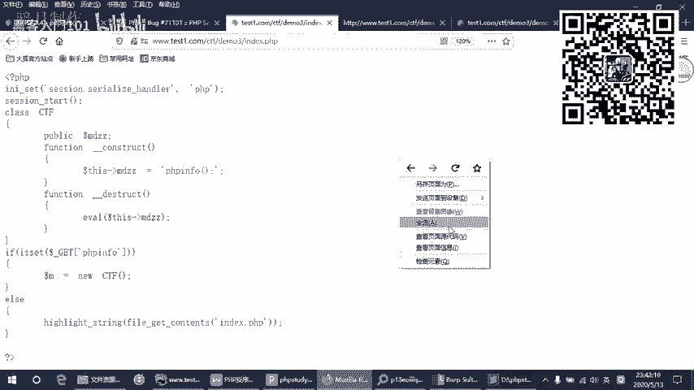

它就会读取这里的内容文弄呢在这个页面显示出来。

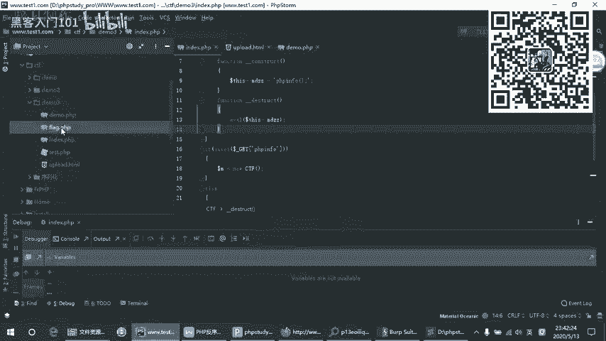

吓。嗯，那么这个序列化的话就是这个样子啊。那这种的话也是比较难的一点啊。但是期末的话，它是有的，而且比较多啊。那么最后还是打一个广告吧。大家想说这个V安全的话，可以联系我，联系我。然后这里面的。到。

现在的话是比较好的比较好的。在国内的话还是算得上市量比较高的啊，比较高的。那么接下来的话呢，我会更新一些CDF吧。因为现在打比赛的人也特别多啊，很多这个CDF的话。还可以吧。

因为它的科技它的技术含量特别高。啊，我有时间的话会给大家做一下。好了，那么。

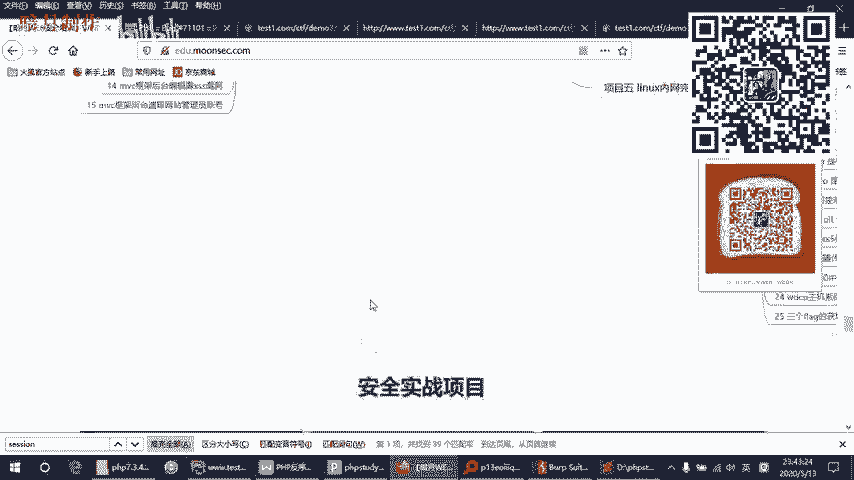

那么我们现在的话就这样吧，我们下下一节课再见吧，好吧，拜拜。

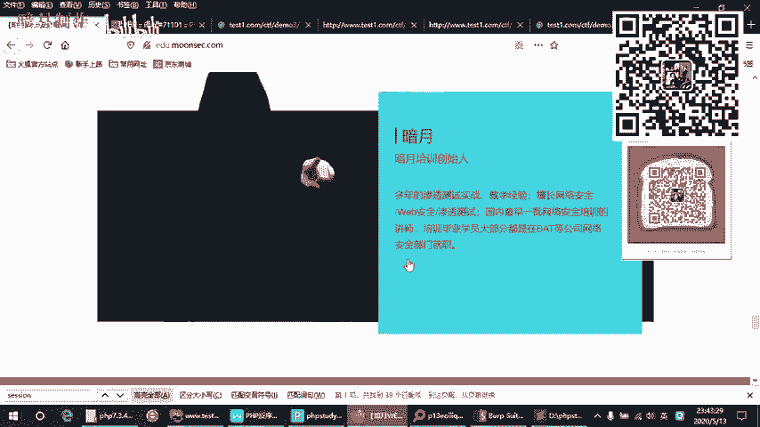

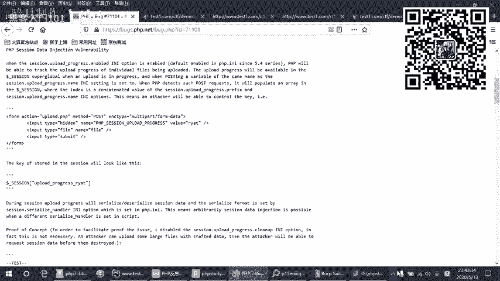