# CTF-Web历年考题精讲教程 从入门到精通 - P7：网鼎杯2020 朱雀组 反序列化解题 - 黑客入门101 - BV14YtkebEbY

Yeah。呃，大家好，我是安月啊，我们先打个广告吧。😊，们。一定有啊，对吧？大家比较熟悉这一步，我们先来访问一下这个网站啊。在晚上是做这个V博安全培训的。然后就是对这些呃技术有。有需求的话。

假如你想学习的话呢，你可以过来这边看一下啊，这每个点的话都会讲的比较详细啊。那么还有5个项目的实战啊，基本上覆盖了我们平时在工作里面的一些呃知识啊。好，完整的内网渗透实力。

还有linux的linwindowslinux的都有，还有还有一些做漏少的这些编写的报告啊。怎么去验证啊，怎么去挖掘，手动的去挖掘，还有代码审记的对吧？代门审记的两个，一个是MVC的。

一个是一些发卡系统的。啊，这两个都比较不错的，大家就是可以加入我们的这个来了解一下，或者谁习啊。好了，那么我们先打到这里啊。好，我们今天开始的内容啊。

今天它是一个晚顶杯的晚顶杯的这个注册组的这个反序列化解器啊。好了，那么这道这道题目的源代码的话就是这个地就是这样的，就是这样的。源代码是这个这样子。那么呢我们先来看一下啊，这边的话是什么样的。

这边有两个有两个发有两个参数传递过来，对吧？分别是这里的话是发生的，第二个是PP的话应该是参数啊，no这个是函数，假如这边的话。

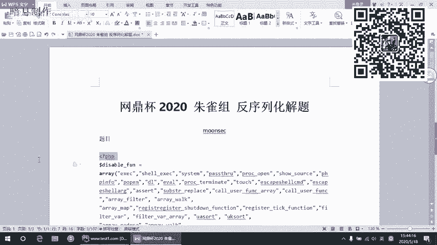

不啱睇等员工然后进行大桥写状况啊。那这里的话，假如你传就过来了值。你要看这里他有个。有个判断，这里有个判断啊，这个应该是黑名单判断。那判断这里面啊这个字符串是否在这个啊数组里面啊，对吧？

是否在这些数组里面。啊，这里的字符上啊，这个才是一个数组。那假如它在里面的话呢，就会去判断啊。判断通过啊判断通过它就会执行这个发审这个发审这个函数啊，这个函数的话呢，它定义在哪里，在上面。

这里要扣USER发生。这里的话可以调用一次函数。函数的话就是这边有函数，这边是参数。很后呢他的。他的。结果类型，假如它等于字符串的话，是让它输出我们的结果。那这里呢它还有一个它还有个什么？

它还有一个叫做类，类里面的话，我们看到这里面有个时间格式，还有这个data，data的话呢就是一个函数data函数啊，data函数。然后这里有个搜购函数。这里边这里面啊超位假如这个发损不等于空啊。

这个不等于空，就执行操作，就执行上面的这个操作啊。大家看啊这上面的操作好了。那么这里的话就它的整个流程。那么现在的话呢，我们来每个步骤给大家讲一讲。那首先传递过来两个参数啊，我们先把这两个参数啊。

门这里有个。这两个天使啊。现在这里。拍曲别。先把这两个拿过来啊，拿过来之后呢，我们。把这两个也拿过来。好，这两个也拿过来。那这边有哪些不需要的？就是。这里我们。这里我们的话暂时不需要，我们先把它删了。

删了之后把这段代码拿过来。它调动的话是调用这段代码，对吧？要这那嘛，所以的话我们把它拿过来。好了，这样就话就可以了。大家看一下。那我这里的还有。还有个判断啊，这里的话有个。静子函数正值函数。

我们先把这个数字拿过来。好，就这个样子啊。我们看一下，我们先要过这个黑名单怎么要啊，对吧？我们先来做这个。好，这边。哦，这边有开吗？看一下有没有开有。会有开的。那么我们先来访问一下这个网站。这个脚本吧。

DNOT，然后这边它是一个。哦，看一下他应该是个天使。好，是这样子的吧，是没有错的。这边团队过来的话，应该是个发生。对吧发生呢，假如这边呢这边的话有个函数，这个函数的话才会调用里面的函数。

它会调这边传递第一个值的，它是一个函数。第二个值的话它是参数。这边假如我们传递SYS过来。

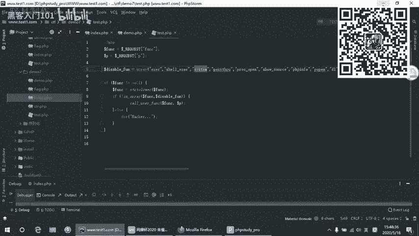

后面的块是批批的话要执行命令了，对吧？好，对吧？这个这个他是没有过的，没有过到这个没要过这个黑名单。大家看在这里判断成功啊，这里判断成功。所以呢这边的话呃结束掉就结束掉之后啊，才会写出我们的黑客。

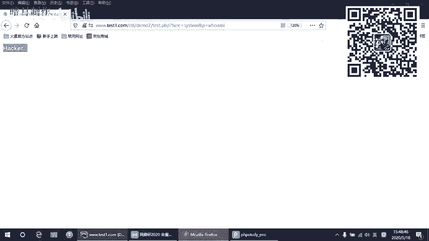

好，这里怎么要啊？这里要的第一个。

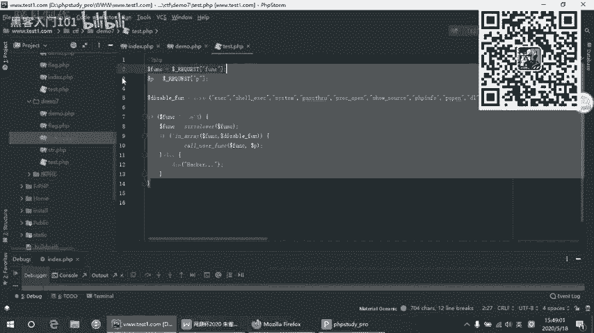

可以用我们的。就是在PHB。好像是新版本呢，还是多少版本的，你可以用这个斜杠来要过。这个要过的话就是命名空间使用的时候啊，因为。因为什么呢？因为。我没。不带标的车默认的话，他都。谁家噶。

只不过啊只不过我们。一般的话不用写了。对吧。好。对吧那我们先把这个版本切到切到。5以下的话，它没有命名空间的，这些是调用的。所以的话它。物流的话它是不会成功。我们先看这里有没有执行成功啊。好。

对吧这边的话是不会掉用了。B级V55。2这些的话，它是没有命名空间这个概念的。好，这里就可以了。对吧就可以执行一些命令啊，那么执行命令之后呢，你也可以来。访问1个HP。好。

对吧看原代码就是有这个flash。就会读到。这个页面下的这个flash啊。吓。那么也可以用什么呢？也可以。

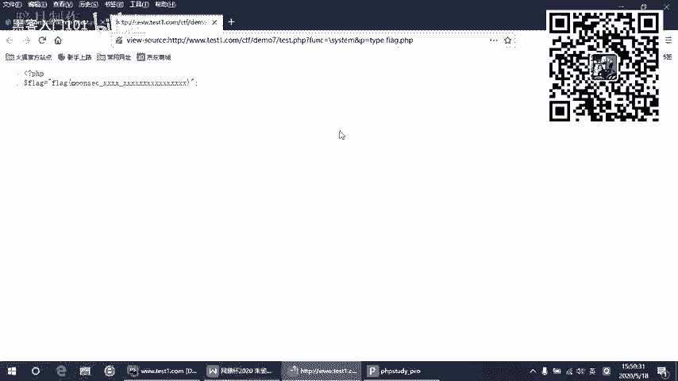

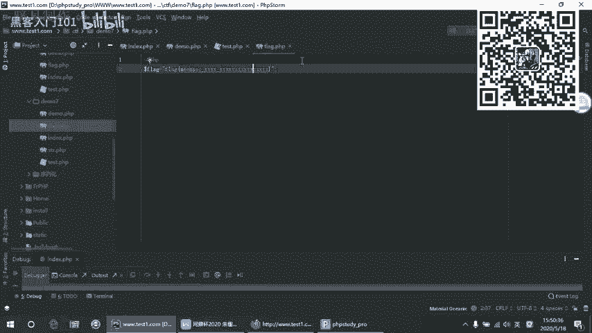

你先把这个拿过来啊。那我们先现在到这个inddiaest里面。看他有没有读取到这个flash文件。好。你看元旦吗？他也是可以读取到的啊。他也是可以读取到的对吧？

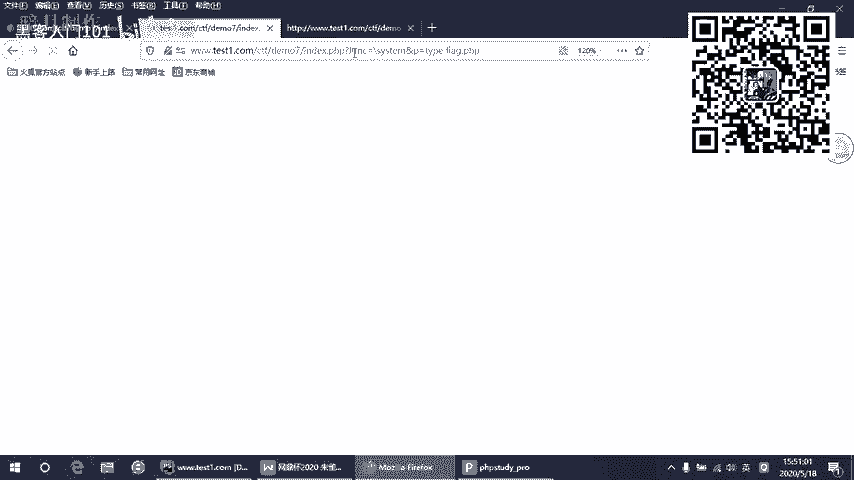

这个是第一种方法。我们先先在这边。设置一个。

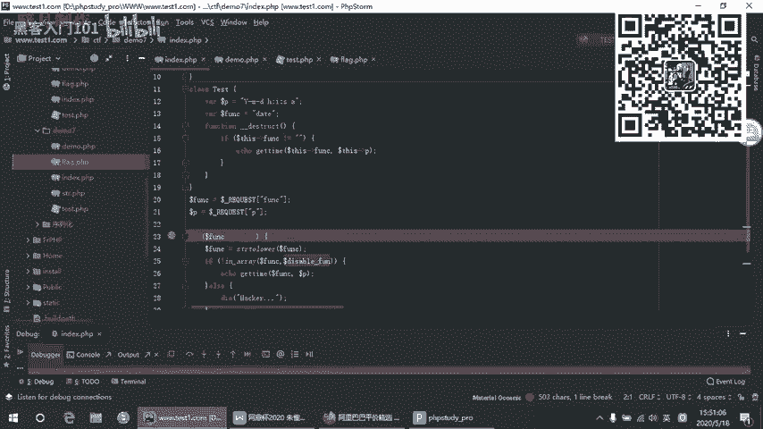

在这个。断点，我们让他去先看一下。

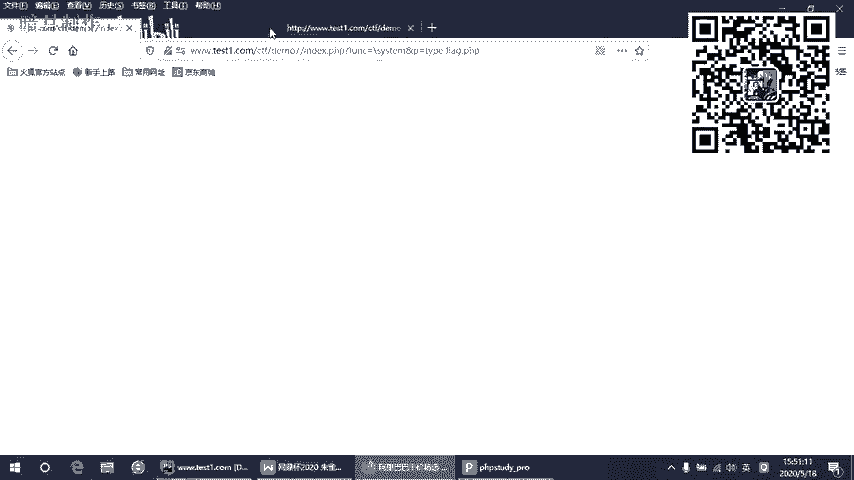

好。好，这里判断啊，这里的话就过了，对吧？好，这边的话第二函数第样的是SYS函数。好，这边就会读到读到什么，读到我们的f文件。好，这边的话速图。

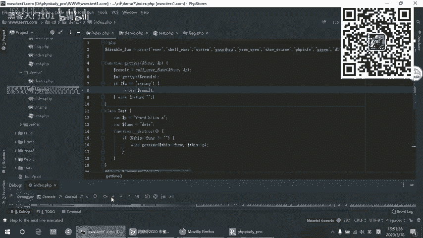

好了，没了。那么还有一种的话就是。这边的话你不止用这个HY，也可以用其他的函数啊。

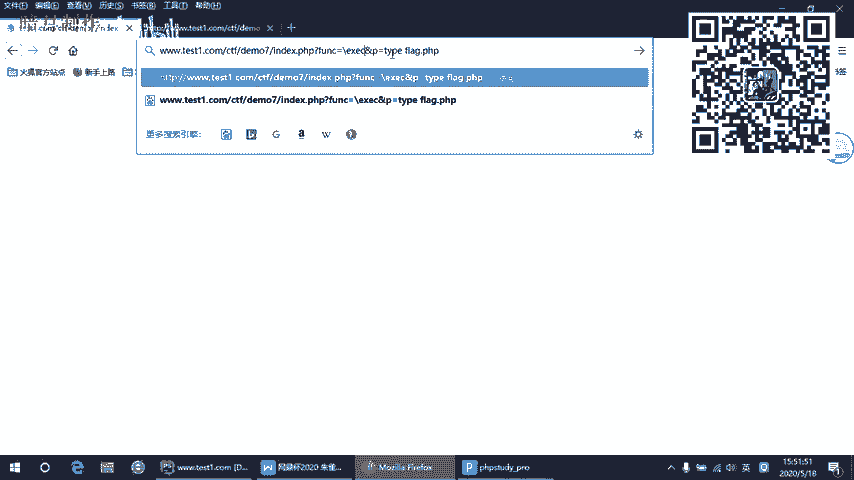

啊，这边也是可以读取得到的。吓。先把这个断点去掉啊。

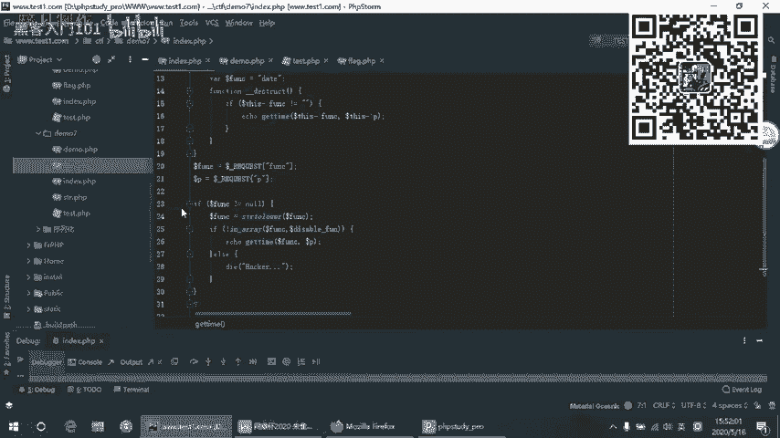

好，这是第一种方法。第二种方法的话就是我们看一下现这上面的。

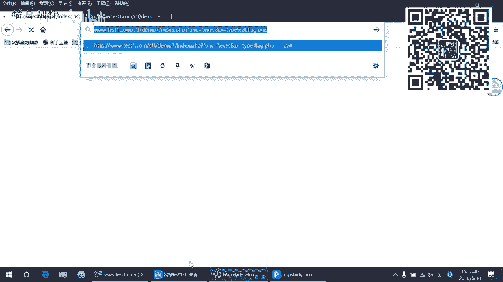

这里黑名单的话呢，他有一些他是没有写进去的。对吧。他这边有一些可以执行命令的，有一些是有一些是这个文件读读取的。这个是文件写入的。这些都是打开之后啊，可以读取的。那么还有。再看一下，还有这个函数。

这个函数还有一个别名。

还有一个别名啊。还有个别名叫做看一下，还有个别名叫做high fri。这个的话它是没过滤的。因为这边呢这边都是co，所以的话呢可以调用一些函数，对吧？这边的话也是可以用这个来夺取下，我们看一下。

我先在这里进行测试啊。这边的话就多久flash等PHP。对吧也是可以读取得到的。那么我们拿到这边来也是可以读取得到。查下原单吧。这里有两个问套。好吧。对，同样的也可以用这个斜杠啊。对吧也是可以的。

300块钱可以读取。7这里的块TYPE。winix的话这个ca啊。好，还有一种的话就是我们看到这边的话，它是用这个发绳的。

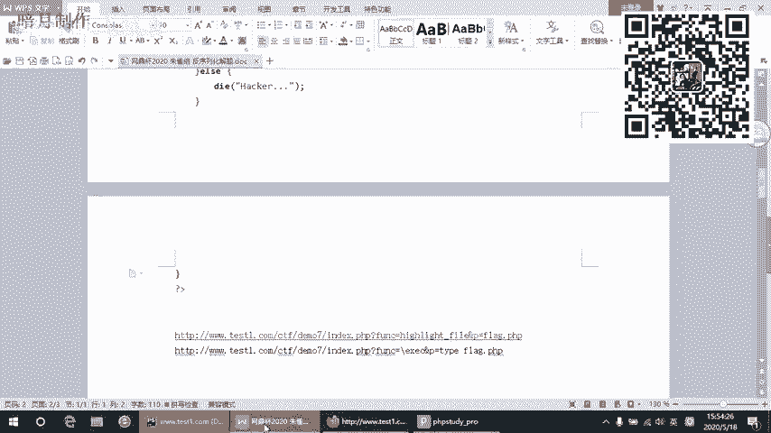

这边他是用这个发绳的。这个发生的，所以的话呢我们也可以用这个反序列块啊，大看到这里有个泪。有个累啊，这里面有它的这个时间格式，还有d一el函数，这边也会调用什么呢？也会调用这个。开发上对吧？

那么所以的话呢，我们先把这一段拿过来。海盗点码。那这边的话我们只要改一下就可以了。这边呢我们都这些都是不需要的啊。不过你也可以把它拿过来，一般都不用啊。好，这样就可以了，这样把它改一下。

第这个它是参数啊，参数的话是可以改成flash。对吧第二个的话它是什么呀？它是函数，函数的话，你可以在这里随便找一个就可以了。这边的话我们。找一个这个函数吧。椭元代码。Cup。好了，这边的话让它16块。

让它是6块啊，这边的话要给它一个变量。给他一个。好，给它新建1个16块1个函数啊，这边的话把这个11传过来，传过来的话，这边我们让它传到B里面。B里面呢我们。再让他来艾口一下，这个都不错就可以了。

这边的话我们下下个端点。

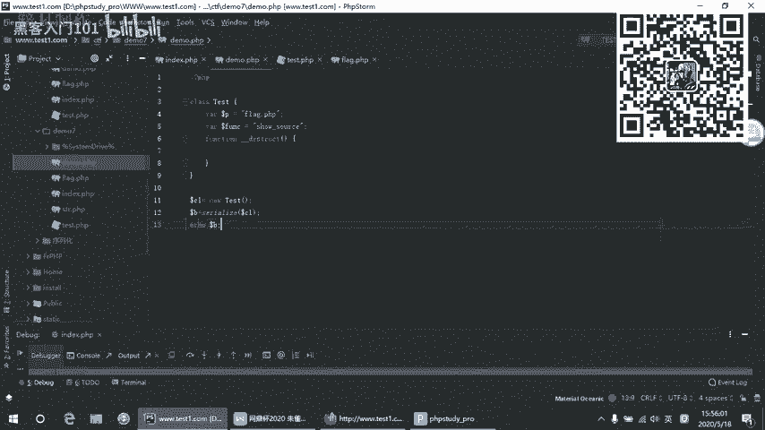

好，这里呢我们让它点点配置频。

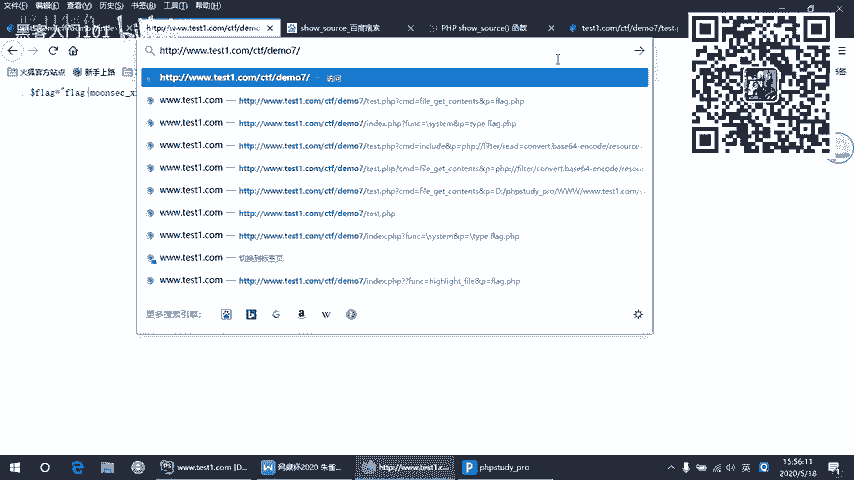

他这里因为没有。没有开机监听呢。好，我们让他走一走。好，这里就石榴化了好吧，对吧？啊，这里石榴化，这里碎列化。好。这里的话就是16块那个。把它复制过来就可以了。

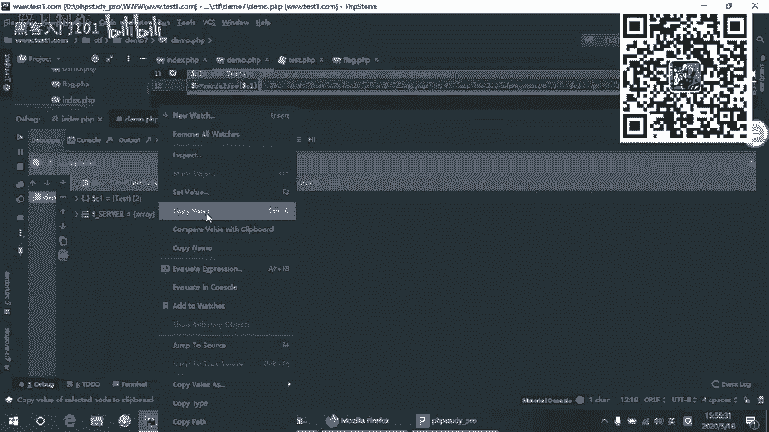

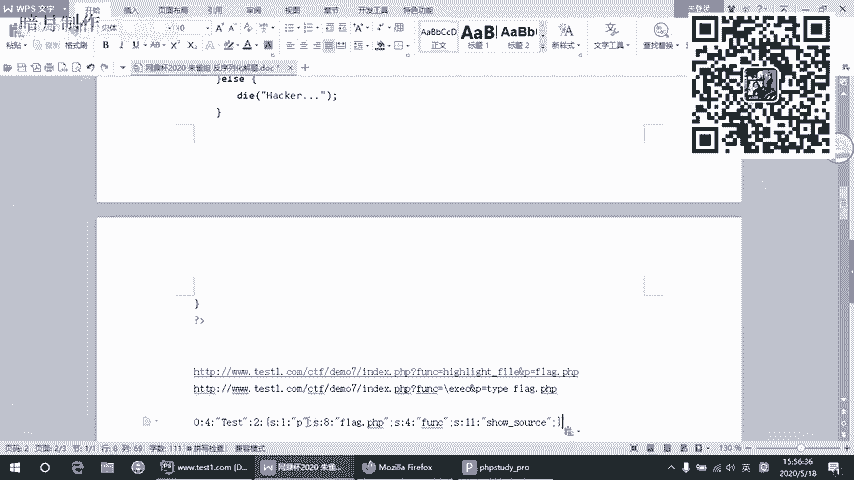

好啦，这里一下直接做。

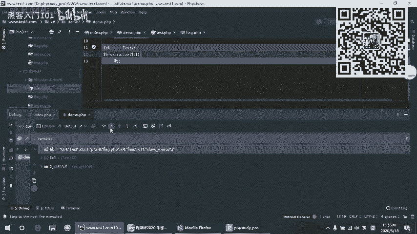

好了。页面上就会出现我们这段代码。好了。我们这边因为它可以传入函数的，这里也可以传入函数的。所以的话你这边搞一个反序列化就可以了。

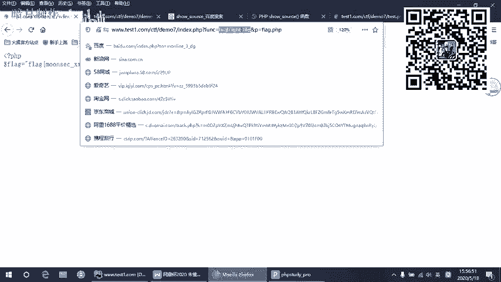

好，这里它是一个反系列块啊。

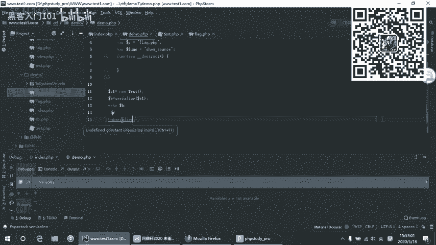

反式列化之后呢，你可以把作账代码拿过来。好了嗯。这里复制不了。

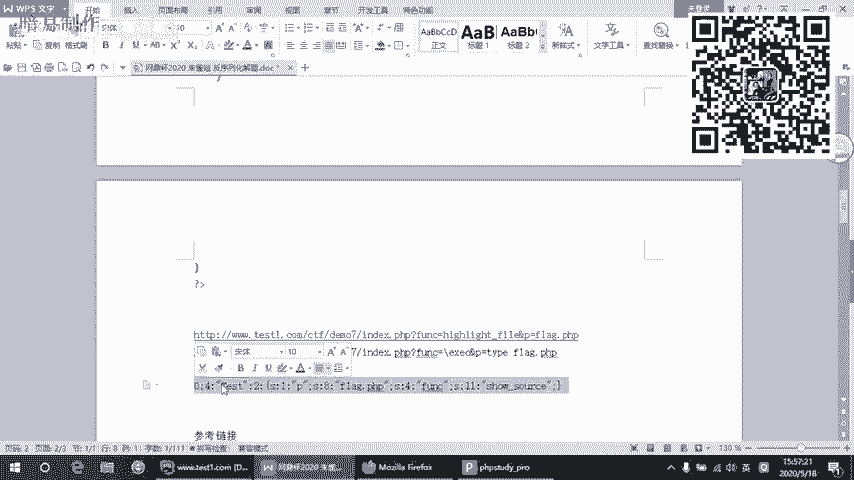

好，这样就可以了。这边呢我们先来断一下这个先在这里断一下。

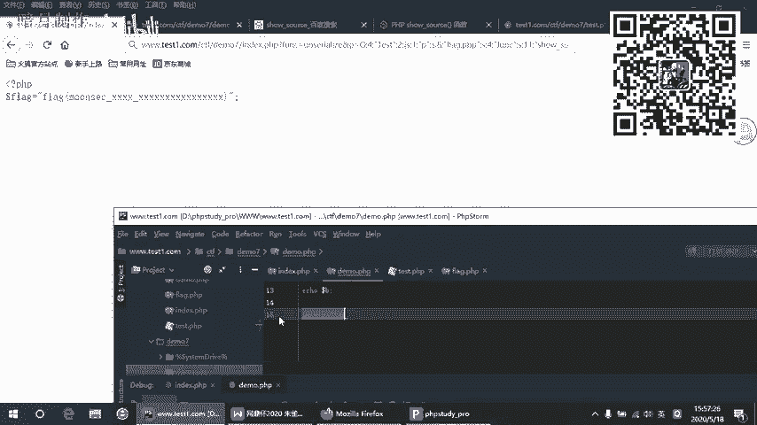

吓。断一下，我们让他走走。这里它是hifi的，我先把让他走完这个吧。

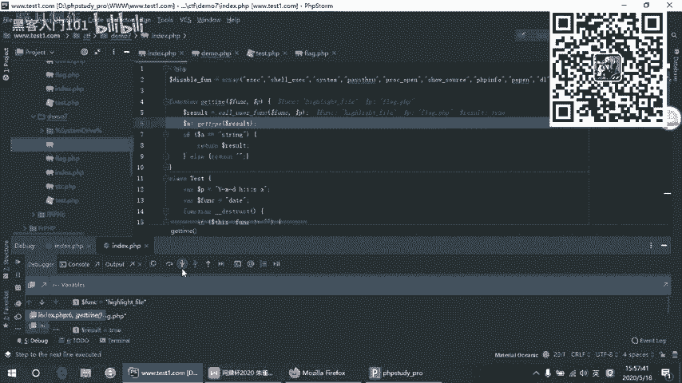

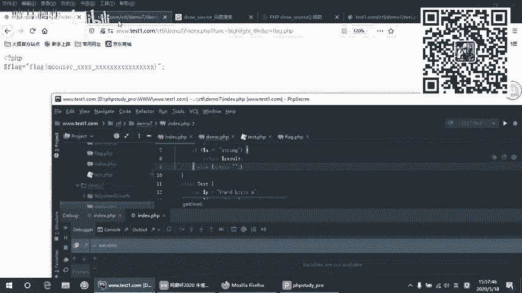

呃，这里。

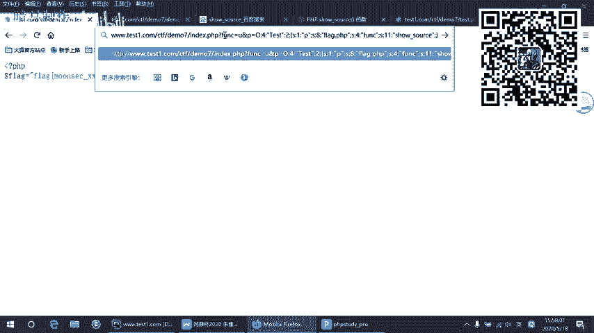

You and。

这里我们重新把它打开。好啦。

这边应该抓到了，抓到之时候我们看一下这里弹购过来的函数，它是这个反序列化的。好。大家看呢这里面啊，它不在它这个函数不在里面了，所以的话它可以可以符合这个条件。好，进来进来之后点上这个函数。好，对吧。

这边是传入过来了对吧？这里还传入了一个PP的快旧参索。So。好，大家看这里的话才。让他已经是啊。让他已经再读取了。好，大看这里已是说图。好，大家看才会来到我们这里，判断它是否为空，它不为空，对吧？好。

这里的话是什么？是我们的售原单吗？的一个函数。对吧他重新会来到这边来。

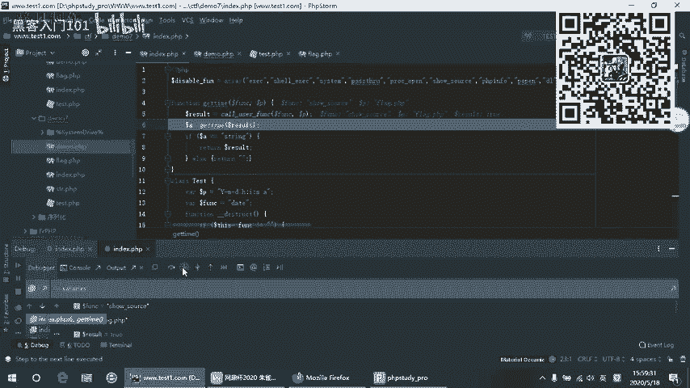

吓。这个微错。好啦。睇看。这里就可以读到这个文件了。

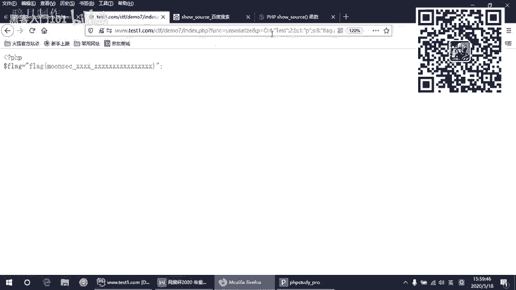

好。

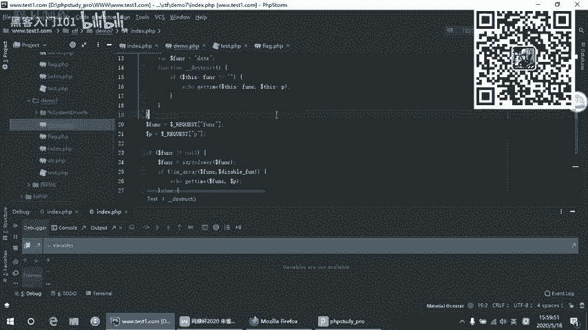

好了，那这边的话它解辑的话就是这个样子。

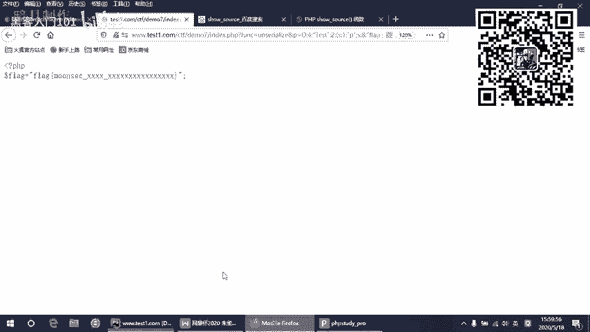

那么我们这节课先到这里，下节课的话再给大家更新其他序列化的。题目好的，拜拜。

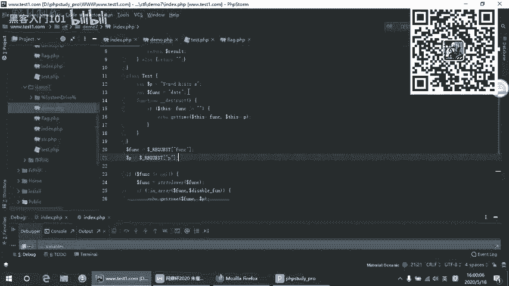