# CTF之Pwn的EXP魔改 - P1 - 花神灬再现 - BV1Ke411Y7ZP

🎼一片落叶，片刻的落地。🎼随风离开，消失了踪影。😊，🎼寂寞的夜冷冰冰，悲伤的我孤00。😊，🎼死心的吼角停。🎼不到你回忆。🎼风雨过后，看到天空中放晴。🎼我多想疼。🎼不平。🎼满天繁星亮晶晶，寂寞的我不。😊。

🎼对你的思。🎼仿佛事无止境，我始终忘不掉你的心和名。😊，🎼你是谁能陪我看风景？

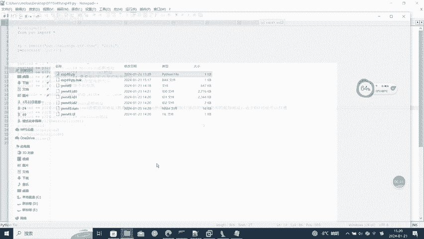

🎼爱你不是我不会的事情。😊，🎼为了结局被爱伤了心。😊。

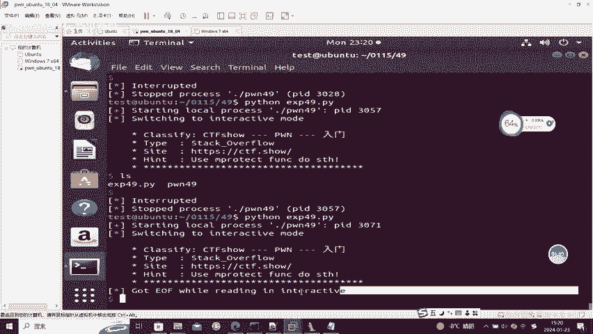

🎼你像一片落叶片刻的落地。😊，🎼随风离开，消失了踪影。😊，🎼寂寞的夜轮冰冰，悲伤的我孤00。😊，🎼死心的吼角。🎼不到你回忆。🎼风雨过后，看到天空中放弃，我多伤疼。🎼不平。🎼满天繁星亮晶晶，寂寞的我不。

😊，🎼对你的思念。🎼仿佛事无止境，我始终忘不掉你的心和名。于是谁能陪我看风景？😊，🎼寂寞的夜冷冰冰，悲伤的我不。😊，🎼死心的吼角听不到你回音。😊，🎼风雨过后，看到天空中放起我的伤痛无。🎼不平。

🎼满天繁星亮晶晶，寂寞抱我独。😊，🎼对你的尊严。🎼仿佛虚无止境。🎼我始终忘不掉你的心。😊，🎼于是谁能陪我看风景？😊，🎼。🎼Yeah。🎼过了做梦的年纪。😔。

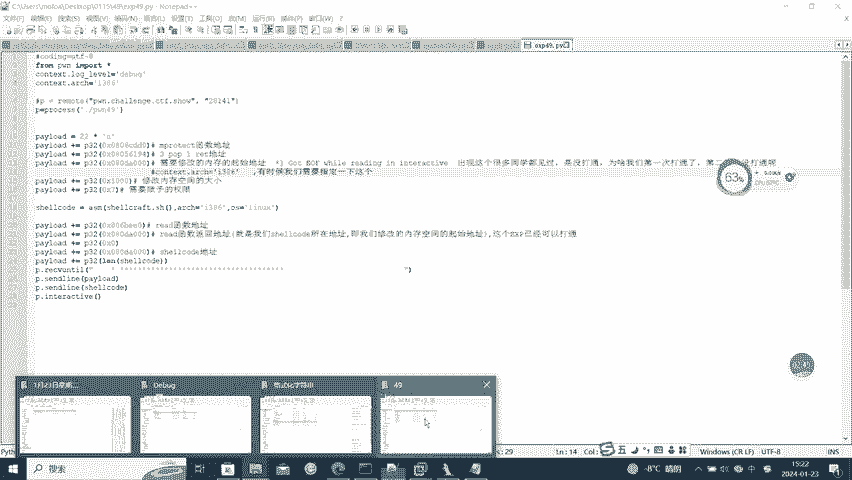

🎼回归生活的平静。😔。

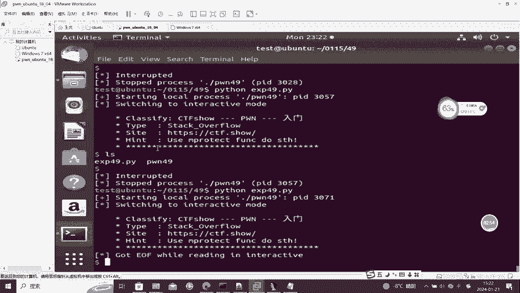

🎼人潮汹涌的城市。🎼孤独的人都在拼命。😔，🎼被这城市邀请。🎼为了车方，是拼命。🎼忙着工作，不敢生病，却忘了观赏一路的风景。🎼可能生活本该这样公平。🎼悲欢离合，惊年双心高兴。🎼繁华总是向我幻迎。

试图让我将道理看清。🎼我们生活本该这样公平。🎼携带努力。🎼各有数一。🎼生活好像满天繁星，故事数不清。🎼，🎼过了做梦的年纪。🎼回归生活的平静。🎼人潮汹涌的。🎼你是。🎼孤独的人都在平。🎼被着城水摇起。

🎼为了车方。🎼忙着工作不敢审僻，却忘了观赏一路的风景。🎼可。🎼生活本该这样公平。🎼悲欢离合，惊年双心高兴。🎼繁华都市将我唤迎，试图妖魔将道理看清。🎼可能生活本该这样不平。🎼携带努力的。🎼可以输赢。

🎼生活好像满天繁星，故事数不清。🎼可能生活本该这样公平。🎼悲欢离合，惊艳，伤心高兴，繁华都市将我还你。试徒。🎼我长道理看清。🎼可能生活本该这样。🎼且待努力的人，各有输赢。🎼生活好像满天繁星，故事数不清。

🎼爱的好可悲冷落自己体会。😊，🎼喝酒被你打碎，把回忆摧毁。😊，🎼话说了一对，我替你惭愧。😊，🎼那。🎼彼此关系就不会崩溃。🎼心变得干脆我落下。😊，🎼的机会。🎼忘了牵狂到后悔，我的爱和累好疲惫。😊。

🎼逆风在吹月，狠狠以喝着今晚的醉一回。😊，🎼如果现在有你陪生活一定会有滋味。😊，🎼爱的好可悲冷落自己体会。😊，🎼喝酒被你打碎，把回给摧毁。😊，🎼话说了一对，我替你藏愧。😊，🎼了彼此关系就不会崩溃。😊。

🎼心变得干脆，我留下来自己回。😊，🎼忘了情忘到后悔，我的爱和你好疲惫。😊，🎼听风在吹，也很可以 hold着今晚的醉一回。😊，🎼如果现在有你被生活一定会有滋味。😊，🎼的心变得干脆，我落下来自己会。😊。

🎼忘了情忘到后悔，我的爱好你好疲惫。😊，🎼逆风在吹也狠坷以喝着今晚的醉一回。😊，🎼如果现在有你被生活一定会有滋味。😊，🎼，🎼为了生活，甘心憔悴，难受的梦被包围。😔，🎼指着理想多么卑微，被时光打么。

想把我击退。😔，🎼谁是愿望的傀儡，像个稻草被击溃。😔。

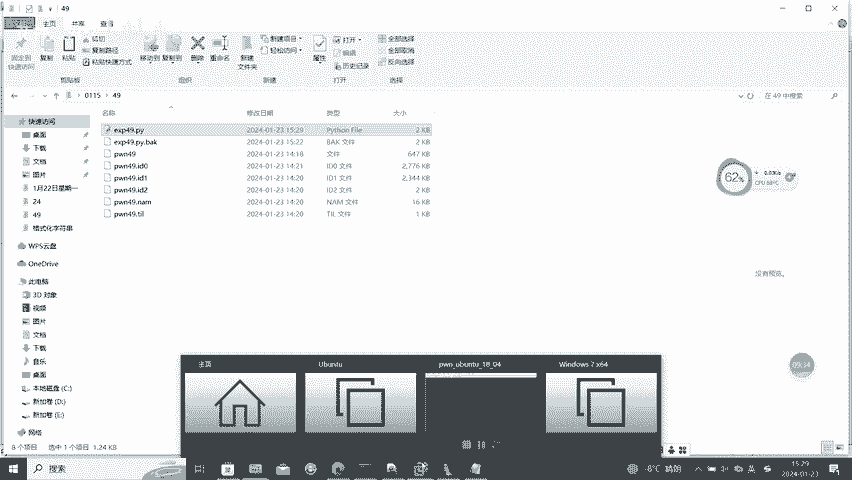

🎼已散发着光辉。😔，🎼在离树上披着我下跪。🎼我有梦想在背后跟随。🎼虽然忘记了会疲惫。🎼可惜你会筑起堡垒。😔，🎼失败的姿势，我可不会成功的感觉耐人寻味。😔，🎼星情之下难免成伪。🎼错的路被世人击毁。😔。

🎼和。

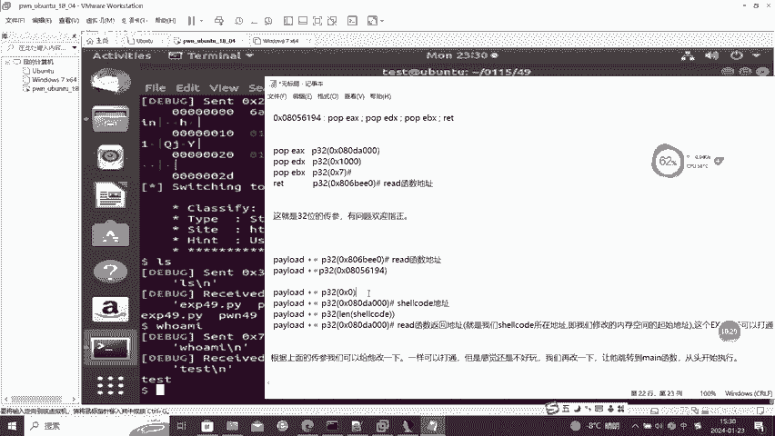

🎼为了生活，感心憔悴。🎼年少的。🎼世间理想多么卑微。🎼被时光打抹想。🎼过去。🎼你的傀儡。🎼像课带走北机。🎼努力散发着光辉。

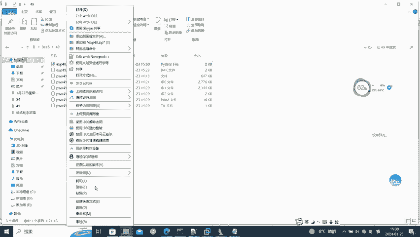

🎼你说生边这么下跪。

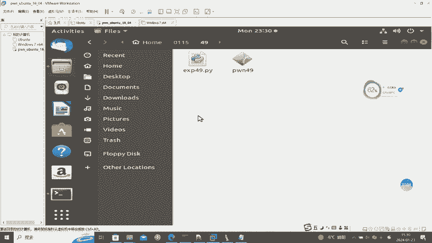

🎼梦想在背后给。🎼虽然忘记了会疲惫。🎼可惜你会筑起堡垒。🎼是坏的姿势，我可不会成功的感觉耐人寻。😊，🎼金钱之上难辨真伪。🎼错的路被世人击毁。😊，🎼一书生披着我下跪。🎼人生在背后。🎼虽然忘记了会疲惫。

🎼可心也会出起堡垒。🎼失败的姿是我。🎼伤痛的感觉耐人寻味。😊，🎼今天之下，难免成为。🎼错的路被世人记。

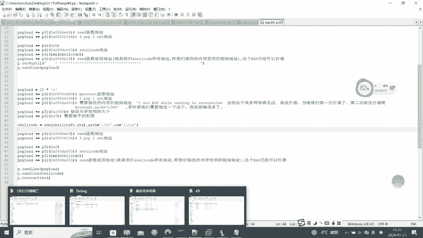

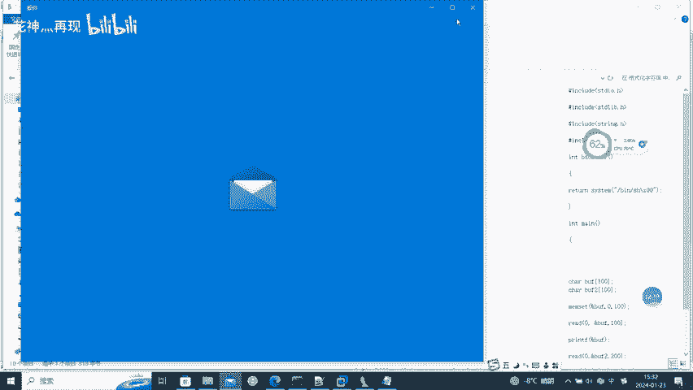

。

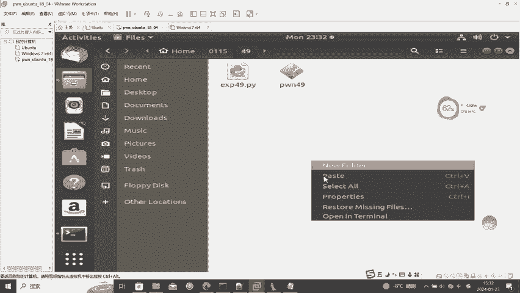

🎼仔细聆听着眼前这座古岛。🎼我带着爱意偷偷出逃，投入时光怀抱，梦里星空闪。🎼曾进海底寻找。🎼你在璀璨星光下幸福微笑。😊，🎼爱在心里无可救药。🎼落日坠入海角，余晖悠然静好。😊，🎼等待海风袭唱。

🎼把回忆的美好揉碎收藏载这孤岛，把季节烹调写进。😊，🎼个谣。🎼为你挥色梦幻气里的信号。😊，🎼再也割舍不掉。🎼听间春。🎼都停靠在爱的孤岛。😊，🎼用月色伏必。🎼一靠。🎼你在心上栖息，思念在环绕。😊，🎼和我。

🎼想边。

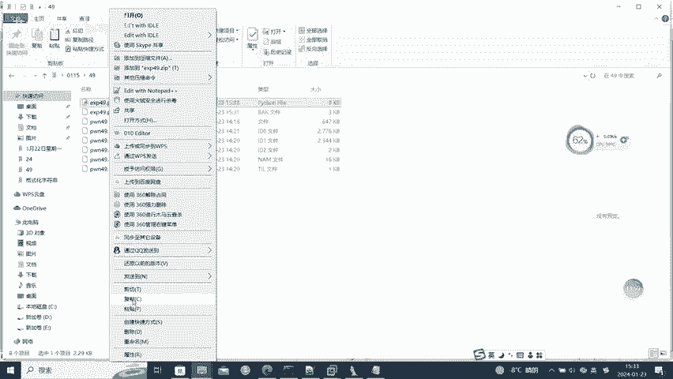

🎼你在璀璨星光下幸福微笑。😊。

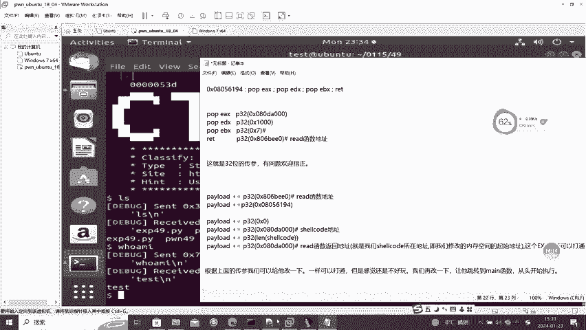

🎼爱在心里无可救药。🎼昨日坠落。🎼太久。🎼只会有人惊好。🎼等待海风细唱。🎼把回忆的美好流碎收藏在这孤岛。😊。

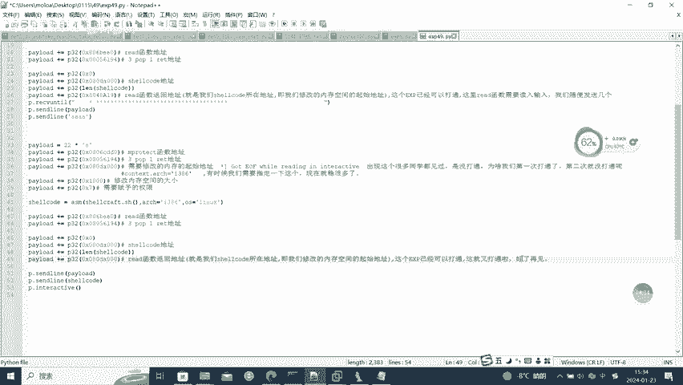