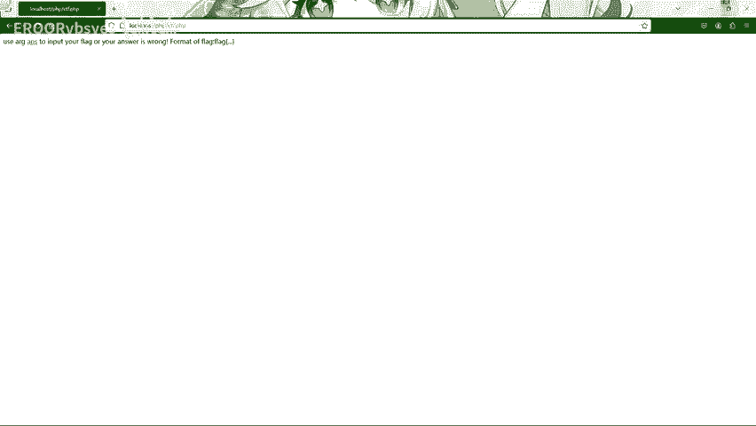
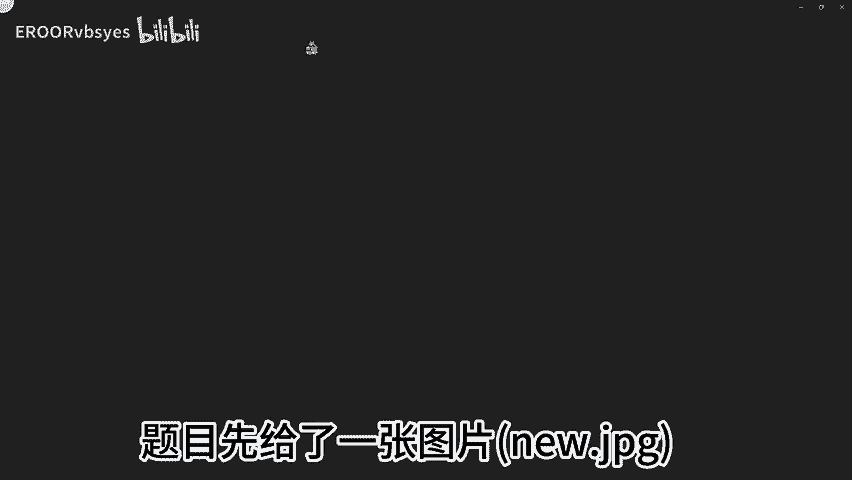
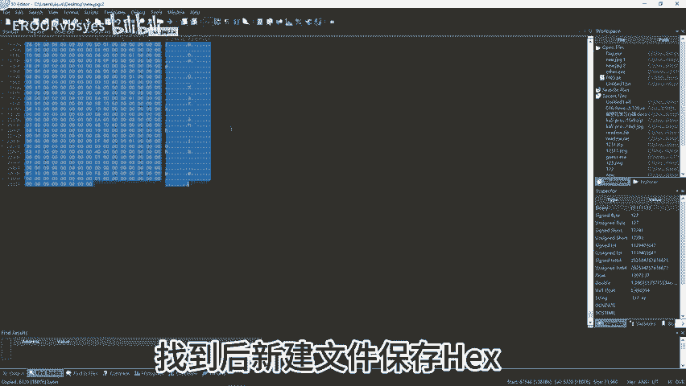
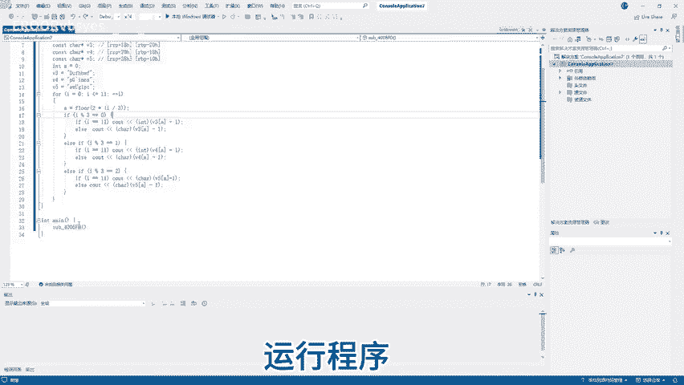
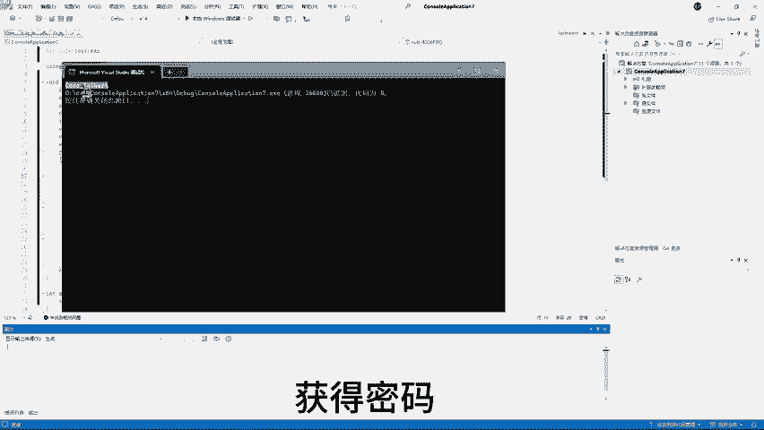
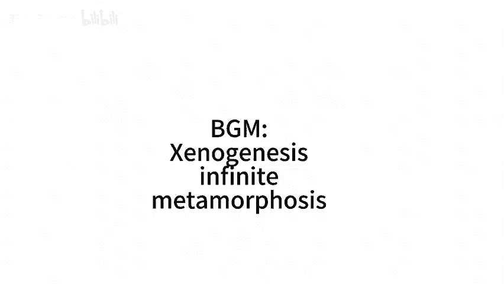

# CTF之reverse实战(包含杂项) - P1 - EROORvbsyes - BV1RP4De4EwZ

又来做题了。🎼温馨提示，up只是一个初二的初中生，技术方面可能有差错。忘海涵，这是一道杂项加reverse逆向的简单题目。题目先给了一张图片，anEW点JP。😊。

🎼，🎼先看一下文件属性。🎼Yeah。🎼使用户帮助中的XXD指令查看图片二进制。😊，🎼う。🎼通过简单的观察，可以看到文件类名和实地名出现了可选文本，发送屏项内容密到内户文件。😊。

🎼使用010editer更明程序。😊，🎼寻找可执行文件文件头，找到后新建文件保存后。😊。

🎼再次使用FXD指令查看文件二进制，这一步只是做确认，使用fill指令查看文件类型。😊，🎼走。🎼可以看到文件，就一个L可执行文件，可以在lininux平台运行。😊，🎼确认文件类型后。

使用ideap pro打开文件。🎼这里程序是64位的，不小心放成32位的了。🎼Noう。🎼使用64位挨da打开。🎼找到程序入口函数妹。🎼在这里可以看到程序的流程图。🎼Yeah。🎼现在运行程序看看程序逻辑。

😊，🎼，🎼这里需要输入密码，我们随便输一个，发现没有回血。😊，🎼再次查看埃ad。No。🎼按下F里显字美代码。😊，🎼そ。🎼可以看到是这个意思语地阻止了程序回浅。😊，い。🎼接下来我们来到牛皮湖浩号造点楼。

😊，🎼在这里原会编代码是JMGsstar400866。那么我们将JNG加is no hero改为JB。😊，🎼开着要原汇编代码。😊，🎼保存程序。🎼再次执行程序。🎼可以看到程序正常回旋。

🎼那么现在可以猜测flag可能就是pass word，现在就要去寻找pass word生成算法了。😊，🎼可以发现，这里对输入进行了判断。😊，🎼sub4006FD为主要判断函数。

且在testixix比较的汇编代码下方有JNZ说明程序会返回一个boll类型的数据。😊，🎼那么接下来就要解析算法了。😊，🎼这个就是密码生成函数了。😊，Yeah。🎼Oh。🎼那么现在练写程序。🎼再还原。🎼。

🎼我就是。🎼现在。🎼Yeah。🎼形成节。

🎼抱爸抱。🎼设置密码。

🎼验证成功。🎼你叫f。🎼我是李安。🎼如果你怎么。🎼等下。🎼冒着看。🎼真。

🎼No。