# CTF入门了解--第一讲MISC - P1 - 云影安全 - BV1Zu4y1h7c4

没有。喂，大家可以听到。🤧。没听到。可以听到吗？行了吗？那有点炸。现在呢？还，对的。啊，声音有点小。这会儿还小吧。我关小一点。OK了，那我开始讲了。我现在简单介绍一下CTF。

它就是一种网络安全的比赛形式，然后它就capture flag，就主要就是夺奇站。它的全名就是capture the flag，一般就叫夺奇站。就是双方有各种模式，就主要就是解题模式。

然后公房模式混合模式。然后一般咱们现阶段就主要就以解题模式为主。我给你们看一下那个。西电的那个。你们可以看见这个屏幕的吧。啊，现在还是有电流声吗？不连到耳机。跳走跳走跳走。你认为还是有吗？记。

有屏幕有屏幕，还有等等我换个耳机去。这个呢这个玩机可以吗？还有声音还有电流声吗？现在还有电流车。还有。你俩这一个小一点，一个更大。那我还是换原来那个吧。我的我的声音可以听到吗？

可以听到我说话就比较清晰吧，能能听见我说啥吧。了解这个。

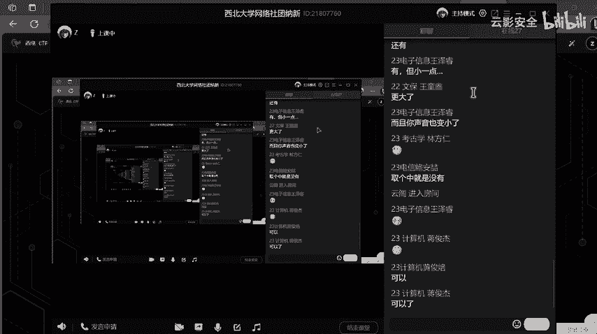

O O。然我给你们看一下啊。

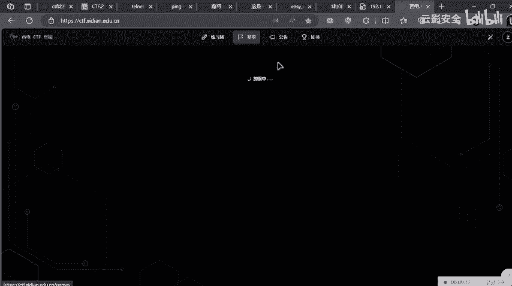

就他比赛也是以这种形式。你看他现在就是你的正式比赛里面也是有这些方向的题目。然后你就可以选不同方向的题目，然后写写了之后会在这里有个分数，你分数会出来之后，你就按照你的排名。

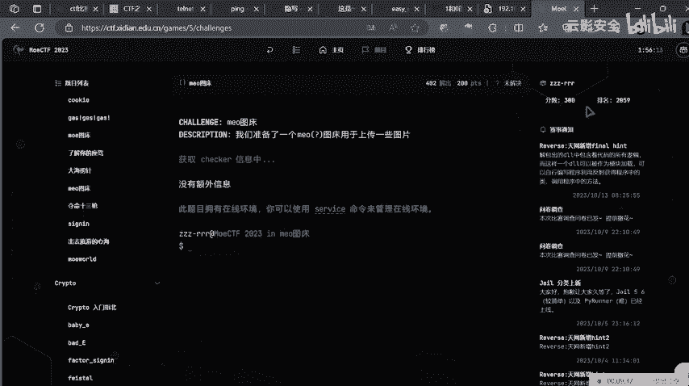

这是西店做的这个。这两天就是电子新生赛，这因为题很多也很难。上学基础的还好。

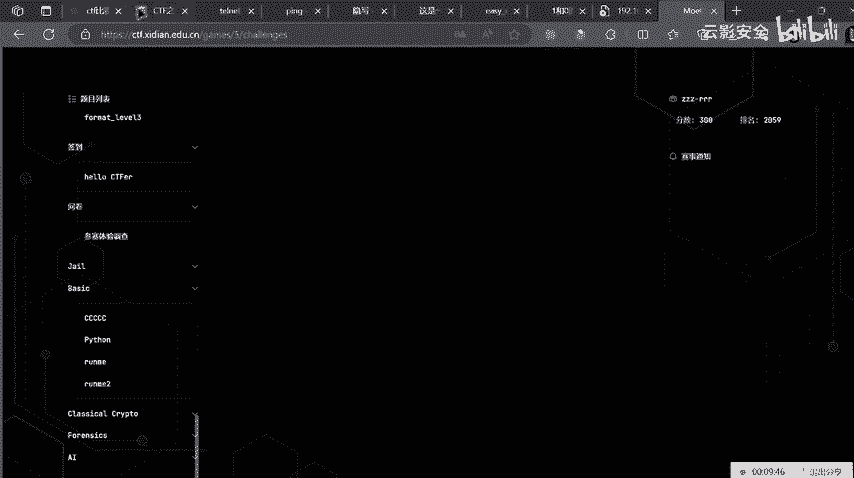

然后这就是CTF1个简介，然后解题模式就是刚刚那样。然后还有一个一种是攻防模式，它会给你容器。然后你就就是跟解题一样，你也去把人家的那个flag拿到之后，你就可以攻击人家的服务器。

然后你攻进去之后哦是也可以防守成功，然后拿到更高的分，就算解一道题叫AWD模式。然后给你搜一下那个。我直接点这个吧，然后它这是bug库，就是现在比较。大概现在就基础的题目都在这上面了。

然后这里面就是练习呃练习CTF里面的一些题。全都是这些各种方样的题，你可以自己选，选完之后，你可以自己往出来解。然后后面就是我给你们介绍一些工具，然后拿这些题来给你们解一下那些工具就可以了。

现在主要用的就是这几个。我放到这儿了。然后这些都是待会解题会用到的，然后主要就是威克，然后里面可以可以用到那些虚拟机，就是VM word的虚拟机里面无班图和凯里也会用到。然后这个东西就比较重要一点了。

00艾it这个东西就咋说呢？算一个万能文本编辑器吧。这东西比较常用一些，我给你们拿那个题。可以。我给你拿机解一下吧。就我现在我主要是我今天讲的主要就是miss方向的。就是杂象。咋说呢？

杂项就是在里面比较简单的，没有确定的方向，它就是会主要是以就是图片呀，各种其他乱七八糟的形式。然后你把拿出来之后就可以得分了。然后先看这个吧，这是里面就比较基础的一道那个mik的题。就一和林的故事。

他那个附件我已经下载好了。

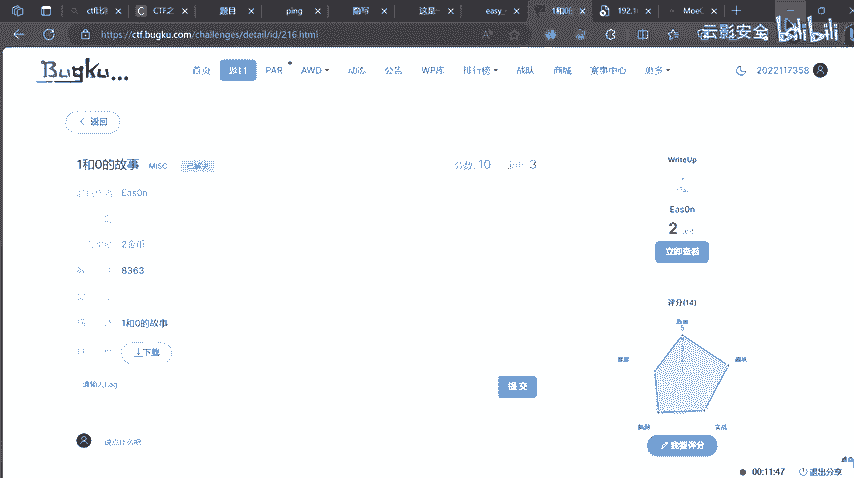

他是个TXT文件。啊，还有一个。打开就这样。然后像一般这种东西。就其实写miss题主要就靠猜。因为他01，你看这么多01，他第一要么就是二进制。但是它二进制吧，它这个行数跟列数就很多，你没办法写。

这种东西其实你后面做做多了之后，然后你再看他这几个角。你看他这些数据。这边全是零，左上角是零。右上角也是呀。左下角也是例。但是它右下角就不一样了，这个东西我感觉很像你有没有发现它很像一个东西？

就这个东西。没没眼，它左上右上和左下都一样，它跟它跟一个东西有点类似。有没有想到什么跟他类似的和类似的一个东西？算的，你说好。😊，可的也算也算一个。这是谁？对，二维码。就你一眼就能看出来。

其实它这个我这个文本有点小，你把它写出来之后，就这种东西就靠想。你刚刚如果想到扫雷的话，你就要去按照扫雷的思路做。你如果扫雷的话，它01的话，有可能是二进制。你进去的话，你要把它转码或者编码。

但是你如果把它想成二维码的话。就很好很很好做多了。但是就所以现在你就需要把它想办法转换成二维码。二维码的话，现在比较常用的方法。像这种。01的文本文件，你随便的写一个pyython脚本就可以把它转换。

但是比赛的时候一般没有那么多时间。

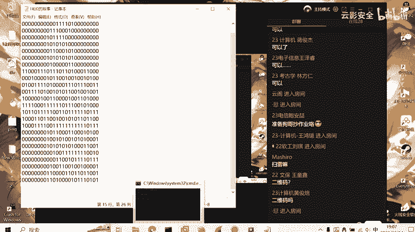

记得是有一个工具。

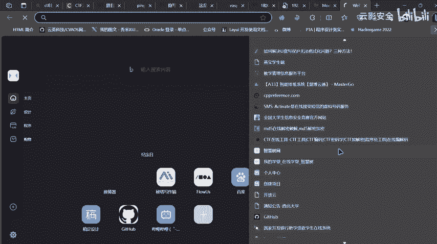

试下能不能打开，能打开给你们看一眼。就一般常用的二维码的一个工具就QR search。大写的Q大写的R，然后后面是那个。对是。哦，这还不是那个工具，没事，到时候些工具我会给你们发到群里面。

你们做题的时候就自己可以就拿来用了。这个网站有点不稳定，它有点慢，等他一下。这么费劲。

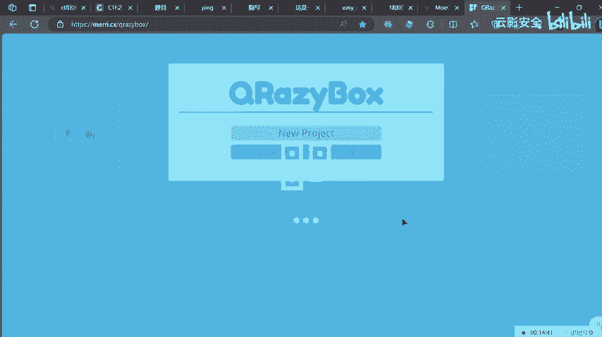

看这就这个。二维码他就稍微储错二维码出来。然后咱们刚那是个TXT文件，这是image文件。然后这个就是自己写自己手搓的那个啥二维码。你直接把刚那个文件引出来就好了。

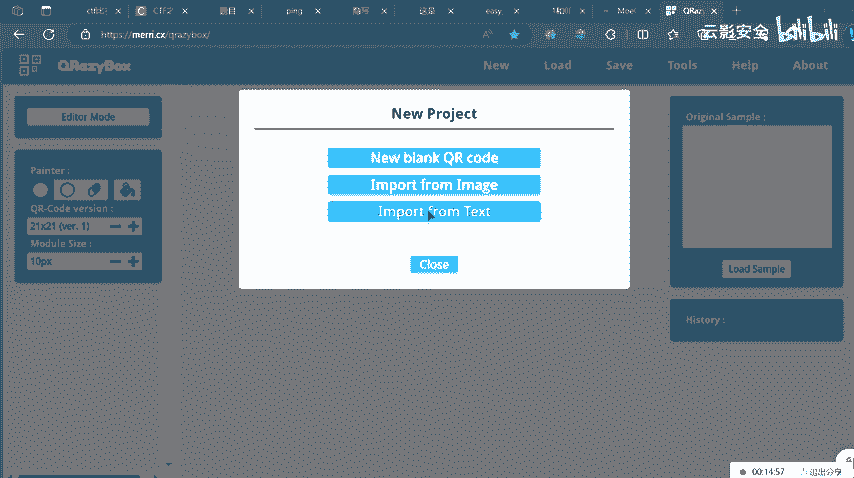

你看这就是二维码，你现在可以扫，你拿手机扫。用完了你手机上它肯定会出来一个fag。🤧。

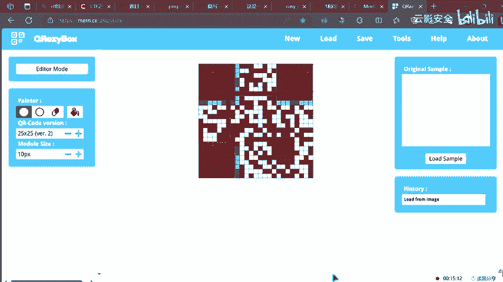

Macbook。可以应该是可以的，macbook应该是可以的。但是比赛的时候可能说拿个macbook去打比赛的。你不现实。不好打m黑book克打这比赛不好打，他这个最后flag，这这二维码一扫就出来了。

正常做法的话，你就写python脚本，你就要需要写一个转换转换二进制的图片。你要是你需要干那啥，你把刚刚这个文本文件。你把这个文本文件把01转化成对应的黑白点0对应。白点。E对应黑点。

然后你拿python把它转化成之后，它是没有定位符的。第三个叫定位符。你把它转化出来之后。这里面都不会都是白色的，你看不出来定位幅，你定位幅就是要自己画的。所以就与其说你写个脚本那么费劲。

还不如自己拿一个工具这样一剪，这就是比较基础的这种。那个啥。呃，mi提了比较常见，也是。然后后面我给你们看一下啊，还有哪道题。呃，我想一想。

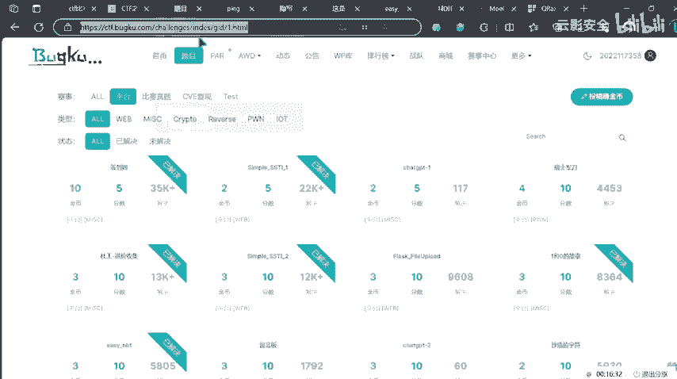

支持识别吗？他可以少，我记得我。记得我上一次扫完，它就出来flag。

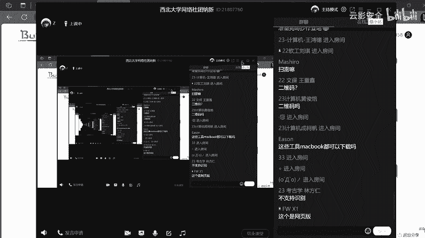

没事，他这提大概意思就这样。给你找一下有一个。哎，我是不是找错题了？嗯，对，这个这个题这个题比较有意思。靠着看。他这个啥都没有给，然后就给你了一个附件。这个附件下载时候是个压缩包。as说是这个。

但是个压缩包的名字。对，这个压缩包的名字就是这个。EZ杠NBT。一字钢笔体这个名字你要记住它有用。然后他解压出来之后是这个东西，这东西里面一堆文件，你肯定首先看到就是图片。

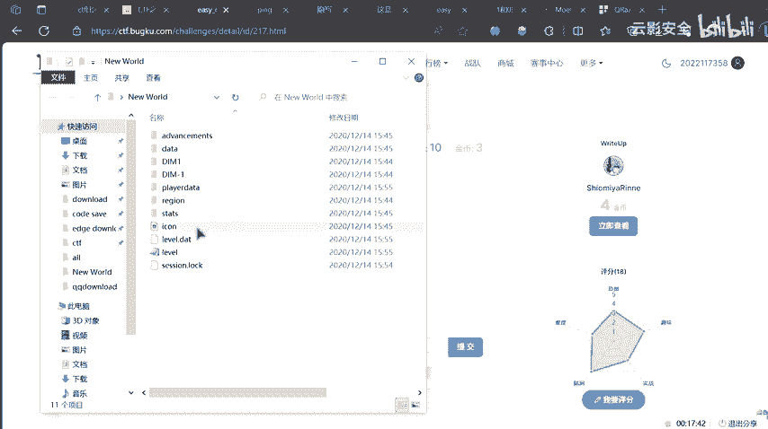

你把这图片打开。🤧。

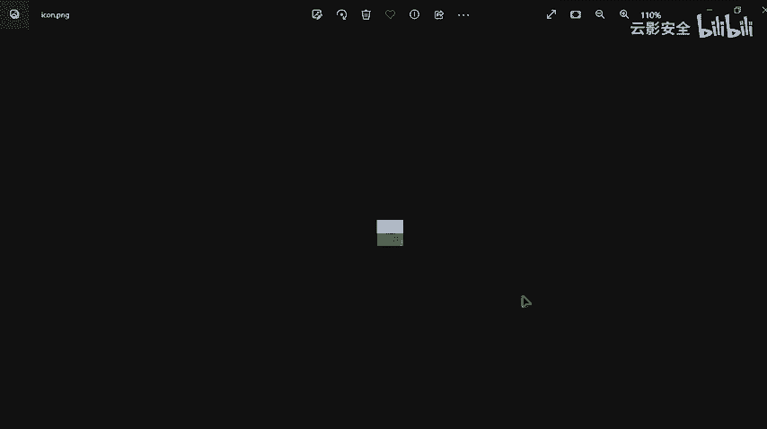

我的世界。这就是一个我的世界的图片，所以就猜一下，大概猜一下，就大概这个题示。

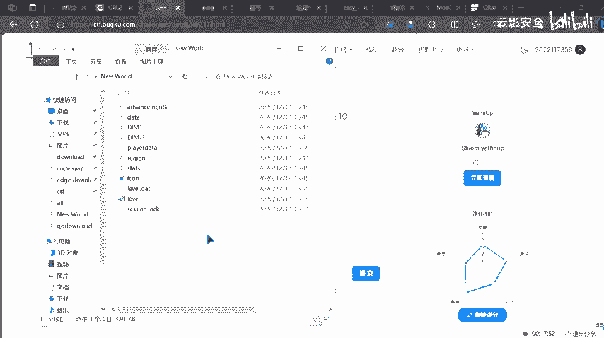

还能听见吗？

这个提。跟事业有关，但是你又不知道他到底哪有关。然后你这时看他检压出来，我这个压缩包，我。找不到了，我试试能找到。坏了我删了。就是他那个压缩包的名字就叫EZ杠BT，就是他一般都把那个文件的那种后缀。

它会是一种文本格式。所以这时候你就要想他这个他只给了你个我的世界，你这时候直去可以搜一下他这个后缀文件名字后缀，你搜一下这个NBT。

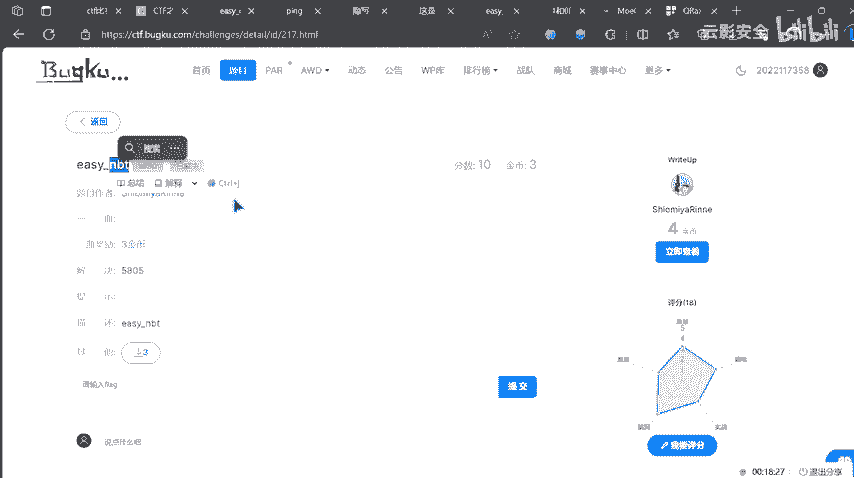

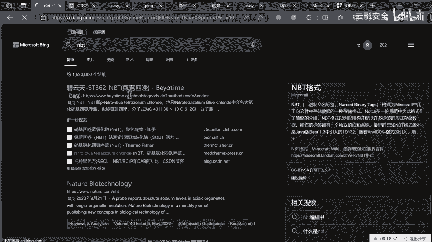

嗯。啊，不是这个。你搜呃哦，你就看你搜密体格式，它会出来这个。刚好是我的事，他跟刚刚那个图片又一样，你就找。🤧去网页找这种东西。然后他现在就会给你介绍一下这个谜题。这个这个东西其实之前要你要玩。

如果说玩过那种我的世界的话，你就对他肯定很熟悉的。因为它这里面会附带好多那种工具，前面都是一些介绍之类的。哦，咱们重点找的是什么？就是你现在他只给你一个文件，这个文件里面咱们可以自己详细看一下。

这些全是这些文件。打开咱们也看不懂，肯定全是乱码。这文件还是空的，都点DAT文件。

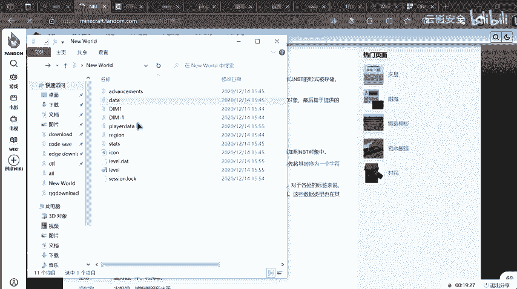

所以咱们要找一个东西就。能解析这种NBT格式的一个工具，咱们想办法肯定是想办法找工具来这些题。哦，你到他官网就。看他这些东西前面都是介绍，全都是介绍，你就可以大概看一下。但是你到这儿你看这个应用。

这些应用者就开始，你就要着重看一下。这是官方软件发布的这些软件java版。嗯，你看。在这儿。这种东西就是你一般找一个文本格式，他肯定会在官网的文档里面告诉你。能解析一些文件。那那咱们就编辑查看。

这好卖这也车。好慢呀。

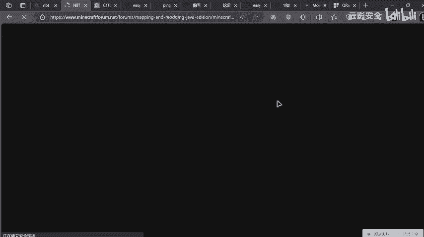

我今天上午去咱们学校的那个把机，咱们学校也有一个，就是跟洗脸一样，就咱们社团自己用的把机，但是。

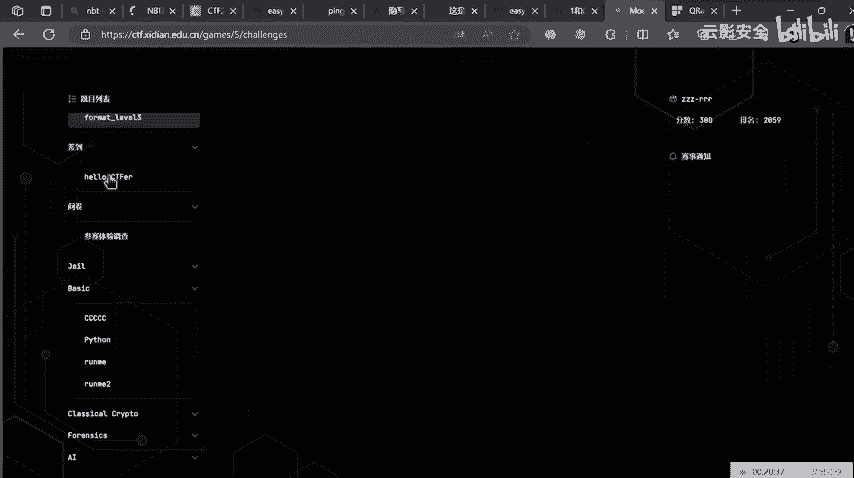

🤧我这会儿登不上去了，到时候就给你们培训完之后，等你们期中考完试。我们也会做题目，我到我到时候就会出及到这。类似的miss科就跟今天大概差不多。肯定会不可能不可能跟他一模一样。到时候我会上传到上面。

你们就可以选一个方向。到时候因为我这是第一次培训，后面还会有几位学长。对，是迷你事件。到时候还会有几位学长给你们讲示一下自己方向的。

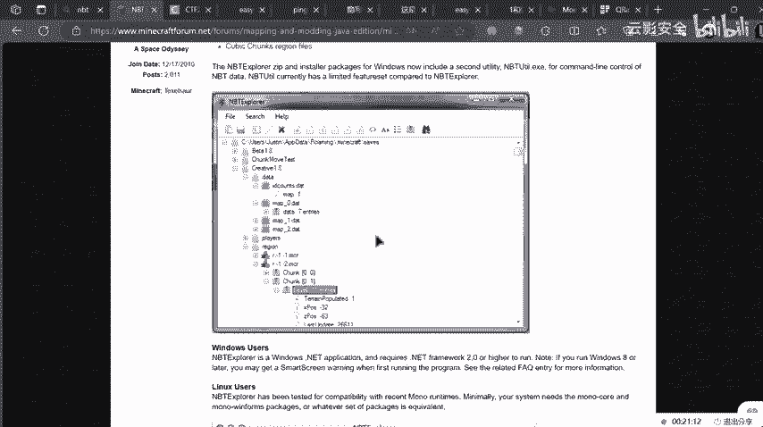

他这后面就是文本编辑器的那个啥了。那个使用方法，所以你现在就把它下载上。这里面就有下载方式。就证点进去就一下。然后他最后下载完之后，就是这个东西这个。所以你现在直接把这个文件拖进来就可以了。

他打开之后就这样，但是这么多文件里面咱们也不可能说挨个给他找，而且咱们也没有办法读取到他这个文件里面内部的内容。这种工具就你一般直接找都特别。你个固定也不是固定思维的，就是你现在需要的答案就是fag。

所以你就要肯定要找。这个38，你先要选中这些。还有一个问题，这个工具现在出来了两个东西。一个是name，一个是value。如果是内部的话，代表的是文件名。咱们可以找不着，所以可以去找外。

因为他这个L肯定是在这个文件里面包含的，它就相当于一个value值。咱们直接找法友就行了。这个他有把进算。Yes。你看像这种，他找到了，他找到了一个flag，他但是他这个flag只有一个。就是一个单词。

这啥东没有。所以他肯定要在他，他说明这是最详细的最详细的找到了一个帅的。Yeah。🤧。然后咱们肯定要在他的上上级文件夹里面，咱们去找他，看到底在哪放着。这款像会有。这已经就相当于差不多了。

你肯定应该能确定他在这儿。这这儿。这个一复制一粘贴，这道题就算完成了。所以他大概就说这个miss科。有点像。怎么怎么形容，就是你就连门带猜，你看到啥呢，你就去找啥。

然后他肯定会按照你的正常的些思维去给你出一些工具，也不会说可以去难为你的。

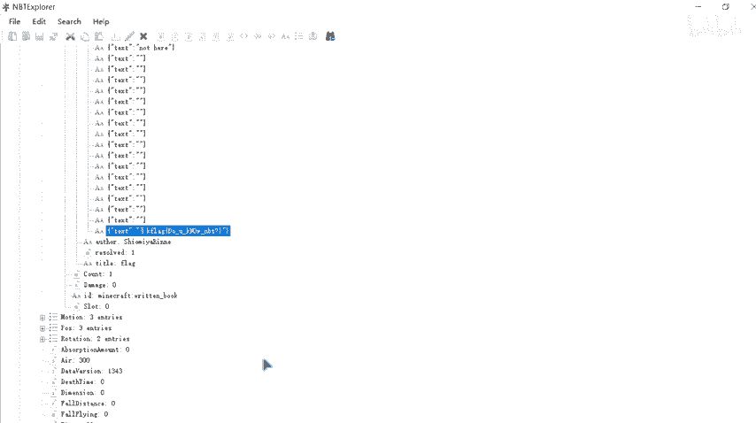

嗯。也不算得到提时，他就不班了。

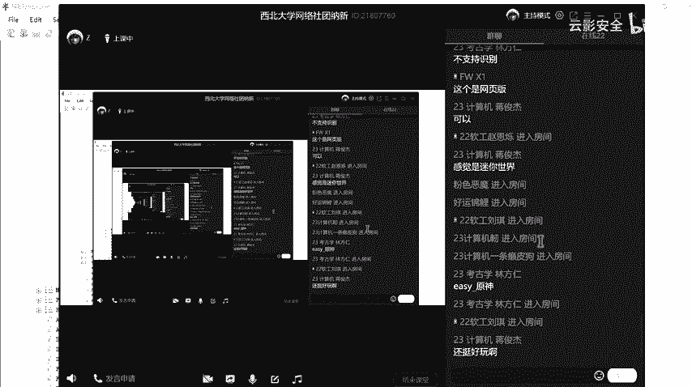

反正平常你玩一玩还是挺好玩的，这些题就挺有意思，它可以让你的思维比较活跃一些。等到后面这个题给你们讲一下开理，开里比较好玩。

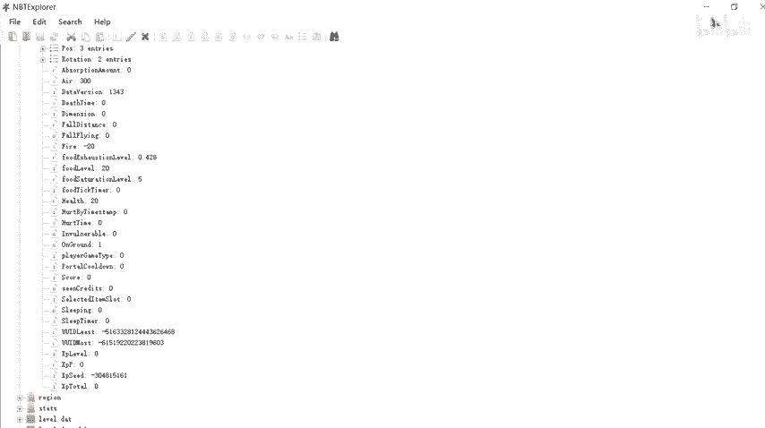

这是其中的里面一道嗯，我想一下，先给你们讲这个这个编辑器，这编辑器是比较重要的。我给你们先讲这个题吧。🤧。这节他的题目叫这是一张简单的图片。他解压下来文件就这一个，就这一张图片，啥都没有。

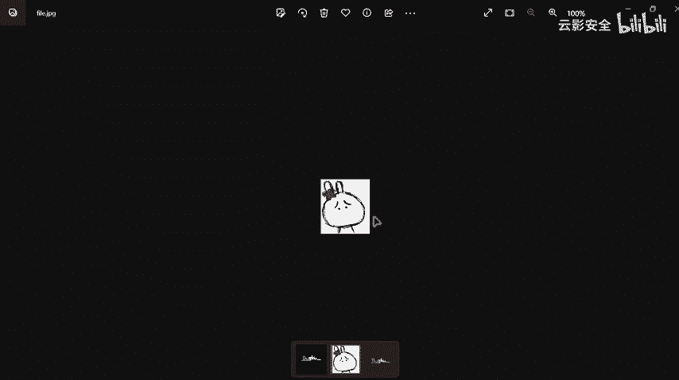

然后就你在miss里面，一般看到这种文件了之后，你就无脑，你就把它直接拖到这个林1恋I里面。我这是今天开好了，已经。你就直接把它拖到这个编辑器里面，我给你简单说一下这个编辑器，这个编辑器它。

他有破解工具。就一次能破解100年，你就接去网上搜就行。010艾。然后你再找个汉化的脚本，你随便一汉话。这个编辑器比较晚呢，它可以就。它啥都有，基本上工具像这些转换十六进制，1六进制和二进制之间的转换。

十六进制和八进制、二进制和八进制。他反正这个大部分用来处理处理这个m里面的那个。图片文档。然后还有几个公具今然没有下载，还有1个IDID1IDA到时候让就后面你们学生讲的时候，让他们给你带上，带上。

然后给你们放到里面。然后这种题一般你直接看。哦，还有一个就是GPG的那个属性图片属性。他的那个是16进制之后，这是展这个你现在看到的这都是16进制之后的。然后他的起始字符就是FFD8。

就是GP这格式的那个固定的。然后它的那个结尾处。我给你找一下，我看。😔，你找着。看这个TPG吧。对，GPG的标准结尾是FFD9，这是一个。咋说呢？就是你看到图片之后，他如果CP这格式。

你就要比较敏感一点，就看它的头截头和尾。但这个头合位你发现它不是B9，而且在它后面像这种井号107，井号107井号107，这一看就已经。🤧。它跟正常的图片都不太一样。

第一个它就是你在这十6进制里面找不到它正常的一个结尾。第二个就是他在结尾处新增立了联些。一为这种题就。就这样你图片出来之后，你就知道它哪出问题了。先看头再看尾，它这个尾置有问题。所以像这种乱字这种乱码。

你肯定不用复制，你把这段复制上。现在7点20还早呢，我待会这两个题讲完之后给你们讲，我没有准备多少题。这第一次培训主要就是因为miss它本身设计的那个啥。知识范围就比较广，也不是说一下两下都能给你讲完。

它所有的题每一道题目就涉及的工具都不一样。有时候有些题可能会通用，但是基本上每一道题就你需要要拓展一个工具，每一道题拓展一个工具。但像这些图片，它有些工具都通用的，你们就可以后面就一块用了。

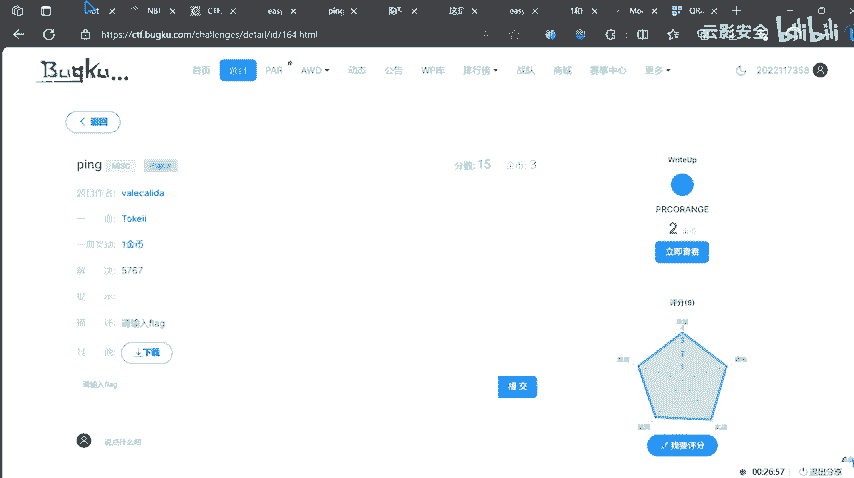

这种时候你就不要这样搜，我跟你说，你这是怎么搜最简单，你这去拆GPT里面。

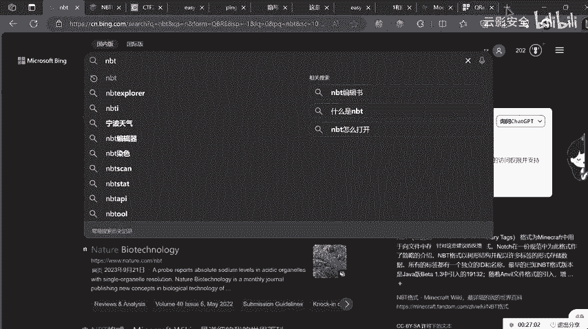

过期了。哦，这我今天刚搜过看。今天刚说过。你直接把它复制给拆GPT。🤧你让他给你解释。这种编码你去浏览器里面搜也要找半天。

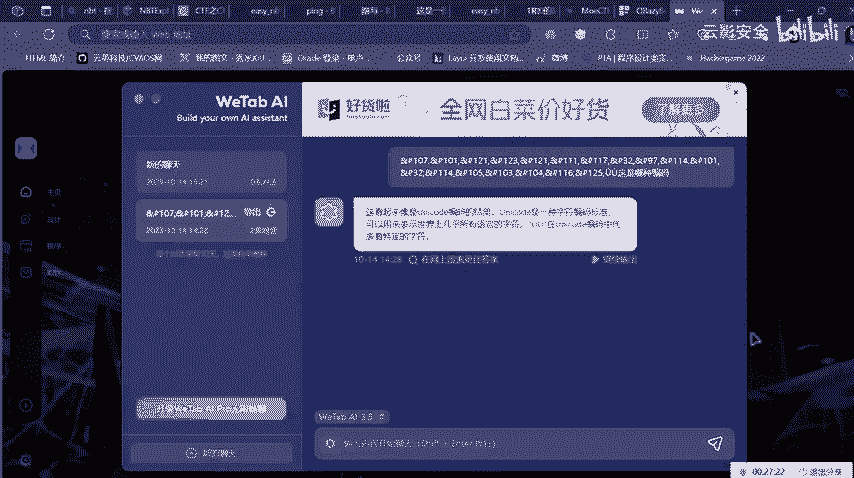

你直直接问他，他直接会告诉你，就是哪种编码结果。然后那现在就好办了，这是。整你扣的。如果你知道怎解码，那就更简单了。

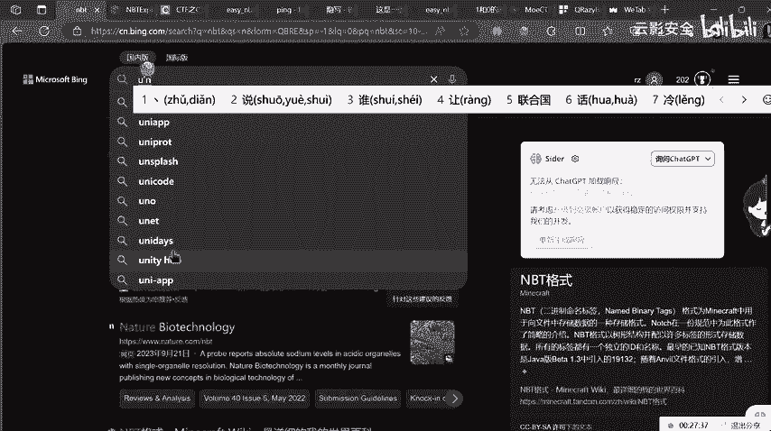

你直接搜这个，它肯定就会出来这些解码工具。这种网页版的都不用下载。你不管是mac系统，还是lin才是win系统，你都可以进去。网页版的你就直接。你把他刚才那串复制过来。

你现在这个东西叫做这个unicodeunicode解码。所以你肯定上面就随便试嘛。这转出来跟没转一样，你再试试阿克吗。一转。看这就出来。像这种一般都是比较基础的。就就像西电那些密斯科，他就不基础。

现在那密斯科特别难。真的现在那些miss，我现在一共才做出来两道。特别难，西南的新生赛，反正。😊，我我我是比较菜，所以做出来的少。

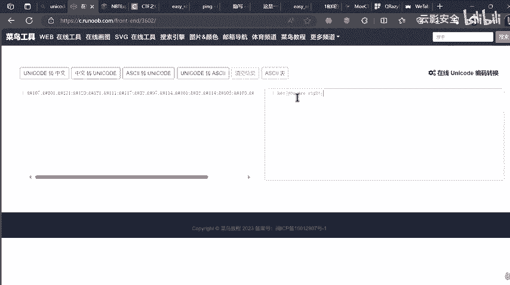

Com。🤧。你们要是讲的时候感觉我哪太快或者没讲懂，你们直接可以在这里面说。

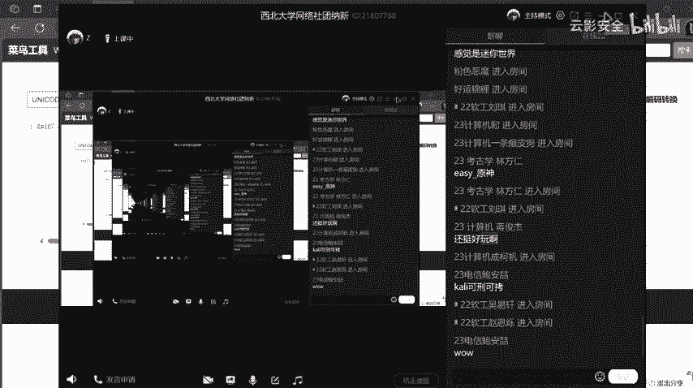

那这个题就直接这。他那个flag肯就拿到，然后你提交就可以得分。他我记得就是。

他会有一个实时的那种平台，就跟现在这有点像，但也但也不是完全一样的。就是他会实时就看到你能看到你的分数，然后你的排名那些的。

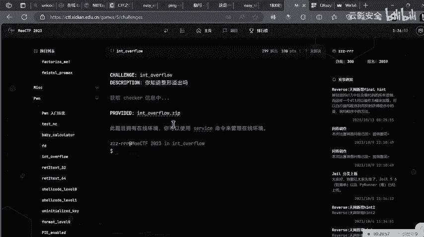

比较自这个。然后我给您再找一下吧。这个题就说完了，这个工具这个工具就是如果你们现在不着急，等到后面你们要要是开始正式比赛或者培训啥的，到时候给你们考试的时候，这个工具必须要下载啥。

因为我说miss肯定是都从这里面给你往出来看信息的。它这工具也对其他文件也是特别管用，它比较全能这个工具。就记住，你就先看先拿到一个东西，先看图再看呗。一般都是头尾出问题。然后呢，借着你说这个工具吧。

这个工具还有一道题是。我看一下。那，这是刚那个图片。还有一道这种隐血的题。你写就是CTF里面miss肯能比较常见的一种方式。🤧像影响一次协议一般都比较难。

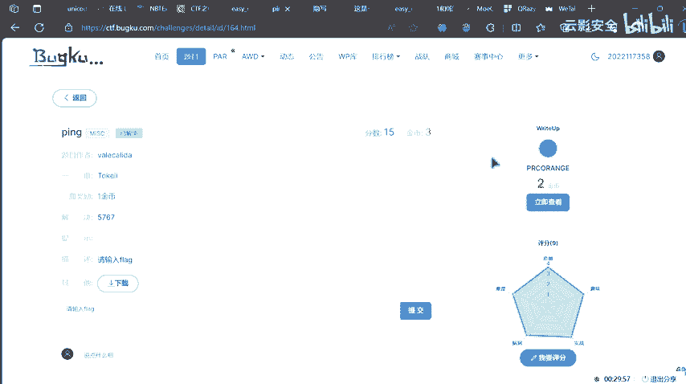

也不是难，就是容易想不到。然后他这这个题也是一个给了一个压缩包。他出来是这个样子。

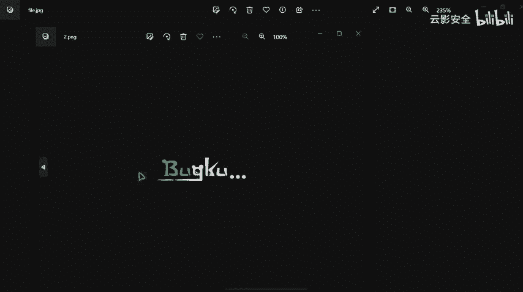

就只有一个bug库，然后3省略号。这啥都没有。还是我就这种图片的你都想都不用想，直接拖到这个AD艾里面。嗯，我好像没开。你直把你直接拿这个工具把它打开就行了。都是这些。还是老规矩。先看头。

你看头这有个啥有个PNG。听这是。图片透缀跟GPG1样，这个大家应该都知道。然后先看头再看尾。他这个头尾跟刚才就没有那么多相似度了。就完全你都看不出来啥是啥。啊，我把那个。输出窗口掉出来。

其实刚我给你关了，重开一下吧。其实刚刚刚进来的时候，应该其其实就跟一个那种你们现在用的编译软件差不多。你看这儿。这里有报错的。他这都检测出来了。CRC。咱们肯定第一次，如果说那啥话。

肯定不知道CIRC是什么东西。咱们直接去接收。你看这看这个特别CIC修复，咱们现在这个属于。

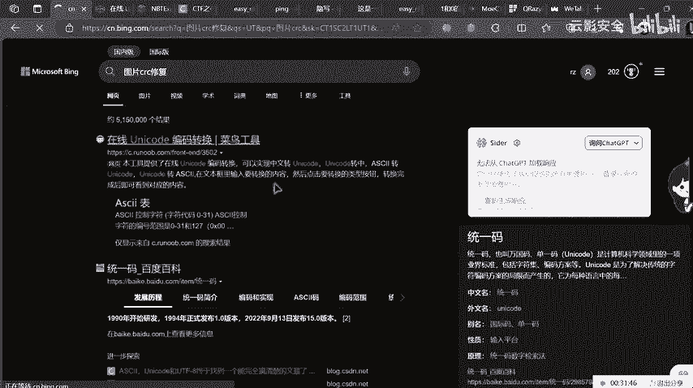

就属于是相当于他他给CRC报错了，已经。

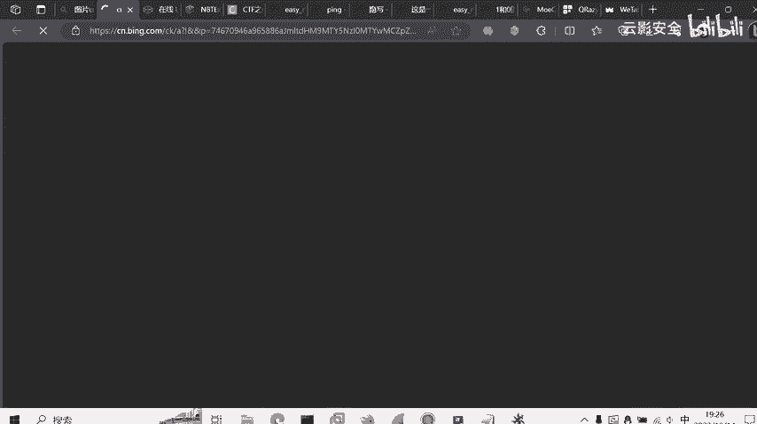

看证。而且他把那个报错内容都告诉你了。其实咱们都不用搜了，它这个编译器就真的很万能。刚刚这个图片你拿出来之后，你就看看他报错的点。这。CB第六点摆置在上面CB第一行。第二行这CBD6DF8A。

这当于是这儿出错。然后。🤧到后面其实你们查完之后，你就。他其实说的都一样，就这个这个是你图片固定的CRC。如果说这个CRC被你故意，或者说你修改了之后，它就会出现这种错误。

所以就你现在只需要他可以告诉你。Q跟那个编译器，你写个什么C语言报错，他会提醒你我改成什么东西，你就把它改了就行了。嗯，让我想一下就这。嗯。我这。替换他这有个替换。然后你就按照他给的。把他那个。

他现在现在相当于是CB。第六。CBD6然DF。然58A。哦，它始就是自动填充的。你如果我是直前打开过的，你如果是第一次打开的话，你输入这个它底下就会出现这个，我你把它替换掉。断小之后，他那个爆头就没了。

现相当于你把CRC修复了，你把它保存一下。🤧你叫他另出来。🤧你现在有导出，你看一下，你改了个什么东西。

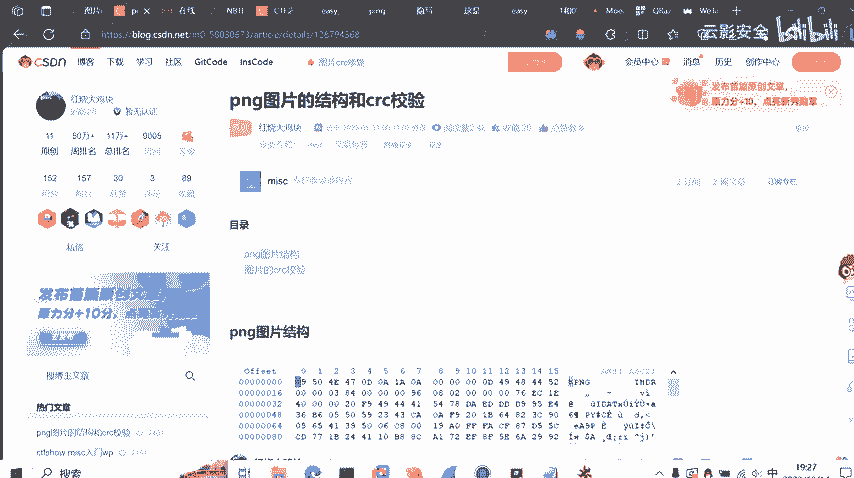

这个三就是刚刚刚刚改过的图片。而你改完之后发现。他没有说在这上面出现一个。出来个或者啥。然后一般啊然后下来就是我给你们。给你们再教一个东西，就是你拿到图片之后，像这种编辑器里面，你先看头，然后再看尾。

然后你就看它看它是哪种格式。它现在图片就无非就是GPG和那个PG。平底这两种格式。然后你现在看完之后，你就开始看图片，你一个图片有啥，有像素点，有宽，有高，有大小，然后有内存，对吧？

然后其实我刚刚给你们还少说了一个东西，就是一般你拿到一张图片之后，你第一反应应该先看它的属性。因为之前雨学提的那些作者就是把那个啥把flag会给你留到这个。对你那个你那个图片下载下来之后。

它就会在这种类似于这种备注的上面，我给你直接备注flag。但是一般人都想不到，他如果把这个直接拖进去之后，他在这里面是看不到他的这些东西的，这得拿另外的工具来重新看。

所以就你下次就以后如果要你们要做这种题的话，就直接把它进去之后，先看属性。你发现水里面没有的话，你再把它拖到这里面。然后。这个GPG格式。这个这是。这是那个。宽，然后这是高。但是你现在。你就你看他是。

这个这个格式li是固定的，它有些里里面是固定的，然后你一般就是图片，先看属性，属看完之后，你把它拖到这里面，看头看尾。然后你看它有没有什么不一样的地方。就比如刚刚刚这个一样的话。

如果说你发现他他头或者尾有这种特别规律的字符，你就可以把它拿去了。现在常见的计划是这个unicode。然后你做的你后面再做再做一些题之后，他还有啥就有那种。哈西密码还有一个base64。

主要是base解法，base解码unicq解码，这种解法是比较常见的。然后你们后面都有网页版的工具，就可以把它拿去解。然后你像这个之后，你固定完之后，正常的图片，你打开这里面。

就如果说没有被恶意修改的话，它的宽和高就。🤧基本上是差不多的。但是你现在看它因为它是16进制，相当于一个字符差会差16。它现在是一个是01F，一个是01A，它就差的很多了。

所以他这个就就说明他这个出题的人就把它专门给改掉。哦，你可以去改着试啊，你虽然你不知道改宽还是改高，你可以随便试。假如这个是你可以先改光，你把它改成。X改的跟成一样，改成跟他一样的。另存一下。34点。

你可以打开看一看。从哪儿？你看这比如运巧闷对了，你如果刚改前面，你把它改一下，它可能出不来，那这就已经得到答案了。这就这是这种图片的题。

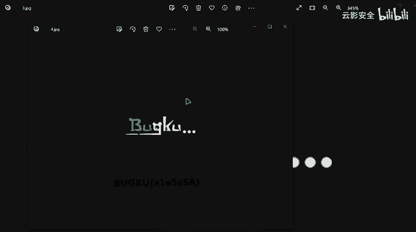

然后。像这种题其实都还好。然后给你们看一下那个讲到这儿，我顺便给你们讲了吧，给你们讲一下西店的一道。西电。就昨天新春赛西店的一道题。嗯，我那是PNG和GPG都是就是浏览方式。那股无所谓。我把它要另存。

不然它自动会存成那个就我几个文本文件，一个没有互制的文本文件。我刚如果改成PNG和GPG不可以，因为那种修改后的文件，那是我修改正常之后的文件。你看我就刚这儿。这个。他刚开始他刚开始不能正常打开，是啥。

是因为他的。就是CRC的这个这块被改掉了，这块是坏的。我现在把它修改了之后，你存的我存的是为了。让他那个啥就应该规范一点，就就存是P整，因为人家的格式都是P整。但是他这个没有给你改头文件或者。

刚刚那样改委文件。你这些全都能。就是怎么说呢？这形容就是。啊，我的错，他应该就严格的按照那个PNG这上面这上面PNG改当然是最好的。但是我刚刚只是为了一种浏览方式。懂我意思吧？OK。🤧。

然后这个是系列的道贴。西在那个文件也是压缩包挤压出来之后是一个这种东西，像这种东西就是后缀。嗯，然后这种东西就是没有后缀。然后他的那个原题就是。发了一张图片，但是图片打不开。

按理说他应该发出来的是一张完整的图片。但是图片你打不开，所以你现在要做的就是看他哪出问题了，他打不开图片。

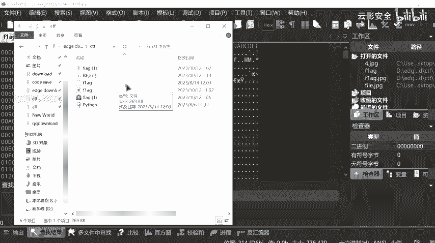

这就是刚刚那个flag文件。老样子，你就先看头，这个头看不出来啥。但是你有一个要有一点要注意，它图片格式的开头基本上都是固定的。这是偏执，这我的错。刚刚这个不能给你们举理，这个我关掉。

命名还是要按照严严格命名。Yeah。你看。如果是1个GPG格式，它是FFD8开头和FFD连接着。它这4个这四个是固定的。然后这是他的尾格式啊，这个这个尾格式还有问题，我真服了，我没有找好例子。

就是GPG格式现在的那个有没有9，我看有。对。BMPGPG和PNG它这三种后缀，它这个格式就是它设六进制编码，开头和结尾基本上都是固定的。然像这种，你看这个这个一打开FF10。FF10。

你这一一眼就能看出来。其实然后你再看它的后边。

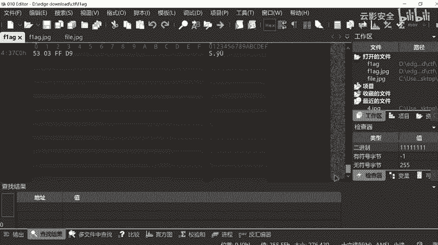

FFD9，它这就很明显是1个GPG的格式，说明啥？说明他的是。头文件被人家恶意删掉，你现在就直接把头文件给他加上就好了。然后设置里面你直接公标点在这编辑，然后插入，然后插入字节。你在这一输就1六进制。

然后你在这一插入进去之后，刚刚刚一样，然后你另存一下。像这个图片这是我修改之后的。我就在这加了一个这个。你加好之后，它现在相当于是个正常图片，你把它立存一下。像这个你命名的时候就不能命名成PNG了。

你名称PNG的话哦，他能打开。对他俩边有个是一样的，你能打开。这我该怎么解释呀？这把我拦住了。我想祈求场外援助。算了他们应该忙着呢。就是。它的格式是固定的，所以你命名的时候，最好就按照他这种文本格呃。

就那个文件的格式，图片的格式，你把它命名上。虽然说它浏览方式没有什么不同，比如你我这个我刚刚这个我改完之后，我要命名成flag点PG，我这样能打开。像这个就是我修改之后的图片。就术修改完成的图片。

按理说他把flag就应该放在这上面。他叫踢我，最后还是没做出来。🤧这时候就要用到其他工具了。你看他给给你了一张完整的图片，而且。他这个图片你修改宽高，他都不会给你显示出来。

也没有说因为图片高啊还是什么宽。这时候一般图片就跟刚做那些题一样，它就会出现另一种另一个名词叫做图片的引起。

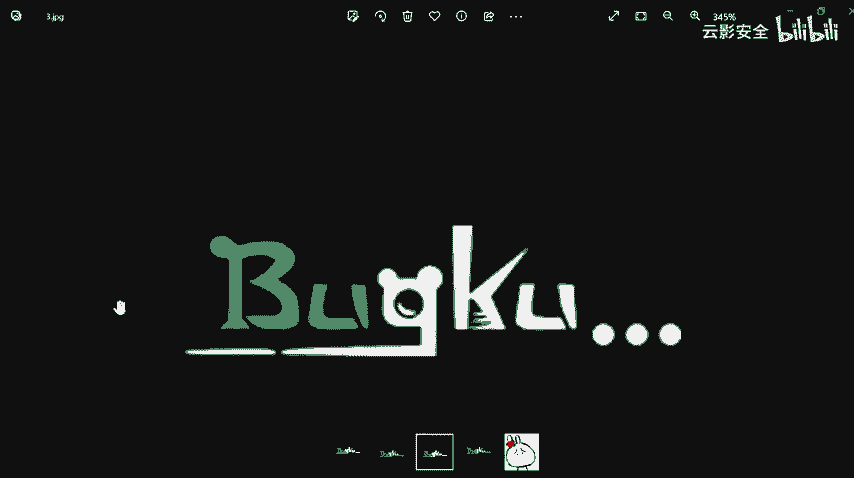

他就会把flag给你藏在这张图片里面，但你不知道它藏哪了，所以你就需要借助其他工具。然后这边主要介绍的一个图片影显是那个叫LBLB影险图片影险。

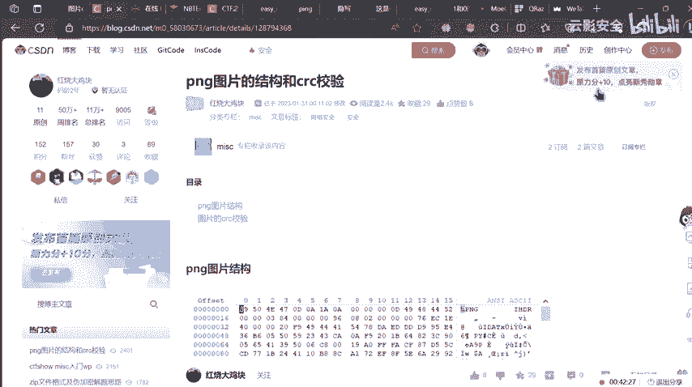

他其实这些你网上一搜，它就会出来很多东西。然后我想一下他用的是一个什么工具啊。这工具其实要给你们讲一下，因为你们。计算机是电信。

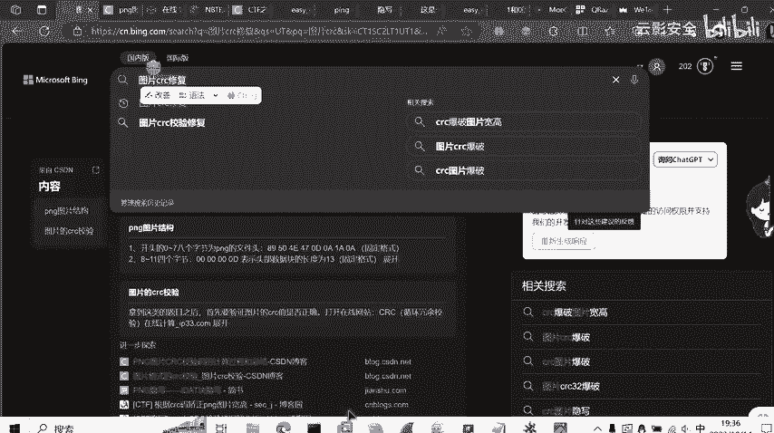

哎，我刚刚是不是看见一个文苑的？查地图。是哪个茶几图？潍方人。我我那时也想了一个，我其实我我刚才准备了一道题，他也他那就是查地图的。

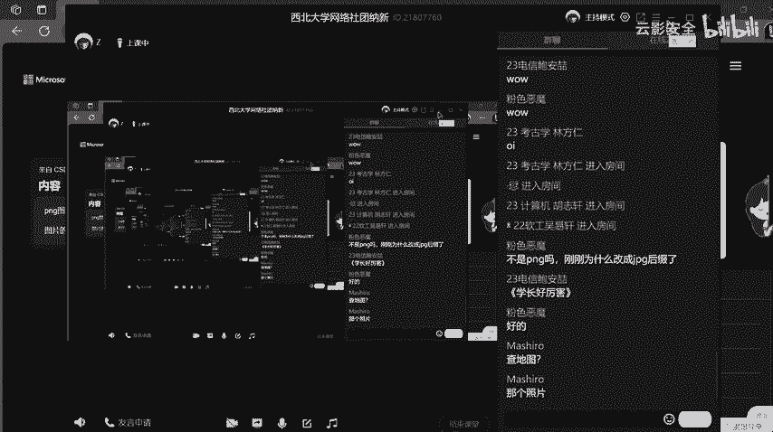

那这个题查地图的话，这这就是西点校内的风景。这些就是系列里面的这就是系列里面的。他的他如果说。一个地名是flag的话，他会告诉你，就在题目里面会告诉你。因为他这个拍摄的就是那个。就西店的风景。

我也不知道我也没去过西店，我也不知道西店哪个校区的。跳楼塔。是店的特色吗？他名字就叫跳楼卡。他他就学校给他的官名，你这。学校给一个塔的名字叫跳楼塔。Yeah。我也懵了。

那那那人家出题肯定不可能给你出到那个啥里面。他肯定会就按照官方留的那种东西。没事，这题主要给你介绍一个工具。你们以后会学java的。计算机系的同学OSD你写这。

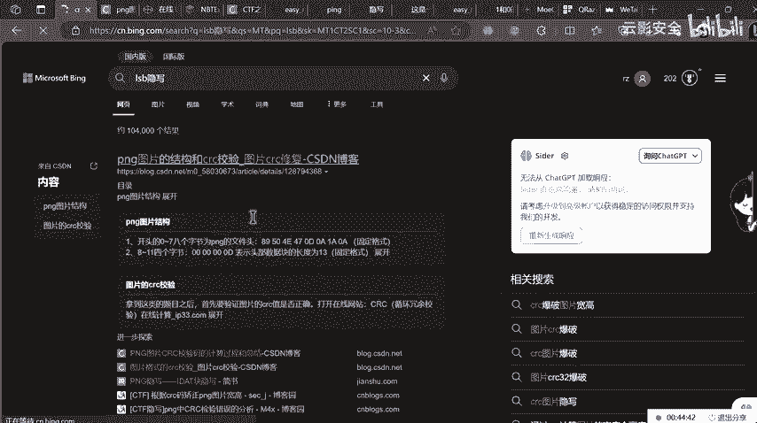

这些些我给你们说吧，就你们后面会。会学那个。会学java，然后。你们java编译的环境之后，你们肯定要装的GDK因为GDK就是集成java，你要写java肯定要用到GDK这。知道。

🤧等到你们大一大大二的时候就会知道了，你们肯定知道下载这个JDK。

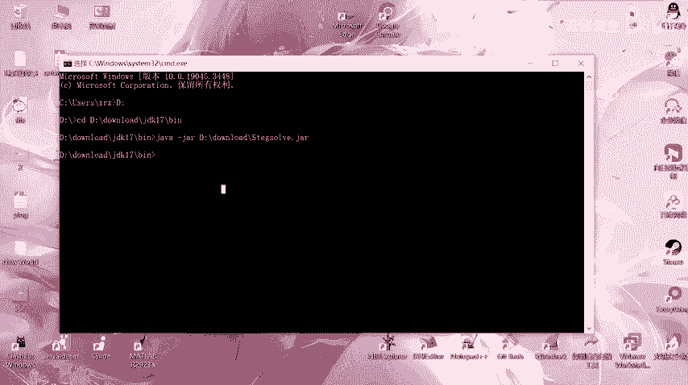

让你去官网，只要JDKGDK。讲一下吧，反正后面你们肯定还要自己去搜。

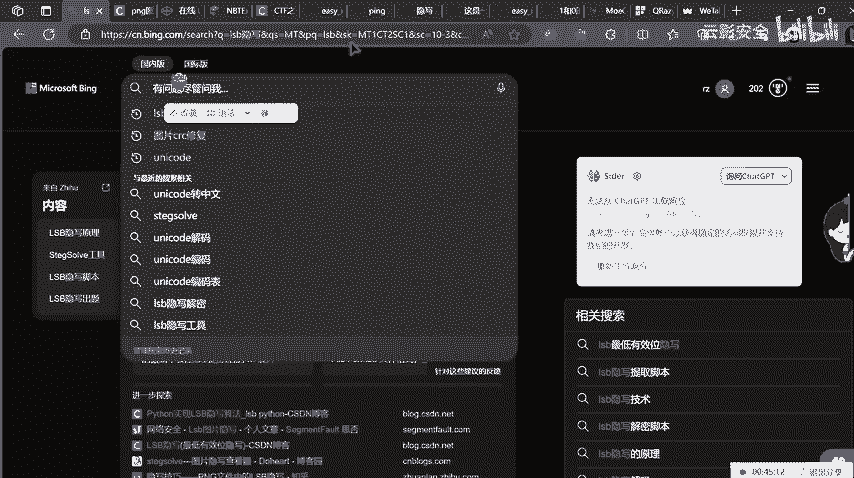

javaGDK。

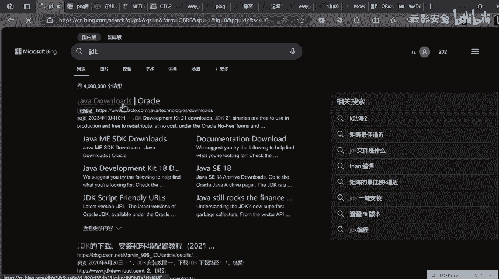

其实这个GDK用用的东西很多。你像刚那个我的世界里面，刚刚刚那个我的世界。

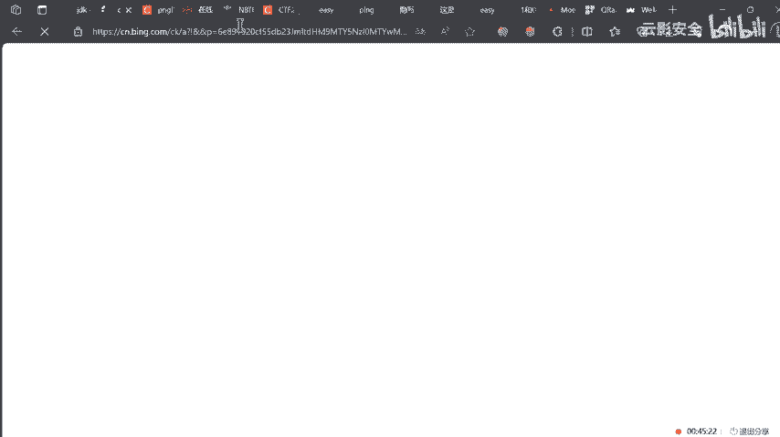

然后。你以后学java，他都要用到这个JPK。

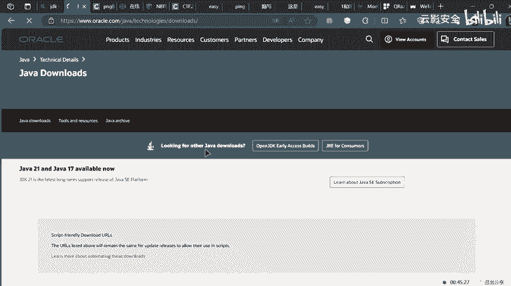

现在这D可以清出的版本是JDQ21。就你不用21了，21他说的是不太稳定。反正我我就我们我们我们这个。用的是17和8这两个版本。你进去之后。你就差6次 installer。一下载下载完之后。

最重要的就是它有一个步骤是配置环节变量。

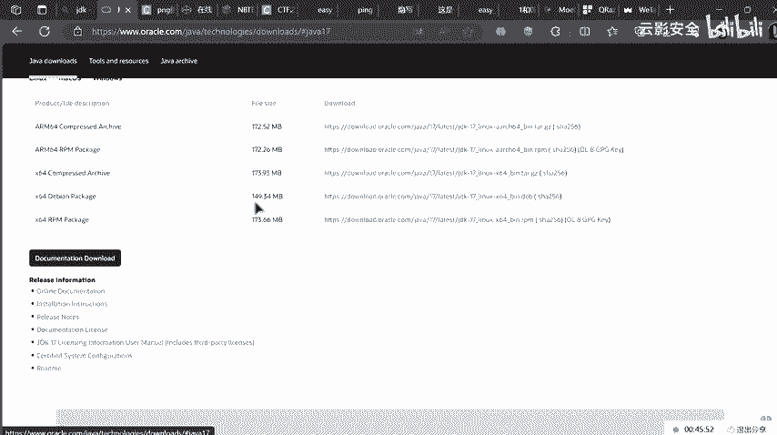

这个你们应该挺熟悉的吧，环境变量。因为。

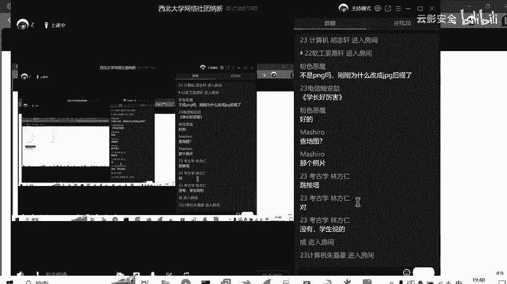

你现在编译环境像那个Vs code， west code就需要配置环境面料。你们现在还用的戴CRA代CI也可以用，你们先用着，等到后面感觉不太顺手了，你就想换这这几个都行。

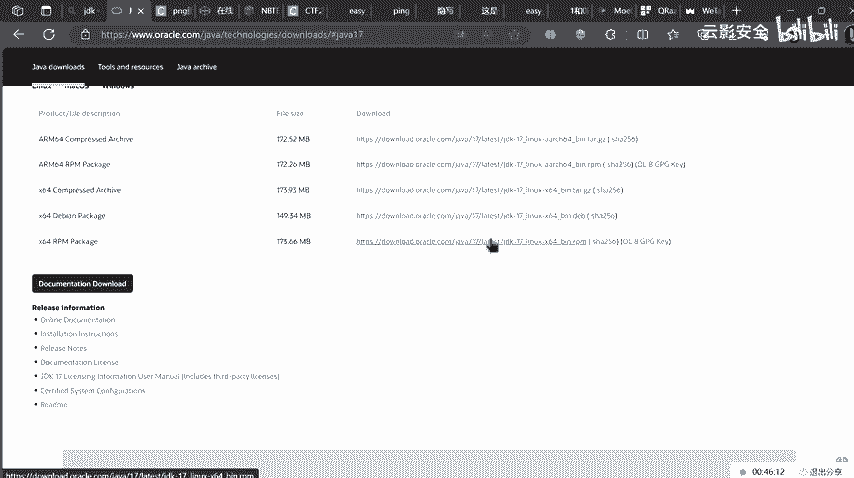

west code，然后就写C源的Cline，然后python的排唱，还有一个紫色的，我忘了，我就我就电脑上没下载。还有个紫色的。就几个软件比较好用吧。主它的背景背景比较好看，你可以自定义。

然后他就是你配置好了之后。这个工具的名字叫。

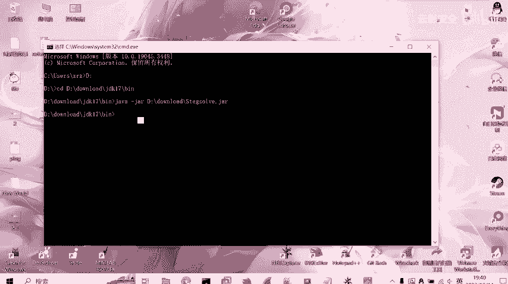

它不是一个软件，也不是一个什么东西。这个d错误，这是一个炸包，它就是在你的那个环境里面运行，它相当于一种胶式的那种运行的东西。

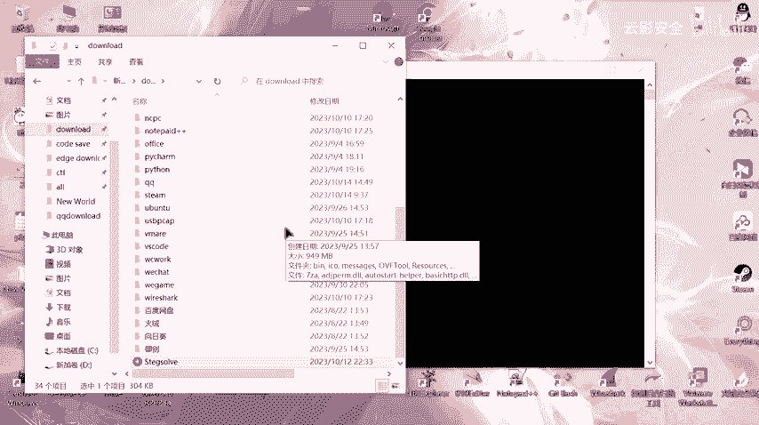

你只是关联他就行了。这是你的那个GBK的病。你把它放到环境变量之后，你跟这个。这个东西关联起来，这个你们到时候网上一搜，你直接搜这个staxof这个工具，它就会出来。就相当于基于JDK的它一种。

一种一种什么交互交互的方式吧，这也是个工具，这工具就比较我想想。哎，呦好像关了。

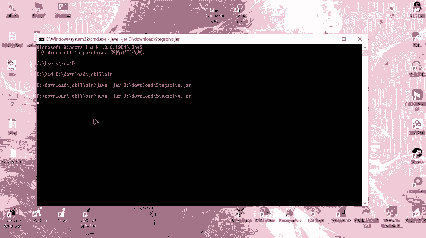

运行一下这工具在这儿，这个你运行上这工具时候，这3D指能框，你不要关，你这一关箱它它就它就没了。就是那个工具。他啥都没有，你现在就把刚那张图片打开。据说这两天才发现这个工具，这工具挺好用的。

它好能也能解决基本上大部分的体验。

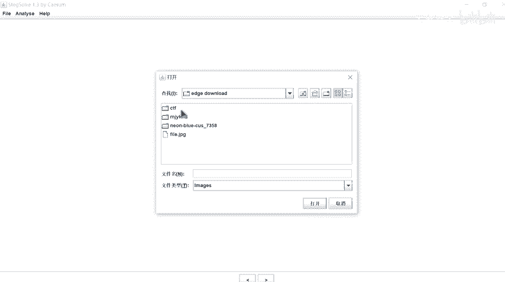

这有刚刚那张图。这个图主要是用来。帮助你干嘛？因为他引血是会把图片分层。给你把那个flag存到这些层里面，但是你你正常看的就是一个正常的图片。他不会那些啥。然后像这个就一般会用到这个东西。

这个东西就是看它那个看red green和 blue，它得三个思项层。这个就叫LB引写，它会自动检测这个东西。你把这个东西弄了之后。可以先看一下。但他这个我很好奇啊，他把回来给没放在井里面。

可能是我没找全，这天时间有点紧，没找全。那个东西还有一个功能，就是会帮帮助你自动分层。你看。你点这个。他有时候其实到。正常的是你往左边点。对。用这种黑白色像的时候，他会给你把flag放在这。

这就是一这就算阴写。具体。太难了，我感觉我出不出来这种题。🤧你可以点开看看这些东西，但这些他就给你把把这些色项给你分好成。

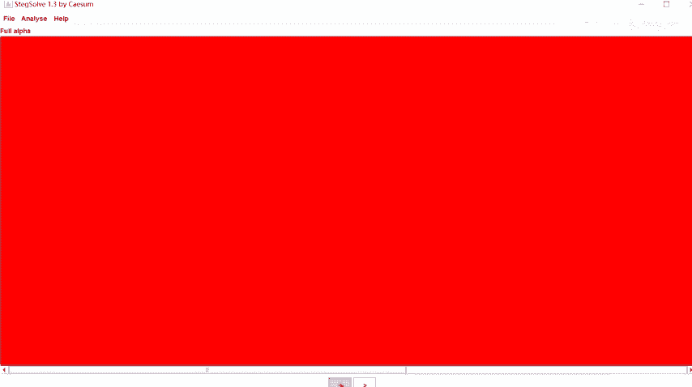

一般会把flag就藏在这里面，还有其他的跟它一样的很多工具，但这个比较比较好用一些的吧。

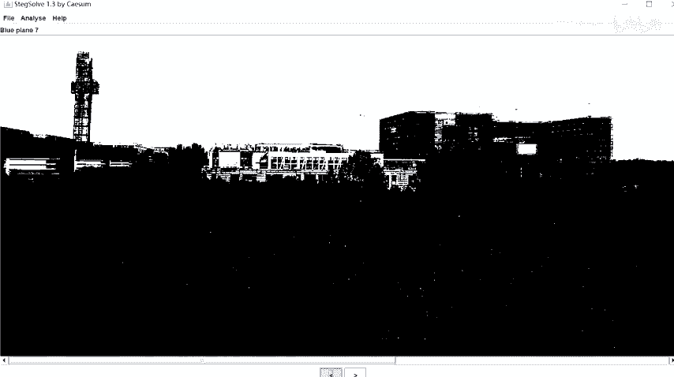

嗯。这工具是这样用的，我看还有哪些题目。大概就这样，然后后面我看现在是7点40吧。查永波。这这儿PERER。这是一个炸包。就是一种压缩方式，我我忘了给你介绍了，他那个压缩方式不是。那个。VIP。

2月2号。T2对TR哦制价班还不算不算一种也算吧，应该也算一种压缩方式，也算一种压缩方式。对，就这样。然后其实这个图片像这种正常的，他给你的。这些图片会是一个压缩包的形式。

这种压缩包还用到好多那种分离的工具。呃，给你们找一个其中一个工具是凯y里面的。你们第一次下开里的时候开这个界面。那个用户名和密码都是开里，你直接输入就行了。然后这就是那个开始界面。呃，我想一下应该是有。

就四个同学吧。这个同学应该是已经下载那个开裂了。开你玩的好，捞饭吃的饱。我想一下，这是哪个界边，对，这个就是那个。开的里面大概现在它集成了300多种，就现现在300多种长的这些。就你用来渗透呀。

或者你基本上都用来渗透，或者对网络进行数据抓数据分析和抓爆这些工具。全都有就是基本上的东西全都有。现在现现在里面应该是有300多种，这些工具你都可以实时的用，它都就嵌在这个link操作系统里面了。

然后现在有一个工具是叫这个binwork。这个工具。看里面它不像那种windows里，它它就这种指令框，这就是那种工具。这个工具是用来干嘛？是用来分析分析一张图呀。

或者说他分析一个文件里面有没有其他的东西。像这个我已经运行过了，我把这张就刚刚解析出来这张图片放到里面。他如果说正常的话，如果里面夹杂东西的话，他会出来三四行会在后面告诉你。

就说这里面有什么TXT文件或者压缩包的文件。但是这个没有，他啥都没有，就比较干净的一张图片，反正我感觉就真的有可能像刚才那个同学说的一样。啊，永魂之蓝，我待会给你讲永恒之南，我今天跑了一下。

我再给你们讲永恒之南吧，你这个专业考古，你盗墓，你盗墓容易吃牢饭。你盗墓的话可容易吃牢饭。哎，这个方安杰同学，你是电电子信息的电信的。涉猎的范围挺广，永恒之南你都设猎。你可别真把自己送进去了。

就是你你们要真自己用开里的话。你扫一扫可以。就你别乱乱整啊，因为有时候咱学校的wifi还是比较脆弱，你扫到，你扫的话是可以就扫到他的后台去的。但是你要上去的话，它就需要。那个徐号和那些啥的，你不要乱讲。

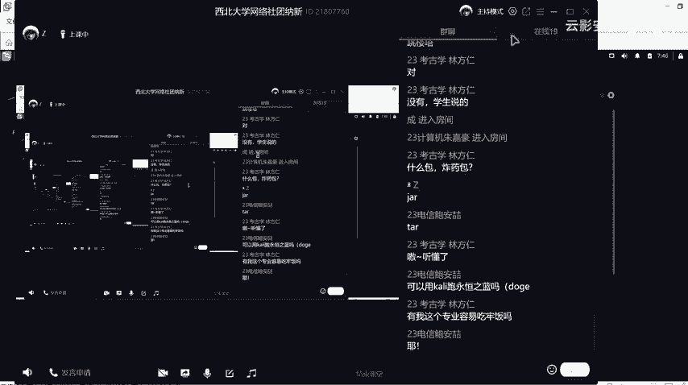

不敢乱整来处分呢。这就是里面的一些工具。然后后面我给你们最后讲一个工具，叫那个win shark。这个工具就是用来数据抓包，然后分析数据的这个工具比较重要的。因为你。要分析数据的话，肯定逃不开这个工具。

然后winshrk的话给你们找几个题。其实你电脑上有没有要没有下载winshrk的话，它下载就这个假如B这个题，这个P这P你下载下来它那个文件，它就跟这个跟刚刚这个这个一样。跟这个flag一样。

它是没有后缀的，它就这样啥都没用。但是你下载完没上去之后，它就会自动出来1个TCPC。PPCPC。对。你上一下看一下。你说二逼靠。PCAP。

就这是那个威shoprk他的那种专用的这种后缀PCAP它就相当于一个数据包。我你过来呀。你把这个东西这些这个拼拼你这个提直拖进来，直接拖到文上克里面，这我已经开过了。这就是他的那个数据包。

像这种数据包就已经很干净，这一看就是专门为了出题给你整的这么一个数据包。像这些他这些地址什么全都一样，这常的数据不可能只有这么点东西，一个包里面。还有就是你连续上wifi。

就人家后台就能看见你拿这个wifi走了哪些数据。你懂我意思吧？就他都什么都能看见，因为你那些数据都实时发出去的，他抓包的话能抓到你的。就像这些都是比较用来处理就些小的东西。像那些大的。

我记得之前之前老大介绍的那个工具叫啥，我忘了，但是你进去之后，你就能实时看见你把那个包抓来之后，他不是都加米传输嘛，你把他这个数据单独跳出来，你为他爆破掉。他自典的，你想现在一个密码才几位。

他不可能说给你几百位的密码让你去试一个密码就十几位，你爆破你最长最长。一两个小时肯定给你报报出来，现在字典很全面的。你报告出来之后，把里面数据就可以提取出来，但现在也没那么容易，要看个人技术。

等到后面你们就。进入这个生团之后，后面打比赛的话。让老大给你们露两手，因为我是在学的东西有限，我这次比赛比较晚。你现在就看这些东西，这些东西都一样，你可以挨个点着看。挨个点。

你看这屏幕上整个这个东西只有一个东西在变。你看就这就这在变。只有这一块地方在变，所以说它极有可能flag就藏在这一块里面。这个东西没展示一下，我这电脑有点这个屏幕有点小。你把他拉到过去。

它旁这就刚刚那个16斤是一样，它后面就是它的对应的东西，这是第一条数据，第一条数据。然后你点出来之后，它这你看一下。老规矩头尾头尾啥都没有头。投是这些东西，后面有个F，然后你一般这种题你想都不用想。

他只要首字母是F，那肯定不用想了，flag就这样了。再点第二个，如果不出意外，如果他第二个过去应该是L。看这。所以说这个题就已经很明了了，你就挨个点。点出来之后相当于就是flag。

第三个它应该是那个flag的那个哦，第三该是A。对。具体就这样。这个工具就比较。这比较那个啥了就比较厉害了，他抓数据包就比较分析的给你，这全是SMP协议嘛。

像这网络数据网络里面SMPDCP还有1个IP协议，还有个HT后面还有几个啥，我忘了。他这些数据你抓出来就能看见这个题就这样，数据不要抓出来，你这把flag给一天就过了。下面一变，不是它下面变。

是因为它每个位置不一样。你下面如果数据要抓吧，你点每个数据。啊，他为什么回不去了？你要看它的头和尾，因为它中间的是它的存在的数据，它数据不一样，它数据你看这是1六进制。

两行数据对应的是这这么多的16进制的数据，你每变一个数据，它1六进制就要变好多变变，我看应该是四个字节。十六进制，应该是四字节存一个。哎，我放，这我也不敢胡说金制这个东西我也不敢胡说。

它应该是四个字节或者两个字节，存一个东西，存一个数据。所以它下面变是因为你后面的数据变了，你看。就这个意思，具体就。就行。其实像这些基础题，你看一眼这些题它要真正出出来。那，你到时候直接看一眼。

你就知道大概是啥样子，这些题就能做出来了。然后另外一个题就是这个。也是一样，其实他也是出了一个。我找一下。这电脑如果有那些东西的话，你一下载它会自动弹出来这些东西。下面的题其实也不是很多。

你做完之后可以去其他地方找题。因为CDF的题确实很多，也不是只有这一个题目。他下载出来之后，解压完之后是这个东西。直接你如果电脑上有win12，它是会直接就成这个样子。它本来就这样一张白白的东西。

没有后缀，啥都没有。如果winin12的话，它就是PCD形式就给你点出来了。🤧。这就是刚那个刚刚刚我刚填完的这个数据包。你就看像这种这种数据就算稍微复杂一点了，因为它里边不只有不只有一种数据类型，你看。

TCPTCPTCP。TL跟你说像数据包里面，你看到T里面，如果说出现这种数据类型，后面啥都没有的，这些你就不用管了。因为它没有，而且你你你只要发现一个，一旦说数据里面出现了TCP。他如果说去TCP这种。

你这要想都不用想这个微shop里面有个现成的工具。我看下是分析。这追踪流由和这个SDP还有前面的。这儿对过滤器，你过滤完之后，它会只剩下那些TCB，但是我现在不用过滤了，它这个数据很少，不上。

兵线不像你拿个手机，你要。放一个网站，他发出这些数据量才大。所以咱们直接追踪就好了。TCP6。靠，你看这种这种题直接就写在上面，但是比赛时候不会这么简单，像上一次的我们就比赛就这种题，它是分章节。

要选他的那个哦，我记得上一次是。也是阿斯克玛，应该算了好多。他把那个flagflag编码了，他把flag加密了，加密成每一张不一样。然后你把每一张它会。就一长串一长串字符。

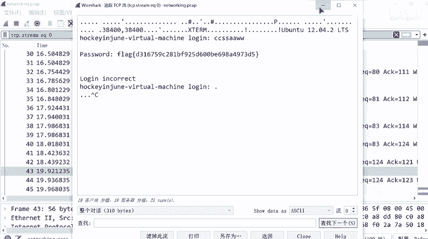

异常串上面只会留两个字母，要把每一张的字母拼接起来，再解密，解密出来就是它的fag。那这就比较基础的一道题。就是差不多差不多这些工具。7点。8点。剩下几分钟。我原本就算就是讲一个小时，这些工具你们记得。

还这些工具，这虚拟机，就你们就现在基本上如果有双系统的话，每次进乌班托也很费劲。你就按个虚拟机。其实当时装的双系统就是为了。检查一下动手能力和那啥，我们当时写是这样。就也是都装了，都装上之后。

后面其实你要这个啥问题，重上一次系统回计都没了，或者你不想用，其实留着也没啥坏处。🤧主要介绍就是这个工具，n佩拉跟那个林它俩属于一种工具，它俩的工具作用是一样的。一个这个还有一个win shark。

只是这个遇见就跟。我想一下，今天有个同学不是在群里面问吗？那个barbe suite。他也不算也不算巴。他也是后台扫的，他就会扫你那个你一个网站里面会不会附含其他的网址。或者说你有没有其他危害性的网址。

他都会扫出来。现在这些工具都是。作用还是比较大，比较集成的。最后睡一点时间，刚刚有个同学。呃，我给你们讲一点那个就很久之前我搞过的一个。给你们讲一下那个永恒之蓝啊。应该好多同学不知道永恒之来是啥。群里。

啊，这些东西其实你到官网一搜一下载这些东西，后面给你整理一下，发到群里。OK辩护表后面整理一下。

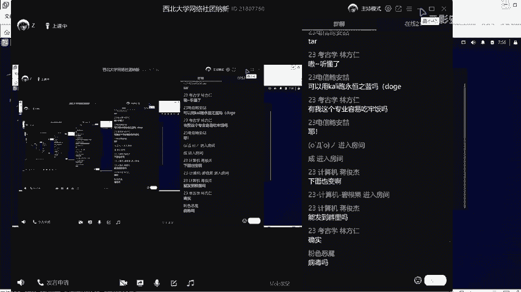

对，永恒之蓝是一个病毒，永恒之蓝是17年的时候，你选的时候那时候温吉我忘了。在17年时候，一个外国外国的外国外国不法，就是那种犯罪团伙吧。开发的一个病毒。

它有点像就前两天不是西工大那个二次约会那个那个病毒，它比那个它相当于更新了换汤不换药。然后他那个永恒之癌是一款就是监测监测实施监测电脑的一款病毒，在当时还是很严重的，就是他那个病毒在当时很厉害。

但是现在现在别说winwinwin10了，那win7自带的自带的那些杀毒软件都能给那个永恒之南杀的那个他大概存活了存活了1到2个月吧，就是1到2个月损失还是挺大的。最后微软写了个补丁，就记得你面。

文加尔哦，这这个信机里面。CMB之类里面。那个那个叫啥SY。哎呀，我忘了那个指令了，太长了。SYMUN什么东西啊？SYM。UTL。啊，不是这个，就是查看电脑配置的。

就你如果是新机或者说不管新机拍照的时候，你查看它会展出你的电脑缩有信息。你看里面有个补丁修复程序。然后他一般都会，现在应该是个亿吧，我我没记错，应该是E。就我也忘了是啥了。Wanna cry。那快。

我我不是也是B吗？我没了解过，我现在我我。我刚开始看的时候，我只看到一个永恒之蓝。就现在那个win10和win7，还有win11，它在后面。啊，对，这个信息SY。复制过。嗯，对，这一条看。

加载修补程序信息。

点的越要看，就是他他之后在所有的微系统里面都把这个东西修复了。然后他现在被包装了，永恒之蓝这个东西就是换壳。🤧就是被换壳，然后。重新包装啊，重新修改他所有的东西。然后现在这个是叫。刚没开过。放哪去了？

对。是这个东西。MSFCNSYLE。这个东西。

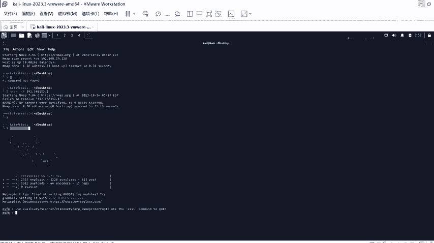

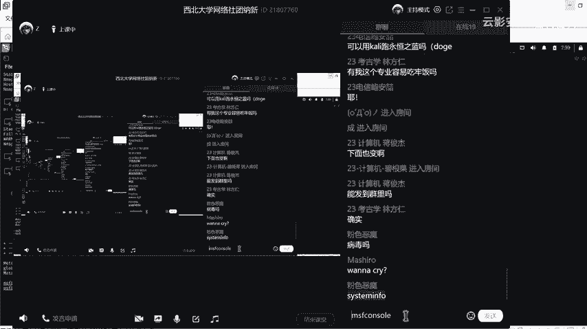

这是其中的一个。其中的一个，他还有其他好几个，我也忘了。然后你像就是一般现在你要监听一个电脑，你手要做的。跑不会挂了。需要做的就是获取这个电脑的IP，因为你一切的监定肯定要从电脑的IP开始。

然后你电脑IP的话，像这个linux操作系统里面。那个操索是IFCCONFIG。你看。这个。这块就是虚拟机的IP。其实后面你要感兴趣的同学，你可以自己下一个，这是开里。你可以下一个win系统。

你开一个windows的虚拟机，你可以自己打自己，你可以试一下，你不要打别人。虽然你现在你肯定打不过去，因为。人家现在既有防火墙，还有像杀毒软件、火容啥的。你别说打了。

你连人家电脑的IP都你第一个你就获得IP的。IP的人家方式都获得不了。但是如果说你自己有服务器，你把这个东西弄好，弄好之后，如果说你把它写成一个程序带壳，你再拿带壳的工具，写一个壳，写成一个软件。

它要自己下载的话，是杀那个上方那识别不出来的，可以绕过杀毒软件。你这样的话也可以变相操控。你可以导致找自己的好朋友时，你不敢乱投，这个东西写好之后不能乱投他样写课也很简单，现在所有的工具都是现成的。

再强调一点就是。自己玩自己的不能乱放。这东西是犯法的。明白我意思吧。然后学校东西你也不敢乱整，你要扫进去就扫进去了，你也别。乱感什么的，虽然现在扫进去可能不太可能，因为学校的就数据中心东西还是很厉害。

都特别完备的，也不说也可能让你随便扫进去。你啥不行，自己玩自己整，你不要。危害社会就行了，不然这就是进去了，现在都成年了，你们。像这个东西你获得IP之后，你就可以直接拿他这个工具扫了。你看设这种横胶来。

它是啥？它叫一个，我记得那个是ISM。P还是M长，它是。之前的win系统有这样一个漏洞，它根据这个漏洞之后，你扫出来它的这个你把这个网段，你看这这这这是。还有哦还有工具叫n map。

这个工具后面再给你们介绍吧。n map你扫这个网站之后，你会扫出来它就是。公网局域局里面的应该也不算吧，就你会监测个网断一下。这个IP地址里面的机子，因为它那个有以太网和虚和虚拟网络。

它扫出来的像种点一啊什么都是基本上都是虚拟网络。现在的IP就IPU是不够用了，又加IPV6正常的IP不肯定下上，你扫不出来的。然后记术说你扫出来它之后。

你就可以进去这个永恒之南这种小工加包加加装过的工具了。这个就是它的一个界面，每次工具都不太，每次界面都不一样，都会更新。进之后这个软件进去之后啊，它有有一下面这几个命令，这是我提前说好的，看不见。

这几个字应该能看。这。🤧But。这是这个小工具里面自带的。scanner或这些。然后他是那个。我现在我这这个电脑上没有，主要没有windows系统虚拟机。不然我给你可以给你试一下。我总不能自己打自己啊。

自己给自己电脑黑了，那我不嘚儿吗。就。自己下载一个那个虚拟机的那个win系统，你进去之些这进网上都有，现在都已经啥都有了。你可以随便，你要感兴趣再下个加壳的工具，你把这个工具原始码扒出来，再加个壳。

写1个EX执些文件，你丢出去，你可以你可以自己换一台电脑试，也可以丢给你朋友，强调一点，就不要乱给别人丢。因为这个病毒威力还是挺大的。🤧。那好就好。有个reset有个应该是RESEAT什么的。

IATS还有什么命令？然后你就进入你的这个进入他这个IP地址下的东西。然后你知道这个IP地址下入就可以对它进行，相当于它这个工具帮你完成了侵入电脑的动作，你就可以对它发出指令了。然后他那个指令的话。

我记得你在这里面命令行里面输那个help，就可以看下他所有的指令包，然后这边包括什么，包括给电脑截屏，相当于其相当于你远程测控他的电脑。但是不管这个电脑，不管是开机还是关机状态，你都可以进行操作。

这是比较厉害。你可以截屏关机开机。

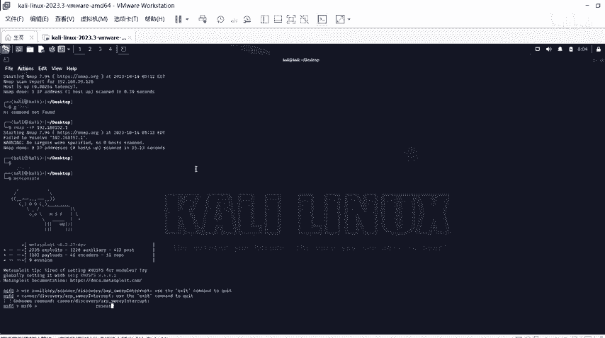

然后软件的好像这个预售工就不可以，剩下的就比较强大。像这些东西他现都给你放出来，说明它已经没有太大的威胁性了。差不多就这么多。成功了。你要真成功了，你要真成功了也是一件好事。你关机了之后。

如果它关机状态说明没人用。他有那个开机的功能，它上面是有开机的这个功能的，你可以帮他开机。你是不告，你就不犯法。

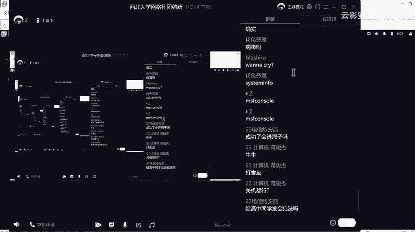

今天大概就这么多东西了。主要就是介绍了这几个工具和CTF是干嘛的，然后还有CTF的比赛形式。就大概都了解CTMV比赛形式是啥样就行。

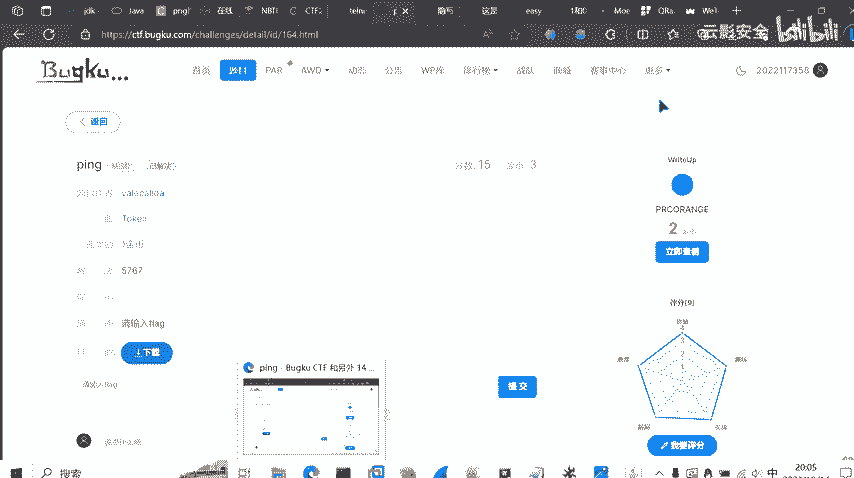

另外就是这种做题。他他其实你进去之后，贴实都跟这差不多，也基本都是压缩包方式。要么这种。

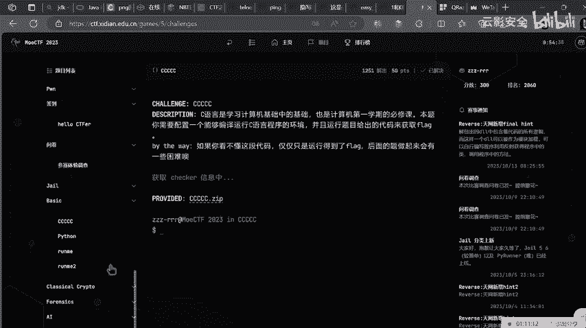

看一下。胖在哪？

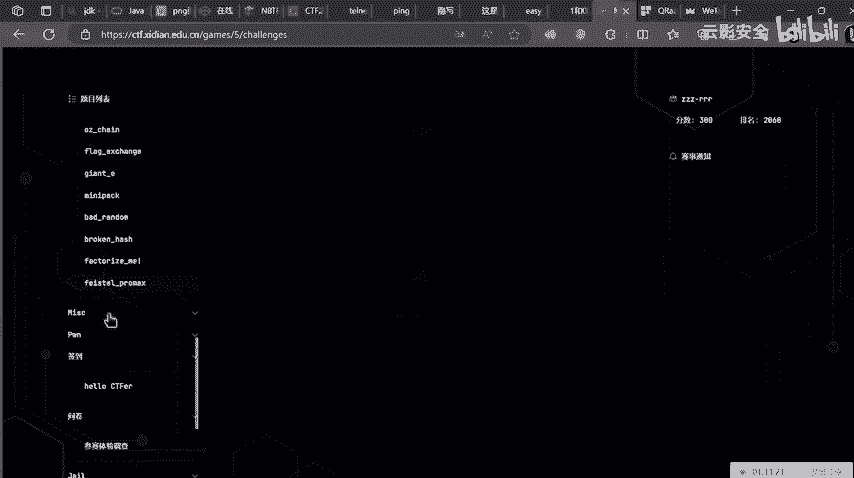

嗯，等过两周让我们其他的三个大佬给你们讲，给你们讲讲密码，p web部，这些才是真东西。我现在就给你们铺垫一下，讲点这些简单的东西。因为一般这种题，你们这个战队里面。

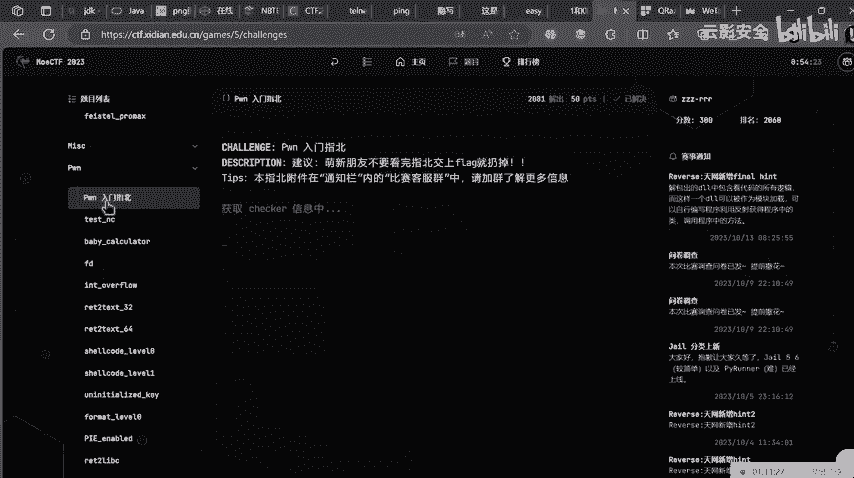

肯定像一个是跟我一样比较菜的，就折腾这些。

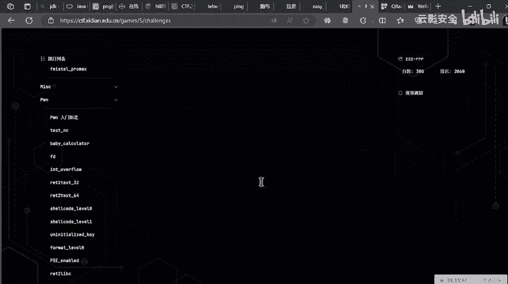

这些东西就这但是像这些胖，这些在线环境就是到人家容器里面去做题了，这种就比较难了。这些都等到后面你们学长再给你们讲吧。断电电脑有电就行。只要有他的IP，因为他这个他就相当于进后台了。

但是联不联网我不太确定有没有影响，因为我我只试过，就是打信机可以成功。但是我我我没有试过对。真实的朋友，但都我我我我高中舍友的就让他关了那个病毒病毒杀毒软件，把微信自带的杀毒软件也关掉，也是可以的。

这个也是可以的。但是一般谁傻呀，谁把病毒杀毒软件全关掉，让你打。他把AP告诉你。OK了，今天就讲这么多。到了，看那你们期中考位是在那个啥吧。

