# CTF入门第三讲--PWN与Reverse分支 - P1 - 云影安全 - BV1oa4y1X7J9

喂。现在听得见吗？OKOK现在听得见。😊，可不可以听得见？现在可以听见现在可以听见。来吧，虽然没多少人，但我还是先开讲吧。

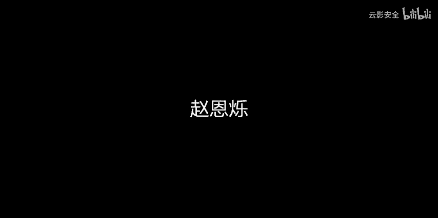

今天不合适，今天开正乌会。这节课啊主要给大家讲一下那个。关于CTF中胖的分支，还有逆向的分支。但是逆向分支的话，我个人可能做的还比较少，但是胖的分支很多基础的内容，我是基本上都有所涉猎。

所以今天就来给大家先来讲一下这个比较基础的胖该如何开始。以及这个东西要怎么入门，好吧。好，这次是一次7天5胖的一个。入门级的学习哈，首先我们要搞清楚这个胖是要干什么。基本的理解。这个CTF的比赛中呢。

这个胖是指通过程序本身的漏洞。编写以及利用脚本破解程序，拿到主机权限啊，也不能说是破解，应该说是嗯。反正就是利用你能掌握的各种手段去拿到主机的权限啊，这就需要对程序进行分析。

以及了解操作系统的相关特性和相关漏洞，并且还要对尤其是C语言要有一定的理解。尤其是对他底层的怎么执行，还有它底层的汇编有一定的要求。但是如果是只是基础刚入门的话，只要了解汇编32位的就行了。

也就我们说的这个886。至于叉64的话，其实跟叉32还是有一定，跟叉86还是有一定区别。但是。只作为入门的话，了解叉32一般来讲都是够了。然后呢，这是第一个肯定对汇编要有最起码的了解。

不然的话你根本都无从下手，怎么去分析一个程序，对吧？我直接丢一个程序过来，你能把它运行啊，但你知道它里面是怎么写的吗？当什么样，你不知道，对吧？现在所有的方法，只要是能把程序重新代码化的。

一般都只支持反汇编。因为汇编是除了机器语言以外，最低级的语言。基本上大部分的反编译工具都是可以把一个程序。以汇编的方式把它反编译出来。那你看到它大概是一个什么样子。这是我们第一个要求。第二个要求的话。

各位现在应该都多多少少的有了解过C语言吧。开学到现在。如果有的话。嗯，第二个要求就是了解程序执行相关的一些。占空间的分布好吧。就是这个程序啊，从你给的函数到你怎么执行它，这里面到底发生了什么啊。

计算机是用什么东西来帮你操作这些事情的？对吧然后第三个就是我们要会编写这个基础的pyon脚本。利用python就是比较。简单方便又快捷的脚本语言来帮我们完成一些人很难去做的事情。比方说一个站溢出。

那可能需要你输入1000多个字符，那，我不可能人手去敲吧，我一个一个一个敲敲1000个，我要敲过了呢，敲过了，刚好溢出不到他的返回地址了怎么办？所以我们肯定是需要借助一些工具来帮他完成这种事情。

我说然后呢。第四步就是会分析代码，简单的使用一些反汇编的工具，比如IDA pro等等。你没事啊，然后大部分的题目下。大部分题目都在lininux环境下，需要了解基础lininux命令操作。

对我们的环境要求的话，lininux虚拟机还有C和python的环境都是要装上。然后呢，相关的一些需要利用的工具，比如pty bug，还有pcos，还有rop ga。

这些小小的工具都是可能需要中后期学习以后才需要了解。然后呢，这节课我们就来了解一下最基础的漏洞就可以了。对于程序各种类型的典型漏洞，一定要有一定的感觉。如果你没有感觉的话，你根本就不知道从哪里开始下手。

对这个程序进行啊漏洞利用和破解和谈破解是吧？

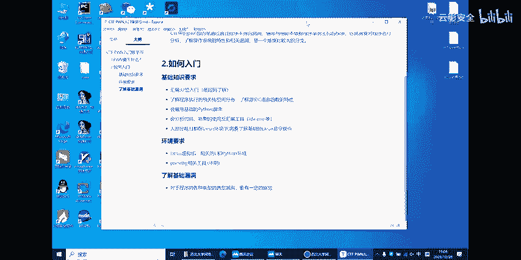

啊。那我现在就来给你们。看一下一个比较基础的一个。有趣的小程序。这个程序呢。叫做数组一出啊，数组越界懂吗？

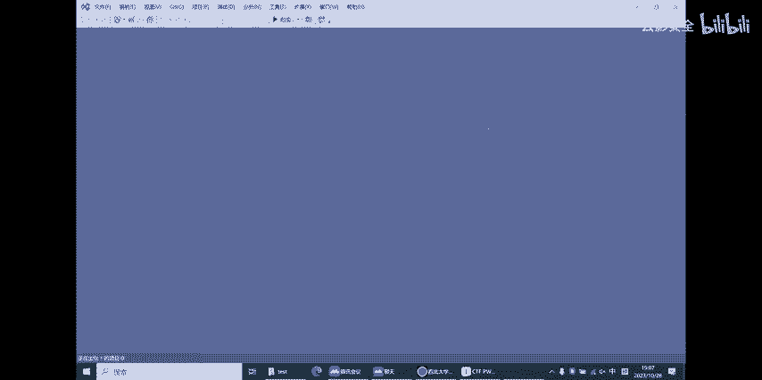

如果数组越界的话，你们肯定是元老师都跟你们说啊，越界了就一定会报错啊，越界了就一定会产生什么问题啊。即使这个月店你要控制的好的话，我可不可以反过来说，他反而是能帮我做很多事情。

比如说我下面现在这个一个非常简单的代码，你们可以稍微看一下。你们装他大概做了个什么事情啊，这个in3不用管。就现在这个小小的代码。我定义了一个长度为九的速度是吧？啊，算了，这个你们后面去研究啊。

我讲完这个课以后，你们再看，我就给你们看下它到底会产生一个什么样的效果就行。

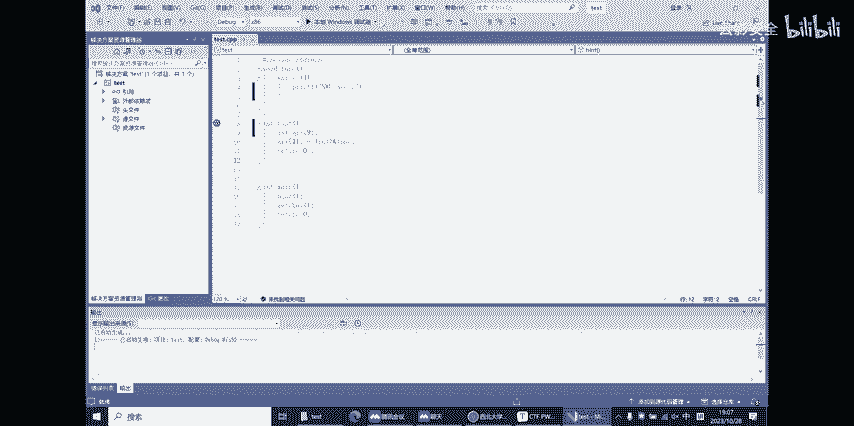

诶第一。他怎么没有嗯，应该是这样。晚饭点去要。看见没有？它就会执行一个无限的循环。这中间到底发生了什么事情？这个等你们自己去研究了哈，这个讲完今天这节课以后，你们应该多多少少知道从哪里开始下。

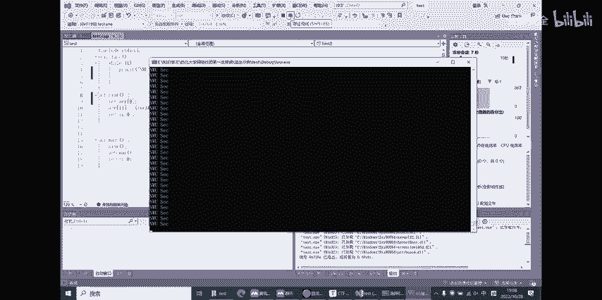

等分咱们做。这代码到时候我可以发给你们，你们可以回去研究一下。我们要导的第一个开始讲的东西，我看看就给你们讲。

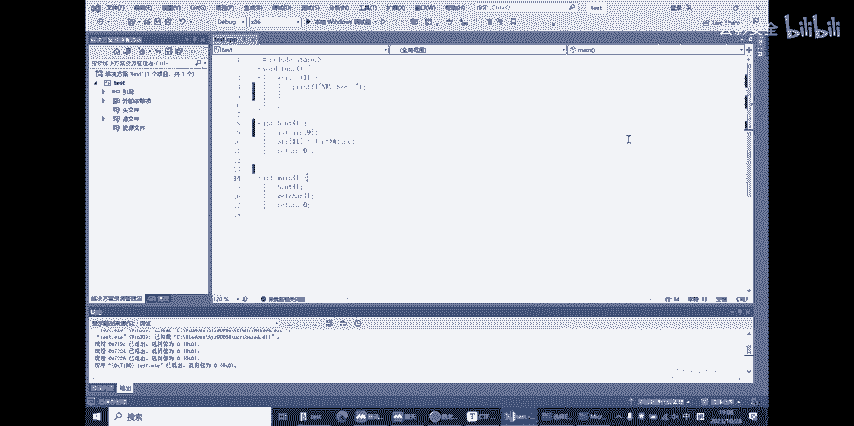

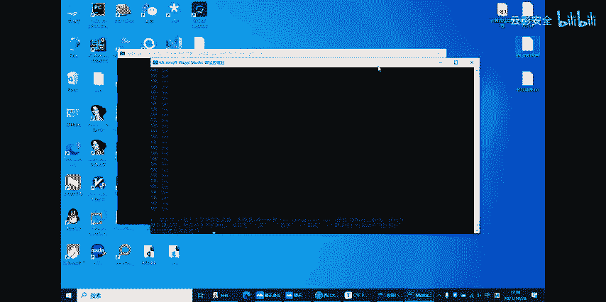

西安电子科技大学的CTF的新生赛了，你们不知道有没有参与过？这里面有一道题目叫做int overflow啊，顾名思义嘛，就是int类型的溢出。那它究竟发生了什么样的异处呢？

那我们得开始对这个程序进行分析了。但是这个程序啊，但你下载它的时候，它就在windows上显示的是一片空白啊，这是为什么呢？因为它根本就不是一个在windows下可以运行的一个程序。

它其实它文件格式是ELF这个是在linux系统下才可以执行的程序。那我们从哪里开始对这个程序进行分析呢？啊，拍课之前我有讲到过了解一些最基础的反编译工具，像这个IDA pro是吧？

我就可以先怎么样把它丢到IDApro里面对它进行一个反编译啊。这个工具的话，你们可以回去试一下。反正就是把它拖进去，OK点一下，再点一下OK然后把整个程序以汇编的形式全部反编译出来给我们了。好。

那我什么也不说，你们反编一出来以后，左边有一个函数框，就是你什么都不懂，你应该也知道先点一下这个 main函数，看看它里面做了什么事情，对吧？啊，扣到面函数以后呢。这些东西啊先放一放。

我们可以看到嗯是不是应该先给你们讲啊，汇编语基础。是，那我先从。比较基础会员指令开始讲起吧，不然的话这样直接讲你们估计别人看的是什么不知道啊，然后这个多的原因。三系而家啊求。And。

因为我来天就可以汇编程序哈。😊，我要讲的第一个就是一个move指令，相当的简单，就是一个内存复制的过程啊。比如说move一个这个我打开这个来给你们看吧，用VS反汇编来给你们看看的更直观一。

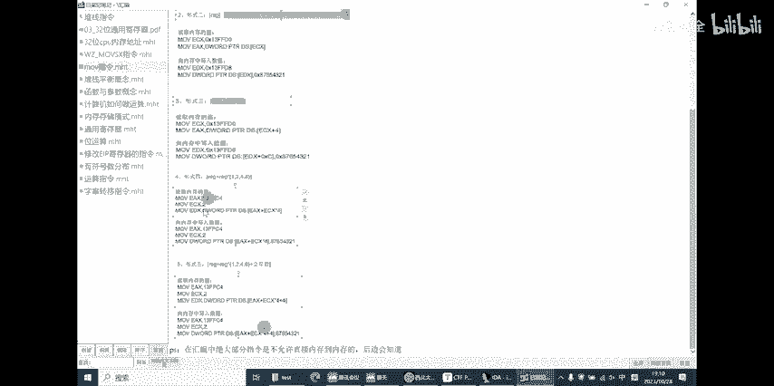

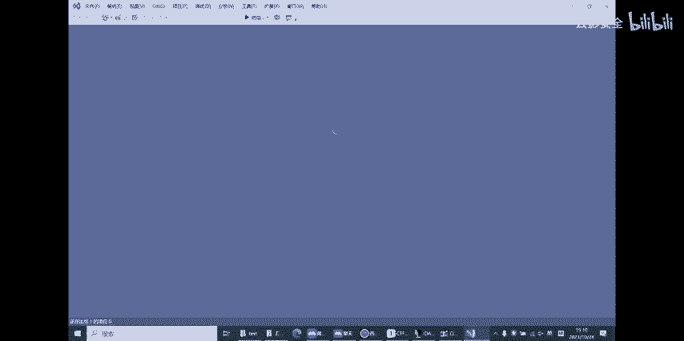

这么不能那怎么办？函数他要怎么样来进行反汇编汇编到底干了什么是吧？其实很简单，对于基础的汇编来讲。今要。嗯这个adad是什么？艾是我写的一个小程序。他加两个的结果返回是吧？

那我们汇编的时候看一下在妹函数里面，他执行这个函数的时候，他干了什么事情。首先呢现在还没有进入这个函数内部啊。木屋。就是把二这个值给到一个叫EDX的寄存器。寄存器它就是一个可以存储数据的一个单元。

它一般根据你本机的字长来决定它存储的这一个字到底是多少位的。像这个编译环境里面，我选的是它6拆64也就是64位的，64位的情况下呢，因因为in类型它是32位，所以我就把这个二移到EDX这个寄存器里面。

它以32位的形式以32位寄存器去接收它这个数据。我进行了两次幕夫指令以后，我现在看大家可以看到这地方，我在箭头指的这地方有个扩。靠是什么意思呢？😡，大家可以直观的理解为就是直接进入到这个程序里面去。

那我们这里不妨F11跟进去看一下它到底进了哪。然后我们就进来了，这个就是我写的这个int add的加法。它里面做事情也很简单，一看就能看得懂是吧？

EDX就是刚刚我已经把一和二那个数据分别存到这两个寄存器当中了吧。至于这边这个RSP加8加10啊，你们先不用管，先不用管好吧，反正就是你现在就应该知道我这两个值是腾功的，已经传进了这个函数里面去了。

下面接下来这个push啊跟那个smer。你们也先不用管好吗。也先不用管，然后。这些的都不用管。然后木看到没有？这是YY就是这里面的一个行参是吧？然后就到XX也是一个行参。

把他们全部执行完了以后做一个相加相加的结果。你看是把EAX二这个命令是把后者的值加到前者上，然后把前者的值呢再传给EAX是吧？我们就EAX里面现在存储的值就是我们的。一加2等一个加法。看。

从这里开始看啊，目线把Y的值给EX，对不对？然后再一个目把X值给ECX，然后把ECX值直接的给加到ECX上，它的结果也存在ECX。然后最后把ECX值再付给EAX。个4个EX以后呢。

这时候EAX的递存器里面就已经存了我们这个函数执行完毕以后的一个结果。我们最后再准备回退回去。return指令就是回到你ca前的下一行指令了。大家能看得懂吗？我肯能说。有一点快，因为这个。

要从头给你们讲的话，又有点太太慢了。这节课就完全学不到什么东西。就这种比较基础的指令的话，它底层肯定是还有一些逻辑在。但是我现在只能浅显的先给你们这么讲，他是这么回事。但是你们想深入学习的话。

一定要把汇编这些语言最基础的这些啊底层到底做了什么事情要搞清楚。然后这里的话EAX我们就已经把这个ad的值给返回了。拜这又是一个。一个加法啊底层反汇编以后形成的一个结果，大概就是这么个流程。啊。

中午先回来，然后。😊，地土的汇编指令的话，我现场给你们写一下吧，不然的话你们真不知道。还有一定需证。我屋子里好你从我屋子里看一下。目不指令呢它是可以从就是在做。嗯，副职啊，应该就是一个副职指令。啊。

对你是怎么负制的？😡，EXEX比方我就举这个例子吧，EX是一个计存器。呃，这你先把两个回，你先把他说放去给个把块。寄存器呢它就是可以。重组吧哦，对了啊你们。我这个目EX到EX的意思就是把EX的值。

啊那我就。不给了EX就这么简单。第一个是两个寄存器之间的负值。第二个的话，约个1多号12啊，就这么简单。意思就是把12这个值给写到EX计存器里然。第三个目偶就是。嗯，EX和EBX。

针对两个不同的地存器之间负责，好吧，也是一样的道理。把EBX指给EX就这么简单，木补就这么简。然后第二个讲一个比较简单汇编指令叫艾艾什么加法吧，这个应该都知道。二的指令的话就是啊EX逗号2什么意思？

就是EAX等于EAX加2。就这么简单，然后它保存的结果也在EX里面是吧？我已经说EX是一个继存器。他是你这个，他那你的。一个计存器里面，这个是从程序执行的时候，就一直存在的东西。啊，你这个操作做完以后。

EX面值就已经被修改成2，就这么简单。啊，第二个是大文大文什么减法吗？减法也是EX。二就是等于EX等于1X2啊就这么简单。啊，这些比较简单，我就这么简浅说一句就行。第二个我要介绍是一个叫赞的是。

如果你不会意这个的话。你根本就不要想做这种。什么是这？就是一个。一个先进后出的结构。你们知道那种取盘子的基币吧。你把盘子往下压了以后，你一个一个盘子放到一箩筐里面。

那你是不是最后放进去的盘子是最先拿出来？就是这么一个道理。比方说。我现在有123456，这么6个数字，我要按顺序放到这么一个框里头的话。他应该怎么放啊？那是不是一我放这里二放这里3456是吧。

是把数据给放完了。但是他这里呢你取出来的时候，你就不能随意的取。比方说我想拿五出来，那我怎么拿，我可不可以直接把五拿出来，这不可以的。你得先进后出啊。先进的后出一是最先进的，所以他要最后出。

六是最后进的，所以它最先出。我们要想把五取出来的话，我们肯定要先给六给你。然后这样能把我拿出来。这么个道理。然后呢，讲一个关于站的指令叫push。不许就是亏的意思压。获取1个A的话，意思就是把死好了。

获取十就是把十这个值呢给送到在里面啊，就从最后面开始把它放进去，懂我意思吧？很简单是吧？再讲一个泡，泡泡EAX哈。举个例子啊，EX我说了是一个计存器是吧？可以存储数据的单元PopEAX很简单。

就是把站顶什么时占顶，就是你最后一个方建元素的地方。啊，今年今年小，所以呢问这个就。应用组我们就需要把站顶的元素给。赋值给EX。这个操作执行完以后呢，EAX就等于10。然后我们的站顶呢也从这里移到这边。

这个地方就不存在，也不是说不存在它的子还在这里。但是我的站顶指针，后我的站顶已经到这里，这里先不提指针是什么概念吗？啊，算了，然要提你不提的话，你也不知道嗯这个不许跟泡泡，我就先抽象了这么一讲。然后呢。

你也知道啊，汇编不可能只是这么简单，就是一个push一个泡op就可以完全把这个站就拿捏了。那想太多。比方说你很多数据还要在站里面进行各种各样的操作呢。我刚刚说过，你要直接取5这个数据取不了。

啊是真取不了啊，那其实不是你可以通过。嗯，寄存器的取值去把它给导出来。比方说这么一个指令好，我再介绍另外两个寄存器，一个是ESP寄存器。这寄存器我们叫暂停几个。然后呢再介绍一个寄存器。

这个寄存器叫EBP啊，我们一般电话单独统一指证。你在这问你他帮我一个商品好吧。你走吧，你自己弄嗯，在这里我就简单的先举个例子啊，假设这个就是我的站点。行，也是那就是我的站点，他没说我要呀。那我们。

每每执行一个破血指令以后。你想我的这两个指针哪个需要变呢？我肯定是从顶上开始放东西是吧？那我的ESP是不是要往上开始比方说我布局了一个1，好吧，要是你先这里放一个图形给你们好好看嗯。

我我都俾写啊我都唔住在。😊，不能那里面对队。对。😔，银手机写什么的，总不能用前做就文量的话，那但刚才到这些，到时候读的时。没有箭投啊怎要。这个地方值就变成1，这就是我不许这个指定执行书。嗯。

布取这个指令以后，个他执行了什么事情，第一个是压站是吧？压站就是把一个元素放到站里面，放到站的顶端然后呢，同时它还改变了一个东西，这个东西叫ESP也叫暂停指的。我刚讲过了，你压了一个站。

那你的顶是不是要变的是吧？你放了一个盘。😊，那你这个这个框的高度肯定是增加。你看我一直往上放盘子。那你肯定你往上往上放的时候，这个高度是在变的吧，所以你的淡点肯定也是要变，所以它ESP就会有变动。啊。

还有一个就是po指令。那么把bo指令的话，他就是把。占顶的元素值与。就是说泡EX吧。但顶的原数值取出以后。放到后面的。好多速钢筋。啊。😮，然后呢，你每每取出一个元素，你是不是你的占点一直你要改变？

你不可能说你把盘子拿了以后，对箩筐的高度没有改变。pog指令完了之后呢。top1X。EESP肯定是要往下减，那就减到这里。同时呢这个十的这个值还是存在的，它并没有消失，它并没有消失。

但是它这里面的值呢被我取出来给了EAX。嗯，就这么简单。就是。非常简薄的关于战和一些比较基础的。贵编语言的指令，他们究竟干了些什么事情？我就先这么给你们一讲。那这些都讲完了，我们就直接来。

先直接来看一下那道整形一出的题目吧。嗯，我的IDpro还没有换，看的反馈边还在我这里。啊，这什么模板看到它的内函数啊，我现在知道是一个魅函数。对于他前面为什么要做这些部ush，还有幕糊这些指令呢？

现那可能一时半回想不完啊，这个叫做这个涉及到一些寻址，还有保存寄存器的值的这些。一些概念。现在直接讲话，应该是讲不完。我们就直接来看。他这个这道题的核心是让我们做些什么事情好。

我先在腾会一边给你们看我直接打开这个程序。刚说过这个程序，它不是在windows上的一个可执行程序。它是ELF文件格式，它只能在lininux系统下才能执行。

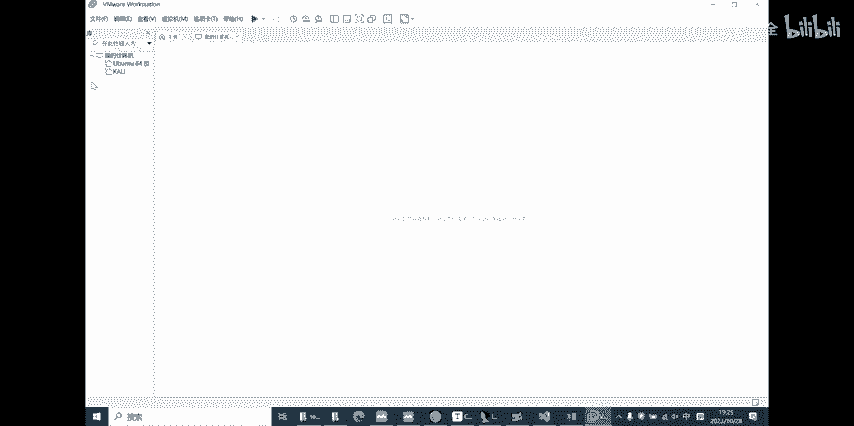

这个文件呢我已经拷到我的虚拟机里面了。可打开虚拟机看一下他究竟是要干什么事情。

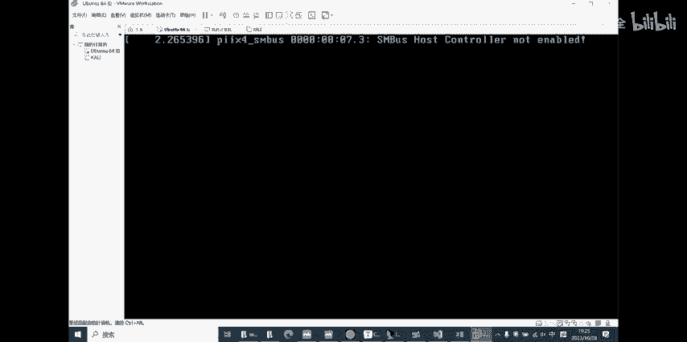

不然的话，我上来直接对一个程序直接就开始逆向分析它，有点太硬核。我还是高低要让看着他思路，让他看一下究竟想让我干什么。

不然的话，我拿到这个直接逆项确实会有点吃惊。啊，我们自里直接打开linux终端linux系统的一些基础的操作指令的话。

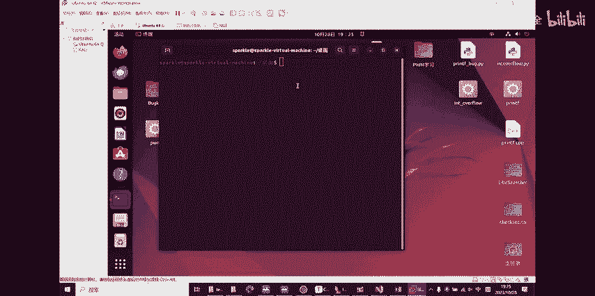

你们自己不会的，就去百度直接查就行。因为我也不可能说linux那么多条操作指令，我全部都能记住。这个程序的名字叫做应酬不知要我们直接给他打开就好。定制 over主要。啊，他又给我们提示了这么几串代码。

然后告诉我们，首先说欢迎你来到这个。什么2023啊，还问你知不知道这个东西。然后问你可不可以把一个整形数据让它变成一个负的特定值，但是呢中间又没有负号参与在你输入这个N的值的时候。哎，你这么一想。

就突然觉得哎忽然开了，他就起码让你知道是让你干些什么事情，对吧？我上来就直接拿着1个IDA的反馈编再给你干说。你看个鬼东西，你想看吗？看不下去的对吧？在你没有学过这些东西的时候，你根本看不下去。

我们就直接先从这个腾讯本身想要我们干的事情开始入手。不输入符号，那N等于负的14514怎么做14。嗯，这道题呢。其实还是需要你们学过一些计算机的基础知识计算机的整型数据在。

好多系统里面存储的形式都是以补码存储是吧？32位的整形，它要出现负数的话，它的最高位4B为一。这个你们有没有学过这些原码反码不码，对于有符号的数字。它计算里面存储，如果它是一个负数，它最高位必定为一。

但是呢。点燃如果你直接在这里输入一个负数的话，上面是吧他肯定是不会让你通过的，人家，我们肯定是不能输入户数。他中间肯定做了一些检查，对吧？这个检查的话，我也可以跟你们说清楚。

但是的话就是怕你们一下接受不太了，我就先直接从这个整体一出这个概念开始跟你们讲清。你一个整形的数据。他只有32位来存取一个int类型是吧？你们老师肯定跟你说过ink类型是什么？能存32位的一个数据是吧？

另。存1个32位的数据。那我要得到一个负的14514我要是直接的输入负的114514，他肯定是不让你通过的啊，这个很显然非常非常的简单。得所以我要通过输入一个怎样的正数，可以让它变成负的14514。

或者说要从底层的角度去思考，等一下让它在内存中存储的真正数值是负的1451是所对应的二进制的值，这个很重要。计算机当中啊，它对于一个超过它这个自长的数据，它会直接采取截段策略。你要截断策略呢？

比方说一个int类型，它有33位好了如果我把这33位数据放到一个int类型当中。那么它的最高位会被。目前的它的最高位面手机只会保留它第32位保留它的第32位，这32位就是我们应该利用起来跟操作的空间。

word的一是51字，我们可以看一下他在32位的in类型当中，它的你藏的二进制的那个编码应该是怎么样？

6个那你就加这个是一个windows自带计算机我直接就开始给你们讲一至51是我自己选的Dword一个word是两个一个word是两个字节，word是 doubleou word，就是四个字节的意思。

四个字节呢一个字节是8位，四个字节4乘8就32位对吧？没有说错，我们直接下。哎，等一下啊，我。😊，对后第一负责要9。那咱们咱们四个做做的那个全部的就这个一句话需要。啊，我们先确成64位啊。

因为他这是一个64位的程序，我刚刚忽略了这一点负145你们看到了吗？负145是64位里面出来是这么一个样，看一下这个之前我应该有做过一些，然后里面有几个小段。32位下的一是5一是对应的二进制。

就这么一行段玩。嗯，这个的话就是看到了吧？16514。嗯。别个。打开点知啦马上车啊。你我先，模板里面用那么他的金制底层代码长这样，我们是不是就不用开始从什么输入这些乱七八糟的地方。

不要从这种基础的思维开始入手这道题，那你根本就做不出来。我们应该想的是什么样的生，让我们把。可以让这个杜值的底层二进制代。变为。这么一个认为这么一个二进制的数据，对吧？我们应该从这里开始考虑。

如果你们想到这点，你的思路就差不多要对了。怎么样的输入可以让它变成这个。显然他这里让我们输入的肯定是会会是一个数字，对吧？mN等于没有符号。输入一个怎样的证书，可以让它变成这样的？好。

同样们我们开始从底层开始考虑，要有合不的这么多段东西的话，这个是32位的他。不得14514。层咯。你想这样说完了，我想那我们要评入一个怎样的在64位系统下的一个这样的一个数据，可以让它底层二进制。

同样是这么多。那你是胃口。最讲一下，一下如果可能有些人很单纯的想啊截断嘛，那我只要前面前面随便说，只要他能能够达到这个64位，那不是就OK了吗？我去想那么多干嘛我前面全部补零啊，全部补零啊。

我也补32个我32个直接往下往往里面一输，哎，可以那个那个。嗯，看一下。我们没出报材料啊，不好意思，这里没有把他这个字长给他改。看。我们如果直接输入表面全部补零的情况下，我们得到了数据。

是一个整形的一个十进制的数据，是这么一串数字。那你觉得我们直接输入这么一串数字的话。他能得到我们想要的东西吗？你先思考一下。32位下的有不号。30为下有房数字。最高位表示符号。依为。不。你又为。

刚刚没有上面问题的问话不多不对。哦，是的。一是负号，零是正号。本来二的32次方。同意。可以表示的十进制数据。断一下。我现在懒能放机会这样子。啊，我一说话就有，因为我之前说过。二的32次方是这么一串数字。

但是我们知道啊，因为它最高位把它拿去做成了正负号的一个判断位，所以呢它实际上可以代表的数字范围是从负的到一个正的值，肯定是不足32位的，它只有后面的31位是可以自由变动的。而前面的最高位呢，要么是零。

那么是一。零的情况下是正数一的情况下是负数，所以它毫无疑问，它的范围。它能表示的正数的最大的范围也就到二的31次方。就是这么大的一串数据，我刚刚得到了这串整形，毫无疑问，它是溢出了，但它溢出了。

它真的可以让它底层的二进制变成我们想要达到的-14514嗯。他达不到结论，直接告诉你，达不到，你不信的话，我们可以试一下。看一下那份数字是多少。没错。都位看呼叫。你把它输进来。嗯，好像也可以哦。

直接这样输入也是可以。那我之前也想多了，那看来直接截断也是可以。我之前想的是，如果你在前面全部补零的情况下，直接去这么输入的话，那可能会出一些问题O。这个。你在全面直接补零的情况下呢。

它可能识别出来的概念之类。有他前面会分部的直接给你截断他。可能底层二进制代码就不是现在这么一数。我一开始想着是要在前面补上至少一个一这样的话它前面的数据就一定不会被忽略。

系统就会把它当成1个64位的数据来看到。如果你前面全都是人的话。这系统会直接的。把将爱一翻。Yeah。数队当成。1个32位置。那的硬存进行解析对吧？

如果他直接把它当成1个302位的inter进行点析的话，即使你输入的数字它的。底层真的是这么多东西。但是他把它解释到里面的时候，他肯定会由于溢图啊，最高位就会产生不一样的事情。

他最后得出来的抵条进制代码，又不是这么一串。如果我前面补一的话，那他绝对会把这串数字当成1个64位的数字来看。在这样的情况下，我输入它的话，它的底层的32位一定就是我们想要的结果。

它的底层一定会被修改成这么创新之类，我们就得到了它的bl。这个就是一个整齐一橱。嗯，就是一串那吗。简单那个是吧？那很简单。只要浅浅的了解一下计算机的源码反码不码，以及了解底层的二定制存储，你就可以做到。

一个底层的让它溢出的这么一个状态。你只要他在对你输入不做检测的情况下。如果他把这个ink的数值作为一个判断条件，你是不是可以随心所欲的去修改，想让他等于什么，他就等于什么。比方说我写了个程序。

我写他说10块钱10块钱，我可以买一瓶水。啊，然后呢，你每买一次，我就给你减个10块钱。他在。他问你要买多少个，对吧？你输入的时候，你输入一个很大的数字，它跟那个10块钱一层啊。

对它底层二进制代码一旦产生溢出。溢出以后，你通过对它底层二进制位数的控制，你是不是就可以达到说啊，我想控制知到它有多少钱，它就有多少钱。那你这个统一是不是就相当于直接就完工了？

是吧就是一个非常简单的一个整形溢出的这么一个例子。哦。系个创业计划书。本来呢还是想给你们讲一下。为什么这段程序可以。实现这么一个欢。判断你是不是有整形溢出的这么一个功能。

所这个就需要实打实的一个逆向分析。嗯，逆向分析的话。嗯，可能有点浓。但是我也做了，但是我怕就是可能我讲了，有人听不懂。这完有我就开始讲先吧，我就先讲吧。哦，我打觉到10点改00。好，一个。

首先这个是先看到妹函数里面，妹函数里面好，还是刚刚那程序还是in投flow，就是这个程序它是怎么样实现一个对你的输入做一个检测，有没有复数。

以及它最后底层到底是通过一个怎样的汇编反出来给你看到让你实现出来。得到一个整形一图的结果。看来他还不看笨蛋都知道进来先点一个面子哦，没函数，看下他主函数里面干了些什么事情啊。

我刚讲过了这些push跟Mpush跟 moveve，还有扣ll扣ll到这函数里面以后，我们一看。哎，他这是干了什么事情？就是么IDA里面还有一个功能叫F5，你可F5直接看到他的细语言的吗。😊，伪代码啊。

但是这个东西呢。我推荐啊我推荐如果你是真的诚心想学逆向分析的话。好去用这个F，就只打图自己看，你看的多了，你就会觉得。可能F5对于你初次上手一个程序的话，它是有用。但是你看多了以后。

这F5它会有各种各样的问题。你因为如果什么东西，什么程序拿到以后，你反会编一个F，我就把那源码全部看到了。那我这程序以后也没有解的必要。那我以后看到谁有程序好，我直接把它一丢进来。

我按个F你的源码全部给我。那我还用写程去吗？我以后再也不用写。所以呢我们还是直接从底层的反会边去看他这个内函数里面再扣了它，然后究竟做什么事情。首先看这个init啊，这个英利函数，我们怎么进来的。

那面函数里面，他到执听到这一步的时候进来了，我们直接双击这里就可以点进把你他做什么事情呢？这个是STD in就是标准的输入流，对吧？对它进行一个初始化。这个函数究竟干了什么事情，至于百度查，谁都有百度。

谁都知道怎么用。然后呢，剩下这个是输出流，然后这个是哎这个什么流，反正也是对他一个进行初始化操作。反正这个这个函数就是一个对整个程序的输入输出流进行一个初始化的一个操作一个事情。然后再看到后面的这个。

VULN函数好。这个这个地方就熟悉了吧，是吧？我们刚刚。在lininux系统下运行的这个程序的时候，就可以看到。嗯，就说这么简行话，然后就开始让你。他让你输入。我要不给他，然后呢。

这个函数当中呢差不多嗯。他做了什么事情，你看哈，首先前面的你们先都不用管，前面的是他一个函数在在系统调一个函数的时候，他必须要做的一些操作。这个的话以后有机会再讲，我觉得现在讲很难讲，而且也不影响得完。

然后呢。这里的话就是看到1个LEA指令，就是直接把这一串地址的代码直接给他，直接把它直给付给RDI这个地存器，然后直接扣到putS。这个RDI这个寄存器是干什么的呢？在64位下。

RDI寄存器是一个传递参数的一个很重要的寄存器。任何参数都需要通过这个函数的第一个参数，一般是一般是用RDI这个计存器来进行传递。我这一串的意思就是这一个LEA加上co组合起来的意思就是说。

我先把这一串字符串，它的值给了RDI，也就是这个铺S函数需要用到的参数。我把参数传给他以后，他就会直接调用这个put S，就会把这一串内容给显示在我们的屏幕上控制台上啊，就这么简单啊。

剩下这几个都是put S就非常简单，没常好讲。然后到这个LEA指令的话。LEA指令，然后他再扣了最后一个poS让我们输入。还有朱恩。嗯。这一个部分嘛，他就是通过。寻址寻址去找到你N锁存储带的那个位置。

修改它的值。这个地方呢它显然是作为一个参数传递给了我们下面要去扣到这个地方。你这个具体是怎么传的呢？也可以跟你们讲一下，因为他IDA里面已经直接给你把这些注册标很清楚。你就出点的看看。RBP加N。

其实你可以先忽略这个RBPBP的话，它就是一个寻址用的一个工具而已。它就是占底只能加上N的偏移。N的偏移你找到了以后，直接把它里面的内容复制给了IX。把IX也就是这个值。

就是你N的值作为一个初始的东西传给RDI计存器。RDI计存器作为函数传递参数的第一个重要的计存器。那就会在接下来get input里面。调用这个我们环建来参数，也就是嗯。好。我们看geting铺里面。

干了什么事情？ge input里面嘛，你看这时候我们的N显然是已经作为它一个参数传递进进来了，是吧？你看ID多牛逼，我操直接都把这个反编译出来的这个C语言。什么类型的什么样的调用方式。

函数名字什么参数是什么呢？我那给你传进。是一个一指新类型是吧？一个指的类型，直接把N重进。传进来以后看。一个锐的函数啊。read的函数是干什么的？就是读取你的输入是吧？以字母串的形式。这个的话不懂就查。

没什么好说的。然后呢。接下来就是看到这个。加S。给了IX寄存器。你看这个。IDA pro里面也对这些要进行函数穿。要进行参数传递的这些值啊，他在旁边都会有注字来告诉你，这个是要我这个是我要传递的参数。

你就不用呃很辛苦的去找他了，到底哪个寄存器啊，又被负责，哪个寄存器啊，在扣之前又被压榨啊，还有又被负值了，乱七八糟的事情。你找到他了以后。是吧RSI跟ESI跟RD啊，里面现在都已经存好了。

你下面这个函数调用。要找的所有的参数，你参数传完了，是不是该用函数了？你穿仓库以后。嗯，就直接通过这个函，直接通过这个函数以后呢。

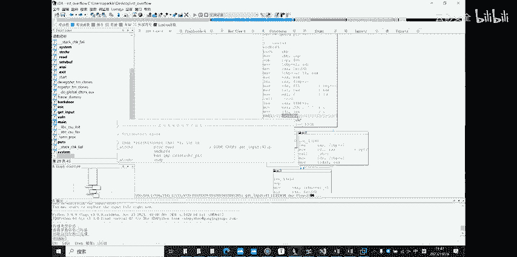

这函数开始做什么？我就从这里开始给你们进行一次彻底的逆向分析。从这里开始，逆向分析的话。应该就会。因为这里才是他真正的核心内容是吧？他前面输入那几句是什么？都是提示你用的，其实都是废话，你根本就不用看。

你真正要看的是他从输入开始，他干的一些事情，以及对你输入有没有输入符号这个事情进行检测。

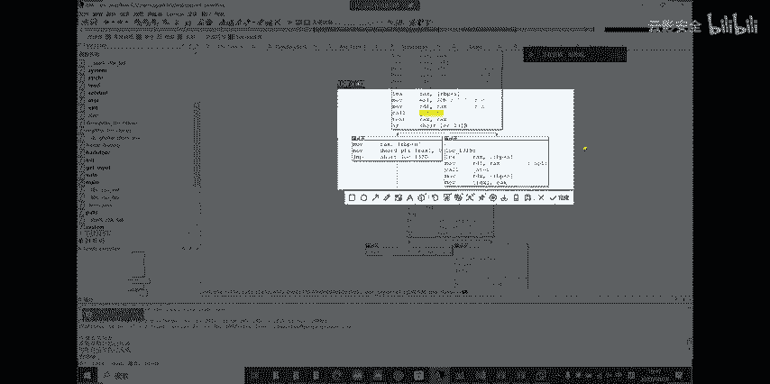

他这中间里面他究竟完成了一个怎样的步骤？这里我都已经把这些图啊，还有都是给他标出，直接看就好啊，我们先从顶上开始讲起来。首先要提到一点是EAXIX计存器。通常存入的都是函数的一个返回值。

对你函数一般执行完以后，如果他要返回结果，他都会把它结果放在IX和EX计存器里面。一般啊一般。好，千金T2星7我们是自己的，我们目不到这个过STR指令的话。还是给你们看STR指定究竟干什么事情。

的话直接叫什么STRRCH。我是道我希。这个就是SPRCHR这个函数他干的事情。你嗯，都是英文读不懂啊，应该也不至于吧，你就直接。别开独tare value吧，参数我们已经传了啊。

这里也有说明每个参数具体是干什么，我这里就简单的给你们讲一下吧。A这个 each of these function return point to the first of seeing string or now if C is not found。

就是说如果一个指针找到了C第一个出现的位置，那么他会以差新的指针方式去返回这个返回值。你拿到这个差芯就可以找到这个C第一次出现的这个地方，也就它的position，它的位置，对吗？

如果这个C压根就没有在这里面被找到的话，会返回一个那那是什么？那是一个没在学指针的时候，应该学过这个钠钠是空指针。那那函数红里面的定义，它就是一个零。你如果找到它是一个零的话。那好，我们接下来接着分析。

如果那个函数的内容我们已经分析明白他要干的什么事情，我也觉得不太好。他干的事情是什么呢？这人太好，重经做了一小件这个数据找不。嗯然后找微博投影。然后我就是您图片的候。

所以说我觉得啊我觉得还是在这东西里还是他们。刚概的内容就是。哦，在某录的字服串流当中。啊，什么是字符畅流啊，就是他read以后，你要输的那些东西嘛，read以后直用对吧？你要说那个。

所西都乱七八糟东西啊，这个就叫字符串语。对吧他这个函数执行的功能就是检测你输的字符串流里面。有没有？有没有什么？有没有。😔，符号。我是怎么知道这个信息的呢？😡，看嘛，接着看他反汇别吗。第一是吧。

对应一下，找一下，刚那个哎把它关了。开出。我那个就是你看见没有？它要传他要传递的两个参数，第一个sre就是你的输入流。第二个CD就是你传递上来的这个，它这里可能函数定义之中，它有一些。

差别他应该是阿克嘛来解析。不然的话，他直接让你输一个整形的话，你应该是打不到。我们就是把它这个负号的1个20克码的一个数值作为一个函数参数传递给他，看见没有？它这里都直接把它20克码标出来。

就是一个负号啊。那他这个还是要做事情写个意见，就是检测输物流当中有没有负号，就这么简单，如果你有负号的话。他会怎么办？有符号的话，它会把你存储N这个单元的这个地址。把他的地址里面指向的值给了IX。然后。

把IX这个地址的值。里面写入一个零的数据。那就是说不管你说什么呃，如果里面有符号，他默认，就直直接给你转成0了，怎么都不管，非常的暴力。那你根本就不可能达到想要控制这个整型溢除的效果。然后另一边的话。

他是怎么实现对这个炒作的呢？我也讲一下了。首先它有一个它在扣ll完这函数有后个tax指令texax。test的指令t的指令呢就是对两个操作数进行一个逻辑与。罗金语就是安慰语，安慰。第一期。嗯错。

单位就写余算，余算是什么？两个都是一，就是一。一个理一个一。也是0两个零也是0。简单来说就是两个一的时候，他才唯一。那我这段地方执行了两个taxIXIX这个是什么意思？是吧？SDRRCHR我刚刚讲过了。

如果他里面没有找到这个符号的话，它是不是会有一个返回值啊，返回的是不是一个那。他返回了一个钠的话，钠这个东西它其实在函数的红D里面，它就是一个零。阿零。两个0进形逻距。毫无疑问，结果是零是吧？啊。

看我对t的解析。des的函数呢，它是通过两个操作数进行逻辑运算，它的结果呢不会直接改变它操作数，而是会间接的控制一个要ZFV的一个东西。ZFV在一个标志位计存期啊。标志未定程器就是记录你这个腾序啊。

你这整个计算机操作各种各样的数据，然后它中间的状态的改变。如果两个pa。执行完以后，雨的结果是零的话。他的ZEF寄存器。就会被标为一。标为一的话。他就会直接跳转。跳转。嗯。看下。操作数据情逻器控制者器。

好度机是否没空ZEZ啊，还有ZZ这个指令啊，ZZ这个指令是一个跳转指令。Okay。根据ZF位数值决定操。这F一的话。你就跳转。姐夫。不唯一的话，那就不跳转，就那么简单。t的值就是修改ZF继存计位的。

就是test跟ZZ这两个东西一执行起来以后，哪怕就是你不逐层的去分析它底层的汇编那。你应该也有个最基本的逻辑跟直觉。可以知道他这么一串东西都是为了什么。都是为了说。找到符号。如果找到符号。是吧。去左边。

如果没有找到去右边。就是这么一个事情。当然了，这是从人类的逻辑跟。很容易的去想到是这么一个操作的流程。但你如果是纯纯的从底层开始去，一步一步跟着他返回边走的话。这个流程就会相当的周。

它中间不仅会涉及到各种寄存器之间来回复习，还会涉及到你传递出来的参数的负。还会涉及到标志标志位寄存器。啊，标志寄存器呢，它的各个各个标志位的改变。然后根据这个改变呢，他还会决定他要不要跳船。

那就非常非常的反人类啊非常反人类，毕竟就是机器嘛，那就。你根本就不知道他要跳到哪边去。所以呢这么一串东西执行完了以后啊，哎也就达到了我们这个整个函数的一个检测的流程。啊，就是这么一个样。

找到了就是左边没找到来右边右边干了什么呢？右边有一个AGI的一个函数。嗯，这个函数呢就是把一个比对应，就是把一个字不上，直己给它转变成一个。请情这边。就这么简单，这个函数干的就是一个这么事情。然后呢。

中间这个加了方库号了，一般都是要去找他地址，就找他地址里面的值作为一个数值传递给前面的值。这中间涉及到各种你们学了指针没？如果学了指针的话，应该就会知道。有什么新号啊，新来新去的。嗯，自己去想明白吧。

这个的话讲起来非常的累。我觉得而且我讲的再好也没用，你得自己把它想明白。你对以后就改变了他。把它整个数字给它把它整个你输入的字符串流，把它转变成一个int啊，这就完了。

这些已经实现了它的整一个控制输的流程，以及把它输入再转成int跟最后的负的一451是比较的这么一个过程。这么简单，这就是一个。1个CTF的一个一个非常也不能说这简单，反正就是一道入门题。这一道入门题呢。

回去仔细想一下，那其实你可能听起来啊，觉得就那么回事，哎，挺简单，尤其是你不开始往反汇编这方面去想的时候，哎，不就是改了底层嘛，让他一出一下等于一个负的数值就行。但是如果你把它作为一道逆向的题。

把它作为一道胖的题来讲的话，你从底层开始逐步逐步的去分析它为了完成哪个环节，它中间用哪些汇编代码改变哪些寄存器，控制了哪些地址。你一步一步这么去讲，那你久而久之呢，你就可以对吧？不敢说你逆向非常牛逼。

但就是随便给你一个我们这些年级的人写的一些简单的程序是吧？你都他直接跟甩你1个EX1，你都不用看啊，写的什么，你把那往反变页工具里面一拖，你照的反变页工具，你都给他给他妈直接逆向出来了，是吧？

他有什么好去看他。啊，就是这么一道。这些一出问题。嗯。都不算简单，但是也。你这也就是入门级别啊。也说不上很难吧，但是中间的各种各样的思考流程，还有过程，要你仔细去斟酌仔细去想。嗯。嗯，我看一下。哎。

好像这在很早很。然后的话。😔，看衫。人好像也不是特别多，我也懂，可能周六比较忙嘛，大一不去玩就。你们就。好吧，这个视频我也是全常录播。哪里有不懂的话就。看视频跟着学一遍。

可能中间讲的有一些不清不楚的地方。因为时代是很难展开的，这里面要学的东西挺多的。我不可能说就给你一个小时，你全会啊。那是不可能。你自己下去要去学校去懂。是。包过底层的这个什么汇编啊。在啊。

他在布局目以后啊，还有基本的一个函数调用前啊，它的。会别人会做哪些事情。呃，底层会做哪些事情，他账会做哪些调整？啊，这些都是你要自己去搞明白的东西。然后。嗯。下面还可以跟你们说些什么。嗯。啊，我想起来。

再讲一道题吧，再讲一道也是一道CTF一个比较简单的西电的一个新生赛。我给你们看一下他这里面到底干了些什么事情。呢个涉及到。😔，也是可涉及到我说希望你能利用一些。仓库啊这些python的包。

还有一些python的工具去编写脚本。拿去帮你完成一些。人很难操作完的事情，对吧？

比如说他时间没有到期，看。叫做c。cocu了的话，他好像是直接把那个程序，他程序没有发给我，他程序是直接写在他的服务器上面的一个进程里面。我是去远程连他的进程，然后就对他进行操作。

那我先大概给你讲一下他干了一些什么事情。那，这道题呢就是呃非常简单。给你一个小学生都会算加减法，但他让你达到100道。就是说他这个计算器里面啊。啊，写了一个计算记，但他不知道这个结果对不对，啊。

需要你给他做一个判断，他就是需要你连续判断对100道啊，他才算你这道题通过。然后呢，他就是每一个。他会给你一个算式，然后再并且把它结果给你，你判断这个算式和它的结果对不对？如果对的话。

你就输出一个啊度啊，如果不对的话，输出一个for样这边会去。哦，他当时让我们说。如果输是正确的话，你就输入这么一串东西。如果不正确输入这么一串东西。那你如果说你用笨人方法，你完全不去往脚本这方面想的话。

你自己去。至于去连他的服务器硬写100道啊，也可以。你应写100道小学加减法。道题也能出来。但如果你不想那么做的话，你就要利用S的一些加温工具。这个就是我跟你们讲的这个叫。Pun兔。当周子公民失业嘛。

当初子。就是刚才针对胖这个分支进行了一个开发了一个分支的库。啊基本上就等门干这事情。然后呢，这里啊第一步我给你们逐层分析这个甲本干里去。第一步就是。呃，远程连接。远程连接到他的服务器端口。

手机断下一批最他端口啊。如果连上的话，那那就连上嗯。然后呢，剩下这些都哎都拍什么什么脚本，一些都拍一些基础语法，A等于0。那这个我就不用说，我说一下这个receive until是什么意思。

连接上了以后。去接受他的。嗯。你系存就就是直到我接收到这个字符串为止。这道题呢他那里出来的时候，他会还是按照往常惯例会给你讲那么一些废话。You。嗯。😊。

设置一个receive to意思就是说直到输入得到有这么一串输入为止啊，开始去干后面的事情。后面这个这些干什么呢？YOA小于100啊，就加加嘛一个循环，让它执行100次，对吧？然后呢。

我们就在它的输入字，它输入它会有一些提示啊。比方说他输第一个数字的时候，他会告诉你的 firstrs，然后输第一个数字的时候，他会告诉你的 secondcon。嗯，然后我们就。

开始在出现这个de first以后呢，reive one two嘛输入到这个为止。我们接收到这个字符创为止以后，要做什么事情？然后就是receive。啊，接着接收接收什么呢？接收他的。到第个流。

看天治疗。你能接收到的网络传输的东西都可以叫二进制里。你把二进制流给接到以后，用python自带的这个什么in函数。直实就可以把他这个。二进制流啊，这个字符串啊，这些什么东西都给它转成interly。

反正inter了以后。然后把它这个值付给B是吧？然后再写一个啊，待 second以后，我再接收一个是把它个支付成C。然后呢，他给你个算式嘛，他肯定会告诉你A加B等于C嘛。我在接收等于以后呢。

然我把它结果一接收，结果等于D是吧？然后来个小小的判断B加C，如果等于D的话，那就输出他让我输出东西。如果不等于的话，就输出另外一个啊，就这么简单。就是这么一个小小的游戏而。然后。下面这些构成的话。

配漏。呃，被认的。也定是一个编号名字，但是呢。他代表的含义是。在喝。对吧代表一串二金制理认。就是我们要给一个服务器发送了一项我们定进精行编制过挑选过的一个巨额。具有一定意义的待啊。

他可能是通过你的各种计算啊，都是通过你对这个函数的逆向分析啊得出来，它应该输入一个怎样的输入，可以让它出现一些。意想不到的事情。包括战役出。但不限于上一嘱。然后呢，你把这个配roll的给编制好了以后。

它这里有一个。rese linese line什么？就是。都一行嘛，很简单，你次不赖都一行啊，顾名思义。然后我就把这行配制出来，然后来一个交互，那就完毕了。就可以得到我们想要的一个flash。

你这么觉得？这个呢我主要想给你们说的就是。一个基础的办一省的这个半的脚本应该怎么去写？当然这最人单你有比这个男的多的多的多。呃啊这个from point行就引入一个库，那我就这讲。嗯。原方。

等这些都完毕了以后，你就可以在终端。啊怎么运用摇准呢？阿里你只终端点com嘛点干，然后coQ。

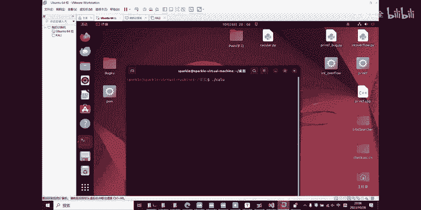

WQ点UI啊，这样就可以直接执行。啊，这里这里肯定会报错的，为什么？因为我服务器根本就关了嘛，我现在又没有连他服务器它肯定报错，那都根本都连不上。更何况只你后面的操作。😊，这是一个。基础的一个拍摄脚本。

对于你做重类些的题。啊，所以就这样。嗯。嗯。Oh yeah。那什样。停了，剩下的时间。Oh。还是让你们还是讲一讲，不讲的话，你们真的不知道。我刚刚在咳的都是什么哭瓜嗯。嗯，一个会议编要进一个函数之前。

要干什么事情啊，这个我觉得还是要讲。不讲话，你们真傻逼，我们什么都机会。不去啊BP，我一步一步来啊，你们也就。想听的听，不想听的，我就看录像，再不想看了那就算了。嗯嗯。等一下啊。

你在这个文件夹里面的移出嗯。嗯，愿意同。有点乱，等不知到开怎会讲起。首先呢我从过开始讲。课我讲过的是。呃，直接去调用一个函数是吧？我当初这么说的，其实他这扣后面跟的是一串操作数。啊，也可以是计准。

也可以是计准区，应该也可以，反正你就是扣到这个东西所指向的一个。就指样的一个地方，把他的这个EIP就程去。EIP继存器指向你扣后面的这串操作处理。嗯，你那个我扣一个低层投数好。如果我扣一个自次打住的话。

他会干什么呢？扣好多了，还有一个引擎，我忘忘记给你们。但每次电话扣完数的时，它会有一个不许操作。不学操作会把你调用扣的下一行指令。比如说下一行是一个木。EEX到EX我就那写这么一串那。嗯，你要自己时咩。

你看我过了以后。扣了以后首先呢我会先布去。不许什么不许这一行东西。怎么的。把这一行指令的地址不去。不许的是这一行指定的地址啊，他这里有个just。把这一行词列的地址给破取到弹中。不是cus。嗯。

你的账一开始就是。啊，第一个库取进来是不是一个。有一套的卷子就是被告的卷子吧。ad就就是我们第一个p取定的东西。表示就是这样。这个就是这。那第一个进来以后呢，来的是我们的一个就是。那卷识完了以后呢。

看一下他下一步是干什么。然后呢，他凡是扣了之后。凡是扣了以后。他都会有。嗯一个。不许RBP的操作。我刚刚说过什么？EVP。你。当离职证不道。USP。办比。这两个指针啊，刚刚对是64位下。64位的话。

他一就变成R了，跟叉86有点区别。啊比如说原来APP的基本技能分32位，那APP。就给64位呗，就这样吗。然后呢。他一开始就直接布署了一个ad。这时候ESP应该是指向这里，它就指向就没什么好说的。

很简单。你要接死以后呢，他接着会干什么？接下来会执行这外一项操作。我们这个。天猫个。然后他会不许。打开 b g。不选RBP什么意思呢？RP的是放过来呗。然后也EBPI怎么样？加上来嘛，到第二格去了。

对不对？很简单。然后他还布署了1个IDI。一般来讲可能很。一般来讲是很少会有一个不许。DI的过程。で。会常屌下好啊点下上系。然后。上。SP不好意思，这应该下题，没有什么的思位。SP上啊，忘记跟你们说了。

这是一个。从上到下是一个整进来的过程。嗯。sRSP减018啊，018是1个16进制，一看就知道。就是把原本它上巴指向的是这个地方。HP，但是现在减了以后，他知道。往上面指去。

因为因为我说了它是D端的过程嘛，它上面肯定就是数字线。USP的直直接被剪。结被起了，它意味它站顶直接就往上走，懂吗？这就是一个你函数直顶之前，他一定会做的一个事情。提升对战没有占空间。

你这还做什么事情你都干不成。你有赞了以后，不管是参数团递，还是你副值举不变亮。人。医院他都可以对他都可以。看你录行。不然的话，你压根就没有空间给他使用，你没有空间给这函数使用，那这函那肯定啥也干不了。

对吧？这就是一个。提升对账的过程就这么简单。至于这个布局BP跟DI是什么意思呢？一般来讲它的作用啊。保存。我就在调用之前。一。继存性的时。因为你这个程序不可能说是我执行的这一小个片段。

我就直接直接退出了吧，那不可能你程序要干事情很多很多。我在执行一个函数之前，我的计存器是这个状态。你执行这个函数的时候，你肯定要通过对计存器的修改，或者是各种各样的操作来达成你这函数的目的。

那你把我技容器一修改，我的函数执行完以后，我返回到主函数里面来。那我之前的东西全没了，那我接下来怎么办？那我肯定啥也干不了是吧？那搞不好，你程序就直接崩了。

所以呢你这个push把它传递到堆带里面来了以后，那实际上中就是来保存它在调用这个函数之前，它原本的值这种。你最后再执行完所有的函数操作之后呢。你不学择必有空。你布局这些值呢。

你只能通过Pop来把它原本的值给放回它计存器，这样的话就可以保证你整个程序的执形流不会出大毛病。不然的话，你这个这个函数改一下，那个函数改一下，回到主程序来。哎，好家伙，我之前存的啊回值。

我之前存的循环次数的ECXI，还正各种各样进水器啊，都被你改的乱七八糟了。我本来看到结果是一，我要跳整，我现在看到是十，你说我要不要跳？定是没说直接就崩了，整个就不知道怎么走。对吧。嗯。

这就是函数执行之前。对咱做事情。就这么简单也不简单也不简单，我只是说也不简单。😡，你就是回去好好研究研究吧，就是从这个魅函数里面啊。DSD呸，不是CSD是BS。VS studio里面你随便编一些程序。

然后下个乱点。下个断点了之后呢，怎么下断点，就点一下旁边这里有行，点一下就下个断点，然后点一个调试，那点调试了以后呢，你右键右键就可以转它反馈边，你直接去看它的反馈片。

你就可以看出来每一个函数执行之前提升怎么提升对栈，怎么返回怎么初始化。哎，这些所有内容你都可以自己去研究，自己去看啊。😊，啊，网上呢你要想学习下内容，也有各种各样的实验，自己动手去做，自己动手去了解。

你不自己去分析，我给你一套会员代码，你永远都是看的是一坨天书啊。我给你一个目啊，然后到EX里面，那傻子都会做，不就把EX变成2吗？😊。

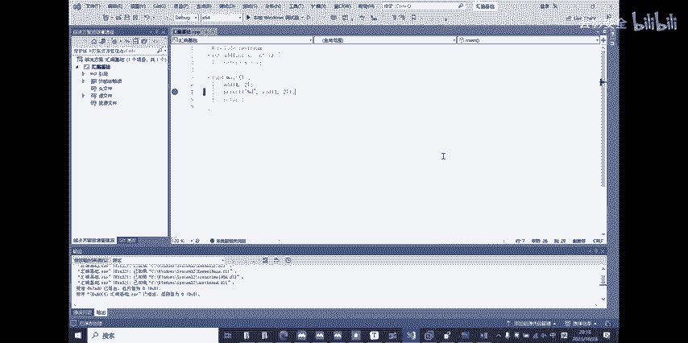

但是我给你一串的，我给你一半木补，然后再搭配各种计存器，我一会乘一会加一会减EBPSSP的间样。

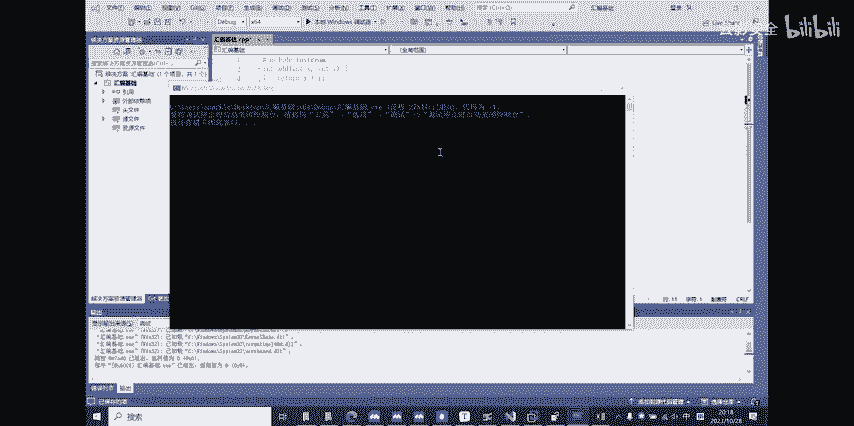

一直在变，你能知道我在干什么吗？你根本就不知道我在干什么。😡，除非你能跟着这个思路来一步一步去逆向，去逆向他到底干了什么事情，把对战中的每一个变量精确到它的每一个地址。

把它所有的流程都给他事无尽细的给它全部扒出来啊，这就是一个逆向的一个流程。你能抓到这一步的时候，你就已经。已经很牛逼了。啊。就。

对呀，然后。返回的话我也讲一下了，返回返回的话，你一般会看到一个叫做IDT的指令。IET的指定呢首先就是破。是吧，不许多必有po，你在扣之前，你是不是把你扣的下一行地址给压入了这总。那你在返回的时候。

你毫无疑问的要把这个返回的地址给他破充，破充在哪。放 e i p。EIP指向的永远是你们说要执行你这个系统要执行的地址。Okay。EIP指向的地方就是你计算起下一步要去干的事情。下一步要去干的地址。

你po出来以后，就是你原本在扣这个函数之前，你下一步要做的事情，对吧？你扣这个函数以后，你修改他EIP，他跑到站里面去干活去了。他干完活以后，你得让他出来啊，你不能说他在里面干完活，就让他死在里面。

那你这个程序他妈跑跑啥呀。😡，你直接就在堆战里面把那个。把他要执行的流程往堆站里面一放，哎呀，放完了，我什么也不干了，那边还是后面的事情要不要做？那你return首先要干这件事情。

肯定是把我第一次压进去的地址的值给他重新复回EIP，让EIP重新的回到正轨上来，对吧？重新回到回到密函数当中。你如果你不回去的话，你这程序能跑到这里就到此为止over了，直接就他妈报错了。

你下一步你这个EIP都话指于什么什么鸟地方啊，有一些非法地址，你往那一指，整个程序直接就崩了，根本都不用讲那步。比证完了以后啊，还有一个原则啊，就是其实原则我之前也说过。就是你要。提取一个函数之前是吧？

你寄存器的值要保存起来，为什么？因为这是你一整一个程序都要一直在用的计存器。你不能说你这个函数用完以后把它改了就改了，我就不把它改回来。那你后面的函数还要用这个计存器。你一把它一改。

你后面的函数执行才知就会出毛病，这不会出复。所以你要在函数执行完以后，把它的所有计算器的值给复原。那么对于站来讲肯定也是一样的。如果你蛋里面有一些不干净的东西。比方说我在这个档执行之前。

我指向了这MVP这个地方。嗯。嗯。你下逼逼的地方。如果我直接就你笨了。直接就一证了，就把这个值破回到EPIEIP你看。啊 e i p。等直一步哎，完事了，我啥也不管了，那行吗？那肯定不行啊。

堆战的东西都还没有全部释放了，你的堆战没有还原到调用这个函数之前的所有状态。函数掉案之前的站的状态是非常非常重要的。如果你用完这个站，你不把它恢复原样，那显然你下一个进来的时候。

看到的还是你上一个函数糟蹋的一团乱的账，那你能干活吗？你干不了活。你这所有的站都被你上一个函数调的那些不用的垃圾数据堆版。你这个站哪里能用得了，根本就是一堆垃圾嘛。对于这个孩数来讲。

那就是一堆垃圾重山那里。所以你肯定要进行一个平衡对战的操作。我在这一看以后，我不仅要把EIP。指向我本来函数里面要执行的那个地址，我还要怎么样，还要把暂顶暂顶指暂顶指针给它恢复，暂顶指针。

我要恢复到这个函数执行之前的位置，嗯有能力。如果你把这两步都做完，那好恭喜你整一个。汇编对于汇编来讲，底层的一个函数的标机制，你已经了解完了，就是那个流程，定值前啥样，定值后退出来之后一定也是啥样。

如果中间哪一步没有处理好，随时程序就有可能崩溃。因为这个程序。他这个计头器来来回回的动种地址来来回回掉对上来来回回用，你能想象到它中间要有多少差错。你只要哪怕一点小小的思误。

可能整个程序都会出很大很大的问题。所以这些步骤都是重中之重重中之重。你把它全部搞懂，自己去跟一遍，自己去把它。想明白一遍以后。啊，你就算是可以说是入门了，已经开始入门了。然后呢，看看时间不早。嗯。

今天这节课我也有录播。那就先这样吧。

