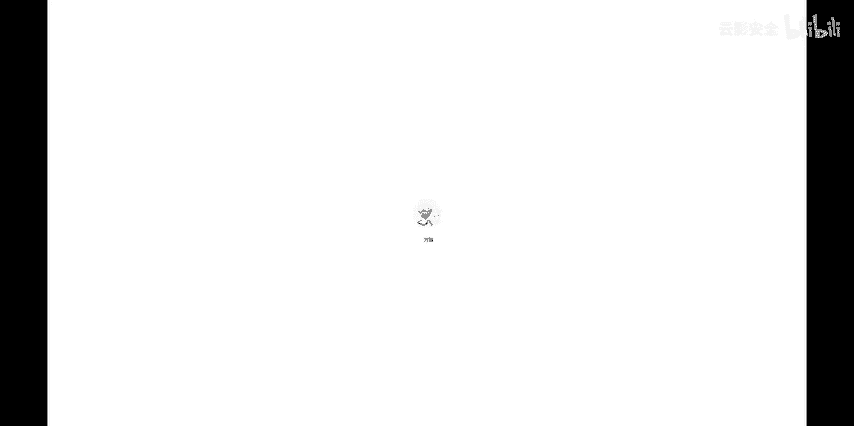
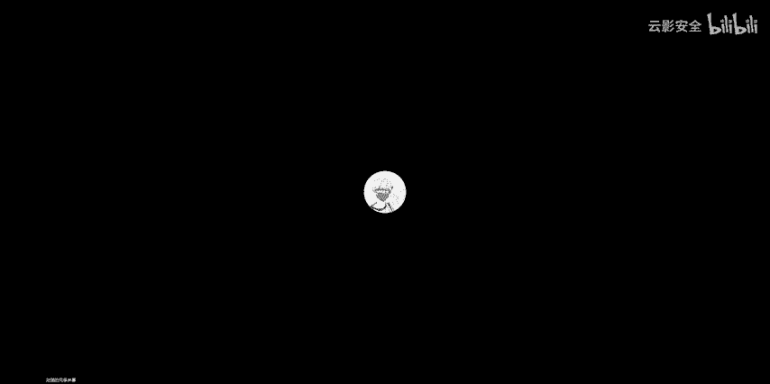
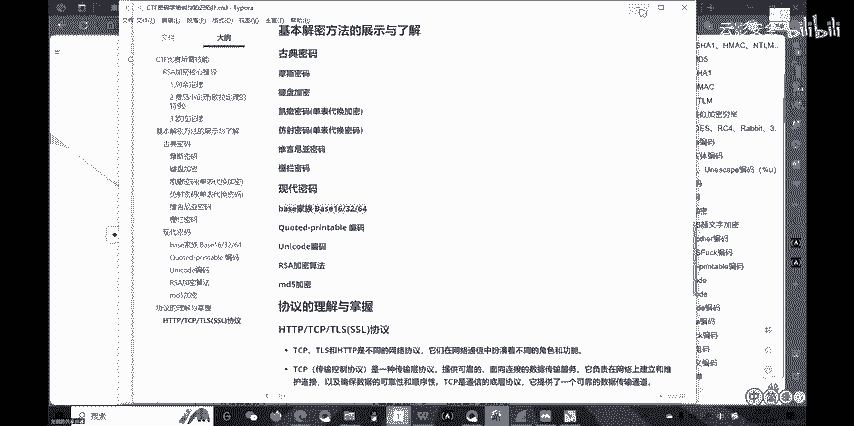
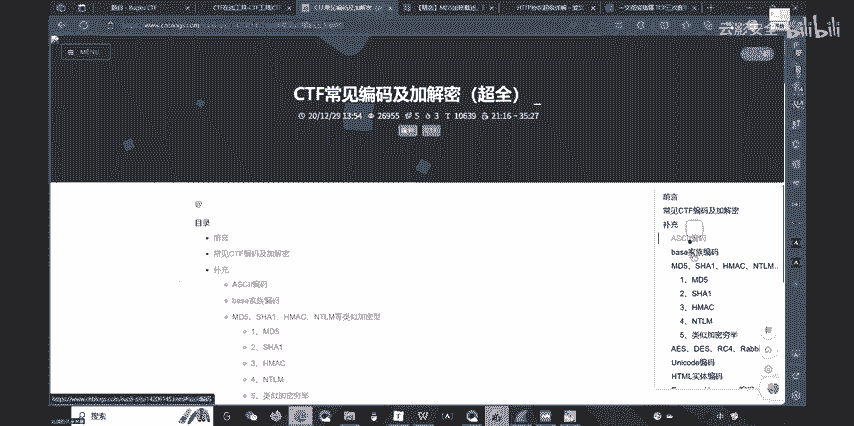

# CTF入门第二讲--密码学Crypto - P1：密码学Crypto-刘琪 - 云影安全 - BV1zQ4y1J7dG

喂大家听得到我声音吗？系唔系唔系。喂。😊，现在还有回声吗？我。应该没有了吧。O。好，那咱们就正式开始。嗯。先给大家看一下我们这次课需要讲的内容有哪些。然后重点有哪些。

然后有关于后面我们的考核会考完哪些内容，大家看这个呃MD文档里面，大概我们这次讲的大概会有这么多内容。其中呃头头部分这个RSA的加密核心推道，这个是非常重要的。😊，啊，这个我会将它的基本原理底层。

以及它就整体的证明以及实现。把这个很基础的原数学原理给他讲清楚，因为这个是很重要的。嗯，哦我的我的我的我的。😊，O， O。啊，现在看到了吧，刚才搞忘了。😊，现在应该能看到吧。O呃。

我们本次讲的内容呢是左边这个这个MD文档里面左边这个条例所形式的，基本就是我们本次所需要讲的内容，大概是三个层次。呃，首先是。最核心的最关键也就是这个RSA非对称加密的一个关于底层原理的一个具体讲解。

然后在中间给大家讲一讲经典的古典密码以及经典的现代密码，他们是有怎样的编码思维，怎样一种加密思维。这个呃这个内容很多，不要看的很多，但是每个我只给大家讲它的思维，它具体的编码有各种各样的。

因为不止这么一点古典加密里面可以有很多很多种加密。现代产品有很多种，关键是我们怎么去读懂它的加密思维。然后以及呃不可能说每一种都掌握，知道吧？我们需要读懂它的思维。然后考核的话会从这里面挑着考。😊。

我挑的是大家比较需要知道的一些重点。到时候我会说的。然后最后就是对于一个呃大家三个协议的一个了解，1个HTP协议1个TTP协，一个是TIS协议，也就是SL协议。这三个协议一个了解，大概分三个部分内容。

😊，然后首先我们来说一下什么是密码学啊，密码学嗯，从对古典的密码来了解就是什么？就是很简单一个东西。我给你一串字符串，或者给你一段信息，你把它加，你把它变成另外一个样子。哎，但是别人读不懂。

但是你通你你你把呃你你知道编码程序的，或者说你把这个密码改成把A密码A改成密码。B之后呃，把消息A改成消息B之后，别人看不懂消息B。但是你可以看懂消息B。因为你懂懂得怎么把B变成你能看懂的消息A。

这就是所谓的加密，对吧？这是它的传统概念。你看它的本质概念。😡，那么现在这种加密码学啊，需要去掌握知识很多很前沿。因为随着数学的发展，嗯，主要是在数学的数论这个东西上继续的发展，随着数学的发展。

以及随着这个呃程序的发展，它有各种各样的这种特殊的加密，以及一种嗯可能我们现在讲的加密有些过时的。但是这些比较传统的加密，是你去进入密码学，去透入密码学的一个门槛，这是很重要的。

所以说呃首先给大家讲一下这种CTF比赛是什么？它是呃上一次嗯张润哲学长给他们讲的是这个miss，对吧？它是一种混乱型的，什么叫混乱型呢？就是加密。😊，呃，PWN也就是二呃就二进制底层原理。

然后就是逆向reverse，然后还有一个web网页设计，网页，这些都的这些这些里面的基础的基础部分混在一起。它假如一些其他的杂七杂八的就给整体的称为ms。😊，那么现在我们进入板块式的进行介介绍的话。

那我们就专门进行这个密码进行一个具体了解。学习CTF它不是一个。迸发的过程，它绝对是一个厚积薄发的过程，跟许多课程一样。嗯，它是不能够疏通的，知道吧？这种东西你需要去不断的积累，不断的了解。

因为它不仅需要你对这一方面知识了解，还需要对对其他方面知识了解。对数学你也要了解。对呃计算机怎么操作怎么了解是吧什么熟悉的使用社索引擎，一系列的对于我们这种计算机思维需要有很强的了解啊。

它不仅仅说对这单方面知识了解，这是不够的。它有很多方面要有动子操作以及之类的东西。😊，首先我们就从这个呃新兴的这个简单的这个PDF给大家快速的给他整理一下这个呃密码学啊，所谓的入门。😊。

所以我们要懂的一个概念点什么加密的本质就是把一串信息变成另一串信息。然后但是我们我们做题的时候，或者说我们去理解这些东西的时候，实际应用的时候，就是我们获得的都是一些看不懂的消息。

我们怎么想办法把这种看不懂的消息变成能看懂的消息，这就是所谓的加密，也就是古时候打仗的时候，比如说抗战这模式密码吧？点点点形式，这很经典的我们大家就是说你没有接触过密码知识。

你也知道这是个模式密码这个东西，对吧？通过看一些东西能够知道这是个基本的嗯很古典密码，过点点形式代替文章，再就这种替代的方法，这叫做替代的一种密码啊，然后我们看这个你看它这里所说说要知识。

会pyon基础啊，但然大家现在不会比on这个语言，你会记术语法会掉包其实你就可以说你会吧？看on它所能解决什么呢？需要去编写脚本，目前还是不需要的吧？因为目前有很强大的工具。我们完全。😊。

你需要你去python脚本去解决这些问题的。😡，那一般是比较难的，你知道吧？那那是你入了门之后，在你学完你大约会学C语言，对吧？那么在C语言学完之后，你就有一定的认真学C语言你认真学。学完之后。

你就有一定比较基本的一个计算机逻辑啊，计算机逻辑和事语逻辑是两回事啊。我们逻辑是我们计算机的中一个很重要的东西。😊，然后这个呃计算机这个逻辑在学完C语言之后，会建立起一点点。

然后后面再学派程语或者价格语言就很快的啊，然后你很快就能上手的，这个是不重要。所以这个编程方面目前来说是不需要。大家呃可以去说如果有能力的是吧？C语言学的可以的，可以有有空闲去学其他语言。

或者去学的时候可以从派入手拍成是比较好学的。然正这个东西然后数学方面你看到没有？它如如果说你一个传统的啊，就是说专门打针的东西的，那你肯定这些东西你都要了解，不然的话。😊，以以设计这方面你就不能多手。

知道吧？😡，然后这个然后什么算法知识啊，这些东西，这都是这个东西什么？这三个东西属于什么？属于属于凡计算机比赛，凡计算机学科它都会交叉涉及的，知道吧？你不能说你都不知道，你不能说你都很精通。

这是不可能的，知道吧？你得知道它存在这个东西，然后游戏了解就够了。😡，能慢慢的去随着时间的发展，慢慢的给学习。然后可用的软件啊，这些东西说的比较专业，其实意义意义意意义上不大，先不用管这些。然后嗯。

这里面有个议题，看见没有？里面有一题看见没？就EySRRSA这个例题到时候我们再讲完RSSA这个算法原理啊，这个不是算法，这个呃加密原理之后，我们再回来看这个东西你就很很清楚了。目前来说。

就算你呃没看懂，别要关系，不要担心。他说我们把这个RSA这是我们今晚讲重点，讲完之后再看这个就不较了解。实际上他讲这么多，他这个PDF讲这么多呢。😊，其实跟美讲是一样的，知道吧？因为它什么都讲了。

你可以说密码学，你可以任何学科都可以把这套东西搬出来都没什么。因为你计算机本来本身就是数学的发展，数的另外一个应用发展而已。😊，然后我们现在看嗯RSA啊非对称加密啊，我们一个个解释什么什么叫非对称加密。

我们来一个先呃我这个税序是这样，我的税序是这样编排的，为什么不把本来应该把中间这个这个基本密码讲解也放在前面的。但是呢因为内容比较多？如果先因为大家是这个听课的这个呃。😊，知识点集中嘛。

肯定是刚开始听的很认真，逻辑上比较强，中间就比较迷糊了。然后后面的话就更迷糊了，对吧？它是一个这样的这样的一个曲线，对吧？它是一个这样的一一种曲线，对吧？所以说呃我们在中刚开始的时候去讲最重点的。

让大家能够真的把它听懂，后面部分作为了解就也就够了啊。😊，首先嗯什么叫非对称加密啊，首先解释这个名词，非对称加密啊既肯定是有对称加密，对吧？那么对称加密是什么东西呢？很简单。

比如说最简单的askask ask妙不对吧？askask个嘛，这就是一种编码啊，这就是很经典的编码。它的编码是什么呢？我们来看这里。😡，嗯。这。我们来看阿斯卡法编码，什么叫阿斯卡编码啊啊阿斯卡玛编码。

那么这就是英国的啊，就是美国的呃等一个建立一个表。这个表就是为了把计算机与与这个大家学的是语言，你知道，它就是把嗯字符以这个对应的编码进行这个对应而已。就是比如它领到17位，对吧？

它就说两个字呃一个字节就能够完全实现这个码的，这个阿斯卡瓦的编码，这就是这种编码，那么呃它跟对称有什么关系呢？😊，推称指的是好，那我就是呃我们假如说我们一个字符A，对吧？

我们知道它的这个阿0克秒秒应该是97，对吧？那现在我给你数字97，如果你熟悉阿0克每秒，你是不是知道这个97代表的数字A，对吧？那么不论每一个人，如果只要每一个人都掌握这个20分秒知识点。

或者你你手上有这个表的信息，那你是不是一定能够知道啊，不管不管你懂不懂这个事子，你只要有一个表，你是不是一定能根这个表来找到97，对的，就是小于字母A，对吧？那么这就是一种对称加密，那么意思是说。😊。

我们来看这里。假如说一个人A。对吧我在云端上或说不说云端嘛，就是我对外公开一个呃密文。😡，ask表面就小A，对吧？我想输出小A，对吧？那么我加密成97。好，另外一个人B。😊。

如果说他不知道这是阿玛编码呃编码加密，他是不是不知道97什么含义，对吧？但是如果他知道了，对吧？他前提是两者得知道这个呃加密原则，对吧？这个加密原则，如果说B不知道B当然不知道97对你是A，对吧？

但是加密原则都存在，只要人存在，就存在一个什么问题啊，存在一个泄密的问题。😡，对吧只要是有人存在，问题肯定会有泄命的问题存在。😡，对吧。通过各种方各种手段去获得这个密密码表，绝对可以获得的。

因为它是规则死的。这个密码密码稿的规则死的。我不可能说今天是呃密码表A，明天是密码表B，那么它就没有一种统一的规则，那就不方便后面的这个进一步的发展的，知道吧？所以这个表一定是固定的。😡。

那么在这个表固定之后呢。我一旦这个表泄密，那我必是不完全会把我A发加密的信息全部获取，对吧？😡，那B就会把我A加面的信息全部获取，那B就可以对答如理了是吧？那这个信息可以这样对待如流的对吧？

我B就可以把你A的信息全部获取，那这就是种对称的。😡，那同样道理，我必可以根据这个密码表来发一个命令出来，对吧？我A也可以通过这秒表来获取破密，懂意思吧？那么这就是所谓的对称加密。😡。

也就是说通一个公共的体制。😡，每一个人可以给另外一个人发消息之前把外发的消息，也就是明文啊，也就是这两个字明文。😡，明对点就是量处嘛，对吧？那意思就是说大家都能够知道能够破解的东西，对吧？

铭文就大家能够知道的东西。😡，在英语里面就是对应着呃英利字符对吧？英文字符，那么铭文大家都能知道。那我把明文发出去。😊，那么B能够获取同样B能够把自己的名文发出来来给A。那么这就是一种对称的加密。😡。

对吧那就是这样一个循环体制是吧？A能给B发A给B发之点加密，B给A之点发加密。然后这个加密，如果这个加密的信息手段被被偷取了，对吧？那么我这个偷取者就等黑客就能把A的信息破取了B的信息破解。

那你们这点信息在我的之前就是吧就像人家没有加密一样，那就是空的对吧？就是是裸，这就是所谓的对称加密。也就是说二者能够公用同一个加密体制来进行加密。那么这就是加对称加密。一旦某一个人破译的。😡。

这个加密表泄露的对吧？那么两个人之间也就不存在这种加密信息的，那么信息全部泄露了，这就是所谓的对称加密。那么所谓的非对加密什么意思呢？那么就是这样意思。😊，A和B同样道理A和B。

我A能发一个表出来给了B。😊，但是。我必获得这个消息之后。😡，制度呃A编码之后嗯，编码之后是密文嘛，对码？是97，对吧？我B然后特定的操作，哎，我可以把97还原。😊，但是如果是外来的人，外来的人。😡。

外来呢，比如C，我也能获得这个消息，对吧？我要把这个消息也能被他获取，这个97也能被他获取，但是C就无法还原。😡，无法混淆，C意无法破译。那么这就是一种非对称加密。即。😡，我把这个东西加密加密和解密。

一个加密一个解密对吧？那么加密和解密之间如果是对称的那就叫对称加密。加密和解密之间是不对称的那就不对称加密，知道吧？那么我被加密之后，我不能够解出来，我被解密之后。😡，我就不能够呃又不能够加密回来。

主要是呃当然不会后面的情，主要是我加密之后能否被解密回来。那么这就是所谓的对称与不对称的意思啊。😡，好，那了解这个我们来讲什么叫RSA非对称加密呢？😊，好，RSA所以这个名词什么意思？没什么意思啊。

这就是美国和几个国家的一个，好像就是美国吧三位这个呃数学家，然后以及好像是计算机学家，他们会联合三个人啊学他们三个姓式的首字母主载器所叫RSA加密啊，就这个名字命语这么来的。然后我们来讲一讲这个加密呃。

具体怎么加的啊，首先我们了解这个东之后，他所以我们让他非盾加密啊，非盾加密就是说。😊，就刚才我跟你说了，那就属于非定的意思。然后在这个讲之前，我们来先进行的数学铺垫。😊，首先是同于地理。啊。

这就涉及个数学性质啊，不管你在这里啊，或者说大家呃参加过ACM社团，或者参加过其他的比赛。😊，那么这些比赛怎么来出题呢？怎么来玩弄这些东西的呢？实际上就是需要数学知识啊。

一般都是数论里面的知识拿出来进行操作啊，所以说这个取同于是你需要知道的一个概念啊，不不论是不论是密码学还是打什么其他的东西，你需要知道这个概念啊，我们知道取数。😡，呃。

现在我把我在我把这个共享屏幕转到这个平板设备上面啊，我再给大家用手写要方便一点。嗯。大概现在看到是一个白板呃。😊，哎，这样也啊直直接跟他说吧。好。呃，大家直接看我这个白板就行了。首先给大家讲首先呢A。

😊，看到是个看到这个白板的这个内容吧。OKA2B，这就是取余的意思，对吧？什么叫同于呢？同于其实就是取于啊，同于就是有相同的余数，那我们就叫同于关系啊，就这个就这个很简单的意思，2就是取的意思嘛，对吧？

😡，那么首先需要给大家讲两个东西。😡，呃，若。A同于B啊，同于这么写三个等号啊，三个横线就要同于啊，这样写，后面后面写个modmod C啊，表示对C同于这个什么意思呢？这句话什么意思呢？表示就是。😊。

A。百分号C等于B分号C啊，就这个意思，表示他们对C取余的余数结果是一样的。那么就就是A数A和B关系叫同余关系，读作A和B同于对C同于啊，这个modode就是余数的意思啊。去模一叫要取模啊。

模运算也叫要取运算啊，这是一种别称。末有句模的意思啊，然后我们继续，如果A先讲两个定理，如果A。百分号必。啊，不对不对完毕。如果A同于病。那么。AA一定同于KB。但系我冇多嘅啲我嘅多嘅。

大家可以拿出自己的手笔跟我一起来证明这个定理啊，你需要证明，不然的话你这个性质就不太了解。那么后面你就跟你讲他RSA的具体算法的时候，你就不懂了啊，为什么要讲RS算法呢，我还是给大家铺垫一下。

可能大家目前说了解过呃，如果说部分了解这个密码的话，大家会觉得哎好像我只要发现这个密码，我用网上的线程工具直接解密好像就可以的对吧？😊，对于初赛来说是可以的。对吧对于你目前了解是可以。😡。

这这里了解什么？了解哎，比如说大家可能做题常见的时候B64，对吧？发现那个P股后面有个等号，哎，好像它就是 base64加密，然后马上用一个对应的工具给它直接转换。😊，但是你如果不知道它的距律原理。

你只知道它有这个特征，对吧？以及他他为什么有个特征，你可能都不知道为什么他 basease6是后面有等号。

为什么呃那base32有没有啊base16有没有base家族中base58有没有base100有没有base58这58有什么意思呢？那么真式女加密需要知道这个知识的知识点，知道吧？正式知识点。

如果你只是说知道哎，我我我看到这这这个正式个加密，然后我用现场的工具一一解密哎出来好获得信息。但是。😡，这类只会限于初赛，初赛，但是而而且是你有网络的基础上。如果你没有网络呢？😡，你没有这些工具呢。

你怎么解密，对吧？😡，你不知道它的基础算法，你还是解不了，对吧？因为真正的做算加密题，别人不会这么蠢，把这个东西直接给你啊，让你直接解密有现成工具，别人不会这么蠢的，知道吧？别人会现编。

利用这些基本原理去现编一个新的算新的加密算法，对吧？它可以是各种各样的，很特殊特样的，但是它的基础原理都是一样的，虽然你自己去破解，从原理上把它破解，然后再用脚本给它写出来，知道吧？

就是说没有也说没有现成的工具去给你用。😡，但这这这是现在比较常见密码题，知道吧？然后密码这个东西涉及到其他其他的这个呃比如web局面mi面啊，这个目里面，你想获得信息，它都是加密的。

不可能会直接给你信息，都是加密后道吧？如果你不懂这些东西，你了解不多，那你只知道你很简单的，甚至说你只道把它进行一个工具的作用，你只是个工具人，相当于你只是个工具人，你并不是说你真正懂这个知识。

你也不能说你懂密码，你懂我意思吧？别人问你还不知道它是什么意思，懂意思吧？所以说这就为什么我需要讲对不对？其实ISA啊是大家入门密码的一个非常重要的东西。不入门，他可能入门比门稍高一点一个很重要的东西。

所以为什么我想给大家核心讲解一下好。😊，呃，如果A和B同于，那么K和KB一定同于。我们来证明一下，很简单的啊。嗯，大家可以自己。我下午给大家证明过了嗯，大家我现在把屏幕回到电脑上啊。😊。

OK大家现在看下我的电脑，大家看着图片啊，嗯，下午我再给大家呃这个备课的时候，我给他写一下。😊，我们看见这容上面有写若A和B同于则KA等于KB同于怎么证？很简单啊，这个就很简单的，其实。😊。

AB同于什么意思？反译一下，就是A等于K1N加C对吧？对应取C就是同于就是C什么C就是这个取余后的常数，对吧？A和B同于同于什么？就是余数相等，那余数是多少呢？我们不需要知道随便另一个字母就行了，对吧？

所以说A就等于K1N加C，B等于K2N加C，对吧？那我这个K1K2就是A和B不同嘛，对吧？😊，这个应该很自然，能能能能能能能了解，能理能理解吧。😊，大家如果在P过程中不懂，随时说啊，随时说。

因为这个东西还是比较难的，这应该能理解吧。如果能如果能理解的话，大家发发个发些消息啊。😊，就由这个自然推到A点KN加CB等K2N加C。😊，O。大家这个如果想听，如果想如果听的话，还是建议大家认真听一下。

因为这个是很重要的。呃，那么最后然后后面KA就等于什么？KA就等于对吧？A等于KEN加C，那么KA就等于。😊，一层嘛，那就直就等于K乘以KEN加KCKD就等于K乘以K2N加KC。😊。

你可以在听我讲的时候，自己动手一写，随笔一写啊，这很好，没什么复杂的东西，复杂的东西待会会有的。😡，所以KA和BKB等于为什么？😡，因为我是对N区，对不对？😡，KA等于K乘以K1倍的N。

这里面所有字不都是整数啊，都是整都是整数范畴里面的是吧？那么KA对N区域的结果多少，是不是KC？😊，再看这里。KA对KAN取的结果是不是KC？KB对N取9是不是也是KC。他们俩区域的结果都是KC。

那么们他俩是不是同于。😡，对吧所以说由他能退出他，这个什么这个是。必然的对吧？那现在我们要看一下能不能反过来推。😡，啊，能不能反过来推？跟下面啊。OK嗯，在。😊，啊，在这边啊，若KA等于KB对应取域。

对吧？一样道理。😡，我们把要进行转化成我们能看懂的符号，对吧？等号是我们能看懂的，所以K等于KEN加C啊，不要把左边和右边的KE关起啊，右边的单独来看CC什么意思呢？我再强调一下，C就同于。

那么它们的余数相等。😊，我们设为C，然后K就是因为它是我们不知道是多少倍嘛，对吧？比如说。😊，7呃。700分号6对吧？700分号6是不是等于一倍的6，然后余一对吧？

所以说我们就可以令K等于K1N加CK1等于K2N加C，对吧？😊，好，那我们怎么反推A和B同于呢？这里来我们假设A百分号N等于TA。B分号N等于TB。对吧然后同样KV。😡，所以。呃。

A就等于K3N加TAB等于K4N加TAB。所以乘以A乘以K，那KA等于KK3N加KTAKB等于KK4N加TBKTB由于KA和KB同于。😊，所以什么对N同于嘛，对吧？所以说K位的TA等于K位的TB。

也就是TA等于TB，也就是。😡，是吧也有必同于，对吧？所以说。😡，呃，我们不仅。我们不仅哦等下。我们不仅能正向推过去，也能反向推过来。所以从数学知识上，A和B同模一定是K和KB同模，两个是充分必要条件。

对，两个是重分变态，也是等价条件，对吧？所以这种推出这个性质的。好，只能是第一性质啊。其次。😊，这个下面。呃，如果A和B同于，那么A的M次方一定和B的M次方同于。这个怎么证明呢？也很好理解。😡，往下看。

我们就拿A的平方和B的平方来举例，对吧？那么A的平方就等于什么？你看因为A和B同于，所以说A和B等于得这个关系，对吧？然后A的平方就是什么？就是这个东西，B的平方就是这个东西，对吧？😡。

那么他们对NN取于之什么？是不是就屁股这个常数C有存在任何关于N的一次的项是不是都会被消掉？因为取余数嘛，对吧？对N取于嘛，对吧？哎，然后这边数都是整数，所以说你无论多少次方，根据二项式定理，对吧？

你只有最后的一个常数，也就是C的N次方会留下来。😡，所以说A和B你问了多少次，你做这个C的N次方一定是一模一样，所以说来一定同一，对不对？😡，就是这一点大家能不能理解？😡，这点大家有没有理解？哎。

怎么没有人呢？大家还是互动一下，因为我需要知道大家理解的怎么样。因为只我是这些基础不了解的话，后面讲起来大家肯定就听天书了，因为那确实有越难，知道吧？但是作为这个还是那句话，因为你作为学这个东西。

你就不能认为他婪，你就必须得掌握啊。😊，好，那么所以说我们就可以得到呃，若A和B同于。那么A的M次方和B的M次方是同于M是正意的对吧？然后这个取都对应啊得对人，这里我就我就不多说了，得对。

所以说A的M次方B的次方一定是同于，对吧？然后我们再看唉，那请问如果A的M次方和B的M次方同于能不能得到A的B同于呢？是不行的啊，这个是不行的。我先告他是不行的，举例就行了。

你看三的平方和4的平方是不是同于，对齐同于上方的9是什么？169和16是不是对齐同于。😊，九和16。九和16对七都于2，对吧？这个同于。但是三和7三和4对七同于吗？一个余三一个余4明显不同于。

所以说这个推不出来，对不对？这举个反例就行了。所以说啊这个。😊，若A等于B若A同于B，那么只能得到。A的M次方和B的M次方统反过来是不行的啊，所以这个是基本的统一定理啊。😡。

然后下面有两个左边和右边这是什么？这是这个铜鱼的这个性质余算的一个性质啊，就是膜不变性质。什么意思呢？很简单。呃。取余里面我们是不考虑于除法的，因为除法可能出现小数，而我们所有的数都在分数上走。

所以没有取域就没有除法这个运算啊，只有加减乘。😡，喝什么？和幂幂方幂运算啊，来看这里A加B对应取域就等于A对应区域加B对应区域一起扩起来对应区域。这个很好证明的，你直接还是一样道理。😡。

这个操作看到没有？令A等于K1N加C1，B等于K2N加C1不计推，很容易推到这一点，知道吧？然后减法也是一样的。啊，解法也是一样的，这个很好推，推的过程就是把这个把这个丢进来。😊。

BA等于KN加C1B等于K2N加11。那么两个推完之后就很难推断。然后这个乘法也是一样的啊，跟那个跟那个是一模一模一样的啊，跟那个推导这个是一模一样。😊，然后就是这个幂次运算，幂次运算幂。

你想想幂是么幂就是乘法的多多多元运算嘛，对吧？就重复的乘法运算嘛，觉得肯定也是满足的啊。就以这个基本性质很简单，就是模不变性质。也就是说A加B对应曲模。

整体对应曲膜可是分别单独对应曲模之后的和再对应曲模，懂意思吧？比如说A加嗯，我们拿个简单的例子一说就很就会懂了。比如说。😊，7加5。对删全部。没什么，等于七对三曲。加五对三去不。要括起来去。

7要等于122对3去5等于0，对吧？七类三曲膜是呃二3得615对三曲膜13得321加2等于33对内三曲膜就是0，所以积模是一样的，懂我意思吧？这就是所谓这个膜不变性质啊，然后左边是个什么呢？😊。

左面很简单。如果A和B同于啊，这是个同于性质，A和B同于C和D同于。那么A加C和B加D同。A减C和B减立同A乘C和B减乘D同。这也很好，证明，证明就跟跟他一模一样，也就是令A等于多少，B等于多少。

C等多少，D等于多少，然后带进去都能得出来。😡，懂意思吧？这证明都很简单，嗯，大家是最后两就行了啊，这就是说呃主要是把这两个这个两个性子懂啊，这两个性你要可可以看到。😊，啊，然后我们再先看下面。😊，好。

现在我们来看看这个这个。😊，非对称加密算法RSA的这个具体原理啊，它的数学原理是什么呢？就这么你你如果你搜，你会发现其实就这么简单的两个等式啊，但你不要想象这个等式，它是怎么来的对吧？我们前面说的。

还是前面说我们从算法的这个设计原由来这个加密的原由来，我们想A获得这个东西之后啊。😊，我们想A发发出一个东西之后啊，只有B我能够破解，我其他人都不能破解。😡，怎么办？我C获的对象我破解不了。😡。

但我第一就是能够破解。😡，那我们就达到这样一个效果，对不对？😡，对吧那我从数学角度就是什么？我把一个数进一个函数操作之后或者什么什么操作之后得到一个数。😡，把一个数A进一个操作之后，等到数B。都是啊。

我要用另外一套方法。才能把数B还原成数维。你懂意思没有？非洲这也体验这个地方。我们想把数A。经过一次操作之后，你一系列操作得到B。😡，那现在我要还原，我就不能用原来的这个套路C了。😊，啊，有套路地。

才能把它还原成A。那么这就是所谓的。非以对称奖密。好，那么引之而来是什么呢？大家看A数A数B。三分之四。下面是D啊，不是说我回不去的啊，不是说我B破译之后呃呃把数A变成数B之后，我数B就不能回去。

还是要能够回去的。不然你这个加密就没有意义。如果一个东西被加密之后，没有办法把它还原，那这个加密就一点意义都没有，对不对？所说还有办法还原，只不过我就不能是吧，不能用原来的方法还原。😡，为什么？

因为原来的方是吧？原来的方可能被偷取，对吧？如果说你能用原来的方还原，能够推导出来的话，那你这个密就会泄露。😡，但如果说。怎么样？如果说我是用第一方法来还验。😡，而这个地方啊存在于哪里？

这个地方啊只有必有。😡，我A发给B的时候。我A发给信息给B的时候，B能个还原，那是因为BB有这个数据D啊，有这个操作，有这个还原的操作D，而其他人都没法获得，对吧？只要B保证他的个D不被泄露。😊。

那自然而然嗯，没有人就能够破解，对吧？所实这就是嗯这个很基本的一个思这个我们所谓的非正奖品的一个思路，我们设计这样的一个思路，对不对？我们设计这个东西出来。😊，啊，怎么去设计它。

那就是首先从这个最基本的税原理出来，我怎么把数A变成数B，但是我数B变换一换一个操作变成数A。那么们看这里大家这个巧妙性就出现在这个地方。大家看这里啊。😊，我把素M。把取一之命对N取魔，拿它死了，对吧？

😡，好，那么接下来说。我就是说嗯变C了nC怎么样？用DE去用第一字名太多人去磨，还原成M。那么这个税源里就是这么一个简单意思。也就是说我数M。😡，对N取呃进行亿次幂，就是说近一次操作之后，对吧？

得到一个数，再对N取魔，这是它操作。它操作就是取幂次运算再对N取魔，对吧？得到C1的。然后C我反过来就不能用意次幂回来，我只能用第一次幂的衡言。😡，对吧有人D次幂。

然后带对人去搏就得到M的那这就是一个还原过程，对吧？我就把数A变成数B，用C操作，但是把数B还原成数A用的是D操作，那么这就是它的巧妙指数。那么这个这是这是个宏观的概念，对吧？我们想实现这样的原理。😊。

我们先假设这样的原理是可以存在的，然后怎嘛去一步步的推导。那么。呃，从一个信息来说，就是什么把信GM。😊，利用这个E，我们嗯就称为什么呢？😡，除公一。不知道大家听不清懂这个说法。

公共的公密钥的钥钥匙的钥，对吧？那么这个地就单独我们称为私钥。啊，这就是对原始的这个说法。这两个名词就原始的说法。也就是说。我用公钥，比如说我信呃商家A啊不商家就呃Q户A和Q户B之间。哎。

我想之间交流怎么办？我利用币给了公钥。😡，就是说每一个人他得有自己的一套公钥和私药。比如说A的公钥私药就是GA。和SA。S就私嘛，G就公嘛，对吧？GSA那B的一套钥匙就是公钥GB。不是要SB。

对吧那么我们可以怎么呀？我们可以把公钥发布在云端，发布在这个让大家都知道，对吧？如果说A想跟B发消息怎么办？😡，我就拿B的这个公钥怎么样去加密。😡，等于审判长。这过程很重要啊这个过程比较重要。

ok我再说一下啊，首先这个公药私药大家理解没有啊，首先这个公药私药大家理解没有？就是每个人他有一套自己的公药和私药，这个大家理解没有？😊，helello。😮，每个人有自己的公钥和私要。

这这句话大家理解没有？嗯。对。Hello。😊，嗯O。那每个人有自己的公钥和私药之后，对吧？我们没有这个公药。发布在云端服务器，也不叫服务器吧。😡，就称之为大众平台，对吧？让这家互相都可以知道。

也就是说我可以知道你的邮箱，然后根据你邮箱给你发消息，对不对？好，那我现在我A想给B发消息。😊，看这里啊，我给A给B发消息，我该怎么加密我这段消息呢？那就是拿B的密把B的公钥。😡，进江。

对吧把毕的功钥给毕进加密。😡，监狱完之后发给B。😡，对吧。那么。交易完之后呃，B只有B能够唯独破解的信因。为什么？因为私药只有B有私药是不发出去的，留在自己公司里面的，它一般是密保等级最高的，知道吧？

😡，私药他就留给留给自己，没有人能够获取。😡，对吧那么B我接受到这个公要加密的信息之后。😡，而且有个什么原则呢？这个用工业加密的。呃，就是说用GB加密的只能用SB的方向，而不能用SAA方向。

就是说公药和私药是什么呀？是制成体系的。就是说公药加密的只用私药私密私药还源，私药加密的只能用工药还向，对吧？😡，那么公药那么统一采用肯定是公钥加密私药行业，对吧？因为私肯定自己才有了，对吧？

所以说B商家B客户就能够把这个加密的信息，用自己的私密私钥SB来进行解密。啊，B竟能会被信息。同样我必想给A发消息，我怎么样？我就把A的这个公钥拿过来。😡，对不对？能给A发消息。

来A一下或者选一下P把自己的SAT留就可以。😡，那么这样就实现了一个保密原则，对吧？我把我的工业散放在平台上，每个人都能获取。但是我想要去破译它，我只能只能说我自己有私药的人我才能破解。对吧？

如果你实要泄露了那，当然你还是被破解，他一般实要被泄露，那那这那就没办法，对吧？所以说这就是他的巧妙之住在这个地方。😡，每个人有两把锁啊，坏率更浅显的理解。大家来看这里啊。

有个更浅显的理解呃不是浅显更呃好好理解的理样地方看这里。😡，每个人都有一个这个寄信和收信的一个桶。每一桶每个寄性口和收信口分别都有一个把锁，对吧？那我可以把公药A是吧？允发给允许寄允许寄性给我的朋友们。

对吧？也就是说想寄性给我的，哎，你这有都是公药AA，但是实药B啊。😡，开这个锁门呢，只有我自己有，对吧？假如说你想给我寄信，那你可以怎么把你写好信，打开锁A。😡，然后把一信塞进去，然后把BA锁上。

那么其他人也可以拿锁A把这个A打开。但是怎么样？我的信丢进去之后，就通过A锁进到了B锁里面，对吧？😊，A永远只能记信，它是不能够查信的，懂意思吗？那你想查信，我只能拿着个B钥匙就把B锁打开。

能在B锁里面拿到这个信。😡，对吧那么这就这就是这就是比较形象化具体化的一个抽样的了解啊理解的。저가 그 점이。好，那我们在了解这个基本概念之后。😊，我们来再来讲解。他这个为什么可以这样算。

他这个算的什么道理啊？😡，现在现在问题什么现在问题什么？我要实现，对不对？现在这就是我们想实现这个效果，把一个数据加密来完成这些东西。那么怎么完成呢？好，大家现在看看这里。😊，嗯。

行以看大家看我这张看比较凉爽，这是很早很早以前写的。😊，然后非对症加密也就产生了公钥和私药的说法。那么逻辑上就是什么？A和B都有公钥和私药。那么A给B发消息，用B的公钥A2。对吧对原文件加密给它密文。

😡，啊，逆文就是与原文相对应的啊，然后B接触到这个后，它就只能用自它有那种用自己的C12能够解开，得到原文而C1是不公开的，难以计算得到的啊，难以计算得到的，能够难以反推得到的。就是说公钥和私药之间。

😊，可能有点关系，针对关系，你想通过有限的时间内解决，这是不可能的，基本上是不可能的啊。所以这样就保证了一个信息的安全。😊，懂意思吧？好。呃，那么它税源理什么呢？我们来看这里。

我们是不是想实现这样一个原理？元素加密。密文解密。好，我们假设可以实现没有推导。😡，那么M的异次方默的N等于C，所以M的E等于KN加C没问题吧。同样的C的D次方等于K2N加K2N加M。对吧。好。

那么对M的异次方再进行第一次取求密。那么就是M的一次方D次求幂等于这个东西。对吧你看这个推料嘛，写的很清楚，推推推。好，为什么这地方等于C的D次方呢？😊，呃，因为很简单，因为KEN加C还是刚才跟你说的。

在证明A的M次幂等于B的M呃和B的M次幂同比的时候，因为KN加C都是整数，然后进行二项式定理展开。😊，最后你同于对N取是不是只限下C的T次方，对吧？其实这里严格的应该是C的D次方，对再对M取域对吧？

那面就不考虑这个东西啊，所以说M的ED次方相乘的和积啊的次方对N取于的结果是吧？是不是M？😊，对N次取决结果是不是M，对吧？😡，就是说呃。就是说哎我们怎么去推出这一步步推出东西怎么设计这个原理的呢？

首先我们从数学逻辑上。😡，推假设出有这样的一种运算，对吧？其实其实具体推导是应该是什么？应该从这些证明开始，从数润的发展开始，能慢慢的发展到这一点啊，但我们讲的时候只能从反过来讲啊。

然后我们想设计这个行为结果。😊，那么是不是就要得到这样一个表达式？好，我们把这个表达式怎么样？先放一旁这个表达式吧，这个表达式是。这两个表达式的一个等价表达式，对吧？好，我们现在反过来。

方碍来后来来进行求解怎样得到这个东西，怎么去讲密得到这个东西啊，怎么预算这个东西。😊，然再来看这里。彭友丽丽给大家讲过了啊，就是。A和B同于就A的M次方和B的M次方同于。然后KA和KB同于啊。

然后呢费马小定理这个不需要讲啊，具体就是欧拉定理的特例啊，现在主要给大家讲一个定理，欧拉定理啊，这个欧拉定理就是解决这个。😊，加易问你的核心问题啊，欧拉定。怎么个欧兰定理法呢？😡。

这是网络这是比较正常比较正呃比较正确的证明。但是你看不懂，你自己说你看不懂，没有人跟你讲，你可能很难懂。😡，知道吧？很难悟懂的啊，我给大家讲一讲。大家首看一看它的前条例，如果A和N互数啊，什么叫互数？

那就是两数互质互质就是他们的最大公因数为一，对吧？好。你这一点。😊，那么就有A的反N和一同语对N同语啊，这这所以我们看这表示什么意思呢？就是A的反N次方。和一是同于的，对谁同于对N同于。

那么大家翻译一下这句话是什么？😡，对是这里要比成写细，反译一下最要是什么。那我这里要反译有是不是这样A的。😊，百恩是吗？等于什么KN加一，对不对？对吧我们把它翻译成这个样子，对吧？这是所谓统一关系嘛。

那么最终我们是不是想要得到这个东西？😊，这不得一不刊一不刊怎么推的啊，所以反恩大家会疑惑反恩是什么？那么反恩就是什么？就是欧拉函数啊，反恩。😡，欧拉韩数。多了函数啊。O拉 function。

那么OL函数是什么意思呢？大家看这里。欧拉函数反N表示，1到N减一中的所有自然数中。与N互数的数的个数。什么意思呢？举个例子，很简单。😡，比如说反思。啊，反反思。一到N减1嘛，就是所有小于N的自然数。

那就是123没了吧，对吧？那么其中与与四互数的数有哪些呢？一数与四互数是的吧，二不是吧，三是吧，所以说反式连几等于2。对吧这就是所谓的欧兰函数啊，就是说比N小的所有数自然数中与它互制的数的个数。

就等于这个函数的表异果啊欧拉函数。其实啊你。给大家提小说一下，在写在很多特殊的数学证明中，你会发现很多这种用自然语言表述的函数啊。😊，很多函数是没有清晰的这个数学表达式的，知道吧？

比如说大家可能提说个迪迪雷克函数，对吧？这里给大家讲一个欧拉函数。它是没有很清楚的这个数表示的，没有说FX等于2X只要一次函数，二次函之间很清晰的表示的，是吧？这是很正常的，这叫做抽象函数，也叫做什么？

也叫做自然语言函数啊，它就是一句话，对吧？好，那我看这里。😊，好，这举个例子，反6反六等于多少？等于2哪两个一和5对吧？二是不行的，三不行，四不行，嗯，可以，对吧？所以一欧5所以反6等于2。好。

那这个函数有什么用呢？这里面就特别的看那句话，特别的一个反质数一定等于质数减1。😡，什么意思呢？反51亿等于4，我能说对吧？反7。我不用算，我知道他一定等于6。😡，为什么？因为我期的字数。😡。

那么制数为什么会有这如果说它是个其他的数，我是不是还要算一下，对吧？从1到N减1做一个循环是吧？它是个呃时间负债N的一个循环去一个算。😊，但是现在呢字数我算了别人算，因为字数一定是自主减易，很简单。

为什么？因为字数的定义是什么？定义就是。😡，质数的定义就什么？字数也的数数啊，字数的定义就是什么？就是从一到质数N之间，没有与它呃1到N减一之间，与它能够互约的数只有一。对吧那其他数是不是都不能互约。

不自然就是N减一个数了嘛。😊，对吧其中一一也是算的，知道吧？一也是算的啊，不包括本身。😡，所以说啊一个比如说反山，对吧？😊，前面有两个数嘛，一22嘛，那一22一定是不能和善一同约的对吧？所以一定是。😡。

两个所以反5。1234啊7123456对吧？所以说反质数啊一定是等于质数减1的。😡，懂意思吗？这就是它的特殊性啊，这就是欧亚函数所遇到特殊性，用这个质数特性，反质数等质数减一。好，然后我们来看下面这个。

😊，这明有特别的吗？那么反A乘B等于反A乘反B。😊，那么这个特殊性在于什么情况呢？在于AB多为支柱的情况下，还是可以成立的。😊，现面推到。啊。怎么推了？其实很简单。😊，A和B都是质数，对吧？😡。

A和B都是质数。那么反A等于A减1没问题。反B。等于B减1。那反AB等于多少呢？你这个东西为什么大家看我这个上面的解释啊。😡，反AB首先。除去AB之外的所有数是不是AB减1？对吧我也不考虑本身嘛。

比如说1到5，我反5肯定不能算5，对吧？所以说我在多少个数里面选，在5减1个数里面选，对吧？最多在555减11个数里面选。所以首先是AB减1。😡，然后面两个减是什么意思呢？其实挺容易的，因为字数。😡。

我A乘B。就什么是不是从A乘1到BA乘2到A乘3。到A乘4。对吧。那么这个B就什么B乘1到B乘2到多少到B乘A，对不对？这有多少个，这是不是A1个A减一个，这有多少个？这是B减一个。代没有，我一直没有。

我再说一遍，你看。呃。我从AB减1就一到AB减1这么多个数之间。能够与AB互数的，就是不互数的。是不是一定是A的倍数或者B的倍数？😡，比如说反。153乘5对吧？😡，他为什么等于反3乘反5呢？

我们来看反向乘5怎么来的。上亿5对吧？那我就会从1到4之间1到14之间。它的这个与它互质数在这里面选嘛，对吧？有多少个，对不对？😊，好。那么。3乘1是不是肯定不行？然后等等等，一直到3乘5对吧？

5乘1肯定不行，一直到多少5乘3。😡，这两个重复的啊这两个重复的。那么这是什么意思呢？那么意思就是说。我从11到AB减1这么多个数之间。与呃与什么与AB本身互负的数，一定不能是这些A的倍数或者B的倍数。

对不对？你想一下。A乘B两个字数相乘得到数，无非就是把这这么多个字数相加起来，对不对？😡，A个B，你把它看成是A跟B相加或者B跟A相加。对吧所以说与A。这里面与A呃3乘11直到3乘5。

那么是不是有4个数，3乘5肯定不算了，对吧？3乘5刚开始我就把它排除了，对吧？那么3那么3乘13乘23乘3乘4，这四这样4个数的结果是不是都不行？😊，然后再就是5乘15乘25乘5乘5乘3定算。

那5乘以5乘2这两个数不行，对吧？就分别减2和减4，是不是就得到这个欧兰函数的结果？😡，就最终表达这个恒数值的对吧？所以根据这个特性。😡，这个大家一定要了了解，这个也看懂啊。

就是说为什么怎么算两个字数相乘呢？反AB的啊，就这样算啊，大家可能会疑惑哎。😊，有没有可能。A不成密额，对吧？那从A乘A乘一开始，一直到A乘B减一这么个数里面。然后从B开始，B乘一开始，一直到B层。

A减一个数里面。啊，你们有可能对里有树下的人呢？😊，有没有可能两数相等呢？当然是不可能的，为什么？因为AB是互制的。😡，因为AB是互制的。对吧因为AB是互制的，他们不可能说下这。你懂我意思没有？

因为AB是互质的，在A达到A乘B之前，B达到B乘A之前，它们之间是不可能相等的，因为是互质的。大家可以去手里面推算几个就知道了啊。那么首先大家懂这个，那么反AB等于什么？

等于AB减1减去A减1减去B减1。😊，这么多个数化简出就等于A乘1乘B减1啊，就化解这个结果。那么A乘以B乘以B减1将现来的得就多少呢？其就是反一乘反B对吧？因为反A是A质数嘛，AB的质数啊。

所以反A等于A减1，反B等于B减1。😊，对吧。好，那么我们了解这个性质啊，到后面会用的好，我们再来看。😊，再来看。欧拉基理。啊，了解的欧拉函数之后，我们再看欧拉第。😊。

我们要证明呢他同意我们看一下怎么证明呢？我们一句话一句话要理解。😡，小于N，并且与N互数的数有反N个，对吧？反N就偶了函数嘛。对吧小于N或这就是欧兰函数的定义嘛，对吧？

那我就不妨假设这些数分别为R1R2，一直到阿尔法N。对吧好，又因为A和N互数。那么有A乘R1A乘R2A乘2N也和N互数，这叫什么意思呢？到手头上你知道，因为A和N互数。我们知道。

合数一定能够分解为质数相乘的结果，对吧？任何一个数一定能够分解为质数相乘的结果。比如说利一定能分解成二和3跟两个字数相乘，这是一定的对吧？因为合数代表它可以分嘛，对吧？好，那么基于这一点。

我们再想这个问题很简单的。😊，怎么理解这句话怎么理解这句话？😊，A乘以R1与N互数。也就是说，它们俩之间的最大公因数只有一。其他数都没有，也就是说把A乘R1的结果进行分解自行数之后。

N分解自行数之后只有一是相同的，其他都不相同。😡，那么我现在R一是负数的，AA又是负数的那A乘R一是不是一定复数？😊，我们看。呃，我们把A分你的自然数。A1A2一直到AN。把R一分解人自一住。😡。

20啊RA2B21到2。啊。这是分你人知因素，对吧？😡，因为什么？因为A和B互数。然后什么，然后他们都于N互数嘛，对吧？然后呃把N分解成这个结果是N1乘N2对对对N。是吧那么A和N互数。

假设A就这假设是从小到大排列的，那A就是一，对吧？😡，N一就是一其他的这些数跟全部一样，对不对？不可能一样。如果有一样，那肯定就不是互数了。现在R一和N也互数，那就是RA是一，这些数和这些数也都不一样。

全部不一样。😡，对吧那么A乘以21。是不是只有可能A1乘R1的A1和R10的结果相乘之后，和N一相同都是一，其他这些数都不可能和它们相同。😡，对不对？

那是不是也一样说明了A和RE相乘的结果是和N不能输不能互数的。也就是说这段这段意思是出来的，也就是说A1乘R1A乘22A乘R反N都与N互数。这句话大家理解没有？

就想理解这句话的关键原就在于任何合数都能够分解成质因数的相乘的结果。所以说A乘R一直到A乘2N，它都是互数的。被料大家理解没有？Yeah。O。然后再就是下一句话。嗯。我们认取其中的两个数。布妨设。

就随便取两数嘛，对吧？相间也得到这个数。😡，其中。😊，哦，打开这里就可以。好，其中嗯A和N互数而这个东西小于N，所以说它一定不整除N啊。大家直接看的时候就很麻烦了，是看不懂的。

你为什么都不知道他为什么要相解这个操作，我来给大家解释啊。😡，我们任取其中两个数，不妨是A乘2K和A乘2L相应知道A乘以2K减R就是RAK大于RL可以吧？这无所谓啊，其中A和N互数。

然后2K减RL小于N，那么它一定不整除N，为什么呢？好，我们来。😊，嗯。😊，看A乘以2K。减爱药。和N一定是不整除的，比如说他一定不能整除它。😡，对吧那就什么意思啊？那就是说把它进行什么。😡，去模运算。

哦，OK这里好像有。我给大家推拿过来这。哦，在这里看。呃。A乘21与N也互数，对吧？那么A乘以2K减22是正去的，一定不整除N。我们怎么推这一点呢？很容易。好，我们往下来。😊，A乘以2K减2L。呃呃。

我想一下。我想要怎么说啊，等一下等会儿。O。嗯，A乘2K减2A不一定不整除N什么意思？不整除就是它一定不会是K的N的倍数，对吧？一定部分是A的倍数，因为A与N互数，对吧？😊，哦，等一下。A与N互数。

然后RK减2RL是小于N的对吧？因为时因为R是什么？R是嗯在小于N的时候，自然数中取一个。取一个数呃，取呃小于N的一个小于N的数里面嗯，与N互数的数，对吧？那么2K和RL本身就小于L小于N的。

那么相减结果更是小于N，对吧？所以说RK减RL是小于N的一个小于N的数和一个与N互数的数相乘，它的结果如果说它整除N，也就是说它等于K倍的N。😊，对吧它等于KB人。不管我们假设它成立，如果它成立的话。

同讲道理把N分解自因数。😊，对吧呃，那意思就是说呃等于KB的N，那你意思就是说把AA分解自因数，把这个数进行分解自因数两个自因数的相乘里面随便取和组合会有一个数相乘的结果等于N。这是可能的吗？

这是不可能的，为什么？😡，因为A和N互数说明什么意思？说明A。顺明A。就分列成A1乘以。A1乘A2乘AI对吧？然后N分解成。一乘以N1乘N2乘以N。对吧那么这个。这个这个数有小圆。我们写说AN互数。

那么只有E相同，其余数全部不相同。😡，如果说我这两个的数的整和能够整除N代表什么？代表我把这两个数都分解成自行数之后，里面随机取取这些数相乘的结果是不是可以等于N？😡，对不对？对不对？那么就是说。

A和2K减2L的自些数分离组合中，至少得含有这些数，对不对？😊，对不对？而A中只含有什么？只含有只含有N中的这个数。这些树。全部不在A中。而这一数的集合多少？而这一数乘的集合是不是N？😡。

而2K减R小于的，所以可能吗？所以一定是不可能指出的。😡，代明这啥意思没有？这有点不好解啊。😡，得从分解自因收的角度去理解。😡，懂我意思吧？可以从分解自因数的角度去理解。😡，啊，特嗯。好。

那么到这句话之后，我们来看下一句话。😊，一定不准除分则。A乘R1A乘R2也上A乘以RN摩N的余数也都是不一样的。这个很简单，你看这里边就是好，也就是什么呢？

也就是说A乘以R2和A乘以R3的余数是不一样的。😡，摩N的余数是不一样的对吧？它最要意思就是说A乘以R1的余数和A乘以R2的余数，A乘以R2对N取的余数都是不一样的，每个都是不一样的。😊，为什么呢？

他这里。😡，我们前面不是证明了一定不整除N吗，对吧？那也就是说A乘以K1乘减K2接A减A乘以2K减RL这N取于就果C另一为常数时间嘛，因为不整除嘛，所以有余数嘛，对吧？所以说A2K就等于。😊。

所以说呃所以有这有这个市场力，对吧？😊，然后根据什么，根据曲模运算的什么的这个展开性可以展开，对吧？😊，A乘以2K减2C对N取是不是等于A乘以2K对N取减去A乘以2C对N取，对不对？因为它有常数C。

所以不等于0嘛，所以两个余数怎么呀？是不是一定不相等？所以A乘以2K的余数A乘以2RCL的余数是一定不相等的对吧？所以就就有。A乘2K的元素和A乘2L的元素一定不相等的。所以这句话就得到了推导。对吧。

然后同样道理在下面的，并且前面说到A乘以21与N互数，则以他们摩N的余数也一定与N互数。什么意思呢？A乘以R1与N互数，对吧？那么他们对AN取模的余数也一定是互数的。呃，一定同样数。

也就是说你看比如说随便取个数，看这里。这里没写的。那，我在这里面写。好。A乘以2K。就R一吧，不看加R1A乘R一对N取对N取于。得到余树。得到余树怎么样？他与恩也互诉。😡，啊，什么叫取？😡，嗯。

我算一下。并且前面说A乘2也A是2NR2A乘以2N同样互数，那么它们取摩N的余数。也一定同N负数，A乘以21，因为A负数，所以整体也对N负数是吧？它有N负数，那代表说它的自分离进数里面跟N就除了一之外。

就都没相同的。那么它们摩N的余数也一定同N负数。摩N的，那么他们摩N的余数。如果说他摩N的余数与N读，哎，等会等等等。好等会。我说的逻辑有点混乱。我想想。A乘21A乘2同复数。那么他们摩N的余数。

摩N的余数也一定同为互数。是。你陈啊。Okay。是。你想员。哎，这想呀这里单。😊，对方似乎有一些短路了。A乘R1同N互数，那么它们不N的余数也定同N互数。A乘21同N负数。

那代表就是A乘21把它分解自行数之后，它里面的全部数只有一跟N中的可以相同，其他的全部自因数都不相同。那么它们某N的余数也一定同N负数。也就说A乘R1对于。摩N取于这摩就N取于它的余数。

仍然是N中的素数呃，仍然是与N互数的数，而不能是呃与N不互数的数。这点我我一下子我一下子想不起来了，我一下子想不起来了，这这一点先这一点先跳一下，这一点先跳一下。我待会等等我想出来。

再把这个后面后续的这个证明发在群里面。😊，那么前面这位大量话我们都理解清了。那么这这句话大家先等一会儿啊，我一下子脑袋也想开，因为这个人确实有点难，知道吧？😊，然后再这下面的。这句话什么意思呢？

这句话意思就是说。😡，我A乘21队人取一定是。取的结果一定是与N互数的。也就是说A乘R1一直到A乘RN这一数，与N取得到的数一定是在这个摩N的素数里面的啊，这摩N的前面的这个数数里面呢。

也就是说是R1到R反N之间任意一个数，就是A乘R1对N取的结果绝对是R1到R反N中的一个数。A乘R2对N取取于的结果，一定是也是一定是从R1到R反N之间一个结果，也就它们之间存在了一种一对应的关系。

但不是RN，但不是一对一呃R的2的关系啊，它是可能是A乘反一的结果。A乘R一的结果和什么？A乘R1对N取的结果可能和R2相同。也就是说A乘R1和R2对N。😊，嗯，是对R1到R反应中有个数是同余的。啊。

有如时存在这样一个关系。也就这样一个关系，也就是说。它和R2可能或者R或者R1或者R3会中的某一个同于，它和中间某一个同于，它们是一存在一个一对应的关系。那么既然前面说的。对吧前面有根据前面那个定理。

对吧？A和B同于C和D同于。那么AC和BD是同于。对吧所以说它们存在一价存在一对会，那么整体相乘的结果也是同于，对吧？那么也就把这行展开，也知A的反次方乘以它等于它同于。

然后根据前面那一个A和B同于和KA可乘KB同于是互为等价条件的对吧？那么AA和反NA倍反应和什么和一就同于，对吧？那么这就是整证明过程，它最难的难是什么？😊，你看中间这块地方了解理解啊。

这就是这就是数论啊，这就是所谓的数论才是比较难的啊。当然把前面句话听懂，但然这句话理解，我一下有糊涂的，一下糊涂转不过来了。但我的下面再家再了解一下，理解一下，把这个相关资料写写在纸上发给大家。😊，嗯。

大家可能一下子没听懂了，很正常很正常的，大家整理也这个。😊，跟着我的思路有个一定的了解就够了。然后如果后面你想更加了解清楚的话，你可以重新再审视一下，你就会看懂了啊，你就会看懂了。好。

那么知道欧拉定理之后。😊，那我们的事就可以得退账。这里。同に。MN互数，那么M的反N次方和异同于对吧？然后接下来什么？现在同时取K次方。也就是M的K反应次方等于一和一的KK和一的K次方零同于。😊。

对吧因为给你这个性质嘛，A和B等于这A的M次方和B的M次方同于，对吧？然后就有了。😊，M呢K倍反应加一次方呃，加同于加一嘛，加一就是乘以M，对吧？这就是什么呢？这就是。😊，A和B同于。

这是什么则KA和KB同时，对不对？同时成员的对吧？你是最正本的加一的对吧？😡，然后就得到什么，然后就得到了M的K倍反应加一的这个次方和谁同于和M是同于的。默等M是啊，不不是不是M等于默的N等于M。😡。

对不对？也就是说M的K倍反应加段和M同余。也就是说，M的被反应K倍反应加一次方同N取之后，得到结果是M。为什么要得到这个东西呢？😊，那是因为我们得到要得到这个东西。这是不是高度相似？这是不是搞路显示？

那现在我因为我们要我们设计成这样设计成这样一个东西出来。😊，然后根据欧拉定理，我们得到这样一个式。那我就通过他来进行桥梁进你联系了，我们可以怎么样让他。😊，等于他们。对吧。然后要N等于N嘛。

那这四不就给这建立出来了吗。怎么鉴定呢？来看后面。所以说。有这样一个东西，对吧？我们要经历这样一个东西。😡，我们可以怎么样？就需要什么？那E和D的结果等于什么？等于K倍反N加一，对不对？

也就是D和E之间的关系，我们就能确定对吧？那这个D和E就是什么呢？😊，就是我们所谓的公钥和私钥。也就是那为什么这这个呃要用到OL函数呢？一个是用到OR定理，其次也在这个地方。

我们可以快速的构建两个互为质数，互为质因数的数。😊，也就是什么呢？也就是说呃，我们来K是任意整数啊，K是任意的正整数啊，K是任意的正整数，K以随便取。那么反N为质因数分解。N，我们为什么取素数？

前面还说。N，我们为什么取素数？那是因为反AD。等于思么？等于反A乘法B对不对？就是要利用这个性质。我们来看下面。呃。取N等于P乘QP和Q是两个非常大的质数。可以是非常大的质数，随便去，对吧？

那么N等于两个相等的结果，那么反N就能算出来。等于什么等于嗯。P减1乘以Q减1。对吧。然后KK任意指啊，KK以任意设定，这个无所谓，对吧？无所谓，E和定是成对出现的，公钥和私药一定是成对出现的，知道吧？

😡，公钥A值和私药AA有一。对，实际上D是没有意义的，懂意思吧？他们也是成，因为他们是成对出现的对吧？我们确定了E也就确定了D。😡，然后然后什么我们反应是不是可求出来，给N给另一个N之后，把反应求出来。

😡，是吧然后可以随便给个子。那么一尔第的成绩是不是出来？对吧E有地的成就给出来。那一有地我们怎么求呢？无所谓，随便给就行。😡，随便几都其啊，随便几都佢。那么在这个式子里面。

我们知道反应怎么求的N是由我们人为给的对吧？我们看下面的具体数据及例子啊。😡，看见没有？我是另E等于3。😡，K05。N等于391啊，求E和N是公钥。PQ什么？PQ就是我们得要这个字数，对吧？

它是不公开的。😡，就说我们在设计的时候，哎，我们先设计N等于17乘以23。这个时期23是我们自己设计的啊，两个字数啊，是我们自己设计两个字数。然后把N求出来。就是391对吧？也就说由P和Q求之N。

N是可以解出来的，N是公钥，对吧？但PQ是给不出来的啊，这边难来难耐，我由P和Q能够得到N，但是我由N得不到P和Q。😊，但是你说这里数小可以得出来。如果我的P是一个几百位的数，Q是一个几百位的数。

我的N是个几千位的数。😡，那么你想得到N的分解质因数，得到两个数，这是非常困难。这是非常困难。知道吧？所以说我们有P和Q是不公害的。😡，得到N之后。然给于这个式子，可以随便设置。K随便设置，而且什么？

而且K是不是一个随便设置的东西，对吧？这里还有一个因还有个多还有一个随经因素K嘛，对吧？K是由我自己设置的，我想让为3也K以，让它为4，也让它为5K，对吧？我随便设置。😊，缩完K之后。

我只要得到两个数D和E。😊，相乘的结果等于这个数就可以了。那DE我D随便我把工钥随便确定一个只，只要它能够整就可以了。我把工业确定之后，实要数就确定了。😊，对吧。所以说啊这是巧妙巧妙这个地方，对吧？

我们来这个举例子，假如说利益。😡，等于3。K等于5。那么K随设置的对吧？P和Q是不公开的。就以说D。等于E分之K倍反应加一反应是可以算出来P减1乘以Q减1。

如果说呃如果说你不知道N是由哪两个质数组成的话，你算反N也要算很长时间，知道吧？你知道话，你可以秒秒秒算出来。那么对小写小写字母A加幂怎么加？😡，那就取，那就是97的。3次方97嘛，对吧？97的3次方。

公钥。对N取于391取等于79。那么79Q这个97的密文。什么解密呢？679多少？587就算失药。这么多次命。再对N取还原的结果就97，不信你给试一下这个数字。😡，啊，你可以试一下。

97的3次方对391取等于7979的587次方对391取是97。😊，这很巧妙。巧面就巧面这个地方啊，我为什么需要给他讲？因为你如果你不懂这些东西的话。😡，你连工具你可能不会使用。好。

那么这里面就有公药私药这些东西啊，然我反过来看。😊，那么这个这个核心讲解我们就讲毕。然后来看这个题。看这个里面这个这个入文问题。好，这是什么意思呢？BZRSL这就是最基本的RSL它怎么做的呢？

它是不是给E，对不对？这个是什么？这个是个加密过程啊。😊，他这不是导库，他他他他他就写的这个secret不是个库，他这意思嘛？就是把flag的信息。😊，对应的ask克码或者什么码进边密加密对吧？

我给出P，给出Q，对吧？就像前面所讲的一样。😡，我需要知道P和QP和Q是我自己设计的。我在设计这类公钥和私钥的时候，我可以设计出来P和Q，然后把P和Q。😊，呃，拿去你加密就可以是吧？然我怎么解密呢？😡。

他是不是给了个P，看见没有？这个P很大，看见没有？😡，这这个字数到了什么地步呢？可能可几百位，可以是几千位。😡，然后Q也是一个字数，它可以是到了几百万位几千位。😊，对吧然后嗯这个CC什么呢？

C写就这个K啊，C写就这个K。😊，然后一。一是什么？一我随便设计的一个数，只要保证它能够呃互相整除就可以了，明我意思吧？一是我设计的一个数啊，一是一是可以随便设计的一个数啊。😊，然后找一。

然后根据根你们根据这个事。因为这个核心的是。拿什么把我的时间算出来。😡，同意是吧？然后就可以把这个时间给算出来。公价就是一，然后这1价就算出来了。对，然后在这实的基础上，我们把原文拿去解密就可以了啊。

再有原文拿去解密就可以。😊，就可以解密，然后就可以把数字进解密。M呢就是呃这里面哪个都是原文的。应该。可以哦，C呃C不是K啊，C是。😊，这应该是这个呃加密密是应该是嗯。在要进解密的东西啊。

其是需要解密的，其是需要解密的，证明事也不是K。一般来说啊，我们前面不是说了吗？它这里面。😊，还有K是个随机变量嘛，对吧？是个随机的变量是不确定的一个因素。那么在设计的时候，一般K要取一个规律的数字啊。

要么取一，要么取多少，这个可以继续，这个很容易破解出来，这个很容易暴力暴力就可以了，要么取一，要么就取三，要么取多少，这一般是有有设定的，这个不重要。😊，最重要的是利用P和Q来反向推导出，你看没有？

P和Q是不是N呢，对吧？然后P减1乘Q减1，这就不是反反I是吧？欧莱函数嘛，反I对吧？然后D等于power平方E的负1E的。😊，一就是他。就是这个分母嘛。看这里。1分之。放。这个锦衣。我看一下。哎。

他这个炮怎么是三个东西？啊，反正反正反正大致是差不多，大致其实就是这样大致其实就是这样。它可能这个它这个函数，它它的函数有3，位哎成方函数等没3啊跟他这个可能它这个泡并不是成方啊，可能并不是成方。

反正就是跟这个原理，它要么KKA一般要么就默认为设置为一，它有个默认设置的函是函数说用这个简便算法，它会给你默认设置。一般这个K不会太大的对吧？K是不会太大的。😊，这个P9Q是个以无限大的，知道吧？

然后反过来把这个私要求出来。😡，把这个实要求出来，然后你就可以把这个C感信息进行解密是吧？你想解密它，你是不是得知道实药，对不对？你想知道实药，年龄你就必须得知道QP和Q。😊，与这是两个最大的这个字数。

对吧题目所能给你的。😡，题目会把N给你。😡，对吧那么你做一个这种假做RS的就是很经典的算法型建题的话，看有娟下面写的，我会把N给你，我会把。😊，公钥E给你是我把把K给你，所说不给你的话就默认为一。

知道吧？😡，然后给你信息小A，现在礼把给他给我加密都知道。😊，对吧所以说我现在告诉你小叶的的加密结果是9是79，你现在把我把它给我还原了，对吧？那就是很那就是怎么做呢？那就用这个公式去部推。😡。

把D推出来，然后反过来求解就可以了。等意思吧。这是他这个困难的地方就在这个地方啊，困难的地方就这个地方。那么它的不对正确的地方，那它就能保证一个完全的一个正确性，知道吧？那么这个题就等于它的的意思吧？

你说这个函数什么意思啊？它这个炮函并不是平方，有三个参数，我我也我也不知道是什么意思，我没一真看，而且大家知道它是什么意思就行。那这话一般不用那么默认为一。😡，所以这题就出来啊。

这个这个简单题这个加这个密码题就出来，这也是ISA很重要的东西。那么RSA讲完之后，我们来快速的说一下这个基本加密就可以了啊。你在听懂这个ISA啊，把以及有中间过程中我给大家讲这些东西之后。

这个题内就很简单了啊。😊，然后这个是一个比较稍微相对全一点的一些除件，你看见没有？你看这边讲解没有？什么各种各样的加密，看到没有？各种各样的编码，很多的。😊，你不可能完全掌握的，知道吧？

但是你要懂去能你能够搜出我，能很快把它搞懂，那就很那就可以了。😡，然后这就是。再看这里啊看这里也是很全，对吧？密码很全，有各种各样的。😊，是。最简单的你可以说还是什么社会主义编码。

其实变成社会主义核定价值观，什么什么什么编码，这实际上就是个等效替换都很简单，啊都都没什么技巧，它就是个等效替换。因为编码我可以随意设置，对吧？我可以让A编码为A，我可以让A编码为5个A。

我可以让A编码为8个A，我可以让BA编码为10个A，我可以让A编码为。😊，各种各样的东西，就每个人可以决定。这个你可以做一个做一个是吧，比如说那种。😊，不知道大家看没看一个视别，比如说0。0对吧？

有个真珠假珠的一个编码。😊，啊，这是一个信息。这是一个信息。这是一个信息。哎，我觉得你在文当中，你在这个。😊，呃，题目中给大家看到去这么多东西。😊，你要你密养个想象，它就是个很特殊编码而已是吧？

用两个代替而已，仅此而已，知道吧？可以各种各样，知道吧？吹什么网络的梗或者吹什么都可以进编码。所以所以这个句嘛，这是你只要看懂其中一个，那你剩下都可以进笔掌转转化。😡，啊。

到时我会把这个东西这个网址啊一件给发给发给大家，大家可以去逐一了解。😊，然后这几种我给大家一起这几种大家一起了一下啊，古典密码。首以第一个模式密码。😡，没什话说的，点杠点杠点杠啊，很简单的，点就是0。

😊，呃，点点点是0杠4杠是1吧，就这样键盘加密。什么叫键盘加密呢？也很简单。😊，大看这。键盘加密有键盘坐标加密和键盘这个局布局加密什么意思呢？就是你看这个键盘对吧？它一有加密，就是什么呢？

把键盘的数字调在一起。比如说大家看一下自己的键盘。😡，带看一下自己的键盘。现在。比如说QWEDCXZA。我就给你这么几个数字。😡，其者支母毫无规律。你能告诉我它是什么东西吗？😡，它其实很简单。

它就是数字O数字零或者字母。这是所谓的建盘奖励，或者说我给你。😡，THNU。HB。你告诉我它是什么东西，它就是正买XX。因为你看键盘上的摆布嘛，这就所谓的键盘加密，懂我意思吧？这是做键盘的布局加密。

然后键盘的坐标加于什么呢？😡，看这面有个例子，如拜的铭文啊，坐标什么意思呢？😡，一般来说，取中间三排tab。大小细shift这三排字母来进行参考。那么我可以什么把t设了横坐标。😊。

然后每列是为坐坐标对不对？比如说by方个一加密为命文为351613。那么它的它的名文是什么呢？35什么？3第三行对吧？123shift的行或者从下往上或者从上往下都有可能。这个无所谓。

你看哪种找出来数字是找出来这个字母组合是有意义的，知道吧？假如说我三是t的话，好，那三t，那第五列对不对？12345是不是T啊？😊，这个三互算数对你记哎不对，说明是shift。😡，对不对？

就是就这样意思，12shift是第三行行六列，12345是是不B啊，对吧？然后16tab列t行第六列，123456Y，对不对？这就是很简单的键盘加密啊。

键盘布局加密或键盘那个坐标加密就会给到一一串数字都是字母。或者说给出数字。并且数字的横坐标或者纵位标最大是3，那它可能就是建盘加密。😡，很简单的啊，你就了解起了。然后下一个。😊，凯撒加密啊说的很神秘。

什么叫凯撒加密呢？😡，很简单，其实很其实很很很简单。😊，就什么就是指。😡，偏移进偏移。比如说。呃，BYE by对吧？我全部的字母。在字母表面往右偏移两位或者往右偏移三位。

那得到是不是就是比如说呃ABC我偏移是不是得到BCD啊，那BCD就是我的利文，那就是很简单嘛，那就是以上也称为单表单代换加密。也就是说所有有个P引量，对吧？这是凯撒加密。那么在这个基础之上什么反射密码。

😊，那什么意思呢？对吧？呃，我的凯撒密码只是做了一个加法。😮，但是呢我对反生命还做了个惩罚，最后对莫对对MG取也对22进取，什么意思呢？比如说。😡，字母字字母A，我给他加密。😡，进仿射密码加密。

那A版A是不是第一个，对不对？么一怎么样？我乘以5加6，我我满足这个原则都是乘以5加6。😡，那么1乘以5加6。对吧1乘5等于55加6等于11。那对应的字母标第11位是A加面多少的？

ABCDEFGHIJK。就变成AAABCDEHIJKL变M的对不对？一变到11的对吧？那就是字母秒对应11位啊，这就是所谓的这个凯三秒反射位秒，它其实上就对一个数字啊做一个变化而已，对吧？作要取啊。

做为为了回归，首以先要取，对不对？😊，这一常年就是说你会都是字母，它全部都是字母啊吧，它全你会发现他们全部都是字母，就这样。😡，要么大家研磨自己详细啊，全部字母它简很简单啊。😡，然后。

这个建绍啊维吉尼亚密码。那什么叫危及离案密码呢？就是仿射密码的进一步进化。😡，整个进化法呢？啊，也不是进化吧，它有可能比较稀一点，看见没有？这就出现了什么铭文。😡，密钥和密文。他说怎么加密的？嗯。

就好比我刚刚你说啊有个培盖密嘛啊啊培盖面也不重要。😊，可以啊。对我前面不是说有个对策密额嘛，对吧？就是给个呃密钥给你，你就对着加密，对吧？😊，给去对应的加密，那么围禁页员也是一样的。

只不过它什么它密要是relation。😡，对吧嗯，那就对应的。比如说比如前面比如说嗯啊这样说。😊，凯撒密码是不是每个字母都加加N，对吧？我假如N是一，对吧？就往往右移移位。那么现在。😊，我给他。

每个字符以的量不同。我假设每个字符。😡，质量都不同，假如说是1123，对吧？假如说这个密钥是123。我这个是ABC我对你A怎么样？移位B怎么样？移两位三怎么样？移3位，C怎么样移3位D呢？移几位哎。

循环第一位E呢移两位F呢移3位，就这样意思，把命要进行循环使用，懂意思吧？就是说每个移的不同，其实而，维基尼暗不妙也是的，它只不过这里面用的什么？用的是不是数字的。😊，他怎么易呢？用这个。字母而。

很好理解，他也他也会给表的这个表。😡，比如字符T。我要变成谁？开密钥RR是哪一行？这一行。😡，然后找到至5体。下了。即 k上咩啊叫 k。懂意思吧？然后OO水。😡，有英语规则。一是哪一行？即啊。ABCD。

哦，找一下找议那一行，E这一行。😊，然后找谁？要变OO下来。S对不对？然后循环使用金C懂意思吧？它只不过是每一个它的这个变化量是不同，所以叫做这叫做维吉尼亚密码啊，这个名称记不住无所谓。

你知道这个原理就行了啊，很简单的。😡，然后再就是栅栏密码啊，栅栏密码，这些栅栏面又是什么东西呢？啊，栅栏面就是什么？😡，就是比较特殊的加密方式，呃，几加上也是很古典的，它什么简古典呢？

他把加密名文分成A组，什么意思呢？简单来说就是什么？我现在呃名文是hello word。😊，我怎么加密？😡，哎就起诉了。我三个三个一组。对吧H除算来，把每一组的组头除出M。😡，呃，把写好一点存一下。

Hello。What。三个3个一组，123123。123哎，这个多了可能会有补灵操作啊，可能有补灵操作，对吧？好。我每个人投出去H。这个头是H吧，这个头是L吧，这个图是O吧。😡，这头是D吧。啊。

这第二个意吧。哦吧。R吧，就这个意思知道吧？所谓栅栏密码就是把密码分组三个3个一组或几个几个一组，然后每次从头取，或者从中间取或者从屁股取，知道吧？就是依字来取，对吧？我不顺序取，我依字来取。

就这个意思，这就所谓的栅栏密码，栅栏嘛分组嘛，对吧？就这个意思啊，转要说都是古典密码，还有一个猪叫密码啊，说的很很好笑，其实很简单，就是个替换密码，你看见没有？A就是这个卷就是这个符号，B就是这个符号。

C就是这个符号，D就是这个符号，就是把26个字母进行每个符号不一样去，就仅此而已，知道吧？就是把完把它变成了另外一个符号而已，对吧？😊，只要你有足够多的符号就可以。这个是没什么好说，就是一个替代平吧。

主文替代就可以了啊，然后再就是。😊，贝子家族啊。😡，第二个重点啊。这些密码里面古典密码，我会待会我把这个名单发出来了啊，把这个全部发出来，把这个要要可能需要会考核的东西会发出来，大家可以去。

看一看懂一懂什么东西就行了，知道吧？到时候考试的时候，我不会说直接问你这个密码是什么，我会把这个。😡，需要这个密码的信息全部告诉你考你真正做起比赛的时候其实也是的。他不会问你。

你上来就问你这个解密的结果是什么，而是把这个解密的过加密的过程以及加密的表都告诉你，你自己读懂这个表，然后反过来给解密，你懂意思吧？😡，他不会说直接问题怎么样。他说如果说考核的话，会把他什么样的规则。

我都写在上面的，知道吧？你要读懂，然后反外求，懂意思吧？所以你需要了解一下啊。😡，然后是。好，这边重点是哪个呢？重点就是RSA加密算法。我刚才讲了这么长时间了，然后还有这个贝斯家族啊。

这两个需要重点解原理啊。😊，基本了解原理你要懂的啊，然后贝ase加族是什么呢？贝ase也很多，贝ase基本的意思，这是很常见的编码啊。😡。

好，我们看这里。😊。

贝ase家族页码，它有什么？它有贝32，对，贝ase64，有贝ase58，有贝91有贝ase100。这个后面这个数字什么意思呢？😡，其实好理解，我们看这里。我没有。然后我直接可能跟他讲。

他实际上是哦在这里这里这里。那实际上是什么呢？好，我们知道。😊，一个阿斯克玛政府对应的一个字己，也就是8位，对吧？8位，那么背着64就是说。😡，我把嗯字节转换成6位一级。举例来说，直接举例来说很快的啊。

你看比如原文本英文字母的。😡，对应的阿法编码8是100104101。那么呢8位的这个Bary就是二进制对应着这样，对吧？我把空格打大一点。对吧，8位对吧？那么我六位6位一取，它不是8位吗？

三八二十四对吧？我6位6位取64这个是不是怎么来的呢？就是二的6次方，对吧？6426次方，那就是每6位6位取。😡，322的5次方就是每5位5H取，162的4次方，每4位4位H，对吧？

我把它的原文加密这的数字，每六位6HH是不是得到这么多，是不是得要4组啊，对不对？就得这事组嘛，对吧？然后什么然后再高位补零，补两个零补成8位。😡，是到四个数字。看见没有？是不是变成了这样。

然后对应的base贝64编码是2163337，对吧？那么对应这个数字编码，我要通过查表查base604的表。face64。26次方也表示它有64种符号来组成。😡，再看这里。640就有A大A到大G。

小于的小G，等到9加个杠。😡，给64个可定符号对了，这个等号并不在里面啊，注意这个等号并不在这个里面。那为什么会有等号在屁股是吗？哎呀，为什么在屁股呢？因为它是什么？它是用来做后缀填充的啊。

它要做后缀填充的，什么意思呢？不急。😡，所以大家明确一点，这个等号并不在这个贝60的变码表里面啊，它只做了一个后缀减数才出来一定会出现在末尾。😡，倍32也是的啊，倍232个字5不是这是32个字。😊。

也是不会出现末尾的呃，只会出现末尾。然后贝16的呢，贝ase16根本就不会出现人号。😡，啊，贝16是没有等号的，倍3和倍64是有等号的。😡，啊，为什么呢？我要给大家说一说。大家看这里。😊。

看这里面有一个有个讲解啊，比如说123AB好，因为我怎么样啊啊然后好还一点，为什么这个地方是三个取三个，而不取4个？很简单，因为它是8位转换成什么？8位转换成6位嘛，那68的最小公位数是少？24嘛。

3乘8等于4乘6嘛，最小根分之24嘛，然后这个base32就5位，5和8的最小公分数是吧？把因为我们原来一个字一个字符就是8位嘛，对吧？现在我要把一个字变成5位，就这个意思，所以5个8的最小根分之40。

所以就是么？就是把5个。😊，呃，5个8位转化成8个5位。懂个意思吗？来看被这里被置64编码，123AB123AB对吧？嗯，123345阿0克码495051AB9798。😊，第三步转化成6位。

因为它是8位组嘛，是8位组，8位组，对吧？8位组8位组这也看这边有等号，你看见没有？😡，只是把8位组转成6位组，对吧？因为它不缺，它正好有三位，对不对？有3个，对不对？如果AB是不是少一位。

少微有一个补零操，有个用等号来替代的操作，对吧？那么010000000啊，一组、两组、三组，第四就是用零来代替的啊，第四组就是用零来代替的。啊，每组不足6位二精的进行补零，不足四组的就等号替补啊。

懂我意思吧？然后第四步。岗位不理。就把它转换成一个就高不高不位不零就无所谓是吧，就把这个数读出来，0000001100读出来多少，就是12。😡，二的0次方2的1次，2的2次方的3次方。

你是二的3次方加2的4次方啊，二的3次方加二的2次方8加4嘛12对吧？读出来8121219851，然后呢对应着它这个贝6数的一个编码表啊，贝6数它这有对应的这个符号表的。

比如说一在贝6字母是A2在贝6字母是B啊，就这个意思。😊，啊，这里面有个等号等号就出在这个地方，看见没有？在末尾末尾知道吧？一定会出现末尾，就为什么它会出现末尾，因为它不足四个字体和不足5个字体。

所以末尾啊，但家你定要清楚。😡，64什么意思？是二6次方啊？也就说他把8个字体转换成6个字，一个字符不是8个字？我先把一个不符字符成8成6个字节，由8个字转成6个字。

所以是倍64倍32就是把一个字符成5个字倍32倍16就把一个字成4个字啊，一字符成4位啊，一字也是8位8位转成4位来表示一个字所为什么倍16就没有是没有等号的人16是？16的倍2的4次方是吧？

那么一个数据表示用四个位是用4位表示而倍64是一个字一个汉字一个字符本来就有8位来表示像我用四位表示是一定可以除的进？八除以484所以一定可以除进，所以就不需要等号来代替，懂意思吧？😊。

就为什么贝16是没有数字的啊，这是be贝16没有数字的。😡，然后这是贝子家族啊，大家需要主动了解一下。然后这些什么呃quality的printable编码啊，再看一眼就知道了，看一眼就知道，很简单。😊。

portted print什么意思？就这个地方。😡，等号等号等号啊，它是一种邮件形式的编码啊，就是说你看到等于，然后两个16进制数等于两个16进数等于2个16进制数。他其什么？

就是它的原理就是说让一个8基字变成三个可能制，就就这而已一个等号，然后两个十6斤数，等一个等号两个十6斤数啊，就这样而。就怎么个样，你就知道他是什么，他是。

port print啊part print它只能用邮箱编码，就是邮箱协议里面会用到这个编码。然后再就什么？😡，然后这就是这个RC开始说的啊UiccodeUic code什么东西呢？

uniccode很简单。因为我们不是说英文阿斯克玛是一个字汉字呃，一个音字符，用8个八位来表示嘛，对吧？那现在由于叫做中国中国文字或加上外国文字，全世界这么多文字，我一个字节的包位肯定不够。

所以我只常需要两个字，三个字节，四个字节来表示全部的汉字，把全部的汉字全把全部的文字都兼容到里面，这就是Uiccode的编码啊。😊，这是所谓unicq库的编码，它有UTF杠8UTF杠16UTF-32啊。

来表示变，就是就是说嗯ask克玛就是一个字节表示来制服。那么unic克可能是两个字节，可能三个字节，可能是4个字节啊，对应不同标准。😊，那MD5加宾是什么呢？那大家不需要做不要做很懂了解。

稍微知道是什么东西的。MD5加宾什么呢？它是属于哈希算法。什么叫哈希算法呢？就是说它是不可逆的啊，首先两点。😊，一不可逆。2、任意长度的消易进行加密，得到都是1个20128位。或者32位的。字母混合。

就这样。任何长度进行加密，要么122，要么32位。啊，然后它是不可逆的，就是我得到这个呃128，我是不能反推员信息的，除非去哈西碰撞，强烈碰撞，去采爆破啊，这个大家先不用了解啊。

对后嗯后面大家有兴趣以了解一下，你只知道他对任意场度进行加密。😊，得1120毫会损2位。然后呢。😊，而且他什么它是不可逆的啊，就哈稀，它是哈希算法的一种啊，也是嗯叫MD5加叫叫叫做MD5算法啊。😊。

这大概呃目前只要这么一点这么多就够了就很够了。😊，然后就。就是最后的协议的理解。为什么要讲这个协议的理解？因为RSA的产生就诞生了这些协议啊，这些协议全部都要建立在RSA这个关键东西的产生。

为什么说RSA这个东西很关键呢？因为它真正的保证了互联网交这个信息交流的一个。不对称性，一个安全性，对吧？只要我们把私要漏出去，那没有人能够知道我们之间交流什么。😡，对吧好，然后还有一点啊。

Base64是常常进行啊这个互联网加密的一个基本。就是说呃A和B之间加加密，对吧？呃，加流常常会用base64进行加密啊，常常会用base64这个加密的原算法加密这个表进行加密，知道吧？它加密算法。😊。

不是贝64，它那个加面那个那个呃有一层次原理是贝64啊。就是说呃就是说你可能会在加这个流量报告里面会看到倍60啊，待我就跟大家细说一下，然后跟大家说一下这场个协议。😊，HTTB。TCPTSSSL很复杂。

好像根本懂不了。这边我也不不不跟大家讲很多，其实很紧我就跟大家很浅显的讲一下，首先HTTB。😊，看见没有？为什么有是不是还有HTB啊？那么HTTB和HTB是什么区别呢？多了个S这个S就什么？

就是SSL的意思啊，就是比HTTB是所谓产生的，然后后面又产生了HTB。😡，做这个S就是SS上的缩写。😊，它其实就多了一个安全性啊，多了一个非助证加密的安全性，知道吧？就是说呃HTTB加SSL等于什么？

HTTPS啊，这是有这样一个对联关系。😊，那么HTB就是买应用层协议，应用层的一个协议啊，就是一个协议。SL什么是安全协议？啊，所以啊我跟你讲什么叫协议呢？协议就这种约定。😡，因为我们要保证信息交流。

不能说A和B交流用这套规则，B和C交流用另外一套规则，那你整个互联网信息就不能共享了。😡，那么为了保证互联网的通用性以及扩大它的功能，我们的互联网在成员中就制定了各种各样的协议。

就像你C语元语法的规则一样，对吧？这就是所谓的协议，它是一种制约，你得保证这样的协议。不然的话AA能理解BB不能理解CC不能理解D。那你的信意不共享，那你就没什么用的，知道吧？所以这就叫协议啊。😊。

然后什么应用层当然写不用管啊，所以HTB这个意思啊，叫超文本传输啊，这havet什么什么trans什么什么东西，就HTB这个意思。😡，那分别什么意思呢？好。😡，然后这个呃TTIS是什么？

TIS就是SL的于进化版啊。😊，TIS就是什么？就是SSI的进化。净化版。啊，然后还有个TCP。啊，大家很能快有地方里面，我看到那个T呃可能有TCP流对吧？

TCP就是我们这里面呃肯定要讲一个比较稍微重点一的东西啊，它叫传输层协议。😊，啊，这叫传书成协议。HTV叫超文本应用层协议啊，这个不用管，大家知道这是什么呃，什么呃，他们几个之间是什么样影响。

联系什么意思呢？😊，我给大家呃举个例子。嗯，HGDB是建立在什么基础上建立在。嗯，这个TCP的基础上。那么首先我A和B。2AALB人想交流怎么办？先通过TCP协议。通过这个协议。

让他们之间正立正呃正确建立连接。对吧建立一个连接，然后再再在TCP建立完之后再进行SL建立。😊，这个建立是干什么呢？是保证传输安全。😡，这何比呀。😡，A和B打电话。我的这个。嗯，TCP协议。

首先保证两个人都有互相的电话，A能打给B，B能打给给A，对吧？😊，他们打起来了，他们电话打通了。好，那我SL就保证什么呢？😡，给他关在一个房子里。但别人听不见隔音的。OK吧。那么HTTB是什么呢？😡。

HTT不是保证的，我打电话说的内容是一样的，我不可能说A打电话给B，A说粤语，B说英语。😡，他们是不是得保证使用同一种语言，对吧？甚至说在使用同一种语言的时候。😡，肯定用法都也是常用用法。

不能A说的美是英语，B说的英是英语。😡，对吧就这个意思啊，情景来说就这个意思很简单的啊，大家表演来看很深，但是目前不懂没关系，你你呃差不多懂它的基本逻辑是什么啊。TCB是指A和B之间有个电话号码，对吧？

我下联系你，我打电话，我是不是首先得有个电话号码，对吧？那AB之间能够交流嘛，对吧？😊，那么打这个电话之后，我也是不是还可以保它安全了，不能让别人偷听到了。那我怎么样就在外面加个房子，就这就是SSL。

😡，对吧或者说啊我把加密或者说A对B的说的话啊，其实呃从从这个具体实间其实并不是加个反的，而是什么这是这种类比，对吧？而是反而是把A说的话进行加密给到B啊B说的话加密给了A对吧？

这就是SIL这是SL的会用什么？会用到RSSA加密啊，啊这个SSL会用到RSSA加密。😊，是，就这个意思。一加密也像你们给个房子一样，把它关起来，不让别人听到，对吧？

然后HTTP就在这个在S跟TCP和SL头建立好之后，我是两个人才能说话，对吧对？是不是电话打是不是说他们的电话的连线连系上，然后怎么样？然后再把这们关联个房子保证安全，然后是不是两个人可以说话的。

对不对？就这行建联一样，对吧？然后他们交流，我叫的形式是不是保证。😊，我不能A说鸟语，B说国语，对吧？语言语言的相通，其实语言的的次序还得相通，不然一个每次一个音式语，对不对？

他们习惯语习惯的也保证一样，对不对？不不然等下A懂嘛，A能懂BB能懂A的意思嘛是吧？这就是么HTP就是什么是一个数据的规范，就保证了我传过去的数据得是符合一定规范的。我B能够很快读取的对吧？

因为AB是计算机啊，并不是人啊，计算机怎么读取，它是不是得有规范，对不对？所以HTP保证是他们交流数据的规范性，然后TTB是保A和B两个就能连起来SS保证交流这个安全性啊，其实就这么简单。

因为打电话就能完全解决。😊，然后呃。其余的其实下面这些闲话啊，一大堆的。😡，是如果说你能更深层去了解他什么意思，就可以他这个去来去看看这方。那我把这些话发出来啊，发在下面，你给他看一看。

怎么理解他们就用我给你举这个例子，打电话的例子啊，然后就还有一个。😡，很关键的一个也是。很厉害的一个东西叫做TCP的三次握手和7次挥手啊和四次挥手啊，握手这是个什么什么东西呢？很神奇，但是还是一样的。

用打电话的例子给你很清楚的讲解，我只给你引出来啊，这边你可以了解一下，你自己了解就行了啊，你自己了解就行了，你自己去了解，到时候考核，我只会只会有一个问答题，只会有一个问答题问你。😡，什么是HTDB。

你认为的HTDBTCB。😡，或者说。呃。或者说这个SIL是什么东西啊，会有这样的问题。😡，而不会直接说。😡，我跟而而且一定要根据自己的理解来回答就可以了，知道吧？不会说怎么怎么样的啊。

就这样一个其成简单。😡，你就能你如果说你能把因为那个打电话的例子说清楚，那就说明你你是了解他的，懂意思吧？然我自己引出来，大家可以之后有兴趣可以看一看，这是你以后必须要学的啊，也是很重要的东西啊。😡。

看那么多看不懂无所谓。😡，所先记录两个关键词。他们之间的建立是什么？三次握手是挥手。什么叫握手呢？握手其实就是建立，对吧？你两个人不同的人建成了握手，那是不是建立关系，对不对？挥手什么？就是告别。

那么三次握手完成。😡，他们的建立试自挥手，关闭他们的连接。😡，三是握手进行连接，连接成功。四是握手挥手进行关闭连接啊，所以一定要记住，一定要一共要记一住进行七次握手啊，有时候把握手挥手换成其。

要进行7次交流。其实这个握手就交流的意思呢，一定要进行7次交流。😡，其实我把前面三个是握手，后面四个数字挥手啊，就是这个意思。那后怎么理解呢？很简单。😊，这些全面信息你看不懂。😡。

大家再看大家下学期再看啊。😊，就两个很简单的题，拿这个图看这个图啊。好，我现在A和B打电话，为什么要进行三次握手？为什么进行交流三次，我A和B打电话。😊，我A是问B，所是不应该问B，你能听到我的声音吗？

对不对？😡，这是一失握手。B如果听到他是不是说可以听到？对吧可以听到是不是一个回答？😡，我得回答说，我A听到了，对不对？😡，咱在回答的同时，如果说我必说出来可以听到你能听到我的声音吗？这两个是不是一起。

对不对？😡，我B在听到A的声音之后，是不是要说一句，你能听到我的声音吗？我可以听到你的声音，我可以听到你的声音，就保证了A能通向B，对不对？然后说你能听到我的声音吗？是不是保证的B是不是能通向A。😡。

因为打电话他可能是。是个双线过程嘛，我A能听到B，B也要保证能听到A嘛，对不对？是以说。😡，打电话ANB，你能听到我的声音吗？这就是你私握手。😡，好，第二次握手B跟A说，哎，那你能听到我的声音吗？

我能听到你的，你能听到我的吗？那这就是第二次握手。😡，那第三这握手怎么样？😡，A说我能听到你的。😡，是不是就三个库程，很简单，很轻言易懂的。A跟B说，你能听到我的声音吗？你是我手，B回答说。

我能听到你能听到我的声音吗？第二次握手。😡，这里面你能听到我的声音吗？😡，其实。是吧其实这就是两个可以一起回答，为什么呢？😡，呃，用不用说哎A说你能听到我的声音吗？B说我能听到你的声音。第二次握手。

然后还是说第三次握手，我可以怎么样，我可以。😡，B在回答的时候是不是一起说，我说我能听到声音，你的声音，你能听到我的声音吗？这两个明也可以一起说，对不对？所以说。😡，把他两这两次握手不不用把它们分开。

对不对？就说A汽牛建力。😡，呃，用客用前一的话就打电话，用这个标准数语，就是说A向B请求建立，B要回答，并且同时B要请求建立，对不对？然后A再回答。😡，是不是三多少？也就我跟你说的。

A说你能听到我声音吗？B说我能听到，那请问你能听到我声音吗？他A说我能听到你的声音，那是不是保证了他们电话通了？😡，那这就叫做建立过程，也就是闪出握手，很轻易易动吧。然后再是为什么叫试子挥手。😡。

狮字挥合手和三只握手本质是一样的。只不过这个我前面说了吗？B说我能听到你的声音，那请问你能听到我的声音吗？我是不是说B的B的回答和B的这个请求是不是一起说的？😡，那么在服务栏不行的。好，那么为什么呢？

很简单，假如说A和B他们之间要挂电话了。😊，A和B打电话是不是A和B之间有有话说，对不对？A和B有话说，可能B和A也有话说，对不对？好，像在A和B说。😊，我现在没话说了。😡，把电话挂了吧。😡。

那病应业怎么说？毕业说好的，我收到了，对不对？B知道也要挂了，对不对？所以说这个第二个信息针对客户端fin的确认回答，必要确定。好，我知道你要挂的。😡，那这个时候B能一起说，我A说请你挂了吗？😡。

不一定对不对？因为A话说完了，不代表B话说完了，对不对？就好说你给你同学打电话。😡，哎，什么时候什么哎不说软挂了吧，那B说好了好了，或者说如果B没有话说的，B是不是说好了好了，那我也挂了，对不对？😡。

但如果病还有会说让你等一会儿，我还有话要说，对不对？所以说这里面就要分开。😡，A说我要叫鬼，我准备挂电话了。B说好的，我收到你想挂电话的信息了。但是我还想挂电话，我挂不挂电话，我得当应开说。

我不能和我收到你信息一起说，对不对？所以两个要分开，B得等一会儿，因为我可能我还有话说，我还有数据要处理，对不对？我得过一会儿才能说好，我要挂电话了，然后再发给A。A说好，我也收到你的挂电话。

双方都收到挂电话了，这个请求断下连接，你看那我用术语来说，客户端向服务端发出请求，请求的话链接。好，服务端说到了。😡，针对客户端的fin劝回来。好，我收到了。好，那怎么样？我群里说话之后。

A客户端就不能向服务端发消息，对不对？因为我已经断开了，但是B端A没有断开啊，因为B还没有请求断开连接，对不对？因为B可能还是信息要发送嘛，对吧？你假如说客户端发数据给服务端服务端进行预算，我运算完。

我还没预算完，对不对？我已经预算完，全部不处理的，我才才才说。😡，把B的A挂了，对不对？肯定什么肯定是AB。对吧。哎，在这个地方。我A到B挂了，对吧？那么A不能给B传信息的，但我B还能给A传信息。

对不对？我B还没处理完，可能。所以说这两个要隔开，我B马上回来说，哎，我确定到你回来了，但我要等一会儿，可能我不想没操作了之后，我说哎再几断开吧？好，A收到断开，这就是为什么四次挥手三次握手啊。

这就非常浅醒易懂啊，这就是TCP。😊，也就是所谓的连呃呃TCB型，也就是连接建立过程啊，这叫做三只握手，四只回手。😡，啊。一定要用这个我就跟你说这个例子来理解，你就会理解的非常透彻啊。

为什么三字为什么四字。😡，懂意思吧？好，然后这个这些文章到违反出来。如果大家想看，你可以有兴趣的，可以看一看啊。这个东西是你必须要了解的，可能大自才学。但是你要在前移一度了解。

你肯定了解这叫计算机网络、通讯网络啊。😊，你需要了解的啊需要了解的，不管大家是做做不到达不到CTM就是说对对你你以后做互联网做软件开发，以及各种各样的，你都需要了解，这都是你必须知道的知识，知道吧？😡。

这是很重要的TCP。你面试的时候可定会有这个东西，三次握手四次回手什么东西，说出你的理解，知道吧？你定把这个打电话的例子听懂，是吧？这个例子非常栩栩如生的啊，然后再就什么反，那就没什么。

然后最后再我就给大家说一说。😡，两宝。啊，大家看这里没有Y下打开之后。呃。说呃给他给他扩展呃，稍微拓展一下感这件东西啊。😊，这是客户端A这是客户端B。那我A怎么确定B的地址呢？大家是不会看到什么127。

0。0。1嗯，什么8080端口呃，可能感觉看不懂。其实很简单啊，什么叫端口。😊，这个127。0。0。1，其实就是host的，就是本地计算机啊，你不用管什么意思嗯。很简单例子来说就很很就很这样。

你就理解这是A，这是B，对吧？量机箱计算机。😊，那么我得我我想访问B，我是不是得知道B在哪里啊？就像你这样去B加，你是不得加知道B加在哪里。好，那么在会网中这个地址IP地址什么？就这种数字的表述。

比如说192。27。22。1。😡，啊，假如是这种啊假如设这种可能不正确啊，假设这种啊是B的。😡，我A的也就一个，对不对？那我A房B，我是不是直接读这个地址就可以了，对吧？好，现在还呃。

那么那么这就是所谓的IP地址啊，你看这个数字知道它是那是什么东西，它是么E义，它是IP地址。那么现在还有一个什么含义呢？😊，还有一个含义就是什么？就是端口。什么叫端口呢？很简单，可能A是个富豪。😡。

他家很多房子。你什么他要住哪一栋啊，对不对？他可能是80房子，可能是81房子，可能是8080端口啊，这就所有的端口端口就是它在哪个口发消息，吧？他有很多房子，他要哪个口发消息，因为一个机房。

一个A不可能走一个端口，对不对？它可能有多个端口啊，这就所有的端口，比如说8080端口，80端口啊，这就所有的端口，知道吧？😡，这需要端口和这个。😊，嗯，好的这这这个IP啊，就这个意思。

然后中间有个protocol。😡，协议的意思看见没有？TCP协议对吧？😡，这个SMTP雪碧你搜一下它是邮箱协议。啊，那么什么HTTP协议对吧？😊，DNS型议有各种各样的协议，很多协议的啊，其有主流T。

然后还有什么TI型，对不对？我跟大家都说过了，对吧？然后你打开workac之后，这叫数据包，这叫数据包，什么叫数据包呢？😊，我前面不是说了一个经理连接吗，对不对？三只握手，四只挥手。😡。

三次握手之之后和4次挥手之前所进行的全部素应交流，就叫做一个数据包。啊，当然它应该叫做一个啊，它不叫一个数据标啊，它叫一个数据流。😡，啊。那概念还是要讲清楚的。三次挥手啊，三次握手，四次挥手之间。

的全部信息交流，我们称之为数据流，一次数据流。那么每一个单独的我们又称为一个数据包。啊，就这个简单意思。那么看见没有？我点击某一个协议，我可以点右键一个追踪流由，看见没有？

追踪TP流就是我追踪在这次三次握手和这次四次挥手之间的全部信息。😡，看见没有？我最终说是不返回这么多东西，对不对？😡，你会发现什么？

他们的source和 destinationestinationsource是来源嘛？但面你的目的地，他们两个是要么是对称的，要么就是相反。红色是不是颜色标明的，红色就是它的它的，黑色就是反过来的。

对不对？😡，然后这里边还有端口，545这个端口么？54是76端口到43端口这个然后这个43端口到5476端口，对不对？这就所谓的端口。懂意思吧？这就是一个数据流，一个数据包。

就是所谓的数据包就这个意思啊，数据流量包可以就流量包就这个意思啊，就个简单的意思。😊，然后。完全没有什么瞎。然后这个什么这个这个什么包括小媒题，大家可以在在我讲完这些东西之后啊。

你对这里有更深的了解之后，你再去摸索一下啊，什么样叫速据包分析呢？很简单。😊，啊，不不简单不简单啊，什么叫数据包分析呢？就是指给你一大串数据包，你在这个数据包里面给我捕捉到有用的消息。

并且破译它得到我想要的啊，就是说也就是说我这里面隐藏了某些东西。😡，你怎么通过你的方法把它捕捉到，把它把它给我拿出来啊，这就这就是数维支付宝分析。😡，懂意思吧？🤧嗯。O呃，讲就跟大家说这么多。

然后题的话大家可以看这里面的这个呃去这个呃。😊，哎，我要退了，给报个库吧。啊，这里看开始报户啊，你等下报富里面就开门，这个暴富不是个老版本，什么呀？这面调谐又消失了。😊，你看见没？比如随便讲一个点干点。

这可能就是把这三个字容拿去比给你改。😊，把猪困在主圈里，主教算法。😡，这个东西是一个某个某一个加密算法啊，可能这就是某种节密算法啊，你以为你是MD5嘛？这可就是个MD5算法，什么？

哈西这个地方就是这很很固定的，知道吧？媒体固定一种算法，实际实际真的是做体重这种题很少，好吧。😊，真正的crup是问你为什么为外部服务会胖服啊，会胖少一点，主要是为外部服务，为miss个服务的，知道吧？

为他们服务的。😡，因为你想获得信引，你所以你看到看他是什么加密，对不对？😡，然后工具的话。所讲体知识点有这么多啊，然后工具的话。😊，嗯，他这也有。啊，这里有一套有一套工具。嗯，后续的话嗯等后续违违反。

哎，这也大哎。😊，大家目前啊可以用在线就行了啊，大家目前可以用这种浏览器就行就够了啊。浏览器到我们的文字发展，对面都会有大家目前用浏览器的这种在线联网型式就行了。等如果说后面说真的去打比赛。

进离线方式的话，工具包都会共享啊，这个大家不用担心啊，然后目前所讲就这么多啊，这个知点还是很庞大的很庞大的啊，因为我觉得还是有必要跟大家说一说，这个是比较重要的。这个握手协议这个地方啊。

三次握手四次回手什么理解就我0打电话这个例子一定要想清楚，我打电话这个例子啊很重要。然后这个加密里面最主要是RSA推导啊，这有RSA推导。然后这个跳导里面这有这句话，我待会在后面再给大家大家补充一下。

😊，然后这些古典密码。大家知道这个手于什么样性，我大把略发出来，大家可以没有写，到就搜网上一搜就行啊，都能看懂。根据我跟大家讲的，大家都能看懂啊，然后这个里面都有啊，然后这里面也都有。😊，啊。

这个里面也都有到我会把这个网址发出来啊，大家想了解也可以了解一下。这个网址我都会发出来。大家想了解也可以去了解一下啊。我觉得这还是嗯很有意思，很很有难度的，很有难度。大家一定要用形象化的理解啊。

一定要形象化的理解。啊后对RSA一定要核心理解，一定要核心理解，知道吧？一定要核心理解，不要说会用工具的，就会密码。😊，畅读啊，密码是最本质的这个CPI也就是最本质的安全，知道吧？

其他的东西都是在密码基础上发展的，但是密码的原理它也是计变化，你需要懂，懂意思吧？这IRC也一定要很很很好理解啊，好好理解。😊，然后我说就给大家说这么多啊，大家呃课后消化一下啊，不懂的可以在群里问啊。

可以在群里问。😊，好那那耽误大了两小时间啊，那这次就结束。

