# CTF入门第五讲--Web基础 - P1 - 云影安全 - BV1aQ4y187Mh

OK那么咱们就开始。今天咱们今天咱们讲的是呃CTF的外部方向一些基础。然后CTF外部方向就是不光是除了就是平时咱们做的解题赛里面，就是会涉及到外部方向，一就是打AWD就是攻防赛。

攻防赛的时候也有外部以及AWDP就是。😊，嗯，呃，你在攻击的时候，呃，AWD的plus版本也就是呃你在攻防的时候，服务器会自动的呃攻击你，同同步的攻击你。然后这个被称为AWDP也是一种赛制。

然后咱们来先看一下今天要讲什么东西。咱们今天首主要就是讲这些内容。首先CTF外部总结，然后带你们做择题，签扯到热身热忱，就是看CTF的外部到底是个什么东西。然后呃然后是讲个信息泄露，讲个代码审计。

讲个文件上传。如果然后条件竞争，条件竞争稍微说一下，因为这个东西怎么说，就说是比较比较玄学。然后给你们分享1个CTF外部的思路大全。最后如果还有时间的话，咱们稍微的讲一下搜索植入。丝索注入这个东西。

因为它这个就像它的体系非常的大，所以我感觉时间说不完，所以放到最后有时间就说一说。😊，先看一下，就是CDF漏洞总结吧。

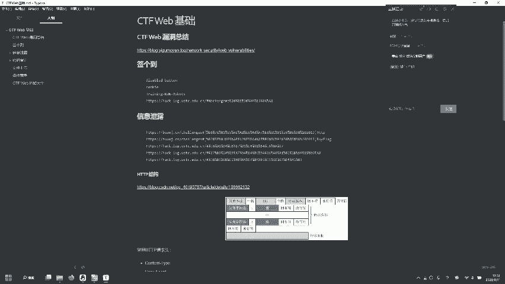

这个就是这个是我自己博客，就是咱们上回培训也提到过这个东西。

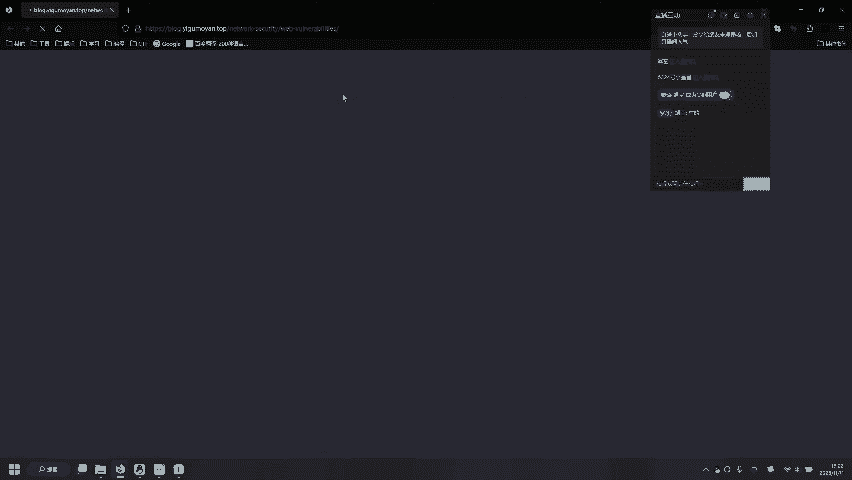

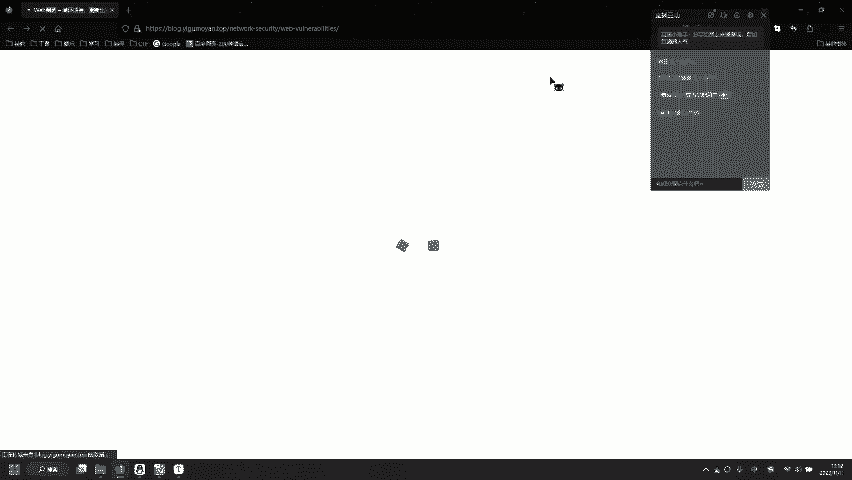

等一下，就是这个当时是在绿盟科技那边的时候做的一套东西，像信息泄露，任意文件下载、跨展缴尾攻击文件包含命令注入、条件竞争以及PHPL类型。这个这个文件到时候这一套文件到时候我会发到咱们群里。

你们到时候可以就是自己看一看就行。然后信息泄露，咱们就。等会儿再说行鲜，我先热个身看看CTF外部都是些什么东西。😊。

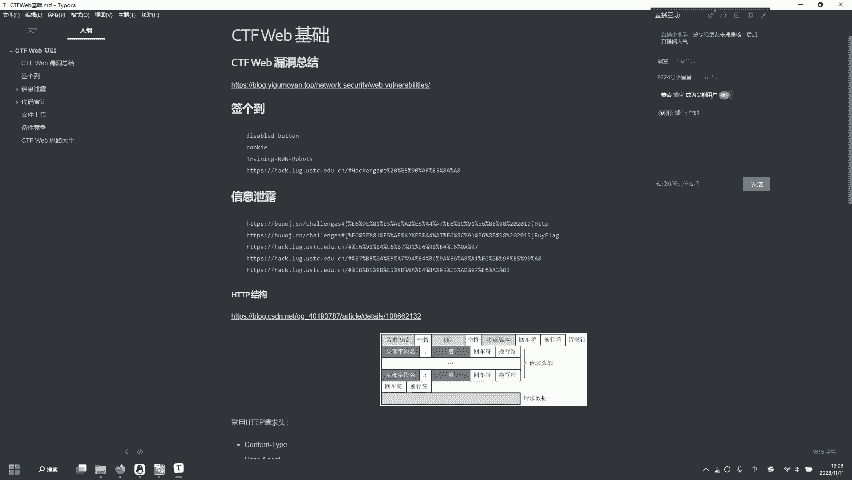

然，咱们这回的题主要是来自BOCTF以及攻防世界上的。主要是这两个方向的题。

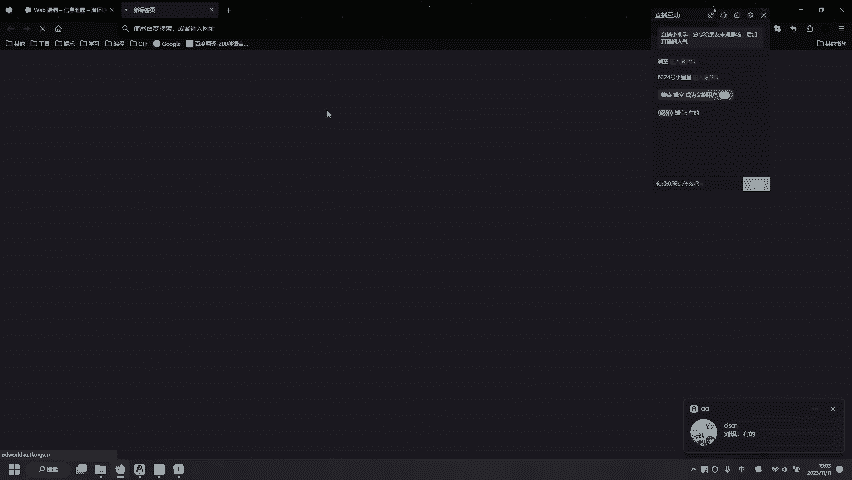

然后我给你们两两个，就是如果带如果要么就是带链接的，带链接就是能直接打开的。如果不带链接的，就是公方世界上的进去后自己搜一下就行。

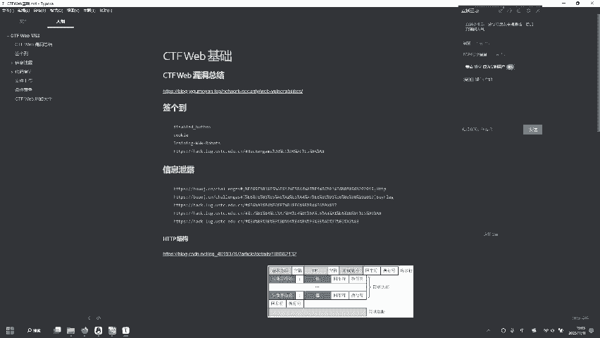

这登过了贴库。disable button这这都是签签到题，就是应该就是能秒能秒到的那种题。呃，就是应该就是能秒那种直接能秒这种题，一个不能按的flash，一个不能按的按钮。

那么直接F12F12打开F12打开控制台，然后扫一下一个不能按的按钮。这就是咱们上节课提到的HTML结构。然后呢这有个diablediable有个属性diable就是不能不能点击嘛。

那咱们把给它把diable删了，那就能点击了，那点击就出出答案。😊。

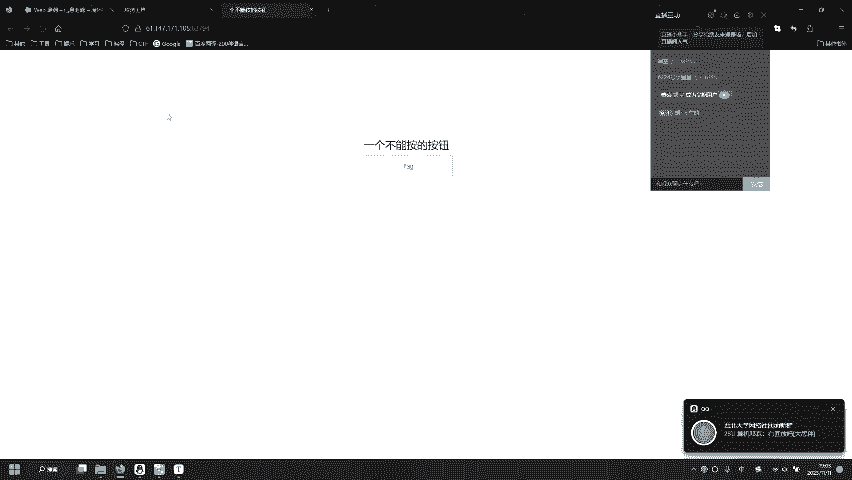

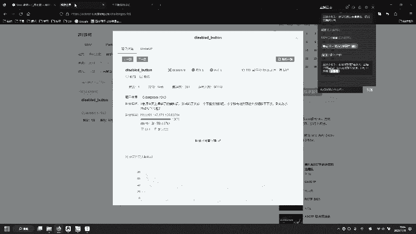

这答案就回答正确，这就不再说了。呃，cookiecook也是咱们上节课讲过的一个点。

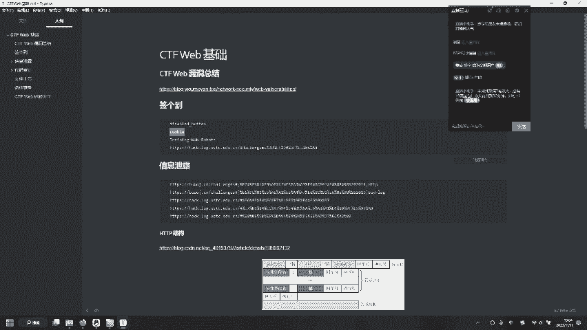

所以就看下这些东西是在怎么在web里面用，这些都是这个这些都是呃很基础的。就是你必须要会，必须要知道有这么个东西。😊，但是你说正儿八经比赛可能会出这么简单的题吗？不可能给你出这题，出这题，我天。

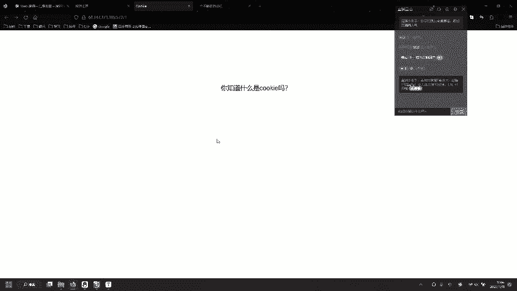

那那是那爽方案文，那一会儿就AC了，一会儿又AK完了。😊，他说你知道什么是cie，那就看cookcookie那有存储存储底下cook找个look herelook here看cook点PHP。

然后上面路径路由跳到c点PHP里面say responsese看网络的返回请求。哦我返回请求A2f来个这 flag个这这点儿又出来了。这第二位出来了。这外部这就签到题，签到题也是很简单。但外部怎么说。

就说是签到题简单还是真简单，难的是真难呀。😊。

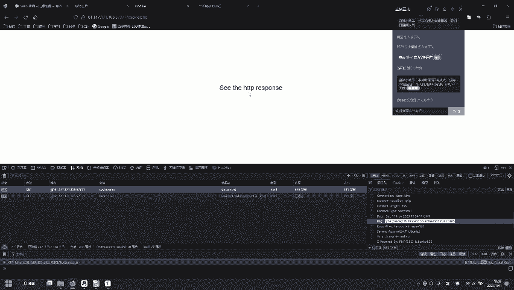

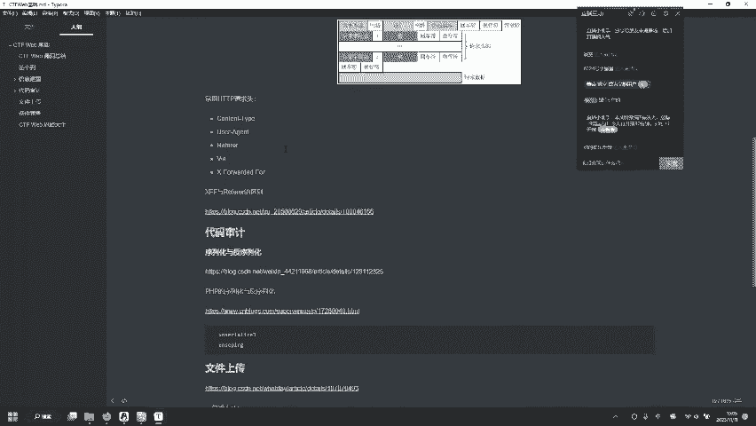

男的又是脚本，又是啥玩意儿的，就搞不了。

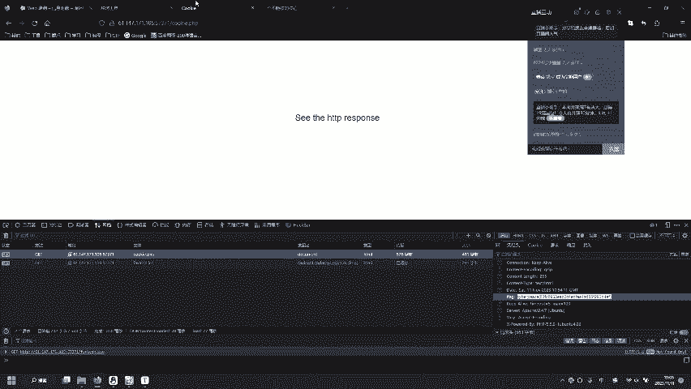

这两个了这先带着新道题看一看。第3个。哦。第三个G这样其实稍也不用看完，就看这有robot点TXTrobot点TXT的话，咱们可以看一下这个就是这块其实已经是信息泄露的部分了。

然后作作为存在robot点TST存在于网站公目录，用于告知爬虫确定的访问范围就是。😊，你这儿可以设置，就说爬虫可以不可以访问艾米目录，爬虫可以不可以访问嗯f呃fag点PHP目录。

然后允许的是user agent，就是你的浏览器是任意的。然后那么咱直接就去看它ro点PHPro点TXT就行。没有。

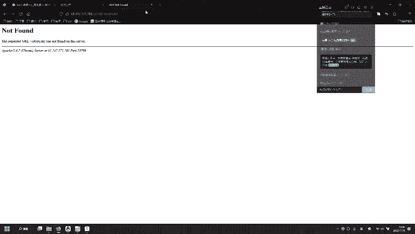

哎呀，多有空格。然后他让看flag点PHP。

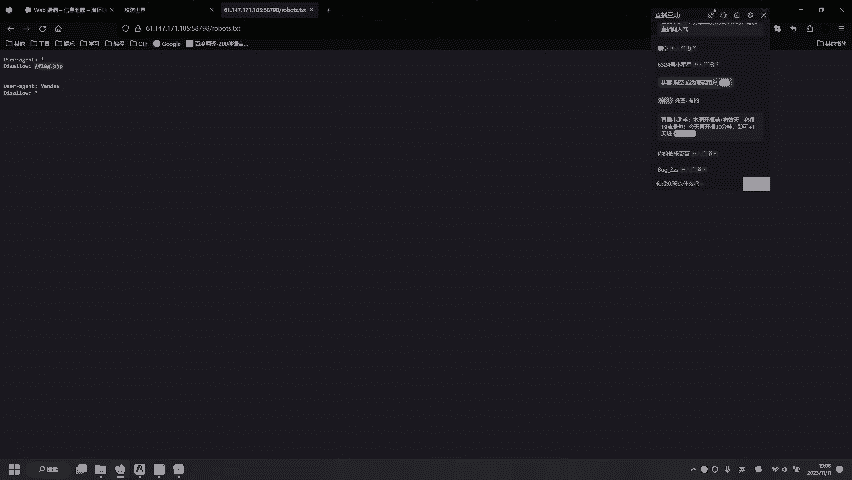

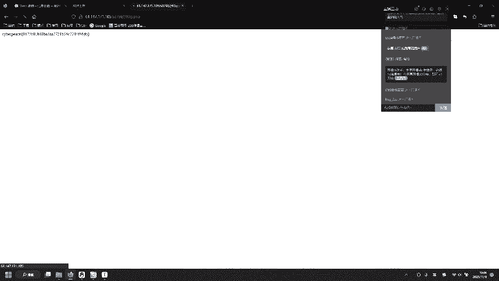

只有拿到负拉格了。这这都难度一的基础题就看一看就行了。

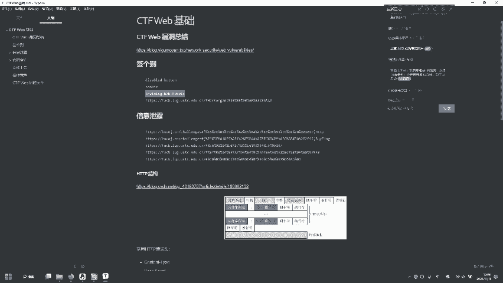

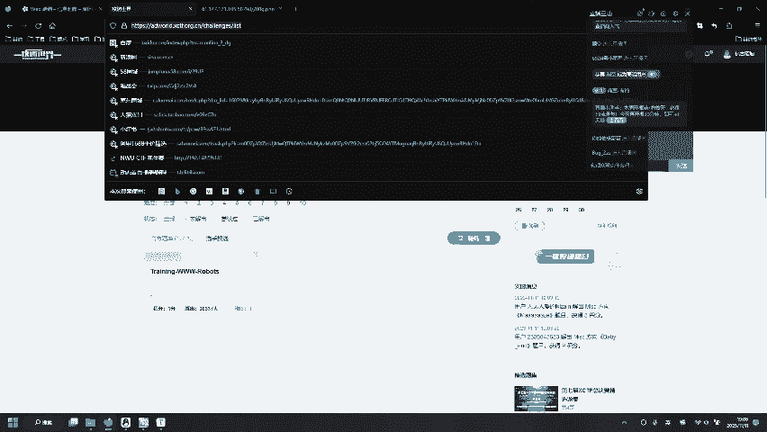

然后这个是那那个har game的，我也没打打，我就打了4个外部提又跑了。大声喊出哈尔game启动。其实这个。你就先随便随便录随便录随便录制一段，然后直接停止，他发现相似度。

然后你直接提交他要求相似度大于99%。你看然后你可以看他就是怎么把这个99给它搞掉。我刚刚请求我刚刚的这个是比如说我先随便录一段。它这个相似度是65，这个相似度这儿这儿有个65。

那我就可以相当于这是这就上上节课咱们讲过那个get请求嘛。😊，呃，get请求，那这就是他这儿是65。那么就说他通过get请求来来确认他是不是究竟是。嗯，究竟是它的相似度是多少。

那么再可以直接给它改成9099。99。甚至改个100，或许。

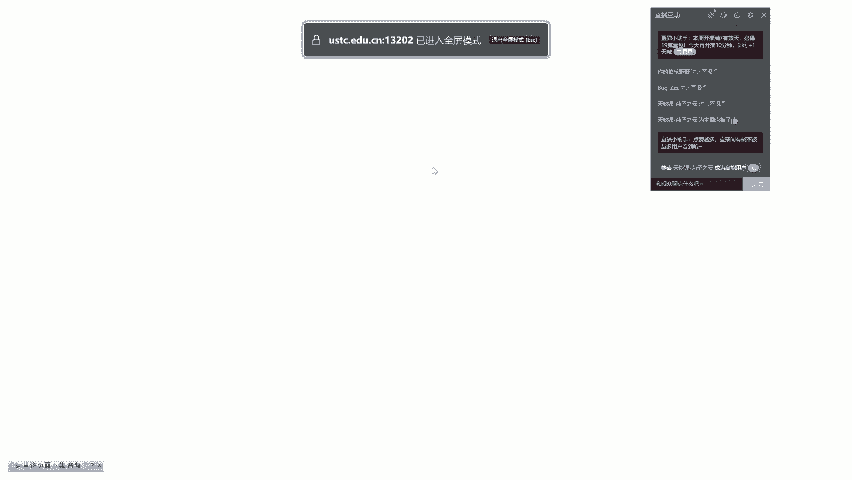

🎼他V开电驱动。🎼这个不大0。关了。行，这这这个就不说了。这这签到签签到题就意思意思玩一下，知道知道外b题是怎么回事。就是你看miss是给你一堆文件，给你一堆文件，让你在这堆文件里面。

呃找到一些像什么引写呀，像各种方法给你藏到里面，把flag藏进去。然后像密码就是一串呃一串所谓外行人看起来的乱码，然后给你把flag藏进去，让你通过一些呃手段去阅读，然后或者就说去写脚本。

把他的那个密码的加密逻辑给他逆向出逆逆出来。😊，进行解密，然后拿到最后flag，然后像胖就是去拿主机权限。然后你呃R姨就不说了，R姨那脱壳那麻烦了。然后就就这些。

然后外b就其实就说是网页会给你写好一些东西。咱们一会儿可以看一个嗯，我给咱们也准备了一个，就是我看再我删了没哦，我删了，没事，一会儿一会儿再拉出来。就是我给咱们准备了一个外部题的原题。

就是外部题是怎么部署的。也就说他怎么就是呃它怎么做成一个外部题，怎么就是flag放在哪儿，什么东西放在哪儿？这个咱们到时候一会儿都会说一下。就是让你们更加透彻的理解这个外部提示是怎么做出来的。好。

看新息泄漏。信息销售这个东西其实呃就是第一个就是注释。嗯，大家应该C元都学过了吧。C元你写是不是写一串打打俩打俩斜杠，打俩斜杠，后边写串注释，告诉你这什么东西。那你PHP里面有注释，你PHP里面的注释。

😊，别人睡去找找有没有这个淘宝网站有没有注持。嗯，看这就是个注释，这就是一个注释，一个尖角号，一个感叹号，两个杠。这个注释你把注释放到HTML源码里面，我按F就能直接看一见。

就比如说呃我现在在跟在跟另一个技术人员对接。我告诉你我这个HTML里面哪写的有问题，我写进去了。但是我这个东西我没有进行二，我没有进行二次审核，而且那边也没有版本进行版本更新，直接进行发布了。

那么我这个注释就进行造成了一个信息泄漏，造成了一个信息泄露。然后。其他人就可以通过这个信息泄露信息泄露来达到一些漏洞来干一些事情。然后第一个就是注释，像这就是尖角号感叹号两个鞋子两个杠。

然后robots点TST刚刚说了，就是面对于爬虫的爬虫的一些问题。然后备份文件备份文件就是说你像你网站，你备份完后直接就是打个zip，打个zip扔那了，打个zip扔那。

然后进行下一个版本的放进行下一个版本的一个迭代。那这个点zip是不是就进行了一个信息泄露？然而但在linux网站里面像常用的就是back zip。2AR套t套JZ和7Z这几种格式。第一个是第一个说。

然后几家说强调几个是SWPSWP是什么时候存在，就是呃linux里边有个叫有个东西叫做VI编器，就是VI编译器。VI编辑器后面它它还有以及它的衍生版本。

就是它的进化版本是VIMVM这编器VI编辑器在异常退出的时候会产生一个嗯点SWP这么一个文件。然后这个文件的话，就说也会存在一个信息泄露，可以拿到你这个文件的信息。然后当然这个文件是隐藏文件。

你就要通过LS杠LA或者LL这个命令来呃获取这个文件。😊，然后第二就是get文件gatet文件get up大家应该多少都听说过吧，就是一个代码托管平台。

那get up你启动的时候是不是getge inge in it，你在get in it的时候，就会在你的登录录下产生一个点get文件。那这个点get文件里面就包含着你这个整个也不能说包含吧。

就说包含会包含一些它加密后的文件目录啊文件结构，以及你前后修改版本信息，你的提交信息这么这么一个东西。😊，然后嗯但是你这个文件没有删除，你就可能会泄露整个东西。然后这里面有东西叫做get呃getar。

这个其实就是先解析你get底下的index文件，找出工程，然后再get objects，你们看一个get文件吧。我找找我有没有什么github的项目。我找一下。

哎哎看这个就是一个gatetgate下面的文件目录，这是点get点ge下面。的一串东西就是他先会访问这个index。打还瞅呀。这玩意儿就是你知道这get能进行一个信息泄露就行。然后这瞎胡扯一下。😊。

像index。哎，这文本二印制的。就是它这里面像着于ORG呃，就是原原始路径，以及你的自身路径，自身的那个嗯就是两边的一个存储两两边的库的一个对比就不说了啊。

PICPIC是pythonpythonpython程序编译后的一个字解码文件，也是可以通过像这种像用这个用这个工具进行反编译来得到源码。SVNSVN跟get是差不多也是一个东西，就是一个类型的东西。

这个也是。嗯，做版本控这个版本控制的一个东西。然后DS都DS store这个就是那个苹果苹果苹果电脑的一个稳藏隐藏隐藏文件。这个漏洞系统提出的比较少一般。

然后has还这个就是阿帕奇阿帕奇服务器里面的一个东西。然，至于防护措施就是网站目录的正确访问，不要让用敏感信息不让上传。配置以及便利，保证web时钟显示默认网页。

这个就相当于就说是假如呃我开发一个web项目的时候。我开发一个web项目的时候就是要把它的rotor，把它的路由。就要做的十分严格，不能出现探种就是我可以通过一些越权方式去访其他路由。行，看几个行。

说点多了。

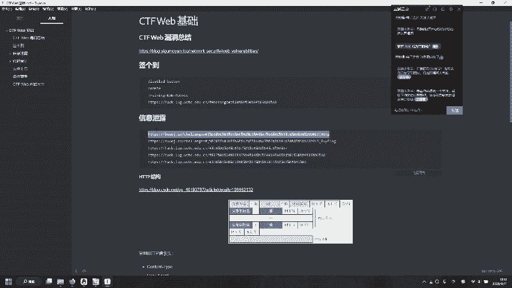

哎呀，没登录。等我下。

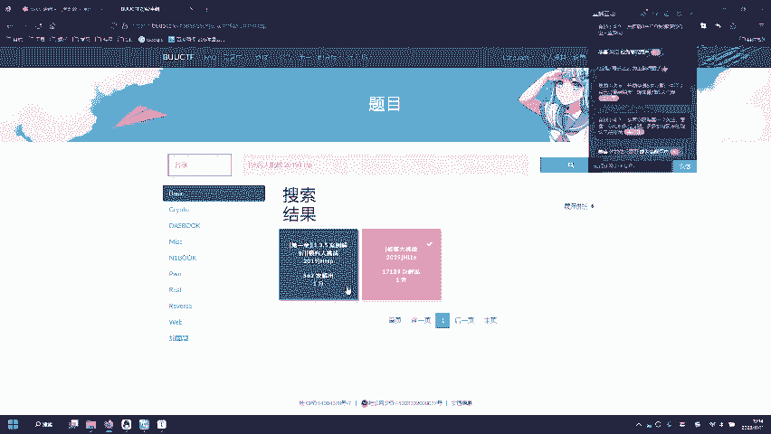

结合到挑战。启动一下。这个是这个这个三叶草三叶草拉over三叶草是成都信息工程大学，他们一个国内非常牛逼的1个CTF战队。然后其实这个你看你就大概看一下他这个网站，你会发现就什么东西都没有。

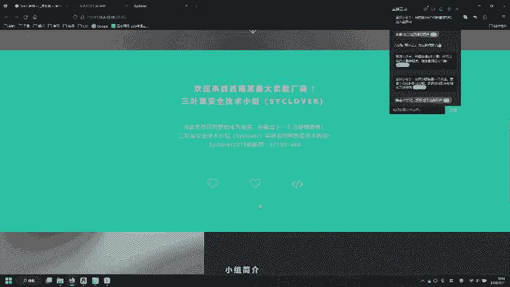

就是无从下手，什么东西都没有。然后那么第一反应是干什么？第一反应是让F2看一眼。F12看一眼，这个大概大概点开看一下。大概点开看了一下，好像也没啥东西。然后先说一个思路吧，就是首先你先看网页源码。

看完网页源码是去看到网络请求，看看网络请求扫刷新一下，看一下网络请求，网络请求，这些都是请求一些GS无关紧要的。看get里面就也没有什么就是特别奇怪的请求。然后看眼cookiecookie也会藏东西。

没有层，那么就放源代码上。嗯，那就可能就是我这个包没有给他解完嘛，就往上接着解，看有没有看有没有可能。找出来什么好东西。或者可以直接搜一下。就比如说呃你你一个网站跳转到其他页面，或者说有一些操作的话。

一般用两个，一个叫一个东西，也是boton，就是一个按钮，要么你就可以去用一个A标签。A标签，又是一个link，link可以跳转到其他的路由跳转到一些东西，也可以进行一些操作，搜维标签。

看有没有什么东西。哎有，这没个没个那个啥了。算了，自己看看吧。sation一点点解吧，这这这就。只又开始了无聊的工作。说。我标签没有。嗯。哦，看这儿这这这这儿有个A标签吗？😊，这样A标签。

然后它这显示了一个uncle return force，先把这个A标签找一下，在哪嘞。哎，其实不用管哦，氛围这个东西，这个其实没必要管你unclickre force。

你可以其实把这return给你去掉后，这就直接进来这个sresecret呃，就这个这个目录啊，其实这个目录你进来之后，呃，你你也可以就是刚在那儿你已经看到存在这个目录，你就可以直接嗯在这路由跳转。

路由跳转，直接跳转过来。😊，然后est done come from，然后这会儿又涉及到1个HTB请求的东西了。然后咱们这会儿细说一下这个HTB结构。啊。

这个首先就是先这张图这张图就是你HTV发发给项目请求发一个包的话，那就是大概格式就是这个样子。首先就是请求方法，请求方法。你上学呃上节课说过有get请求方法，有post有铺有delete啊。

有个空格URL这个URL的话是这个像这个就是secret点PHP然后至于前面那个是什么？前面那个是原站，就是你会有一个就是目标目标地址和端口是在不，但是不在不显示在这个URL里面啊。

写议版本像HTP2HTP1。1HTP1。那回车符换行符。嗯，就是杠N杠R，然后投资断名，这块又是请牛头的企牛头这个东西咱们上节课说了没？咱们上节课有没有说请牛头？😊，有没有说快。没说请牛头。

我现在说下请牛头。应该是没说，那就先说不说请求投，请求投，然后先说请求体了。请求体就是reponse box就上是呃body上回咱们之前讲过jason数据嘛，jason格式的文件。

jason格式的文件就是会放在请求数据这一块，然后以及当然也不止jason像这种请求方式有很多像什么d formform date。嗯，也可以请求一个发一个二进制，发一个二音制数据一类的。

其实这个这个博客写的很好。😊。

这个博客选号我看博客吧。😊。

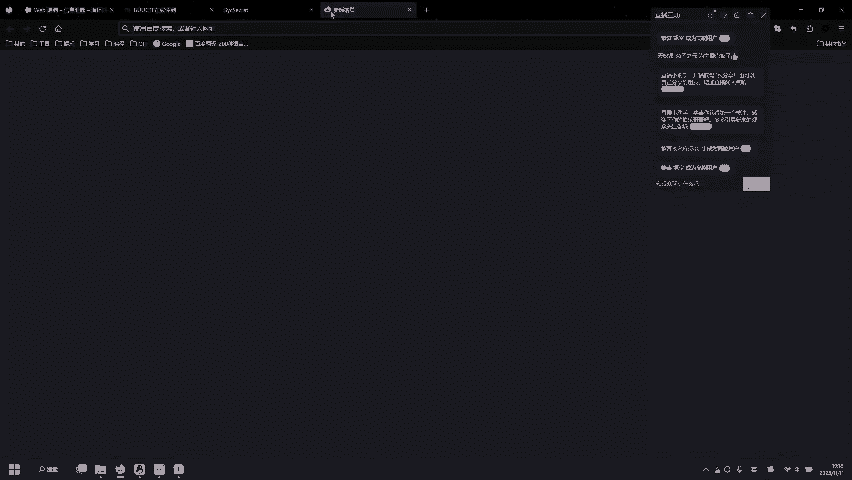

看这就是一个很标准的一个包。Pos上行用方法。然后这是一个请求的URL。然后HT协议版本，它是1。1的协议版本啊，seft就是接受形式。像他收一张图片。refer这个东西，咱们一会儿回细说。

然后except language。然后accept language就是人家接受文字，这个东西这个这个东西记住注意一下。这个就是有一种非常小小众的考题。

就是让你去对应呃你的发包和以及目标目标的那个时间，有的提示通过这个except language来定呃来那个确定的。然后userag userer agent是个啥。

就是你浏览器你浏览器它访问的时候会有一个呃标识，嗯，应该是可以学要标识吧。就是这个useragent，然后所示一块下面下面先说。😊。

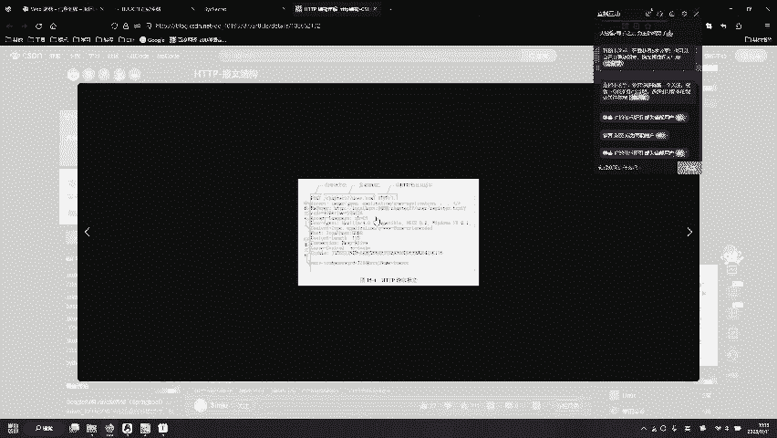

看请求行。这个咱们上节课讲过也不就不看了。看产生浏览器的类型，然后就一般是唯一个浏览器。其实这个user agent一般浏唯一浏览器也就是产生一个唯一标识，也不能说唯一标识吧，一个动态标识。呃。

这个useragent也是一个反扒手段，就是如果你这个请求没有携带user agentent，那我是不是就可以在一定程度上认为你这不是通过浏览器来进行访问的，而是通过爬虫来进行对我数据进爬出爬取。

以及像这个user agentent也可以去鉴别你是PC端访问还是手机端访问。手机端访问一般会携带一个mobil mobile的字样。像scept接收数据类型。

像TXT叉喵applicationjason这些都是希望接收是叉喵或者jason类型的。conin tab就是我这边发包，我这边向服务器发包发一个数据包。这个数据包是什么类型的？它可以是一个texax。

也可以是个HTYjason，也也可以是一个也可以是一个jason形式然后hosse就请求主机名。到不。然后看你下下面。这个是cont type，con type的几种格式。这个怎么说？

就是如果你在实际开发中的话，就实亿的软件开发中的话，常用的是application jason这个，然后以及mippart的这个这个是做呃二进制上传这边就是上传一些文件的时候用。这这两个是用的比较多的。

如果但是如果你在打CTF打CTF基本上就是imGPGimJPGimPNGimageGPG这几个东西用来用去。然后请求豹文状态行。状态行就是看状态行就是先听什么200是正常访问。

后最近典那个404n found404n found就是客户端错误，文件没有找到500服务器错误。😊，然后2二开头的就是被接受理解。三开头一般就是重定象呀什么东西的。然后一开头一般用的比较少。

也没必要知道。然后这个不说了。啊，请求同步，这个就是请求投的几个协议，这个需要重点了解一下。就是accept就是可能接受的一些类型。呃，这个就嗯不细说了，说几个比较重要的吧。😊，呃。

这个cookiec就是你浏览器可能会给呃服务端发送一些数据，会用到的一些东西。然后form form form不说了，cont content tap content type就是你祈求的类型。

像上面说到，就假如说呃你向服务器上传一个木马。但是一个木马被服务器检测出来。服务器要求要求说你只能上传一张图片，你不能只上传一张，你不能上传一个PHP脚本。所以说你就要修改它的这个请求头。

conent type，你要修改它的cont type去绕过这个检测这个技术咱们一会儿会用到，一会儿再再说吧。这个一会儿咱们用到这个文件上传那会会讲然ri。😊，嗯，这个就是浏览器访问的前一个页面。

你看咱们刚刚刚访问这个secret点PHP的时候，我不知道这会还能看到不看不到我就算了。就是咱们刚访问这个secret点PHP的时候，从它index面页面出来的。

这个refer就应该指向它那个index页面userag浏览器标识符标符的字符串啊userag就是也在CTF就经常会去伪造，或者说是你强行要求这个在签到体里基本上都是签到体就会说你要求呃使用。😊，嗯。

使用这个浏览必须要你要求使用这个浏览器。但是这个浏览器人家相互作为一个，你也不可能去真正搞一个这种东西出来。所以就用一个agent策来给造一个啊。VIAVA就是代理代理请求。

一般也会说是要求你需要从哪个代理网站进对我进行访问。响应头步看看不重要，然后补充一个补充一个，补充一个ex for for。

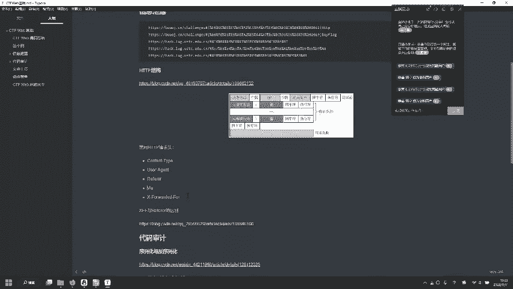

S four four补充一下这个。

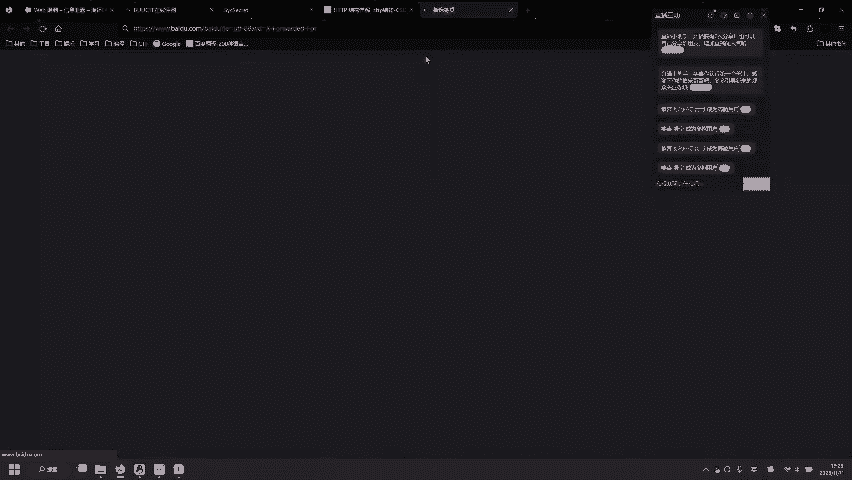

S four的 four啥，它是在EHTV1。1里面。呃，HTV1。1哎，没有0的，那我记错了，它是它是看向别的请求投，就是一个也是个键职对，剑职队，前面一个K后面一个value。

但HTVS four four这玩意可以后面跟多个。第一个是第一个是它的真实IP第二第，第三个都是可以是代理IP代理IP。😊，然后那么那你说你export for和一个refer都是一个，就说是访问。

从别从别的地方访问到一个网站进行接收。一个就说是你来源的一个查看。那么两个的区别的话，这这也有我给你们找了一个，找了一个讲的挺挺好的。看就是XXSFXFF就是他问的是哎嗯服务器请求的真实IP。

并且说是它可以请求有多个。当然这个的话就是只能是从哪个页面链接过来的，处理一些信息。这个其实就是当时I拼也拼错了。啊，我不看了，然后接着看这个题。

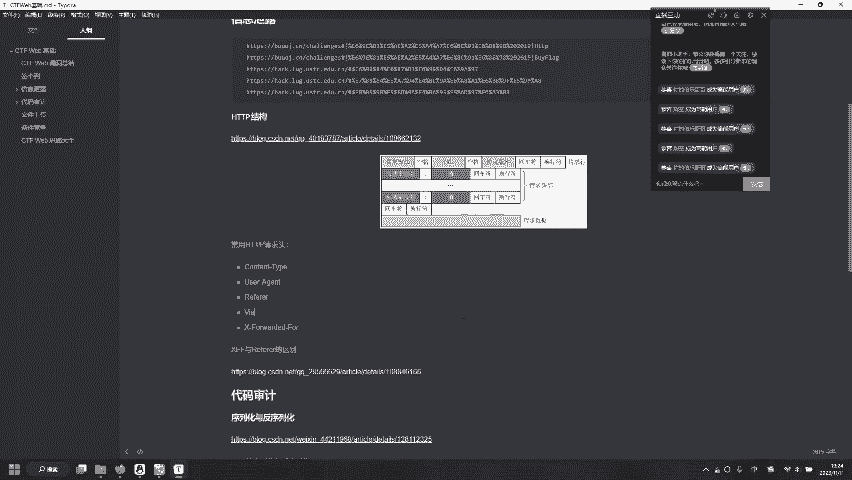

那，刚说完这些呢，is starting come from这个那我应该怎么写？我是不是应该也说是他他不是从这个网站请求来呢，我是不是就该将那个refer上面加上啊。

这个插件呃可以去搞一下harhar bar这个是在那个谷歌浏览器上收费。所以说我推荐弄个狐火狐上面这个有免费版，可以用用。这个就是做一些数据，做一些伪请求的话，还是比较好用的。😊，嗯。

这个浏火狐乱器怎么装插叶，这就不说了，这个嗯比较接础，百度一下就有。他是要求从这个网站访问，那我就加一refer，然后从这个网站访问，我再执行一下，它需让我使用这个浏览器。那我使用这个浏览器的话。

那我是不是刚刚就是提到的那个userag？那我现在就是要再做一个userag。哎，再请求我一下。他说必须让我从本地访问，那么本地IP就是X form。那我再添加一个号的。说一下。

那本地IP咱们上节课是不是也说过就127。0。0。1。这个就是代表你本地的1个IP地址。看这fllog拿到了。好，这是第一个。第一个教一下教一下。啊，你早就解束了哎。😊。

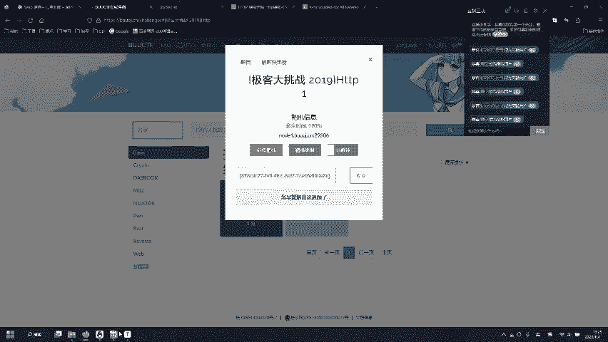

第二个。哎。

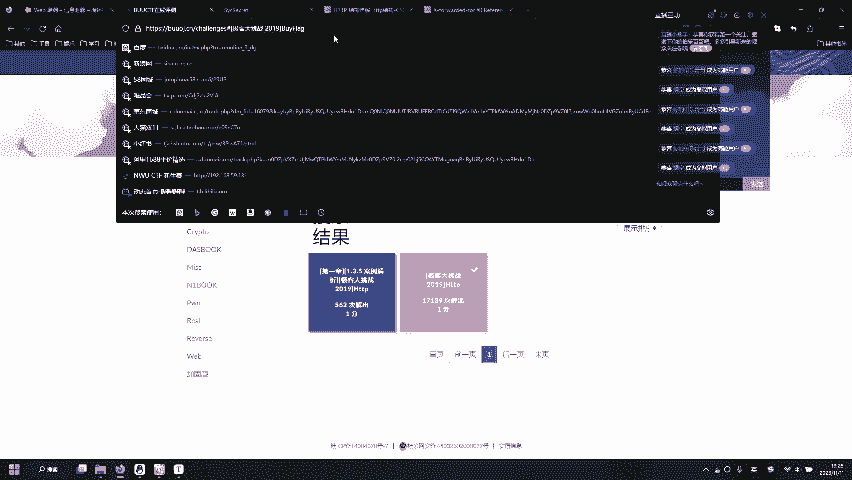

跳转不了。跳转不了的，搜一下吧，backfl back flag这个到时候去再直接在他网站里搜一下。

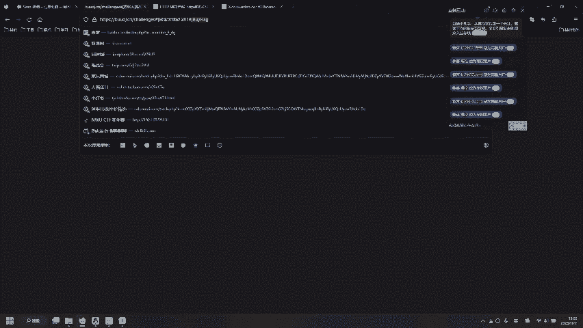

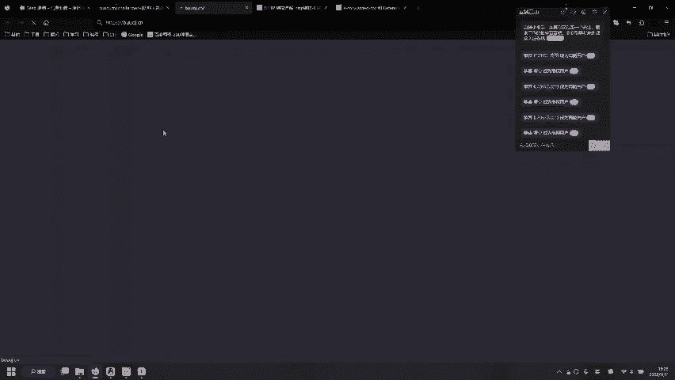

呃，练习成题目列表。

这个。

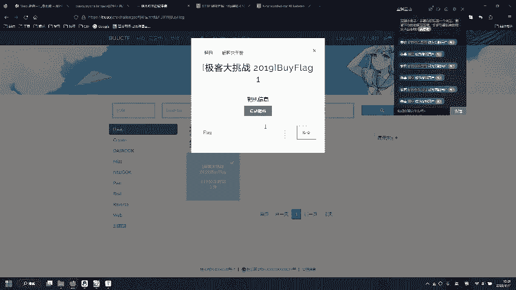

直搜也能也能求。

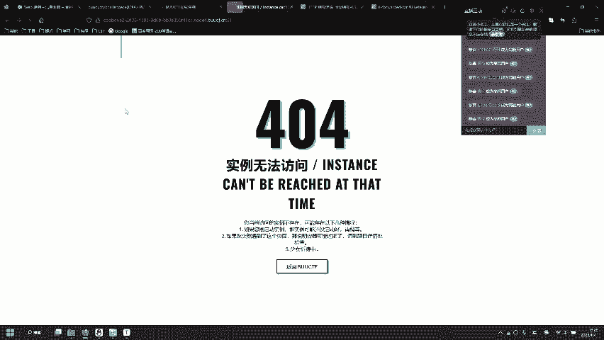

等一下啊。😔，它是三叶草的。

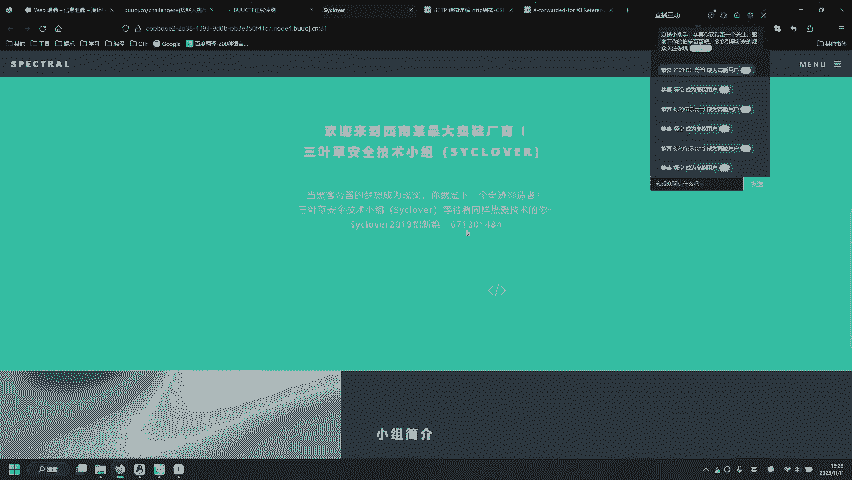

这个。多给个 menu女。看有什么唉，这个配套的。

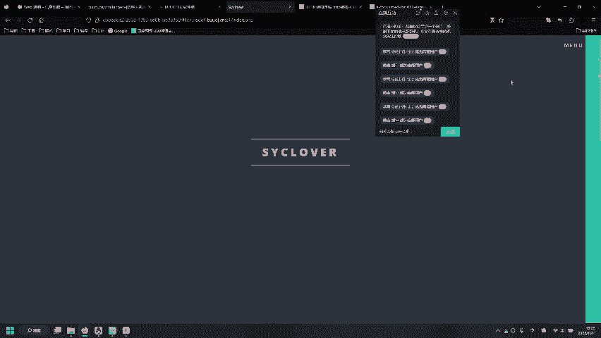

啊，他是说是你需要呃，如果你需要买这个flag的话，你需要就是这这么多钱。这么多钱，然后if you want to buyyou must be a student这个成程都信息。

这三页草他们专队的学校。you must answer for current password onlyqui。那先F看有没有什么东西，哎，这有一串。

这游戏呃这也就是代题目给你提示吧，这其实都很基础的。你想先接受一个post请求，接受你要需要传递post，就是传递money和password两个参数。如果他说你要传存在pasword。

你就把password读出来。然后你password呃要求你password不能是一个纯数字。然后如果你的pasword还等于404的话，就是密码就正确了。但你password又不能是纯数字。

又不又要等于404，这块又涉及1个PHP的呃做比较的问题。

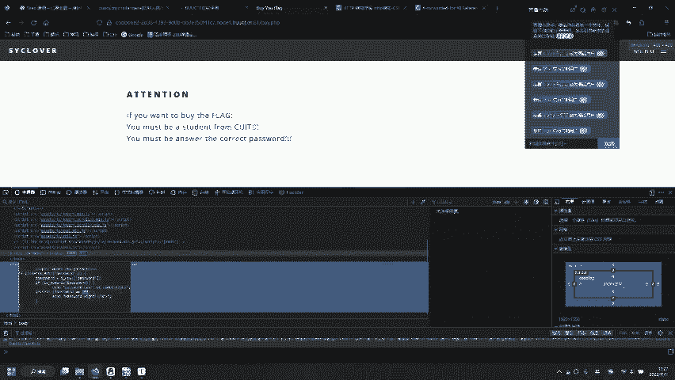

先下载一下。这个这个软插很好用，就是呃如果就是有呃想搞wi的，就可以研究研究。再录一遍，把这个c拉上。嗯，首先你他刚说要一个poss请求，能把pos请求勾上。然后那他说是要password的。呃哦。

他说哦，我还先必须是学生，那我先看下他的请求格式吧。

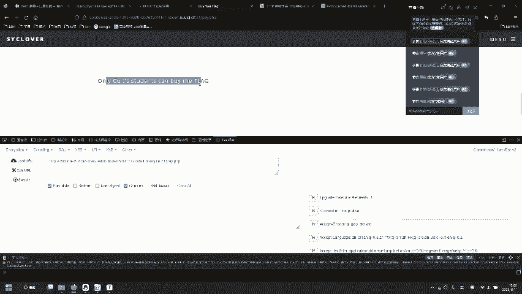

请求那他是怎么判断我我是不是学生刷一下，刷一下，重新刷一下他这气求。嗯，稍微看看啊，这casecs userer等于0。呃user等于0的话，那000加一真嘛，呃，零是假的，那我一就是真的。

那我user等于一，我就是大学生了。

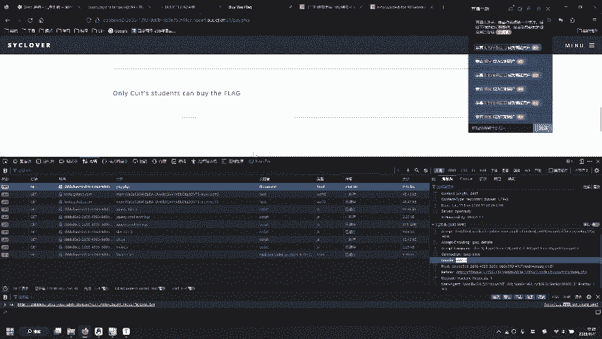

你再枯口招，把右边改成叶。试想一下。哎，等一事。咋回事儿？卡住了。逗了一下。Add header。其实有c。6字等于1。执行一下哎，执行出来看你这样执行出来，就是你是这个学生，但是你需要输入密码。

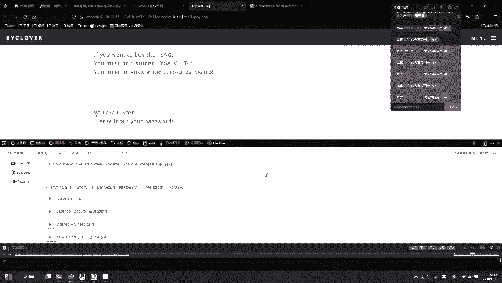

另外在前面看就是要求它是它和404相等。但是你的你和CN4相等，但是你呃又不能是一个纯数字，那就涉及到PHP的如果比较PHP的话，你看像PHP也是一个弱数据类型的东西。

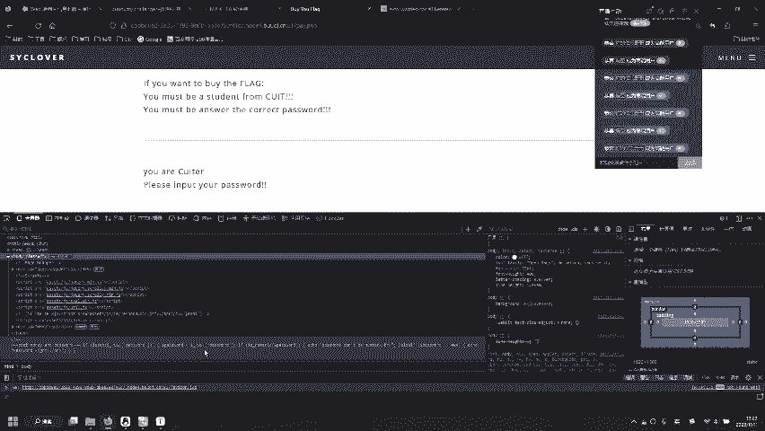

就是你PHP里面这块直接说吧，就是你4乘4A呃，你123A。和123是相等的，这个就是PHP1个弱比较。当你把这个转成数字数字比较之后，你123和123AA是相等的。

它会自动把这个字符串后面这一块给你省掉。这个是PHP语言特性这一块。如果再讲PHP语言特性的话，呃，这也是一个就是CTF的一个很大方向。但是今天我也没咋准备这个方向。

所以说咱们一会儿也会讲一个PHP的另一个东西。😊。

叫做它的序列化和反律序列化，也是一个蛮重要的东西。先先这么搞，然后呢我pasword的是不是就有了？password有了，那我是404404A，它会自动把这个A给我省掉。执行一下。

看他说password  passwordword right ， password right，然后需要需要花钱花钱买这个flag，但是他也没给我发什么流量包，那就接着传吧那呗。妈你。

卖那一套要多少钱？穿上去。numberless to long又说这个数字太长了，那要想办法这个数字缩短。其实这个这个绕过这个方法有很多种，就比如说把ner改成一个数组，数组数组对比一个数字是恒微针的。

数字对比是恒为针的，然后或者就说是我用科学技术法表示这个咱们都试试吧，这个是几位。1123456788个零，那开大点边E是一个9。啊，这flag给了爆了爆 flagag了，然后先复制下来。😊。

或者说是这儿可以直接传一个数组，应该也可以。看传数组也可以，就是把这个money传一传一个一这个数组过去，数组比对比传为帧。这个到时候你们可以整个整个PP的环境自己测一下。

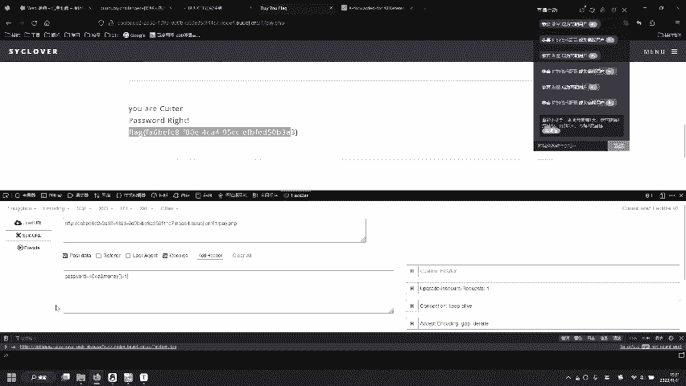

呃，是有胶一下象征性的教一下。

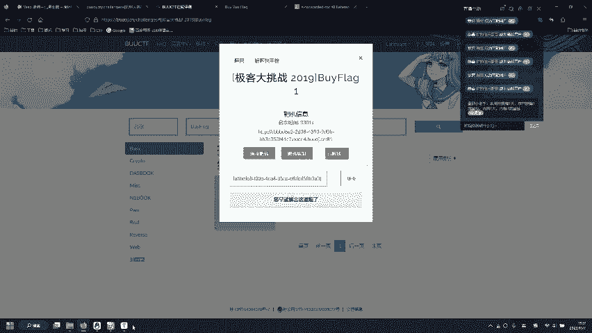

然后剩下就是信息泄露。啊，这个哎搞收到叫学啊。

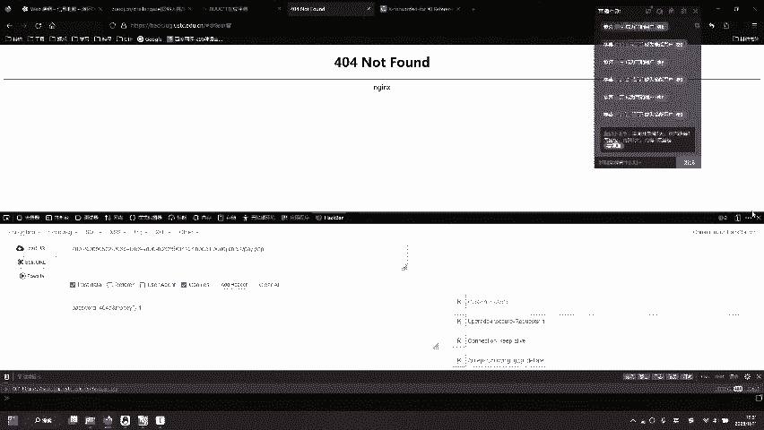

我放的。我去。

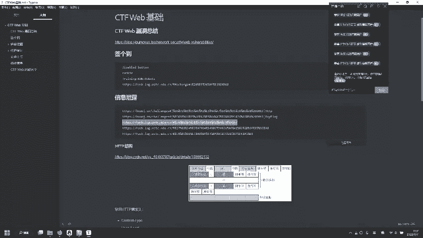

不是这那会儿还能进去呀。H克。我去。

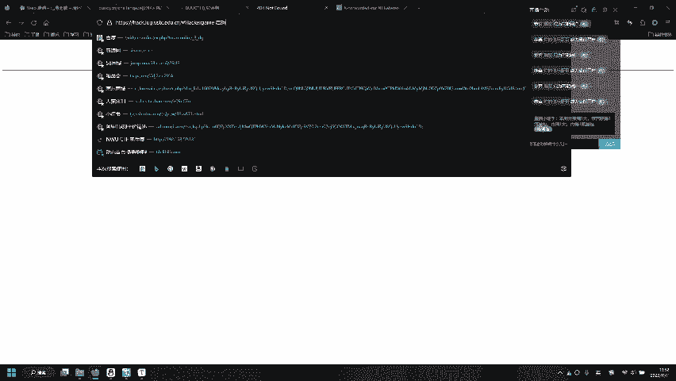

诶。嗯。哎，奇奇怪的问题，更深更爱这个。大海。其实这个题。

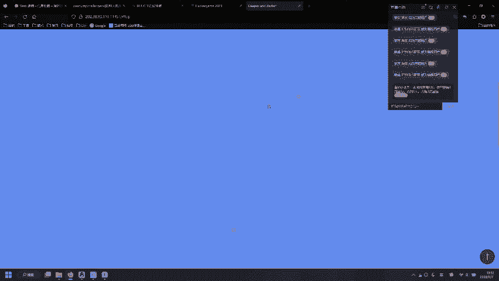

就是一个很很正常的一个就是信息泄构的，就是很很普通的信息泄构。它其实就是刚刚所提到的注释问题，可以直接大胆一把梭哈，在这里面搜一个flag，哎，解锁了。😊。

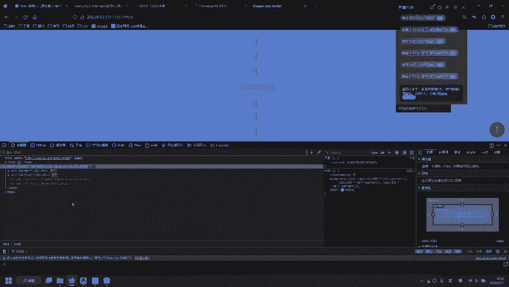

呃，还能fag，他又把fag隐藏掉了。哎，你看这这就把fi藏藏藏入室里了，这这没啥意思，这这就一把梭哈的题。

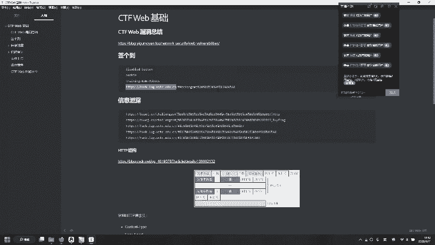

这当时那个那个啥耳题。

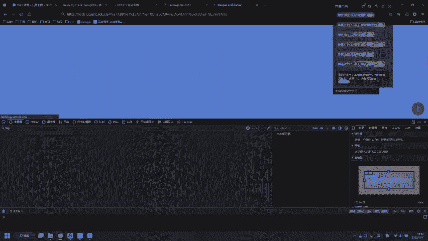

这个作业会模拟器。呃，其实这这个题就应不仅先先先不说这个这个这个有点麻烦，先把这个三国简测协议也是这的吧。

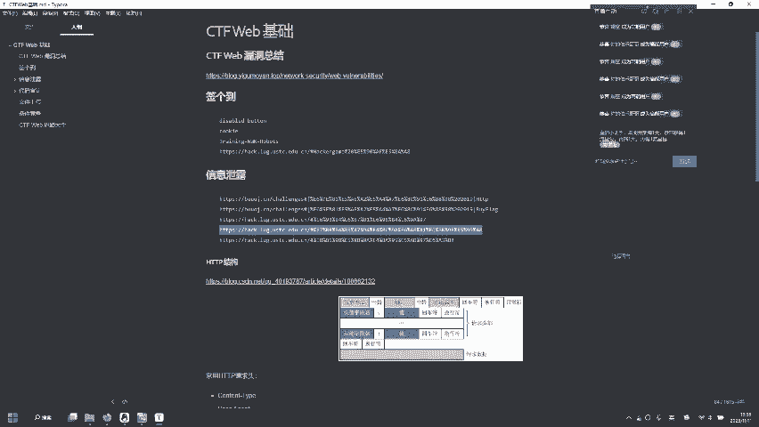

我觉得下国颈自习应该也是这儿的，先把赛国颈自习说。😊，啊，战胜AI赢格 flagag，那我先随便下几个，看这AI肯定是最后结果肯定是和。那么就说我要想办法，就是把它数据包数据包拦截下来，篡改他的数据包。

然后最后拿到这个flag。然后这块给大家一会儿一会儿我把这个工具会发群里，叫barber一个。😊。


有个抓包蓝包的工具。这个东西很牛很牛逼，这个这个软件很牛逼，我找一下。嗯。你找到。这个到时候可能需要破解，大家自己破解一下。这个license打开后，然后ro记里面把license输进去。

然后他会给你再弹一个窗口出来。然后把那个东西说到这儿，然后这块再出一个出一个呃签签名，再把这个签名再输回去，这个东西破解了。然后他需要一个就是呃一个网络一个网络代理，这块又又是另一个插件。

这个插件插件这个名字名字我一会儿发群里，我也记不太住了，就是这个做代理的插件。这个switch。这个代理插件这个一会儿我发群里。我会把名字发群里，然后这个哦哦8080档口被占用了。

他这个是要求必须就说是对你一个端口全部走这个代理。我先把我这个。这人关一下。🎼。Co。相关，然后。


这个代理哦把这个代理先拉上OK这样就监测到我80端口。哦，咱们把这道题里面那个s一下，然后。呃，restart把这个开发buso这个8berso这块就是你们弄的话，这好提前设置一下，就给他1720。

021和8080，就和你这个代理设置里面这块对上就行了。


然，后如果说呢怎么判断自己这个完整有没有设置好，就直接电脑直接输17。0。0。1。8080就出现这玩意儿就设置好了。


呃，那咱先把拦截拆开，那我现在输一个，看这就爆了。比就说是我我这儿点击的是X和Y这两个值，咱们放行给它放行，然后看一下刚才个请求。装请求应该这个看我给它放向，咱们先分一下它数据包啊。

这个数据包其实就刚刚说那个看这个是它的发送方法，这个是它的路径。路由路由的话就是发送的是它的根目录跟录下的。

然后这是它的请求协议行加E它是HTVE的hos user agent accept就这个就是正常的它一个请求包cooks就不看cooks，它是这个唯一的身份验证，它这个用身份cs做的身份验证。😊。

我刚点的是011。1的这个数位置，然后它是10呃1000-1，那么这个就看出来我我的我的我的我的就是-1，那么它的就是一，它的就是一。那么现在我进行第二次，我点这个位置，我点这个位置，那他这儿再发发包。

那我就是但是我就是要拦截到它这个它返回了包，他就是我给服务器发包，服务器给我返一个包，我要把它返回这个包给拦截下来。然后对这个数据包进行篡改后，然后让它返回到前端页面上。那么咱就可以。我看看啊。呃。

用用啥来着？威忘啊，拦截拦截这玩意儿然后响应响应它，响应它后咱们放行，放行后咱们就拿到这个数据包。我刚点的哪个来着，我刚应该点的是这个，然后他给我把这个拦截入了，那我就只要修改一下它的拦截就行了。呃哎。

负一-一是我的值，然后一是它的值嘛，所以我只要把把这个负一修改成我的就行。呃，我把这个给它修改成0，然后上面给它修改成一，这样嗯其实你可以直接一把梭哈，直接-一-一-一，直接给它修改过去。

但是为了他游戏机制嘛，万一他要回来后再给你弄个什么后函数，后可给你弄个勾子给你判断一下。机制呃就让他一BB点，然后放行过来。他看刚刚如果不放行的话，他应该是点这个点。然后咱们给他把它数据包给他修改了。

修改到这个点，然后一点，然后点这个这个就不用管了，咱们直接放行英 flagag，然后这flag flagag给了。😊。


这fllog就给了。


这网站连接失败，因为我这儿我这数据包落来，这个网站应该做什么加密措施和我这儿就不太兼容，就不不管了。


然后说一下这个。刷最这个，然后这个咱们那个新销讲完了。哎呀，所为混境模拟器，希望你代你改一下。


最后模拟器先看点题吧，就说是你看这其实就是仿那个聊天页面，仿那个聊天页面。然后你会看到就说他会看这种，就是它这个hihi然一个括号。还有括号，然后进行了两个包围。你就要需要识别出来这个汉语括号一个包围。

然后你看双击双击可以对它进行撤回。那么看题你需要撤回所有包含flag这个格式的方括号内均为小写字，小写英文字母，点击即可撤回。如果你要在3秒内撤回，你要需要在3秒内进行这个项目进行撤回。

然后然后你要他这会呃出出一堆消息，可能就100000多条消息吧。然后你要对所有消息进行撤回。然后撤回成功后，你会得到真正flag。其实这个逻辑很简单，你就稍微看一眼。


看一眼再继续看它的一个信息，看它网络请求。看这块就是。上去。好的。看，这个函数直接看它想用。嗯，这请求跟目录。呃，canget messages就是请求一些消息。

con messages他就就是求代求代你们有什么学习方法，咱们可以直接拉到最上面。😊，啊，敲调敲，你没有什么学习方法，就可以知道，就说是呃这个顺序是相同的。

而且这有个delay delay就是它它选应时间嘛，0。40。45秒的时候，0。6秒、0。13秒的时候，分别对这些数分别就是打印这些数据。然后那然后咱们撤回一个吧，撤回，假如又撤回这个。

就是他会发一个delete message，这个包超过测试撤超过撤撤回撤回时间。他请求请求的话就是IDID的话就是刚刚对应那个顺序，它这个顺序就是他ID。然后然后等等一等等一等后等一会儿。

等一会儿看他就是获得。如果你全部撤回后，呃，全部撤回以后的话，应该还会有一个数据包。那个数据包就是你最后获获得flag数据包。这个等会数据包应该才能看。好，咱们就就由此就咱就可以写个写个脚本。

写个脚本来，就是拿它的整套东西。


其实像这个就有点像规则游戏了，就是单纯的呃按照他这个需求去实现这个功能，没有其他那些奇怪的东西了。啊，就代码看一下吧，咱这个跑不跑都跑挺费时间的，这个还得跑好几次。哎，不是这个。这个就是还得跑好几次。

有时候我不一定能跑出，能不一定给你跑出来。呃，这玩意儿就是因为它这个发包发包是间有个延迟，我虽然用了多线程来发包，但是发包时有个延迟，有时候经常会超3秒。所以这个单是你基本上发上五六次。

绝对有一次能拿到答案了。😊，首先先进行请求请求投尾造就不说了。这个还要s，就是你刚刚的cookies，就是主要是对你的身份等位验唯一认证，然后response这个IP肯定不一样，是我当时所提出用的。

然后首先先盖获取到所有所有消息，然后把消息拿出来，然后这个是正则表达式，通过正则表达式识别一个hike，然后两边通过这个呃分括号访问，后中间只有A到Z有可以有多个多个小写字母。😊。

然后time list呃呃RES list就是获取到它的所有消息，result time呃reult time获取它的延迟时间。

然后获取获取时间看当时当时咱们请求到那个哎哎这个好这个好看get flag gett flag响应检测失败。那我就说如果我全部访问成功了，我再访问它的get flag这个函数就能获得到它的flag。

先看这个get message这块get message这个函数里面，还找有个serv start time，就是你需要解析出来这个时间，解析出来这个时间，然后通过解析出来的这个时间。😊。


然后来获得对应的来获得来计算你每条每条这个这个话是什么时候发出来的，然要在3秒内对它进行撤回。


家3秒内发另一个数据包，然后这个撤回时间涉及到一个就是是呃时间戳的转换。这个转换咱就不细讲了，有兴趣可以去搜一下这个东西。这个还涉及到就是一个呃时间的一个偏移，偏移。就像它的服务器是看这加00。

咱们一般都是加8加8这个问题。😊，所以说这块儿时间还要再对它进行个修改。咱们接着看码，然，或就直接就就这儿理解成，就先获取它的开始时间。😊，呃。

然后对它的对它的所有的reseer呃RES list这个数字进呃，就是刚刚没对它的所有化进行一个正策表达式匹配。如果说我找到我找到就是找到海ake那个封括号那一串话然后。

然后把它放到这个放到这个list里面，然后就是delete message的一个函数函数调用。我发一个请求，这是调用delete传1个ID进去。然，对每个taglist进行操作呃，star time。

就先先算出来，就是先算出来呃。呃，每一个函数需要的那个呃需要的延迟时间，然后通过一个延迟，然后通过延迟时间，然后计算出来最后的时延迟时间，然后sleep sleepep一下。

拉呃leep就是延迟等到那个3秒以内的时间。然后last time是吧？我操看不懂啊。这玩意没用这事没用到。哦哦。诶。啊，这个没用到没用到没用到，最后我应该代码改改过好几版，这个这个没用到。

然后这又开启一个多线程执行这个函数，执行这个函数进行访问。如果这块你不用多线程或者不用携程一些技术的话，就会产生你这个你每访问一个请求，它会都有时间呃，像几百毫秒几百毫秒呃少则几百毫秒大则一秒都有可能。

这个时间点这个时间呃，你看着一个一个短，但是你几百个请求拉一起，那也是一个很长的时间。所以这块就要用一个多线程，或者用携程去做。我这用的多线程做的。然后就获得fag就能就能拿下来flag。😊，哎。

跑一下吧，万一万一万一一次跑出来。万一给我一次跑出来了。哎，这这个这个代码其实写的也不是很好，这个应该做一个那个啥。IP也是一样的IP一样，那就直接一键启动。看他那就是开始开始开始进行运行然。

success true successces true就是我这刚刚刚咱们看那个撤回的时候，它显示success force，这个就让他跑着，咱咱先说别的，这个得等一会儿得个三三五分钟。


好，信息泄露咱们就差不多说完了，咱们说到代码审计这个东西。😊，首先代码审计呃，这个首先你要需要有一定PHP语言基础，PHP语言基础咱们就不不不不走了。那个那个东西你也没必要就说是像你C语言那样呃。

一行去学一D2去学那玩意儿你就看个代呃看个基础，看一些就常有的漏洞，基本上看个三四五天吧，四五天四五天差不多就能掌握你CTF中要用的绝大多数。


先看下序列化与反序列化是个啥东西。那你是呃呃首先面向对象，大家这个概念清不清楚？😊，先说一下明象对象吧，就是说问不接对象。嗯，你看这个这个外这个这个人的账号其实就是个对象，你看这是小编利海的大白菜。

这是他的ID，这是他的头像，这是他的呃时间啊后他的名片，这些都是可以说是他对象一个属性。你就像张三张三18岁，18岁就是他的一个属性。男的啊他的性别也是他一个属性，他的工作是一个属性，这都是一个属性。

然后他这个属性。那么你这个属性是一个二进制存放。那你这个二进制，我要把它转成字符串进行保存的话，这又是一个序列化的过程。那么反序列化是啥反序列化就是把这个呃字符串给它转回一个对象的一个过程。😊。

就是某种方便自定义是持久化，将对象进行一个网络传输或者进阶的传对象传输。其实这个jason jason里边也有个序列化与反序列化的个概念。像咱们之前我之前给你们看那个项目，说我这边接受了一个ed。

我这个ide美其实就是在那一步里边就自动进行了一个反序列化的一个过程，他把jason那个字符串自动给我改成了我在程序里边定义的那一个ite美对象。😊，然后那么这个网络传反序列化就存在漏洞。

就说我可以修改这个反序列化里面的内容来我可以修改这个内容来达到一个呃改变改变改变你需改变你原始对象的一个过程。这就是大概呃把序列化与反序列化这个概念。这玩意跑好没啊，你看这玩意跑好了。

一共跑了3334个，334个带hack了。然后最后f给你报出来，f俩给你报出来了，这就不说了这个。呃，这个这个是一会儿要用的，这个是条件竞争的代码。


然后咱们看一下。序列化又反序列化嗯。那么PHP中也有序列化，与反序列化，咱们看看这个。


就是PHP的序列化与粉序列化入门。这个咱们就这这大面积的就不说了。咱们这个这个文章到时候链接都会给你们啊，咱们直接看一下，我给你们准备了一些案例，咱们直接看案例。😊。


嗯，PP送，如果P配PHP环境的话，就没必要呃一步步自己配。有个东西叫做呃小皮工具箱，小皮是吧？小皮是不是要小皮？😊，小P。


哦，不不不，应该是业内PH。哎，不不不是。呃，不是你的骗术。あ我想了。哦，PHPstar破对小皮面嘛，就这个东西就这个东西。😊，到时候可以直接装一个这个东西，装一个这个东西。

然后里面像PHPmycircle呃，mycirclereds阿帕奇呃，都是可以一键启动的。然后像里面还会有相相关的插件。😊，一些数据库管理的插件都是很全的。但说实话，数据库的玩意自己配配一下。

然后但是你安化一些PHP就把这玩意儿启动就行了。😊。


出来看我准备的。首先你看就我这里面先先创建一个student一这个对象，然后里面两个属性，一个是name属性，一个是age属性。然后我这先创建一个对象，然后给他的name属性叫绍一张三age属性为18。

然后我对这个PHP对象进行一个呃序列化，这是序列化的一个代码，就是然后获得了一个序列化或者字符串。大家可以看一下这个字符串。看这个字符串就是08stuant12，呃，这个有兴趣的可以自己去看一下。

这个其实字符串这个是有规律的。就是这个原因我就不细说了。这个是呃其实也挺好理解，是08这个字符串，后这8个站位，然后二不细说了。然后看我把这个字符串呃哦这个当时我还没有改过来，这个我当时没有改过来。

这块应该是stut一啊后这个改成8。😊，我当时因为和为了和第二个方，第二个区分开。呃，看其他的样吧2SS6S6S3I哎不2S8这个问题。然后我对对这个对这个STR进行一个反序列化，反序列化成STR。

然后重新执行一下，刚这个忘改过来了。哦，又可以看到这个SQO1和STO2是完全的两个对象，但是它的属性值是完全相等，中间就是通过这个序列化与反序列化。这个桥梁呃这这个桥梁来做到让两个数据相等。

也就是中间网络传输中，你们就可能会接触到这个东西。😊，这就是有一个序列化与反序列化基础，然后那个序列化与反序列化主考的啥，考的是这个魔术函数，这个魔魔术魔术方法。😊，呃，振国说望只是一个就是最基础。

我我写了几个最基础的。😊，呃，不知道有没有C加加有没有学，有没有人随在学C加加的。😊，学CI加应该就是接触过面向对象这个概念。面向对象的话，那你就接触过0点无动效的构造函数。

也接触过一个东西叫做虚构函数。这个construct就是就是就是它的构造函数，你传一个name进来，传一个H进来，然后把呃name和age复制给这个对象，name和H复制给他的这个对象。

然后同时创建一个对象返回给这个stent1STOE。那我把张三和十八给它传进来，同时它这里就会启动这个构造函数。那个sleep是什么？sep就是你在sep你可以理解一个钩子函数，钩子函数是什么？

就是在你执行某一个程序之前，它会执行一个东西。😊，呃，或者说是对，就就这么理解，然后。那sleep我就可以说是它是在序列化前，我我就一个对象，我在执行序列化，在执行序列化的时候。

他会先执行这一个sleep。😊，那我呃那我再执行，然后反序列化，那就是。反序列化时候呢就是wake up。我再从。其实这个挺好理解，你想着我序列化，我是不是就说是我这个对象不用了，不用了，这个对象没事。

没啥事了，可以他去睡觉了，我就sleep了。😊，好，那我这个对象我从字符串变成对象了，我是不是就让他醒来 wakeake up我就醒来，这个挺好理解的。😊，然后这个s需要有个返回值。

返回值就是它的返回属性。它返回属性就是说我这个对象需要有哪些哪些需要序列化内容。比如说如果他不不止name age，比如再给他抓个加个dress，加个email。呃，我我只想序列化它的name和age。

那我就只光return array name和 age就行。不用不用写另外两个。如果我要全部的话，这如我要写另外两个话也得加上去。而且有一个需要强调的点就说是。😊，呃呃。呃，只要你写了sleep函数。

那么你这个呃return这个return rate这个函数是必须要写的，是必须要写。不然的话他会报错。PHP是一个呃那个啥解释性语言，解释性语言就会呃。😊，代码执行到一半肯你不执行了。

跟pyython一样。😊，啊，desstruct就是CI加里边会扯到的一个西构函数。😊，会扯到了一个西构函数，这个就这个东西就是西部函数，就是在这个对象被释放的时候会调用。那么咱们看这个代码。

那我student一先创建的时候会是不是会先执行construct，就是先执行构造函数构造方法，然后进行序列化时候会执行sleep那个方法。😊，然后这对teve打印啊，打一个和分割符，好。

这块会执行那个Vakeup方法。执行wecount方法的时候，我这儿name李四，然后name再给它复制成李四，最后。哈。先在这里执行这这里创建对象就构造，然后序列化sleep。

然后这是他序列化后序列化后的然，直接把这个序列化后这个复制给他创建sdent2然后student2创换成李四了，因为这微为了方便方便这个虚构函数的查看，就是他会分别对李四和张三这两个进行一个。

其实这有一压战，就看站占底是张三，然后是一个李四，然后李四先出战出战后出呃张三先张三入战，然后李四入战，然后张三出战，张三出战的时候。😊，呃，同时同时对张三出战，然后呃对他进行那个呃那个虚构虚构函数。

就执行系构函数，虚构函数，我后就就就就就distruct了。


看题吧。差不多了，就概念性基本上差不多了。知道这儿，然后但PHP语法这个东西就是呃要求你能做到PHP开发。呃，但要求又是你你大致能看懂。😊，大家只能看懂他在干啥啊。

还有个就是现在就是因为因为安全安全问题嘛，就是PHP用PHP的已经越来越少了。一些现在基本上大公司大公司就是做新项目是绝对没有PHP的PHP只有一些老项目会在维护维护，或者说是在过渡期可能会用PHP。

现在居然没那么便P了，这个东西安全性太差。


来看看贴。你这个。到了最喜欢的做题环节。哎呀，咋又懂我。😔，不。

肯定是那边需要把回那的。你可以啊。哦没有。好。其实这个就是要求你要插CTF呃，XCF后public flagag，这个就肯定是有flag这东西。然后你要需要在吸构函数的时候呃，构造函数的时候。

如果你就是成功执行了这个weakeup的话，它也会直接给你退出，通过better request进行退出。那这个就很好理解了。咱先把这玩。

嗯，考下来。那是另一起的。开。嗯，我不我说便没明了。其实这个就蛮好理解的，就是我先随便随便写写写一点X等于1个XATF。我创建1个SCTF唉。哎呦，我天。我创建1个CTR和的对象，然后。打印一下。

sverize后的这个CX的值。放一下。


就是这个。他这就是问号扣的，其实就让你传个get进程。


，其实这会儿可以再用一下那个ha bar，这个这玩意儿方便一些也好看。先加载一下，然后他让你传一个。codeode进去，那我假如我直接传一个这个连续会怎么样？执行，他ba request了。

那我就让不正常学化，那我破坏语面字符串就行了。这也就是它里边我这破坏语面字符串看它是就是直接会报 flag。这个这个很简单，这个就是稍微稍微知那个Vakeup干啥的，以及一些东西就行。


当然这个PHP代代码审计这玩意儿难的真的，我这一些都是都是些基础题。


哎，2斯礼品。😔，呃，手望水品。嗯こどは。啊，先看代码先看代码。反正他开一个E，这个函数传一个mesu的，传一个RS。然后它会进行一个呃，这是它的构造函数。就你创建对象的时候。

它会把mess和RS参数给你传进来。然后在修换函数的时候，它会判断你这个mesd里面是否存在这个 array这个东西。如果存在alray的话，会执行这个call user function array。

然后传传两个参数，一个是呃传一个数度进去，传你自身的对象以及。你这个骗这个方法。然后还有一个就是传一个。你这个二次，你这个里面传的参数进去。然后这个平函数。嗯，片元数里面这EXEC就是呃执行先命令。

你呃EXEC我想想。呃，就跟你们C语言的stem大概一个一个东西，就是system你看system，你们会用个color，需要改个控制台颜色COS清除一下控制台跟那个东西是一个东西。

然后vero就是把这个result结果打印出来。然后functionction wife wife就是它对对它进行一个数据数据过滤，数据过滤像对传1个STR参数件STR参数进行数据过滤。

在STR参数传输进行数据过滤。如果说呃就说是如果就说没有这些东西的话，就给你放行。然后wake up就是你在在你返序列话去输入就行。那这基本上就是返序换话题了。

然后this点2次SK说明这2次还得传一个传一个那个啥数字进来。然后这块又是post，一个接接收一个CTF onservless，然后这里再进行一个是be贝斯一个编码b解码。

那么你就要给他传一个be编码后的东西。


咱们直接看paload吧。还拿了一点点。然后这上上上面的代码就跟别家的一样，我也没动。然后首先那我就说是呃首先linux命令就是这个东西是基础，就是你打CTF基础。不管你做哪个方向。

你都得会lin是基础运用。像那我先看看，就说是我可以通过这个拼命拼命令以及拼命令以及对他的呃。那我就要求他要求和P相同嘛，那我就把第一个参数传成P。然后第二第二个参数。

第二个参数我就想查看一下他目我想要哪些东西，那就传1个LLS进去。但是这个LS它会在这里进行一次过滤。所以说加L杠S这就是一个常用的一个绕过手段。哦，可以看一下哦，为啥这会报错。

因为正好会就这这报错就证明了我在执行这个EXEC这个命令。EXEC里面是呃正常的windows里面是没有这个是没有这个东西的，是没有这个命令的。😊。


哦，我可以穿一下。呃，穿一下。哈尔这个有必要搞一搞。直CTF等CTF等于。创建看他尔就会返回一个flash给，这明显是一个目录嘛，目录结构以及你自己的index就是它这个这这个文件。那我现在想进到。

就是看看flagflag here里面有啥东西，那就有第二个东西。


你首先前面还是pin，然后CD叉XX呃X90是啥？X90。X09，这是一个那个八进制的一个东西。我把音。看X09就是。就是一个钢铁。阿斯卡玛阿斯卡玛是9，所以说这是一个杠T八形制里面一个。哎。哦。

1六进制16进制里面写的写法，十六进制里面写一个杠T就是也是为了为了对它进行一个绕绕过处理。因为它的空格，它会直接给你自动干掉。然后flag is here呃，flag也是就是这都是一些常用的。

就说是绕过手法，这些是对你这个命令是在linux上是不会产生影响的。然后这个。这是它的回车符，回车符，回车符也就是一个做截断的东西。😊，看，对应回车和换行，这个是做一个就是截段。

因为我这里要执行两两个命令嘛。当然你就是执行两个命令，你也可以用啥来做，你也可以用这个这个and来做and符，但是这这给你把end过滤了，像tt flagTACHP2这些GL and。

分号这些都本身可以做连段隔断幅的这也都给你过滤了。所以说你就得用这个阿斯卡玛这种这种石油金制码来做。


执行一下。看他又告诉你flag在这个文件下。那么现在咱又需要要求看这个flag。咱们现在就要去看这个flag底下这个PHP文件。

然而这就是第三步 pin，我现在CD到跟前面跟它一样，先CD到这个文件夹下，然后就执行ca命令，ca命令就是呃我要查看这个文件夹，然后cat一个flag flagag插H2。

然后这flag和PHP就是还是通过这个斜杠斜杠的方式进行一个数据绕过，绕过，避免它这个进行检测。


然后拿到最终代码，最终的疲low了。执行一下，看这个负俩我达到了。


行，咱们那咱们序列化与反序列化就到这儿。哦，讲文件上传。あ。こといは。文件上传是个啥东西？首先就是文件上软里用的最多的木马，一句话木马，一句话木马。应该大家呃可能听说过这个东西就是非常简单，呃。

也非常奏效，非常强大的一个东西。😊，它就是针对PHP这个东西呃进行一些呃提全，就是通过这个脚本来向里面传入一些参数来拿下这个服务通过，然后来对这个服务器进行一个任意的一个操作。

像当然这个PHP的具体工作原理呢，没必要知道，咱们后面都会使用这个工具，以前这个以前菜刀整种工具来进行操作，这个就傻瓜式操作，就没必要去备这些备这些命令，也不用背，其实。然后然后常用的一句话木马就是。

常用的一句话木马就是这两个。就是你看你先开1个PHP，然后执行S post啊，post给你传一个code参数，然后就后台接入接受参数。


看题吧，直接看题。共狂世界里的天。


你看咱们就可以先做一个些P。做一个脚板把这个先删了。


对啊。等一下哈。嗯。桌面。😔，是楚。哦，这个我改了一下。咱们从从零来吧，从零来。然后我新建1个PHP文件算了。我直接在这拿Mco开开。我在这儿新建1个PHP有web shell。然后写一个脚本。

就是刚那个PHP脚本。


呃，啥来着？Evo。哦，S右PHP2头的。


就是当我像给他安装传扣的这玩意儿的时候，他会哎就看这这就火容就开始报错了，火容就开始报威胁了，不用管他了。


然后选择直接一步梭哈哦，他他这说了，那我只能传图片了，那我就必须只能传图片。


那我点PHP这种一般都是对后缀进行检测。那我点PHP就肯定过不去了。


那我就稍微的从熄火又保。


那我就稍稍微的给他改一个哎呦。


感一后缀哎呀。说。变成GP队。


为什么？上传。哎，你看它这显示uplo成功了，上传成功上传到了这个目录下，能不能记一下。


嗯，晚上目录记一下记一下，寄到哪儿。


就到这儿。然后这个图片上传成功了，当然我这么连肯定是不行了。其实这个这个服务器其实应该是一个那个engject服务器，有个插件能看一个那个插件，我一会儿会发到群里。


呃，然后那我就是安键服务器，就是可以通过点user点INI这个它底下有个user点NI的一个配置文件，通过这个配置文件能够把这个这个文件做当做一个呃PHP的一个脚本来读。咱们可以看一下这个东西。


感这文件上的路径。


嗯。找一下看分布式。指定文件自动号是呃，自动包含要要在执行个文件后。哎，这没咋讲。自动在PHP文档之前和之后添加文件。就意思说，假如我这底下有个index点PHP。

然后我就会把这个web shell点PHP这个文件拼接拼接到这个index点PHP最后。然后那么我这web shell里的文件是不是就成为了index点PHP里面的一个木马了，对吧？对。

一个就是漏洞就干进去了。然后可以把这个有点就是点NI然它穿一下。


呃，他要求必须是图片上传，那就只能用图片了？那个有点俩NI。


第儿JPG。


Yeah。给大家穿一下。上成功，但这个肯定没用啊，你JP这肯定没用，那这会儿就要再次请出咱们的神器。请说咱们的巴布搜虎。F suit了。呃。要破解破解，到时候群里有不会的，可以站在群里问。

这个破解还是蛮简单的，基本上傻瓜式操作。也不用复制文件夹什么的。下一个晚去了。这有图。又 feel了。没有吧。


喂。不管了先不管了，先看这能发，你知道不？因为我这电脑端口比较乱，那回装了一个盗版软件之后，这个电脑端口整个就乱了。然后也一直一直一直没处理。


那么我就那这会儿呢就是我想着就说是对他这个数据包进行一次修改，我先给它切到8色谱。


7要8倍色扑，然后把这个代理这开开，然后。上传哎，没拦及到。


哦。重试。那不行，还得先还得把那个灯口关一下。说话我现在自己都不知道他到底是哪个哪个东西在占我刚口。嗯。哎呦，我天。呃。Okay。呃。嗯。要不把这个单上冲冲。系。重新刷一下。😔，呃，那7。0。

0这个关了。


🎼。呃，这个通过这个PID执行命令的话，需要开。

管理员权限O。


是。给他光重启。重启一下，看它有用没。如果再没用的话，咱们就修改一个监听端口。你工何。没有。started嗯，好好好，这回好了。呃，咱们上传一下。还都要还不要。看。O。那咱们上传一下。好，这块收到啊。

不是这个。对，最好可以直接右键放到这个repier里面，重放器里面这样操作方便一些。请求哎，这只能改成这种，就看好是吧？啊，好，这样舒服。然后你看那就是首先他说要求那我后缀点GPG肯定是不行的嘛。

那我就给他后缀给他直接这改了，我绕过了他前端检测。嗯，其实不是不推荐这样目，这样还是还是亮。这个它这这个东西有个乱码，这个乱码它中文中文中文这个编码它显示不出来。还是还是这么搞吧。

那么他这个JPG肯定是不行了。我把它J配列删掉，给它放行。上传成功吗？哎呀，是哪个呀，火狐火狐呀请求啥呢？你发律。没。嗯，就这个，然后他给他或缀先改掉。放下。你他是这次又有双成啊。那，当他上传成功了吧。

然后咱们打开另一个工具叫一键一键有也有也有也有人会可能会用菜刀，两个一个两个一个东西。一键这个我一会儿会放一个get upub的链接给你们呃放放那个啥。呃，61。147。11啊。

这我昨天测试时候用的那应该直接连吧，你能连上。连不上网。编辑一下。嗯。なも空。因为只有前端因为只有前端检测文件类型，所以可以呃对，这个是前端拦截。但是你像你正常提肯定不可能只有前端检测。

你后端也会检进行检测。你就算你一个安全防护措施，那我前端通过招包改了，那你后端还要后端肯定还要再二次拦截呢。二次二次检测，那还有其他的照波方式。呃，但这个题看起来后端后端好像没有吧，因为我也不不敢说了。

感觉跟我跟我记忆中的不是不是很一样。Yeah。因为我记忆中。我记得我背这个课的时候。跟我记忆中的不是很一样，有点翻车。哎，姐。啊，这块应该是indexer，呃。

这该直接传底下这个indexPHP因为我是直接就是放它根踪录像了。哎，不对。不对不对不对不对不对不对。我应该直接传一个web shell上去，其实这样就直接就是在这再进行，直接拦截就能传1个PHP上去。

我在干啥呢？看重新发送这个包，然后这儿连拦这儿能直接拦截到这个PHP包，然后把这个JPJ直接改成PHP就行了呀，我我干啥呀，我。放行，看这PHP有拦截上了吗？这PHP拦截上了。

对他这个后台就相当于没有做二检测，没有做到检测，那我啥都可以直接可以直接就是上传。😊，上传这个we share这个包就直接把一木马直接给它打上去。那我直接测试连接。哎，咋还两双？哦哦。哎。

这就是我要干啥嘞？哎，只要连接成功能保存保存就可以直接连。哎，你看这这我刚上传了一堆段小的东西，哎呀，服了我自己。看这就相当我直接可以直接访问他的网站，然后相到他根目度，我可以刷一手刷一下。呃。

如果他这个没显示出来的话，要刷刷新一下。因为这个。嗯，比较全学。找一找有没有东西啊。嗯，没有没有回来了啊，没有回来了。嗯 wrong哎。呃呃呃呃呃呃。我抢。呃，上层啊，这flag点PHP。

然后这就拿到flag了，就后拿到它相当于直接拿到他主机，你可以直接甚至可以直接要他把主机文件给他删了，或者在他的系统文件里面加一些用户名密码什么的，就可以去搞一搞。😊。


呃，这个题就就是过了。下来下来。


网队长他替我技房啊。😊，哎呀。


还有。今晚咋回事儿？


开一下这个。小主。嗯呵呵。嗯。嗯。首先先选择文件，那还是第一步直接传肯定you lookyou feel look。你睇睇咗。就是文件危险不让传。他也没说打危险了。传上图标上去也不让传。那这说明了什么。

就说是它不是通过后缀来检测的，它直接读取了我文件里面的内容。像我刚通过PHP的脚本，就是他可能会读取到我里边可能还有PHP的一些东西。然后直接就是对我的文件进行了拦结。😊，那那PHP那木马呢标种很多。

就是咱们可以用一些像变种。就比如说像这个手段，这个手段就没有了，它PHP就避免了他PHP的拦截。


嗯把这个改一下。看只有只有保姆马，火火火虎呃，火龙又爆了。直接传到PP还是不行，那改成改成改成。嗯。呃。你说下午去吧。在这里一改。


あ条。把JPG传上去。You are few type。Look so的。不要太火。那就需要对他的包进行一些修改了。还是先开抓包。然后提交一次。哎，哦哦。


啊，这个代理有问题。重新搞一下。预览上传这个上传这个we shell文件，然后看到这儿。然后age点JPG那么就说明他他我上传了一张图片，但是他说我文件类型有问题。

那我就需要就想办法我要我需要绕过他这个呃文件类型，文件类型的这个异常。那么怎么绕过就说是呃之前之前咱们讲m的时候。

有没有用过一个用过应该用过1个0000edit的东西 editorit里面是不是能看到那个文件文件头的16进制编码。

那么我们就可以拉一个拉一个文件头的16进制编码来绕过这个一般用的就是一般用的就是呃JIF的文件头编码，就是JF89A。😊。

这样发9A这个东西。就扔这后对他进行一个绕顾。然后放行。哎，你看着upoid的 successful了。upice错上传成功，上传成功，把这个路径存一下。路径存一下。

但这是我我这这批这文件是不可能直接访问的。呃，那那假如说那假如会又又回到刚刚那个问题，就是说我可不可以直接对它我天点错了，我可不可以直接对它进行一个就是文件绕过。😊。


这里提交一次，我能不能直接把它改成PHP？😊，PHP进行一把速哈，它是look feel，那说明它这个后端就进行了一个二次检测，那二次检测就肯定得用一些其他方法。呃。

这个是它呃它服务器现在常用的一般是engin或者阿法7的服务器，这个是in服务器。in服务器。呃，呃，有一个插件能检测那个插件插件，我刚我我是刚刚那会儿找了一下，没找到，一会儿一会儿我找到了再发群里。

😊，然后嗯咱们就是刚刚那个刚刚刚刚刚上刚刚说那道题的时候，就已经说过的一个点，就user点INI这个文件。哎呦。user点INI这个东件。

就我可以将we shell这个这个点JPG这个文件添加到添加到inix点呃up那个文件后后缀后面。


呃，添加到那个就是他上请求的请求目标文件的后缀那个请求目标文件是上看一眼。呃。放心。呃，在呃这这这这这底下啊。我操这这这这这火火狐这多事啊。对它就可以放到这个文件文件后面。然后那咱就上传这个文件。提交。

呃，如果直接放行的话，它会呃文件文件类型不对。那再再传一次，那就是说是他这肯定就是限制了，我只能传图片了。


哎呦，点错了。那我现在制了只能传图片。哎，咋回事儿？限制能长图形，那咱们把JI发角A再放上就行。😊，放行。哎，还不对。我也要想想。哦，你看这是一个application，只有count type。

也是上面提到，我即便把这改成GF89A。😊，但是在这个就是只能只能传图片的地方，我不可能传一个传一个这个这个类型的字节字节流过去，我不可能传一个字节流过去。

所以我这儿应该就要改成这个I值I值跟JIF我需要就是改成一个它的图片格式。这个这块这个问题，然后再加上我这个JF89A进行一个那个文件文件头，就是它这个JJF的呃文件头。😊，然后来进行一个。绕过。哎。

你看这这就传到user点NI了。这这这样这个题就在最后一件一把梭哈。😊，最后一建一把梭哈，咱们就新建一把添加。添加数据链接拉过来。嗯，刚上传到哪个文件夹了？它就是假如说你这个web shell呃。

web shell它会呃呃web shell它那个呃up文件夹是一个空的的话，它会自己在底下创建一个index文件夹后。😊，然后把我的东西创建上去。所以说我这块的连接应该就是传到连到up底下的inDs。

密码是啥扣的是吧？不是扣的。G。呃。不对吗？😔，嗯。也不错。Ulos， employeeslos。呃，玩上。还是说刚刚传文件传传的有问题。重新传一下文件。重新传一下那个木网文件吧。

找GP这这个文件重新传一下。对，是这批这呃，我看看了这排文件啊。把放成we shell点KPG。没问题呀。嗯。


有。Lb shell点GPGapp点lahe点GPG没有给我改目录。呃。我直接放行会咋样？放行会泰克路都不死。


放松不能别放松。我。哎，这对了对了，刚刚可能刚刚那个文件覆盖的问题吧。2，7YY刚刚重新上传一下木马，木马，上重新上传一下木马就好了。然后看这个刚刚上传的他级，它自己会生成用inPHP。嗯。呃，好吧。

是乱码外码应该看看不了这个。不管。然后那咱们直接就找他fi就行了，上层退层。那，只有只有flag只有拿到了。需要拿到fag呃，那这就是最基础的一个文件上传文件上传的东西。然后咱们。哎，他这个一直没看呢。

光看个信息泄露，其他都没看。先看下这个吧。你。


嗯，这个这个系我自认为还是有点有点融解的。呃，文件包含。看就是呃不不不不问不。哎，这属于什么东什么类型啊？能理我吗？


嗯，看刚刚咱们就是做那个啥的时候，呃，做这个题的时候，就是通过这个EXEC。


这里进行了一个文件的命令注入，就是在这里面我讲过。在这里面我讲过，到时候也有一些很经很经典的题，或者叉SS叉SS就是。呃，一般就是做一些像一些说是信息收集一类的，会就在实战中会用会做一些信息收集一类的。

会用这个叉SS去做。调节竞争下讲调节竞争吧，调节竞争稍微说一下，调跃竞争是啥？就假如说是我现在检测到你这是个PHP文件，但是我已经读取上来了，我是不是可以把PHP文件在呃我的服务器上给你删掉。😊。

但是我这个服务器，我在删PHP文件中，我代码与代码之间执行是有个几毫秒，就很短一个时间可能只有几毫秒，甚至可能连几毫秒都没有的一个呃时间差。然而在这个实间差的过程中，我是不是就是相当于这个脚本是存在的。

那么那么就是呃我就可以利用这个时间差去做一些事。其实这个我也准备一道题，但这个题就是我感觉它这个容器有问题，容器我每次上脚本爆破的时候，就是每次爆破都爆破不出来，很奇怪。😊，所以后后来我也没有深究。

咱把这个题稍微看一下，就是一个文件上传的题，也是一个文件上传的题。😊。


这个我包括好几次没爆括出来。😊，也也不能这块就不能叫爆破了，这块应该叫就是赶那个时间差，赶了好几次没赶出来。就像假如说我先上传一个漏洞uplo看我这up1个PHP。

我这显示了up点PHP但是呃我这显示了up呃就显示到这个PHP文件，但是没有显示实际显示。那就是正常来说你上传文件端都会建一个up文件夹嘛。😊。


可以试一试这个。哎，你要是不想试的话，其实还有工具就是能扫文件夹的。😊，嗯，我找一下一个东西要做第二se。这个东西这个东西。呃，你们可以装一个开y的虚拟机，就是这玩意儿开里面都有，就是没必要自己装。

我是为了方便，然我在这个windows上也装了一套，像那个bb suit那个凯里上也自带一套，就是开y虚拟机可以装一套。😊。


呃，这个就是嗯。咱一想着拍着啊。呃，Python呃点 search。


杠U，然后命令6。


能执行不能执行，那等等一下吧。就是大概先大概说一下，就是它这个呃可以通过这个DS，相当于是对你的目录一个进行扫描。当是也不止这个像我还有个预键扫描工具，那玩意也能解用，那玩意只有windows版的。😊。

但那个好像东西呃呃当然除了这两个，还有其他的像什么呃叫什么？电磁炮的一个对有个东西有个网件电叫电磁炮，那个电磁炮也可以看哎，你看这flag点PHP就我已经知道了，就flag在这个文件夹下了。

但是我这种仿子flag点PHP肯定是访问不到的。不然的话，这题就直秒了。😊。


看肯定是访问不到的。因为它很明显就是文件存在uplo这个文件夹下，那我就要怎么去拿这个upoid的文件夹下载东西。我刚上传了一个we shell，那 web shell它肯定是呃他既然给我显示uplo。

那就说明没有在拦截的时候，他肯定他没有他在拦截的时候。😊。


呃，他在拦截的时候，肯定会有一段时间会存在于这个电脑上的那我们就可以构建一个配套的，就是说我可以呃写写一个脚本。


我看我这有没有现成的。就是写一个脚本，说是呃这个通通过访问这个脚本来在它的文件夹下再输出一个脚本。呃，忘了，我看大概型实就这个样子。


呃，在这里面写这里面代码题这里面代码题是能通个。呃，其实也是一句话，就是F po。F铺，比如说我在底下它是呃。sourcece呢我就在底下放一个web shell。we shell点PHP。

然后底下放一个，然后里面的内容是啥？里面的内容我再写1个PHP脚本进去，我在里面再写一个一句话进去。At evil。得这么显着，我也忘了写这些般主玩意都都现成的配套的，直接复制。对我。

OK这这个是通过这个配套的，就是说这个啥意思？就说实我只要访问到we shell这个PHP这个文件后，它立刻在哦只要访问到这个T点PHP文件之后，它立刻在根目录下写一个web shell文件。

里边是这个一花木嘛，这样我就可以再构造一个配套的，再再构造一呃一个呃脚本。😊，就是说我对它进行爆破，呃创建一个函数，就是它分别是web shell。哦。

这个当时我我自己做的时候用的是这个昵称叫web shell，然后里面叫info，就是先对它we shell。但是它这个we shell它只会在服务器上存存在几毫秒，现在几毫秒后就会删掉。

然后我就先访问它we shell。只要我能访问到它的web shell它的。😊，呃，就可以说就可以他就可以在自己服务器上写一个info点PHP我这个木马文件进去。然后这块儿其实大概也就是也是一个多线程。

先写一个web shell，后再对这个web shell。先对就是这块可以是对we shell进行访问。如果访问到了说明说是他用木马研究已经写进去了。然后或者就是说对info这个PHP访问。

如果这两个中只要有任意一个访问，那，就意思到我这个呃我这个东西写进去了，然后开一个开50个线程，然后不断执行不断请求。然后至于怎么基于另一方面砸请求，就是我可以用b soap。这个东西。

不断的向服务器服务器发这个包，发我刚写的这个包，发我刚写的这个代码，就是不断的发这个代码，然后来造成就说是它可就是肯定会有在几毫秒内呃，服务器上存在于这个文件。

然后我可以通过这个来来呃通过weshopPHP来让服务器上写出e点PHP最后用建议连接，然后拿下整个服务器的控制。😊，呃，大概有这么逻辑，但是我昨天跑了一下，没跑出来，我到时候再看看。😊。

这就是这个条件竞争是个什么意思啊？嗯，时间今天感觉怎么样？如果强度不呃，感觉就是能接受不。如果能能不能接受。😊，看咱们还要不要再再讲点，我再讲的话，我给你们把circle的基础讲一讲。😊。

今天感觉怎么样？来发一发快快快，有没有在线的？😊，没有在线的，我天这么惨吗。快在线的扣个一啊。那行吧行吧，今天就这样吧。哎，这这会操作这个这个会操作这个东西是就要长期磨合的这个东西。

我我们最早打打CTF相当于说是呃没有资料，没有人带，完全靠自己，然后一点点摸索，一点点刷题，然后CTF这玩意就是呃你你这是多多丰富，没啥用，你重要的是啥？重要的是你你见题型，你说你比赛你这题型你见过了。

呃，那那你这题就可以瞬间秒了。你这题型见过，你这可以就立刻这一关就过去了。呃，打个比方，就说我们这回打ICCICC里面一道妹题，就是群里发那妹题，最后一步不是有二维码吗？那个二维码是还呃呃就是。😊，嗯。

中中中科中国科技大学中国科学技术大学他们的CTF新争赛的之前呃19年还是1几年119年还20年的一个新生赛里面的一道ms的最后也是最后一步，就是修复二维码。那个二维码。

当时现场有人有现场有有人打工一个比赛，有手上有现成的配套的。手上有现成的那个就是最后你们有些人搜到那个解析脚本，有用那个脚本可以直接一步报出来，报出来flag。那你没有脚本，我我们再我们修了一下比较好。

呃，我们在那修修那玩意儿修修不好啊。所以所以说这个东西就是你要建建题建的越多才有用。然后CTF是一方面，你搞网络安全，网络安全一些开发一些，就说是怎么防护，怎么。


一些漏洞也是一些知识。然后那咱们要不。找到了脚本都跑不出来，那玩意儿得修呀，你脚本得修啊，脚本脚呃脚本能跑不出来，那还得会点pythonpython知识。😊，python技术，你像其实打we部这玩意儿。

再稍微说一下吧。哦，先先说一个其他事，就是这个CTF有个外部思路大全，这个东西非常好，也是我从昨晚备课找到的。然后里面就是有所有的就是CTF里面可能会存在的一些东西。像有些东西我没讲。

有那个就是PHP刚提到就说像弱弱类型比较长度限制，编码绕过这些我没讲这个里面我觉得写的非常好，就就就不说了。😊。


然后其实还有大类，就是三口猪这个大类，搜口猪这个大类其实挺挺乱挺复杂的。嗯，看他他他写这么多的，还有3孔面回一把锁哈。😊，然后还有叉SS这个大类叉SS一般用的相相对scle说少一些。

然后还有一些就说是SSTI这些东西，像什么flex脚本一些东西的。这也是一个道理，但这些东西一般考的比较少。呃，单ciircle助入时我启密约会，今天没啥时间了，嗯，就就不说circle了。

circle的话就是circle基础，像增生改查那些基础，稍微就是大家下去得看一看。然后首先我先说新生赛里面肯定是有circle助口贴的。新生赛肯定会有circle助题。然后呃当然就说不会难不会难。

然后不会不会特别难。嗯。😊，嗯，看了。啊，刚说什么就是外方向外方向，外方向，平时除了咱们的呃平时除了咱们的CTF以及还有AWDAWD以及呃AWDP这三个东西。CTF就是咱们刚就是前面说过的就是解题。

就做题就是上面说的就做题AWD是AWD是网络攻防。就是你要攻击别攻击其他选手的服务器，防守住自己的服务器。其他服务器，它可能会开几个开几个像我刚刚那种网站，你要去哪下大服务器提全啊，做一些事情。

然后然后对面服务器的网站。呃，然后呃AW后。😊，你需要然后修复自己服务器上的对所对应的漏洞。然后AWDP是AWDP就是AWDplus版本呃，就是你不用去攻击别人的服务器了。呃。

你不用去攻击别人的服务器了，你要需要攻击系统的服务器，就是也会像CTF一样给你一个系统的服务器，你需要拿下这个系统的服务器的但是就不用自动去搞其他的，就只能拿下它flag，然后以及就是上传维修包。

就比如说这个系统它哪个文件里面的，它哪个文件里面的哪个端代码会引发漏洞。然后你要把这个漏洞给它屏蔽掉，或者说是把它修好，修好之后把这个修复包给它上传上去。

然后进行然后系统会自动对你的对你的服务器进行攻击。😊，如果你修复成功了，就会。给你说呃就会你有9有分了。然后每隔一段时间一般是20分钟。系统会对服务器进行一次系统会对所有人的服务器进行一次自动攻击。

如果说你已经修复了，那这个服务器那就那你就可以一直得分。所以说白了这个就东西就是拼拼时间拼手速，嗯，谁先谁先谁先把签到题做出来，谁就可以一直吃签到题的分吃到最后。😊，当然当然就是能有AWDP的赛制。

就基本上是没有青岛题的，就每道题都是多少一点难度的。😊，嗯，还有没有什么想问的？没有想问的，今天就这样吧。今天呃至于下周的计划的话，下周的计划咱们群里另行通知。然后新生赛不出意外的话。

是这个月月底或者下个月月初，然后地点在三证中心，呃，稍后群里还会有具体的通知。啊，还有没有什么想问的，没有什么想问的话，今天就到这里吧。然后大然后文件我一会会发群里，今天就大概有点几个方向。

几个方向说了一些比较基础的简单题。那行，撤了，拜拜。😔。


や。哎呀，我操你说啊。来错了来错了。