# CTF入门第四讲--Web前瞻 - P1 - 云影安全 - BV17N4y1U7JR

二书1。你你你们不要太激动，你们不要不要太激动不要太激动。😡，嗯卡。Yes。来好7点了，7点的咱们就正式开始。嗯，首先欢迎大家再来到咱们网络协会的外部培训。

但咱们这次外部培训就是这今天的是零基础的一个培训，就是也零强度。因为马上期中考试了，所以也就鼓给大家上强度了。😊，咱们今天主要就讲两个内容，一个是外部基础，一个是安全开发。然后至于外部的CTF的题。

一会儿咱们看时间。如果有时间的话，咱们再讲呃，咱们讲一些就是外部CTF的题的类型。当然今天不可能给你今天不做题，今天放松放松。首先咱们先来看外不构成，那外不够成，那咱们开一个网站，就就拿B站来说。😡。

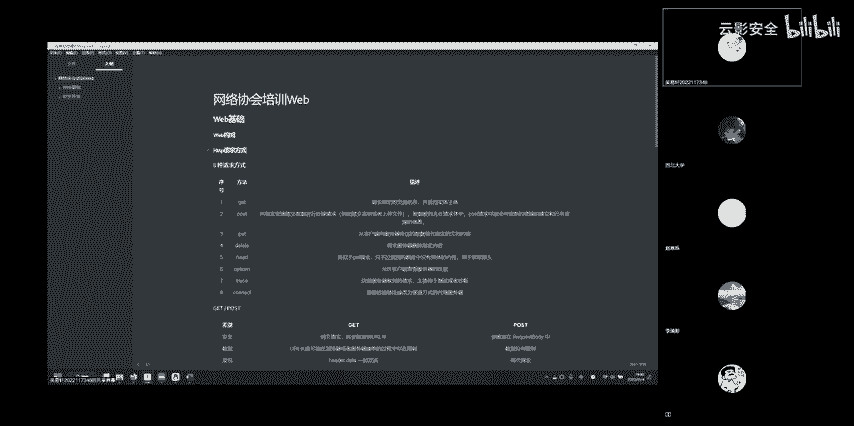

首先你一个web有什么东西，你首先能让别人能看到你，那看到看到你这个展示出来这个画面，你看这是一个轮播图，这是一个button，这是一个视频，底下一个呃底下一个文字。

然后这是链接能跳转跳转到对应up里面去。😊，然，视频点进去，这边能微微有播放微。

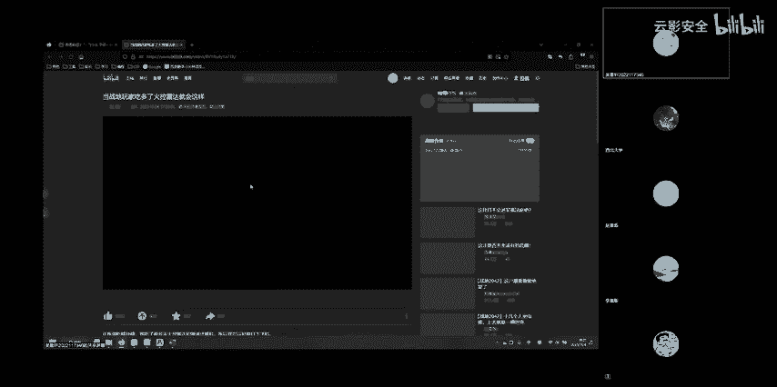

这边视频能够播放，那么这就是一个前端的东西。那么前端的东西就是给你展展示内容。就是给你用来展示内容。就是给你展示内容。那你要前端自然就有个后端。后端是干啥的？

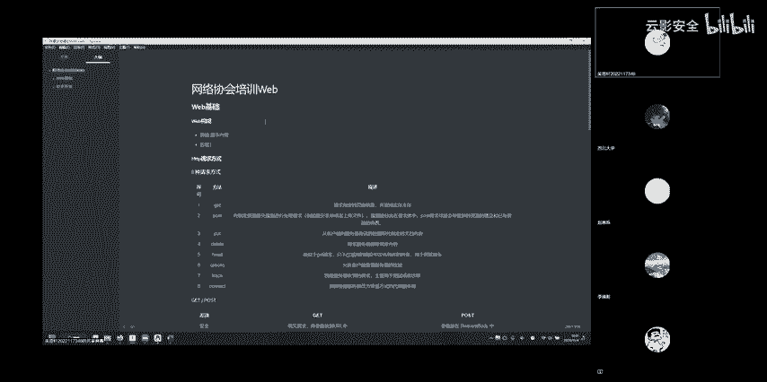

数据处理。你想。看假如就点开战记这视频，打开淘淘宝双十一红包。那他这把这个数据是不是就要先存放，然后后端给你发送到前端。像这个评论。他这个后端就要给你发送到前端，这个可能不太明显。呃。

拿百度这个百度这个翻译这个例子看一下，就假如我发给你好说翻译一下你好，那我会把这个你好先发送到后端，然后后端再通过方法，然后翻译成翻译成英文，再给我返再给我返回过来。

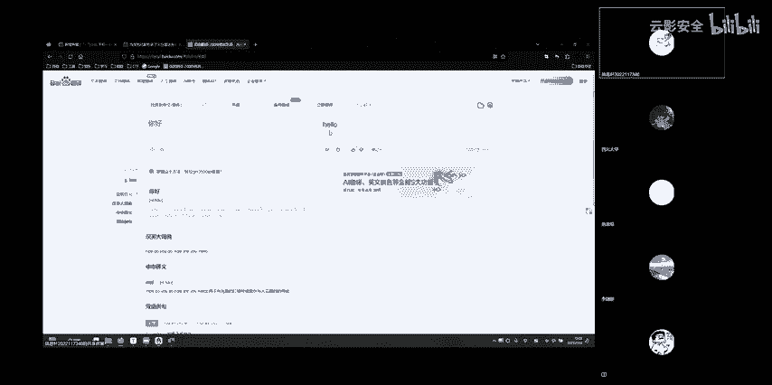

而后端就是处理数据。那么有后端，那前那个后端处理数据，我也不能就是文件存储，文就是存文件，怎么存文件，文件就放数据库。先说前段。那么首先就你们可能就是即便就是没有过没有接触过外博，也听过。

也就是稍微接触，也不是说稍微接触过外博，就听说过一个东西叫做前了300号。😊，HtMl。呃，CSS。Ds Cr。就是HTML就是结构化结构化的一的些东西，就像这是个按钮，就是八成。

然后呃就是一些标签画饰开开看一下。嗯，这边就是1个HTML的结构，像是个代ve，就是一个一个方框呃一个容器，然后这一个代ve再一个代ve，然后中间代ve中间的组方不同结构组成了整个网页的一个基本结构。

然后像这是body body，就是它的整个结构，开头就是呃上上面刚有headhead就是一个网页的一些引用信息一类。HTL属于一个超文本标记语言，严格上不算一个严不算一个严格的编程语言。然好看一看。

看这是个A标签，A标签就是像什么链接一样，就像我点它它可以给我跳转到其他一个链接。然后就是HTMLHTML是一个网页结构。咱们写一个吧。

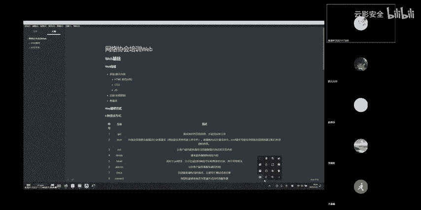

开一个。开 last quote。啊，我也好久没有写原创也是挺妙了。然后就比如写一个bot。然，再把这个网页bo，然后写个123中间。呃，当然这节课就是不是为了就是给你们讲H。

比如说给你们讲什么前端开发，呃，不不会去讲前端开发。这这玩意儿说实话。😊。

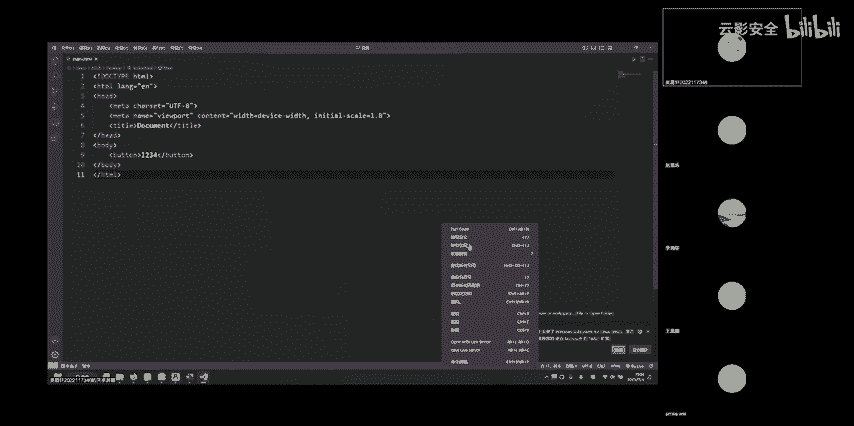

呃，不是咱们培训的重要目的，咱们只是目的为了了解这个网页结构，看像这1234，但是这1234他很丑，对吧？他没有任何样式。你看他这些这个玩意儿这个。😊。

这个包险是一个圆角的，咱们就可以在这儿，那就是HTML的下一步，就是CSS刚提到CSSCSS就。嗯，这儿写一个stll。这可以写一个，比如点BTN就是写1个GBTN的类名，BTN类名color。

看着写成R的。然后class等于B天。

咱们再看一下，看这个字儿字儿颜色就变红了。

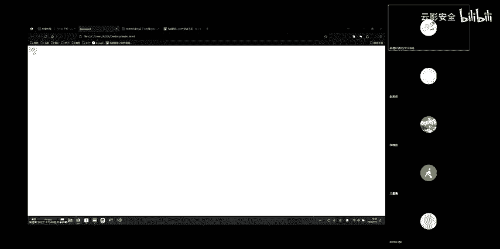

然后讲这个不是为了给你讲前端开发，就是HT旺是网页结构。CSS就是网页美化。那GS干啥？GS就是实现基础的功能，实现网页的一些功能。哦，咱们有问题随时群里问，随随时这个聊天框问就行。

然后实现网页的一些基础功能。

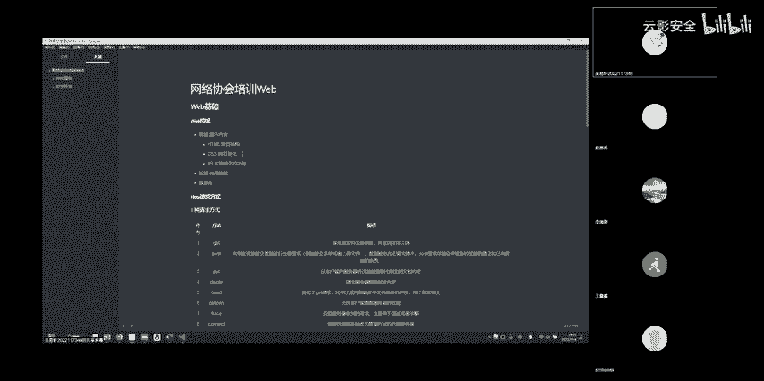

那网页基础功能，比如说我现在点这个按钮，它要跳转到某个链接去，它要去。比如说这边有个颜色给我变一下，然后播放播放个视频，显示显示个评论。

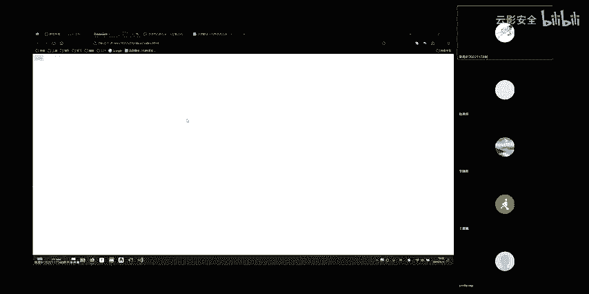

提交一个表单。那么后端处理呃后端处理数据，后端处理数据像现在比较流行的一些，说一些比较流行的，就首先是java。这就是目前最流行，也就是市面上最广的一个呃呃可以说是做后端的编程语言。

然后现在就是用的spring springbo springring boot框架。当然像什么分布式那些都。了解了解就行。然后像比较去近几年比较火的g，就是定框架定框架购那一套东西。

然后像比较老早期的PHP。GHT这个东西其实嗯怎么说这个东西这个语言GHT呃世界上最好的电程语言兼顾前端与后端。现在前端的发展趋势。

前一阵出了一个呃next点这呃前一阵那个nex点GS出了一个前端GS操作数据库的东西，那个东西就会把。😊，呃，又又回到了PHP以及呃GSP的时代。😊，天下大事分久必合，合久必合。然后PHP也是个后端。

但是这个东西嗯怎么说？就是现在基本上大厂是没人用，而且咱们CTF外部的方向的题目绝大多数的题目都是在PHP上。当然当然也有其他原像。😊，pythonpython像fllash框架。

flashask框架这个比较是比较长的，它有打章口。改go那个一般会用，这个一般是在工房里边会用的。像公房里面，你呃基本上最用最多就是python以及购这两个的框这两个呃THP也有工工房里面就这三类。

基本上就这三类。呃，很少会给你一个java漏洞上去修。一般给java给java给java的附件是会让你去代码审计，以后找到了他这个里面逻辑漏洞，然后靠漏洞去拿flag。

然后数据库数据库首先srcle server。呃，比较。VSE呃ZRVIVR啊，不管了不管了。就 circle口吧。然后。😊，servcle server呃，这是最古老的。

然后接下来又是mycircle结构化数据库，然后还有my circlerl这种就是呃数据呃结构化数据库。当然还有非结构化。

像什么缓存readdsRDS然后mongodB蒙goDB什么那些然后这些都不是讲，就是了解有些东西当然咱们CTF里面有一类最点有一类题就是ciirrcle注入那个很那个很复杂，那个很多。

有兴趣的可以去看看这个就是我之前写过一圈博客嗯。😊，嗯。这个里面也总结了，就是咱们CTF外部方向的，几几乎可以说是所有提的所有漏洞，就是可能会有的漏洞，甚么都有总结。只是这些漏洞去怎么组合，怎么去运用。

然后中间会有哪些中间键的拦截，就可能比较慢，服务器比较慢。

呃，中间怎么组合，怎么拦截。就另一回事。OK网络安全和外部漏洞。反这是PHPPHP就是弱类型，然后条件竞争命令注入命令注入，就像分手输入，然后什么叉呃叉SS。然后啊快人交本攻接，这属于叉SS。

然后命名柱像什么呃，来看看，我也忘了。然后文件包含就文件上任意文件下载，信息泄露，文件包含文件上传那些什么就是可能大家都听过一个东西叫我一句话，一句话问我。

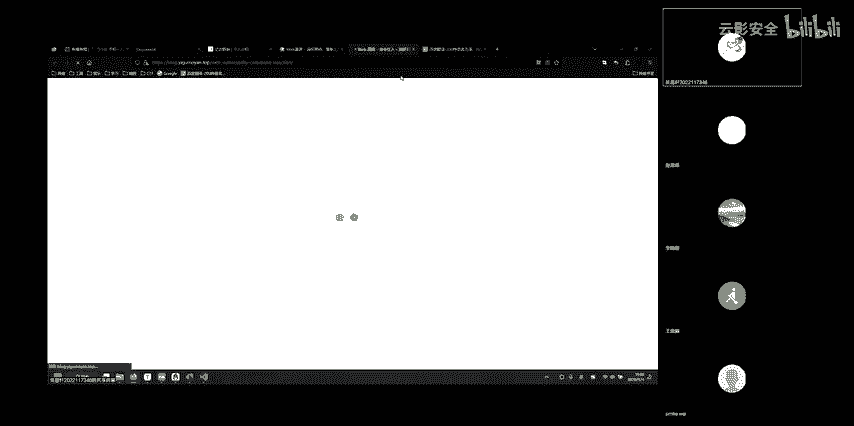

一休话木马。😡，啊，这个这个到时候有兴趣的，可以自己看一下。当然咱们到时候讲CTF外部的时候，会再先把这个拉出来一讲。😊。

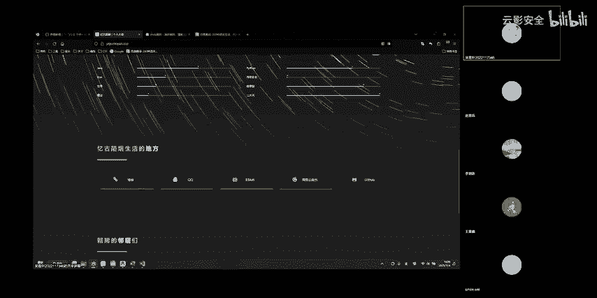

然后请求方式哎，这个是重点。首先概的请求。概请求就是嗯像。直接拉开看。啊，广州。这个就能显示出来。呃，所有请求咱你刷新一下。And post post A can' get。对。

3W点哔哩哔哩点comM，这个是待请求请求一些网页最基本的一些内容。😡，请求，然后他是请求呃请呃请求指定的。页为协议并返回实立主体。然后那么他那时我要请求，我要带点参数。

我请求的时候同知要给服务器一些那容。那么就是呃get带一些参数找一找有没有呃，这个看呃前面这不用管管GS什么，看着是一个futuresES呃。

futureES就是它要支持呃ES2015ES201202的标准啊global this flag等于这什么gate。都不用管。如果他如果就说是get传舱，直以把传舱说一下。嗯，传车。

那么呃get就是URL。12有就是网页网呃网页这个。嗯，这个怎么域名域名加上这个就是地址，黄页的地址。U2L加上一个问号，加上一个建职队，建职队就是KKY6。

那么建建支队就字典这个概念字典这个概念应该是很广，应该字典这个概念很广。咱们也让稍微说一下字典。😊，字典字典顾名思义，你们用字典是假如说呃不考虑多音词做好物理多音字的情况下，是不是呃我是一个字。

一个汉一个汉字对应一个读音，一个汉字对应一个读音，一个汉字对应一个读音，一个汉字对应一个读音。就是最简单的来讲，一个汉字对应一个读音。同样就是我现在有一本手册就就呃举个例子吧，就是。😊。

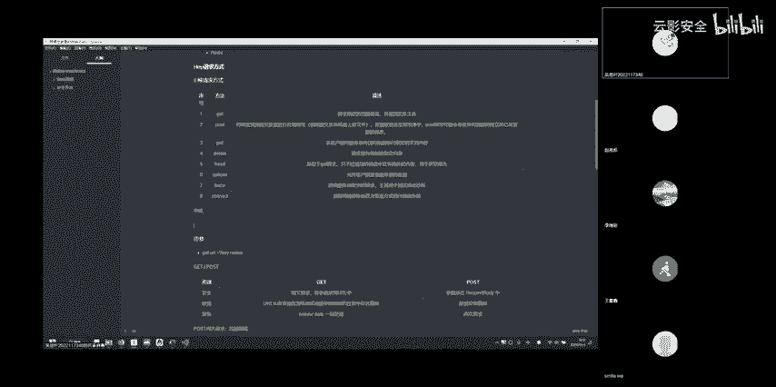

模式密码。😡，不尔生远玩十店。O看。呃，对，这就是一个字点。我一个A就对应的一个点杠B就对应杠点点。杠点点点，这这就是一个字典，就是一个对应的K值。

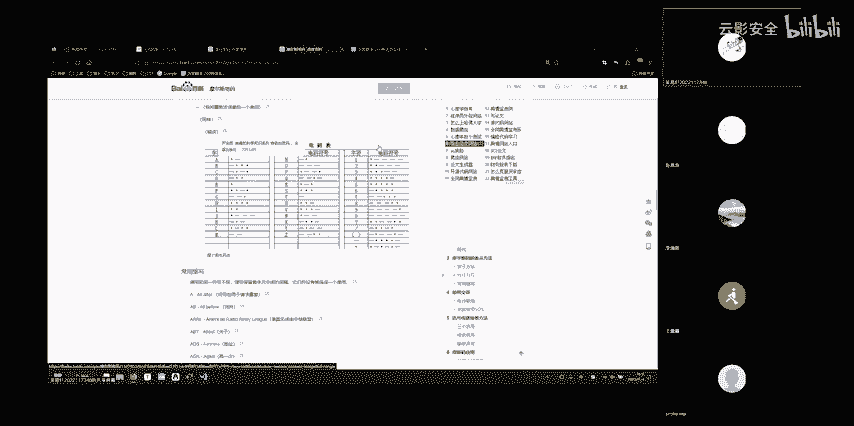

一个电的K值对应一个唯一的value值。那么我就可以通过这个K值来获得这个Y有值。同样这个就是那么就传进去个K值Y有值，那么中间就用。拼就用它来拼接案子来拼接。这个形成了一个get的传算方式。

然后for传单方式。posts就是向资源提交数据并行处理，一般就是表单上传文件，什么基本上都是post。那么post看一个。

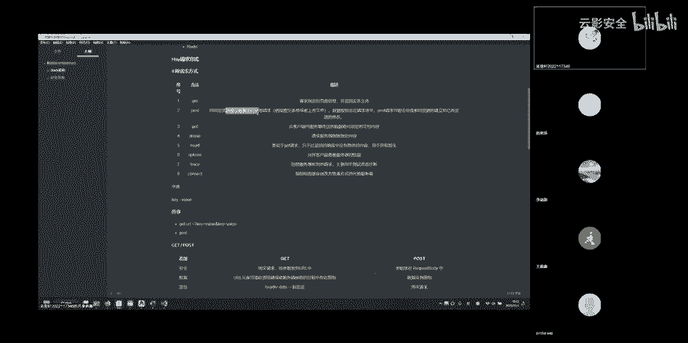

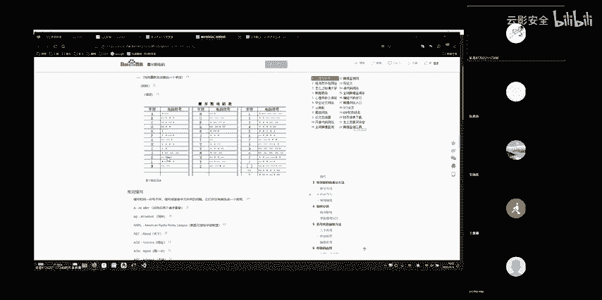

找一找真闹po死。嗯，看post就是一个post，它是呃先看一下它的URL。哎呀，这好像不太不太好看。这个这个稍微。我看一下。消息投请求 case请求向杨告师。哎，换换一换。去动态算一思。

动态应该多一些。找找有没有合适的。嗯。Post。他着po就没有提交数据那些。找一找。算这这种也这种也能说。就是首先他也是一个。它也首先有个URL，就像这个date点哔哩哔哩点com点log点 webb。

然后后面的话就是它也会传一些参数，它它也就是pos和get，其实都是都是可以在URL上面对一些partner进就对传一些partner就直接就是显示在URL上。然后它最主要就是有个。请求请求是在写在。

呃呃。re呃，request body里面request body是几个咋没有合适的。嗯。真那么难吗？嗯。像这都是就是配套呃，就是一些可能会存在过加数据加密或的。

当然就是看像这个就是刚这个刚就是刚刚提到建职队，看像这个呃BOVIPBOVIDST这是也不知道什么东西，就是它一个键一个K置，然后一个value值，就是刚刚提到的建职队。为什么没有合适的？那。

先写一个吧，再写一个。写一个。我我看再再写一个post。嗯，开个开始吧。嗯，Po to。这是个这是个这是个静态页面，这个静态页面就是没有中间用不到任何的，就说是数传奇数据的一些请求。

这种被我们称作为静态页面。然后像这种就是动态动态要请求一些东西。哎po APII这里面有哎，看这配套的，不管宣管它配套是啥，这配套里面其实就是个传了个jason进去，传了个jason进去。😡。

先不管他里玩啥东西，这里面就是有一个嗯。呃，他在请求题里面所携带的一些。数据。然后这个东西叫做jasonjason是啥？呃？javascript on什玩意儿？

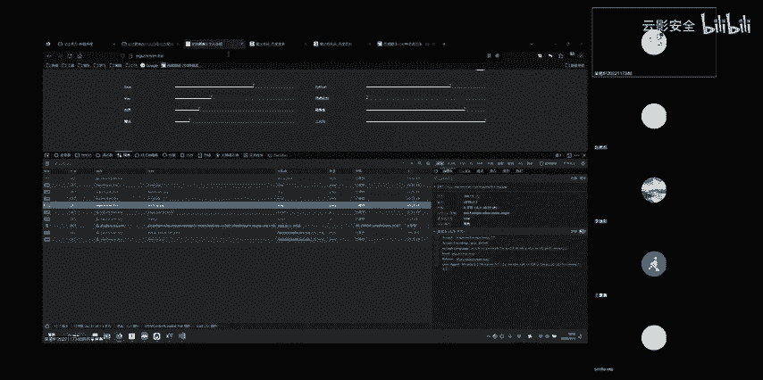

别想看一下。javascript objectject nationalal呃是一个对象语言，也就是刚刚提到的建剑持队的一种表示表示语言是吧？可以用。呃，是。一个数据交换，就是你可以把建制队一堆建制队。

然后当然建制队里面像你们C员也学了叫像什么有什么列表，呃，有有什么数组，那些内容都可以就是传放到jason里面。也是传递数字呃，传递信息一个很好用的东西。当然就是现在的呃像前后端中间交互，呃。

只要凡是用posts一类请求，绝大多数都是用jason就是纯数据。当然你这就是要涉及到呃另一个东西叫做content type，就是你的请求请求请求内容。像可以是application。 jason。

你也可以是form date from date就有可能会传一些二进制文件，然后 multi multi的什么。

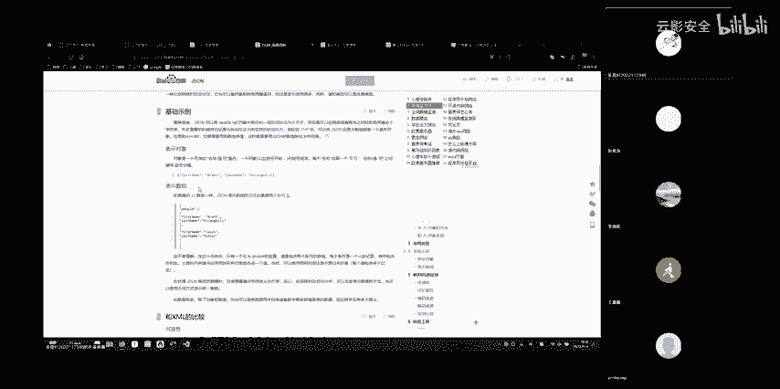

那个传一下二进制文件，然后post就是传一下jasonjason这个东西。Jason这个东西哎呀。得得得看一看。

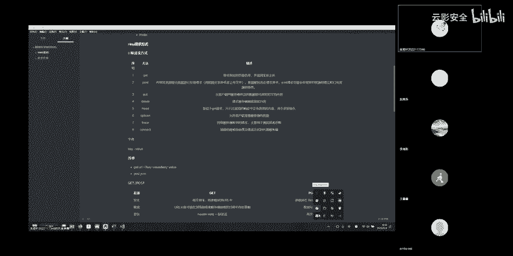

感觉就是光你们干讲，哎，这这就是一条jason，这就是一条jason。咱看看jason在线解析。😊，内生解析。追医生杰析。哎，这这这个好这个好看这个ID这个是一个建建经经典的剑职队，然后经典的剑持队。

这就是jason成绩的方式。呃，我我我前端向后端，比如说我这儿填了一个填了一个表单，第一行是个ID呃。没。在者好。有王表吗？就是第一行就是现在有一个表单，第一行填了1个IDA，第二行是type。

第三行让你填name。然后这填完之后，它就会生成一个这样子类似类型的jason，其实他是一个对象，和对象在给他用前端的一些方法来讲转换成jason，呃，转换成jason，然后再用一些方式给你返回到后端。

然，后端可以再解析这些jason或者ID或者tap或者name。你可以去给一个对象赋值，也可以直接就是直接读取里面的数据。页免加载错误。

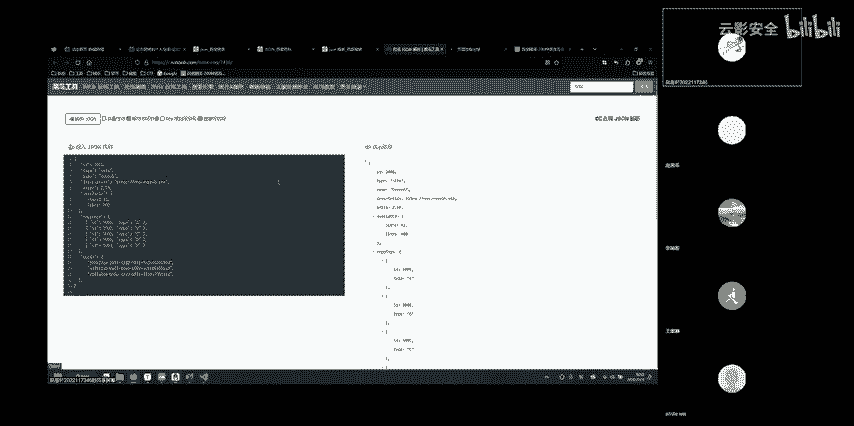

然后这是post，然后putput，其实这个其实如果你要说汽油方式只有两种也可以，就只有get和po，这是最常用的，也是你CTFCTF外部里面只考，基本上只有get和 post。

然后剩下几种题剩剩下的剩下再再把它再分类。我把get post和put和delete这四个分为一类，它是一个rest请求协议。

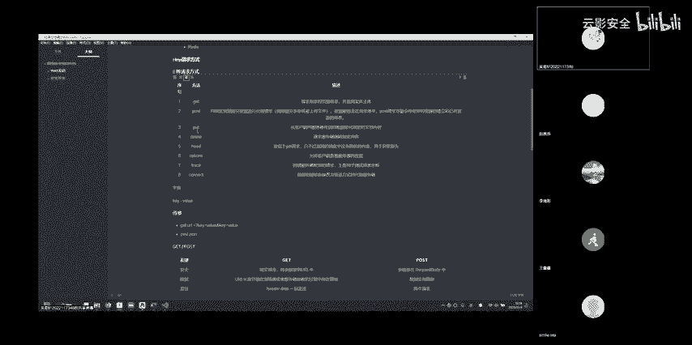

For restful哎 yeah。还有S7。对，retful是一个就是外部框架，也是一个接口接口开发的标准化。嗯，基础的数据有什么？哎这个大矫正吧。基础的数据，首先你可以对一个数据进行以下几种操作。

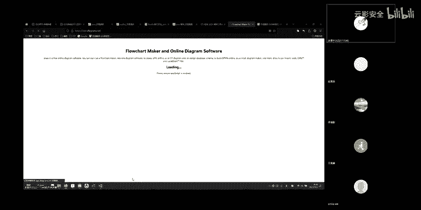

呃，对一个数据进行操作的话。对。对一个数据进行操。操作首先你可以增加。就是就就拿数组来说，当然应该你你们自里人应该学到数组，就拿数组来说，我现在有一个长呃，我现在有一个数组，我现在我给你们添加一个元素。

一会增加删除。😊，删除。😡，删除就是我要把这数据这个数组里面，假如我要把它第联个元素给它删掉，就删除。呃，修改。当然存用方式不只止数组，数组只是拿来举个例子，会有增删改。然还有个那增商改完就查询查询。

比如说我要查询AA这个字A这个叉叉这个叉A是不是在这个数组里面只有增删改查4个最近。那么这个增强改差又效分别对应了get post pull和delete。ge就是呃ge就是我现在要再从数据库里，呃。

就呃我现在要从数据库里单纯的读取这个读取数据。就是一个干性球给大家看一个项目。看一个项目。😔，呃，先继续说它接启动。那么概就是我要查询数据，我可以就是向服务器发送一个get请求，查询到一些数据。

我要增加数据，我向服务器发送一个pos请求，在pos请求体上就是quest body上面携带一些数据，呃，携带一些数据。那么我要put put，就是我要更新对数据进行一个更新。

就比如原来小明小呃原来呃小明13岁了，现在要给他改成14岁，那么就要进你发一个put请求delete请求就是我要删除一个数据。

当然是put呃post put呃put和delete在CTF中基本上是见不到的。😊，呃，这个等一下啊。呃，咱就咱就咱就拿这个项目来说说，就是呃当时当时在呃大家应该就是参加过第一轮面试。

第一轮考核的同学应该收到过一封钓鱼邮件。那个调邮件就是我给大家发的。啊，咱们拿这个说事儿。呃，像这个其实还涉及一些就是说软件开发的一些架构一些的。当然今在那不是今天重重点看就像一个fo。

就像呃为什么这儿放一个put，因为我要修改数据啊，你们点你们点击了那个点击了链接，然后链接到访问到固定的页面，我是不是就要涉及到一个的信息，然后再对数据库里的对应信息进行一个修改。😊，进行一个修改。

那为我修改的过程中就要用到。P。这个这个不是很全，找一个稍微全想哎这。这个。按这个想法，就是之前自己写在写的一个项目。呃呃。到着。这样看。呃，这是一个get get get这是一个get请求。

get请求就是通过ID获取来获取管理员。像post就是插入新增一个管理员，post就是更新管理员。然后delete删除管理员，这就是就是普通的rereful协议，就是在我们正常的开发中。

这已经成为了一种开发标准了。哎，当然不遵守我也没事，不遵守，你说不遵守我项目能不能写出来，那肯定都能写出来，我咋都能把项目写出来，那就是单说单那样就是矢山代码，就是大家可能喜闻乐见的史山代码。😡，呃。

维护性很差，而且就是对于一些项目的接手以及版本版本迭代那样子。可行性很差，所以说都不推荐那样子己。

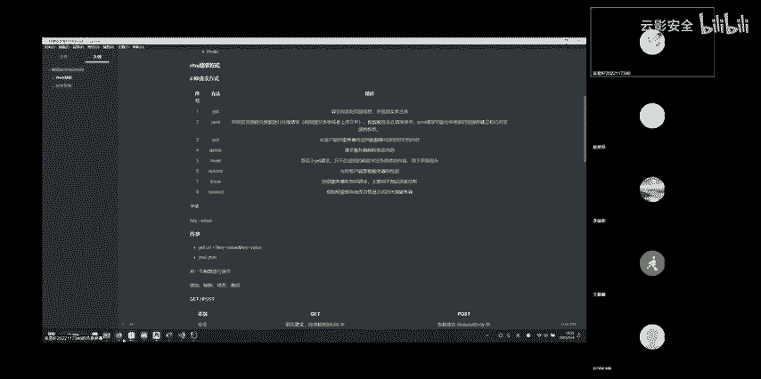

那，这个看看好。

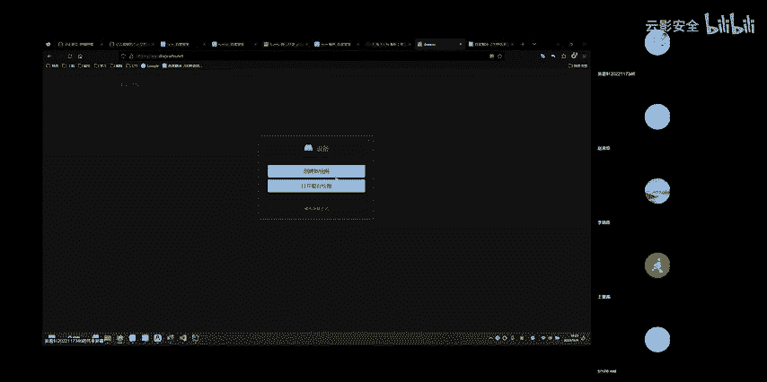

这个开始等会用嗯。然后剩下几个其实咱们一般用不到用不到，就是基本开发中是用不到，所以咱们就不说了，有兴趣的同学可以自己去搜一搜了解一下。😊，好，咱们现在说一下。盖头碰头去。

重先安全性。首先就说是刚刚那个请求方式。呃，哎，看这就是一个get请求，get请求看百度呃IEUTF呃是LERE。UTS8就是文件编码和达国D就是我我查询的我查询了什么内容，然后查询的是ra斯ful。

就是一个干铁球，然后咱们在这儿看能他能发一个线上的pos信给，我看一下。

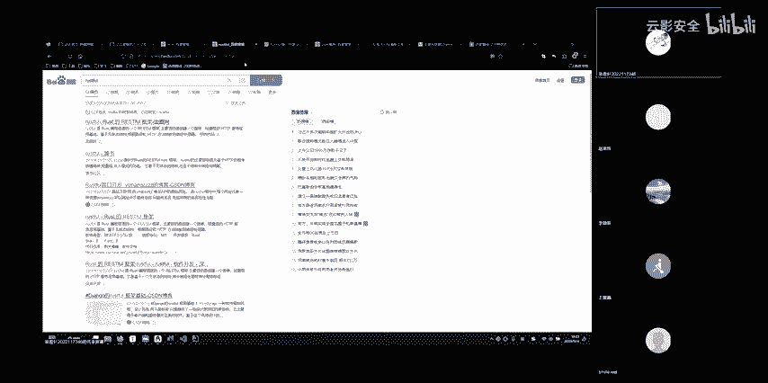

呃，没。3间没有了。

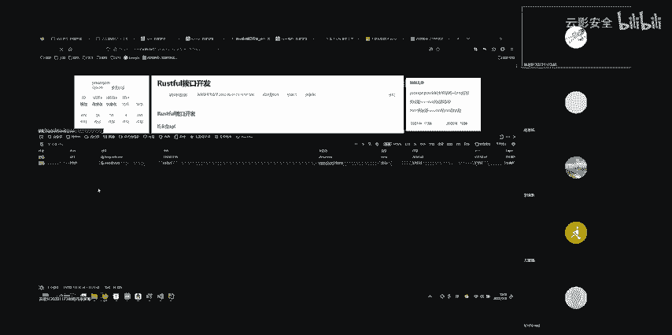

Poter。哎，看这这这这就是一个就先不说他s请求，先看他返返回来的数据，它呃后这是后端返给前端的一个数据，后端返给前端，这也是一个jason格式。呃。

这么看就是这个看是浏览器就就是这个火狐已经给咱们解析好这个格式更加方便阅读像code返回呃就是200me success然后 ID ID就是我请求的这个标准唯一ID会产生一个UID一个东西就是怎么访问就说是我在访问这个东西。

这个内容咱们一会也要讲，咱们会讲一些其他的技术来做这个然后d是一些可能它会传一些数据吧。这个咱们也不清楚。😊，再看原始的原始的这个东西。这些这个就是刚刚咱们提到的这层数据，这是建支。

然后这个建建一般都是。呃，建建的数据类型一般都是字符串型。然后值你可以像是一个数字，你可以像是一个字符串，你也可以像是一个数组，也可以像也它的值也可以像再是一个jason，像这个就是date date。

它又指向了一个jason，又指向了一个jason。当然这个也其实也是一个开发标准。开发标准像code就是它的请求返回类型。

这个在rastfulreful开发开发标准里边也是定义过的code也是返回请求类型message就是请求返回一些数呃问题。然后d的就是最终的数据。当然是tra IDD就是tra IDD是它这个CICN。

这个网站自己定义的一些标准标准内容。

咱们继续。然后。呃，get就是铭文请求，就是刚刚看的就是上面打一个问号，打一个问号，然后KYKY，然后pos它就会放在。

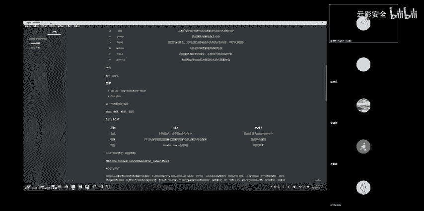

放在柔干细胞那里，刚找还没找到。😡，哎，这这个这个就这个得啊，他这请求他这请求，这就是request body。request body里面就有这么多数据，他会把这些数据发送给后端。

这这也是也是一个jason，也是一个jason格式，然后都可以用刚刚那个jason解析。

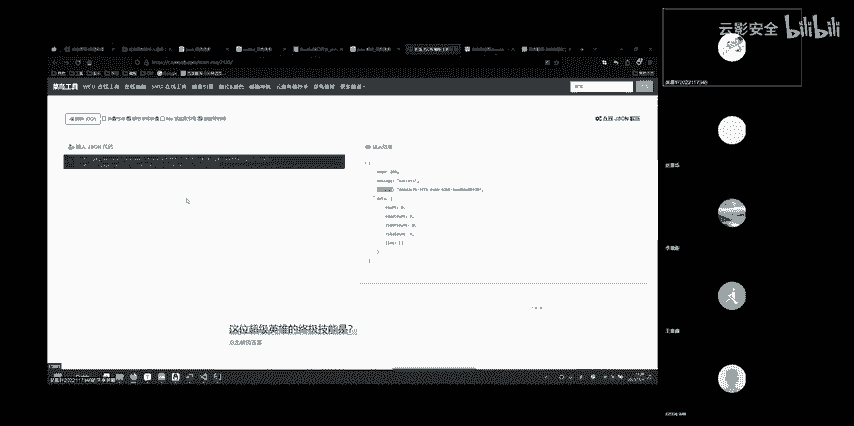

来看看这个标较长。啊，也能解，就是这个解析来看一看。然后数据URL的长度会存在限制。呃，对于这个数据问题，就是。你U21长度可能会存在限制。这个有时候可能是浏览器限制，有时候可能是就说你服务器。

我在编写的过程中，我收集参数的存在限制，这个不是很好不不是很好说，就只能说存在，可能会存在限制，当然也可能不存在。你对对于你看我对于火狐，对于corme呃他们之间的限制都是不一样。

然后post post的数据是没有限制，因为它存放在了request body中是没有限制。然后发包这个东西。像head和date是一起发包的，但pos实际上是有两次请求。

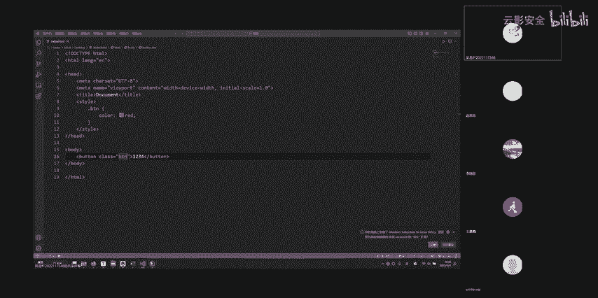

post有两次请求。嗯，咱们找个地方看一下。

呃。我那个软件跑不起，我那个程序跑不起来了，现在。😡，我看能找到。post是有两次请求。嗯。呃，Po。哎，写写一个先写又先写一个。🎼嗯。嗯我想想。只有两次请求。😔，不是很好找。哎，其实对对对。

这个就是这个就是postt透两次请求。你看它这两次发送的是哎，这也不是这个发送内容不相同，它两次发送的内容应该是相同的。直接看他这个pos两次请求是因为一个同源协议，这个有个公众号想调好，咱先看一下吧。

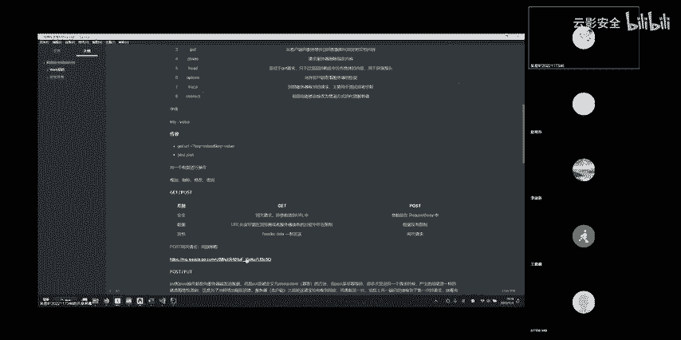

一会儿说不定又找到了。po则是一个椭源策略。哎，就这个图。嗯，新者千年。看这这块就能看到，这是Qq few list。呃，这是就能看到是一个pos两次请求。后s两次请求，它这个。嗯，哎，换别的。

他的这一次请求和这一次请求是完全一样完全一致的这是一个同源策略。为了保证中间数据的一个一个一一致性。一个是数据的一致性，一个就说是。呃。嗯，一些数据请求流程，这个大家可以。

私下到时候我会把这个文章发到群里，大家可以私下看一看。

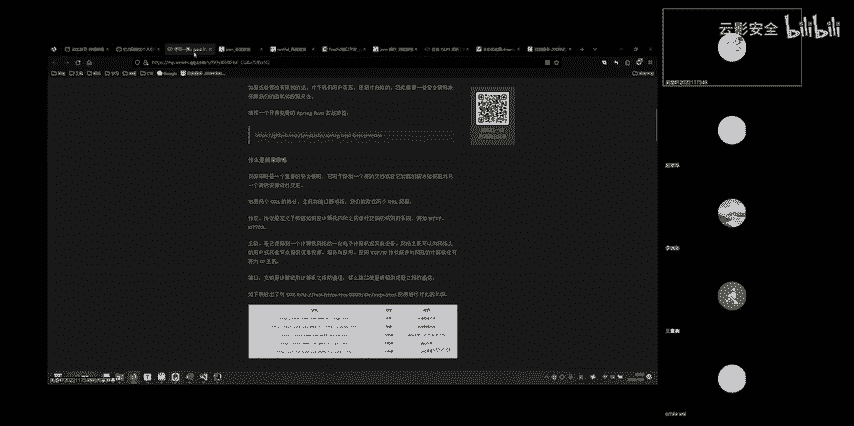

然后破s破的方法。负责负其实就是一个密导方密导方法的区别。就是你像我现在就修改数据，我我现在修改数据可能出间因为各种原因，比如什么延迟卡顿。各种原因嗯导致我前端向后端发送了两次数据。那么就是那么就说呃。

就是像就拿交易来说，交易业务就是交易了两次，但只结算一次交易额。但是putput请求的话就是两个请求。如果如果两个请求完全相同的话，后一个请求会拿把前一个请求来覆盖掉。但是pos请求会产生两次请求。

所以说我们一般就拿put来put来修改一些文件资源。

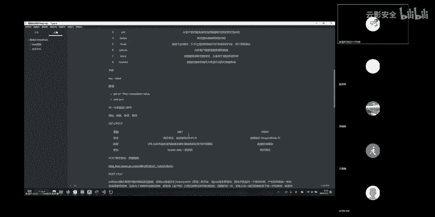

其实这个基本上的一个外不构成。然后看能不能找一个例子，咱们说一下这个问题啊，有有有有有有有有一个想想了。

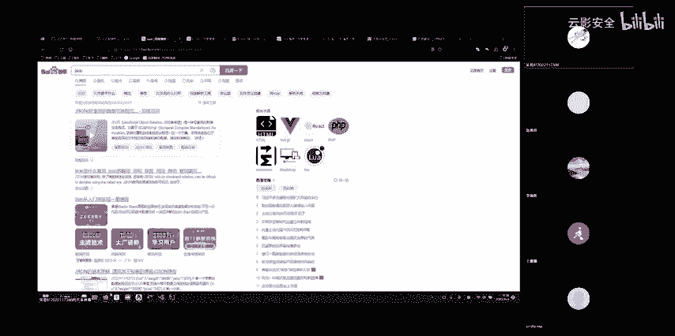

我找一找。启动。嗯启动好了。St st shirt， Skying cops。咱们启动一下，这这这个这个这个项目是个半成品，但是够够用。哎，刚好这这块给大家说一下这个问题。

看看这个action就是identify，这说明就是呃说是web server few to start的port8080，我 already used那个8080是啥？

那首先我服务器我服务器是不是首先会有个呃我会有自身的IP地址，然后我IP地址后边会跟一个端口号。这个8080就是我电脑端口号，因为我电电脑8080端口可能会就是现在在一个微商6的状态。那么怎么查。

就是n sit it。呃，网络状态AO然后放 the strain。on the screen8080。就是像我这个8080，就是它的PIDPID就是现成开的是这他的任务现程开的这个值。啊。

我现在关掉这个务现程，我就得用管理员。管理员模式的这个tnel。Tex Q T Q。嗯嗯。

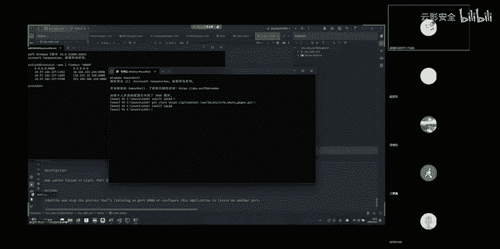

啊，这个这个关掉，就个把8080端口就完事关掉了。然后咱们再启动一下，这就是一个后端，这就是刚刚提到的用java springbo写的一个后端。然后这个后端采用的就是像这种分资源形式，分了三个模块。

分为就说是像一些普通模块，普通模普通的。要像一些。像一些工具常量异常定义，jason，像是jason，就是jasonjason jason的一些就是接收方式。这个为啥报错？

因为我这个JDK版本可能有点问题。然，就是和一些就是说是它sbo一些特性的一些注入方式。然后这个propro就是呃。属对象对象的一些定义。然后。s就是服务端的一些定义。我还看看。像这个就是注解反射设置。

然后controlll就是一些服务层，服务层啊，就是所谓的MVC的C层。conttrol是控制层。控制层应该说handleler就是呃一个中一个全局全局异常的一个处理。然后这个是也是像这个是拦截器。

就是开发思项里面呃，mer map就是和数据库对接的一些和数据库对接的一些东西。serviceservice就是嗯服务器服务端服务层就是一些业务的具体实现逻辑和服务器和数据库一些要对接的一些业务的具体实现逻辑。

一般写在service层。

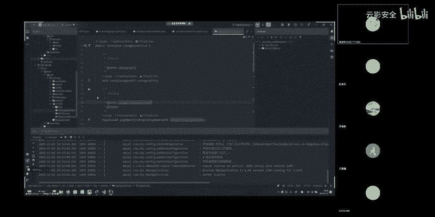

专门访问一下。

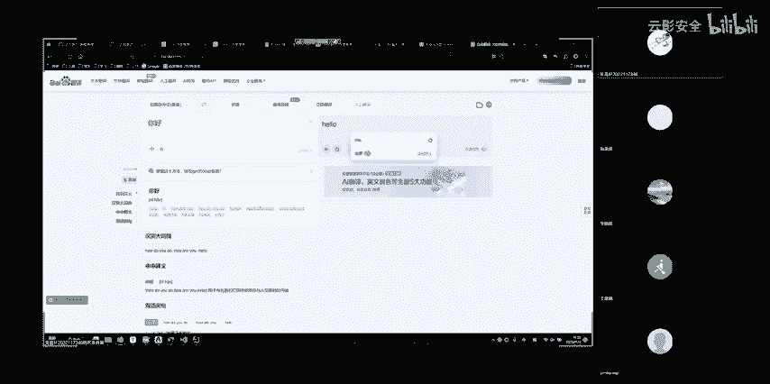

瑞娟呗。呃，这个127。0。0。1就是你本机IP本机内网的内网本机的IP就是127。0。0。1。你可以否就像刚因为刚刚我开了一个engg。N着服务器。所以说我本机本机是存在一个服务服务服务的。

然后账号密码登录一下。

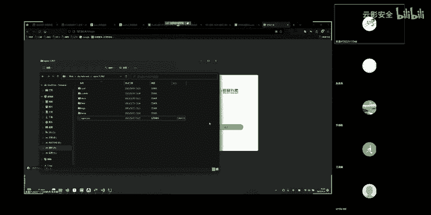

咱么这个这个项目应该没写多少。看看了。😔。

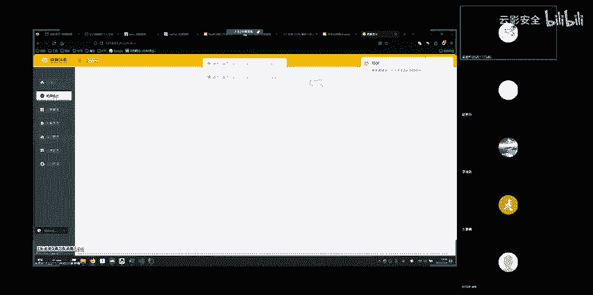

来分类管理，这应该可以。刷新一下。都是盖方法新增一个。咱们新增菜品分类分类菜品分类。我看这格试试。分类类型。新增菜品分类，那新增套餐分类。诶。😊，什么意思？像品放类比如飞机。还是一。

也名称包含特殊字符啊，看这就是一个前端校验，也是安全开发中的一个问题。就说是这里我就校验，我必须让他写字符串。嗯，那随便敲点租场吧。他们就不包含特殊字符呃。看几下。啊，只有发了一个pos请求。

美团这为什么没有没有没有显示显示来二次请求？二次进去没有显示二次进要看，这就是发送jason。就是刚刚刚刚我。😊，刚刚我的昵称就是name你好，然后st就是刚刚那个排序排序内容type就是一。

然后这里就状状态状态，这里就是这个应该对这个type应该是状态的意思，应该在这里面是状态。这个项目也是往上扒的一个项目，自己自己看着玩。Thank。然后这个pos请求为什么看不到两次，换换浏览器时。

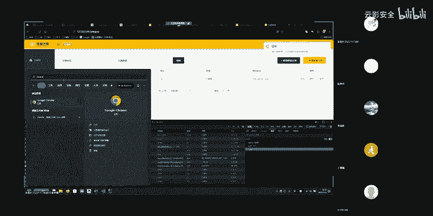

然后顶播看一下。看呃，看刚刚我是在没有登录状态，我反访访问的这个链接，它会自动给我跳跳转到lo根。这也是一个权限管理登录的一个权限管理状态。一会儿咱们也会讲具体是他是怎么做的。

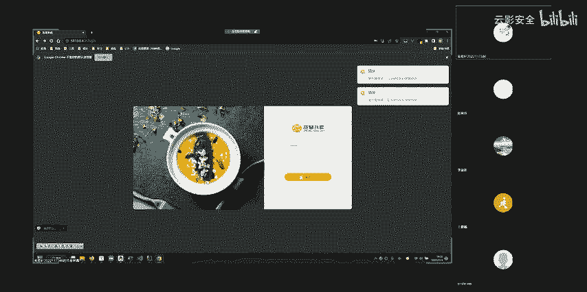

物业管理看看他能显示出来。嗯。因为这个项目是个半成品，所以说就好多好多功作没有。哎，他为啥显示不了嘞？他为什么显示不了那个两两双重的那个pos的请求？那个一般会在什么时候显示？

比如说是你跨域数据异常的时候，就是你像我这个127。0。0。0，我现在属于80端口，我现在想去访问8080端口的时候，这中间就要一个有存在一个跨域问题。但在这个跨域异常的时候，他会在第一次请求的时候。

就会直接给你拦截下来。就是这个数据不通，它会直接就是不允许请求的。

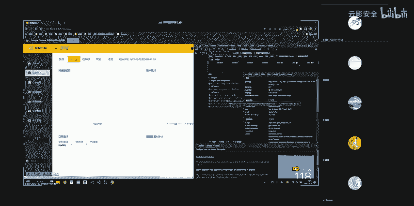

但我一想他他这个。没有显示帅就没有显示帅吧。大家就看刚刚那张图片虽然有点糊，但是等哪天等哪天我再遇到这个问题的时候，我截个图发群里，大家可以再看一下。只有最基础的pos和get紧球。这个项目。咱们看看。

啊这是个posts，是get。delete就是删除分类。删除分类就是刚说raful里面的一些内容，让put。那那刚刚又说到一个问题，呃，刚刚说到那像一个项目，还有图片这个图片那么数据库。

那还有一些像一些云服务平台。云服务平台，比如说像青牛云呃存存存存。呃，提供的一些存储服务。就像我图片。呃，那么多图片不可能全部存到我自己本地服务器，那么大的视频。一堆假如我现在做一个B站出来。

我B站我那么多视频，我不可能全部放到我自己本地服务器。本地服务器那硬盘肯定不足以维持那么多视频的存放。那我就可以把它放到一些公公共的云平台上当然当然我这个例子只是这么举个例子。

像人家B站肯定自己搭着有这种就是专门的存储性服务器，不可能说是信用国内现国内国内咱们国内用的。像咱们自己的项目就可以使用像。😊，牛云。信牛云。我阿里云阿里云OSS这样存储腾讯云这些他们都提供这种服务。

呃，大家到时候可以去官有感兴趣，可以去官网上看一看，这些都是开发中肯定会遇到的一些问题。这都是一些的其中的一些解决方案。还有什么？我看看还有什么内容。呃，就请求方式基本就写，咱们说一下开发安全。

开发安全，首先是邮件安全，就是拿咱们拿我给拿我给你们发的那个调邮件取例。😊，首先怎么辨别一个邮件是不是调鱼邮件？第一点，发件人发件人，我这上面写的什么呃，XYTCH然后咱们再看一下咱们群里的。

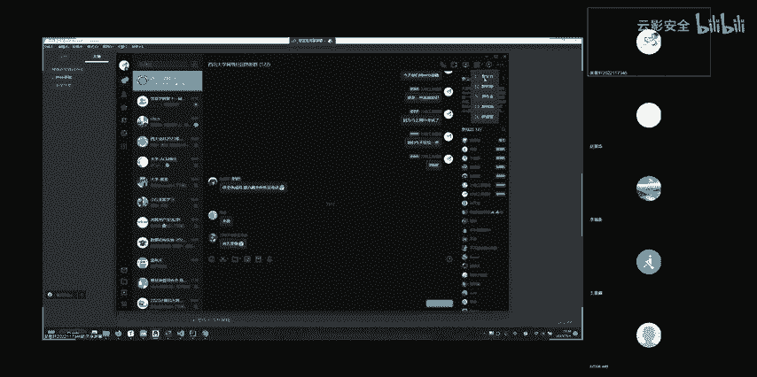

当时咱们当时你们给我们发过一次邮件，是这个筛选第一个问。对，然后是西安云影泰就是西安云影科技。呃，西安云影科技，然后咱们的宣传册上应该也有也有我们呃西安云影。但是西安Y外TSH我这上面写的什么？

文页上面写的什么呃。哎呀。我这上面写的是西安TCH我这门我还上了两个字符。😡，啊，大家可能收到运营不一样，因为大家可能收到两个邮箱的，因为一个邮箱被我发爆了，然后我就转们换另一个邮箱。

然后后面这个什么PROPOTO文也是我在我随便找这个野邮箱，结果发现他QQ还不拦截，所以我就直接用这个邮箱发了。然后接着就是称谓正常这呃邮件的一些内容格式。首先像一个正常邮件。

像什么就说称呼落款什么都是要有。像我这个邮件毫无格式，就是一个西北大学网告协会啊，这务一言钓鱼，然后以及就是链接。

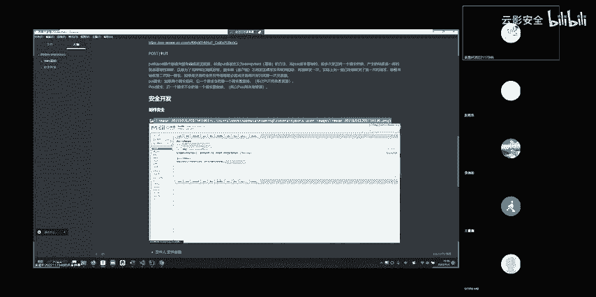

这个链接这块我还专门你们可能收到的链接是这个最后你们发会发现跳转链接EMALemail点。对。

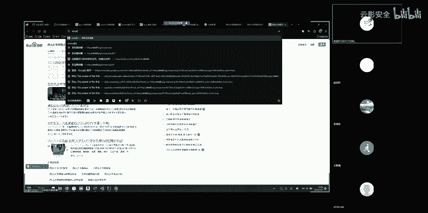

对这个链接。你们收到的是这个链接，但是我这发的链接是什么？我这放的链接是C点NXW点so杠车落码。这串勒码就是我把这个长链接缩成了个短链接。

短链接提供了1个302的1个页33呃3302301的一个页面重新像服务。

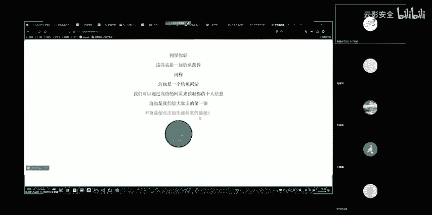

呃，关于这个链接问题，呃，就是短链接。然后可以看一下。没连接。

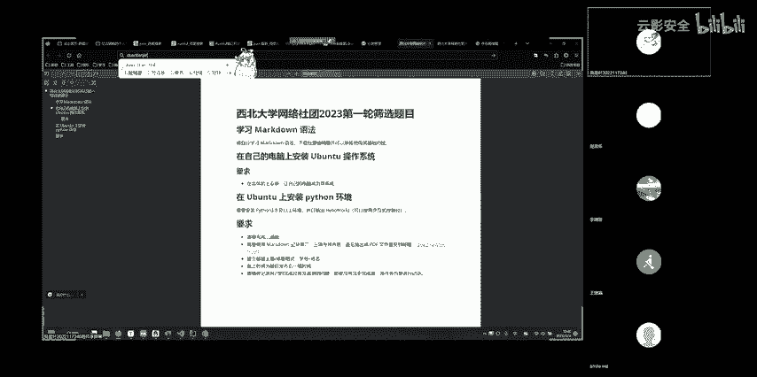

按短链接生成入口，咱们先什么是到到底什么是短链接？看比如说我有个U2L，我有个这么长的U2L看着微信Q微信，就是微微信公众号估计是一类的。像这么大长H串，可能是一些唯一标识码的。

然后你看从这开始又是一些get请求IDXSN哦，因为有些服务器它是不支持，就是有一些呃开发模式是不支持get呃，只支持post这个一般是一些个例，像这个U2L很长，不易不容易易读。

所以会帮会将U2L转移成。转移成这个短链。然后当我们反反呃当我们访问这个短链的时候，它最终的效果和URL是一样的。

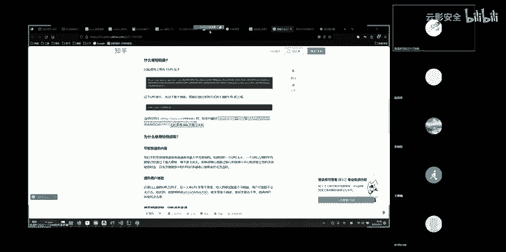

其实就是做了一个重新项。嗯，咱们。想做一个。

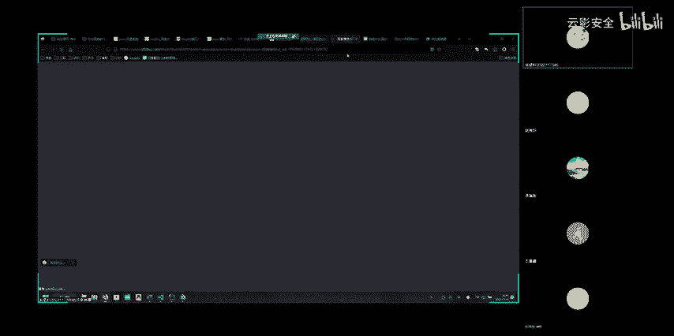

这基本上网上都有现成的，就比如就比如说。呃。别让吧，就别让。😡，哎，还要登录，真烦。免费转连接。啊，这个生成了。看呃，我刚刚那个链接可能本身自身就比较短，所以它生成可能没有什么优势。

所以说咱们现在在访问这个访问这个链接，它会中间做1个302的服务，咱们看能抓到这个。可他中间还跳转了不止一层，它中间还跳转了不止一层，可能。😡。

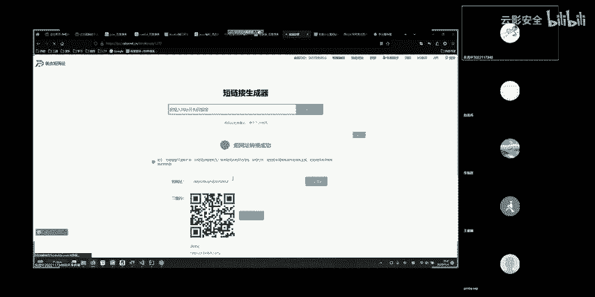

看他又会跳转到跳转到这个。呃，B站这个上面，他刚应该只只跳软一层，突然只做了一层。因为刚刚我点了一个圈，他请求暂停了。

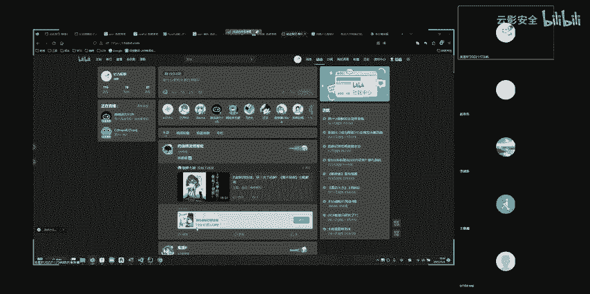

然，我继续就是邮箱一些邮箱安全，就是遇到短链。呃，短链首先就是能不点就你能能不点尽量不点。如果说你非点不可能，也是有办法的。咱们可以你可以通过一些招包工具，抓包不像什么buber soap。

bu soap，咱们这节课不行，咱们到时候会讲，咱们会在就是讲CTF一些外部题的时候，那个buberci肯定是会用到的。😊，就是可以来抓到你中间那个重新项的过程，然后看出分析重新项，然后达到链接源码。

我为啥没有放，我又为啥没有直接放我这个网站链接，一碑点靠谱。我我这么大ID在这顶着呃一眼一眼讲。😊。

对，邮件称尾，然后数据加密。然后这要数据加品。首先咱们之前让你们十分痛苦的密法学。就是数据加密里面一个很重要的地方，像呃那个最重要的IA加品RA的非正生加密。其实在这个项目里面我也用到了。

咱把前端打开看一下。😊，RRC的数据非对称加密。

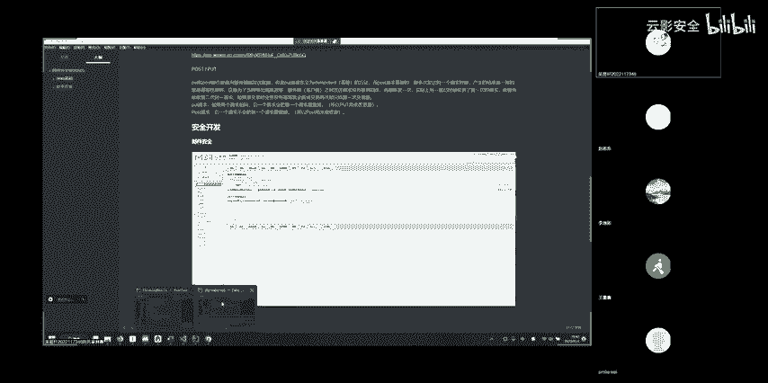

嗯，哎，咱们可以先稍微看一下，也不用不懂，也没关系。这样我先传回来一个优er对象，其实传回来就是一个jason，但是有jason他总帮我解析成这个对象。然后假如这个被点击的时候。

就到sorry到服务层服务层执行这个代码。然后在他的服务层的接口后的实间层这里。如果说你你想对我这个网站进行攻击，首先你已经通过的各种加密方式。哦，对，这个加密方式中间。这块就讲一下吧。

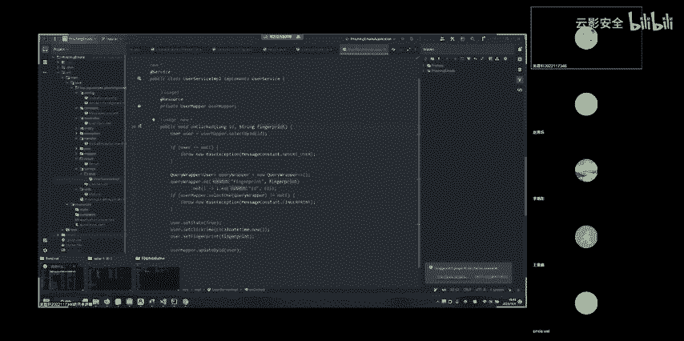

呃。刚刚解给关了。被GIO给关了。

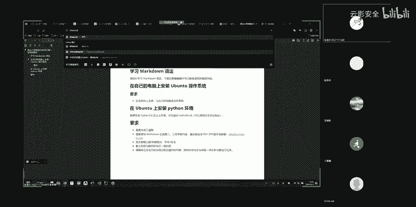

快点快点快点。

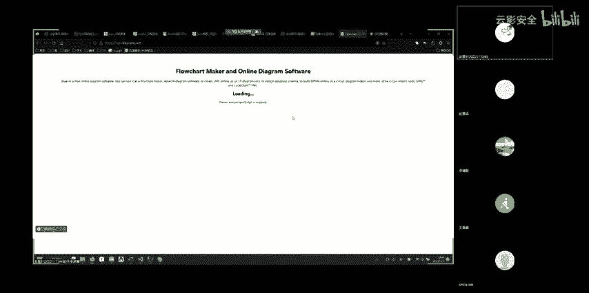

就加密方式，我中间做了做了一层ICA的数据加密宵验。我看看啊。呃。看le了。诶。😊，嗯，这是RSA数据加密的一些工具类。这这种代码都是网上有现成的，直接扒开来就能写，搬下来改一改就能用。我找了是吧。嗯。

这个就是像刚刚说到那个跨域问题，跨域问题。那么就说我现在开了1个8080端口，那么假如8081端口相仿我这个网站怎么办？我就可以配配，就是去对这个coursese进行一些配置，可以解决这个跨域。

就是放行哪些请求方式，或者信号放行所有放行所有原始头部，放行所有头部文件。当然这样子，它的安全性肯定会有降低。但是说实话，这个体量级的项这个体量级的项目呃没有必要。而且这个毕竟生产环境嘛。

生产环境实际上呃毕竟现在是生产环境呃，开发环境呃，如果正式放到就是公司的运营环境的话，这个肯定是要改成单一域单一的。Yes。哎，我把那个注注入手哪去了？我想我不上了吗。I see。I有求1点底。哦。

我这哦我这我我没有我我我没有写成拦截层，我单独写了一层。😡，我单独写了一层啊，我首先我这有一个这个指纹技术，指纹技术，咱们等会再说。然后这个指纹技术首先我先对指纹技术进行一个解密。

如果这块说是我能把这个指纹解密出来。

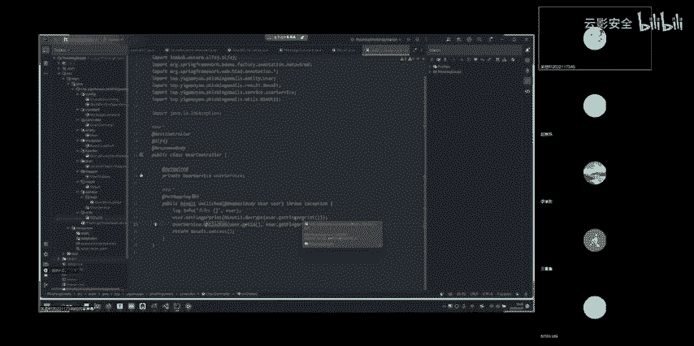

太好了。那，太好了。首先这有个指纹。你们不用管指纹是什么，只要管它是个字符串。😡，自符创是什么也不用管，就是他一句1个1个TST一句，你比如说是个122123，但是123是它加密获的。

但是呃然后加密获的，然后咱们中间先做先做一层IC。😊，呃，先用IC进行一次解密。先用ISA进行一次解密。如果说你这个IC解密通过，你解密通过。前面如果通过的话。解密通过。

我可以就在执行执行执行以下的操作，就是执行什么修改数据库呀，执行一些内容。那如果说我解辑不通过，我解密图不通过，是不是我就可以说是你可以通过一些修改数据包的方式来对对我的网站发起了攻击。

修改数据包的方式。但是你有没有破解开我这个IC的加加密算法，所以你有没有破解开我这个IC加密算法，你就随便编造了一个随便编造了一个。呃，字符串来对来对我这个后端进行一个请求。呃。

但是我我拿我的私料没有解开没有解开你那个数据，所以说我就可以认定你是呃你是一个非法请求，我可以直接把你拦截下来，以免对我的数据库进行一些进行一些攻击。这做了一个密码密码的一个加密。

当然就是这个IC的算法，其实它这个运行速度其实是很慢的。就现在你对呃数据量很大的一堆数据进行IC加密，它这个时耗时是非常长。所以说像还还会有就会还有一些高级算法，高级算法，像什么椭圆椭圆椭圆算型算法。

😊，那种也是做非对程加密，还有机器码机器码算法。都是一些机器关于机器码的一个算法，就是都是一些对数据加密进行一些算法。当然这些东西在CTF里面都没有用，都没有用。这节课咱们只是聊聊天，呃。

知道有这么个东西，呃，知道这玩意儿可以这么用，可能会有可能以后开发中你们会用到。😊，没有什么强制的要求，说是CTF中考核呃啊咱们考核也不考这些，咱们考核不考这些。

咱们考核到时候到时候我们给你会给你们搭1个CTF平台呃。我们会给你搭1个CTI平台，像类似于。

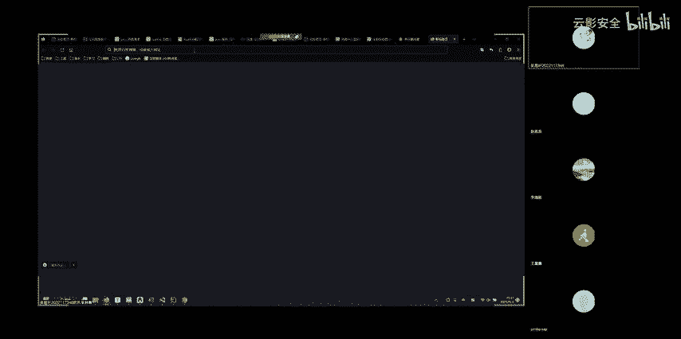

会给你们搭一个类似于这样的平台，类似于做一个类似于这样的平台。然后里面有题目，里面有题目，你们到时候就在里面做题提交就行。然后你们到时候再在里面做题提交就行，就是考核形式呃。

不会去给你说出一份出一份出一份卷子，做那太不了了，也违背我们本身工程化的工程化的初心。

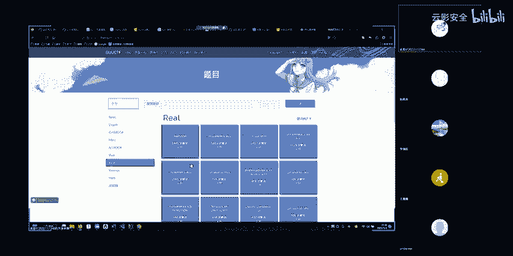

然后这是输入输入密码密码这一块。当然密码就是像非除了非对性加密，你也可以像一些对称性加密，那些加密算法都是在不同地方都是有用。啊，那你说啊，那肯定就有人问。

那你说我我通过前端呃前端前端这个是前端GS代码是外显的，就是你是能看见GS代码。

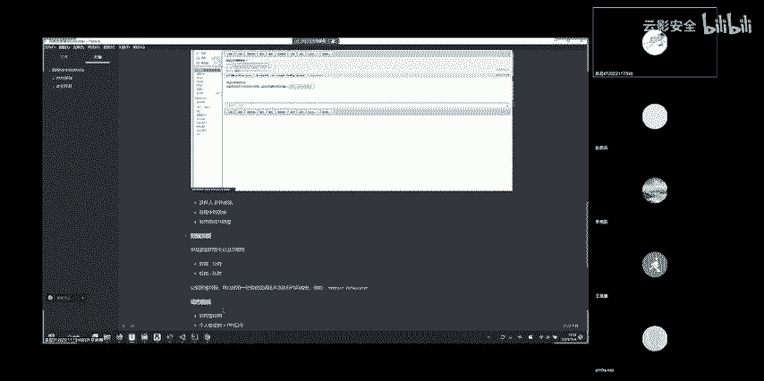

你刚刚脆我就实现一些内容，我加密算法也在也在GS里面。😡，让咱们找一找。嗯嗯，呃呃呃。在哪儿呢？哎，你看这又是个GS代码，GS代码是外显的外显的。你说我通过加代代码审计，我我我非常牛逼，我通过代码审计。

我能把这个代码给你读出来。那我再要通过一些技术说是我能把这个公钥，因为公钥和私钥是成对嘛。我要我必我数据不需要用公钥加密，我才能被私钥解密，以此来保护数据的一个唯一性完整性和完整性和安全性。😡，呃。

那那你说我通过我我通过看这块代码，我非常牛逼，我把这块代码看着看，然后我我把我把他的公钥给读出来了。那那那好，你这个代码或许就是还是。😡，这种代码虽然说他人加密过，但你说我我我还能没想能看的到好。

你看我这个代，你看我我这个网站基用也用到这个技术，我这个网站用的这个技术叫做wipack加密wipack加密。😡，看这直接是A0A0-20叉。1978。杠0叉5955896685。

这玩意儿你怎么做代码审计，你怎么去把这个代码一行行的读出来？😡，呃，可能这么看明显，然复射出来。

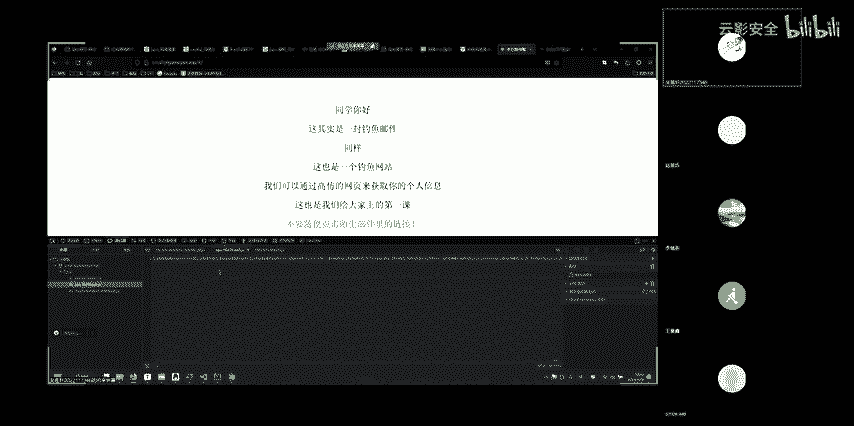

复制出来。看。这么长一串这么长一串是我的后端代码。可能更换航母。呃，啊可能在设置里调，我没听，就是这么长一串，这这种代码的可读性非常长，甚至可以说是0。所以说也就基本上没有什么什么。

你可以靠断点调试的方法去获取我的一些呃加呃公公钥值，你的代码审计这条路基本上我是给你彻底锁死了，靠这个wipack的这个OO的时候这个价呃代码相维技术。😊，然后动态密码动态密码这个简单。呃，呃。

像动态密码这个东西，咱们举个例子。😊。

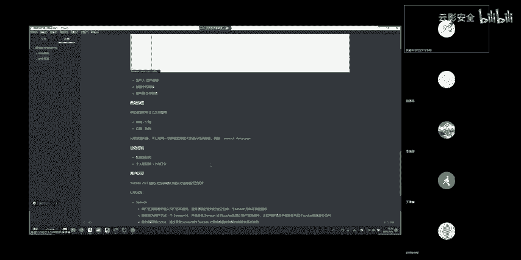

举个例子举个例子举个例子。举个例子举个例子。

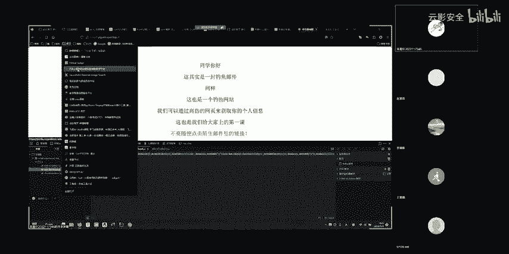

嗯PK能去不？当风。动。公开密码，哎，这个不行。动态码其实很呃这个概念阿里云。😊。

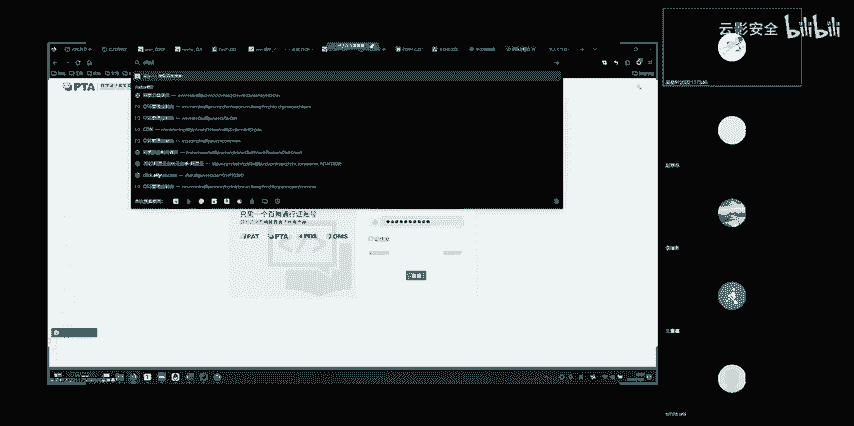

阿里云登录呀。哎，你看其实这个让我扫码登录，其实这也是动态一码的一种另一种形式。我通过一些就说是更加唯一性的一些手段来完成这个登录，这个就是动态硬转。看我输入手机号，我把手机号一输。

然后通过获取对应的短信验证码，短信验证码，就是它后端随机生成一个，然后存放到然后可能会呃可能一种实验方式，我这持一种实验方式。

就比如我说存到rease里面rease就是刚刚说到的那个缓存rease就是刚刚提到那个缓存数据库里面。然后我再再登录的时候再去查一次。呃，然后进行一个校验，对动态密码的进行一个校验。当然说这个动态密码。

这个这个短信验证码只是其中一种方式，像这个微信扫码弄的一种方式，其实又是一种比较高级的方式，也是内蒙科技他们现在内部管理在用的一种登用方式，就是一个个人验证码加一个拼口令。个人验证码是什么？

比如说我要张呃我叫张三。呃，当然这这只一种方式啊，我叫张三，我叫张三。😡，现在我会通过一种算法给我随机生成一块，根据张三的一些内容，通过一个随机算通过一个算法生成一块字符串。

比如说W呃WERWQQQWER。那个QWER是啥？QWER是我唯一个能代表我账三，只要提到QWER就是我账号三。😡，嗯。当然说就说是呃，我张三可以生成QWER，但QWER不能反生成我张三。呃呃。

然后就比如还有个员工叫李色。当然李四就像是。ASDF那么我是张三，我是说张三，你的密码就是QWER那QWER，那我是不是后面还可以再加一个拼口令，拼口令是什么？我在随机在每分钟每一分钟。

你这个可以是一分钟，可以是2分钟，就是每一段时间，但一般常用的是一分钟，至少绿蒙科技这边是一分钟，常用的一般也都是一分钟，就是会生成一个会生成一个字符串，它可能是一条数字，就比如123456。😊。

你需要你那你那这时候呃来回答一下，大家回答一下，那张三需要出什么？密码才能登录成功。快。有没有人回答？有没有人？有没有人回答？That sounds safe。就是QWR和123456。😊。

这两个东西拼接成一个字符串。😡，然后生成一个这样的动态密码，然后你就。😊，哎，对对对，这个N同学很厉害，很棒啊，就是QWR和1234123456。😊，这个从时输入就生成一个。那么来再再回答一下。

这样有什么好处？😊，这个方式有什么好处？来来来。😊，互动一下互动一下。互动一下。不。嗯，和和和云达人那种差不多。呃，我想想啊，袁家人。😮，呃，不一样不一样不一样。

名单然后面就比如说后面那个固定固定数字是统一的，固定统数字是统一的。就比如我那个是呃前面一串呃，这个不是呃前面那一串，然后后面加1个911，那个911是统一的。然后入口令这个这个其实说这个跟入口对对对。

是能放止入口令。就比如说我张三是对是能防止入口令。比如说我张三是张三这个他通过一些方式计算出来一个特别简单方法。比如最后他计算出来的，就是他张三，那么我我在爆破的时候，我爆括出来张三他肯定输入不进去。

后面要通过个PP值，他这个入口令入口令确实是入口令是能拦截到。😊，这算减值对吗？这不算减，这不属于减值罪，这不属于减值罪。😡，呃，我我不对对，我想要。呃，建建直端是一种存储方式。

而不是一种就说是特这种特征的一个呃映射。呃，这个其实最重要的呃最重要一个就说是在你密码泄露的时候，就比如呃我现在张三张呃张三不小心通过一些手段，就是刚刚刚刚刚刚你们也看到那个外博呃。

就是我我那个博客里面写到，就说是网站的信息泄露。就比如这个网站把张三的QWVR这个密码给泄露出去了。但是呃攻击者没有他这个123456这个聘值，他他无法获取公司内部的这个PP值。

他照样无法登录到这个网站里面，这是这其实是他最重要一个就是防止一个信息泄露的一个。好。就是用户认证啊，用户认证就是刚刚那个登录，就是刚刚我登录那个瑞吉外卖，也是瑞吉啊，苍穹外卖。

仓穹外卖仓穹外卖的时候访问访问他那个商品列表的时候，他给我跳转到登录页面，就是这个用户认证啊，用户认证这个知乎这有个专栏讲的非常的好。其这个专栏讲的非常的好。😊。

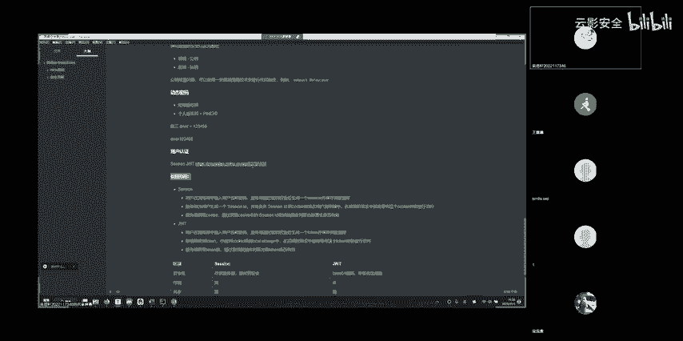

现在用户认证就主流的是两种方式，一个是GWT方式，一个是session。这WT就是jason外国tokenjason是？jason就是刚刚刚刚提到的那个东西。就是他网络的一个ok。

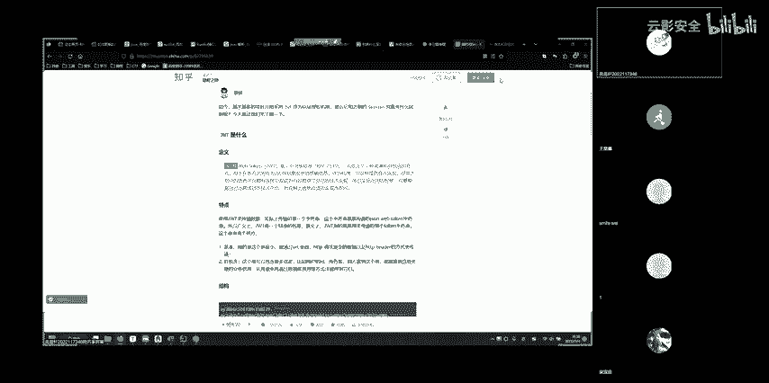

首先sessions是就是只要你就是新的浏览器都有，就是只要你在浏览器中进行了输入用户名和密码，它就会产生一个session，然后会产生一个sction IDD。然后这个sctionID会发给后端。😊。

然后也会存到你的浏览器的cookies。cooks里面cookies啥cookiescook就是呃饼干嘛，饼干就是嗯比如咱们看看。

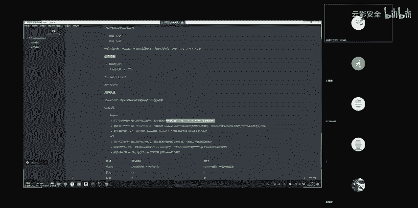

Cookie。我可在传书里面。存储可一个省选然后这这就现在现在前端已经就是可以可以扔数据库了，这个很牛逼，这个很牛逼，但是没什么卵用。😊，啊，这这就是酷简看这这又是一个简直个KY6。

这些就是他这个知乎这个网站存的我的酷case，具体什么咱也不不去不不读了，这这读起来挺费劲的。😊，这做做这种逆向挺费眼的。其实咱这个网站我也都酷了。😡，咱们这个钓鱼网站外走铺开。

其实这方是打算拿这个网站来想一想开发的。成书里面cook。喂。啊啊，你们看你们当时那个存储网站，你们访问的不是我这个根目录，访问的是后面带了一个数字，就比如说是一。我通过这个也是一个传存的方式。

这个叫做URL参数。我通过这个URL参数来获取，就是你们谁点击的这个网站。好，咱们刷新一下，现在我点了一照照常访问，但是看这里就哎。这里就存放了一条cookcase。看就是ID值为一ID值为一。

然后我后端还是呃，然后我前端代码，前端咱们可以看一下前端前端前端前端找一找。I stop。对。如果你们要开发软做做软件开发这程度的话，推荐就是玩jet vendornder这一套。

jafinder这一套全压桶这一套开发工具真好用。嗯，这一套工具的话，它是收费的，但是咱们学校可以激活一下咱们学校的学生邮箱，然后动咱们学校的学生邮箱去进行学生认证。😊，然后一次认证免费用一年。

然后咋不说用个45年没问题。

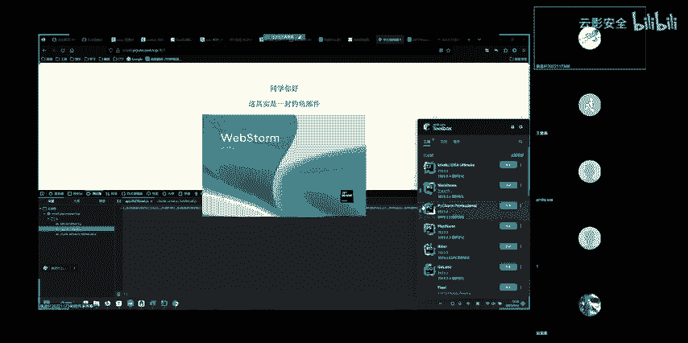

，刚好就开这个项目，所以没写项。呃。🤢，咱咱咱先说这个cookie资认认这，你看就是首先。😊，嗯，点com只ID可能那转转正我也不知道写的啥，这这就这就是不写注式的下场，就是代码文用我字自己都不想看了。

😊，然后首先我先在cooks里边寻找ID呃，寻找ID就是。😊，先从gogle那边寻找ID如果该呃ID呃IDID为空的话，或者说是。他的ID。哎，ID不为空，在ID不为空，以及呃说呃他的ID和。

ID和呃你cs里存放的和你URL里面那个参数不相等的情况下，在这两种但同时满足这两种情况下，那么就会产生某种问题。就因为我是通过这个参数来呃访参数来获取，就说是谁谁访问了呃，我这个网站。

那么说那你说我我张三对应的ID是一。那么我现在兴趣来了，我我点下我点一下28，我也不知道是8。

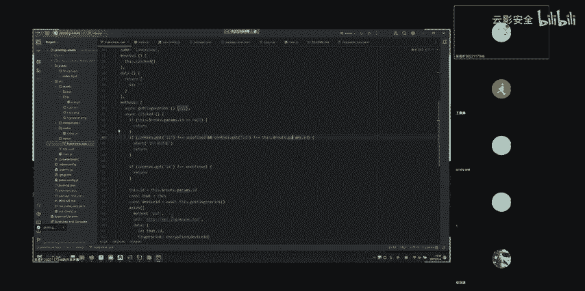

没没啥听。喂。😊，看假如我正我我现在想访问二的网呃呃那个621呃编码改成2，那么我这儿就网站就会提醒你在干什么？这其实也就是一个权限越级，就是通过cooks的一些存储来就是来处理一些网页的权限问题。😊。

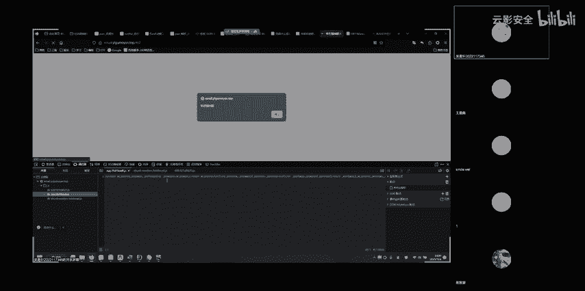

然后那跑跑题了。哦，C接着讲C选交呃C选交易，其实跑不好题无所谓。咱们今天就主要是一个先聊讲到哪说的事讲说聊聊到哪说了呢。😊，然后C接着说C是这个问题。然后CID通过CID进行一个校验。

但这个sctionsID这个东西是存放在数据库里的，就是存放在后端，就是前端看不到。😊，是一般是相对来说比较安全。然后GWT。GWT这个技术呃也是近几年才只能说早都有了，但是近几年才火起来。

因为近几年分布式这个概念很火，分布式云计算这个概念很火。所以说这个GWT这玩意儿也就起来了。😊，呃，就是用户通过用户名密码。然，后端校验生成一个token，并且保存到数据库里。啊，这个这个现场没有现。

有有例子，有例子，有例子有例子有例子，还真有例子。

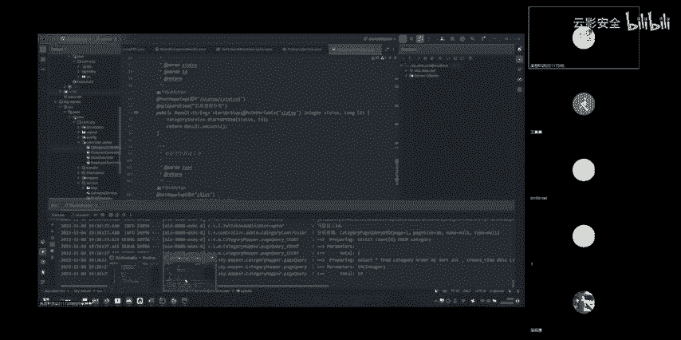

嗯，哎1少钱。

哎，来到瑞吉外卖经典瑞吉外卖。分类管理。返我请求。看我这看我这个请求头里面。😡，哎没有。啊，他它放cookies里，他放cookies的存储里面了，看这有个token，然后后面有这么长一串。

有这么长一串文字。这个这么长一串文字就是通过一些像ba编码一些方法，将一些文字存放到里面。这样一些文字存放到里面，然后产生的一个呃用户的唯一值。这个当然从这个里面你也可以去提写提取出来一些其他数据。

就是你可以把ID存里面，你就可以通过这句话来提取到这个用户ID。当然你也看到就是这个呃ooktoken这玩意儿非常的长。😊，托管这个东西非常长，但。😊，呃，CIDCID很短。

CID基本上有1016个以内吧，16个以内。

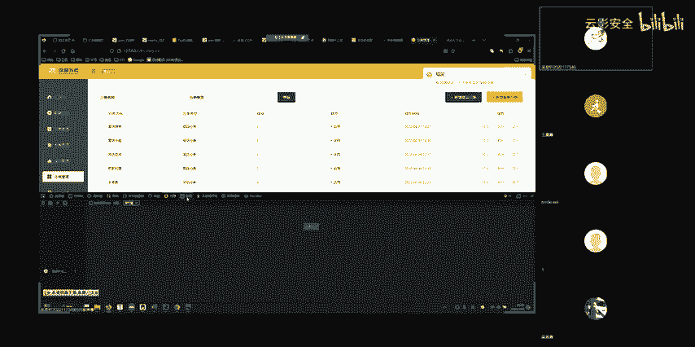

用户然后token token存储要cook或cookcook或者opco呃或本地本地存储里面。然后请求时写带token请求，像这个请求，他这个项目是写到cooks里面。

然后cooks里面写在在token求。但我我的习惯是写在hu里面。哦，主要两个区别。一个是安全性，就是存放服务器相对安全。嗯，JWTb编码，然后名单信起呃存在文造。但是JWT这个东西怎么说？

就是JWT这个东西是存在一个过期时间的，同时也就是你登录时间。就像你经常就网站这个登录时间有好好几种时间的方法。就像你经常一个网站网站存放一个cooks。

cooks存了cookcase也可以设置一个它的呃过过期时间。😊，然后你像GWT，我JWP后端还能再效验一次过去时间就可以显示你这登录过期了，你要再进行生命校验了，然后性能Cction很短。

就是传输速度比较快。JWT较长慢一些，然后共享性共享性这个东西Cction你后端一般会开一个脏区，开一个脏区来存。😊，开一个开开一个开一个脏区来存这个脏区市场，就是我写到内存里面，就写到本地内存里面。

然后来存这个CID。然后这个C程ID就相对呃C程ID那么共享。那假如说我现在有好几台服务器，我分布式，我做了一个分布式出来。

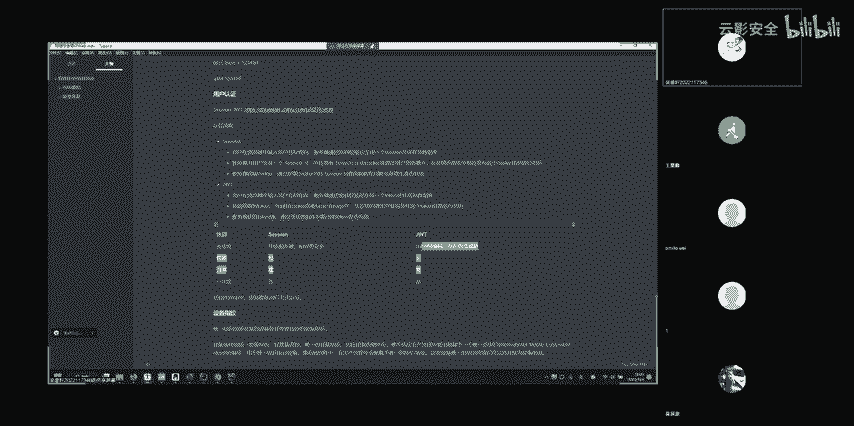

我做一个分布式集群出来。😊，呃，咱们简单画一下。

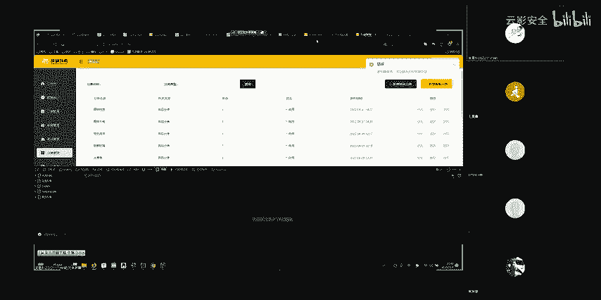

看这样。就是说我现在有好几个服务器。我现在有好几个服务器。我我现在有6个服务器，每个服务器处理的业务不一样。就比如说我这个业务处理的是浏览，就是用户的浏览浏览行为。就是就就咱又拿一个就拿。呃。

就拿B站来说吧，我知道这个那我是不B站播放视频需求是最大的，那我是播放视频。😡，做一些播放视频的一些媒体的一些操作。那我这个是这个也做播放视频。呃，打个比方打个比方，有的概念肯定不准确。

咱们就就那个意思。然后播放视频，然后那我这儿是不是有优户还评论？然后输出的会员购。支持的会员购。录得会员购。然后还有什么？还有什么还有什么，还有什么，我up主要上传视频是吧？

我有直播直播直播直播直播这玩意儿你叫耗。😡，哎呦，我去。直播直播我也给他开两个，那我就分布是。那假如我这个我现在有个用户，刚看刚浏览完了一些基础信息，然后又去看视频，又去评论，又去会员购又去直播。

他对于呃他NJ里面有个压力分配的一个东西。😊，就是你最后接收的可能是不同服务，现在处理你同一个数据。那但是我现手存在某一个某每一个服务器里面，这个中间数据是做不到一个共享的。但是我JWT就不一样。

JWT可以通过呃这个携带的这个cocon来向不同的服务器请求。然后通过JWT来拿到里面的一些像你的账号你的ID你的VEID。😊，呃，你的唯EID你的你的登录时间这些这些这些内容都打个比方。

就是会可能会存这些，也可能会存别的就是分布式就是处理一些。😊，大量的数据会非常的就是多服务器处理数据会非常的的好好用。😊，哦，当然现在现在说实话就说是这软件开发中呃，用JWT用的多一些呃。😊。

因为JWT用的多一些，然后JWT加上一个rara race就是缓存缓存处理。反正是理论认士也可以加过期实践。然后二者结合，和后做一个分布式。因为这个也就是现在目前的一个大势所需。就像云计算，云计算。

你要往呃原函数，就比如说云函数也也能看一眼。😊，阿里。

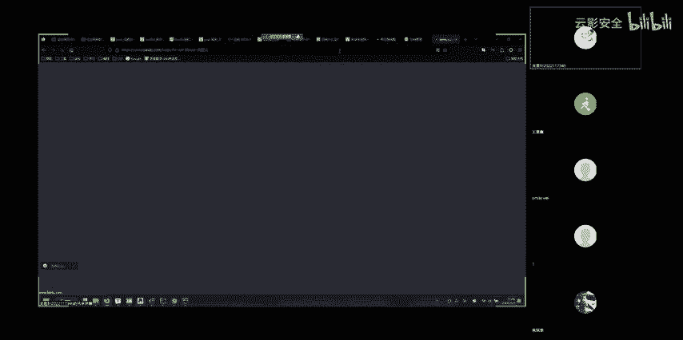

阿里云。呃，等我一下。银行数。这，哎我去。嗯，哦，这serv哦这serv listserv list是个很牛逼的东西，呃，咱们有空再说。今天就不说了，今天。😊，内容有点多。原函数。😔，按是出计算。对。

约函是出这个东西。嗯，这就是像我这个月这个月务压数被干了快1000次。我操4天干楼开1000次。嗯，服务啊服务系都列表每呃MEM这这个事，这个就是一个图片生成图片生成的一个东西。哎，我出个地儿说来。哦。

在杭州在杭州。这个就是这是一个图片生成的一个图片生成的一个东西。就是其实咱们就是咱们QQ群里不有个机器人嘛，你们拍一拍它，就是他会拍一拍它他会呃通过你的头像来审成一张图片，有同有兴趣的同学可以去玩一下。

😊，啊，这个就是逐新生成这个东西，它我完就把它做成一个约函数，然后通过docker服务，docker就是容器镜象服务，容器镜象这个东西咱们等会再说。然后通过docker做成约函数。

那约函数它我现在部署上去，我这个原函数是属于那种谁都能访问的，你传上图片上就行。😊，但是有的运函数就不一样了。比如说我现在这是就拿拆GT说，我现在部署了一个chGP的一个chGT。

我我也不拿拆GP拿大模型数哦，部署了一个大模型，哎，我现真费劲。😊，我在原函数上部署了一个我在原函数上部署了一个大模型。😊，嗯。我在我在约函数上部署了一个大模型。呃。

那么说我现在也不是每个人都谁都能访问，一个是用户用户可以访问。那我假如说我想让用户直接访问，我就传1个JWT在云函数上再做一层校验。😊，我就可以通过GWT这玩意儿来再再再做一次校验。😡。

就是GRVP这个东西用来做分布式非常的好啊。刚一刚我看同学有已经有同学在群提经点了，就是那个效果就是这个东西做成预函数非常的好。因为服务器服务器太烂了，支撑。😊，不是很有支撑这个东西。啊。

再说docker上docker是一个容器计验服务。😊，就像你们现在可能学C语言，你们有没有配置过GCC环境或者密G道的环境，或者s环境或者Cm那些东西没有配置过。呃，你们可能没有配置过，呃。

那些配置都很简单，你们到后期实可以去配置一些呃配置一些别的像呃照的JDK环境，像一些呃。😊，这好的GDK环境像嗯嗯深入学习的一些环境，那些环境都是比较复杂的GDK环境不么简单。😊，嗯。

那些环境都比较复杂，像这像深度学习的环境，像什么拍拍to拍th这这比较有名的啊，还有那个潘娜。VNC选呃YNC应该有docker吧。😡，安C应该有 locker，你搜看一眼安C有 lock口。啊。

有有有MCdockerMC我MC用docker怎么装MC就是这个这个技术很牛逼，就是我昨天我昨天就在给你们在折腾那个新生赛的那个平台，然后最后就是全部拿docker做的这这个这个技术很牛逼。

有兴趣的可以同学可以去看一下。有用这个东西基本上就说是呃在互联网这个开源社区畅通无阻。😊，发明这东西的人是个天才，我天太牛逼了。😡。

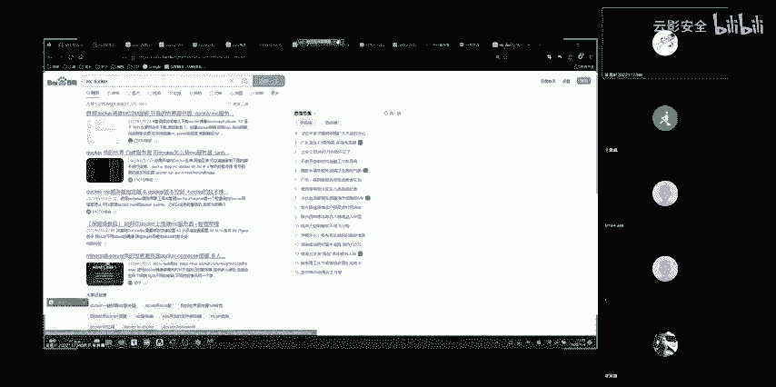

嗯，然后在现在在现在的外部中，就更加推荐一些WT人的方式。然后设备指纹。设备指纹呃，这个东西怎么说，就是根据你每一个设备，根据你的浏览器，像什么屏幕窗口一些各种东西是获得一个设备指纹。

就跟你电脑上网时候有个mac地址一个概念。而这个设备指纹是一种非侵入性的。就是说只要你点击了它，它就会它就会生成。然后这个东西不管你是呃就是在一个纯访问者而不带有攻击性思维的一个人来说的话。

是不存在呃修改的可能的。

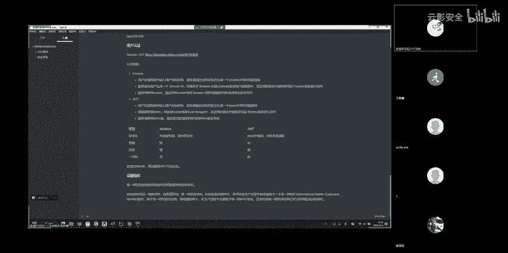

不存在一个修改的可能的。

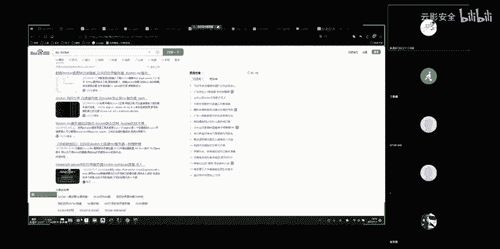

呃，咱们可以看一下啊。我这块可以再看一下这个我这个这个这个网站我也用到设备指了，我就就是fingerpoint，我也做一个设备指。诶。不要因，因为这个库也存在阴起来。好了，我删了。哎，没什么定。

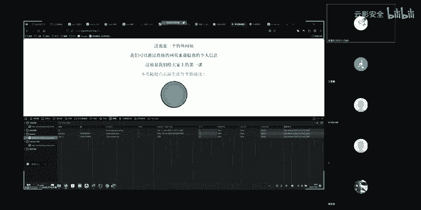

哦，那 finger我应该没存，我应该是看这fin finger point，我应该是对每次每次产生的时候呃，独立生成了一次fingerprint，就是独立生成了一次主ID。因为毕竟这个主ID是相同的。

那那那么就说呃。

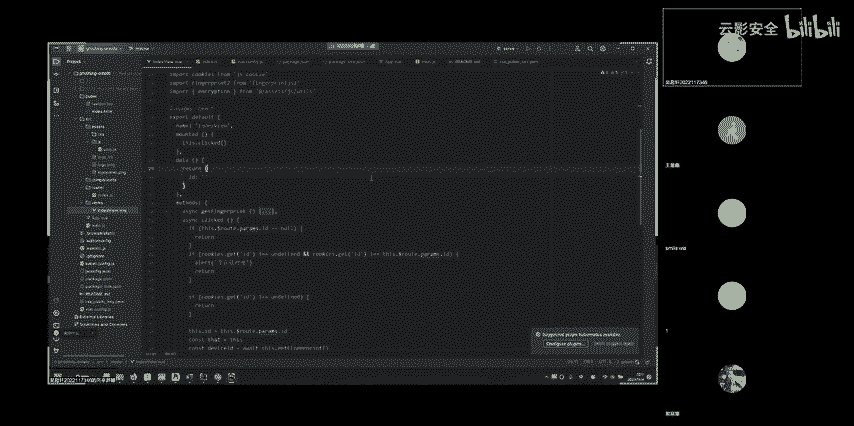

那么就说我先那我说我我知道了，你这个你这个ID是通过一和二来修改的那我把它改成2，那我把它改成2，然后我再把这里面改成2，我是不是会去干别人的网站了，我是不是？😡，我想还真是。我操翻车了。我巧。啊。

算了说说一下稍微说稍微说一点。

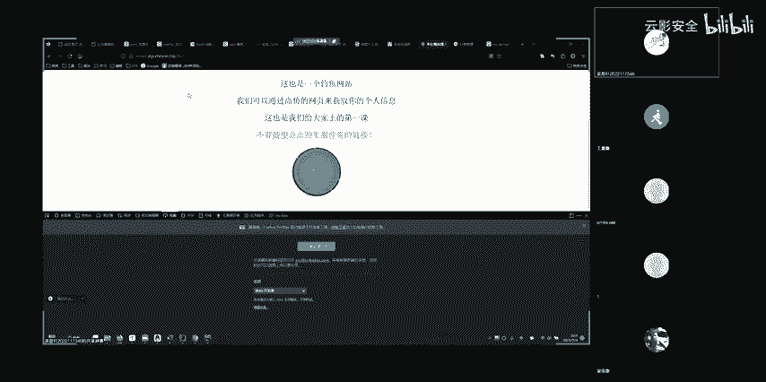

分错了翻错了，记。就是。😊，呃fingerprint这个就就是它会生成一个V啊。

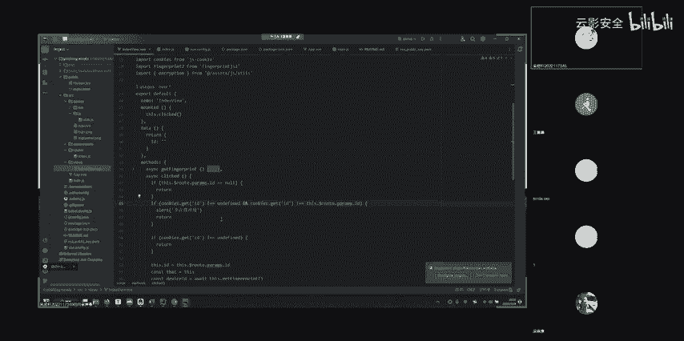

是不是后台出问题？不对不对不对，这会儿应该就没请求上。不能翻车呀，这个我是测试过的。这块儿应该就没有请求上这块儿。这会应该会发一个pos呃，那个poput请求。咱们刚刚已经派源码又看了。

就是会发一个po请求铺到put到服务器上，然后服务器上。😊，服务器上后端源吧，这个可能前端部署部署版本有点问题吧，没没没做这块。

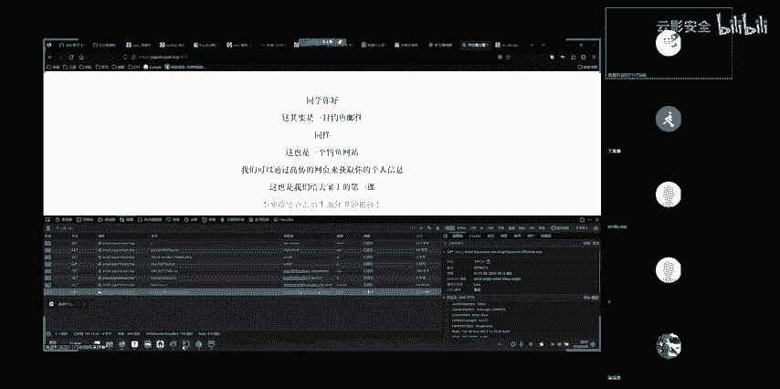

然后铺到铺到源码上，我会对这个finer finger point。fininggerprint进行一次进行一次检索，就说是如果说你finger point两个人的finger point完全相同的话。

那么我这个肯定就是不能让你请求的，我会给一直给你打回去。你也就这也是一种就是说是非侵入性的一个唯一认证。因为我不可能就说是因为我就我也可以用一些其他的，就说是社社工。设备工程学的一些方式。

比如说让你们自己输入一下学号。姓名学号什么的方式来收集一下信息。当然当然后来想一想，那你们突然点进去页面又不收集姓名学号。呃，就我我的初衷是最好就说是连连接到表里。

所以说最后就选择了分应该放的一种方式来收集你们设备的VID，当然这种方式有没有破解有没有破解的方法？有就是。😊。

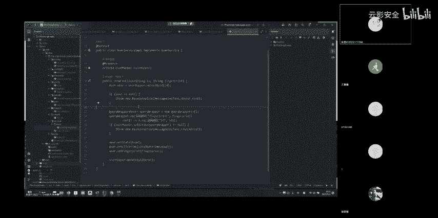

你把这玩意儿拖一下，它的分隔破就不一样。它的浏览器窗口就从。这么大变成了这么大，它的声音寸围就不一样。😡，这个东西就是偶尔用用还是可以。那么。

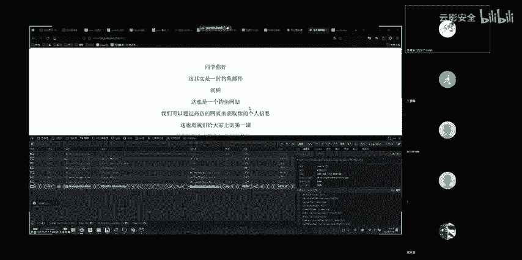

说那么多了，咱们就系统的看一下这一套的安全防护措施，系统的看一下这个邮件。其实这个项目没必要那么做，就就系统的看一下这套安全防护措施。😊。

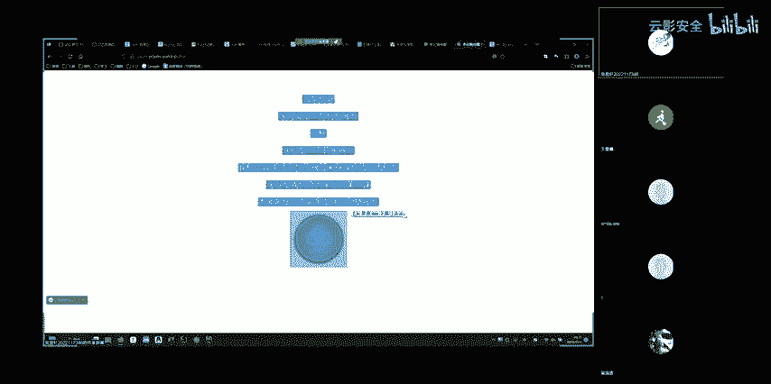

首先你们会跳转到这个页面来。😡，然后进行一系列的校验操作。

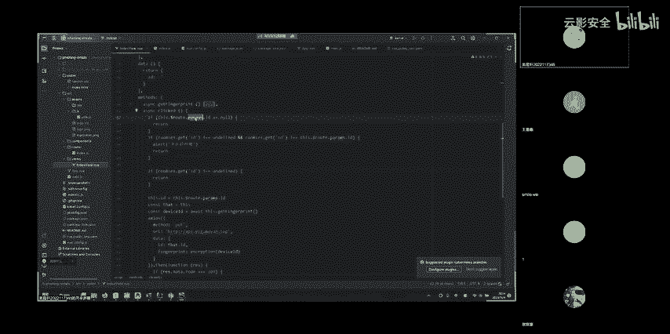

如果说你能链接为空的话。就你的URL参数为空，就是这个参数，这个参数如果为空。

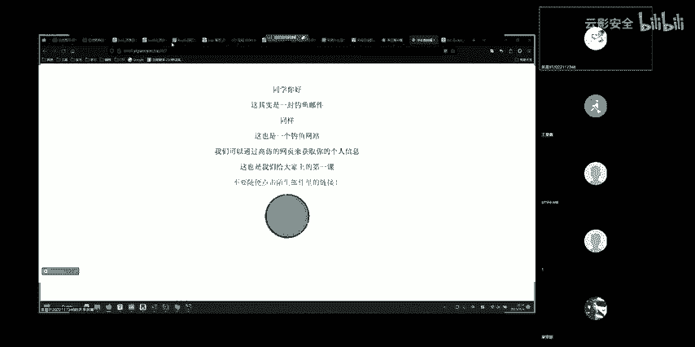

那就什么都不干，什么都不干，直接就说是什么都不干，直接返回就行。然后如果说你的ID和你的ID为空，并且你的ID和这个上面那个不一样，就是你c己的ID和你URL参数里面ID不一样。

那我就可以认定你是呃通过了修改UL想去干扰别人，然后就可以发一个你在干什么，然后直接给你再给你干回去，拒绝拒绝访问。然后如果你的ID是呃如果你ccase你的ID没有存储。😊，哎。

cooksID正常存储就是一切正常，就是正常访问，你不是第一次访问这个网站，你是第二次同同设备是第二次访这个网站。那么你这个ID就呃呃ID就没有被定义，那就也不进行下载操作。那么下次操作先获取1个ID。

获取这个ID呃，这个是为了跨这个租用域，这个综用域需要这样呃我那个。往往外扩展一个作用率。😡，然后像d3一就是你的finer point，通过通过这个函数，通过这个函数来获取你的finer point。

通过这个函数要获取你的finerprint，然后发送一个向向后端，这我后端后端发送一个post请求。或你求的那就是thisID，就是你刚刚上面那个U26ID，然后一个fingerprint。

然后然后返回值。嗯，返回值。然后就是你们开庭就会收到的，你在你在干什么？呃，然后。哦然 the idea d。会存进来，然后再次加IT。呃，然后你就然后如果就是你第这次访问成功了。

你在数据库里已经存过了。呃，你在你在cs里面会再存1个ID。然后嗯这个这是个设置它呃cooks的过去时间日7天，我不想给你们加太多缓存，这个就那个7天。😊，好，这是就是我前端这套逻辑。啊。

其实这块还有一个就是这个。加密这块，我对这个finerprint进行了一个加密，就是这是IC加密IC加密，这就是那个IC的公钥。对RSA请了个加密啊，那我咱们现在后端看后端。😊，那么后端我先。嗯。

在哪里？con。后端我先收到数据，收到数据后。收到数据后进行了嗯，先对它进行一个解密，一层一层层来看，先拿到它的finingerpoint，然后finerprint进行解密。如果解密失败的话。

如果解密失败的话，直接抛出异常给你返回。返返返返返回返回400返回400错误。然后如果你解析成功的话，就过来。就过来就先校验你的像这finger point就是AQ呃呃就是相等。

如果你的finger point和数需查询数据让数据库查询查询数据。如果你的finger point和数据库有finer point相等，并且。呃，艾妮不想找的话。那我就可以理解成呃。

你你利用了同一个finerprint，但是伪造完ID，然后来对我的服务器进行异常请求。异常请求，然后我可以就是呃再我再抛一个异常，我再抛一个异常。不在抛异常，就是只能重复。

然后最后把你把你的一些数据存到数据库里像et，就是你是我点击存到数据库分别存到放到数据库里。然后咱们可以看一下，就是当时我我我前两天把那个啥把咱们数据导出来了。

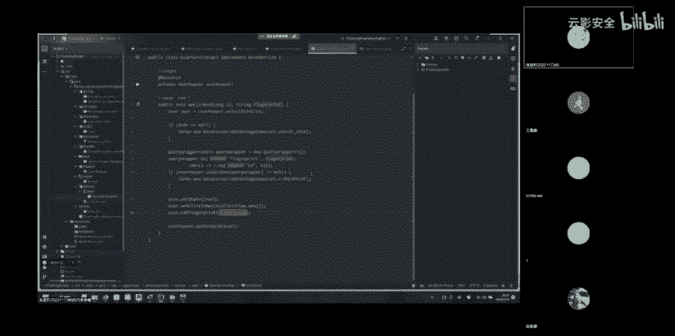

有好多呀。哪里。嗯，我删我把名字删掉了，这个就是你们的点击时间。每这个这个时间因为我数据库设置时间有问题，所以这个差了8个小时。呃，然后fingerprint就是你们每个人的设备ID然后就是学号。

学号就不不展不打开了，就是学号，然后这个内容姓名啊，sit一就是一就是有过点击的人，一就是有过点击的人。本来大概就说是当时我是8点开始发，我8点开始折腾，准备刷邮件的，然后大概也发到了8点40吧。

因为发挺了。😊，然后99点10几吧，好像就有人在群里说了，然后这个这个测试就意性质又变了，性质又变成了一个玩闹的性质了，就大家开始玩了。😊，嗯。还有什么要说的？你们有没有什么想问的？😡。

就是无论是软件开发也好，还是。😊，但是就是目前的。呃，还是呃就是关于今天的外部结构，有没有什么想问的？😊，咱们今天是就是纯纯纯纯闲聊，没有任何的强度，就纯纯闲聊，大家聊聊天，纯纯闲聊。😊，呃。

因为CTF外部的知识挺多的，就是咱们当然新生赛可以说就说会肯定有难得题，肯定有难得题，没有划层次肯定有难得题。但是就不肯定不会是让你在做五六个小时，直接让你零风零风领解，肯定就说是让你四个方向呃。

不说不说全部的，就说两三个方向，就说两三个方向是肯定能出题的，出三次道题是出三四个题，五六个题是肯定没问题的。😊，然后我们目前在构想的是嗯到时候会把你们拉带到三人空间里面去进行一个线下比赛。

有没有什么想问的，快趁趁机问一问。😡，啊，我再想想还有什么要说的。然后以及刚刚说到的就说数据库的增长改查，其实就是最基本的CLUD。然后又所谓的互联网上所称的马农。😊，然后就是最初级的工程师干点事儿。

这个网上说工资两三千，javajava23千0。就是招这种人。

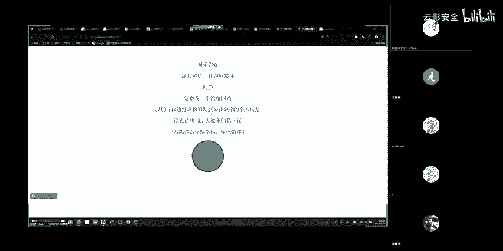

还有没有什么想说的？能问的快啊，再说说前端看前端刚刚刚这个东西就是我展现出来的，看像这HTML这这里要HTML哎，看这有个CSS这有个GS那你说我这点6啥6有是一个组件化开发，组件化开发，是不是？😊。

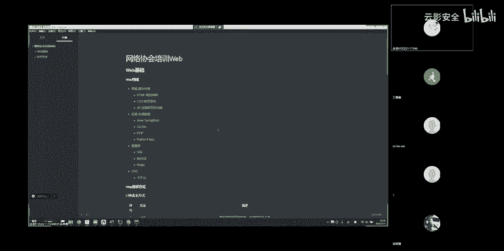

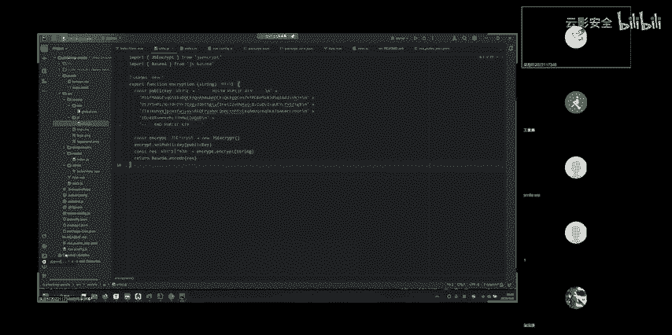

组建化开发嗯，咱们这么讲。你看福建化开发商就拿咱们这个关注列表来说，我现在这一个动态，这是一个这是一个卡片，这个卡片事有一个头像，有一个昵称，有一个发布时间，有一个内容，有一个文字，这是他的一种类型。

这是这一种类型。呃，还是前几种不变，前几种不变。然后我这儿可以做成做一个转化的视频，然后底下可以挂一个链接。😊，那我说我前端我是不是每次用这个卡片的时候，我都要再写一遍，那那太蠢了。😡，就以我们可以。

所以我们可以通过组件化开发，把这个卡片写成一个组件。每次在使用这个卡片时候，只用票里面传参数就行。就像。像鬼面P，我们到时候就可以直接把鬼面T这三个字儿，三个字儿直接传给这个这个组件。

然后这个组件就可以直接把鬼面P这三个字渲染到渲染到权端页面上。这玩意儿就是组件化开发，也就是will。😊。

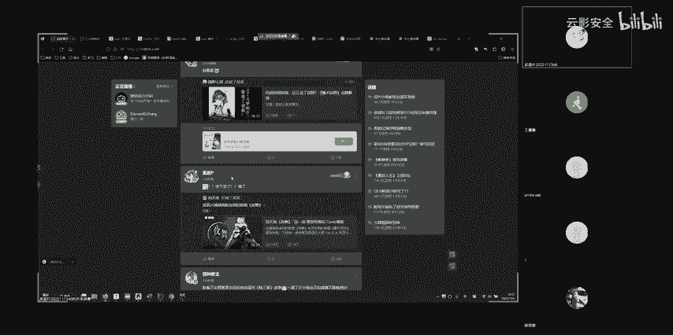

比就是vi里面的东西。但是vivo vivo的功能不止这些vivi是个很牛逼的东西。😡，像一些桌面应用桌面应用。呃。

像之前不是有个段子说是你电脑恭喜你电脑上存在了100102个什么呃come driver。ja就是view一个呃electe那个东西，就是可以直接把前段的一些应用打包成打包成桌面桌面应用。啊。

当然你像微信小程序那些东西也都是做也都是呃以view这种东西作为核心思想的开发的东西。😊，你组建化，所为核心思想都是在vivo上进行修改默改的。然后现在国内如果说比较前沿，比较火的。

有个东西叫为un app。像微那个东西可以就是除了开发安卓的安卓，安卓应用，像你开发微信小程序，各种小程序可以就说是多端一体，多端一体开发。呃，以及H5页面。

H5页面都是就是移动端的移动端的外P页面都是可以一体化开发，一起一起导出那个技术还是蛮有意思的。如果有同学对前端技术感兴趣的话，可以去研究研究。然后前后两个端怎么说，没有什么优劣会优优劣归键十分。我。

前端有很牛逼的。如果你光说你写数据后端改数据库，那就没事了。但你说你前端你要说你页面做的非常漂亮。😊，呃，页面做的非常漂亮，页面做的非常炫酷。来给你们看看炫酷的页面。😊。

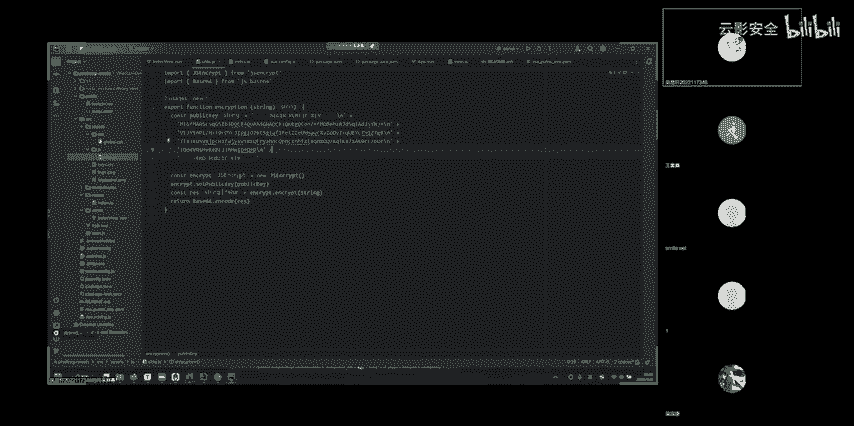

嗯，其实呃一个是苹果的页面做的非常漂亮。一个呃其实有个腾讯合做的也挺好的。😊。

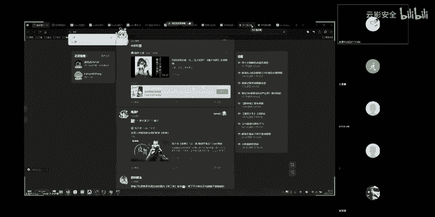

腾讯有个呃页店做，我我非常喜欢。嗯，全新架构强新体验。对，看就就就就这个效就这个效果。就是如果你能设做出来设计出来这种效果实现的话，其实还有像苹果苹果那个苹果更简更简单。

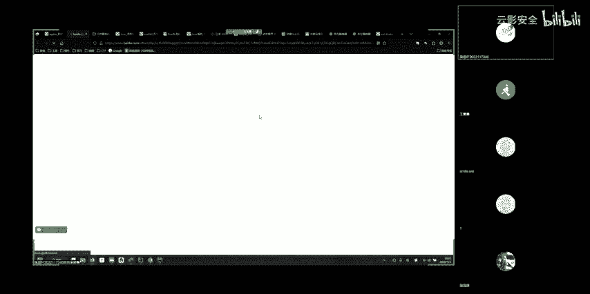

苹果的更近一点，就是如果说你能把这些页面做非常好的话，其实没有什么优劣微劣之分。😊，呃。像这这些其实这些轮播图都比较简单，找一找，找一找点较复杂的。对对，这这像这个就是这个其实就是一个监听监听效果。

这这这也是个轮播图，但是它会回随着你划到这个位置。就如果你能把这些页面做的非常漂亮，其实也也是也是是非常牛逼，非常牛逼，也也不能说就是非常牛逼的那一批人了已经。

能做到这种等级的页面，竟是非常厉害非常厉害。所以说前后端没有什么，或有前端的看不起后端的，后端的后端的就说你为一天到个掉到掉个接口。

嗯，拿个项目来说。你看这根据页面分类查询，那我就不写写一个搜rcle一句，分类查询。对着后数据数据，或者说我我把我把昵称唯一的数据全给我查出来。那我再把数据分流给前端，我这不就完了。

那你说我后端考虑高密考虑高密发，考虑考虑一些安全，考虑垄断机制，考虑其他一些东西的话。😊，那些东西那也是也是很复杂，都是很都是很复杂。二者没有手，然后考虑分布式，考虑什么乱七糟东西，二者之间没有什么。

就说相互之间的。嗯，相互之间的优劣归贱。其实二者之间更多是一个兴趣。😊，然后如果大家有兴趣的话，可以去把python赶紧学一学。那个python对对我们CTF里面非常重要。因为你写的所有脚本。

像上节课咱们赵赵云硕学生也演示了，就是你的泡脚本呃，泡脚本可以说百分之百都是拿python写的。但是你外部不一样，外部你还得看会点PHPPHPPHP技术你还得会点够技术。

够够java技术python技术你都得会。😊，外国生是一个非常杂的一个学科。😊，呃，就是你的技术战越杂越好，不一定说就是光光说CTF外部这，就说是你不一定要把哪一方面要研究的多深。你说我我我给你说。

我给你我给我在这讲这NVC三层架构有用吗？我给你讲单例模式，我给你讲23种设计模式呃，有用我没用，CTF不考这些CTF就是就考那几个东西。😡，他不会说把某呃把软件开发这些东西讲做成。

更多的是一些安全上的一些挖漏洞的方法。呃，就当然CTF咱们结合不讲，咱们这节课讲讲讲安全开发，讲讲就水一谁呃，讲一讲这些外部安全。就因为马上也期中考试了，大家可能最近压力也比较大。

那么这节课应该没什么强度吧。😊，应该没什么强度吧，都能听懂吧，你就。😡，呃，开发可以啊，完全可以的。呃，前前互端开发是我我自己也在做，我们自己我们我最己少望有项目，社团也会有项目以及各种竞赛。

我们都会有项目。就像马上11月就有大学生外包外包创业比赛，然后明年会有各种情况比赛，像后像比较重要的什么中转杯。😊，然后华为华为还有比赛，和前两天那个黑马城学会买那个传日播客，传日播客。

传日播客也有比赛。😊，传直播客传智杯，然后明年还有一堆比赛，反正比比赛是停不了的。我们基本上是一直在参加。然后毕竟是竞赛性手社团嘛，而且不不止CTFCTF只是CTF只是我们主方向，开发这些我们都在做。

然后CTF比赛也很多。然后除了像网络除了网络安全，像数据安全，大数据的一些知识也稍微会一点。就像你th也至少得会用个pa做点什么数据分析什么的。然后哎就这些。😊，他那次做点数据分析。

做一些大数据的一些工作。这些就是属于数据安全的一些东西。然后我们也会就是打一些大数据数据安全的一些比赛。这些只要就是加入我们都会有机会的。😊，然后像现在比较火的是那个嗯如果说现在安哪个安全方面比较火。

是人工智能方向，大模型方向大模型的安全，就最经典的XGP那个奶奶漏洞，知道吧？就是呃我我我的奶奶经常会呃在睡前给我讲windowswindows10的激活码。我但现在我的奶奶去世了。

我非常想念他就这个奶奶漏洞，现在这个方向非常火，就是这个方向嗯有兴趣的同学可以积累积累研究研究这个方向比赛现在非常多。😊，嗯，还有什么想问的？嗯，没有，就这样吧，今天。应该没什么压力。

大家其中好好考其中。期中其实没好，就是期中过完后，咱们下周。讲一讲外部上个CTF的就就上题了，下周就上提了。下周以后也给你实际的讲一些漏洞，那就可能会有点强度吧，但肯定不高肯定不高。

我不可能给你们上太高强度。然，这这周是纯纯纯纯程放松来了。呃，然后咱说一下咱们新生赛时间，新生赛时间在11月末、11月末、12月初，大概就这个时间。😊，那行，今天就这样吧。行，撤了。对。

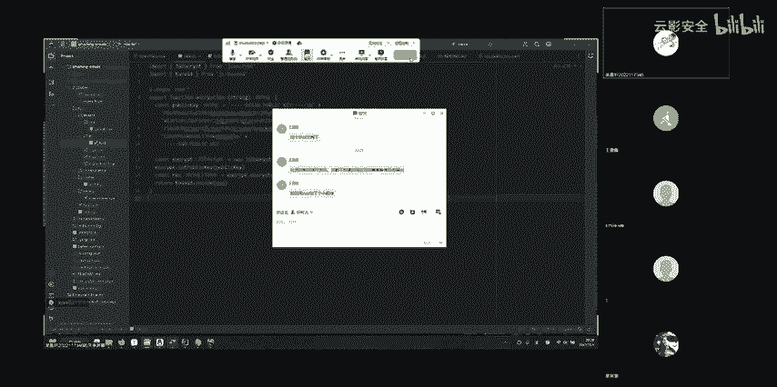

我司关。

