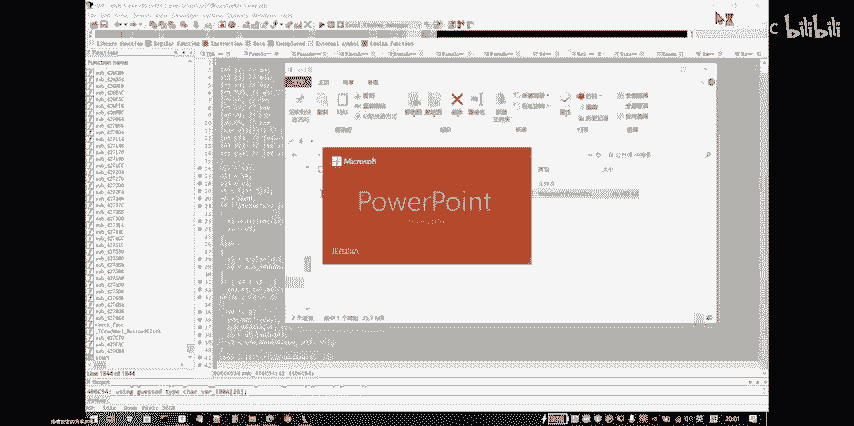
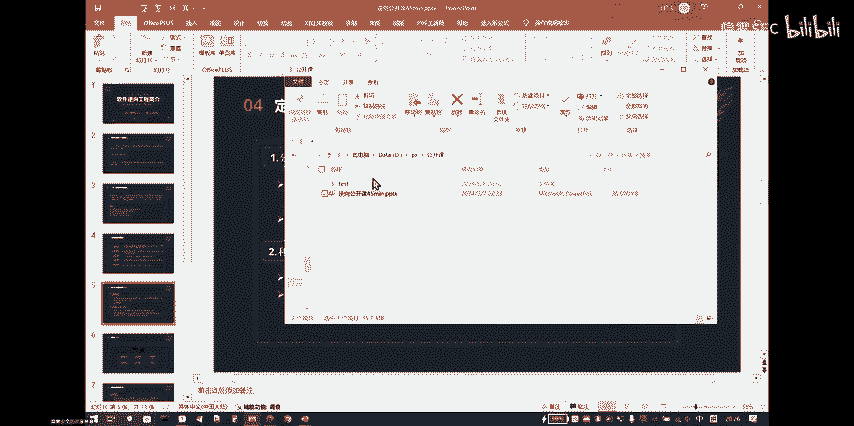
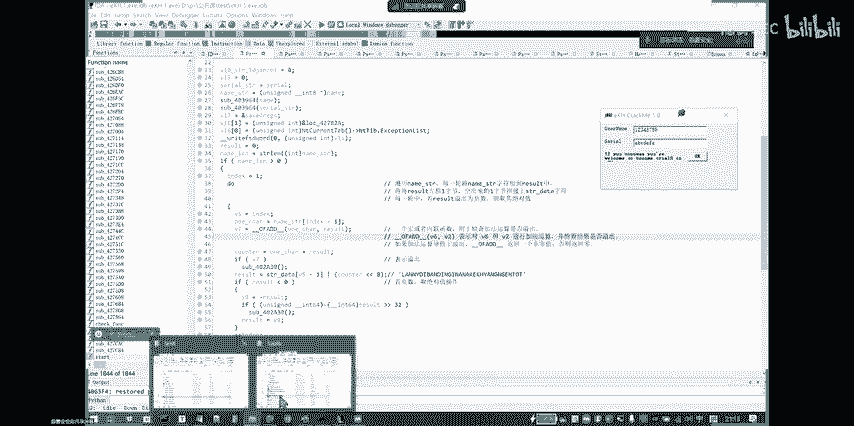
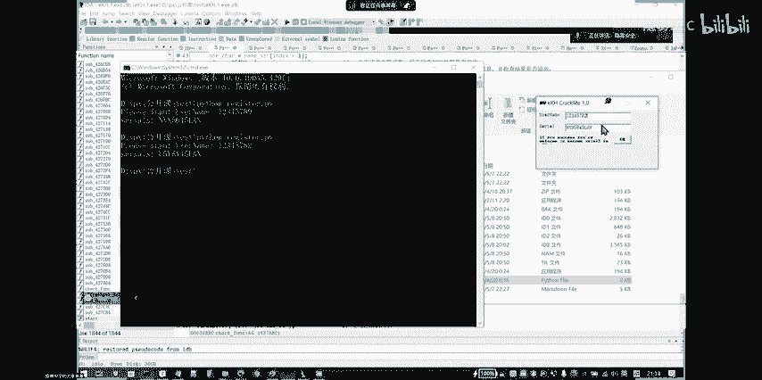
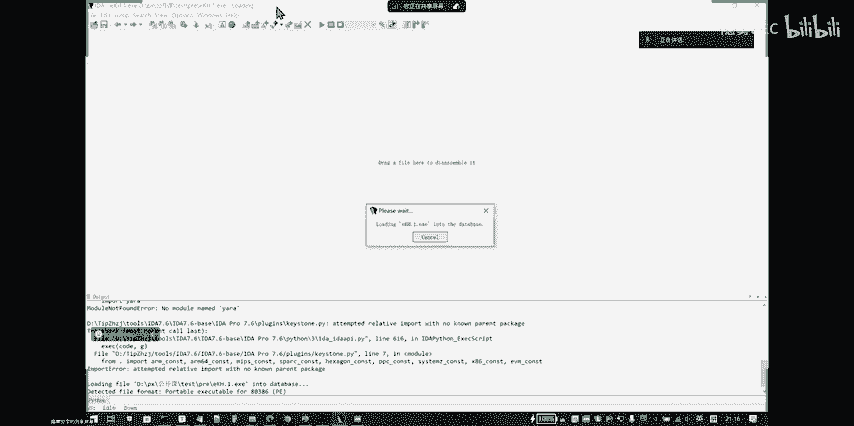
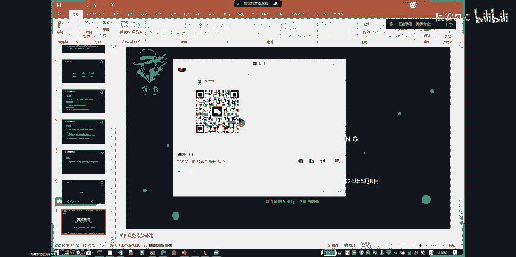
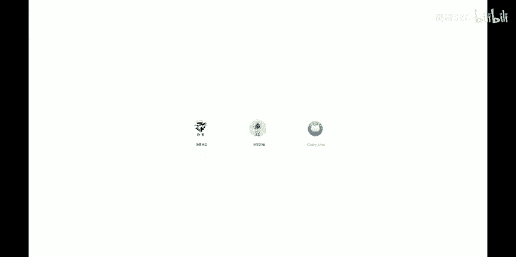

# CTF公开课第一讲——re入门简简单单CrackMe - P1 - 隐雾SEC - BV1A1421z7B9

嗯，稍等一下。大家稍等一下，B站的直播还没打开。等打开了直播就开始讲。嗯。大家可以稍等一下哈，嗯工作人员还还在后台推牛，在搞呃B站直播推牛的事情。😊，稍等一下，需要。大家可以聊一聊嗯。

大家可以聊一聊大家的对CDF的了解。嗯大家是是嗯。有接触过CTF没有。接触过一点点嗯。大概大概有。大概接触了多少了？一般用一般去刷题库里面刷题，你们一般能刷多少？嗯。CTF的话就是一般嗯。

一般都是那种像竞赛一样，就没有什么课程，没有什么课程去教CTF就是没有那种。比如学校里面一般就就没有课程教CF对CTF如果嗯如果是你要成为一个。或就是那种专业打比赛的那肯定是要刷题，就像竞赛一样。

就像那种ACM比赛一样，你得刷很多的题库吧，你得刷打ACM打算法题，你得会很你得意思去刷题库吧。CDF也是一样的。如果你想要获奖的话，就得就得刷很多很多的题，基本上现在市面上的题可能要刷很多。入门的话。

攻防世界啊那些，然后还有那那个北欧的BUU啊那些。就去刷UU上的题就比较新。然后公方世界上的企业的话就比较。嗯，比较适合新手，他他的梯度比较呃平平滑一些，但是上面的企也老一些。BU上面就会有很多。

近期比赛的赛题，那个弹难度就有点高。但是如果大家是呃想通过CDF，但是就是大家如果想学网络安全完想学网络安全的话，肯定就绕不开CF通过CDF来来入门网络安，通过CDF来入门网络安全。

就是一个嗯比较合理的一个途径，就是网络安全就指的是传统的网络安全吧，就是攻防对抗那一块的话，就用通过CDF来入门。就是嗯是很合理的。嗯，也推荐都通过CTF去入门网络攻防这一块。

如果只如果只是想如果是针对网网络攻防的话，嗯，就通过CDF，然后就就正常的学习。录播的话，录播暂时应该后续可能应该后续也会安排，后续会安排。然后嗯大家有什么问题的话，就是直播你有问题也可以直接去私信。

直接去B站私信人后台也可以。都有人解答的。嗯。如果是学入如果是网络攻防，通过CDF的话，就可以就可能也是正常刷题，但是可能就不需要刷大量的题，只是通过CF入门。然后大大家就是刷少量的题。

然后能对CDF有个认识之后，然后再去。然后就会对网络安全有个框大性的认识，然后再去专业去学习某一个方向，网络安全就比较合适。哦，然后现在现在的话嗯。B站应该是直播，应应该是搞弄好了。弄好了。

然后马上就开始今晚上的呃工呃课课程。B站现在是一为有声音的啊。稍等，我问一下我P量有没有声音啊，稍等。一站大家再看吧。第站应该是有。稍等一下稍等一下，确认一下。你能听见我讲话吗？能听到能听到讲话啊，行。

那我B站站是有声音的。行，那你B站开了，你就开始讲吧。等你等他你按照自己的步了就行。OB站B站的话，你看你是正常打开那个页面。好好，打开打开了。😊，你问一下，你再问一下他们B站有没有声音啊，我这是全屏。

我现在。😡，啊。好的。好的好的，马上马上开始。Yeah。戴个耳机就开始啊。好，开始今晚上的讲讲课，我是今天的主讲人嗯。这个然后我今天分享软件立项工程简介，就是逆项这一块。

CTF从立项逆向一般是CTF里面的大头，就是很多时候CTF里面立项都是最最难的一块吧，最难逆向和判那些，可能一道题就能决定胜负胜负，所以说逆项是很重要的。但是也但同时也是很难的。我主要是介绍一下。

让大大家对首先对立项有一个了解了解。然后然后我再然后我再给大家选找了一个小程序来破解。然后再让大家感受一下逆项破解的过程。😊，然后首先软件工程的定义就是简介。嗯，逆向工程的话，它就是跟他名字一样嘛。

就是维基百科的解释就是就是解构人造物体，就是去揭示它的设计，它的结构。然后从它的从然后就是从外去破解它的过程，大概是。然后在软件在软件立向的呃领域的话，一般有逆向就有正向，正向就是我们的编程编程技术。

嗯，编程技术就是逆向是建是建立在正向的基础上。就是大家如果要学好逆向的话，就一定要就一定要有也要同时练好正向，就要练好编程编程墙的人的话，逆向就很好上手。然后也也很好心阶。然后应用领域的话。

逆向一般是应用在软件铺，就是逆向一般以前是没有逆向的。就像就像病毒，就像。比如说以前是没有反病毒的，是因为出现了反病毒呃才出现了病毒才有反病毒。

所以说逆项一般都是以前最开始可能就都是用在一些不正当的领域吧，就是软去破解别人的软件，然后然后漏洞去挖别人漏洞，然后后面然后就会衍生出来，对应的去进行软软件保护，去进行恶意代码的分析。

然后也包括呃游戏的反呃反外挂，就最开始的时候就是有人通过呃逆向来制作外挂，然后通然后就会有对应的反外挂，这些都是逆向的逆向对应的领的领域。然后这里同解释一下什么叫做竞品分析。竞品的话。

竞品分析就是指大家就是竞争。就是比如说市面上有两个软件，两个公司，大家是竞争竞争关系。然后对面两个公司推出来的相同的产，就类似的产品，我要去分析对方公司的产品，它有什么优点，它的运营怎么实现的。

我可能就要去去去立向它的产品，然后去看它怎么实现，这就叫竞品分析，甚至有些时候通过通过就是别的软件，然后去仿造一个去仿造一个呃类似的软件能实现相同的功能，这也也叫这也叫竞品分析。

但这种的话就是如果你通过逆向来获取别人别人来模仿别人软件程序开发的过程。这个是不触及就是。不是那种嗯涉及别人的权限的，就是不会涉及到呃呃那种什么权什么产品权的。因为但是因为你的代码是你自己写的。

那个就就不违法了。然后看CTF中的立项。CDF中立项的话，就是在国赛中在国赛中对CDF的立项就介绍了，就主要主要是涉及windowslinux、安卓等多平台的编程技术。

然后然后利用常用的工具工具对源代码和二级制文件进行立项分析。那个这里他就重就是重点介绍呃，要掌握移动APK的逆向啊这些，然后掌握加减密啊、类核编程算法反条式这些嗯。那师傅稍稍等一下啊，这个啊。啊。

现在显有声音了。啊，但人问我就。因为我说话的时候，我这边才能有声音。我要是不讲话了，我这边就没声音。那那你继续吧，我和我和我和他说一下就行了。哦，好好，你把你那边的麦克风打开就行了。行行。好的好的。

然后然后现在然后对于立项的要求就是就是。嗯，就是经过呃做了很多CF立项之后，再回头看他需要哪些要求呢，他一般就需要下面这几点比较就是笼统的概括一下他需要哪些技术。首先。

立项的话肯定要熟悉操作系统的一些基本的概念基本的知识。比如说什么呃winow的消息机制啊那些然后文件结构，比如P结构啊，linux的文件结构是就可执行文件结构ELF文件结构啊。

或者APK的一些它的结构的一些，就然后。然后最重要的最立项里面最重要的是汇编语言，汇编语言是基础嗯，汇汇编语言和C语言是立项里面的基础。然后还有就是常用的就是加减密的知识。

加减密是后面可能后面嗯后后面大家可以去就是加减密的简单的加减密，比如说贝斯6464啊，或者贝斯64的那些家族它的变种那些，当然它也是也是一种嗯编码技术吧。

然后还有像RC4啊AES啊RA这些这些这些加减密都是会会在逆项里面常考的。然后第二点是要具备丰富的多种高语言的编程技术，就是是一般。嗯，用C语言，但是平时也会用到也会用到其他语言的立项。

就是python PYC文件的立项啊，或者是一些呃其他的web webACM那些，然后。外部ASM那个，然后。嗯，然后写脚本的话，可能一般都是用高级语言。比如说python来写。

还有编译编译器的编译原理的熟悉你项里面。因为现在有些题都会都会考，都会考编译原理，编译原理，通过混淆考你混混淆的混淆机制，混淆机制，它就是通过编译原理来实现的。嗯，稍等一下哈，B站有这么说没声音了吗？

B站说。呃，对，B站现在是没声音，只有我和你通话的这个时候，我的B站才能有声音。然后我这边一旦停的话，可能他那边又接受不到声音了这个。是问有个问题。不是你你要不然就是先讲，还是看咋说。

这个是要录反正您那边应该是就是直播的时候有个有个电脑的声音。哎，就是。就是那个直直那个B站那个直播机有个电脑的声音。啊对是我试试试一下。我是都开了的。嗯。对对我我我都开了，因为。哦。

然后哦你可以在可以在呃B站可以在B站发一下会议号嘛，会议号，然后让他家进进这个会议号，进腾讯的会议的会议号。😊，行，行。啊。Yeah。然后继就继续哈。然后逆项的话。

逆项最后一点就是大家就会一直磨练的一个能力，就是潜移默化的一个能力。这个能力是些是一个软实力，就是逆向分析的这个能力。这个能这个能力的话，它没有具具体的说明它不没有具具象化，它不像编程语言那种，你会了。

你就是会，你就能写。但逆项的话，就是逆项技术，就是你锻炼这个能力之后，你应该就是对很多东西你能很快的去理解，就是一些抽象的能力。比如说你逆项能力强了之后，你编程能力也会加强。这是两个互相促进的东西。

就是你你要学逆项的话，你肯定要得编程你得强。但编程强的编程，你要学编程，你你得正向你得很强，你经常练习编程，这常逆成编程的过程中，你逆向你会加强。然后你又经常去逆项。逆项的话。

又会反过来又会促进你编程编程技术，就是两个是互相促进的。一般呃逆项大脑，一般现在的一般逆项大佬，就是那种很强的大脑那种。他们的编制能力是很厉害的。然后是然后就是介绍嗯常规的立项流程。

就是一班我们拿到一个东西是怎么去弄的，是怎么去立项的？就是一个流程上的东西。就我们就不谈单个点单个技术点，真但就是主要是讲讲这个立项的流程，就是首先拿到一个软件嘛，肯定是要收集它的信息。

第一步收集它信息，就是比比如说哪些是它的信息，来现的信就是如果拿到一个EE程序哈。它首先它是32位还是64位的。然后它有没有加壳，或者是你点一下EE，它运行之后，运行之后，它有什么字符串提示。

然后它然后他是否是不是有界面，然后要让你输入哪些东西，输入哪些输入哪些字符串，然后输入输入字符串之后呢。他有什么反馈，这就是他的一个信息。就是就比如说就比如说一个软件，一个软件。

一个呃软你拿到一个软件之后，它这软件是怎么运怎么运行的？怎么使用的。你这个就是收集信息，这就是一个基础的信息。😊，然后。学会腾讯会议现在有声音吗？大家能听到吗？好好好好，腾讯会有声音就可以。然后。😊。

嗯，然后第二步之后就是拿拿或许收集到他的信哪些信息之后，然后就用ID，然后就是去进行对它进行一个简单的立项。逆项就是如果它有壳，就如果他加了壳，那么我们就对它进行去个去壳的处理。

比如说它有UP叉的这种这种常见壳，我们只接用工具就能一键就可以去壳了。然后如果然后去壳之后，然后我们在嗯因为从刚才收集到的信息。然后就是刚才收集了一些信息之后，根据刚才的信息，然后我们进行立项，然后。

就是比如说如果字符串，我们就用ID打开之后，直接看它哪些地方有字符串，看它加叉引用，然后去找到它的，然后。就找到它的主函数代码，主函数代码。比如说它的比如说我们C语元写的C语元写的之后有个面函数。

我们先找到它的面函数在哪里，就是它的整个框架去看它的面函数，它的框架从哪里开始，从哪里开始是比CF里面提它肯定是有个输入一个字符串的我们看它的主函数框架，它肯定有个地方要不一定是嘛，不一定是这个函数。

它哪个地方要输入，然后然后哪个地方是输出从开始到结束，我们先确定确定之后，然后中间中间这个这个数据流程数据流是怎么流动的。从那个那个输入的那个变量，它是怎么一步一步传递到那个输出的，这个就是它的框架。

它经过了几个模块几个模块，然后我们第二步就是去梳理它的框架。😊，梳理它的框架。然后第三步第三步梳理框架之后，我们就要定位它的关键了。我们要因为因为嗯逆向。因为嗯我们现在是对它进行一个反编译的处理。

反编译的处理的话，不是对着源码文件，它可能就没就是它的代码是不不一定很清晰的。大家如果立项试过用ID的或者试过用用那个OD啊插插DBG来调试的话。

可可能就会发现它所有它里面的代码可能不一定是不是不一定是很清晰的，就是有很多是不需要我们分析的，但是不需要分析。但是我们不知道那个代码是干什么用，可能大家会陷入进去，就会一个函数一个函数的看。

但这个时候这就是一些经验性的问题。有些代码是不需要我们分析的。它可能只是比如说它可能只是编译器编译的时候插入的一些代码，那些代码就直接跳过。所以说我们要定位关键什么是定位关键。

就是要找到哪些代码是关键性的代码，就是比如。说一般DCF里面加密，它有一个它有个数，它有一个函数可能会进行加密处理。那个函数呃就是对我们结果影响最大的那个函数可能就是我们的呃关键函数。

我们要定位到那个定位到了哪些东西是关键东西。当然关键也包括就是是那个字符串流动，知道吧？就是就是呃三从输入到加密，然后到输出输出这个流程，然后中间那个加密可能就是一个关键的东西。我们定位到了关键在哪里。

然后就然后就去。分析的就然后就去先理清整体的脉络之后，然后我们再去逐个的击破击破，再去找到那个关键的东地方。然后我们再再进去再一步一步的调试，一步的一步的调试，然后然后去。

然后去嗯嗯去理清它的加密的脉络，它加密的思路。然后当你当他当我们理清的关加关键函数之后，基本上整个软件它怎么整个整个这个整个CF的立项题它怎么实现的，它加密为怎么实现的。它怎么这个软件怎么运行的。

我们也能搞清楚了。然后我们再回头再去再去理一下它的整体框架再再去理一下整体思路，然后我们就再对它理清理一下整体思路之后，就对它进行。就对他进行立项求解。呃，就是对他进行立项的求解。

就是写写出对应的立项脚本，或者是对如果是我们要破解个程序的话，就是再对他进行一个逆项的破解。嗯。意向破解的话，比如说让他比如说我们有个软件要输入一个K值才能使用，要输入一个要输入一个密钥。

我们才使用才能使用。那么我们就可以唉通过逆向的手手法让它让我们输入一个随便任意输一个密钥，或者是直接不输入密钥，我们直接就能使用。比如说一些软件要我们要VIP才能使用。我们可以直接绕过它，绕过它。

我们也能使用VIP的功能，这就是软件破解。当然这种的话，嗯软件破解的话，你破解它的程序，你只能自己使用，自己使用是ok的。如果你呢如果你把你破东西来网上流传的话，这个可能就不太okK。

大家产生了经济利益，可能就会有一些纠纷。然后刚才就讲了，关键是定位逆项的过程中，可能最难的部分就是定位关键代码。定位关键代码如何去呃定位关键代码。这然后再详细我再详细讲一下，就如何去定位一个关键代码。

关键关键代码主要是两嗯首先要去分析它的控制流。就是刚才我刚才讲的它的整体的框架。它的整它跟魅函数，它的嗯整函数的框架，它的整个软件的框架是什么。然后。去就是ID的话，如果大家用ID就能知道它控制流图。

它是软。嗯，它的控制流图，然后去。看他的软件的框架，然后看它的输入和输出，看他的看他的软件数据流是怎么流动的，就分析它的控制流。然后去分析分析分析它的嗯那些判断语句，它的分支，它的循环它的函数调用。

然后去就能先理性它的框架，就关注它的数据流，这这个就能帮助大家快速的找到它的呃关键代码在哪里。然后还有一个就是逆向里面的一些小技巧，也是常用的常用的小技巧。同样也是可以说是非常有用的小技巧。

就是利用数据和代码的交叉引用。布局再加上用，就像刚才我最开始说的，拿到一个软件之后，你要去看它的去看它，拿到一个软件之后，你要去看它的嗯。看他看他哪呃看他哪些字符串。比如说我现在直接给大家演示可以。

就是。

就比如说这个软件我们拿到这个软件之后，要看它的哪些信息。就是这些信息就是我们的字符串。然后这这字符串拿到这字符串之后。😡，然后看到他字符串之后，然后我们去ID里面去看它的交叉引用。

或者是我们在OD啊或者叉DG里面去查找它的字符串，然后去找到它字符串的引用，然后就能找到它的关键代码。因为因为它大家可以想象一下这个软件的逻辑。它肯定是第一他肯定是先输入一个输入字符串。

然后他从这个框框，它从先获取字符串，然后对字符串进行处理，然后处理之后，然后再判断，然后判断之后再一个再进行一个分支，就是判断正确，然后我输入相应的东西，就是或者执行相应的操作。如果判断错误。

我们再执行相应的错误，它一般是这样的嘛。我们就去如果我们找到它的字符串，它的这种提示字符串，然后去直接整直接找它的定位，我们就能拿到来到这个这个关键代码的开头。还有的话就是函数的交叉引用。

一般呃像像windows的话，像windowsGUI程序，他们一般可能使用嗯使用win3win32APIwin32API来来使用win32AP来获取字字符串。

就是这种GUI程序就是那种有图形化界面的程序，一般他们用的函数比较常用的函数有好只有那几个那最常用的函数就是这个ge windows takes我们只要定嗯定位到这个函数在哪里。我们只要找到这个函数。

然后查看这个函数交叉引用，看哪些地方引用了这些函数。因为因为一个软件里面它获取输入的地方肯定是关键的嘛。因他肯定只用那几个地方获取输入，我们只要定位到那几个地方。

然后就能找到那个函数的开就是用户输入在哪里，就能找到刚才那个关键块在哪里了。😊，嗯。还有的话像一些常见的一些现在有些就是逆向里面一些常见的技术。比如说自己码技术。

我嗯他可能先把那一块加它可能先把先把那个函数加密了，加密加密之后，然后你直接用ID，你是看它你是看不到的。你就你这样的话，你你怎么办呢？你就可以看它那个函数的交叉引用，看哪个地方引用那个函数。

然后你就能找到哪个地方对它进行了操作，或者说一个软一个变量，你在分析的时候，它是这个意思。但是你分析分析的，但是你解出来之后解出来答案却不对，可能就是那个变量在另一个地方被引用了，你就可以看它交叉引用。

然后然后找到调用的位置，然后然后对它进行整个整个逻辑的分析。😊，然后一些。然后这里给出了6个立项的小Gs。首先就是大家要有学习立向的话。就是立项的一些小技巧，肯定第一个毋庸置疑的，肯定是编程能力。

大家要学习立项，肯定得好好练习。编程。编程的话，一般立项有两两个入门的，逆项有两个就是基本功，就是大家都嗯首先要学的就是汇编和CC语言，会嗯但但是如果你只是作为入门的话，不需要学的很精通。嗯。

比如说汇编的话，你得知道一些常用的指令，就是win3windows的汇编叉6汇编汇编指令集你知道一些常用的指令，木录指令啊，或者是呃。😊，ad或者那些就是加的值或降不值你这些常用的你也知道。

然后C语言你得得得熟悉你C语言的那个数内存内存内内存和地址那些知识你得很了解，然后。嗯，大家学习了内存，学习了会汇编和C元之后，然后再回头来学一下C元的反汇编，看看每句C语元是怎么对应嗯哪几句汇编的。

这个时候你的你就可可以说是对逆向有一个初步的认识了，就可以去上手去做一些题了，然后是集中原则。这是这也是一个小技巧，就是大家常立向的话就应该知道啊，或者藏编码的话应该知道我们习惯我们会人的习惯嘛。

就是会习惯性的把一些关键性的函数放在放就是把关键的函数放在某一些某放在可能相近的位置，或者说在相同的地方，我们可能可可能会嗯。😊，把一些重要东西放在同一个函数里面去实现。这个东就是集中原则。

有时候我们在关键的函数周围我们可能就能找到就找到那些呃重要的代码。比如说函数一个函数，它可能上面那函数，下面那函数可能都是我们自己写的，然后它可能老远的那些函数。

可能比如说函我们进入一个进入一个 main函数之后，它的开头的几个函数，一般可能就是无关紧要的，可能是我可能是边界我给我们添上去的。但是它中间有几个函数，几个函数可能。可能挨着的。

说不定就是我们嗯那嗯编程的人专门写的。同时还有数据也是就是嗯数据它就是嗯一些数据嘛，它定义数字的时候，可能那些关键的数据可能都是挨着的。这个可就是编译器的原因，它可能把那些数据。如果它是全局变量。

它可能都放在一块，一般我们找到一个数据之后，可能它上下的数据都是一些关键的数据，都是可能会用到的。后续我们通过加叉引用就能看到它在哪里哪个地方用到，就嗯更好的去理清这个理项的思路。还有就是。

第三点第三点就是代码复用。代码复用。以前的话代码复用是指的是是我们经常用代码嘛，就是大部分代码都是可能就是github啊，或者是网上直接就是复制下来的。比如说一些稍微大就是大一点的代码快。

比如说加密啊那种嗯AS加密啊，或者是那个MD5哈希啊这些代码，没有人去自己写的。一般一般大家可能用的都是那几几套代码都是去github上找下来，找就是复制下来，然后自己改一改，然后来使用。

可能代码都差不多。就以说大家经经常就是逆向之后，可能你只要分析到一分析完一个代码之后，可能大家代码都长的差不多一些关理性的加密代码。这这是以前讲的代码复用。那现在呢现在讲代码复用也可以这样理解，就是。

😊，就是大家现在写的代代码可能都差不多的，差不多代码的话，这种差不多代码拿给GPT分析是非常高效的。所以说大家在立向的过程中可以用就是就可以用GPT来进行，就是大部分的代码，而且像大部分那种代码块。

如果你觉得分析来有点累，你可以直接先交给GPT让GPT给你分析一遍。GPT可能很快就给你给你你GPT很快就给你给你反馈。然后你再根据GPT的反反馈，然后来进行一一个验证。

这个和第四点是是正好又讲到第四点事场猜测，就是逆项过程中，很多时候我们都是要要靠猜的就是。😊，嗯，我们先分析一个东西嘛，分析一个软件。嗯，我们要分析它的框架，我们不是说上来就是每个函数挨着挨着挨着分析。

我们上来先理行它的框架，然后遇到一个函数，我们就跳过，我们去猜，先猜这库函数是什么，看这个函数。如果我们调试的时候，如果是我们调试的时候嘛，我们就要看它的返回值，看它的参数。

我们看它弹看它看它的参数是什么，然后看它返回值是什么。然后我们就会根据它的返回值，猜这个函数是是实现什么功能的，然后然后再去再跳过，再去分析下一个函数，就不会去函数内部看什么，看看它的看它怎么实现的。

就是第一步的时候。😊，这个时候就市场猜测，然后然后我们先分析完框案之后，再回头来去验证我们刚才的猜测。就再回头第二遍调试的时候，我们再进入到刚才那个函数里面，再进入函数里面去调试，再进行一步一步的调试。

然后去验证刚才的猜测。然后第五点的话就是区分代码，也是刚才讲过的，区分代码就是说。就是说要区分哪些代码是我们人写的，哪些代码是机器我们添上去的，就是大量的机器代码是我们不需要我们分析的。

我们要绕过那些呃绕过那些代码，绕过那些不要在那些无个型要代码上浪费我们的时间。嗯，最后一点呢最后一点就是耐心，就逆向嘛，逆向这东西就是一个黑盒。那他是反馈比他正反馈比较少。

可能但是但是正是这种比较难的比较难的东西的话，当你做出来之后，你可能会那种成就感会更强烈一些。就是一分析的时候一定要很耐心很耐心的去去去分析，就不要一定要戒骄戒躁逆向的过程中。然后是立项的一些基本能力。

就是我们要入门立项的话，要去学哪些东西呢？可。除了刚才我们讲的。😡，刚才我们讲的是刚才讲的是两个两个点，C源和汇编，大家一定要去了解这两个东西。然后是然后现在讲讲的是在讲立项的一些基本一些基本功。

首先第一点，逆项肯定离不开动态调试。动态调试就是刚才我也讲，就是有些时候你光看金制代码的话，可能很麻烦。你得去调试看它的函数的呃参数和返回值分别是什么，才能去更好的更快速的去理解这个函数什么功能。嗯。

第二点就是常用代码常通用算法的识别。一像如果CDF里面的话，呃，像常用的加密算法，嗯，像贝ase家族，像贝ase64啊，这这上面可能没就是贝64那些是比较低级的低级的加密呃算法。然后现在用的比较多。

可能T加密啊这些然后它的变种叉T和叉叉T啊，或者是IDEA这这些，然后这还有就是RC4也用的比较多，也是比较基础的。然后它的变种45啊46啊这些稍微然后难一点的可能就AES啊啊D1DES这些。

后面的就是MD5，这些肯定就就是闪闪电函数了，就是闪电函数。这这个的话，如果在在以前的话，你们可能得真的去分析一下MD5，真的去调试去调试去分析看一下它代码怎么实现的。那现在可能如果大家想快速上手的话。

遇到你直接把它就给GPT它可能像MD5这种这种函数是比较典型的，他可能快速就能给你告诉你，这就是一个。呃，这可能快速就可能快速就能告他可能就能快速的告诉你这是1个MD5函数。嗯，除了这些加密的话。

像一些算法，大整数加加减法，这个可能会某些题可能会考可能会他可能会考。但这个考的可能比较少，但考的最多的可能就是最短路径，最短路径求解算法。

比如说数据结构里面的DFSBFS这些这些可能就是大家进阶的时候，就是也不算进阶吧，就是。但家入门之后得得进一步入门的时候，得去学数据结构。这像第三点讲输入结构的识别。

图和哈希和图数哈希这些高级数据结构在汇编里面的表示，或者是在伪代码里面的表示。因为大家如果如果大家是正正向的话，大家能学过数据结构，写过数据结构的话，可能看自的代码是很清晰的。

自己的代码像C源结构体我们自己看是很清晰的。但是你反编译的出来呢，反编出来它是它就没有结构体的IDA现在是IDA现在是还没有做到还还不能做到就是一步一步识别结构体，除非是一些它嗯官方定官方定义的结构体。

比如说window官方定义的那种公开的结构体，像我们自定义的结构体IDA是无法一步识别，我们识别之后。😊，就是我们识别到它是一个结构体之后，我们可以自己在ID里面定义结构体。

然后去让它让它的代码看起来更更易更易读，更好看，去更改它的代码去更去呃在ID里面去定义结构体。比如说。呃，立想里面比较。常考的常考的一些嗯那个嗯虚拟机VM的那些加密题，它就是一个结构体。

看它后台就是有结构体，但是它它的代码里面就是大量的对结构体的引用。这个时候如果你是看它可能。ID反编译出来之后，它没有结构题，它就是一个职能引用，就是指针加4加一会儿加4，一会儿加16。

一会儿加什么24，这些就很麻烦。但是如果你把它呃改成一个结构体的时候，你能在回代码里面去表现出结构体，那么对我们分析是很很快的。嗯，第四点的话就是打描代码混淆的能力。代码混淆这这个技术。嗯。

比较简单的像花指令啊啊SM这种C这种SMC就是把代码加代码块加密，然后运行的时候再解密代码块，它可以抗一些静态分析。然后虚拟化就刚才讲的VM那那个然后代码混淆技术。

然后还有就是呃only威啊这些这些嗯可以用网上的脚本来跑。当然如果他是改过的话，可能大家就需要啊大家对那个only威有个深入的了解，然后去去看它怎么更改的。

然后就然后是呃保护壳技术保护壳技术一般保护壳就是一个一就是。可以理解为壳很形象，就可以把横向的理解为一个壳，一个外壳，就像乌龟的一个壳一样。比如说我们。🤧。嗯，一个程序给它加一个壳，加一个外壳。

它它就它内部的东西就会就就更保密了。大家可能就就一眼就不能原本1个P1个PU文件，1个EE程序，可能我们只需要简单立项就能知道它是怎么执行的。我给他加一个壳之后，我我现在就看不到。

就不能轻易的去看到它看到它嗯内部的实现，这就是保护壳的作用。这是保护壳，但但是壳的话当然也分为呃加密壳和压缩压缩盒就是让它体积更小。一般像我们用到的像嗯有些。就是他让题更小，嗯。

像嗯zip那些就可以也可以理解。就就像就像zip，就像加就像给他嗯压缩包，压缩包里啊，就让它体积更小。😊，然后保护壳壳它的执行过程一般就是就是原本软件是直接执行的。但现在有了壳之后，它要先进行解壳。

解壳之后就是然后再进行执行，这些都是他一个程序的，他自己的操作。然后。对于脱壳的话，有比较常用的方法，比如单步调试法、SP定律啊这些。同。就是就是常务的定律。对于。

对于用呃就是我们自己手就是一般像常务的壳，像UP叉啊这些壳嗯，就可以直接用工具调。但是它稍微改一下壳，它可能自己它可能自定一个壳。它自己写的一个壳，它没有现成的工序。

就需要我们自己用手动手动我们自己去去解壳，自己去呃调，就可以用这些单幕调试法SP定律这些。然后就是反调，最后一点就是反调试技术嘛，反调试技术就是我们刚才讲了这么多呃东西，就是刚讲了这么多点，好。

我每个点都可以通过调试去去查看调试对逆向来说是很重要的能力。所以说它为了防止逆向，它就有反调试的能力，它就会它就有了反调试技术。

反调技术像win32像win32API它给了一个啊呃API就是这一8个present这个API它呢它就是如果它反回这是一。就说明在调试。如果就说明这个程序在调试，如返分之是0。他就没有被调试。

就是当返回器一的时候，我们就结束进程，就这就不让别人调试嘛，这可能。嗯，所以说我们逆向的人逆向人肯定要识别到这个这个函数，识别到这个函数之后，把它函把这个函数pa弃掉。什么叫pa气？就是把它把它抹掉。

抹掉之后它就不运行这个函数。这样的话我们就可以绕过它的呃反调试它的检测。如果这是最基这是最基础的反调试技术后面还有什么，后面还有采用嗯SEH异常处理啊，或者时间差检测啊。

甚甚至还有哦复写调试端口或者自调试这些来保保加强保护或者也大家进阶一点之后就能知道，其实这个函数这个也present它这个函数它的原理就是去找到。找到进程进程快，就是那个PEB嗯，进程环境快。

进程环境快，找到进程环境块是一个window的结构，一个结构。进程环境块里面有一个字段定义的是有没有被调试，它就去看那个那个是window那个系统自带的，他就去看那个字段是一还是零。如果它是一。

他就返回一，就这就是说有些他可能不用这个函数，他直接用通过汇编来实现嗯检测调试，就去用通过汇编去查看那个字段。这就是呃今主要逆项就是这几个点。然后最然后现在讲了这么多，然后再给大家演示一下。

就是演示一下怎么进行一个逆项。就是刚才嗯给大家演示这个程序。嗯。拿到这个程序之后。可以看到这是一个注册机，你crrack me注册机就是逆向里面嗯逆项里面用用来验收的。

比如说可以大家可以类比成1个QQ或者微信，这样，要我们输入一个密码，输输入一个输入一个账号，再输入一个密码。😊，输入一个密码，然后输入之后，然后就登录登录。

但然后注册机的话就是就是只保留了它账号检测这个模块。后后面的功能就是就是模仿了那些需要登录的软件嘛，就只保留了它他输验证的这个模块。现在我输入一个账号，随便输一个账号，随便输输入一个嗯。

密码就是刚才我们讲到的这一点。常规的立项流程，我们拿到立项流程之后，店点数据信息，数据信息就是看他。就是看这个软件。这软件哪些信息？首先crack me，这是一个字符串。

然后user names这些就是字符串信息。还有这后面还有一串嗯还有一句话，英文，一句英文也是我们的一些信息。然后我们输入输入了名字和序列号之后，然后点OK它提示错误。😊，提示错误之后提示错误之后。

这个这个也是一个信息。然后我们现在要做的，我们立项要怎么做呢？立我们立项要实现什么事情？首先第一像第一个像这个。啊。😮，继续控制，现在还能控到看到吧。刚才谈了一下，这这是这是我part掉的一个程序。

就是我破解破破解了我破解之后的一个版本，两个是一样的。但是我现在在输入这个。比如说你看我现在上上下输入一样的东西。这里输入是错误的，但是上面我输入一样的之后。它就是正确的这就是正确的。

就是这破解之后就这个效果。或者。就是我输入任意东西，它都是提示我正确就可以类比成一个需要登录的软件。我把它破解之后，需要VIP登录。我破解之后，我就不需要VIP我输入什么它都是正确的。然后。

这是我得到的结果嘛，然后再去然后进行逆项分析。逆向分析。首先第一点。第一点就是嗯。数据信息刚才我已经收集了一些信息了。然后我现在再看他，再看一下它有没有壳，有没有壳。😊。

一般我们是用一些小工具来看它有没有壳。比如说这个工序，这个EesE in这个这这个就能检查检这个就能查看。查看这个PG文件有没有壳，我们直接把它拖过来。直接把它拖拖进来，拖进就能看到它这里是没有壳的。

没有壳，有壳的话，我们再进行解壳。没有壳，我们就直接直接直接进行立项吧。他这里告诉我们它是个32位的程序，然后它是用它是dealde来编编程的。然后这些是它基本基础信息，这是P结构里面的一些基本信息。

嗯。然后用然后我们直接用IDA打开。因为我刚才已经分析过了，我直接给大家看分析之后的结果。😊，我们刚才获取刚才就刚才我们说的，我们获取到它基本信息，基本信息有这些字符串，然后输入一个东西之后。

提示你run serious number，提示你这这些字符串这些都信息。然后我们拿打开ID之后，我们首先第一步我们先去找到这些信息在哪里，就是shift只要F12就看它的字符串。

就能看到这是这个软件里面哪些字符串，我们就能找找到刚才这个这就是刚才信息吧。或者说我们直接可以搜索在这个框里面，我们看出F，看出F搜一个。😊，就我靠，就直接过来了。😡，对对，我看就这里我直接搜。

我搜它就能显示这里，这就是刚才那个字符串，然后我们点进去。😊，点进去，然后然后看它的交叉应用，按叉键，按X键，按X键看它的交叉应用。就是在哪个地方引了，它就来到了来到这块代码，这块代码就汇编。

汇编里面我们按F5。就能看到这就是它的主框，它的整个相当于是它的面函数吧。就是它的一个关键呃，也不叫关键函数，就是它的框架函数。我们就是看一下它框架函数。Okay。

这个函数获取它的获取它的input name就是这个嘛。这个input name。这个然后。然后。他要获取他的Uername，还要获取他的这个序列号，序列号就是。就是这个是下面这个或取它的序列号。这个。

获取他序列号，获取序列号之后，他先获取他的呃input的这个先获他的name，就是他的账号，看他账号长度是不是大于一，然后再获取它的序列号。训练号，然后他训练号把它复制到这个这个上面去。

这是两这不不是这里这里这还获获取了两遍，他的他的这个账号，他先获取他账号，看它长度是不大于一，然后再进行。😊，再再进行两遍，然后再在两遍的这个获取它的这个文本，一个是uner name，一个是C序列号。

然后放到它这里面去。然后这个函数就是进行check，就进行就进行检查检测，检测我输入的这个序列号和它的。输入的这个序拟号和呃我的账号和序拟号是不是？是不是是不是呃正确的？他这里看。

然后如果他这里说的是正确的。我们就就提示正确，如果输入错误的L，它就是提示错误嘛。大家可以看到这个这个这个衣服括起来括起来这么多，它是一个布尔条件衣衣服括号里面是个布尔条件，如果有多条语句的话。

它就你看这个逗号，多个逗号。这个这个衣服里面有多个逗号，你就只看最后一个最后一个是不是对它有影响的，前面都对它没有影响。前面它只是它会执行变，但是对它没有影响。他只看最后一个最后最后一个。

然后现在我们就就相现在我们相当于就是梳理到框架，梳理的框架了，就是定位到梳理的框架，然后找到了它的关键在哪里？它的关键就是在这个check放这个函数，这个函数检测我们的嗯名字和序列号是不是正确的。

如果它正确的就大大于这个值。嗯，如果你点进去看他的刚才我提示我们是要大于等或等于12345678这个这个数字才能才能正确嘛。我们点进去看，就直接看它的结果，看它的结果在在哪里。

返回的rechar在这里是V14。就能看到这里一个是等于1234567嘛，一个等于1235677，肯定是要等于这个就是正确的才能。我们分析的话，逆向分析就是要先通过结果来推导。呃。

输入通过输出来推导输入。嗯，现在是在讲那个题，就是。就是。现在讲立项。现在讲一个crack me这个小程序怎么去破解这个小程序。然后我们定位到关键函数，这个进去之后看它返回值。

就是刚才因为为什么看返回值？因为因为它对它的影响，因为这这里告诉我们它的返回要大大于返回要大于这个数才是正确的。我们直接进去看它返回值在哪里。从他的结果去看他的从他的结果去看他的开始。嗯。就是。

先不是不着急哈，后面都会有相应的分享的，后面都有相应分享的。现在现在是在讲立项，但是嗯这些基础的立项的话，我觉得渗透的话，这些基础逆项肯定都是要学的。😊，嗯渗就是呃渗透，如果是渗透这一块的话。

肯定这些基础的逆向啊，这些都是得知道的。就不不就不是说你只只会只用学什么PGP啊那些呃外部就是外部端的，你也得学这些逆向，也得学一些基础的逆向。因为渗透里面你你首先要打，你首先要打进去。

你肯定还要做持久化，持久化那些先横向要做横向移动，那些肯定你得立也须得知道一些逆向的知识。然后继续刚讲刚才的现在是结果，看到他的结果之后。就是这个。这个。他肯定他肯定就返回只是这个才能是正确的嘛。

我只是12345678的时候才是正确的。然后我们再再立着往上推。这个衣服。他以V10V13就是当我他如果V13这条语句是正执行这条语句是，它是正确的。我们就要看什么时候执行这条语句。

V13V13必须要飞零的时候，它它才是正确。V非13非0，我们去看哪里引用了V13，难道最开头难难道看全文没有对它进行引用了。但是最开始正题是我们V13是。V13是ZF计算器。VA13是ZF计算器。

ZF计算器是什么？就是汇编里面的计算器就是。😡，嗯，就是ZV嗯。就是如果他的Z就是zero zeroro flag。😡，就是如果它的结果为零的话，它Z位就会就会至一就会变成一。如果它结果不是不是零。

它就是一呃，它就是然后Z位就是零，就有点这个有点绕，这是一些问这是汇编的基础知识。这里我们再通过汇编层去看，去验证我们刚才的想法。来到汇编层，你看这里。这里就是刚才的。

其实刚才我们的那个以服是已服这个语句。它其它它它的灰背里面的表示就是一个JNZ这个跳转。GNZ什么叫JNZ就是 jump谱if not zero。就是如果它不是零，我就跳转，它跳转在哪，跳跳转到下面。

下面就是对它进行。对对对对对对，江普以分多斯弱，它就跳转，它跳转到这里，跳转这里，这是我们错误的。我们我们不能让他执行这个呃等于只能这个我们让他执行这个12345678，这里才是正确的。😡。

这里才是正确的，所以说我们就不能让它跳转，什么时候不能让它跳转呢？它降谱以幅挪它它降谱以幅逻子热弱，我们就让它等于零等于0就是上面这个是区抗谱，直接抗谱等于零等于0，它就是正确的。

现在现在回到回到刚才刚才你刚才那个那里。😡，就是所以说现在慢路就又清晰了，就是说这个。😊，这个这这两句在伪代码里面看不到关系，但是你去看汇编，你就能知道看汇编就能知道。

这里的意思其实就是说它如果它两个比较字符算，这两个东西如果比较字符算是相同的，那么我就是就答案正确。然后我们比较正确之后。

我们再去现在我们就知道关键就是scomp这里我们就要去定位这两个东西在哪里引用它，我们看全文。这里直接看这个s street，这个字不串，看全文。没有对他进行进行操作嘛，没有对他进行一个操作。

这里这里是直接对它这里是传入的参数，然后对它复值，然后复传过来之后，这里这个函数是没有做没有这个函数是这个函数，我分析之后是没有它是没有用的参函数。😊，就是一些自带的函数，不是用户，不是不是出题人写的。

这个就不用管。所以说全文是对这个嗯没有操作。他这里其实就是你调试的时候，你能发现它就是实实在在的，它就是实实在在的si，就是我们输入的这个序列号。我们输入的序列号就会来到这里。然后看V49。

V19它一路在这里进行了引用，这里用这个V19就是跟这个这个变量有关，这个变量又看往上看，又看来到这里，这个变量又和V10有关。V10又和这个reult有关。

result再往上看就能看到reult和这个呃我这个char有关。这个这这个变量这个变量来自哪来自于哪里呢？来自于这个这个这个name street。name最name最来自哪里？

name最来来自于我们输入的，我们输我们这个这个函数的函数的这个传入的参数。就来自于函函数，来自于源于参数。所以说现在这个函数框架就没掉了，就是我们就相当于是我们常用的两个变量去怎么去影响这个结果。

就通过这个数据流。就通过这个数据流，然后我们现在现在究竟现在我们相当于是分析的这个这个。😊，这框架。这里。框完之后，我们再去嗯细，就是在。仔细的去分分析他。仔细的去分析它，就是从头从尾部往头分析之后。

然后我们现在再从头往尾部分析，再反过来再再正向的进行分析，看它属于怎么进行加密的。理信他的思路。因为序列号这个东西就是我刚才分析之后，序列号是没有操作了，只没有任何对它进行操作的地方。

只对只对他的这个名字进行操作了。就是我输入的这个这个东西经常进操作。😊，然后就看他的怎么变操作，这个给它复制到呃names three里面，这个这个函数是没有用的，是我后面分析之后是没有用的。

这里大家直接跳过来到了name treenames three下面，然后去比较它的长度。它长度大于0，然后我们才执行嘛，它直行下面的，然后它内是最，它的这是它的长度。

然后这进行下面这个循环来到之后来到下面这个循环，这个循环的意意思是什么呢？这循环就是这个是它的下标下标，然后。这个下标键通过它的下标去呃找去获取它的呃字符。

比如说刚比如说这里这里我们输入1个123456789，然后密码ABCDEFG就是这是它的密。这是他的密码。这是他的名字，这是他的序列号序列号。然后。然后嗯。这个这个地方相当于是取我我它循环嘛。

就是我来到这个函数之后，我先分析它的也是分析这个循环，看它的结束在哪里结束。do while while就是它的name长度，嗯，就是name的这个这个变量，这个变量在这里它每轮会减一，每轮会减。

就是它这我们就能明白这一段的意思是什么。这一段的意思就是说它循环的处理，直到它的长度就是根据它的长度进行一个循环的处理。然后我们在正向的这里去分析这个这个循环块里面的这些函数，这里是。这里这里。

这个name three去取取一个变取一个字符。就比如说123456789，我们输入的序练名字，这里就相当于第一个取一，然后第二次循环就取2，第三次循环取三，就是这样取一个一个取。然后取了之后。

取了之后，它这个。这个是什么意思呢？这个这个我第一眼看，我可能我会觉得有点诧异，怎么办呢？我就把它发给GPT。直接发给GPT发给GPT，我现在里发给他了，发给他了之后，发给GPT之后，他就告诉我。😡。

这里我我告诉他，我用ID进行反编译，得到一分代为代码，他是什么意思？让他给我解释一下，他这里他就告诉我，这里这里他应该是一个。呃。Yi。检查检测一检测溢出的。检检测呃。

他可能是表示一个溢出检测的加法操作。就是说就是说我比较这两个东西，它相加之后有没有艺术，如果异出了之后，我就把它返回成复为那个给这个变量。我，因为因为它这里是字符级的，已经是它这里一个字节。

一个字节一个字加法。然后它的结果我一般是不会溢出的，它结果是它变它是映射性变量，映侧变量是它是单个字节的加法，这里就不会溢出。然后。😊，然后下面因为它检测了它一枚艺术之后，然后下面带进它进行一个加法。

就是刚才获取的这个字符单个字符，然后跟reult进行相加，相reult来自来自于哪里？reult就来自于最开始这里它相当于是个初始化等于0，它相当于就是一个累累加器。就是每次每轮相加，然后这个结果。

会放到这个re里面。它这里我们就挨着往上读，挨着往下读这个result这个char相加之后我变把结果放到counter里面，这个变量，然后往下面看countr留到哪里。

countl这个变量来到了这这行正行代码，这套代码就是相当于是这个把它左移8位，左移8位之后，然后这里取一个字符出来，这里取一个字符出来，然后与它进行一个相相互。什么意思？

就比如说比如说我跟大家画个用变量来看一下，用字符算变量。比如说这里就是。比如说它原本它是一个0叉77的0叉77的这个一个数据，我把它左移左移8位，它就成了0叉777700。然后与它这个相互互起来。

互起来，就相当于是比如说我要与我要与这个字符0叉22相互。像货货起来就就就相当于然后他的结果就等于。它结果就等于零差。7722就就这个意思。就他每次空他把这个他每次把D位D位拿给他。

然后给他护给他护起来。然后他现在又检测检查的结果是不是小于0。小于0，如果它小于零，它就下面操作这一段可能乍一看也有点麻烦。同样我也是发给GPT发给GPT之后。他告诉我，这应该是判断它是不是为负数。

如果是进行负数的话，再对它进行处理。这里应该可以看到，就是把它改成嗯它的绝对值。就是。这里就是呃实际上它就是对它进行一个取绝对值的操作。这一段大家可以忽略。

因为逆向过程中是很正常的这一段直接忽忽略到它其实是它其实也是一个检查，它是没有溢出的。对它进行一个取如果它是一个负数，就取它的绝对值，然后我再进行，然后这就是这一段就是就是循环块里面的操作。

然后再进行这这一块就思路就是这个就这样子。然后再进行下一次循环。现在现在我相当于是分析完了这一块之后，然后我就赶紧写一个写一个记录，写一个写一个写一个注释，写在这里，写在这里之后。

然后我这一轮就不分析了，我就跳我就往下看，往下看，看到看到看它的最终结果。因为它每次处理的结果是放到reoutult里面，我就看result往下这个数据流是在下面result这里又给它抑惑抑惑到这个值。

这个值之后，把它结果放到V10里面。我我继续往下看V10V10的话，V10就看到这下面这个操作，这个循环也是V10，这里有个操，这这里有个函数，这里个函数的话，它实际上是什么意思？实际上是。

为1这个把它这个十进十进制这个映彩型变量转化成字符串。什么意思？就比如说比如说它如果V10，如果V10等于0叉77233。如果它等于这个的话，那么我这个函数操作相当于是把它变成一个字符串。

把它变成1个77233这个字符串。把它变成字符串，把它变字符串放到这个变里面。我是怎么知道呢？这点你点进点进去看的话有点麻烦，我是怎么知道的，就是通过调试来来看的。现在现在是进来分析。

大家先跳过这些步骤。😡，就是它的值放到V10里面，它的这个字符串，然后去检查它的字符串是否打是否大于0。如果大于零，再进行下面的操作。这里。这这些就是无关紧要。嗯，这里就是呃可以快速跳过的。

就不用深究它的内部内部原理。然后再进行下一步看。看一副，然后看下面这个关键块关键块，然后看V10V10在这里。这个的函数这段函数是什么意思？乍一看也是有点麻烦。

也是发给GPT他很快就告诉你了GPT他他很快就会他可能分析的不准确。但是你根据根据他分析的东西，你能得到一丝一些蛛丝马迹。然后你就能开阔你的想法，就能快速的去分析。😊，比如说这里面的话。

它实际上就是一个曲，嗯，实际上就是一个曲嗯。嗯，把把实际上就是把一个十十进制转化成字符串的一个过程。比如说嗯把一个把一个十进制就是逐位逐位取取。比如说我给大家演示一下，就这里它模时嘛。

比如说它如果是一个十进制，是一个很大的数，1234567这这样。如比如说他是一个这这样的数。他每一次他就取一个数出来，他这里每一次是取群部呗，他第一轮取7，然后取到7之后，取到7之后。

这里取到7之后放到下面来。放到这里放这里，然后再去在这个去查表。上去这里面看，这里面是这个这个字符串。他哎呦，我靠。取取取第一轮取道7，取道7，他就在这里面去查表。这个这个字符算是是这样的。

如果如果他第一轮是他第一轮取到77，对应的就是然后在这里面去查表，就就得到了这个。1234567就得到了这个这个字符就得到了这个字符。然后第二轮，然后进行，然后下面的，然后下面就直接模石。

它每次就是取他每次然后第二轮第二轮这个循环，第二轮循环又学取到了6，取到了这个6，然后他就在这里去映射，去找到它的映射位置。就找到了。4、找到这个。得了这个。

然后第三轮就是第三轮同样也是去找里面找找到第这这不串的第五位，第五位就是正好也是5。然后第四轮就是。去里面找找到。hy。然后就是就是这样。然后最后最后一轮就是一。11。

然后然后去里面找找到了就是A就这样。然后最后就得到了，然后通过这个就能得到一个序列号，就能得到一个得到一个这个序这个。嗯。46。5。喂。NNAL最后就就能得到这个东西，这就是这就是我的序列号。

就这就是我的序列号，就假如说假如说我输入的是假如说我就是我随便输入一个东西，就就是这个序列号就是我放到就是我假如说我输入的是name。内蒙是这是这个，然后我输入的输输入的输入的序列号是是这个。

然后他后台计算，最后他通过这这一轮计计算，就能得到一个序列号是等了它计算的。它计算的sreal是是这个就得到是这个。所以然后然后我再进行，然后他最后一步就是进行比较，就是V19和和这个进行比较。

就看就看这个东西是不是等于这个。如果它等于的话，你就输入正确。如果它不等于就输入错误了。这是他的逻辑。我们现在就是你清了他的逻辑之后，我们再去再去写，再去写一个脚本，一个脚本。

就。就写一个python脚本。就像这样就是就照他的思路去写一个脚本，写脚本之后，然后我们运行它。不会写嚼子。Okay。嗯。我这个脚本应该这个写这个脚本相相对于分析来说是很简单的事。😊，然后你看你能看到。

然后我就。运行运行这个运行这个运行这个程序。Register。然后输入一个序拟号，我现在输入一个。这个训练会得到这个，然后我现在。就正确了，然后我再再验证一下，再验证一下个其他的。然后这里是2。

看到吧，现在就是写到脚本就能知道正确的。然后这就是一个立项的思路。现在大家应该就能对一个立项这个东西有个初步的了解了。但是但是但是最后。最后我想告诉大家的是什么？

现在大家看到的这个东西只是我通过逆项这个这个代这份代码是我通过逆项分析之后得到的。我加了很多注释，加了改了很多名字，这些名字全是我自己改的，全是我自己去分析分析了之后。

但是你们看到了这个程序它是把符符号给抹去了的，是没有符号的。你们打开你们拿到这个程序之后。😊，他是什么样子的呢？我打开给大家看一看。实际上大家看到的是这样子的东西。我靠。😔，实际上大家看到的是这样子的。

这是同一分蛋，这是同一个东西。这是同一份代码，但是可读性就天差地别。这些左边是我改过的。右边是。哦，不对，这这这份也是我改过的。我重新我重新开一个。不删了。

现在啊。可以看到这边是新开的，新开的，我同样也是先找到主函数嘛，先找到那个主函数。我靠。等一等，他现在刚打开会有点卡。这个是我左边左边这个是我改了是我改了函数名字的，是我添加注释了。

右边是右边这个是它原本的，它原本是这样子的，它是添他是改去了符号的，它是去了符号的，你根本看不到任何信息，你看到是这个是这样子，这是同一分代码，这同同一分代码，现在是这个样子。然后点进去看。

这是这这里是关键的，然后这个。这是我改，这是我添加的注4了的。😡，就是大家要做的是什么？就是如何从右边这份代码把它改成左边这份代码。改成左边这个这些辩量名，改成一些可读的辩量名。它这里你看他这里。

原是V7V8V6V2，嗯，你这样根本就很难看的。包括包括最简单的函数，这里这个函数这个获取函获取它的获取它长度这个函数，这个函数它这里都没有符号的。所以说。这这就这还是逆向的难点。

通过调试去去通过调试去。去去逐渐逐渐的拨开云雾，拨开云雾的这个过程。就就那比的很贴切，理想的过程。所以今晚上。基本上的分享就大概是这个样子。后续。因为时间原因，后续。

怎怎么去怎么从左边怎么从右边这份代码把它分析成左边这份代码，后续再给大家讲这个。这是同一个题目，一个题目，这个一一个题目的两份代码，这左边这份代码是我分析了之后的，这是没有分析的。他把符号符号去掉了。

就他把他把那些符号去掉了，这还是大家能看，这是大家拿到一个题目看能看到的，是这个样子，是没有任何信息的，批量做题吗？批量坐息。嗯，双体。尽量刷题是什么意思？就做题嘛，疯狂带着我们做题。这种。如果对对对。

要经常做题。你会对着我们做吗？或者是给我们解答呀嗯，我们每堂课都会有有例题的。那比如说拔草上的可以嗯不会的，可以给我们做吗？对，那些我们的题都都是来自于今年的题。就是靶场上的题，就就是一些就是比赛题嘛。

当然不可能每道题都做。那样现在题太多了，我们都是挑一些经典来来做。😊，总共讲多个小时，多少个题一共。多个小时入门入门的话主要是讲经典的，因为那些东西有嗯东西就是嗯不在多嘛，在于精。

这这这个还涉及C语言呀什么的，我们没有，如果C语言基础不扎实的话，这个没法学呀。C语言基础不扎实嗯。就是。看就是理我们可能理解的就是不需要很扎实的C语源，就是大家至少得知道C语源的语法。

至少得知道C源的语法，用C源写过一些，比如说写过一些什么水仙话术啊这种这种简单的程序。😊，嗯，这就代码必须要会，不会代码这个学了就没法学。嗯，计算机的安全里面都需要代码，就不是说逆向嘛，就是每个每个。

就是每个方向它都需要一些基础的代码。就就因为你一定要你因为你你得你要得写脚本啊，你至少得会会啊。可能逆项的话，可能你你基础的题都可能可以用C语言来写脚本。但是嗯像。word博你可能还得。

但但是可能就是一些复的的话，可能还是用pyon来写要快快一些。但最开始入门的话，可能至少得C语言和和汇编这两个的基础。得就是得知道一些技术，当然没知道也不关系，也没关系。后面我们都可以给大家介绍。

能快速的去认识这两个东西。刷题的话嗯。刷题。就得大家如果大家想成为那种就是大佬的话，想真的想想提升能力的话，肯定得肯定还得肯定后面肯定课后还得去刷一些题。我我们现在是给大家做嗯带大家做嗯快速的认识。

刷题的话，我们都会提供一些很多题，但，但是不是说每道题都会刷，不是说就是因为题目里面有几百道题，现在题目里面都可能好几百道上千道题。如果入门以后是一个什么水平，参加那个能拿什么奖？

问鹏你能不能找我都是回疑自己能力。之前学过一段时间，感觉这个把握彻底掌握的特别有点难度。对我个人来说对对对，有点难度。这个这个。刚这个有点，但是能快速的入门，能让你快速的去了解这个方向。

然后去找到你的找到。因为这是一个大方向。因为安全里面嗯分为各分为逆向外围嘛，外部安全那些，然后逆向逆向下面有也有更其他的方向。比如说反病毒啊，比如说基本分析啊。

是或者是是秒杀那些的然后或者是打比赛那些先对他进行一个初步的认识。然后后面再进行一个深入深入，后续深入的话，还会有呃其就是嗯。后续深入的话就嗯还嗯具体后续去深入的问题的话，可可能还得去问一下。嗯。

后下来再私聊一下啊，私聊私聊一下。好的，老师这个就是咱们这个。可K多少起一直K吗？嗯，这个公开课吗？就是咱们这个不是如果可以啊。对的，这个。嗯。第几期一个。这个我看我看一下后台那个呃解答一下。

因为我是只负责这这一这个板块的，只负责这个模块。这个问题可以下来再下来找那个负责人交流一下。好的，没问题。好，今天的就今天的分享就暂时结束。大家还有问题可以如果没有问题，就可以呃可以离开了。

我先挂一会儿。😊，明天直播对明天直播讲胖。嗯，每个现在公开课的话是每个方向一节，后续还会后续还会呃有有胖和web加加减加密的分享课。课程的话差不多。我们安排的应该目前安排的是五节课程。

然后五个方向就是安排的是30。303030节课分5个方向。每个方向可能就就五五节课左右，五六节。2十5节课好像是。具体的话可以再问一下，再问一下负责人，我我这边是就负责立项这一块。9点半就关闭哈。

大家还有什么问题没有？嗯。好，今天分享。

嗯，到此结束哈。

