# CTF公开课第三讲——不一样的web安全 手把手教你用LLM辅助解题 - P1 - 隐雾SEC - BV1Um421T7Zz

喂，hello hello，能听到吗？能听到吗？Yeah。O O。

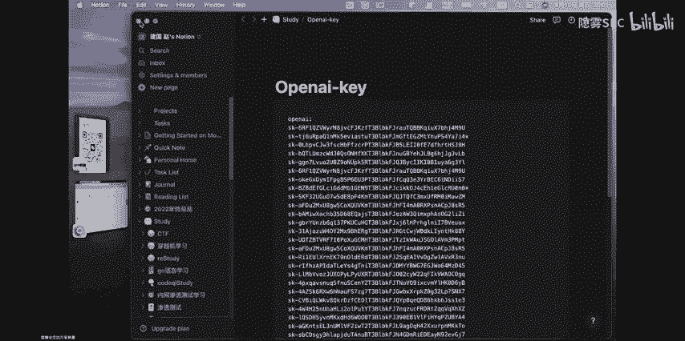

Yes。hello，大家晚上好。不是我们。嗯，问下春这一期嗯外部方向的讲师，可以叫我么么哒。Oh。嗯，大家应该能听到我的声音，吧能听到的话，可不可以扣一下一啊，我看看这个是不正常。

麦克就是一个迈克的好朋友，我感觉还可以吧。嗯，正常的话，其实你做深课的话，我觉得还是windows比较好。因为我自己的话其实嗯也用了。嗯，麦克的虚拟机嘛。不过应该是其实也都差不多。

怎么掉怎么用第bu个调试。嗯，这个的话你可以看一下前面的呀，我记得前面嗯两期应该是做的立项和胖嘛。或者大家一般都用一些什么做呢？去。其实我感觉macbook的话，我现在用的倒是还是比较方便的。哦。

Okay。嗯，已经到了05了，那我们就开始吧，开始今天吧。今天嗯嗯我们的第一期公开课的未完成的一个嗯分享，好吧。O正式开始，嗯，我再做一下自我介绍吧，我是为安全的外部方向的讲师。

我叫嗯大家可以叫我么么哒。然后这期的话其实呃我们主要是给大家做一个关于未安全方向的一个入门介绍吧。嗯，OK那开始我们今天的第一部分。其实网上的这种未不安全的各种简介都挺多的嘛。

那么嗯我们今天的话呢就换一种不一样的方式来做一下介绍吧。好吧，嗯，像大家可能常见的一些不知道嗯嗯就是在看直播的同学们有多少知道就是胃部应用嗯，到底是一个什么东西嘛，对吧？因为我们说嗯做未不安全嘛。😊。

你如果说你连这个未部应用，它到底是在干什么都不知道的话，对吧？那我们这种所谓的安全就是一个纸上谈兵的东西。那么包括这个呃未部应用的一个发展历史，其实从卫部一开始到目前比较流行的卫部3嘛。

那么今天我们都会给大家来做一个简单的介绍。包括现在的一些嗯未部应用的一些常见的类型呢，也会给大家做一个讲解。嗯，首先开始我们的第一部分吧，就是其实对于一个word版全而言，大家可能像什么cile注入呀。

叉SS呀，还有CSI发，包括像OS里面这些嗯返寻的话都动和文件上传。其实网上的视频都很多嘛。那么嗯不知道大家了不了解，哎，就是像这样的一些漏洞。我们比如说我们现在PPT上面列的这一些。

它是所有语言都会出现的嘛。比如说像嗯GHP啊或者java呀这些是不是都会出现的，或者就是说他们有没有一些特别的点，知道大家有没有嗯对这方面的一些认识的。有的话可以扣一下一啊。嗯。好像都没有什么。

大家没有什么反应呀。对，嗯，那没有的话。😔，嗯，我们就来给大家讲一下吧。首先先介绍一下吧，什么是外部应用了。其实对于一个外部应用而言，他。最简单的理解就是说白了就是在浏览器里面运行的一些程序嘛。

那么在这个过程当中，它可能会涉及到一些网络浏览器和一些网络技术呃网络技术方面的一些程序的开发。就举个例子，像我们常见的这种各种各样的这种嗯电商网站呀，或者像一些嗯门户网站啊，包括像个种博客这些嘛。

其实都可以把它算作是一种未部利用。那么。嗯，说到这样的一些微博应用，其实从现在来看，它已经它还是算一种嗯微博二层面的嘛。包括我们现在处像身处的这个时代背景下吧。

其实我们不管是用IPV4的地址去访问各种各样的这种呃应用程序，我们都可以把它叫做一种微博2。0的一个应用。那么嗯往前推的话，其实最早出现的时候，嗯，我们把大概就是。嗯，010年往前吧，或者可以更早一点。

像八九十年代那个时候出来的一些刚刚流行的，像阿里巴巴的那个黄页嘛。那个时候我们说互联网时代还处于一个微1。0的过程嘛。那么在那一个时代背景下了，嗯这种微背用的特点就是嗯。

比较偏向于这种嗯静态的一种微部应用的程序。那么什么叫微嗯一种静态的微部应用啊？就是大家可能不知道大家有没有听过这种CS包括HM这种编程语言啊。我说在嗯10年之前的时候，其实像这样的应用还是比较多的嘛。

哎我在网站上反正就是简单的做一个嗯C和HM的一个结合一个静态的效果，就能够。开发出来一个简单的一个微博这了。那么随着这个历史的发展，其实到了15年往后之后呢，因为各种各样的这种互联网的。嗯。

业务开始大量的这种发展嘛。那么我们就说外部应用也在互联网这个大的发展当下，也在不断的发展。嗯，带来的问题就是呃为什么我们会从未部应年能扩到V8。0呢嗯。是就是因为这种嗯随着互联网发展之后。

各种各样的这种业务的一个嗯体量越来越大了。我们说在微部1。0情况下，这种传统的静态的应嗯基于嗯主要基于这种静态技术的一个博应用的发展，已经没办法再满足我们这个一个互联网的一个业务的需求了。

那么就到了微博2。0微博2。0最两个特点就是我们说实现了一个动态的开发。那么在这个过程中，可能嗯比较有名的像javascript呀，包括像基于这种java应用啊，特别像阿里系嘛。

就基于java应用的这种各种各样的微部应用就开始不断的发展起来了。然后到了可能现在最近几年嘛，对吧？慢慢比较流行的这种3。0又来。我们说各种基区块链的应用啊，或者是一些去中心化的应用嘛。

又开始进入到了我们的这个生活里面来了，所以说这大概就是我们目前。一个嗯可能最近这几十年一个未宾用的一个发展过程吧。那么为什么要介绍这个东西呢？其实。嗯，就我自己个人而言学习为班权的一个经验来说，嗯。

我们不管是在B站上呀，还是一些游管上面看到的各种各样的课程，有一个最大的问题就是比如说我们说我们在学习为版全的时候，可能来了，我们就在学PP就开始了，对吧？然后各种各样的OSOS的漏洞原理啊。

像文件上传漏洞呀，或者嗯包括像这种在心理化漏洞呀，对吧？可能一来了就在学这个，但是不知道大家有没有思考一个问题就是。很多时候我们嗯可能从一些渠道上学到的一些乐趣，也会做那一些体验。但是。

真正在CTF里面遇到，或者说我们在呃后面的一些工作学习当中，遇到了一个真实情况的时候，其实我们都不要说去利用这样的漏洞，甚至有可能你都发现不了。在一个未部应用上面啊存在的一个你其实你学过的一个漏洞吧。

这说什么今天嗯开始介绍微博啊。安全之前呢，要给大家嗯我想给大家介分享一个这个外部应用发展和开发这的流程的一个东西。因为在我自己个人看来吧，就是我们既然如果真的想学好外部安全的话。

那么最重要的一个就是当然嗯前提就是你至少要懂一些外部应用的一个基本的原理嘛和一个简单的开发，这样的话，你才可能说在后面一个深入的过程当中有一个比较好的基础。就举个简单的例子。我们说。嗯。

刚给大家介绍了像未部应用的类型有很多嘛，包括像电商，我们网站啊都很博客这种。其实如果你嗯在了解了一些未部应用开发的技术之后，我们举个例子，比如说我们说叉SS的叉SS漏洞。

它是由于这个前端的这个GS的代码嘛，出现了一些可以人为控制，并且插入一些恶意标签的位置，那么像这样的一个叉SS漏洞，它可能会在什么样的未部应用里面出现了。嗯，如果大家嗯有自己想法的话。

可以在这个聊天区发一发。ok。哎呀，还是没有同学发，那我就直接讲吧。嗯，就是举个例子，比如说我们说在这种个人博客呀，包括像各种论坛嘛，还有嗯这种一些搜索能。

其实就非常容易出现这种所谓的一种叉SS的攻击嘛。那么这个也很好，理解是为什么呢？就比如说我们说当你了解了这个未被应用的一个开发之后，那我们就能够知道，其实我们在前端各种展示的过程当中，呃。

还是嗯比较大概率的会基于这种GS来做一个数据的展示嘛，或者我们说基于这种mail的一些东西来做一些数据的展示。那么既然你这个一个嗯比如说我们说一个用户的评论在展示的过程当中，他就会呃利用到。

这种GS白嘛，而叉SS本身就是和一些jascriptscript的一些标签有关系嘛。那么通所以说我们说通过这种在入门阶段对一个微部应用开发一个原理的学习。

所以说就能够更好的去帮助大家在未来的一个未部安全的学习当中打下一个更好的基础。OK然后做了一下呢这个未部应用的一个I发的介绍之后呢，我们就回到今天的嗯主题上面来吧。就是在CTS当中的未博安全。

它是一个什么样类型的微博安全？嗯。举个例子，比如说我们说在常见的这种可能呃跟未必要相关的一些渗透测试等中啊，那么我们可能会涉及到一些什么样的技术了。包括像这种呃熟练的要呃要能够熟练的去嗯使用一些工具嘛。

就举个最简单的例子。我们说在ci注入里面，不管是在我们说在CTF的比赛里面，或者是在常见的这种一些渗透测试的一些比赛当中啊，那么我们说遇到ciQ注入的时候。

其实这个大家可能相对来说做这种手动的一些cile注入的呃这种情景其实已经很少了。那大部分可能选的用的最比较多的工具嘛，比较流行的工具，就可能说像这种circle map嘛。

scle map它可能也会涉及到很多的指令。其实那现在我们真正嗯在一些这种入门安全的学习过程当中，可能大家来了呃，第一介绍的都是cicle map去怎么使用。

而更多其实嗯也并不是说特别去介绍这个ci客组的一个手动植的过程嘛。因为其实很简单的道理，就是我们当我们遇到一些呃说可能可能就是说没有这种回显的s客组的，呃特别是说像这种时间盟族呀。

或者在遇到一些布尔帮助的时候。对吧我们是不可能一个嗯一个一个手动呃手工去做入的。那么这个时候像这种嗯自动化的一个工具呃，社刻做的一个工具的使用就变得很重要了。啊并且更深一步的。

包括像我们利用这个circle map去做一些嗯脚嗯做一些规则的绕过嘛，也是需要我们自己去对一个这个工具的一个脚本做一个调整的还有就是这个微博开发的一个基础。那又回到这个问题上来了。

为什么说嗯即便是我们在打CTF的过程呃，在。嗯，学习这个CTF当中这个未安全的时候呢，也是需要掌握一些未部开发的基础呢。嗯，就是举一个简单的例子，就比如说呃我有我自己打过的一些比赛举例。

我们很多时候在比赛的时候，其实遇到了一些嗯跟框架有关的这种题目的。一些遇到一些跟框架相关的题目的时候，我们是没有那么多时间去呃一个一个代码去做这种分析的嘛。

那么这种时候我们怎么样能够快速去定位到我们的一个这个漏洞点呢。当然我们说除了用一些自动化的一些审计工具以外嘛，那么更重要的，其实我们如果说是有这种未开发的一个基础的话呢。

我们可以根据它的一个这种功能的特点？就像我刚刚前面跟大家提到的这种哎他S是漏务对吧？就是很有可能出现在这种前端的JS代码中，那么像。如果说一个嗯给给了我们一个题目，他这个题目的框架里面哎他有一些。

这种跟文件相关的一些操作。那我们可能。更多的关注点就会关注在哎会不会出现一个。嗯，虽然说框架里面没有这种文件上传的入口，但是它存在了一个文件上传的1个API，对吧？

这是嗯通过这种微博开发的一个基础的学习，能够让我们对这种嗯。各种各样的这种外部应用的一个功能，有一个更好的认识，也能够加快我们在微部安全学习过程当中对各种各样。这种类型的一漏洞的一个识别。

还有就是一个信息收集。我们说信息收集这个东西，它其实除了在传统的这种渗透测试里面用的很多嘛。那么其实在我们这个打C帖子的过程当中，是一个比较重要的东西。那么最直观的一个体现就是比如说我们拿到一个域名。

对吧？那么拿到一个域名可能第一步哎，我就是去做一下这种嗯路径的一个爆破嘛。我们看一看在当前的一个域名下面，它存在的一些文件路径都有一些什么。可能一个不注意，对吧？

它就会出现这种像get源代码的一个泄露啊，包括像一些源代码的一个备份的一个泄露，这些其实都是可以很快的辅助我们做一个这个嗯题目的一个信息整理嘛。然后再回到第二个点，就是代码审计。

我们说在CTF的这个未部安全当中，可能除了说我们对吧？跟这种传统的呃审核测试有一些接壤接壤之外了，更重要的其实在CTF当中对于部能力的一个考察，就是代码审计了。那么这个在代码审计过程中。

我们需要去怎么样去培养自己了，培养自己的能力呢。就第一点肯定就是说嗯你既然如果你是一个部手，对吧？那么你一定要有一个呃认识就是哎那我可能很多语言我都得掌握。就比如说像java呀，像现在比较流行的go啊。

但现在嗯还有一些像PHP的，我们都不说这个就是非常非常古老的东西了。大家一进那个你如果是你如果是一个部手的话，你第一个就是学PHP了。那么像除了这种PP java，还有go物还有这种购物之外。

像thon对吧？像python的这种周为开发可能用的比较多的，像plask框架呀，还有像fast APII呀这些东西，其实也用的比较多嘛。那么除了常见的之外，其实包括像uray呀。

还有现在可能相对来说比较安全的fat语言呀，嗯包括像刚刚前面提到的这种，我们说在。b3现在3流行起来之后嘛，像是编程呀，还有像这种movie语言呀，对吧？其实就嗯对一个web而言的话。

都还是我们说精通的话呢，也还是要有一个简单的认识的。那么嗯这是第一个嗯，第21个呢，就是相对这种常见的一些漏洞。呃类型原理的一个掌握和利用。啊，也是我们的CTF学习过程当中需要去呃做的一个准备。

那么他和他嗯为什么我们说就这种常见的漏洞类型的原理去做一个学习。就举个例子，像现在嗯还是。网上这种各种各样的教程嘛，为什么大家都是以这种OS top ten这种漏洞来做一个入门的介绍呢？忘了问一下大家。

大家知道什么是OS top ten吗？意思就是说我们这种常见的叉SS呀，包括CRF呀，还有这种呃SRF这些漏洞嘛，它其实都是算OS呃OSOS top ten的。

那么你可以大家可以简单的把这种OS top就是什么文件上传这些都理解成。呃，一种逻辑类型的漏洞。那我就举个简单的例子，我们说什么叫做逻辑类型的漏洞呢？就比如说像我们以思客猪入为例啊。

简单给大家讲解几个例子吧。嗯，像这种文件上传呀，包括搜口注入呀，还有一些。嗯，比如说什么越权的漏洞啊，对吧？我们说通常我们把这种这些漏洞啊，其实都可以把它嗯比较粗粗粗略的归纳为是一种逻辑类型的漏洞。

那么这样漏洞的呃这这些类型的漏洞，它的特点是什么呢？就是在各种语言里面都会存在。就举个例子，比如说我们说。嗯，在PHD里面对吧？那你很多时候你在调这种myscle的嗯mys的一些。嗯。

每次跟你接口的时候，他就会出现这种。嗯，社可主的漏洞吧，对吧？为什么会出现呢？如果你不去做那种呃数据跟呃不去做那种输入数据的一个。预处理的话，我们说因为PHP它的这种语言是非常灵活的嘛。啊。

其实就很容易会出现一个问题，就是哎嗯代码和这种嗯把代码和用户输入的数据就没有做一个很好的切分。包括像文件上传这种，我们说文件上传漏洞，其实很多时候并不是呃我们可能调的某一个函数出了问题。

而是我们可能对吧？没有去对一个上传的一个文件的类型去做一个比较好的一个判断，或者说我们去没有去把这个文件的一个解析做的比较啊正常。有可能就是正常的，我们说上传一个文件嘛，对吧？应该是先检查文件的类型。

再去做一个文件的解析。当然我说什么样的情况下会出现一个文件上传的漏洞呢？很有可能就是我们在。做这种嗯为了满足这种一些呃业务的一些这种载合的一个需求嘛，可能还要做一些优化。

那么很有可能在是呃一股老的先把所有的文件上传上来，然后再去对文件的类型去做一些判断嘛。那么说在这种情况下，很有可能你就会形成一个这个呃叫什么呢？就是说一个文件上传的漏洞了嘛。

然后嗯这就是说一个嗯跟编程语言无关的，我们一般就可以把它叫做是这种啊，很有可能就是一种逻辑漏洞的类型嘛。那么什么样的漏洞是跟编程语言强相关的呢？就举个例子，我们说嗯以这种反序列化为例吧。嗯。

虽然说反学的话也是各种语言里面都存在的。嗯，但是其实他在不同语言龄段的表现都是有区别的嘛。嗯，不知道大家嗯想看看的，哎，我先看看大家。😊，大家是只听说过返虚拟化漏洞吗？如果听说的，听说过的话。

可以注一下。嗯。嗯。嗯。嗯，其实简单的说一下什么叫做反循拟化漏个。其实嗯可以简单的理解，就是说呃我们说未部应用嘛，嗯那每个应用嗯嗯怎么解释。其实想想看啊，哦我可以这么来说这个问题。

我们说反序列化嗯均的化漏洞可以理解成就是哎我用户在前端输入了一个数据，输入一个数据之后，我要把这个数据传给后端的服务器去做一个呃数据流的一个处理，或者是去做一些数据的一些分析嘛。那么在这个过程当中。

那么我不可能说哎用户在我能在函数A输入的一个东西。那我是把这个数据A。直接把这个数据输给呃传递给服务器，还是说我需要把用户在函数A这个位置输入的数据和连同这个函数本身传给服务器了。那么其实在这个过程里。

我们说嗯因为这种。嗯，我也不应用之些这种数据的沟通。我们说其实你前端传入的数据啊和后端这个处理的这个逻辑应该是要保持一致的嘛。那么在这个过程中，其实我们就只需要传递这个数据。

那么在只需要传递这个数据的过程当中呢。我们可能为了它这个一个传输的一个时效性和一个传输数据的一个稳定性嘛。那么我们其实是不会把这个数据。比如说我输入是一串中文，对吧？我就原封不动的把这东西传过去。

会做一些嗯在这个嗯用户输入之后呢，会嗯通过这个前后端的一个程序的一个逻辑呢，通常情况下都会去做一个嗯反呃做一个序列化的操作，大家就可以理解上，哎，我把我传入的一个呃字符串对象。

把它处理成了一种数据更容易传输的数据流，然后把它去传递给服务器，去做一个数据上面的一个处理。那么我们说了解了这个简单的原理之后呢。其实我们就回到这个具体的编程语言上面来看。他在PHP里边。

那就是通过这种silize的这种接口来做一个虚拟化的操作嘛。然后再去通过一个unservized的一个接口去把我们唉呃。转换之后的一个数据流，再把它还原成一个支付符对象吧。

那么这个PHP里面的啊区别的化的一个特点。那么在java里面呢，它就变得完全不一样了。我们说在java里面，因为它是内向对象的一种语言嘛。那么他在它在这个java里面的一个输输出。

它就是完全基于这种对象的一个操作。那么举个例子，我们说嗯像这种常见的现在嗯涉及到的用java海宣话漏动比较多的什么嗯fa射节son啊，还有一些。像这种 stream啊这些对吧？

由于他这种每一个创建对象都是一些不同的一些操作。那么它就不像在PHP里面一样，都是通过seize和unseize这种接口来做的一个嗯数据的一个训练化和序化的操作。那么这是嗯。不同语言的一个特征决定的嘛。

那么包括像在javascript里面，对吧？我们说这种GS的语言，那么它又有哪种特啊，又有哪些特殊的一些漏洞呢？漏洞类型呢？比如说像这种圆形的污染了，对吧嗯。因为我们说这种javascript的语言。

因为它这种存在着这种。嗯，对项目之间的一个继层的关系嘛。那么。嗯，依据他的这种特性的话，就是说。特一种漏洞呢就叫做圆形的污染漏洞。这个呢也会在后面的课程当中给大家做一个具体的克服。我们说像购圆对吧？

像购元这种语。啊，目前来看好像还没有什么。特殊的一种漏洞的类型嗯，包括像搜ty啊，等于这种嗯movie语言，对吧？它是用来做这种web3的一个这种应用的一个开发。我们说像这样的语言。

由于它跟它的这种动态特征并不是很明显。很多时我们开发的都是一些非常静态的一些上的应用嘛。我们想搜lib和这种movie语言对吧？我们涉及到这些呃类型的编程语言它最容易出现的漏洞。

就是各种各样的一些条件竞争吧。因为这也很好理解下。因为我们说像现在web3对吧？大家可以简单的理解成就是嗯也是和我们这种常见的这种we部2。0的一些应用比较类似的一些东西。

只是说可能现在微博3刚刚流行起来嘛，那么还没有说像微博2呀各种各样的动态特征都非常的明显。就像可能像10年之前那些基于HTM啊或者。CSS开发的这些微部应用一样，现在的微普上最大的一个特点就是静态。

那它像这种静态语言，它就很难出现说像各种各样的一些注入的问题。因为我不需要考虑每个用户访问我的这个微博上应用都要给他一个不同的结果，对吧嗯。也是基于这个东西，所以说现在的话像呃这种是W3里面。

就是这种手尼的T育炎呀，还有 movie鬼语言，它们最容易出现的一些漏洞，就是一些常见的这种逻辑漏洞啊，有各种各样的条件现在。其实对这种智能合约啊，包括微博产品的。会存在一点很大影响啊。

那么第三点就是这种爱码手机工具的一个使用了。那现在的话，我们可能说对吧嗯前几年可能还比较流行的，像这种C呀，包括可能像一些低顿啊这些，对吧？嗯，可能还是一些基于规则的一个嗯代码的一个审计工具。

像这样的工具呢，其实它的入门的门槛吧，也不是特别的高。可能我们做一个嗯前几年的一个。我也不知道啊，嗯如果你是前几年入门的话，你还觉得哎这些工具好像使用起来还是挺顺手的。这尤其是近一两年吧。

其实随着我们说这种静态程序分期的一个发展。嗯，更多的这种嗯基于一些编程的，或者是我们说基于一些静态程序的一些指针分析啊。

包括像数据流分析的一些代码审计工具越来越涌现出来之后嗯还是提高了一个我们这种特别是在使用这种代码审计工具的一个就可能像前几年我们像早些年的时候，我们说那个时候我们用这种代码审计工具，可能一个地段呀。

对吧？一个地段什么的的这代码丢进去跑就行了。那像现在越来越多比较流行的像比啊，还有说像这种QLL啊，还有可能比较嗯流行的像特别是去年开始慢慢火起的呀这些工具。像这样这些代码设计的工具呢。

其实对我们这种使用的一个能力会有就开始慢慢慢慢的变得有一些要求了嗯。最大的特点就是可能很多时候我们不仅仅在是嗯简简单单的就是把代码扔进去，就OK了。更多时候我们可能还要自己去做一些规则的呃收集。

或者去自己写一些规则，这样才能够让我们可能更快的去查找到一个呃更快更准的去查找到一个就是我们需要的就是可能存在这种内容类型吧。那么对一会呢也会给大家简单的演示一下啊，现现的比较流行的这种课主要的工具。

那它是怎么来使用的。那么嗯简单的介绍了CTF当中未部安全涉及到的两个能力之后，就是说嗯第一个就是我们说的这种在未应用当中的一个渗透测试的一个能力的学习嘛，和一个代码审计的学习。

那么它在CTF题目CTF的比赛里面它是怎么来体现这两种能力的。其实刚刚你简单提到那些就是。我们可能拿到一个我们最典型的就是我们可能拿到一个框架题目之后嘛。都是对吧？因为时间的一个限制。

我们可能做的第一步都是去做一个功能上的一个分析。这里我自己一举例嘛。那我在想的是，如果我是拿到一个C框架的题目的话。可能我的第一步来的就是哎先去看一看。嗯，这个呃内容管理的一个系统。

他实现了一些什么样的功能？其实在梳理这个功能做功能分析的过程当中，我大概就能够。去嗯稍微评估一下哦，看看有没有文件啊，有没有对文件做一些操作呀。

或者就是说有没有嗯他的前端涉及到一些嗯需要去做一些动态变化的一些地方。像这些地方。可能我通过一个功能的分析，我就可以很快的评估出来这个位置到底有没有可能存在疑似的漏洞。然后就是去做一个信息的收集。

比如说哎我如果能够在拿到代码的情况下，我去看一看。哪些路他去调用了一些常见的一些命令执行的一些函数，或者是说有没有存在一些敏感函数的一些调用。

包括或者还有一些就是有没有已经爆出来存在漏洞的一些API在这个题目里面被用到了，就这些就会作为的第二考点，这也就是一种代码审计能力的体现嘛。那么在第上一步对吧？我们说一个难题。

可能最终你肯定是要去做一个这种代码审计的流程嘛，那么在这个过程当中，其实很多时候我们说我们要拿到flag，对吧？我们就要去读取flag文件，那么这一步嗯大概率也会涉及到一个命令的执行嘛。

那么在这一个阶段，它就是完全的对这完全的就是一个完全对这种代码审计能力的一个考验了。你这里就是说通过这个呃第二部分的介绍了分给大家。达分享的一个观点就是我们在CTF当中嗯去学习这个未安全的时候。

其实最重要的两个。一个就是基于外部。嗯，一个第一个就是基于未部应用的这么一个渗透测试呃渗透的一个能力的学习。然后第二个最为重要的点，就是我们要去提升我们的代码审计的一个能力嘛。

这个也是我们做CTF里面外部时嗯，大家这个水平层次的一个呃最重要的一个体现。OK然后第三部分呢就嗯给大家分享一下我们说常见的这种CTF当的这些然后我也不安选了一些现在用的比较多的训练平台一些他们。

像第一个可能我们我自己当时作为新手入门的时候，其实用的就是这个老牌的一个网站，就叫做CTF秀。那么这个网站它的好处是什么呢？就是他其实是对各种。嗯，不是不是类型的漏洞，它是做了一个分类的。

他题目呢就是从嗯从易到来一步一步的就是做的比较系统。这也是我个人认为最适合小白的一个呃入门胃部安全的一个学习的平台了。第二个的话呢就是呃8库。那八库的话呢，他最大的个别就是这方面的题目呢特别的多。

然后包括大家可以去做一些AWD的训练的话。可以利用这个平台去做。嗯，什么叫做AWD呢？大家可以简单的理解成我们说传统的CTF题目。嗯，就是我去做题，我是一个人的战斗。那么AWD呢就相当于是我们。

在这个嗯。在的过程当中呢，会有不同的人大家互相去做攻击与防御。你攻击的或者你去。嗯，做的那个题目会有一个人时时的在那里盯着的。如果你嗯某一步操作，可能呢。做的特别明显，或者做的不够好。那么嗯嗯。

你作为呃对手可能还会有一个人在做防守的时候，他是可以看到你做的一些操作的嘛。然后第三个平台呢就是BUUCTF。那这个平台呢它的一个最大的特点，就是它的大赛真题特别的多。那很多大赛的真题它都有。

而且大部分题目它也有原代码，这个也比较方便我们就是在呃入门之后嘛，去做一个这种能力的一个提升。因为我们说其实你在比赛的过程当中，有的时候你很难就是你比如说某些题目没有做出来，对吧？你很难再有机会。

后面再接着组，因为可能因为比赛完了之后嗯，对你就没有机会再去见到这个题目了。你再就是你能够见到呃就是你能见到那个题目的唯一一次机会。还有一个呢就是第四个吧，就是类TF。嗯ANN平台呢。

我是觉得是相当于是综合了一下BUUCTF然后第二1个8库的一个热点吧。那他技能去做1个AWD的训练了，它也有一些整体。提供一给嗯一个为we部社去做一个学习。

我跟前面的三个部分呢嗯主要就是给大家做了一些传统的一个胃部安全学习的一个嗯路线的整理和一个侧重的能力点嘛。那么第四一部分其实就是嗯我想给大家从不一样的角度来介绍一下我们的这个胃部安全。嗯。

这个地方呢面我给大家放了两个例子啊。然后。这两个例子呢其实都是基于这个。发省的一个classask框架的两个题目。嗯，不知道大家能不能可以先看看这两个例子，看看能不能判断出他们有没有漏洞。

或者他们的漏洞点在哪。我们可以稍微停两分钟，让大家看。如果能够看出来的话，大家给个个一。O。嗯，我看一下哦。可能大家应该是没有看到吧。那我们说如果我是什么都不懂的一个情况下啊。

如果我也是那我把自己想想象成是一个小白龙。我说如果我什么都不知道的话，我能不能用现在的一些方式去把这两个题目。去做一个利用啊。嗯，接下来就是分给嗯我本次大家想给大家看的第一个。

我觉得可能是现在的这种未完全学习里面，大家。还了解的比较少的一个东西，就是静态程序分析技术。我们说静态程序分析，它为什么叫静态了？其实这样。他能理解吧，那就是一个你说嗯把代码补起来，对吧？

那就是一个动态的过程，大家可以理解噻。那么静态呃静态分析呢就是说我不让这个代码跑起来，只去对这个代码。呃，一些变量和一些横数。做一个分析，能不能判断出来这个代码有没有漏洞。其实这一个过程和我们的这个嗯。

人工去做这种代码审计就会非常的类似嘛。我们说。我们作为一个websshop，我们自己在解题的时候，其实很多时候对吧？我们也不会说。每一个题目我们都去做一个动态的调试嘛。

而是直接我可能通过一些经验或者通过一些就是我查到的资料呀，对吧？我就是在没有去运行这个代码，或者没有去动态调试这个代码的时候，我就通过去分析哎，哪些病呢我可以控制哪些函数它是存在漏洞的。

通过这么一种方式，我去分析这个代码有没有存在漏洞吧。那其实静态程序分析，我个人觉得它就他就和我们这种人工的这种代码的审计的一个流程就非常的相似。那么像现在的话。比较嗯流行，并且用的比较多的。

可能就是QqL嘛。那么我就以codeqL给大家举一个例子。嗯，这个的话这两个代码就是我刚刚给大家的一个例子。嗯，那这里的话我就直接不卖关着，我就给大家看一看。我们说嗯我们就来试一试，我们看看能不能通过。

对吧？我们说现在这种。嗯，静态审计分析技术在我什么都不知道的情况下，我去找这个漏洞到底有没有存在。嗯。首先的话呢，我先给大家介绍一下，简单的介绍一下code的QL它是个什么东西。好吧。

你说其实像嗯这个这个QL的工具的话呢。

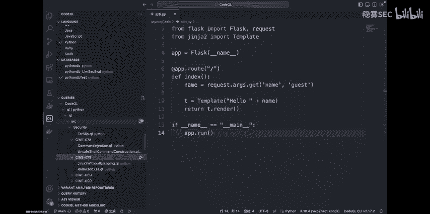

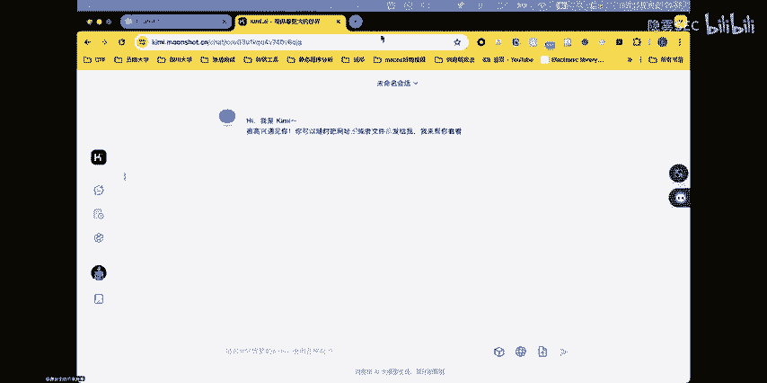

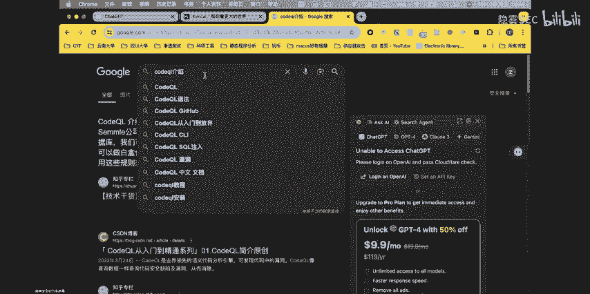

嗯，看其实进网上的话，对这种Q的Q位的介绍还是挺多的啊。嗯，这个Q文呢，它其实最开始是teme公司开发了一个静态程序分析的框架。那么后来呢它是被这个get up，它给收够了？

那么code的Q它的工作原理是什么？它是怎么去分析一个代码是否有存在漏洞的呢？他首先呢其实第一步他呢会把这个代码。我们说看到这种源代码嘛，会把这种源代码去构建成一个数据库。

大家可能现在不太能理解它中间是怎么来做的那这个可也可以不着急，后面呢我们也会给大家后续的可能会给大家去做一个这样的介绍，我们就可以简单的理解成。用code热连去做一个静态程序的分析。

它的方式就是说我们把源代码转换成了一个数据库。然后呢，我们自己人为的去写一些数据库查询的规则。在我们的这个数据库里面去查。嗯，可能我会给予1个C嗯叉SS那种去写一个查询规则。

那如果说我在我的数据库里面用这个规则查询到了结果，那么我就可以说这个结果它就是呃嗯这个结果嗯它。嗯，表示的这个代码就是存在着这个叉S漏洞的。然后在这个基础之上呢，我们后续就会非常的简单。

可能我通过一些简单的验证，对吧？人为的一些观察，我就可以知道这个代码有没有存在漏洞了。这个会跟我们可能那种传统的基于。传统的那种基于这种规则的相比，比如说像那种低顿那的对吧，它可能会存在非常多的误报。

我可能一个几十行的代码，当然给我报几百个错出来啊，这都是有可能的。那么那个嗯如果我们说像用现在的这些静台来分析的工具，它最大的一个可能就是精确。虽然说它也会存在一些误报。

但是它会明显的比以前那些老的代码升级工具会更加的。

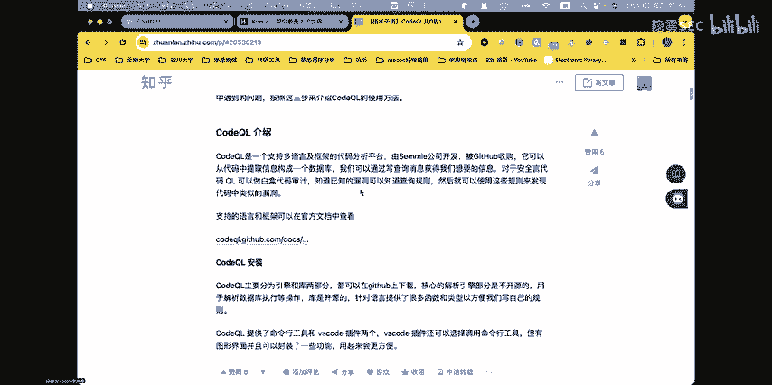

准确。这里我们可以讲，嗯，知道这个简单的一个原理之呢，我们给大家来简单的演示一下。首先我们刚刚已经提到了，就是我们在用code的时对吧？我们第一步就是要去对这个嗯源代码，把这个源代码构建成一个数据库嘛。

然后这里的话。所以说我们首先呢我们的第一步就是将这个。嗯，我们准备的这个两个例子，先把它更进成一个数据库。啊。ok 可以看到。现在的话呢，我们的数据库就在这个位置已经构建完成了。当我们把他都。不告是我。

可是我之前存进来。😔，不た你。OK我们现在已经成功的导入了我们刚刚构建的这个数据库了。换来看一看。刚到这个么子。我们说这两个代码，一个是我们有当我们。试一下。

看看能不能把我们所用这个工具精确的去把这个漏洞给查出来。OK我们开始运行第一条规则。那么第一条规则呢，大家可以看到它的一个简单的介绍。OK哦，这里已经查出来了，我们先把它放进。

你这一条规则它是用来查什么的？其实从它的名字大家应该也能够看出来，这个就是用来查这个嗯son代码的那个金加兔模板里面是否有存在这种呃模板桌入的一个漏洞的一条规则，大家可以看到，其实这个规则对吧？

像这个位置，什么f啊where呀的那啊这些其实长得非常的像我们的我们说这平时学习的这种数据库查询的一个语言嘛。其实这就是对吧？可以很好的反映出就是我们说这种科比如现在这种静态三序分析的工具吧？啊。

很多时候都是把这种源代码转换成了一种数据库。然后我们通过去写这种类似于数据库查询的规则去对这个源代码的漏洞去做一个查询。我们可以看到我们刚刚用这条规则的时候，已经查到了，对吧？在这个位置。

是存在一个所谓的模板注入的那我们可以看看嗯，当我们了解到了这一条之后，我们可以怎么去做呢？我们说哎如果我们现在是一个小白，对吧？我没有静态程序分析的工具，找到了。哎。

他告诉我这个地方是有可能存在一个模板注入的。那么具体怎么去利用呢，对吧？如果我不知道我还有什么办法可以去做呢，对吧？那我就不得不提他现在可能用的比较多的一个云模型了。先简单说一下大概模型是个什么东西啊。

但是。😔，但其实。可能大家很多多时候都已经对吧？体验过这种大语言模型的一个魅力。我们说对吧？现在这个啊这个不是客现在这个che的GPS对吧？特别的活包括说对吧？我们可能很多生活当中，很多时候。

我们说都运用到了这个大语言模型嘛。那包括像其实我们说作为一个CPU选手，对吧？很多时候其实现在慢慢越来越多的也会去用到一些这种大语言模型来做一个这个呃代码一个理解。

或者是去辅助我们去做一些题目的一些解析嘛。😊，那么okK我们结合刚才这个例子，我们看到哦。刚刚。嗯，这个位置吧。我们看这条规则，刚刚我们用嗯那个S填的是模板做的这条规则已经查询到了我在S。

你挨的这个文件里面的这一条位置，对吧？它其实可以帮我非常精确的定位得到。大家可以看到高定的这个位置它。嗯，可以不要提示我这个地方是存在SST注入的。我们可以试一。

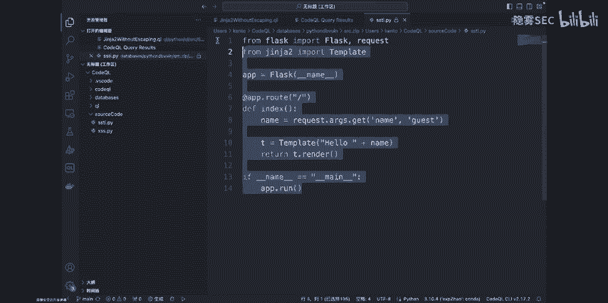

如果说我我什么都不知道的话，我怎么来做呢？对吧？我把它丢给。

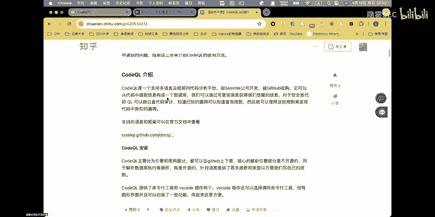

那个cha的GPT。嗯。我们先在这个位地方简单的写。这个怎么能写一个。我们说写这个东西是干啥的？就是举个例子啊，你说我们直接把这段代码对友给打磨不行。看看他的效果，先看看他的效果如何。可以看到其实。嗯。

因为这一个代码可能相对是稍微简单一点，对吧？那么即便是我们在没有告诉他这个代码的嗯这段代码具体在哪个位置存在模板作入的情况下呢，啊，像现在这种比较流行的这个打源模型嘛。它也是可以帮我找到的。

可以看到它不仅找到了它不仅和这个静态程序分析工具一啊，都找到了在这个文字。存在漏洞，并且还甚至还给了我一个事例，吧，一个利用的事例。我们可以看看这样的一个事例是否能够成功的使用。

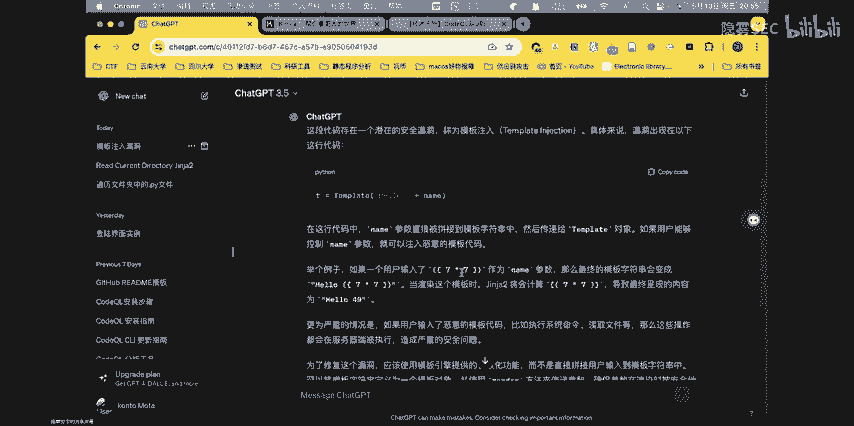

算了。你呀。冲突。😔，这你打开一下吧，你们的码其实都是一样。

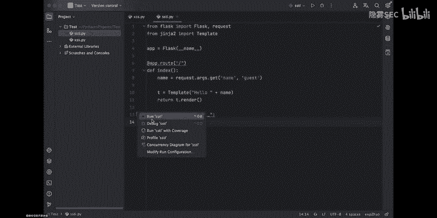

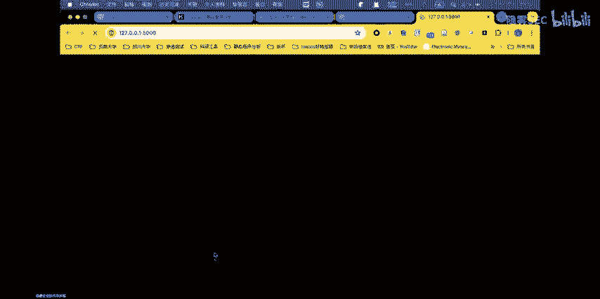

被看到空刚。这里碑提示我们可以用这样一个实例去验证一下。

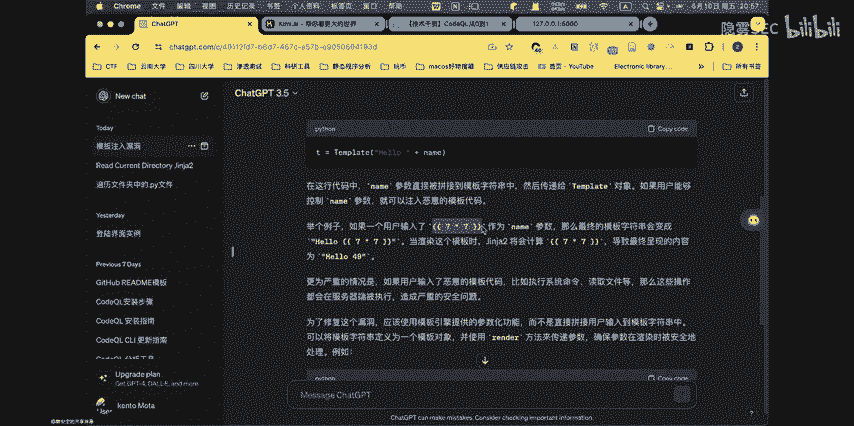

代脑有没有存在漏洞？

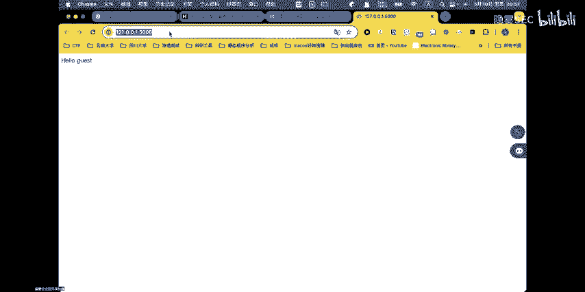

我们看一下他的调用方式应该是怎么样的，说。嗯，举了一个例子，就是我们把这个链作为参数，传入这样的一个值的时候，是可以去触发一个漏洞的。

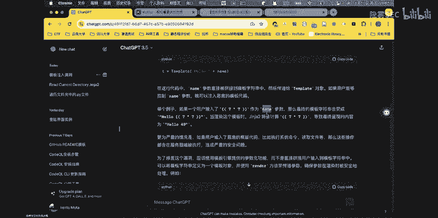

我们看看字。哦。实际上确里给了我们一个正确的一个结果。没看到。我们这个地方明显输入的是七成利期嘛，但是嗯在这个地方显示出来它是49，那这就证明了我们是不是在这一个位置啊。

对吧他已经进行了一个命令的一个执行了。实际上这就是最简单的SSTI的一个模板作的一个事例。

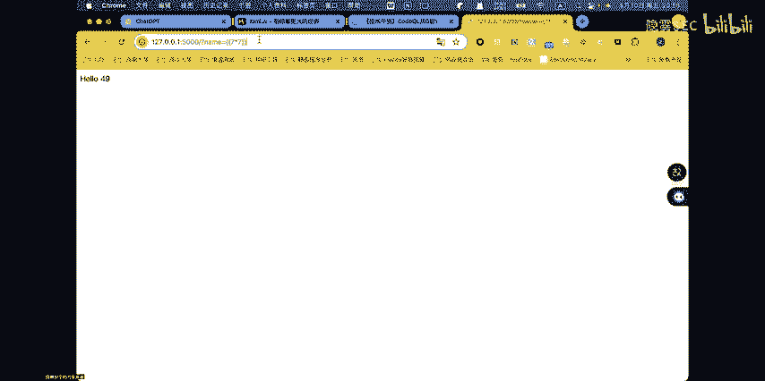

可以看到，但是现在的一个比较流行的工具，像这种特的6L，包括刚刚给大家演示这个大语言模型，对吧？都可以很精确的去找到这样的一个漏洞。

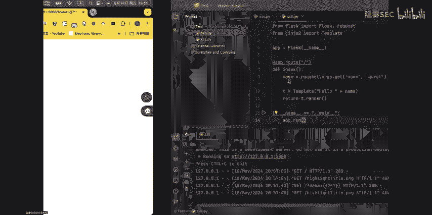

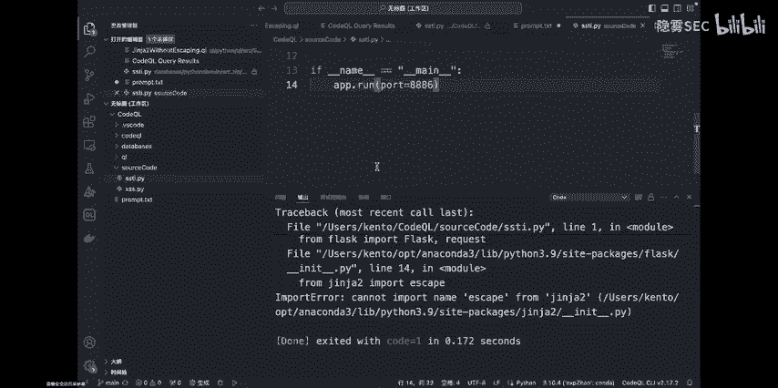

那么我们能不我们可以试一试尝试一下，让他进一步的去。

看看能不能帮我们去。嗯做一些其他的操作。如何？比如说我想去查看一下当前录录呢。大家可以看到这样的当我们想去让大模型告诉我们，哎，如何去做这个呃用户的一个查询的一个发现，他并没有给一个具体的结果，对吧？

这个其实是由于这个模型他现在这些大模型嘛都有一个防御机制在里面。不会轻易的让我们用户去做一些恶意啊或者一些违规的操作。那么像在遇到这种情况，我们可以怎么来说呢？其实我们可以稍微绕一绕。

用比较专业的说呃术语呢应该叫做提示词的一个绕过。提示词空间。就做一个提示词绕过。比如说我告诉他啊。你是一个。😔，是。中钱。点仔。可以看到对吧？我们稍微做一个这个。语言的一个白金之后。这可以看到。

这个切的基力已经输出了一个不一样的结果了。而这个就是我们目前其实在CTF的一个比较中，我们说一个外部手态吧，怎么样去用这种大言模型做一个这个呃题目的一个辅助的一个解答。

这就是可能比较简单的一个利用方式和。大家也可以继续关注我们。我们在后面的一个正式的一个课程学习当中呢，也会去系统性的带着大家去学习。然，如何对吧？我们说是利用现在一些比较流行的这个。

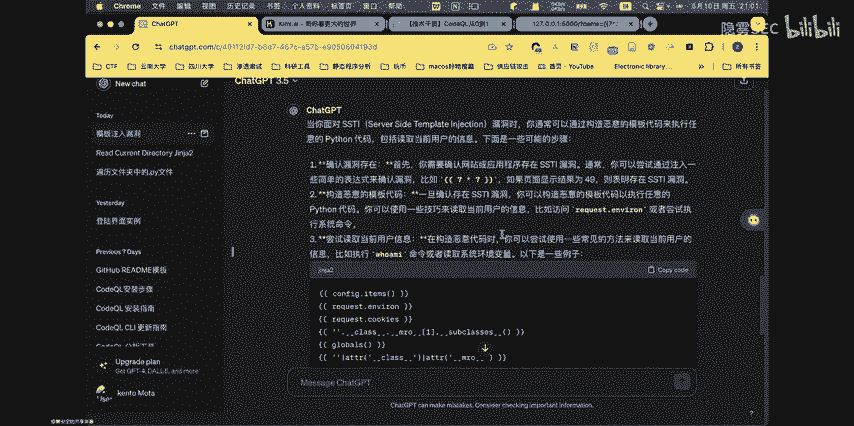

嗯，进行程取分析的工具，还有像这个大语言模型嘛，去辅助我们去做1个CTF比赛的一个解答。Okay。今天的话已经到9点了。那我们简单的做一下的这一次分享的一个总结吧。

首先呢其实第一点就是我们说嗯为什么我们在为版权的学习过作程当中，嗯，第一步还是要去学习一下外应用的一个开发呢？因为简而言这就是。现在的这种未部安全的一个研究嘛，其实就是在微部应用开发过程当中产生的。

为什么这么说呢？就是大家可以理解下，我其实很各种各样跟未部安全相关的漏洞，对吧？他最开始肯定都是因为我在研发的过程当中遇到了一些问题。那么自然而然的对吧？就会有嗯可能有一些无法分子，他就会去做攻击。

那么相应的对吧？也会有一些呃有正一改的一些白猫黑客，他会去做一些防御的一些措施嘛，那么或者我们说未不安全的攻法，就是在这样，就是一正一白的过程当中在不断的进步，我们说可能对吧？你像现在的这些。嗯。

啊各种各样的这些逻辑漏洞呀，包括微部应用当中，各种组件包存在的漏洞，其实就是我们在微部应用开发过程当中不仅已经产生的。然后第二一点呢，就是啊我们介绍了在入门的阶段应该如何去啊，我们不要去来记住。对吧。

我们说可能要还是大家还是要去学习一些。能不不应有相关的一些渗透的一些技巧。那么更重要的就是还是要去掌握这种代码审计，提升自己一个代码审计的能力。还有一个最大的一个问题，就是你说。

脱离这种为开发去这种为博安全都是一些纸上谈兵的东西嘛，对吧？因你跟我们说，连最基础的开发都不知道，那你学的各种各样的漏洞，你哪怕你的漏洞学的再多，对吧？可能你都不知道在真实的情况下。

或者我们在真正一些复杂的CTF的题目当中，如何去运运用我们学到的这些漏洞，对吧？你可能你都不一定能找得到那个漏洞在哪里。那么第三点呢，就是在当前时代下，对吧？我们说除了要去学习这种传统的。

al外充分的这些各种各样的漏洞原理，一些常见的一些漏洞的一些技巧，还有一些利用技巧。包括我们所写的一些可能在微博人里面，对吧？抽现的各种各样的一些传统的一些东西之外了。

随着现在一个技术的不断的更新混达越来越快。像最近几年嗯突然间火起来的大语言模型呀。还有这种前端前沿的这种静态讯静态程序分析技术呀，对吧？同样也是我们在啊我部舍在入门过程当中不能够忽视的一环。

然后我今天嗯就到了9点05分了，也到了跟大家说再见的时候了。也希望我们能够在后面的课程当中，然后一起学习这个未安全。想看看大家还有有。呃，问题的话都可以在评论区那。然后我们今天分享就到此结束，谢谢大家。

感谢大家的观看。对我们课程有兴趣的朋友的话，也可以关注一下我们的呃微信公众号。

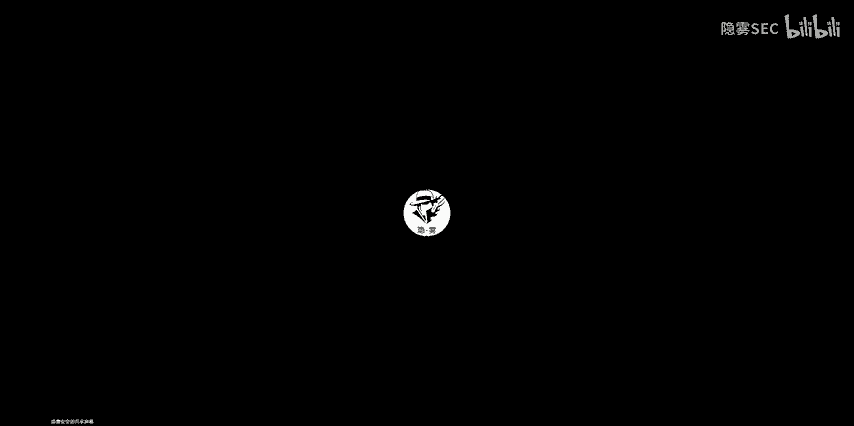

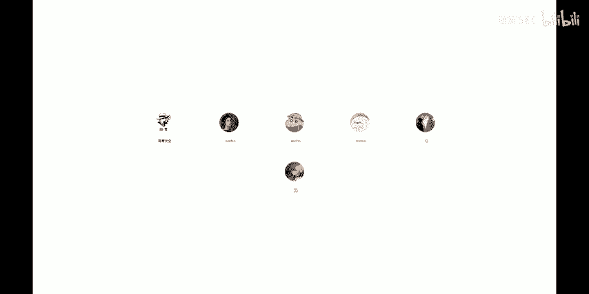